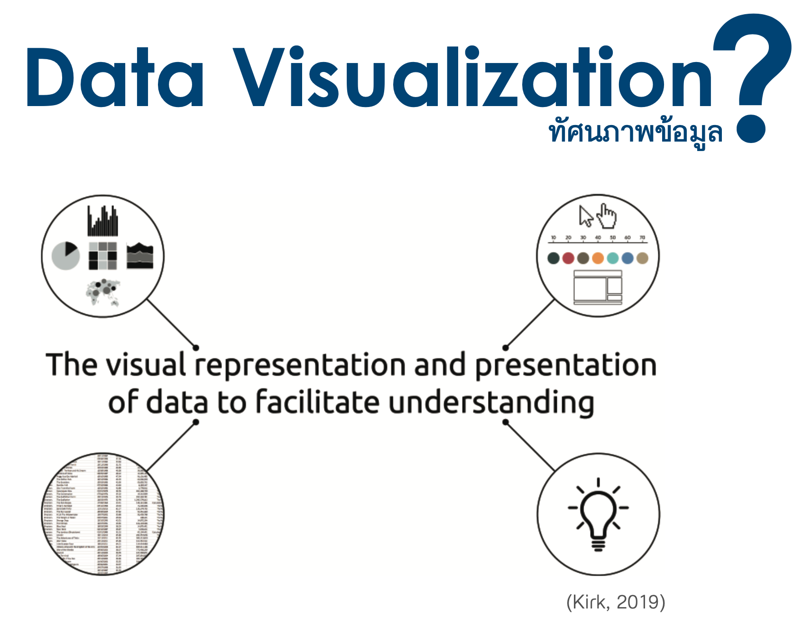
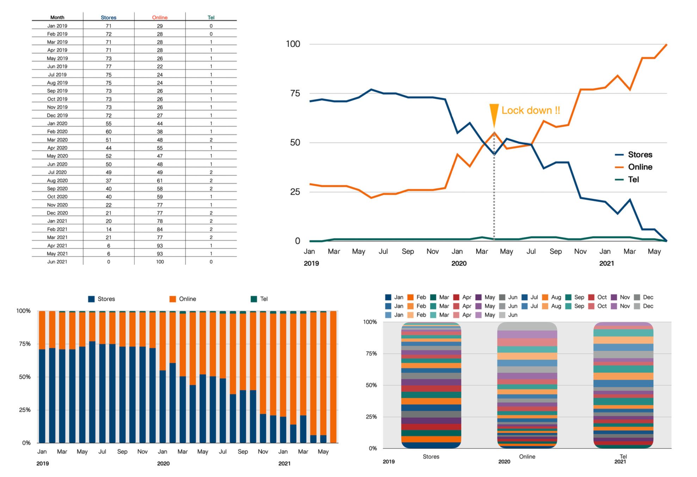
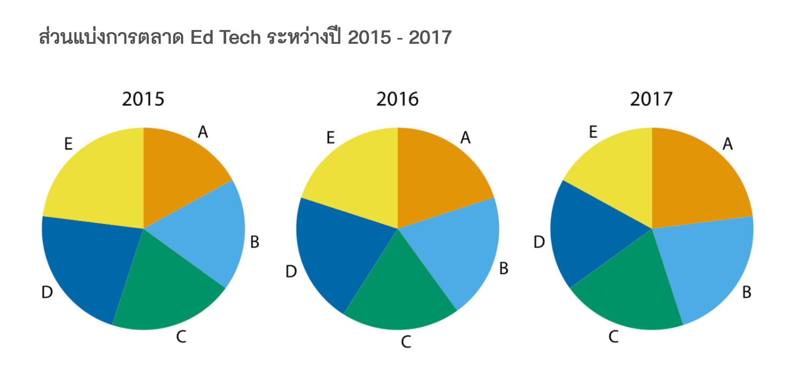
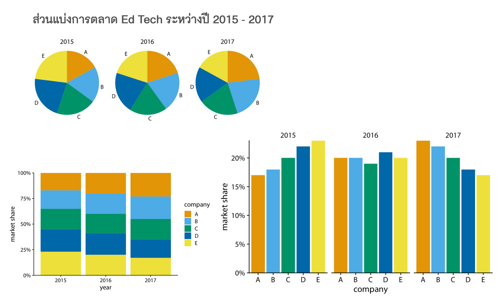
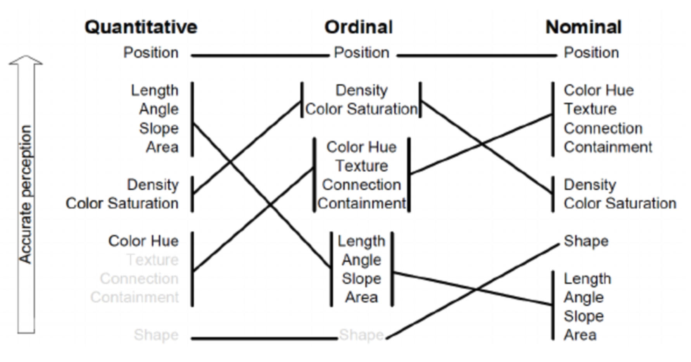

```{r setup, include=FALSE}
knitr::opts_chunk$set(echo = TRUE)
```

# How to Create Data Visualization

เอกสารคำสอนนี้จะกล่าวถึงหลักการสร้างทัศนภาพข้อมูล (data visualization) ที่มีประสิทธิภาพ เนื้อหาในเอกสารจำแนกออกเป็น ส่วน ได้แก่ รายละเอียดมีดังนี้

## ความหมายของทัศนภาพข้อมูล

คำว่า ทัศนภาพข้อมูล (data visualization) เป็นคำที่เกิดจากการนำคำสำคัญสองคำมาผสมกัน ได้แก่ คำว่า "data" และ "visualization" โดย "data" หมายถึงข้อมูลหรือข้อเท็จจริงที่ใช้บรรยาย/อธิบายสภาพของหน่วยข้อมูล ข้อมูลมีหลากหลายลักษณะหลากหลายประเภท ซึ่งอาจจำแนกได้เป็นสองประเภทใหญ่ ได้แก่ ข้อมูลเชิงปริมาณ และข้อมูลจัดประเภท ส่วนคำว่า "visualization" หมายถึงการทำให้เป็นภาพ เมื่อนำมารวมกันจะเห็นความหมายของคำว่า data visualization โดยรวม ๆ ว่าเป็นการทำข้อมูลให้เป็นภาพ อย่างไรก็ตามความหมายดังกล่าวอาจยังไม่เพียงพอ Andy Kirk (2019) นักพัฒนาทัศนภาพข้อมูลท่านหนึ่งได้ให้ความหมายของทัศนภาพข้อมูลไว้อย่างครอบคลุม และการพัฒนาทัศนภาพข้อมูลภายใต้ความหมายนี้สามารถนำไปสู่การสร้างทัศนภาพข้อมูลที่มีประสิทธิภาพได้ รูป 1 แสดงความหมายของทัศนภาพข้อมูลดังกล่าว

จากรูปจะเห็นว่า Andy Kirk ได้ให้ความหมายของทัศนภาพข้อมูลไว้ว่า เป็นกระบวนการที่เกี่ยวข้องกับการแสดงและนำเสนอภาพของข้อมูล (visual representation & presentation) ที่ช่วยสนับสนุนหรืออำนวยความสะดวกในการทำความเข้าใจข้อมูล (facilitate understanding) จากความหมายนี้จะเห็นว่าทัศนภาพข้อมูลนั้นไม่ใช่เพียงการนำข้อมูลมาสร้างให้เป็นภาพเท่านั้น แต่ภาพของข้อมูลดังกล่าวจะต้องถูกนำเสนอให้กับกลุ่มเป้าหมายหรือผู้เกี่ยวข้อง และต้องช่วยให้บุคคลดังกล่าวสามารถเรียนรู้หรือเข้าใจสารสนเทศที่ผู้พัฒนาต้องการจะสื่อสารได้อย่างมีประสิทธิภาพ การเรียนรู้เข้าใจสารสนเทศของกลุ่มเป้าหมายอาจนำไปสู่การให้ความรู้แก่กลุ่มเป้าหมาย การสร้างความตระหนักแก่กลุ่มเป้าหมาย ไปจนถึงการสร้างความเปลี่ยนแปลงหรือทำให้กลุ่มเป้าหมายเกิดการตัดสินใจหรือดำเนินการที่เป็นประโยชน์ได้ต่อไป

{fig-align="center" width="833"}

จากความหมายของทัศนภาพข้อมูลข้างต้นจะเห็นว่ามีคำสำคัญที่ควรจะต้องทำความเข้าใจให้มากขึ้นได้แก่ visual representation, presentation และ facilitate understanding รายละเอียดของแต่ละคำมีดังนี้

## Visual Representation

visual representation เป็นกระบวนการแปลงข้อมูล/สารสนเทศที่มีอยู่ให้เป็นภาพเพื่อสื่อสาร หากมองการแปลงดังกล่าวในเชิงคณิตศาสตร์จะพบว่าเป็นการจับคู่ (mapping) กันระหว่างข้อมูลกับส่วนประกอบต่าง ๆ ภายในแผนภาพ โดยส่วนประกอบเหล่านี้จะเรียกว่า ทัศนธาตุ (visual elements) ในศาสตร์ทางด้านทัศนภาพข้อมูลอาจจำแนกทัศนธาตุในแผนภาพใด ๆ ออกได้เป็นสองประเภท ได้แก่

1.  สัญลักษณ์แทนหน่วยข้อมูล (mark) ซึ่งอาจเป็นรูปทรงเรขาคณิตประเภทต่าง ๆ เช่น จุด เส้น สี่เหลี่ยม วงกลม หรือรูปทรงอื่น ๆ

2.  คุณลักษณะของสัญลักษณ์ (attribute) เช่น ตำแหน่ง สี ความยาว ขนาด หรือปริมาตร ที่แปรผันไปตามค่าของข้อมูลและทำให้สัญลักษณ์ของหน่วยข้อมูลแต่ละหน่วยมีคุณลักษณะที่เปลี่ยนไปตามข้อมูลของหน่วยข้อมูลนั้น

เพื่อให้ผู้อ่านเข้าใจคำว่า visual representation ตามความหมายด้านบนอย่างชัดเจน ขอให้พิจารณาตัวอย่างต่อไปนี้จากรูป 2 ตารางด้านซ้ายบนแสดงยอดขายกาแฟของร้านกาแฟแห่งหนึ่งในช่วงเดือนมกราคม 2019 ถึงมิถุนายน 2021 จากตารางจะเห็นว่าข้อมูลยอดขายกาแฟยังจำแนกออกเป็น 3 ประเภทตามช่องทางการขายได้แก่ หน้าร้าน (store) ออนไลน์ (online) และโทรศัพท์ (tel) และตัวเลขภายในตารางแสดงร้อยละของยอดขายจำแนกตามประเภทของช่องทางขายดังกล่าว เนื่องด้วยข้อมูลมีจำนวนมาก การพิจารณาข้อมูลจากตัวเลขในตารางโดยตรงอาจเป็นการนำเสนอที่ไม่มีประสิทธิภาพ และไม่อำนวยความสะดวกให้ผู้อ่านเข้าใจสาระสำคัญในข้อมูลได้มากเพียงพอ การแปลงข้อมูลดังกล่าวให้เป็นแผนภาพที่เหมาะสมจะช่วยให้ผู้อ่านสามารถทำความเข้าในสาระสำคัญ/รายละเอียดเกี่ยวกับยอดขายกาแฟของร้านกาแฟแห่งนี้ได้อย่างมีประสิทธิภาพมากขึ้น

เมื่อพิจารณารูปทางขวาบน จะเห็นว่าแผนภาพนี้เป็นกราฟเส้น ซึ่งเกิดจากการที่ผู้พัฒนาใช้เส้นเป็นสัญลักษณ์แทนหน่วยข้อมูลซึ่งก็คือยอดขายกาแฟในแต่ละช่วงเวลา ผู้อ่านจะเห็นว่าเส้นบนแผนภาพ (ซึ่งก็คือจุดหลาย ๆ จุดที่มาเชื่อมต่อกัน) เป็นสัญลักษณ์แทนหน่วยข้อมูลที่มีคุณลักษณะคือตำแหน่งบนแกน X และแกน Y ที่เปลี่ยนแปลงไปตามเวลาและสัดส่วนยอดขาย นอกจากนี้ยังมีการใช้สีของเส้นแทนช่องทางขาย ซึ่งทำให้ผู้อ่านสามารถทำความเข้าใจแนวโน้มของยอดขายในแต่ละช่องทางตามช่วงเวลาดังกล่าวได้โดยง่ายและมีประสิทธิภาพ จากรูปจะเห็นว่าแนวโน้มยอดขายจากช่องทางหน้าร้านมีแนวโน้มเร่ิมลดลงตั้งแต่ช่วงเดือนมกราคม 2020 และลดลงอย่างรวดเร็วในช่วงประมาณเดือนมีนาคม - เมษายน ที่เป็นช่วงที่มีการประกาศ lock down จากสถานการณ์ระบาดของโควิด นอกจากนี้แนวโน้มของยอดขายหน้าร้านยังลดลงอย่างต่อเนื่องจนมีค่าเป็นร้อยละ 0 ในช่วงเดือนพฤษภาคม 2021 ในทางกลับกันพบว่าสัดส่วนของยอดขายในช่องทาง online มีแนวโน้มเพิ่มขึ้น และท้ายสุดได้กลายเป็นเพียงช่องทางขายช่องทางเดียวของร้านกาแฟ



การแปลงข้อมูลให้เป็นภาพนั้นสามารถทำได้หลายลักษณะ ขึ้นอยู่กับส่วนผสมของทัศนธาตุที่ผู้พัฒนาเลือกนำมาใช้ ดังตัวอย่างในรูป 2 ด้านล่างทั้งทางซ้ายและขวา จากรูปด้านล่างซ้ายจะเห็นว่ามีการใช้แท่งสีเหลี่ยมแทนหน่วยข้อมูล และมีการใช้คุณลักษณะของแท่งสี่เหลี่ยมได้แก่ ตำแหน่งบนแกน X แทนเวลา ความสูงของแท่งแทนสัดส่วนยอดขาย และสีแทนช่องทางการขาย โดยที่ความยาวโดยรวมของแท่งสี่เหลี่ยมในแต่ละช่วงเวลาจะมีค่าเท่ากับร้อยละ 100 รูปนี้เรียกชื่อทางเทคนิคว่า 100% stacked bar plot ผู้อ่านจะเห็นว่าสารสนเทศที่ได้จากแผนภาพนี้เหมือนกับกราฟเส้นก่อนหน้า อย่างไรก็ตามการทำให้ความเข้าใจสารสนเทศจากแผนภาพนี้อาจทำได้ยากกว่ากราฟเส้น เมื่อพิจารณารูปด้านล่างขวาจะเห็นว่ารูปนี้มีการใช้แท่งสี่เหลี่ยมเป็นสัญลักษณ์แทนข้อมูลเช่นเดียวกัน อย่างไรก็ตามมีการกำหนดคุณลักษณะของแท่งสี่เหลี่ยมที่แตกต่างออกไป โดยให้ตำแหน่งบนแกน X แทนช่องทางการขาย ส่วนความสูงของแท่งสี่เหลี่ยมแทนสัดส่วนยอดขายในแต่ละช่วงเวลา ผู้อ่านจะเห็นว่าถึงแม้จะเป็นแผนภาพแบบ 100% stacked bar plot เหมือนกับแผนภาพก่อนหน้า แต่การกำหนดส่วนผสมของทัศนธาตุที่ไม่เหมาะสม ทำให้เกิดอุปสรรคแต่ผู้อ่านในการทำความเข้าใจปริมาณยอดขายกาแฟในแต่ละช่วงเวลาของแต่ละช่องทาง แผนภาพดังกล่าวมีประสิทธิภาพต่ำมาก (จริง ๆ คือไม่มีประสิทธิภาพ) ในการสื่อสารสาระสำคัญให้กับผู้อ่านได้เลย **จากตัวอย่างในรูป 2 ผู้อ่านจะเห็นว่าการทำ visual representation ที่เหมาะสมจะช่วยสร้างแผนภาพที่ช่วยให้การนำเสนอข้อมูลสามารถทำได้อย่างมีประสิทธิภาพ กล่าวคือเป็นแผนภาพที่ช่วยให้ผู้อ่านสามารถทำความเข้าใจสารสนเทศจากข้อมูลได้ ในทางกลับกันการทำ visual representation ที่ไม่เหมาะสมอาจก่ออุปสรรคให้กับผู้อ่านจนไม่สามารถเข้าถึงหรือทำความเข้าใจสาระสำคัญใด ๆ จากข้อมูลได้เลย**

ในบางสถานการณ์ผู้พัฒนาทัศนภาพข้อมูลอาจสร้างแผนภาพที่ผู้อ่านสามารถเข้าใจสารสนเทศจากแผนภาพได้ง่ายแล้ว แต่กำหนด visual representation ที่ไม่เหมาะสม อาจทำให้สารสนเทศที่ผู้อ่านเข้าใจได้นั้นมีความคลาดเคลื่อนไปจากความเป็นจริง ผู้อ่านลองพิจารณาแผนภูมิวงกลมในรูป 3 ที่แสดงส่วนแบ่งการตลาดของบริษัท Ed Tech จำนวน 5 บริษัท ในช่วงปี 2015 - 2017 หากผู้อ่านลองพยายามเปรียบเทียบว่าในแต่ละปีนั้นบริษัทใดมีส่วนแบ่งทางการตลาดมากที่สุด และส่วนแบ่งทางการตลาดมีแนวโน้มเปลี่ยนแปลงหรือไม่ อย่างไรในช่วงเวลาดังกล่าว จะพบว่า การเปรียบเทียบและวิเคราะห์แนวโน้มดังกล่าวทำได้ค่อนข้างยาก และข้อสรุปของผู้ที่อ่านแผนภาพนี้ส่วนใหญ่มักสรุปไปในทางเดียวกันว่า ส่วนแบ่งการตลาดของบริษัททั้ง 5 ใกล้เคียงกันในช่วงปีดังกล่าว **คำถามคือข้อสรุปนี้ถูกต้องแล้วใช่หรือไม่ ?**



เพื่อตอบคำถามในข้างต้น ผู้พัฒนาทัศนภาพข้อมูลอาจลองทำการแปลงข้อมูลให้เป็นภาพด้วยส่วนผสมของทัศนธาตุแบบอื่น รูป 4 แสดงการใช้ 100% stacked bar plot และ simple bar plot แทนการใช้แผนภูมิวงกลม จากรูปจะเห็นว่า 100% stacked bar plot ให้ผลลัพธ์ที่ดีขึ้นกว่าการใช้แผนภูมิวงกลม โดยแสดงให้เห็นอย่างชัดเจนว่าส่วนแบ่งการตลาดของบริษัท E มีค่าสูงที่สุดในปี 2015 โดยคิดเป็นประมาณเกือบร้อยละ 25 และแนวโน้มลดลงเรื่อย ๆ ในช่วงเวลาดังกล่าว แต่เมื่อต้องการพิจารณาระดับและแนวโน้มของส่วนแบ่งการตลาดของบริษัทอื่นพบว่า ทำได้ยากขึ้นเนื่องมาจากสี่เหลี่ยมที่ใช้เป็นตัวแทนหน่วยข้อมูลของแต่ละบริษัทมีฐานที่ไม่ได้เริ่มจาก 0 และฐานดังกล่าวเปลี่ยนแปลงไปตามแต่ละปี ดังนั้น 100% stacked bar plot นี้ถึงแม้ว่าจะทำให้ผู้อ่านสามารถจำแนกความแตกต่างของส่วนแบ่งการตลาดได้ดีขึ้น แต่ก็ยังมีส่วนที่เป็นอุปสรรคสำหรับผู้อ่านซึ่งอาจทำให้เกิดความคลาดเคลื่อนในการสร้างข้อสรุปได้เหมือนกับแผนภูมิวงกลมในรูป 3 เมื่อพิจารณา simple bar plot ในรูป 4 (ด้านล่างขวา) จะเห็นว่า representation นี้ทำให้การจำแนกความแตกต่างหรือเปรียบเทียบส่วนแบ่งการตลาดของแต่ละบริษัทภายในแต่ละช่วงเวลา และแนวโน้มการเปลี่ยนแปลงส่วนแบ่งการตลาดในช่วงเวลาดังกล่าวสามารถทำได้โดยง่าย และเห็นได้อย่างชัดเจนว่าส่วนแบ่งการตลาดของบริษัททั้ง 5 มีการเปลี่ยนแปลงจากเดิมในปี 2015 ที่บริษัท E มีส่วนแบ่งการตลาดมากที่สุด รองลงมาคือบริษัท D, C, B, และ A กลายเป็นในปี 2017 บริษัท A มีส่วนแบ่งการตลาดมากที่สุดแทน และรองลงมาคือบริษัท B, C, D และ E



จากตัวอย่างทั้งสองผู้อ่านจะสังเกตได้ว่าการเลือกส่วนผสมของทัศนธาตุที่แตกต่างกัน อาจทำให้ประสิทธิภาพในการนำเสนอข้อมูลของแผนภาพมีความแตกต่างกันแม้ว่าจะเป็นข้อมูลชุดเดียวกัน โดยบางกรณีแผนภาพที่พัฒนาขึ้นอาจไม่สามารถสื่อสารหรือนำเสนอสาระใด ๆ จากข้อมูลได้เลย บางกรณีแผนภาพอาจนำเสนอสาระสำคัญได้เพียงบางส่วน หรือในบางกรณีแผนภาพอาจทำให้เกิดความเข้าใจที่คลาดเคลื่อนไปจากสภาพจริง สาเหตุของความผันแปรนี้อธิบายได้ด้วยทฤษฎีการรับรู้ภาพของมนุษย์ซึ่งมีผู้นำเสนอไว้หลายทฤษฎี ทฤษฎีหนึ่งที่สามารถนำมาอธิบายได้ดีในบริบทของการพัฒนาทัศนภาพข้อมูลคือทฤษฎี perceptual tasks ของ Mackinlays (1986) ดังรูป 5


