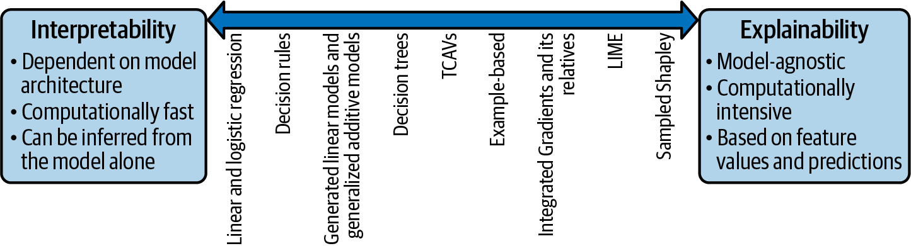

## แนวคิดพื้นฐาน: ทำไม XAI จึงสำคัญ

โมเดลการเรียนรู้ของเครื่อง (Machine Learning) มีประสิทธิภาพสูงในการทำนายหรือจำแนกข้อมูล ซึ่งสามารถให้ insight ที่เป็นประโยชน์ต่อการตัดสินใจทางการศึกษาได้ อย่างไรก็ตาม โมเดลที่มีประสิทธิภาพสูงมักมีความซับซ้อนมาก (เรียกว่า Black Box) จนยากที่จะทำความเข้าใจกระบวนการตัดสินใจภายในโดยตรง

ในหลายสถานการณ์ โดยเฉพาะด้านการศึกษา การรู้แค่ "ผลทำนาย" นั้นไม่เพียงพอ เราจำเป็นต้องรู้ "เหตุผล" ที่โมเดลตัดสินใจเช่นนั้นด้วย เพื่อให้เกิด:

1.  ความไว้วางใจ (Trust): ผู้ใช้ (เช่น ครู ผู้บริหาร) มั่นใจที่จะนำผลลัพธ์ไปใช้งาน

2.  ความเป็นธรรม (Fairness): ตรวจสอบว่าโมเดลไม่มีอคติ (bias) ต่อกลุ่มนักเรียนใดกลุ่มหนึ่ง

3.  ความรับผิดชอบ (Accountability): สามารถชี้แจงที่มาของการตัดสินใจได้

4.  การปรับปรุง (Improvement): เข้าใจจุดอ่อนของโมเดลเพื่อนำไปพัฒนาต่อ

5.  ความสอดคล้อง (Compliance): เป็นไปตามข้อกำหนดด้านกฎหมายหรือจริยธรรม

อย่างไรก็ตามโมเดลการเรียนรู้ของเครื่องหลายตัวมีปัญหาเรื่องการอธิบายคำตอบหรือการตัดสินใจของโมเดล เพราะโมเดลที่มีประสิทธิภาพสูงมาก ๆ มากมีลักษณะการทำงานที่ซับซ้อนเข้าไปสังเกตหรือทำความเข้าใจโดยตรงได้ยาก นักวิทยาการข้อมูลเรียกโมเดลลักษณะดังกล่าวว่าเป็น black box จากข้อจำกัดดังกล่าวทำให้นักวิทยาการข้อมูลต้องการ insight เพิ่มเติมสำหรับอธิบายกลไกหรือเหตุผลเบื้องหลังของการตัดสินใจภายในโมเดล AI ความต้องการนี้ก่อให้เกิดแนวคิดที่เรียกว่า Explainable AI (XAI) ขึ้นมา

**Explainable AI (XAI)** เป็นแนวคิดและชุดของเทคนิคที่มุ่งเน้นทำให้ระบบปัญญาประดิษฐ์และการเรียนรู้ของเครื่องมีความโปร่งใสและสามารถอธิบายได้ว่าเหตุใดจึงทำนายหรือตัดสินใจเช่นนั้น

-   สามารถอธิบายเหตุผลการตัดสินใจให้กับผู้ใช้

-   ระบุจุดแข็งและจุดอ่อนของตัวเอง

-   สื่อสารให้ผู้ใช้เข้าใจถึงแนวโน้มพฤติกรรมในอนาคตของระบบ

## ลักษณะของการอธิบายโมเดล

การอธิบายโมเดลการเรียนรู้ของเครื่องสามารถจำแนกได้หลายลักษณะ เราอาจจำแนกออกเป็นสองประเภทหลัก ได้แก่

### การอธิบายก่อนการสร้างโมเดล (premodelling explanability)

การอธิบายก่อนการสร้างโมเดลเป็นกระบวนการที่เป็นอิสระกับโมเดล กล่าวคือไม่ได้ขึ้นหรืออิงกับโมเดลใด ๆ ที่ใช้ในการวิเคราะห์ แต่เน้นการอธิบาย บริบทของข้อมูล ที่จะช่วยให้สารสนเทศสนับสนุนทั้งการตัดสินใจในการเตรียมข้อมูลให้พร้อมสำหรับการวิเคราะห์ การสร้างโมเดลการเรียนรู้ของเครื่องที่เหมาะสม รวมทั้งการตีความผลลัพธ์ของโมเดลในภายหลังที่มีความถูกต้องมากขึ้น

จากที่กล่าวไปจะเห็นว่าวัตถุประสงค์หลักของ premodelling explainability คือการทำความเข้าใจข้อมูลที่นำมาใช้ในการฝึกโมเดลนั้นมีลักษณะอย่างไร มีข้อจำกัดอะไร หรือมีความสัมพันธ์ในลักษณะแบบใด ในมุมมองการกระบวนการวิเคราะห์ข้อมูลและการสร้างโมเดลการเรียนรู้ของเครื่อง กระบวนการนี้อาจะเรียกว่า exploratory data analysis (EDA) ในระดับคุณลักษณะ (feature-level) ซึ่งมักประกอบด้วยการสำรวจว่า

- ข้อมูลมีการกระจายตัวอย่างไร (distribution) -- ข้อมูลมีการแจกแจงอย่างไร เช่น สมมาตร หรือเบ้ไปทางใดทางหนึ่ง นอกจากนี้สเกลของข้อมูลเป็นแบบใด ต้องมีการแปลงข้อมูลหรือไม่ อย่างไร

- ตัวแปรต่าง ๆ มีความสัมพันธ์กันอย่างไร (correlation) -- ตัวแปรทำนายมีแนวโน้มที่จะทำนายตัวแปรตามได้ดีหรือไม่ ลักษณะความสัมพันธ์มีแนวโน้มเป็นเส้นตรงหรือไม่ใช่เส้นตรง และมีประเด็นอื่นๆ ที่เป็นข้อสังเกตหรือไม่

- มีอคติ (bias) หรือความไม่สมดุล (imbalance) ในชุดข้อมูลหรือไม่ -- กล่าวคือข้อมูลมีความสมดุลในแต่ละกลุ่มเป้าหมายหรือไม่ หรืออาจมีปัญหาข้อมูลสูญหาย (missing data) หรือข้อมูลผิดปกติ (outliers) ที่อาจเป็นปัจจัยที่ก่อให้เกิดอคติในการวิเคราะห์หรือไม่

### การอธิบายภายหลังการสร้างโมเดล (postmodelling explanability)

การอธิบายภายหลังการสร้างโมเดลนี้ถือว่าเป็นการอธิบายส่วนหลักที่ผู้วิเคราะห์ใช้ในการทำความเข้าใจ หรือรายงานกลไกการตัดสินใจของโมเดลที่สร้างขึ้น การอธิบายประเภทนี้ยังอาจจำแนกได้เป็นอีก 2 ประเภท ได้แก่ interpreability และ explainability

### การอธิบายที่ได้จากภายในโมเดล หรือฝังอยู่ในกลไกของโมเดล (Interpretability):

อาจเรียกอีกอย่างว่า intrinsic explainability การอธิบายประเภทนี้จะอยู่ในโมเดลที่มีคุณสมบัติคือมีกลไกหรือโครงสร้างภายในของโมเดลสามารถให้การอธิบายเกี่ยวกับกระบวนการทำนาย หรือการตัดสินใจของโมเดลได้โดยตรง เช่น linear regression, logistic regression หรือ decision tree ที่จะเห็นได้ชัดเจนว่าเมื่อใช้โมเดลดังกล่าวในการวิเคราะห์ ผู้วิเคราะห์จะได้รับการอธิบายของการทำนายที่มาจากกลไกลของโมเดลนั้น ๆ เอง โดยปกติอาจเรียกโมเดลในกลุ่มนี้ว่า glass-box models หรือ white-box models เช่น

- Linear Regression -- ดูจากค่าสัมประสิทธิ์การถดถอย

- Logistic Regression -- ดูจากค่าสัมประสิทธิ์การถดถอยโลจิสติกส์ หรือ odd ratio

- Decision Tree -- ดูจากโครงสร้างต้นไม้ที่แสดงการแบ่งกลุ่ม

วิธีการสร้างการอธิบายในกลุ่มนี้อาจะเรียกอีกชื่อหนึ่งว่า model-specific methods เนื่องจากการอธิบายที่ได้จะขึ้นอยู่กับโครงสร้างและสมมุติฐานเชิงทฤษฎีของโมเดลนั้น ๆ โดยตรง

เพื่อให้เห็นภาพลองพิจารณาตัวอย่าง การทำนายความเสี่ยงในการเรียนของนักเรียน (สอบผ่าน/สอบตก) ที่ใช้ logistic regression เพื่อทำนายว่านักเรียนจะสอบผ่านหรือไม่?

$$
logit(p) = -2.5 + 0.8(attendance) + 1.2(study\_hours)
$$

จากสมการ log-odds ข้างต้น จะเห็นว่า ทั้ง $attendance$ และ $study\_hours$ มีค่าสัมประสิทธิ์เป็นบวก ซึ่งหมายความว่า เมื่อค่าของตัวแปรทำนายทั้งสองเพิ่มขึ้น โอกาสที่นักเรียนจะสอบผ่านก็จะมีแนวโน้มเพิ่มขึ้นตามไปด้วย

นอกจากนี้ผู้วิเคราะห์ยังสามารถเข้าใจได้ว่า “การเข้าเรียนแต่ละครั้งเพิ่มโอกาสสอบผ่านประมาณ 0.8 หน่วยใน log-odds” ซึ่งเมื่อแปลงเป็น odd ratio จะได้ว่า หากนักเรียนเข้าเรียนเพิ่มขึ้น 1 ครั้ง จะเพิ่มโอกาสของการสอบผ่านให้สูงขึ้นประมาณ 2.22 เท่า $(e^{0.8} \approx 2.22)$ การตีความหมายนี้จะเห็นว่าได้จากโครงสร้างของโมเดลโดยตรง เรียกการอธิบายลักษณะนี้ว่า interpretability

ดังที่กล่าวไปว่าเทคนิคนี้สร้างการอธิบายจากกลไกหรือส่วนประกอบภายในของโมเดลนั้น ๆ ส่วนประกอบดังกล่าวจะถูกประมาณค่าหรือสร้างขึ้นพร้อมกับกระบวนการเรียนรู้ของโมเดล และหากขาดส่วนประกอบนี้ไป โมเดลจะไม่สามารถเรียนรู้หรือทำนายผลลัพธ์ได้

โมเดลที่มีคุณสมบัติ interpretability สูง มักมีแนวโน้มที่จะมีความซับซ้อนต้ำ ทั้งนี้เพื่อให้โครงสร้างมีความง่ายต่อการตีความหมาย อย่างไรก็ตามเนื่องจากส่วนประกอบที่ใช้ตีความหมายนี้ถูกสร้างขึ้นพร้อม ๆ กับการเรียนรู้ของโมเดล ดังนั้นการตีความหมายที่ได้จึงมีความเฉพาะเจาะจงกับโมเดลนั้น ๆ ไม่สามารถนำไปใช้ตีความหมายเปรียบเทียบกับโมเดลอื่นได้ เช่น สัมประสิทธิ์การถดถอยของโมเดลการวิเคราะห์การถดถอยเชิงเส้น หรืออัตราส่วนแต้มต่อ (odd ratio) ของโมเดลการวิเคราะห์การถดถอยโลจิสติกส์ หรือโครงสร้างต้นไม้ของ decision tree หรือฟังก์ชันจำแนกของการวิเคราะห์จำแนก (discriminant analysis)

### การอธิบายภายหลังจากโมเดลสร้างเสร็จ (Explainability):

ในทางกลับกันบางโมเดลไม่สามารถสร้างการอธิบายจากส่วนประกอบภายในของโมเดลเองได้ เนื่องจากมีความซับซ้อนสูงเกินไป เช่น neural network หรือโมเดลในกลุ่ม ensemble methods (random forest, gradient boosting) 

ดังนั้นการสร้างการอธิบายกลไกของโมเดลดังกล่าวจึงจำเป็นต้องใช้การสังเกตพฤติกรรมของโมเดลขณะที่ทำงานจริง ซึ่งจะดำเนินการภายหลังจากที่ได้สร้างโมเดลเสร็จสิ้นแล้ว (post-hoc explanation) ซึ่งเป็นอิสระจากกลไกภายในและสมมุติฐานเชิงทฤษฎีของแต่ละโมเดลเทคนิคที่ใช้สร้างการอธิบายลักษณะนี้จะอยู่ในกลุ่มที่เรียกว่า explainability 

การสังเกตกลไกของโมเดลขณะทำงานจริงนี้ เป็นการนำค่าทำนายที่เป็นผลลัพธ์จากข้อมูลตัวอย่างมาทำการวิเคราะห์ร่วมกับข้อมูลของตัวแปรทำนาย (predictors or features) เพื่อสร้างข้อสรุปเกี่ยวกับกระบวนการทำงานหรือการตัดสินใจของโมเดล จากแนวคิดกว้าง ๆ นี้ผู้อ่านจะสังเกตได้ว่าการใช้เทคนิคในกลุ่ม explainability นี้ไม่ได้ยึดติดกับทฤษฎีหรือโครงสร้างของโมเดลใดโมเดลหนึ่งเป็นการเฉพาะ การอธิบายที่สร้างขึ้นจากเทคนิคกลุ่มนี้จึงเป็นการอธิบายที่ใช้ข้อมูลเป็นฐานมากกว่าการใช้สมมุติฐานเชิงทฤษฎีแบบเช่นที่มักดำเนินการในกลุ่ม interpretability วิธีการสร้างคำอธิบายในกลุ่มนี้จึงเรียกได้อีกชื่อหนึ่งว่า model-agnostic methods 

เทคนิคแบบ explainability ทำหน้าที่สร้างการอธิบายจากภายนอกโดยอิงจากผลการทำนายและข้อมูลจริงของตัวแปรทำนายของแต่ละโมเดล ซึ่งทำให้สามารถใช้เทคนิคดังกล่าวกับโมเดลใดก็ได้ และยังสามารถนำมาเปรียบเทียบกันได้ แต่อาจจะต้องแลกกับการประมวลผลที่มากขึ้น เทคนิคในกลุ่มนี้ เช่น 

| ประเภท                           | คำอธิบาย                                       | ตัวอย่างเทคนิค                               | ตัวอย่างทางการศึกษา                                                                   |
| -------------------------------------------- | ---------------------------------------------- | -------------------------------------------- | -------------------------------------------------------------------------------- |
| **Feature Attribution**          | วัดว่าแต่ละตัวแปรมีผลต่อผลทำนายมากน้อยแค่ไหน   | SHAP, Permutation Feature Importance, VIP    | ตัวแปรใดส่งผลต่อการคาดการณ์ว่านักเรียนจะสอบผ่านมากที่สุด                              |
| **Partial Dependence / What-if** | จำลองผลทำนายเมื่อเปลี่ยนค่าตัวแปรหนึ่ง ๆ       | PDP, ICE Plot                                | ถ้าเพิ่มเวลาเรียนจะทำให้ความน่าจะเป็นการสอบผ่านเพิ่มขึ้นแค่ไหน                        |
| **Example-based Explanation**    | อธิบายโดยยกตัวอย่างกรณีคล้ายกัน                | KNN-based, Prototype, Counterfactual Example | นักเรียนคนนี้ถูกจัดกลุ่มเสี่ยงเพราะมีพฤติกรรมคล้ายกับนักเรียนกลุ่มที่เคยไม่ผ่านในอดีต |
| **Counterfactual Explanation**   | อธิบาย “สิ่งที่ต้องเปลี่ยนเพื่อให้ผลต่างออกไป” | Counterfactual Reasoning, Causal Inference   | ถ้านักเรียนส่งงานครบทุกสัปดาห์ ผลลัพธ์จะเปลี่ยนเป็น “ผ่าน”                            |

#### การอธิบายโมเดลจำแนกตามระดับของหน่วยข้อมูล

จากตัวอย่างข้างต้นจะเห็นว่า explanability มีหลายประเภท แต่ละประเภทมีจุดเน้นของการอธิบายที่แตกต่างกัน และสามารถจำแนกออกได้เป็นหลายลักษณะ หากใช้ระดับของการอธิบายเป็นเกณฑ์ในการจำแนก อาจแบ่งออกได้เป็น 3 ประเภทได้แก่ การอธิบายเฉพาะหน่วยข้อมูล การอธิบายแบบกลุ่ม และการอธิบายแบบภาพรวม 

##### การอธิบายเฉพาะหน่วยข้อมูล (Local Explanation)

Local explanation คือการอธิบายแบบเจาะจงกับ กรณีใดกรณีหนึ่ง หรือ หน่วยใดหน่วยหนึ่ง  โดยตรง เช่น ทำไมโมเดลถึงทำนายผลเช่นนั้นสำหรับนักเรียนคนนี้โดยเฉพาะ หรือชั้นเรียนนี้ ไม่ใช่การสรุปภาพรวมของโมเดลทั้งหมด ลักษณะสำคัญของการอธิบายเฉพาะหน่วยข้อมูลได้แก่

- เป็นการอธิบายการตัดสินใจหรือผลลัพธ์สำหรับหน่วยข้อมูล 1 รายการ

- ไม่สามารถนำไปใช้อธิบายหน่วยข้อมูลรายการอื่นได้

- หน่วยข้อมูลที่มีลักษณะใกล้เคียงกันมาก ๆ ไม่จำเป็นต้องได้รับการอธิบายแบบเดียวกัน ทั้งนี้ขึ้นอยู่กับบริบทของแต่ละหน่วยข้อมูล และการเรียนรู้ของโมเดลแต่ละโมเดล

ตัวอย่างของการอธิบายเฉพาะหน่วยข้อมูล เช่น โมเดลหนึ่งให้ผลทำนายว่า นักเรียนคนหนึ่งอาจมีความเสี่ยงที่จะสอบไม่ผ่านรายวิชาคณิตศาสตร์ การอธิบายแบบ local สำหรับนักเรียนคนนี้อาจระบุว่า โมเดลคาดการณ์ว่านักเรียนคนนี้น่าจะสอบไม่ผ่าน เพราะขาดเรียนเกิน 20% ของชั่วโมงเรียน ไม่ได้ส่งงาน 3 ชิ้นสุดท้าย และคะแนนการบ้านที่ได้ 45% ล้วนส่งผลกระทบเชิงลบต่อค่าทำนายกรณีนี้ทั้งหมด นอกจากนี้ยังสามารถระบุความสำคัญหรือขนาดของผลกระทบในเชิงปริมาณได้ ซึ่งช่วยให้ครูเข้าใจได้ว่า พฤติกรรมของนักเรียนส่งผลอย่างไรต่อการทำนาย และควรให้ความสำคัญกับปัจจัยใดเป็นพิเศษ

อย่างไรก็ตาม การอธิบายของนักเรียนแต่ละคนอาจไม่เหมือนกัน แม้ผลการทำนายจะคล้ายกันก็ตาม เช่น นักเรียนสองคนที่ได้ผลเสี่ยงไม่ผ่าน อาจมีเหตุผลคนละแบบ — คนหนึ่งขาดเรียนบ่อย แต่อีกคนเข้าเรียนครบแต่คะแนนการบ้านต่ำ นอกจากนี้ โมเดลบางแบบ เช่น Decision Tree อาจมีจุดตัดที่ทำให้ผลต่างกันมากเพียงเพราะค่าหนึ่งเปลี่ยนเล็กน้อย เช่น ถ้าโมเดลตั้งเกณฑ์ว่า ขาดเรียนเกิน 20% ถือว่าเสี่ยง นักเรียน A ที่ขาดเรียน 19% จะถูกตัดสินจากโมเดลว่า “ไม่เสี่ยง” ทั้งที่พฤติกรรมแทบไม่ต่างจากคนที่ขาดเรียน 21% ดังนั้น เราไม่ควรใช้การอธิบายจากกรณีหนึ่งแทนอีกกรณีโดยอัตโนมัติ แต่ควรพิจารณาเป็นรายบุคคล เพราะ local explanation ถูกออกแบบมาเพื่อเข้าใจเหตุผลของการทำนายในบริบทเฉพาะรายมากกว่าการอธิบายแนวโน้มโดยรวมของโมเดล

##### การอธิบายแบบภาพรวมทั้งชุดข้อมูล (Global Explanation)

เป็นการอธิบายที่อยู่ตรงข้ามกับการอธิบายเฉพาะหน่วยข้อมูล กล่าวคือ 
เป็นการอธิบาย**พฤติกรรมโดยรวมของโมเดล** แทนที่จะมุ่งที่คำทำนายรายกรณี ซึ่งช่วยให้เราเห็นภาพว่า โมเดลโดยทั่วไปมีแนวโน้มให้ความสำคัญกับปัจจัยใดมากที่สุด และตัดสินใจในทิศทางใดบ้าง เช่น

-   โมเดลให้ความสำคัญกับการเข้าเรียนมากกว่าคะแนนแบบฝึกหัดหรือไม่?

-   ปัจจัยใดมีอิทธิพลต่อความสำเร็จของนักเรียนมากที่สุด?

เราสามารถสร้าง global explanation ได้หลายวิธี เช่น

-   รวมการอธิบายของแต่ละหน่วยข้อมูลเข้าด้วยกัน เพื่อสร้างการอธิบายในภาพรวม เช่น รวมค่า SHAP ของนักเรียนทุกคนในชุดข้อมูล เพื่อดูว่าฟีเจอร์ใดมีผลต่อผลการทำนายโดยเฉลี่ยมากที่สุด

-   ทดลองปรับค่าข้อมูล (perturbation) จากนั้นสังเกตว่าโดยรวมโมเดลตอบสนองอย่างไร เช่น ถ้าเพิ่มค่าการเข้าเรียนทีละนิด ๆ  ผลการทำนายโอกาสสอบผ่านจะมีแนวโน้มเพิ่มขึ้นเท่าไรในภาพรวม 

Global explanation ไม่ใช่กฎตายตัวของโมเดล แต่เป็นสิ่งที่สะท้อนจากข้อมูลที่ใช้ฝึกเท่านั้น เมื่อโมเดลถูกนำไปใช้กับข้อมูลใหม่ เช่น นักเรียนในปีถัดไปหรือในบริบทต่างโรงเรียน การอธิบายแบบ global อาจเปลี่ยนแปลงได้

เช่น โมเดลที่เคยพบว่าจำนวนการส่งงานเป็นปัจจัยสำคัญที่สุดในปีนี้ อาจไม่เป็นจริงในปีหน้า ถ้าแนวทางการประเมินเปลี่ยนไปหรือรูปแบบการเรียนรู้ของนักเรียนพัฒนา

ดังนั้น ควรใช้ global explanation เพื่อทำความเข้าใจภาพรวมและแนวโน้มของโมเดล ขณะที่ local explanation จะช่วยให้เข้าใจเหตุผลรายกรณีได้อย่างละเอียด การอธิบายทั้งสองแบบจึงควรถูกใช้ร่วมกันเพื่อให้การตีความโมเดลทางการศึกษาโปร่งใสและเป็นประโยชน์สูงสุด

##### การอธิบายแบบกลุ่มย่อย (Cohort Explanation)

เป็นการอธิบายที่มีลักษณะอยู่กึ่งกลางระหว่าง local explanation และ global explanation กล่าวคือ แนวทางนี้จะมุ่งวิเคราะห์พฤติกรรมของโมเดลกับกลุ่มย่อยของข้อมูล เช่น นักเรียนหญิง นักเรียนต่างจังหวัด หรือโรงเรียนขนาดเล็ก เช่น

-   สำหรับนักเรียนหญิง โมเดลให้ความสำคัญกับการเข้าเรียนมากกว่าคะแนนแบบฝึกหัด

-   ในกลุ่มโรงเรียนขนาดเล็ก ปัจจัยเรื่องการเข้าถึงอินเทอร์เน็ตส่งผลต่อผลสัมฤทธิ์มากกว่าในโรงเรียนขนาดใหญ่

เทคนิคที่ใช้สร้าง cohort explanation มักเหมือนกับการสร้าง global explanation แต่จะประยุกต์ใช้กับ กลุ่มย่อย ของข้อมูลเท่านั้น ไม่ใช่ทั้งชุดข้อมูลทั้งหมด การดำเนินการลักษณะนี้เป็นพื้นฐานสำคัญของการตรวจสอบความเป็นธรรมของโมเดล (model fairness) เพื่อให้แน่ใจว่าโมเดลไม่ได้มีอคติต่อกลุ่มใดกลุ่มหนึ่ง กล่าวคือเป็นการตรวจสอบว่าโมเดลให้ผลแตกต่างกันหรือไม่แต่ละกลุ่มย่อย

### การอธิบายจำแนกตามเทคนิคที่ใช้

นอกจากการจำแนกการอธิบายตามระดับของหน่วยข้อมูลแล้ว เรายังสามารถจำแนกการอธิบายตามเทคนิคที่ใช้สร้างการอธิบายได้อีกด้วย ในที่นี้จะกล่าวถึง การอธิบายคุณลักษณะ (Feature Attribution) การอธิบายข้อสมมุติซึ่งตรงข้ามกับข้อเท็จจริง (Counterfactual Explanation) และการอธิบายเชิงตัวอย่าง (Example-Based Explanation) รายละเอียดมีดังนี้

#### การอธิบายคุณลักษณะ (Feature Attribution)

เทคนิคกลุ่มนี้อธิบายกลไกลของโมเดลในลักษณะที่อิงกับตัวแปรทำนายหรือคุณลักษณะในชุดข้อมูล วิธีการในกลุ่มนี้เป็นหนึ่งในกลุ่มที่ใช้กันอย่างแพร่หลาย วัตถุประสงค์หลักของการอธิบายคุณลักษณะคือการวิเคราะห์ว่าตัวแปรทำนายแต่ละตัวนั้นมีอิทธิพลต่อการตัดสินใจของโมเดลมากแค่ไหน และในทิศทางใด เช่น 

::: myquote
โมเดล random forest ทำนายว่า นักเรียน A จะได้คะแนนสอบคณิตศาสตร์ 80 คะแนน
:::

- เราอาจพบว่า ตัวแปรทำนายจำนวนครั้งที่ส่งการบ้าน มีค่าคะแนนของการอธิบาย +12 คะแนน

- ตัวแปรทำนายจำนวนวันที่ขาดเรียน มีค่าคะแนนของการอธิบาย -8 คะแนน

การอธิบายนี้บ่งชี้ว่า การส่งการบ้านสม่ำเสมอช่วยเพิ่มโอกาสได้คะแนนสูงขึ้น ในขณะที่การขาดเรียนบ่อยเป็นปัจจัยที่ลดคะแนนลง

การวัดอิทธิพลของตัวแปรทำนายอาจจำแนกได้เป็น 2 ลักษณะใหญ่ ได้แก่ การวัดอิทธิพลเชิงสัมบูรณ์ (absolute attribution) และการวัดอิทธิพลเชิงสัมพัทธ์ (relative attribution) ซึ่งมีความแตกต่างกันในเชิงการตีความหมายของค่าที่ได้จากการอธิบาย

การวัดอิทธิพลเชิงสัมบูรณ์ จะให้ค่าที่แสดงขนาดของอิทธิพลในหน่วยเดียวกับค่าทำนายหรือผลลัพธ์ที่ได้จากโมเดล ซึ่งมีประโยชน์ในเชิงปฏิบัติที่ทำให้ผู้วิเคราะห์ หรือผู้ใช้โมเดลสามารถเข้าใจความสำคัญหรือการมีส่วนร่วมในการตัดสินใจของตัวแปรทำนายแต่ละตัวภายในโมเดลได้อย่างชัดเจน เช่น หากโมเดลทำนายว่านักเรียนจะได้คะแนนสอบ 75 คะแนน และการอธิบายระบุว่า ตัวแปรทำนาย "จำนวนชั่วโมงการศึกษา" มีอิทธิพลเชิงสัมบูรณ์ +10 คะแนน หมายความว่า ถ้านักเรียนเพิ่มชั่วโมงการศึกษาอีก 1 ชั่วโมง จะช่วยเพิ่มคะแนนสอบขึ้น 10 คะแนน การอธิบายลักษณะนี้นำไปสู่การตัดสินใจเชิงปฏิบัติที่มีเป้าหมายที่ชัดเจนได้

บางกรณีการวัดอิทธิพลเชิงสัมบูรณ์อาจไม่ได้เหมาะสมนัก เช่น (1) หน่วยของตัวแปรตามที่ถูกทำนายนั้นไม่ได้มีความหมายตรงไปตรงมา อาจเนื่องมาจากตัวแปรตามเป็นคะแนนดัชนีที่อยู่ในสเกลมาตรฐาน หรือเป็นค่าความน่าจะเป็นของความสำเร็จ/ความเสี่ยงที่สนใจ หรือ (2) การอธิบายต้องการมุ่งเป้าไปที่การเปรียบเทียบความสำคัญของตัวแปรทำนายแต่ละตัวภายในโมเดล เช่น ต้องการเปรียบเทียบสัดส่วนอิทธิพลของตัวแปรทำนายแต่ละตัวที่มีต่อผลลัพธ์ของโมเดล เพื่อทราบว่าตัวแปรทำนายใดบ้างมีความสำคัญมากที่สุด อย่างไร หรือ (3) ต้องการสื่อสารการอธิบายนี้ให้บุคคลทั่วไปสามารถเข้าใจได้ง่าย โดยไม่ต้องอ้างอิงถึงหน่วยจริงของตัวแปร (ซึ่งในบางกรณีจะต้องทำความเข้าใจที่มาที่ไปของการคำนวณคะแนนของตัวแปรดังกล่าวก่อน และการเป็นการรบกวนการทำความเข้าใจเนื้อหาหลักของการสื่อสารโดยไม่จำเป็น)  หรือ (4) ต้องการอธิบายภาพรวม (global explanation/global behavior) ของโมเดล เช่นต้องการบอกว่า โดยเฉลี่ยแล้วตัวแปรทำนายได้แก่ $x1, x2, x3$ อธิบายการทำนายได้รวมกันทั้งหมด ร้อยละ 80 กรณีเช่นนี้การวัดอิทธิพลเชิงสัมพัทธ์จะเหมาะสมกว่า

ตัวอย่างต่อไปนี้แสดงการเปรียบเทียบผลการอธิบายคุณลักษณะระหว่างการวัดอิทธิพลเชิงสัมบูรณ์และเชิงสัมพัทธ์ จากตารางด้านล่างจะเห็นว่า การใช้งานการอธิบายทั้งสองมีความแตกต่างกัน และอาจจะขึ้นกับผู้ใช้ข้อมูลด้วยว่ามีวัตถุประสงค์ในการใช้อย่างไร 

- สำหรับผู้ใช้ที่เป็นนักวิทยาการข้อมูลที่พัฒนาโมเดล อาจสนใจค่า absolute attribution เพราะต้องการทราบขนาดของอิทธิพลในเชิงปริมาณที่ตัวแปรทำนายแต่ละตัวมีต่อผลลัพธ์ของโมเดล 

- ส่วนผู้ใช้ที่เป็นผู้บริหารหรือครู อาจสนใจค่า relative attribution เพราะต้องการทราบว่าตัวแปรทำนายใดมีความสำคัญมากน้อยเพียงใด ซึ่งเข้าใจง่าย สื่อสารได้ง่ายกว่า และมีประโยชน์ในการตัดสินใจเชิงนโยบายหรือการจัดสรรทรัพยากร

<i>ตารางที่ 1 การเปรียบเทียบผลการอธิบายคุณลักษณะระหว่างการวัดอิทธิพลเชิงสัมบูรณ์และเชิงสัมพัทธ์</i>

| Feature                   | Absolute Attribution | Relative Attribution | การตีความ                     |
| ------------------------- | -------------------- | -------------------- | ----------------------------- |
| คะแนนกลางภาค              | +12 คะแนน            | 45%                  | มีอิทธิพลมากที่สุดต่อคะแนนรวม |
| การส่งงานตรงเวลา          | +8 คะแนน             | 30%                  | มีอิทธิพลรองลงมา              |
| การขาดเรียน               | –6 คะแนน             | –20%                 | มีผลลดคะแนน                   |
| ระยะทางจากบ้านถึงโรงเรียน | –2 คะแนน             | –5%                  | มีผลน้อย                      |

สิ่งสำคัญอย่างหนึ่งที่จำเป็นต้องทราบคือ relative attribution ไม่จำเป็นต้องรวมกันได้ 100% และสามารถมีค่าติดลบได้ขึ้นอยู่กับเทคนิคที่ใช้ ทั้งนี้เป็นเพราะการคำนวณไม่ได้เป็นการคำนวณสัดส่วน/ร้อยละแบบปกติ

นอกจากนี้การความสำคัญของตัวแปรในมุมมองของ absolute attribution อาจไม่สอดคล้องกับมุมมองของ relative attribution เสมอไป เช่น ตัวแปรที่มีอิทธิพลเชิงสัมบูรณ์สูง อาจมีอิทธิพลเชิงสัมพัทธ์ต่ำ มีหลายปัจจัยที่ทำให้เกิดความแตกต่างดังกล่าวได้ ดังนี้

1. การที่ตัวแปรทำนายมีค่าติดลบได้ 

2. สเกลของตัวแปรทำนายที่แตกต่างกัน

3. ความคลาดเคลื่อนจากการสุ่มตัวอย่างที่อาจเกิดขึ้นจากเทคนิค XAI บางตัว

4. เกิดอิทธิพลปฏิสัมพันธ์ระหว่างตัวแปรทำนายในโมเดล

#### การอธิบายข้อสมมุติซึ่งตรงข้ามกับข้อเท็จจริง (Counterfactual Explanation)

การอธิบายในรูปแบบนี้จะใช้สถานการณ์สมมุตที่แตกต่างไปจากข้อเท็จจริง เพื่ออธิบายพฤติกรรมของโมเดลว่า หากปัจจัยบางอย่างเปลี่ยนแปลงไป ผลลัพธ์ของโมเดลจะเปลี่ยนแปลงไปอย่างไร

กล่าวอีกลักษณะหนึ่งคือ เป็นการอธิบายผลการทำนายของโมเดลด้วยการเปรียบเทียบสิ่งที่เกิดขึ้นจริง (factual) กับสิ่งที่อาจเกิดขึ้นได้ หากเงื่อนไขบางอย่างเปลี่ยนแปลงไป (counterfactual) เทคนิคนี้มักใช้เพื่อช่วยให้ผู้ใช้เข้าใจว่าปัจจัยใดที่มีอิทธิพลต่อการตัดสินใจของโมเดล และสามารถนำไปสู่การตัดสินใจเชิงปฏิบัติได้ เช่น

- โมเดลทำนายว่า **นักเรียนจะสอบไม่ผ่านรายวิชาคณิตศาสตร์** คำอธิบายเชิง counterfactual อาจระบุว่า **ถ้านักเรียนเพิ่มเวลาการศึกษาอีก 5 ชั่วโมงต่อสัปดาห์ ผลการทำนายจะเปลี่ยนเป็นสอบผ่าน**

โครงสร้างทั่วไปของ Counterfactual Explanation

*"โมเดลให้ผลลัพธ์ Y เนื่องจากปัจจัยเป็น X
แต่ถ้าปรับปัจจัยให้เป็น X' (ซึ่งแตกต่างจากข้อเท็จจริงบางส่วน)
ผลลัพธ์จะเปลี่ยนเป็น Y'"*

ข้อความข้างต้นสามารถเขียนเป็นสัญลักษณ์ทางคณิตศาสตร์ได้ดังนี้

$$
f(X) = Y, f(X') = Y' โดยที่ X' \approx X
$$

ซึ่งหมายความว่า เราจะหา input X' ที่มีความใกล้เคียงกับ input X เดิม (ข้อเท็จจริง) แต่ให้ผลลัพธ์ Y' ที่แตกต่างจาก Y โดย Y' เป็นผลลัพธ์ที่คาดหวัง

ในบริบทการศึกษาเราสามารถใช้ประโยชน์จาก counterfactual explanation เพื่อช่วยนักเรียนในการวางแผนปรับปรุงผลสัมฤทธิ์ทางการเรียน เช่น

- นักเรียนที่ถูกคาดการณ์ว่าจะสอบตก อาจได้รับคำแนะนำว่า ถ้าเข้าเรียนเกินร้อยละ 85 ส่งการบ้านให้ครบทุกชิ้น และทบทวนบทเรียนอย่างน้อย 3 ชั่วโมงต่อสัปดาห์ ผลการทำนายจะเปลี่ยนเป็นสอบผ่าน

- โรงเรียนที่ถูกจัดว่ามีความเสี่ยงสูงในด้านคุณภาพผู้เรียน อาจได้รับคำแนะนำว่า ถ้าเพิ่มชั่วโมงการเรียนพิเศษ ลดอัตราการขาดเรียน และส่งเสริมกิจกรรมนอกหลักสูตร ผลการทำนายจะเปลี่ยนเป็นความเสี่ยงต่ำ

- นักเรียนที่ได้รับการคัดเลือกเข้าศึกษาต่อ อาจได้รับคำแนะนำที่เกี่ยวกับการปรับปรุงพฤติกรรม หรือลักษณะของผลงานที่ยื่นประกอบการพิจารณา ซึ่งช่วยให้แนวโน้มการได้รับการศึกษาต่อมีสูงขึ้น

ลักษณะสำคัญของการอธิบายเชิง counterfactual ได้แก่

1. มีลักษณะเป็นการเปรียบเทียบ (contrastive) กล่าวคือ แสดงให้เห็นเหตุผลที่ผลลัพธ์เป็นเช่นนี้ โดยการเปรียบเทียบกับสิ่งที่ไม่ได้เป็นข้อเท็จจริง

2. เป็นการอธิบายเชิงสาเหตุ (causal reasoning) กล่าวคือ counterfactual ไม่ได้บอกแค่ว่าตัวแปรทำนายไหนที่มีอิทธิพล แต่ยังสื่อสารว่า ถ้าเปลี่ยน feature นี้ ผลจะเปลี่ยน ทำให้เราเข้าใจความสัมพันธ์เชิงเหตุผลในเชิงปฏิบัติได้อย่างชัดเจน

3. มีจุดเน้นที่เป็น actionable insights 

4. มีทั้งมุมบวกและมุมลบ (proponent & opponent) 

Counterfactual explanation มีจุดเด่นมากกว่า feature explanation เพราะในเชิงจิตวิทยาการอธิบายแบบเปรียบเทียบนี้มีแนวโน้มที่ผู้รับคำแนะนำจะพึงพอใจและปฏิบัติตามได้มากกว่า ด้วยกรอบ ทิศทาง และเหตุผลที่เข้าใจง่าย

#### การอธิบายเชิงตัวอย่าง (Example-Based Explanation)

เป็นการอธิบายการทำงานของโมเดล โดยใช้ตัวอย่างอื่นที่คล้ายกัน เพื่อช่วยให้ผู้ใช้ข้อมูลเข้าใจได้ว่าเหตุใดโมเดลจึงทำนายผลเช่นนั้น โดยไม่จำเป็นต้องดูสมการหรือกลไกการภายในของโมเดลโดยตรง เช่น

- โมเดลทำนายว่านักเรียน A มีความเสี่ยงที่จะสอบตกรายวิชาสถิติ **เพราะพฤติกรรมการเรียนของนักเรียน A เหมือนกับนักเรียนที่สอบตกในอดีต**

- ระบบแนะนำการเรียนเลือกให้นักเรียน B เรียนรายวิชา สถิติเพื่อการวิจัย **เพราะโปรไฟล์การเรียนรู้คล้ายกับนักเรียนที่เคยเรียนวิชานี้และประสบความสำเร็จในอดีต**

เทคนิคที่เกี่ยวข้อง เช่น

- Nearest Neighbors/Similarity-Based Retrieval -- ใช้การคำนวณค่าความคล้ายคลึงเพื่อหาหน่วยข้อมูลที่มีความใกล้เคียงกับกรณีที่สนใจหรือต้องการอธิบาย จากนั้นจึงสร้างการอธิบายโดยอิงจากตัวอย่างเหล่านั้น

- Prototypical Examples -- แสดงตัวอย่างต้นแบบ (prototype) ที่เป็นตัวแทนของแต่ละกลุ่มการทำนาย เช่น ตัวอย่างนักเรียนที่สอบผ่านโดยที่พฤติกรรมการเรียนดี หรือตัวอย่างนักเรียนที่สอบตกเพราะขาดเรียนหรือไม่ส่งการบ้าน การแสดงตัวอย่างลักษณะนี้ช่วยให้ผู้ใช้เข้าใจสภาพและลักษณะเฉพาะของกลุ่มต่าง ๆ ได้ดีขึ้น

- Counterfactual Examples-Based Explanation ผสมผสานแนวคิด counterfactual เข้ามา เช่น ถ้านักเรียน A ทบทวนบทเรียนเพิ่มขึ้นเป็น 3 ชั่วโมงต่อสัปดาห์ จะมีแนวโน้มความเสี่ยงลดลงและถูกจัดให้อยู่ในกลุ่มที่น่าจะสอบผ่านรายวิชาสถิติ

