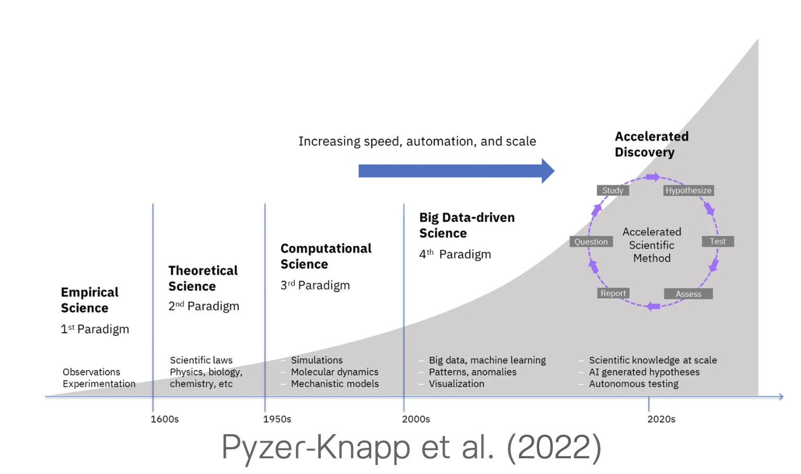

การเรียนรู้ของเครื่องแบบไม่มีผู้สอน (Unsupervised Learning) เป็นแนวทางของปัญญาประดิษฐ์ที่มุ่ง “ทำความเข้าใจโครงสร้างของข้อมูล” โดยไม่ต้องอาศัยตัวแปรเป้าหมายหรือคำตอบที่ถูกต้องล่วงหน้า ต่างจาก supervised learning ที่ฝึกโมเดลจากตัวอย่างที่มีป้ายกำกับ unsupervised learning ทำงานกับข้อมูลดิบเพื่อค้นหารูปแบบ (patterns) ความสัมพันธ์ (structures) หรือมิติที่ซ่อนอยู่ (latent dimensions) ภายในชุดข้อมูลนั้น

ในบริบททางการศึกษา unsupervised learning ช่วยให้เราเข้าใจลักษณะของผู้เรียน โรงเรียน หรือพฤติกรรมการเรียนรู้ได้ลึกขึ้น เช่น การจำแนกกลุ่มผู้เรียนตามพฤติกรรมการเรียนรู้ หรือ การลดมิติข้อมูลขนาดใหญ่เพื่อให้วิเคราะห์ได้ง่ายขึ้น โดยไม่ต้องเริ่มจากสมมติฐานว่าควรแบ่งอย่างไร



เอกสารนี้จะกล่าวถึง 2 หัวข้อหลักของ unsupervised learning

1.  clustering เทคนิคที่ใช้จัดกลุ่มข้อมูลที่คล้ายกันให้อยู่ในกลุ่มเดียวกัน เช่นการจัดกลุ่มนักเรียนตามพฤติกรรมหรือผลการเรียนรู้
2.  dimensionality reduction เทคนิคที่ใช้ลดจำนวนตัวแปรหรือคุณลักษณะของข้อมูล เพื่อให้เข้าใจสภาพปรากฏการณ์ได้ง่ายขึ้น หรือสามารถประมวลข้อมูลได้ง่ายขึ้นมีประสิทธิภาพมากขึ้น โดยยังคงรักษาโครงสร้างสำคัญของข้อมูลไว้

## Clustering

-   บทเรียนนี้จะกล่าวถึง library-tidyclust ที่ถูกออกแบบให้เป็น API ของการทำ clustering ภายใต้แนวคิดของ tidyverse

-   tidyclust คือส่วนขยายของ tidymodels ที่ออกแบบให้สร้างโมเดลจัดกลุ่มในลักษณะเดียวกับการทำงานบน tidymodels เช่น การใช้ recipes สำหรับเตรียมข้อมูล การสร้าง workflow เพื่อจัดการกระบวนการ และการปรับแต่ง hyperparameter อย่างเป็นระบบ ซึ่งช่วยอำนวยความสะดวกให้กับการทำงานด้านวิทยาการข้อมูล

> tidyclust = parsnip สำหรับ clustering

### 1. โครงสร้างการใช้งานพื้นฐาน

การใช้งาน tidyclust มีโครงสร้างพื้นฐานคล้ายกับการใช้งาน tidymodels อื่น ๆ โดยมีขั้นตอนหลัก ๆ ดังนี้

-   นำเข้าข้อมูล

-   ระบุโมเดล

-   fit โมเดล

-   ตรวจสอบผลลัพธ์ และแปลความหมาย

### 2. นำเข้าข้อมูล และจัดการข้อมูลเบื้องต้น

```{r}
library(tidyverse)
library(tidymodels)
library(tidyclust)
library(tidyllm)
library(furrr) ## ทำ parallel processing ส่วนต่อขยายของ purrr --> map()
plan(multisession, workers = 10)

data <- read_csv("example.csv") 
glimpse(data)
data %>% count(category)
data %>% 
  head(20) %>% 
  pull(phrase)
```

การแปลง (represent) ข้อความของชุดข้อมูลนี้ เราจะเอา category มาผนวกกับข้อความเพื่อเพิ่มบริบท โดยคาดหวังว่า embedding vector ที่ได้น่าจะอยู่ใน position ที่เหมาะสมขึ้น

```{r}
### จัดเตรียมข้อมูล
temp <- data %>% 
  mutate(paste_text = paste(category, phrase, sep = " "))
temp

```

```{r}
### เตรียม embedding
embedding_openai <- future_map(
  .x = temp$paste_text,
  .f = ~ tidyllm::embed(
  .input = .x,
  .provider = openai(),
  .model = "text-embedding-3-small" ## สร้าง embeddding vector ขนาดประมาณ 1500 มิติ
),
.progress = TRUE
)

embedding_nomic <- future_map(
  .x = temp$paste_text,
  .f = ~ tidyllm::embed(
  .input = .x,
  .provider = ollama(),
  .model = "nomic-embed-text:latest"
),
.progress = TRUE
)
```

ผลลัพธ์ที่ได้จะได้ vector representation ที่อยู่ในรูปแบบ list-column ของ tibble

```{r}
openai_embedding <- embedding_openai %>%  ## list ของ emegbedding vecotor
  bind_rows() %>%  ## แปลงให้เป็น tibble ของ embedding vector
  unnest_wider(embeddings, names_sep = "_") %>% 
  bind_cols(temp %>% dplyr::select(category, phrase)) %>% 
  dplyr::select(category, phrase, everything()) %>% 
  dplyr::select(-input)

nomic_embedding <- embedding_nomic %>%  ## list ของ embedding vector
  bind_rows() %>%  ## แปลงให้เป็น tibble ของ embedding vector
  unnest_wider(embeddings, names_sep = "_") %>% 
  bind_cols(temp %>% dplyr::select(category, phrase)) %>% 
  dplyr::select(category, phrase, everything()) %>% 
  dplyr::select(-input)

nomic_embedding %>% glimpse()
```

### 3. สร้างโมเดล และ Workflow

ปัจจุบัน tidyclust เป็น version 0.2.4 รองรับโมเดล clustering ดังนี้

-   k-means clustering

-   hierarchical clustering

```{r}
### กำหนด recipe
rec_clust <- recipe( ~ . , data = nomic_embedding) %>% 
  update_role(category, phrase, new_role = "id") %>%
  step_normalize(all_numeric_predictors()) 

### สร้างโมเดล k-means
kmeans_spec <- tidyclust::k_means(
  mode = "partition",
  num_clusters = 4
  ) %>% 
  set_engine("stats")

### สร้าง workflow ของการจัดกลุ่ม

wf_kmeans <- workflow() %>% 
  add_recipe(rec_clust) %>%
  add_model(kmeans_spec)
```

### 4. Fit โมเดล และตรวจสอบผลลัพธ์

การ fit model สามารถใช้ `fit()` เหมือนกับการ fit โมเดลใน tidymodels อื่น ๆ

```{r}
### fit model
kmeans_fit <- wf_kmeans %>% 
  fit(data = nomic_embedding)

### ดึงผลลัพธ์การจัดกลุ่ม
kmeans_data <- kmeans_fit %>% augment(nomic_embedding)

### visualization
kmeans_data %>% 
  ggplot(aes(x = .pred_cluster, 
             fill = .pred_cluster)) +
  geom_bar()+
  theme_light()
```

```{r}
kmeans_data %>% 
  ggplot(aes(x = .pred_cluster, fill = category))+
  geom_bar(position = "dodge")+
  theme_light()+
  theme(legend.position = "right")
```

### 5. การประเมินคุณภาพของ cluster

การประเมินคุณภาพของ cluster อาจจำแนกได้เป็น 3 ประเภทหลัก ได้แก่

**1. internal validation** (เช่น Within-Cluster Sum of Squares (WSS), Silhouette coefficient, Davies–Bouldin index, Calinski–Harabasz index) ใน clustering เป็นเครื่องมือที่ใช้วัดคุณภาพแบบ “in-sample” คล้ายกับการวัด fit ของโมเดลใน supervised learning แต่ไม่เหมือนกันทั้งหมด เพราะไม่มี target label หรือค่าความถูกต้องที่แท้จริงให้เทียบ

-   ใน supervised learning เราตรวจดูว่าโมเดลอธิบายข้อมูลที่ใช้รันได้ดีแค่ไหน (เช่น R², MSE) ส่วนใน clustering จะดูว่ากลุ่มที่สร้างขึ้นมีคุณสมบัติดีในเชิงสถิติ เช่น กลุ่มภายในใกล้กันมากน้อยเพียงใด กลุ่มที่แตกต่างกันมีการแยกออกจากการชัดเจนเพียงใด

-   Internal measures ใน clustering ไม่รับรองว่าโมเดลเหมาะสมหรือ generalise ได้ดีกับข้อมูลใหม่ หรือมีความหมายจริงในโดเมน เพราะประเมินแค่โครงสร้างกลุ่มโดยไม่เปรียบเทียบกับ ground truth

ดังนั้นควรใช้ internal measures เป็นขั้นแรกเพื่อประเมินคุณภาพของกลุ่มเบื้องต้น และควรเสริมด้วย stability test หรือ external validation (ถ้ามี)

**2. stability validation** คือการทดสอบความเสถียรของผลลัพธ์การจัดกลุ่มเมื่อมีการเปลี่ยนแปลงข้อมูลหรือพารามิเตอร์ เช่น การใช้ bootstrap resampling หรือ cross-validation เพื่อดูว่ากลุ่มที่ได้ยังคงเหมือนเดิมหรือไม่

-   ตรวจสอบความเสถียรของกลุ่มที่ได้ด้วย resampling techniques เพื่อแบ่งข้อมูลบางส่วนมา fit โมเดลจัดกลุ่ม และใช้ข้อมูลส่วนที่เหลือทดสอบผลการจััดกลุ่ม เพื่อดูว่าผลการจัดกลุ่มมีการเปลี่ยนแปลงไปมากน้อยแค่ไหน มีความคงเส้นคงวาในระดับที่รับได้หรือไม่

-   อีกวิธีการหนึ่งอาจใช้การเปรียบเทียบกับเทคนิค visualization สำหรับมิติสูงบางตัว เช่น การใช้ UMAP หรือ t-SNE ช่วยลดมิติข้อมูลให้อยู่ในรูป 2D หรือ 3D ก่อน และพิจารณาโครงสร้างในภาพรวมของ cluster ว่ามีความสอดคล้อง ชัดเจน เพียงพอหรือไม่

**3. external validation** เป็นการเปรียบเทียบผลลัพธ์ของการจัดกลุ่มที่ได้กับ ground truth ว่ามีความสอดคล้องมากน้อยเพียงใด

-   adjusted Rand index (ARI) วัดความสอดคล้องระหว่างการจับคู่กลุ่มที่โมเดลสร้างขึ้น กับกลุ่มจริง โดยคำนวณจำนวนคู่ที่จัดได้ถูกต้องและไม่ถูกต้อง (pair counting) ค่า ARI จะถูกปรับให้คำนึงถึงความบังเอิญ

-   mutual information (MI) หรือ normalized mutial information (NMI) วัดระดับความสัมพันธ์หรือข้อมูลร่วมกันระหว่างกลุ่มที่โมเดลสร้างขึ้นกับกลุ่มจริง ค่า NMI ใกล้ 1.00 แสดงความสัมพันธ์ที่สอดคล้องกันสูงระหว่างสองกลุ่ม

-   Fowlkes-Mallows index (FMI) วัดความแม่นยำและการครอบคลุมของกลุ่มที่โมเดลสร้างขึ้นเทียบกับกลุ่มจริง โดยพิจารณาคู่ของตัวอย่างที่ถูกจัดกลุ่มร่วมกันในทั้งสองชุด ค่า FMI ใกล้ 1.00 แสดงถึงความแม่นยำและการครอบคลุมที่ดี

-   Purity วัดว่าตัวอย่างในแต่ละกลุ่มที่จัดด้วยโมเดล มีสมาชิกจากกลุ่มจริงเดียวกันมากน้อยแค่ไหน ถ้าแต่ละกลุ่มมีสมาชิกกลุ่มเดียวกันหมด ค่าจะสูง

วิธีการทั้งหมดนี้ช่วยให้ผู้วิเคราะห์และผู้เกี่ยวข้องมั่นใจได้ว่า การจัดกลุ่มที่ใช้มีความสมเหตุสมผลทั้งเชิงเทคนิค และเชิงปฏิบัติ

##### 5.1 Internal validation

ในงาน clustering ที่ไม่ได้มี label หรือ ground truth ที่จะสามารถนำมาใช้เป็นกลุ่มอ้างอิงสำหรับการวิเคราะห์คุณภาพของการจัดกลุ่ม ผู้วิเคราะห์สามารถเลือกใช้ internal validation

วิธีการนี้จะใช้เฉพาะข้อมูลตัวอย่าง และผลลัพธ์ที่วิเคราะห์ได้จากการจัดกลุ่มเท่านั้น ไม่อาศัยข้อมูลจากภายนอกมาช่วยในการประเมินคุณภาพ

concept พื้นฐานทืี่สำคัญ

-   Cohesion (ความเหนียวแน่น/ความกระชับของกลุ่ม) --- หน่วยข้อมูลภายในกลุ่มควรอยู่ใกล้กัน

-   Separation (ความแตกต่างระหว่างกลุ่ม) --- กลุ่มที่แตกต่างกันควรอยู่ห่างหรือแยกกันอย่างชัดเจน

Note: ผลลัพธ์ที่ได้จากการประเมิน internal validation นี้จะช่วยบอกว่า กลุ่มที่ได้จากการวิเคราะห์นี้ มีคุณภาพดีพอหรือไม่ในเชิงโครงสร้างข้อมูล ไม่ได้สะท้อนคุณภาพในเชิงทฤษฎี หรือในเชิงปฏิบัติ

###### Silhouette Score

การคำนวณ Silhouette Score สำหรับแต่ละจุดข้อมูล i จะพิจารณา 2 ปัจจัยได้แก่ Cohesion และ Separation โดยที่ a คือ Cohesion คำนวณจากค่าเฉลี่ยระยะทางระหว่างหน่วยข้อมูลที่สนใจกับทุกหน่วยข้อมูลภายในกลุ่มเดียวกัน ส่วน b คือ separation คำนวณจากค่าเฉลี่ยระยะทางระหว่างหน่วยข้อมูลที่สนใจกับทุกหน่วยข้อมูลในกลุ่มที่อยู่ใกล้มากที่สุด

$$
s(i) = \frac{b(i) - a(i)}{max(a(i), b(i))}
$$ Silhouette Score สำหรับแต่ละจุดข้อมูลจะอยู่ในช่วง -1 ถึง 1 โดยมีความหมายดังนี้

-   เข้าใกล้ 1 หมายถึง จุดข้อมูลนั้นอยู่ในกลุ่มที่เหมาะสม (Cohesion ดี และ Seperation ดี)

-   เข้าใกล้ 0 หมายถึง จุดข้อมูลนั้นอยู่ใกล้กับขอบเขตของกลุ่ม (ไม่ชัดเจน)

-   เข้าใกล้ -1 หมายถึง จุดข้อมูลนั้นอาจถูกจัดกลุ่มผิด เพราะระยะทางเฉลี่ยของเพื่อนบ้านในกลุ่มเดียวกันกลับมีแนวโน้มสูงกว่าระยะทางเฉลี่ยของหน่วยข้อมูลแตกต่างกลุ่ม

ใน tidyclust มีฟังก์ชันช่วยคำนวณคะแนนรวมของ silhouett score

```{r}
sil_avg <- kmeans_fit %>% silhouette_avg(new_data = nomic_embedding)
sil_avg
```

นอกจากนี้ยังสามารถดูค่า silhouette score ของแต่ละจุดข้อมูลได้ด้วย

```{r}
sil_tbl <- tidyclust::silhouette(
              object = kmeans_fit, 
              new_data = nomic_embedding)
sil_tbl %>% 
  ggplot(aes(x = sil_width))+
  geom_histogram(fill = "black", col = "white")+
  theme_light()
```

```{r}
sil_summary_by_cluster <- sil_tbl %>%
  group_by(cluster) %>%
  summarise(
    count = n(),
    avg_sil  = mean(sil_width),
    min_sil  = min(sil_width),
    prop_neg = mean(sil_width < 0)
  )
sil_summary_by_cluster
```

```{r}
 sil_tbl %>%
  mutate(rowname = row_number()) %>% 
  ggplot(aes(
    x = reorder(rowname, sil_width), 
    y = sil_width, fill = as.factor(cluster))) +
  geom_bar(stat = "identity") +
  coord_flip() +
  labs(x = "Data Point", y = "Silhouette Width", fill = "Cluster") +
  theme(
    panel.border = element_rect(color = "black"),
    panel.background = element_rect(fill = "white"),
    panel.grid = element_blank(),
    axis.title.y = element_blank(),   # เอา title แกน y ออก
    axis.text.y = element_blank(),    # เอา text (tick labels) แกน y ออก
    axis.ticks.y = element_blank()    # เอา tick marks แกน y ออก
  )
```

```{r}
sil_tbl %>% 
  bind_cols(nomic_embedding %>% dplyr::select(phrase, category)) %>% 
  filter(sil_width < 0.25) %>% 
  group_by(category) %>% 
  summarise(
    n = n(),
    mean_sil = mean(sil_width)
  )
  
```

ผลการวิเคราะห์ข้างต้นพบว่า ...

ข้อเสนอแนะจากผลการวิเคราะห์นี้ ...

###### SSE Ratio Value

-   อีกหนึ่งวิธีการในการประเมินคุณภาพของการจัดกลุ่มคือ การใช้ SSE Ratio Value (SSER) ซึ่งเป็นการวัดความกระชับของกลุ่ม (Cohesion) โดยพิจารณาจากผลรวมของระยะทางยกกำลังสองภายในกลุ่ม (Sum of Squared Errors - SSE) จริง ๆ คือค่า Within-Cluster Sum of Squares (WSS) ที่กล่าวถึงในคลิป

-   Within SS (หรือ WSS) คือผลรวมของระยะห่างยกกำลังสองของทุกจุดในแต่ละกลุ่มถึงศูนย์กลางของกลุ่มนั้นๆ. ยิ่งค่านี้น้อย → ยิ่งแสดงว่าจุดภายในกลุ่มอยู่ใกล้กันมาก → กลุ่มมีความกระชับ (good cohesion)

```{r}
### ภาพรวม : อัตราส่วนระหว่าง WSS/Total SS
wss_ratio <- sse_ratio(kmeans_fit, new_data = nomic_embedding)
wss_ratio
```

```{r}
### คำนวณ WSS แยกรายกลุ่ม
wss_by_cluster <- sse_within(kmeans_fit, new_data = nomic_embedding)
total_ss <- sse_total(kmeans_fit, new_data = nomic_embedding)
wss_by_cluster %>% 
  mutate(total_ss = total_ss %>% pull(.estimate)) %>% 
  mutate(wss_ratio = wss/total_ss,
         wss_ratio2 = wss/sum(wss))
```

#### 5.2 กิจกรรม

นำชุดข้อมูลข้างต้น มาทำ kmeans clustering โดยวิเคราะห์จำนวนกลุ่มตั้งแต่ 4-8 จากนั้นใช้ internal validation วิเคราะห์เพื่อประเมินว่า solution ไหนน่าจะมีแววไปต่อได้

##### 5.3 Stability validation

-   การทดสอบ stability ของผลลัพธ์การจัดกลุ่ม (clustering stability validation) มีเป้าหมายเพื่อประเมินว่า โครงสร้างของกลุ่มที่ได้มีความมั่นคงเพียงใด เมื่อข้อมูลเปลี่ยนไปเล็กน้อยหรือเมื่อโมเดลถูก fit ซ้ำ ๆ ภายใต้สภาวะที่แตกต่างกัน

แนวทางการทดสอบ stability validation

1.  cross-validation : วัดความสอดคล้องของค่าตัวชี้วัดภายใน (เช่น silhouette score, SSE ratio) ข้ามแต่ละ fold เพื่อดูว่าโมเดลที่ใช้จำนวนคลัสเตอร์ k หนึ่ง ๆ มีความคงเส้นคงวาเพียงใด เป็นการประเมิน model-level stability เพื่อใช้เลือกค่า k ที่ให้คุณภาพโดยรวมดีที่สุดและไม่อ่อนไหวต่อการสุ่มข้อมูล

2.  bootstrap resampling : เมื่อเลือกจำนวนคลัสเตอร์ k ที่เหมาะสมแล้ว ทำการสุ่มตัวอย่างข้อมูลใหม่แบบมีการคืนตัวอย่าง (bootstrap) และ fit โมเดลซ้ำหลายครั้ง เพื่อสังเกตว่าค่าตัวชี้วัดภายใน เช่น silhouette score ยังคงมีค่าใกล้เคียงกับเดิมหรือไม่ การกระจายตัวของค่าดัชนีดังกล่าวสะท้อนความเสถียรของโครงสร้างกลุ่ม (cluster-level stability) ต่อความผันผวนของข้อมูล หากค่าเฉลี่ยคงที่และส่วนเบี่ยงเบนต่ำ แสดงว่าโครงสร้างของคลัสเตอร์มีความมั่นคงและน่าเชื่อถือือพารามิเตอร์

3.  การตีความผลการตรวจสอบ : ผลของการทดสอบ stability เป็นเพียงมิติหนึ่งของการประเมินคุณภาพโมเดลจัดกลุ่ม โดยเฉพาะเมื่อไม่มี ground truth ให้เปรียบเทียบ การมีค่า stability สูงบ่งชี้ถึงความน่าเชื่อถือเชิงโครงสร้าง แต่ผู้วิเคราะห์ยังควรพิจารณาความสอดคล้องของผลลัพธ์กับกรอบแนวคิดเชิงทฤษฎีหรือบริบทของข้อมูล (เช่น ความสมเหตุสมผลของกลุ่มที่เกิดขึ้นจริงในเชิงปฏิบัติ) เพื่อให้การประเมินมีความหมายเชิงเนื้อหามากขึ้น

###### Model-level stability

concept นี้คือการทำ cross-validation เพื่อ tune hyperparameters เหมือนกับในการทำ supervised learning เลย

```{r}
library(future)
plan(multisession, workers = 10)
```

```{r}
### สร้างโมเดล k-means ใหม่ กำหนด tuning parameters
kmeans_spec <- tidyclust::k_means(
  mode = "partition",
  num_clusters = tune(),
  ) %>% 
  set_engine("stats")

wf_kmeans <- workflow() %>% 
  add_recipe(rec_clust) %>%
  add_model(kmeans_spec)

## กำหนดจำนวน grid
grid <- tibble(num_clusters = 4:8)

## สร้าง folds
set.seed(123)
folds <- vfold_cv(nomic_embedding, v = 5, strata = category)

kmeans_tuned <- wf_kmeans %>% 
  tune_cluster(
    resamples = folds,
    grid = grid,
    metrics = cluster_metric_set(silhouette_avg, sse_ratio),
    control = control_grid(save_pred = TRUE,
                           parallel_over = "resamples",
                           verbose = TRUE))

kmeans_tuned %>% collect_metrics() %>% 
  ggplot(aes(x = num_clusters, y= mean, group = .config))+
  geom_point() + 
  geom_errorbar(aes(ymin = mean - std_err, ymax = mean + std_err), width = 0.2)+
  theme_light()+
  facet_wrap(~.metric, scales = "free_y")
```

```{r}
kmeans_tuned %>% collect_predictions() %>% 
  filter(num_clusters == 7) %>% 
  ggplot(aes(x = .pred_cluster, fill = .pred_cluster))+
  geom_bar()

```

```{r}
kmeans_tuned %>% collect_predictions() %>% 
  filter(num_clusters == 7) %>% 
  bind_cols(nomic_embedding %>% dplyr::select(category, phrase))  %>% 
  ggplot(aes(x = .pred_cluster, fill = category))+
  geom_bar(position = "dodge")+
  theme_light()+
  theme(legend.position = "right")+
  coord_flip()

kmeans_tuned %>% collect_predictions() %>% 
  filter(num_clusters == 7) %>% 
  bind_cols(nomic_embedding %>% dplyr::select(category, phrase))  %>% 
  filter(.pred_cluster == "Cluster_1") %>% 
  dplyr::select(category, phrase)
```

สมมุติว่าเราเลือก k = 7 เป็นจำนวนกลุ่มที่เหมาะสมที่สุด

```{r}
kmeans_spec_best <- tidyclust::k_means(
  mode = "partition",
  num_clusters = 7,
  ) %>% 
  set_engine("stats")

wf_kmeans_best <- workflow() %>% 
  add_recipe(rec_clust) %>%
  add_model(kmeans_spec_best)

```

###### Cluster-level stability

วัตถุประสงค์ของการวิเคราะห์ส่วนนี้ คือเพื่อประเมินความเที่ยง/ความน่าเชื่อถือของผลการวิเคราะห์ในระดับกลุ่ม ว่ามีความคงเส้นคงวาเพียงใด

โดยปกติเราจะใช้การสุ่มซ้ำแบบ bootstraping มากกว่าการทำ kfold_cv

```{r}
## เริ่มจาก final embedding
## final_embedding %>% glimpse()

## สร้าง resamples ในสถานการณ์นี้เราเลือก bootstrap (ทำไมนะ?)
set.seed(123)
boot_stability <- bootstraps(nomic_embedding, times = 10, strata = "category")
boot_stability
```

จากนั้นเราจะ fit และ test โมเดลซ้ำ ๆ จนครบตามจำนวน resamples ที่มี

```{r}
one_split <- boot_stability$splits[[1]]
data_boot  <- analysis(one_split) ## เรียก in-sample/bootstrap sample มาใช
## assessment(one_split)
model_fit  <- wf_kmeans %>% fit(data = data_boot)


boot_stability %>% 
  mutate(fit_test = purrr::map(.x = splits, .f = ~ analysis(.x)))

```

```{r}
stability_results <- boot_stability %>%
  ### fit โมเดลบน bootstrap sample ซ้ำ ๆ 
  mutate(
    fit_results = purrr::map(
      .x = splits,
      .f = ~ {
      data_boot <- analysis(.x) ## สร้าง bootstrap sample
      wf_kmeans_best %>% fit(data = data_boot)
    })
  ) 
```

```{r}
stability_results %>% 
  slice(1) %>% 
  pull(fit_results)
```

```{r}
## ลองตรวจสอบผลลัพธ์
stability_results %>% head()
stability_results %>% 
  slice(1) %>% 
  pull(fit_results)

```

เมื่อได้ผลการทดสอบจัดกลุ่มของแต่ละ validation dataset แล้วนำผลลัพธ์ดังกล่าวมาวิเคราะห์คุณภาพ เช่น

```{r}
stability_silhouett_avg <- stability_results %>%
  mutate(
    sil_val_analysis = map2_dbl(
      .x = fit_results,
      .y = splits,
      .f = ~ silhouette_avg(
        object = .x, 
        new_data = analysis(.y)) %>% pull(.estimate)
    )
  )

stability_results2
```

##### 5.4 External validation

-   การประเมินคุณภาพของการจัดกลุ่มด้วย external validation จะใช้เมื่อมี ground truth หรือ label ที่แท้จริงสำหรับข้อมูลที่ใช้วิเคราะห์อยู่แล้ว โดยเปรียบเทียบผลลัพธ์ของการจัดกลุ่มที่ได้จากโมเดลกับกลุ่มจริงเหล่านั้น

-   วิธีการประเมินคุณภาพด้วย external validation ที่นิยมใช้ ได้แก่ Adjusted Rand Index (ARI), Mutual Information (MI) หรือ Normalized Mutual Information (NMI), Fowlkes-Mallows Index (FMI) และ Purity เป็นต้น

-   ตัวอย่างการคำนวณ Adjusted Rand Index (ARI) ใน tidyclust

```{r}
### สมมติว่ามี column ชื่อ 'true_cluster' เป็น ground truth
kmeans_data <- kmeans_fit %>%
  augment(final_embedding) %>%
  mutate(true_cluster = .pred_cluster) ## สมมุติ
### คำนวณ ARI

ari_value <- adj.rand.index(
  group1 = kmeans_data$true_cluster,
  group2= kmeans_data$.pred_cluster
)
```

### 6. DBSCAN clustering