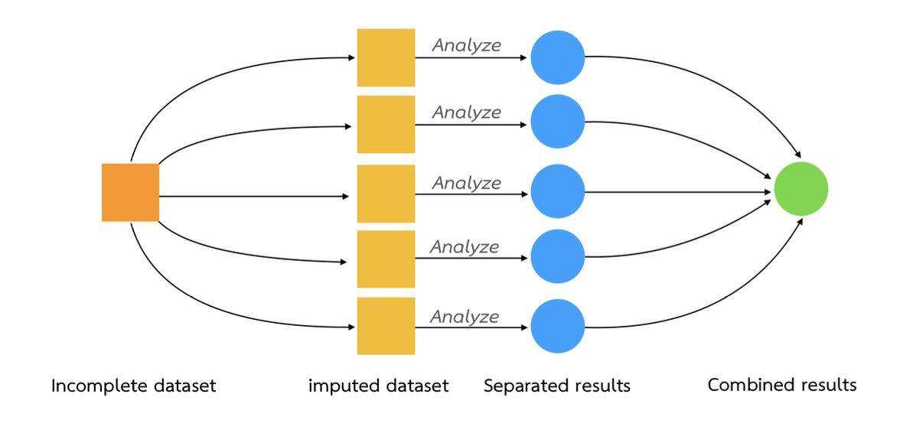

ข้อมูลสูญหาย (missing values) เป็นปัญหาที่พบได้ทั่วไปทั้งในการวิจัย หลายกรณีที่ค่าสูญหายส่งผลกระทบเชิงลบต่อผลการวิเคราะห์ ทำให้ผลการวิเคราะห์ที่ได้เช่น ผลการประมาณค่าพารามิเตอร์ การทดสอบสมมุติฐาน ช่วงความเชื่อมั่น หรือค่าทำนายมีแนวโน้มคลาดเคลื่อนไปจากความเป็นจริง ดังนั้นการจัดการกับข้อมูลสูญหายอย่างเหมาะสมจึงเป็นสิ่งจำเป็นในการวิเคราะห์ข้อมูล ทั้งนี้เพื่อรับประกันว่าผลการวิเคราะห์ที่ได้จะปราศจากหรือมีความลำเอียงน้อยที่สุด

สาเหตุการสูญหายของข้อมูลเป็นไปได้อย่างหลากหลาย ทั้งการจงใจหรือลืมที่จะให้ข้อมูลของกลุ่มเป้าหมาย ความผิดพลาดในการบันทึกข้อมูล อุปสรรคอื่น ๆ ในการให้ข้อมูล ไปจนถึงการออกแบบการเก็บรวบรวมและจัดกระทำข้อมูล อย่างไรก็ตามไม่ว่าสาเหตุจะเป็นอะไรอาจจัดกลุ่มสาเหตุดังกล่าวได้เป็น 3 ด้านคือ สาเหตุด้านผู้ให้ข้อมูล ด้านเครื่องมือที่ใช้วัดค่าสังเกตหรือเก็บรวบรวมข้อมูล และด้านการเก็บรวบรวมและการจัดกระทำข้อมูลของผู้วิจัย/ผู้วิเคราะห์

## สาเหตุของการสูญหายของข้อมูล

การสูญหายของข้อมูลเป็นไปได้จากสาเหตุที่หลากหลาย ขึ้นอยู่กับบริบทและวิธีการเก็บรวบรวมข้อมูลที่ผู้วิจัยใช้ด้วย โดยรวมอาจจำแนกสาเหตุการสูญหายของข้อมูลได้เป็นดังนี้

**1. สาเหตุจากผู้ให้ข้อมูลหรือวิธีการวัดค่าสังเกต** ซึ่งเป็นไปได้หลากหลายลักษณะ เช่น ในการวิจัยเชิงสำรวจที่มีการเก็บรวบรวมข้อมูลด้วยแบบสอบถามหรือแบบวัด มีความเป็นไปได้ที่ผู้ตอบอาจลืมตอบคำถามในบางข้อ หรือเลือกที่จะไม่ตอบเพราะไม่มีความรู้ หรือไม่สนใจที่จะให้ข้อมูล หรืออาจมีความสะดวกในการตอบคำถาม ปัจจัยดังกล่าวล้วนเป็นสาเหตุที่ทำให้เกิดค่าสูญหายทั้งสิ้น

อีกลักษณะหนึ่งคือการขาดหายไปจากการที่หน่วยข้อมูลบางหน่วยไม่ได้เข้าร่วมกิจกรรมที่กำหนดไว้สำหรับการเก็บรวบรวมข้อมูล เช่น การออกแบบการเก็บรวบรวมข้อมูลในชั้นเรียน หรือเป็นการบ้านให้กับนักเรียน แต่อาจมีนักเรียนบางคนที่ไม่ได้เข้าเรียนในวันดังกล่าว หรือไม่ส่งการบ้าน สถานการณ์ดังกล่าวทำให้เกิดค่าสูญหายได้เช่นเดียวกัน

ความผิดพลาดของอุปกรณ์วัดก็เป็นปัจจัยในด้านนี้ด้วย เช่น ผู้วิจัยอาจเลือกใช้ smart watch เป็นเครื่องมือในการวัดชีพจร และตัวชี้วัดทางกายภาพของผู้เรียนระหว่างการจัดการเรียนรู้ อาจมีความเป็นไปได้ที่ผู้เรียนบางคนไม่ได้ใส่อุปกรณ์อย่างถูกต้อง หรืออุปกรณ์ทำงานผิดพลาดจากสาเหตุอื่น ๆ ทำให้ไม่สามารถเก็บรวบรวมข้อมูลได้อย่างครบถ้วน

การสูญหายที่เกี่ยวข้องในประเด็นนี้อาจเกิดจากอุปสรรคในการเข้าถึงสื่อหรือเครื่องมือที่การเก็บรวบรวมข้อมูลด้วย เช่น ผู้วิเคราะห์อาจออกแบบการเก็บรวบรวมข้อมูลโดยใช้การตอบแบบสอบถามบน google form หรือ application อื่นที่ต้องใช้อุปกรณ์คอมพิวเตอร์หรือ smart device ในการเข้าถึง แต่หากช่วงเวลาที่ดำเนินการเก็บรวบรวมข้อมูล หน่วยข้อมูลไม่มีอุปกรณ์หรือ internet หรือมีอุปสรรคที่ไม่สามารถเข้าถึงแบบสอบถามดังกล่าวได้ ก็อาจเป็นสาเหตุที่ทำให้เกิดค่าสูญหายได้เช่นเดียวกัน

**2. สาเหตุจากการยุบรวมข้อมูลจากแหล่งข้อมูลที่หลากหลาย** การวิเคราะห์ข้อมูลโดยเฉพาะในโครงการที่ใช้ฐานข้อมูลทุติยภูมิในปัจจุบัน มักจะต้องมีการเชื่อมโยงหรือรวมข้อมูลระหว่างฐาน ทั้งการเชื่อมโยงตามแนวคอลัมน์เพื่อให้ได้ข้อมูลคุณลักษณะหรือตัวแปรของหน่วยข้อมูลที่มีความสมบูรณ์ หรือการเชื่อมโยงตามแนวแถวเพื่อให้ได้หน่วยข้อมูลที่ครอบคลุมหรือเป็นตัวแทนของกลุ่มเป้าหมาย อย่างไรก็ตามการเชื่อมโยงข้อมูลจากหลายฐานข้อมูลมีโอกาสที่จะเกิดค่าสูญหายอันเนื่องมาจากรูปแบบหรือระบบบันทึกเก็บข้อมูลระหว่างฐานที่แตกต่างกัน เช่น

ความแตกต่างในรูปแบบของรหัสที่จะใช้เชื่อมโยง กล่าวคือในฐานข้อมูลหนึ่งอาจะใช้รูปแบบรหัสบ่งชี้หน่วยข้อมูลเป็นรูปแบบหนึ่ง แต่อีกฐานข้อมูลหนึ่งใช้อีกรูปแบบหนึ่ง ลักษณะนี้ทำให้การเชื่อมโยงข้อมูลจากฐานข้อมูลทั้งสองไม่สามารถทำได้จากรหัสบ่งชี้หน่วยข้อมูล แต่จะต้องเลี่ยงไปใช้ข้อมูลของตัวแปรอื่น ๆ เข้ามาช่วย ซึ่งอาจทำให้ไม่สามารถเชื่อมโยงข้อมูลทั้งสองฐานได้อย่างสมบูรณ์

รูปแบบการจัดเก็บข้อมูลที่แตกต่างกัน เช่น ฐานข้อมูลหนึ่งบันทึกวันที่ในรูปแบบ DD/MM/YYYY แต่อีกฐานหนึ่งอาจบันทึกในรูปแบบ MM/DD/YYYY หากมีการใช้ข้อมูลวันที่เป็นตัวแปรหนึ่งที่เชื่อมโยงฐานข้อมูลเข้ากัน จะทำให้ผลลัพธ์ที่ได้เป็นค่าสูญหาย เพราะไม่สามารถเชื่อมโยงฐานทั้งสองเข้าด้วยกันได้

ความไม่สอดคล้องของข้อมูลในตัวแปรเดียวกัน เช่น ฐานข้อมูลด้านการศึกษาหนึ่งอาจบันทึกสถานะของนักเรียนเป็น “จบการศึกษา” หรือ “ยังศึกษาอยู่” ขณะที่อีกฐานข้อมูลอาจใช้คำว่า “สำเร็จการศึกษา” หรือ “ลงทะเบียนเรียน” ความแตกต่างในคำอธิบายเหล่านี้อาจทำให้เกิดความสับสนหรือข้อมูลสูญหายเมื่อต้องเชื่อมโยงกัน ซึ่งอาจทำให้ผลลัพธ์ที่ได้มีการตัดค่าที่เป็นปัญหานี้ออกไปเกิดเป็นค่าสูญหาย

การขาดข้อมูลในฐานข้อมูลบางส่วน อาจเกิดขึ้นโดยเฉพาะในการรวมข้อมูลตามแถว กล่าวคือ ฐานข้อมูลหนึ่งอาจมีข้อมูลของโรงเรียนที่สังกัดเขตพื้นที่หนึ่งในด้านต่าง ๆ อย่างครบถ้วน แต่เมื่อเชื่อมโยงฐานข้อมูลนี้กับเขตพื้นที่อื่นที่อาจมีข้อมูลไม่สมบูรณ์ในบางตัวแปร ผลลัพธ์ที่ได้จะได้ชุดข้อมูลที่มีค่าสูญหายในตัวแปรดังกล่าว

**3. การเก็บรวบรวมข้อมูลระยะยาว** การเก็บรวบรวมข้อมูลระยะยาวที่ต้องเก็บข้อมูลจากหน่วยข้อมูลเดียวกันหลาย ๆ ครั้ง หากระหว่างทางมีหน่วยข้อมูลออกจากระบบ เช่น ผู้ตอบแบบสอบถามหรือผู้เข้าร่วมการศึกษาไม่สามารถเข้าร่วมการเก็บข้อมูลในช่วงใดช่วงหนึ่งได้ อาจเป็นเพราะย้ายถิ่นฐาน, เปลี่ยนสถานะ, หรือเลิกเข้าร่วมการศึกษา สิ่งนี้จะทำให้เกิดการสูญหายของข้อมูลในช่วงเวลานั้นได้ ข้อมูลขาดหายตามเวลา (attrition) เป็นปัญหาสำคัญในงานวิจัยระยะยาว เพราะอาจทำให้ความต่อเนื่องของข้อมูลไม่สมบูรณ์ และทำให้ผลลัพธ์ที่ได้จากการวิเคราะห์ไม่สะท้อนความเป็นจริงทั้งหมดของหน่วยข้อมูลที่ตั้งใจศึกษา

นอกจากนี้หากการออกกลางคันของผู้ให้ข้อมูลนี้เกิดขึ้นอย่างเป็นระบบ เช่น ผู้เข้าร่วมจากกลุ่มใดกลุ่มหนึ่งออกจากระบบมากกว่ากลุ่มอื่น อาจทำให้เกิดอคติในผลการวิเคราะห์ (attrition bias) ซึ่งจำเป็นที่จะต้องได้รับการจัดการก่อนเพื่อปรับปรุงผลการวิเคราะห์ให้มีความแม่นยำ และน่าเชื่อถือมากขึ้น

## ประเภทของค่าสูญหาย

การจำแนกประเภทของค่าสูญหายสามารถจำแนกได้หลายลักษณะ ขึ้นกับบริบทที่ทำการวิเคราะห์ค่าสูญหาย หรือเกณฑ์ที่ใช้ในการพิจารณา โดยทั่วไปอาจจำแนกค่าสูญหายออกเป็น 3 ประเภท ได้แก่ (1) ข้อมูลสูญหายจากการเก็บข้อมูลหรือการจัดกระทำข้อมูลไม่เหมาะสม (2) ข้อมูลสูญหายจากปรากฏการณ์สุ่ม และ (3) ข้อมูลสูญหายจากสาเหตุเฉพาะ รายละเอียดมีดังนี้

### ข้อมูลสูญหายจากการเก็บข้อมูลหรือการจัดกระทำข้อมูลไม่เหมาะสม

การวิเคราะห์การเรียนรู้ของนักเรียน ผู้วิเคราะห์อาจมีการออกแบบการเก็บรวบรวมข้อมูล**การมาเรียนของนักเรียน** โดยมีการบันทึกข้อมูลไว้ 2 ลักษณะ ได้แก่ มาเรียนตรงเวลา (`ontime`) และมาเรียนสาย (`late`) แต่เมื่อเก็บรวบรวมข้อมูลเสร็จพบว่ามีนักเรียนบางคนไม่มีข้อมูลในตัวแปรนี้ซึ่งทำให้กลายเป็นค่าสูญหาย อย่างไรก็ตามเมื่อพิจารณาเพิ่มเติมพบว่า นักเรียนกลุ่มที่ไม่มีข้อมูลนี้เป็นนักเรียนที่ไม่ได้มาเรียนในวันที่เก็บรวบรวมข้อมูล ทำให้ไม่สามารถระบุได้ว่ามาตรงเวลาหรือมาสาย สภาพดังกล่าวสะท้อนว่าตัวแปรการมาเรียนของนักเรียนที่มีค่าสังเกตเพียง 2 ค่าดังกล่าวไม่เพียงพอ การแก้ปัญหาดังกล่าวสามารถทำได้ด้วยการจัดการข้อมูลใหม่ โดยปรับโครงการของตัวแปรใหม่ ให้มีค่าที่เป็นไปได้ 3 ค่า อีกค่าหนึ่งที่เพิ่มขึ้นมาคือ นักเรียนที่ไม่ได้มาเรียน (`absent`) จะทำให้ตัวแปรนี้มีข้อมูลที่สมบูรณ์

การวิเคราะห์ข้อมูลโดยเฉพาะในโครงการที่ใช้ฐานข้อมูลทุติยภูมิในปัจจุบัน มักจะต้องมีการเชื่อมโยงหรือรวมข้อมูลระหว่างฐาน ทั้งการเชื่อมโยงตามแนวคอลัมน์เพื่อให้ได้ข้อมูลคุณลักษณะหรือตัวแปรของหน่วยข้อมูลที่มีความสมบูรณ์ หรือการเชื่อมโยงตามแนวแถวเพื่อให้ได้หน่วยข้อมูลที่ครอบคลุมหรือเป็นตัวแทนของกลุ่มเป้าหมาย อย่างไรก็ตามการเชื่อมโยงข้อมูลจากหลายฐานข้อมูลมีโอกาสที่จะเกิดค่าสูญหายอันเนื่องมาจากรูปแบบหรือระบบบันทึกเก็บข้อมูลระหว่างฐานที่แตกต่างกัน เช่น

-   ความแตกต่างในรูปแบบของรหัสที่จะใช้เชื่อมโยง กล่าวคือในฐานข้อมูลหนึ่งอาจะใช้รูปแบบรหัสบ่งชี้หน่วยข้อมูลเป็นรูปแบบหนึ่ง แต่อีกฐานข้อมูลหนึ่งใช้อีกรูปแบบหนึ่ง ลักษณะนี้ทำให้การเชื่อมโยงข้อมูลจากฐานข้อมูลทั้งสองไม่สามารถทำได้จากรหัสบ่งชี้หน่วยข้อมูล แต่จะต้องเลี่ยงไปใช้ข้อมูลของตัวแปรอื่น ๆ เข้ามาช่วย ซึ่งอาจทำให้ไม่สามารถเชื่อมโยงข้อมูลทั้งสองฐานได้อย่างสมบูรณ์

-   รูปแบบการจัดเก็บข้อมูลที่แตกต่างกัน เช่น ฐานข้อมูลหนึ่งบันทึกวันที่ในรูปแบบ DD/MM/YYYY แต่อีกฐานหนึ่งอาจบันทึกในรูปแบบ MM/DD/YYYY หากมีการใช้ข้อมูลวันที่เป็นตัวแปรหนึ่งที่เชื่อมโยงฐานข้อมูลเข้ากัน จะทำให้ผลลัพธ์ที่ได้เป็นค่าสูญหาย เพราะไม่สามารถเชื่อมโยงฐานทั้งสองเข้าด้วยกันได้

-   ความไม่สอดคล้องของข้อมูลในตัวแปรเดียวกัน เช่น ฐานข้อมูลด้านการศึกษาหนึ่งอาจบันทึกสถานะของนักเรียนเป็น “จบการศึกษา” หรือ “ยังศึกษาอยู่” ขณะที่อีกฐานข้อมูลอาจใช้คำว่า “สำเร็จการศึกษา” หรือ “ลงทะเบียนเรียน” ความแตกต่างในคำอธิบายเหล่านี้อาจทำให้เกิดความสับสนหรือข้อมูลสูญหายเมื่อต้องเชื่อมโยงกัน ซึ่งอาจทำให้ผลลัพธ์ที่ได้มีการตัดค่าที่เป็นปัญหานี้ออกไปเกิดเป็นค่าสูญหาย

-   การขาดข้อมูลในฐานข้อมูลบางส่วน อาจเกิดขึ้นโดยเฉพาะในการรวมข้อมูลตามแถว กล่าวคือ ฐานข้อมูลหนึ่งอาจมีข้อมูลของโรงเรียนที่สังกัดเขตพื้นที่หนึ่งในด้านต่าง ๆ อย่างครบถ้วน แต่เมื่อเชื่อมโยงฐานข้อมูลนี้กับเขตพื้นที่อื่นที่อาจมีข้อมูลไม่สมบูรณ์ในบางตัวแปร ผลลัพธ์ที่ได้จะได้ชุดข้อมูลที่มีค่าสูญหายในตัวแปรดังกล่าว

### ข้อมูลสูญหายจากปรากฏการณ์สุ่ม

การสูญหายในลักษณะที่สองคือการสูญหายจากปรากฏการณ์สุ่ม เรียกได้ว่าเป็นการสูญหายในเชิงสถิติ [@little2014statistical] โดยสามารถจำแนกได้เป็น 2 ประเภทได้แก่ การสูญหายแบบสุ่มสมบูรณ์ และการสูญหายแบบสุ่ม รายละเอียดมีดังนี้

#### การสูญหายแบบสุ่มสมบูรณ์ (missing completely at random: MCAR)

ข้อมูลสูญหายในตัวแปร $y$ จะเป็นการสูญหายแบบสุ่มสมบูรณ์เมื่อการสูญหายดังกล่าวไม่เกี่ยวข้องหรือไม่สัมพันธ์กับตัวแปรใด ๆ ทั้งที่สังเกตค่าได้และไม่สามารถสังเกตค่าได้ เราสามารถเขียนสมการทางคณิตศาสตร์เพื่ออธิบายการสูญหายแบบ MCAR ได้ดังนี้

กำหนดให้ $m_{ij}$ เป็นตัวแปร dummy แสดงการสูญหายของหน่วยข้อมูลที่ i ในตัวแปรที่ j ถ้ามีค่าเท่ากับ 1 คือเป็นค่าสูญหาย และ $x_{obs}$ คือข้อมูลที่ผู้วิเคราะห์สามารถสังเกตได้ในชุดข้อมูล ส่วน $x_{mis}$ คือข้อมูลที่สูญหาย กลไกลการสูญหายแบบ MCAR คือความน่าจะเป็นในการสูญหายของหน่วยข้อมูลที่ $i$ ในตัวแปรที่ $j$ เป็นค่าคงที่ ที่ไม่สัมพันธ์หรือขึ้นกับข้อมูลที่สังเกตได้และข้อมูลสูญหาย ดังนี้

$$
p(m_{ij} = 1 | x_{obs}, x_{mis}) = p
$$

กล่าวง่าย ๆ การสูญหายแบบ MCAR เกิดขึ้นเมื่อความน่าจะเป็นที่ข้อมูลจะสูญหายไม่ขึ้นกับค่าของตัวแปรใด ๆ ในชุดข้อมูล ไม่ว่าจะเป็นตัวแปรที่สังเกตค่าได้หรือตัวแปรที่สูญหายไปก็ตาม การสูญหายประเภทนี้เป็นกระบวนการสุ่มที่แท้จริง ข้อมูลที่สูญหายแบบ MCAR ถือว่าเป็นตัวอย่างย่อยที่ถูกสุ่มออกไปจากตัวอย่างทั้งหมด ดังตัวอย่างการจำลองต่อไปนี้

ข้อมูลที่ได้จากการ simulation ด้านล่างแสดงกลไกการเกิดค่าสูญหายแบบ MCAR ได้อย่างชัดเจน

```{r}
library(tidyverse)
## ชุดข้อมูลสมบูรณ์
data <- read_csv('/Users/choat/Documents/GitHub/datakruroo.github.io/diagnostic analytics/exam.csv')
glimpse(data)
```

สมมุติว่ามีการสูญหายแบบ MCAR ขึ้นบนตัวแปร `learning_performance` ร้อยละ 20 สถานการณ์นี้เทียบเท่ากับการสุ่มตัวอย่างแบบ SRS ออกจาก vector ของ `ach` ในสัดส่วน 0.2 ดังนี้

```{r fig.width = 9, fig.height=3}
library(patchwork)
set.seed(123)
## สร้างค่าสูญหายแบบ MCAR
data <- data %>% 
  mutate(learning_performance_mcar = 
        ifelse(runif(387,0,1)<0.2,NA, 
        learning_performance)) 

## นับจำนวนค่าสูญหายในแต่ละตัวแปร
data |> is.na() |> colSums()
p1<-data %>% 
  pivot_longer(cols=starts_with("learning")) %>% 
  ggplot(aes(x=value))+
  geom_histogram(aes(fill = name))+
  theme(legend.position = "top")+
  labs(fill = "")

p2<-data %>% 
  pivot_longer(cols=starts_with("learning")) %>% 
  ggplot(aes(x = value, y=name))+
  geom_boxplot(aes(fill = name))+
  theme(legend.position = "none")+
  ylab("")


p1+p2

```

```{r}
data %>% 
  ggplot(aes(x=learning_performance))+
  geom_point(aes(y=ach),alpha=0.1)+
  geom_point(data = data %>% filter(is.na(learning_performance_mcar)==T), 
             aes(y=ach), col="maroon", shape = 2)+
  theme_light()+
  theme(panel.grid = element_blank())
```

จากรูปข้างต้นจะเห็นว่าชุดข้อมูลที่มีข้อมูลสมบูรณ์และข้อมูลสูญหายแบบ MCAR มีลักษณะการแจกแจงที่คล้ายคลึงกัน ทั้งนี้เป็นเพราะการสูญหายแบบ MCAR ไม่ได้มีความสัมพันธ์กับตัวแปรใด ดังนั้นการสูญหายแบบ MCAR ไม่ได้ทำให้เกิด bias ในการวิเคราะห์ แต่อาจมีผลกับ precision ของการวิเคราะห์ ลองพิจารณาการเปรียบเทียบผลการวิเคราะห์สถิติบรรยาย และสหสัมพันธ์ระหว่างตัวแปรในชุดข้อมูล ระหว่างสถานการณ์ที่มีข้อมูลสมบูรณ์และมีข้อมูลสูญหาย

```{r}
data %>% 
  dplyr::select(learning_performance, ach, learning_performance_mcar) %>% 
  pivot_longer(cols = c(learning_performance, 
                        learning_performance_mcar)) %>% 
  group_by(name) %>% 
  summarise(n= sum(!is.na(value)),
            mean = mean(value, na.rm = T),
            sd = sd(value,na.rm = T),
            se = sd/sqrt(n),
            median = median(value,na.rm = T),
            cor = cor(ach, value, use = "complete.obs"),
            r2 = cor^2)
```

ผลการวิเคราะห์ข้างต้นจะเห็นว่าข้อมูลทั้งสองชุดให้ผลการวิเคราะห์ที่สอดคล้องกันสะท้อนว่าไม่ได้มีปัญหาความลำเอียงในการประมาณค่าพารามิเตอร์ อย่างไรก็ตามหากพิจารณาที่ค่าคลาดเคลื่อนมาตรฐานจะพบว่าข้อมูลที่มีการสูญหายแบบ MCAR มีแนวโน้มจะมีค่าคลาดเคลื่อนมาตรฐานของค่าเฉลี่ยสูงกว่าข้อมูลสมบูรณ์ ซึ่งบ่งชี้ผลกระทบของการขาดหายไปของข้อมูลที่มีต่อความน่าเชื่อถือ

เพื่อยืนยันข้อสรุปข้างต้นเราสามารถทำซ้ำกระบวนการข้างต้นเพื่อวิเคราะห์แนวโน้มความแม่นยำและความน่าเชื่อถือของการประมาณค่าพารามิเตอร์สถิติบรรยายและสหสัมพันธ์ระหว่างตัวแปรในสถานการณ์ที่มีการสูญหายแบบ MCAR ได้ดังนี้

```{r echo = F}
library(tidyverse)
library(purrr)

# จำนวนรอบการจำลอง
n_simulations <- 1000

# ฟังก์ชันสำหรับสร้างชุดข้อมูลที่มีค่าสูญหายแบบ MCAR
create_mcar <- function(data) {
  data %>% 
    mutate(learning_performance_mcar = 
             ifelse(runif(n(), 0, 1) < 0.2, NA, learning_performance))
}

# ทำการจำลอง 1000 รอบและเก็บผลลัพธ์
simulated_datasets <- map(1:n_simulations, ~create_mcar(data))

# ฟังก์ชันคำนวณสถิติเชิงบรรยาย
calc_summary_stats <- function(sim_data) {
  sim_data %>%
    dplyr::select(learning_performance, ach, learning_performance_mcar) %>%
    pivot_longer(cols = c(learning_performance, learning_performance_mcar)) %>%
    group_by(name) %>%
    summarise(
      n = sum(!is.na(value)),
      mean = mean(value, na.rm = TRUE),
      sd = sd(value, na.rm = TRUE),
      se = sd / sqrt(n),
      median = median(value, na.rm = TRUE),
      cor = cor(ach, value, use = "complete.obs"),
      r2 = cor^2
    )
}

# คำนวณสถิติเชิงบรรยายสำหรับแต่ละชุดข้อมูลจำลอง
summary_stats <- map_dfr(simulated_datasets, ~calc_summary_stats(.x), .id = "simulation")

summary_stats |> 
    filter(name == "learning_performance_mcar") |> 
    pivot_longer(cols = 4:9, names_to = "stat", values_to = "value") |> 
    ggplot(aes(x = value))+
    geom_histogram(fill = "steelblue")+
    geom_boxplot(aes(y = 0),width = 20,fill = "white", 
    outlier.size = 0.9)+
    geom_vline(data = summary_stats |> 
    filter(name == "learning_performance") |> 
    pivot_longer(cols = 4:9, names_to = "stat", values_to = "value"), 
    aes(xintercept = value), linetype=2)+
    facet_wrap(~stat, scales = "free_x")+
    theme_light()+
    theme(strip.text = element_text(color = "black"))
```

ผลการวิเคราะห์ข้างต้นจะเห็นว่า การประมาณค่าพารามิเตอร์ที่ทั้งส่วนที่เป็นการบรรยายสภาพของตัวแปร และความสัมพันธ์ระหว่างตัวแปรสามารถประมาณได้โดยไม่ลำเอียง แต่เมื่อพิจารณาค่าคลาดเคลื่อนมาตรฐาน เช่น ค่าคลาดเคลื่อนมาตรฐานของค่าเฉลี่ย (se) มีแนวโน้มที่จะประมาณค่าได้สูงขึ้น เนื่องจากขนาดตัวอย่างที่ลดลง

สรุป : การสูญหายแบบ MCAR ไม่ก่อให้เกิดความลำเอียงในการประมาณค่าพารามิเตอร์ แต่มีผลต่อความน่าเชื่อถือของการประมาณค่า ซึ่งส่งผลโดยตรงต่อความน่าเชื่อถือของการอนุมานเชิงสถิติ เช่น การประมาณช่วงความเชื่อมั่น และการทดสอบสมมุติฐาน

#### การสูญหายแบบสุ่ม (missing at random: MAR)

ข้อมูลสูญหายในตัวแปร $y$ จะเป็นการสูญหายแบบสุ่มเมื่อการสูญหายดังกล่าวมีความสัมพันธ์กับตัวแปรที่สังเกตค่าได้ เราสามารถเขียนสมการทางคณิตศาสตร์เพื่ออธิบายการสูญหายแบบ MAR ได้ดังนี้

$$
p(m_{ij} = 1 | x_{obs}, x_{mis}) = f(x_{obs})
$$

กล่าวง่าย ๆ ได้ว่า MAR เกิดขึ้นเมื่อความน่าจะเป็นของข้อมูลที่จะสูญหาย มีความสัมพันธ์หรือขึ้นอยู่กับ ตัวแปรอื่น ๆ ที่สังเกตค่าได้ในชุดข้อมูล แต่ไม่ขึ้นอยู่กับค่าของตัวแปรที่สูญหายหรือไม่ได้สังเกตค่า เมื่อมีการควบคุมอิทธิพลของตัวแปรที่สังเกตได้ดังกล่าวแล้ว

ดังนั้น ถ้าการมีอยู่ของข้อมูลที่ขาดหายไปในตัวแปรหนึ่ง ๆ มีความสัมพันธ์กับตัวแปรอื่น ๆ ที่ผู้วิเคราะห์มีข้อมูลสามารถสังเกตค่าได้ โดยไม่เกี่ยวข้องกับข้อมูลที่สูญหายไปของตัวแปรนั้น ข้อมูลนั้นจะถือว่าขาดหายไปแบบ MAR กลไกการสูญหายแบบ MAR สามารถอธิบายในเชิงคณิตศาสตร์ได้ดังนี้

ข้อมูลที่ได้จากการ simulation ด้านล่างแสดงลักษณะการสูญหายแบบ MAR

```{r fig.width = 8, fig.height=3}
set.seed(123)
data <- data %>% 
  ## สร้างตัวแปรใหม่ที่สูญหายแบบ MAR โดยมีความสัมพันธ์กับ ach และ engage
  mutate(learning_performance_mar = case_when(
     ach < 40 | engage == "moderate engage"  ~ ifelse(runif(387,0,1)<0.8,NA, learning_performance) ,
    .default = learning_performance
  )
  )
p1<-data %>% 
  pivot_longer(cols=starts_with("learning")) %>% 
  ggplot(aes(x=value))+
  geom_histogram(aes(fill = name))+
  labs(fill = "")+
  theme(legend.position = "none",
        legend.direction = "horizontal")


p2<-data %>% 
  pivot_longer(cols=starts_with("learning")) %>% 
  ggplot(aes(x = value, y=name))+
  geom_boxplot(aes(fill = name))+
  ylab("")+
    theme(legend.position = "none")


p1+p2
```

```{r}
p1<-data %>% 
  ggplot(aes(x = learning_performance)) +
  geom_point(aes(y = ach), alpha = 0.1) +
  geom_point(data = data %>% filter(is.na(learning_performance_mar) == T), 
             aes(y = ach), col = "maroon", shape = 2) +
  geom_smooth(method = "lm", aes(x = learning_performance_mcar, y = ach, color = "MCAR"),
              se = F) +
  geom_smooth(method = "lm", aes(x = learning_performance_mar, y = ach, color = "MAR"),
              se = F) +
  theme_light() +
  scale_color_manual(values = c("MCAR" = "grey", "MAR" = "maroon")) +
  theme(panel.grid = element_blank()) +
  labs(color = "Missing Data Type")

p1

data %>% 
  dplyr::select(learning_performance,learning_performance_mcar, 
         learning_performance_mar, ach) %>% 
  pivot_longer(cols = c(learning_performance,
                        learning_performance_mcar, 
                        learning_performance_mar)) %>%
  group_by(name) %>% 
  summarise(mean = mean(value, na.rm = T),
            sd = sd(value,na.rm = T),
            median = median(value,na.rm = T),
            cor = cor(ach, value, use = "complete.obs"),
            r2 = cor^2)
```

ในทำนองเดียวกัน เราลอง simulate ข้อมูลสูญหายแบบ MAR จำนวน 1000 ชุด จากนั้นประมาณค่าพารามิเตอร์ต่าง ๆ โดยเปรียบเทียบกับ MCAR ที่ได้ทำไว้ก่อนหน้า ผลการวิเคราะห์จะเห็นว่าเมื่อเกิดค่าสูญหายแบบ MAR การประมาณค่าพารามิเตอร์ต่าง ๆ มีแนวโน้มจะลำเอียงและขาดความน่าเชื่อถือ

```{r echo = F}
library(tidyverse)
library(purrr)

# จำนวนรอบการจำลอง
n_simulations <- 1000

# ฟังก์ชันสำหรับสร้างชุดข้อมูลที่มีค่าสูญหายแบบ MAR
create_mar <- function(data){
  data %>% 
  ## สร้างตัวแปรใหม่ที่สูญหายแบบ MAR โดยมีความสัมพันธ์กับ ach และ engage
  mutate(learning_performance_mar = case_when(
     ach < 40 | engage == "moderate engage"  ~ ifelse(runif(387,0,1)<0.8,NA, learning_performance) ,
    .default = learning_performance
  )
  )
}

calc_summary_stats <- function(sim_data) {
  sim_data %>%
    dplyr::select(learning_performance, ach, learning_performance_mar) %>%
    pivot_longer(cols = c(learning_performance, learning_performance_mar)) %>%
    group_by(name) %>%
    summarise(
      n = sum(!is.na(value)),
      mean = mean(value, na.rm = TRUE),
      sd = sd(value, na.rm = TRUE),
      se = sd / sqrt(n),
      median = median(value, na.rm = TRUE),
      cor = cor(ach, value, use = "complete.obs"),
      r2 = cor^2
    )
}


# ทำการจำลอง 1000 รอบและเก็บผลลัพธ์
simulated_datasets_mar <- map(1:n_simulations, ~create_mar(data))

# คำนวณสถิติเชิงบรรยายสำหรับแต่ละชุดข้อมูลจำลอง
summary_stats_mar <- map_dfr(simulated_datasets_mar, ~calc_summary_stats(.x), .id = "simulation")

summary_stats_mar |> 
    filter(name == "learning_performance_mar") |> 
    pivot_longer(cols = 4:9, names_to = "stat", values_to = "value") |> 
    ggplot(aes(x = value))+
    geom_histogram(fill = "steelblue")+
    geom_boxplot(aes(y = 0),width = 20,fill = "white", 
    outlier.size = 0.9)+
    geom_vline(data = summary_stats |> 
    filter(name == "learning_performance") |> 
    pivot_longer(cols = 4:9, names_to = "stat", values_to = "value"), 
    aes(xintercept = value), linetype=2)+
    facet_wrap(~stat, scales = "free_x")+
    theme_light()+
    theme(strip.text = element_text(color = "black"))
```

MAR เป็นการสูญหายทีี่มีความซับซ้อนมากกว่า MCAR การใช้วิธีการง่าย ๆ เช่น การตัดข้อมูลออกไม่ว่าจะเป็นแบบ listwise หรือ pairwise deletion สามารถนำไปสู่ความลำเอียงของผลการวิเคราะห์ การแก้ปัญหาจึงจำเป็นต้องใช้วิธีการที่ซับซ้อนมากขึ้น เพื่อให้ได้ผลลัพธ์ที่มีคุณภาพทั้งในเชิงความแม่นยำของการประเมิน และความน่าเชื่อถือ

### ข้อมูลสูญหายจากสาเหตุเฉพาะ

สาเหตุเฉพาะหรือ Missing Not at Random (MNAR) คือ การสูญหายที่มีความสัมพันธ์กับค่าของตัวแปรที่สูญหายไป นอกจากนี้การสูญหายแบบ MNAR ยังอาจมีความสัมพันธ์ร่วมกับตัวแปรที่สังเกตค่าได้อีกด้วย เราสามารถเขียนสมการทางคณิตศาสตร์เพื่ออธิบายการสูญหายแบบ MNAR ได้ดังนี้

$$
p(m_{ij} = 1 | x_{obs}, x_{mis}) = f(x_{obs}, x_{mis})
$$

กล่าวง่าย ๆ ว่า MNAR เป็นการสูญหายที่เกิดขึ้นโดยสัมพันธ์กับค่าที่สูญหาย การสูญหายแบบนี้ไม่สามารถอธิบายได้ด้วยข้อมูลที่มี เช่น

-   ผู้ตอบไม่ตอบคำถามเกี่ยวกับรายได้เพราะรายได้ของตนเองสูงเกินไป

-   นักเรียนที่มีคะแนนต่ำมากไม่ตอบคำถาม ไม่เข้าเรียน หรือไม่ส่งงานทำให้ครูไม่สามารถประเมินคะแนนให้นักเรียนได้

-   ผู้เรียนที่เรียนไม่เก่ง drop out ออกไปจากชั้นเรียนระหว่างการเรียนรู้ทำให้ไม่สามารถประเมินผลการเรียนรู้หรือตัวแปรที่เกี่ยวข้องได้

ผลลัพธ์ด้านล่างแสดงผลการเปรียบเทียบการวิเคราะห์ในสถานการณ์ที่ข้อมูลสูญหายแบบ MNAR เปรียบเทียบกับการสูญหายแบบอื่น โดยใช้ข้อมูลจำลอง

```{r fig.width = 8, fig.height=3, warning = F}
set.seed(123)
data <- data %>% 
  mutate(learning_performance_mnar = case_when(
    learning_performance < 30  ~ ifelse(runif(387,0,1)<0.8,NA, learning_performance) ,
    .default = learning_performance
  )
  )
p1<-data %>% 
  pivot_longer(cols=starts_with("learning")) %>% 
  ggplot(aes(x=value))+
  geom_histogram(aes(fill = name))+
  theme(legend.position = "none")

p2<-data %>% 
  pivot_longer(cols=starts_with("learning")) %>% 
  ggplot(aes(x = value, y=name))+
  geom_boxplot(aes(fill = name))

p1+p2
```

```{r}
data %>% 
  ggplot(aes(x=learning_performance))+
  geom_point(aes(y=ach),alpha=0.1)+
  geom_point(data = data %>% filter(is.na(learning_performance_mnar)==T), 
             aes(y=ach), col="maroon", shape = 2)+
  theme_light()+
  theme(panel.grid = element_blank())

data %>% 
  dplyr::select(learning_performance, learning_performance_mcar, 
         learning_performance_mar, learning_performance_mnar, ach) %>% 
  pivot_longer(cols = starts_with("learning")) %>% 
  group_by(name) %>% 
  summarise(mean = mean(value, na.rm = T),
            sd = sd(value,na.rm = T),
            median = median(value,na.rm = T),
            cor = cor(ach, value, use = "complete.obs"),
            r2 = cor^2)
```

การตรวจสอบ MNAR ค่อนข้างลำบากเมื่อเปรียบเทียบกับการวิเคราะห์กลไกการสูญหายแบบอื่น ตัวอย่างด้านล่างแสดงให้เห็นว่าเมื่อมีการสูญหายแบบ MAR ผลการวิเคราะห์ความสัมพันธ์ระหว่างการสูญหายกับตัวแปรในชุดข้อมูลมีลักษณะที่เหมือนกับผลการวิเคราะห์ที่ได้จาก MAR กล่าวคือการแยกกลไกการสูญหายแบบ MAR และ MNAR ออกจากกันด้วยข้อมูลเชิงปริมาณแต่เพียงอย่างเดียวทำได้ยากหรืออาจทำไม่ได้เลย

```{r fig.width = 10}
library(naniar)
p1<-data |> 
  bind_shadow() |>  ## สร้าง shadow matrix
  ggplot(aes(x = learning_performance_mcar_NA, y=ach))+
  geom_boxplot()+
  ggtitle("MCAR Mechanism")

p2<-data |> 
  bind_shadow() |>  ## สร้าง shadow matrix
  ggplot(aes(x = learning_performance_mar_NA, y=ach))+
  geom_boxplot()+
  ggtitle("MAR Mechanism")

p3<-data |> 
  bind_shadow() |>  ## สร้าง shadow matrix
  ggplot(aes(x = learning_performance_mnar_NA, y=ach))+
  geom_boxplot()+
  ggtitle("MNAR Mechanism")

p1+p2+p3
```

จากลักษณะการสูญหายแบบ MNAR จะเห็นว่าเป็นกลไกการสูญหายที่มีความท้าทายมากที่สุด การสูญหายลักษณะนี้มีกลไกที่แฝงอยู่เบื้องหลังค่าที่สูญหายอีกทีหนึ่งนี้ การตรวจสอบจึงค่อนข้างยากลำบาก แต่ก็สามารถดำเนินการได้ โดยวิธีการตรวจสอบที่เป็นไปได้ เช่น

การเปรียบเทียบกับทฤษฎีหรือความรู้หรือข้อมูลอื่นที่มีอยู่เกี่ยวกับบริบทที่ทำการวิเคราะห์ ยกตัวอย่างเช่น การเก็บรวบรวมข้อมูลรายได้ผู้ปกครองของนักเรียนซึ่งพบว่ามีค่าสูญหาย เมื่อทำการวิเคราะห์ข้อมูลรายได้ที่เก็บรวบรวมได้ดังกล่าวอาจพบว่าค่าเฉลี่ย และขอบเขตของรายได้ผู้ปกครองนักเรียนในโรงเรียนนี้มีแนวโน้มที่ต่ำกว่าปกติ โดยอาจสังเกตว่าต่ำกว่าผลการสำรวจในอดีต หรือต่ำกว่าที่ควรจะเป็นจากการพิจารณาบริบทแวดล้อมของโรงเรียน กรณีเช่นนี้อาจตั้งสมมุติฐานได้ว่าการสูญหายดังกล่าวเป็นการสูญหายในกลุ่มของนักเรียนที่ครอบครัวมีฐานะร่ำรวย จากตัวอย่างนี้จะเห็นว่าการตรวจสอบการสูญหายแบบ MNAR ต้องอาศัยความรู้ในส่วนอื่นนอกเหนือจากข้อมูลเชิงปริมาณที่เก็บรวบรวมมาแต่เพียงอย่างเดียว

อีกวิธีการหนึ่งคือการใช้โมเดลการวิเคราะห์ความลำเอียงในการเลือกตัวอย่าง (sample dplyr::selection bias) หรือ Heckman dplyr::selection Model หรือ Heckman Correction [@Galimard2018]

กลไกของการสูญหายของข้อมูลมีผลต่อประสิทธิภาพของวิธีการจัดการกับข้อมูลที่สูญหาย [@baraldi2010introduction]

-   วิธีการลบข้อมูล (เช่น การลบแบบ listwise หรือ pairwise) จะทำงานได้ดีเมื่อข้อมูลสูญหายเป็นแบบ MCAR (Missing Completely at Random) ถ้าว่ากันตามตรงใช้วิธีอะไรกับ MCAR ก็ได้ที่ไม่บิดเบือด distribution ของข้อมูลก็ใช้กับ MCAR ได้หมด MCAR เป็นการสูญหายในอุดมคติที่แก้ได้ง่ายมาก แต่มักไม่เกิดขึ้นจริง

-   Multiple Imputation หรือ Full Information Maximum Likelihood (FIML)สามารถทำงานได้ดีกว่าและให้ค่าประมาณพารามิเตอร์ที่ไม่ลำเอียง (unbiased parameter estimates) เมื่อข้อมูลสูญหายเป็นแบบ MCAR หรือ MAR (Missing at Random)

-   อย่างไรก็ตาม สิ่งสำคัญที่ต้องสังเกตคือ วิธีการที่ใช้จัดการกับข้อมูลสูญหายหลายวิธี (เช่น การลบข้อมูล, การใช้ multiple imputation หรือ FIML) ไม่ได้ทำงานดีเมื่อข้อมูลสูญหายเป็นแบบ MNAR (Missing Not at Random)

-   ในความเป็นจริงชุดข้อมูลหนึ่ง ๆ สามารถการค่าสูญหายหลาย ๆ กลไกได้พร้อมกัน แม้กระทั่งตัวแปรเดียวก็อาจมีการสูญหายทั้ง MAR และ MNAR ผสมกันอยู่ ...

## การวิเคราะห์ข้อมูลที่มีค่าสูญหาย

การวิเคราะห์ข้อมูลเมื่อมีค่าสูญหายนั้นมีแนวทางหรือวิธีดำเนินงานที่หลากหลายขึ้นอยู่กับว่าเราอ้างอิงสำนักไหน นักสถิติหรือนักวิทยาการข้อมูลคนไหน กลุ่มไหน อย่างไรก็ตามแนวทางโดยทั่วไปที่เหมือนกันประกอบด้วย

1.  การระบุ สำรวจและวิเคราะห์กลไกการสูญหาย

2.  การแก้ปัญหาค่าสูญหาย

รายละเอียดในแต่ละขั้นตอนมีดังนี้

### การระบุ สำรวจและวิเคราะห์กลไกการสูญหาย

ดังที่ได้กล่าวไว้ข้างต้น ค่าสูญหายมีหลายลักษณะ และหลายกรณีการที่สามารถระบุค่าสูญหายว่าเป็นหน่วยข้อมูลใด หรือหน่วยข้อมูลในกลุ่มใด อาจนำไปสู่การแก้ปัญหาได้ในทันทีหากการสูญหายดังกล่าวเป็นการสูญหายที่เกิดจาการเก็บหรือจัดกระทำข้อมูลที่ไม่เหมาะสม

โดยปกติการใช้ทัศนภาพข้อมูลร่วมกับค่าสถิติเช่น จำนวน หรือร้อยละ เป็นวิธีการพื้นฐานในการระบุค่าผิดปกติที่เกิดขึ้นในชุดข้อมูล อย่างไรก็ตามในการทำงานกับข้อมูลขนาดใหญ่ การสำรวจค่าสูญหายด้วยวิธีการดังกล่าวอาจทำได้ยากและใช้เวลานาน กรณีเช่นนี้การนำอัลกอริทึมการเรียนรู้ของเครื่องมาประยุกต์ใช้อาจให้ประสิทธิภาพที่มากกว่า

#### Tabulating Missing data

ตารางวิเคราะห์ค่าสูญหายอาจจำแนกเป็นสองประเภท คือตารางวิเคราะห์ค่าสูญหายตามคอลัมน์ และตามแถว ดังนี้

```{r}
library(naniar)
onlinelearning_data <- read_csv("/Users/choat/Desktop/onlinelearning_miss.csv")
## ภาพรวม
miss_prop_summary(onlinelearning_data)
```

```{r}
miss_var_summary(onlinelearning_data)
miss_var_table(onlinelearning_data)
```

```{r}
miss_case_summary(onlinelearning_data)
miss_case_table(onlinelearning_data)
```

#### Visualization for Missing data

เทคนิคทั้งหมดในหัวข้อนี้เหมาะสำหรับใช้กับชุดข้อมูลที่มีขนาดไม่ใหญ่มาก

-   heatmap

-   missing data pattern plot

-   co-occurence plot

-   scatter plot

ตัวอย่างมีดังนี้

##### Heatmap

การสร้าง heatmap สามารถทำได้หลายวิธีการ ตั้งแต่การสร้างแบบ manual (ซึ่งทำบ่อย ๆ ก็เหนื่อย) ไปจนถึงมีฟังก์ชันสำเร็จรูปจากหลาย library ตั้งแต่การใช้ ggplot2 ธรรมดาไปจนถึง library เฉพาะ

```{r}
p1<-vis_miss(onlinelearning_data, cluster = TRUE)+
  theme(text = element_text(family = "ChulaCharasNew"))
p1
```

```{r}
p2<-vis_miss(onlinelearning_data, cluster = TRUE, facet = `ประเภทสถานศึกษา`)+
  theme(text = element_text(family = "ChulaCharasNew"))
p2
```

ตัวอย่างข้างต้นจะเห็นว่า heatmap ดูค่อนข้างยากหากข้อมูลมีขนาดใหญ่ โดยเฉพาะข้อมูลที่มีตัวแปรจำนวนมาก ข้อจำกัดหนึ่งของการใช้ฟังก์ชันสำเร็จรูปคือ เราปรับแต่งการนำเสนอได้จำกัด ทำให้การวิเคราะห์มุมมองต่าง ๆ ของ missing value ทำไม่ค่อยได้ตามที่ต้องการ

อีกวิธีการหนึ่งคือการสร้าง heatmap หรือแผนภาพข้อมูลสูญหายเอง โดยใช้ ggplot2 หรือ library ที่เกี่ยวข้องผ่าน shadow matrix ของ naniar ตัวอย่างมีดังนี้

จากชุดข้อมูล data

```{r}
data |> 
  dplyr::select(-learning_performance) |> 
  ### สร้าง shadow matrix
  bind_shadow() |> glimpse()
```

ลองนำ shadow matrix ที่สร้างขึ้นมาใช้ประโยชน์

```{r fig.width = 15, fig.height=8}
p1 <- data |> 
  dplyr::select(-learning_performance) |> 
  ### สร้าง shadow matrix
  bind_shadow() |>
  mutate(student_id = 1:387) |> 
  pivot_longer(cols = ends_with("NA")) |> 
  ggplot(aes(x = name, y= student_id))+
    geom_tile(aes(fill = value))+
    scale_fill_grey()

p2 <- data |> 
  dplyr::select(-learning_performance) |> 
  ### สร้าง shadow matrix
  bind_shadow() |>
  mutate(student_id = 1:387) |> 
  pivot_longer(cols = ends_with("NA")) |> 
  ggplot(aes(x = name, y= reorder(student_id, ach)))+
    geom_tile(aes(fill = value))+
    scale_fill_grey()

p1/p2
```

เมื่อจัดเรียงข้อมูลตาม ach จากน้อยไปมาก จะพบว่าในช่อง MAR มีรูปแบบการสูญหายในกลุ่ม ach น้อยมากกว่ากลุ่ม ach มาก ลักษณะนี้สะท้อนความสัมพันธ์ระหว่างการสูญหายกับตัวแปร ach กล่าวคือกลไกการสูญหายในตัวแปรดังกล่าวมีแนวโน้มเป็น MAR

##### co-occurence plot

co-occurence plot ช่วยแสดงสภาพการสูญหายที่ลึกกว่า heatmap เพราะมีทั้งมิติความถี่ของการสูญหายเป็นรายตัวแปรซึ่งจำแนกเป็นการสูญหายในตัวแปรเดียว และการสูญหายร่วมกัน

```{r}
gg_miss_upset(onlinelearning_data, nset = 10)
```

แผนภาพข้างต้นแสดงให้เห็นว่า ....

##### Scatter plot

บางสำนักเรียกว่า margin plot เป็นแผนภาพที่มีประโยชน์ในการสร้างทัศนภาพข้อมูลในเชิงความสัมพันธ์ระหว่างค่าสูญหายกับตัวแปรที่มีข้อมูลในชุดข้อมูล ซึ่งสามารถใช้สำรวจหรือระบุกลไกการสูญหายของข้อมูลได้

```{r fig.width=10}

p1<-data %>% 
  bind_shadow() %>% 
  ggplot(aes(x = learning_performance_mcar))+
  geom_point(aes(y=ach))+
  geom_rug(aes(y=ach))+
  geom_rug(aes(y=ach ,
               col = learning_performance_mcar_NA))+
  scale_color_manual(values = c("!NA" = NULL, "NA" = "maroon"),
                     labels=c(NULL, "missing in LP"))+
  theme_light()+
  theme(legend.position = "none")+
  ggtitle("MAR Mechanism")


p2<-data %>% 
  bind_shadow() %>% 
  ggplot(aes(x = learning_performance_mar))+
  geom_point(aes(y=ach))+
  geom_rug(aes(y=ach))+
  geom_rug(aes(y=ach ,
               col = learning_performance_mar_NA))+
  scale_color_manual(values = c("!NA" = NULL, "NA" = "maroon"),
                     labels=c(NULL, "missing in LP"))+
  theme_light()+
  theme(legend.position = "top")+
  ggtitle("MAR Mechanism")

p3<-data %>% 
  bind_shadow() %>% 
  ggplot(aes(x = learning_performance_mnar))+
  geom_point(aes(y=ach))+
  geom_rug(aes(y=ach))+
  geom_rug(aes(y=ach ,
               col = learning_performance_mnar_NA))+
  scale_color_manual(values = c("!NA" = NULL, "NA" = "maroon"),
                     labels=c(NULL, "missing in LP"))+
  theme_light()+
  theme(legend.position = "none")+
  ggtitle("MNAR Mechanism")

p1+p2+p3
```

ในทางปฏิบัติหากชุดข้อมูลมีขนาดใหญ่ การที่จะระบุตัวแปรมาสร้างเป็นแผนภาพ scatter ข้างต้นก็ยากเหมือนกัน ...

```{r}
online_learning_data
```


### การสำรวจค่าสูญหายสำหรับข้อมูลขนาดใหญ่

จากข้อจำกัดของการใช้สถิติบรรยายและทัศนภาพข้อมูลพื้นฐานเพื่อสำรวจค่าสูญหาย ทำให้ผู้วิเคราะห์ต้องการตัวช่วยในการสำรวจดังกล่าวสำหรับชุดข้อมูลขนาดใหญ่ เราอาจจำแนกตัวช่วยออกเป็นสองกลุ่ม ได้แก่

-   การวิเคราะห์ลักษณะของค่าสูญหายในชุดข้อมูล เช่่น การวิเคราะห์องค์ประกอบหลักของค่าสูญหาย หรือการวิเคราะห์จัดกลุ่ม

-   การวิเคราะห์กลไกการสูญหายในชุดข้อมูล เช่น การทดสอบ LittleMCAR การวิเคราะห์การถดถอยแบบ logistic หรือการทำ decision tree หรืออัลกอริทึมการเรียนรู้ของเครื่องแบบอื่น ๆ

#### การวิเคราะห์องค์ประกอบหลักของค่าสูญหาย

การวิเคราะห์องค์ประกอบหลัก (Principal Component Analysis หรือ PCA) สำหรับข้อมูลสูญหายเป็นเทคนิคที่ใช้เพื่อลดมิติของข้อมูลและระบุรูปแบบหรือโครงสร้างที่ซ่อนอยู่ในชุดข้อมูล โดยเฉพาะเมื่อข้อมูลมีค่าสูญหายเป็นจำนวนมาก การใช้ PCA ช่วยให้ผู้วิเคราะห์สามารถเข้าใจการสูญหายของข้อมูลในเชิงโครงสร้างว่ามีการกระจายหรือสัมพันธ์กันอย่างไรในตัวแปรต่างๆ

จุดเด่นของ PCA สามารถใช้ในการ**ระบุรูปแบบการสูญหายที่เกิดขึ้นร่วมกัน (co-occurring missingness)** การตรวจสอบลักษณะการสูญหายเช่นนี้จะช่วยให้คุณเห็นความสัมพันธ์ระหว่างการสูญหายของข้อมูลและปัจจัยพื้นฐานที่อาจไม่ได้สังเกตเห็นจากการวิเคราะห์แบบพื้นฐาน ซึ่งนอกจากจะช่วยให้เข้าใจรูปแบบการสูญหายได้ง่ายขึ้นและนำไปสู่การวิเคราะห์ขั้นต่อไปที่แม่นยำขึน

การใช้ PCA ในบริบทนี้สามารถดำเนินการได้ดังนี้

1.  แปลงข้อมูลของตัวแปรที่มีค่าสูญหายเป็น dummy variable โดยใช้ 1 แทนค่าสูญหาย และ 0 แทนค่าที่ไม่สูญหาย (สามารถสร้างได้จาก shadow matrix)

2.  ใช้ PCA เพื่อสกัดองค์ประกอบหลักจาก matrix ของ dummy ดังกล่าว

3.  ลักษณะการทำงานของ PCA คือจะสร้างองค์ประกอบหลักที่สามารถอธิบายความแปรปรวนของตัวแปรต้นฉบับเดิมให้ได้มากที่สุด ดังนั้นเมื่อตัวแปรนำเข้าเป็นแบบ binary 0,1 องค์ประกอบหลักที่ได้จึงจะสะท้อนความแปรปรวนหรือรูปแบบการสูญหายของข้อมูล

```{r}
## list ตัวแปรที่มี missing ในชุดข้อมูล
miss_var <- online_learning_data %>% 
              dplyr::select(where(~ any(is.na(.)))) |> names()
```


```{r}
library(naniar)
### เตรียมชุดข้อมูลค่าสูญหาย ผลลัพธ์ในขั้นตอนนี้จะได้ dummy matrix
missing_mat <- online_learning_data %>% 
  ## คัดเลือกเฉพาะตัวแปรที่มี missing value เท่านั้น
  dplyr::select(all_of(miss_var)) %>% 
  ## สร้าง shadow matrix ด้วย naniar
  bind_shadow() %>% 
  ## เลือกเฉพาะ shadow matrix
  select(ends_with("NA")) %>%
  mutate_all(as.numeric) %>% 
  mutate_all(~.-1)

missing_mat
```


PCA เป็นเทคนิคที่อยู่ในกลุ่ม dimensionalty reduction ซึ่งมีวัตถุประสงค์หลักคือการลดจำนวนตัวแปร โดยการสร้างองค์ประกอบหลักที่เป้นตัวแปรใหม่ มาแทนตัวแปรเดิม โดยที่องค์ประกอบหลักที่จะนำมาใช้งานควรที่จะต้องมีจำนวนน้อยกว่าจำนวนตัวแปรต้นฉบับเดิม ทั้งนี้เพื่อให้การแปลความหมาย การทำความเข้าใจสภาพของตัวแปรต้นฉบับ/ข้อมูลเดิม สามารถทำได้ง่าย มีประสิทธิภาพ

```{r}
### นำไปวิเคราะห์ PCA
pca_res <- princomp(missing_mat)  
pca_res$sdev^2 ## standard deviation ของ PC
### Scree plot --- ใช้พิจารณา/วิเคราะห์ ความสำคัญขององค์ประกอบหลักแต่ละตัว ---> นำไปสู่การเลือกจำนวนองค์ประกอบหลักที่เหมาะสมได้
data.frame(PC = 1:29, eigen = pca_res$sdev^2) %>% 
  ggplot(aes(x=PC, y=eigen))+
  #geom_col()+
  geom_line()+
  geom_point()+
  ggtitle("Scree plot of PC")+
  scale_x_continuous(breaks = 1:29)
```

Scree plot ด้านบนแปลความหมายว่าอย่างไร

Component หรือ Factor Loading คือสหสัมพันธ์ระหว่างตัวแปรต้นฉบับกับองค์ประกอบหลักแต่ละตัว ใช้ตีความหมายขององค์ประกอบหลักใน PCA

```{r}
pca_res$loadings


## component loading matrix
pca_res$loadings[1:29,] %>% 
  data.frame() %>% 
### -----  
  rownames_to_column("var") %>% 
### เลือก 5 องค์ประกอบหลักแรกมา
  dplyr::select(1:6) %>% 
  pivot_longer(cols = 2:6) %>% 
  ggplot(aes(x = value, y = var))+
  geom_col(aes(fill = value > 0))+
  facet_wrap(~name)+
  theme(text = element_text(family = "ChulaCharasNew"))+
  ggtitle("component loading plot")

```


```{r}
## component scores
tibble(com1 = pca_res$scores[,1]) %>%  ## องค์ประกอบหลักของการสูญหายที่โดดเด่นใน climate_online1
  bind_cols(student_id = online_learning_data$student_id) %>% 
  filter(com1 > 0.9) %>% 
  pull(student_id) -> student_com1
```


```{r}
tibble(com2 = pca_res$scores[,2]) %>%  ## องค์ประกอบหลักของการสูญหายที่โดดเด่นใน climate_online1
  bind_cols(student_id = online_learning_data$student_id) %>% 
  filter(com2 < -0.7) %>% 
  pull(student_id) -> student_com2
student_com2
```


```{r}
online_learning_data %>% 
  filter(student_id %in% student_com1) %>% 
  select(climate_online1)

online_learning_data %>% 
  filter(student_id %in% student_com2) %>% 
  select(climate_online3)
```


#### Correlation of Missing Value

จากผลการวิเคราะห์ข้างต้นจะเห็นว่า component score ที่ได้จาก PCA สามารถสะท้อนสภาพการสูญหายโดยเฉพาะะ co-occurence missing value ผู้วิเคราะห์สามารถนำคะแนน component ดังกล่าวไปดำเนินการวิเคราะห์เพื่อระบุกลไกการสูญหายของข้อมูลในมิติต่าง ๆ ที่เกิดขึ้นในชุดข้อมูล ยกตัวอย่างเช่น

```{r fig.width = 8}
## ดึง component score แรกมาลองวิเคราะห์
missing_pca1<- pca_res$scores[,1]
missing_pca2<- pca_res$scores[,2]
par(mfrow=c(1,2))
hist(missing_pca1 |> abs())
hist(missing_pca2 |> abs())

p1 <- onlinelearning_data |> 
  dplyr::select_if(is.numeric) |> 
  dplyr::select(-1,-2) |> 
  bind_cols(missing_pca1 = missing_pca1) |> 
  mutate(missing_pca1 = abs(missing_pca1)) |> 
  pivot_longer(cols = -missing_pca1) |> 
  group_by(name) |> 
  summarise(cor = cor(missing_pca1, value, use = "complete.obs")) |> 
  mutate(r2 = cor^2) |> 
  ggplot(aes(x = r2, y= reorder(name, abs(cor))))+
  geom_col(fill = "steelblue")+
  ylab("")+
  theme_light()+
  theme(text = element_text(family = "ChulaCharasNew"))+
  xlim(0,0.2)

missing_pca2<- pca_res$scores[,2]
p2 <- onlinelearning_data |> 
  dplyr::select_if(is.numeric) |> 
  dplyr::select(-1,-2) |> 
  bind_cols(missing_pca2 = missing_pca2) |> 
  mutate(missing_pca2 = abs(missing_pca2)) |> 
  pivot_longer(cols = -missing_pca2) |> 
  group_by(name) |> 
  summarise(cor = cor(missing_pca2, value, use = "complete.obs")) |> 
  mutate(r2 = cor^2) |> 
  ggplot(aes(x = r2, y= reorder(name, abs(cor))))+
  geom_col(fill = "steelblue")+
  ylab("")+
  theme_light()+
  theme(text = element_text(family = "ChulaCharasNew"))+
  xlim(0,0.2)

p1+p2
```

ผลการวิเคราะห์ข้างต้นแปลความได้อย่างไร

#### Regression of Missing Values

นอกจากการใช้ correlation แล้วเรายังสามารถใช้ regression analysis หรือ logistic regression analysis เพื่อวิเคราะห์

##### Using Linear Regression

```{r}
 onlinelearning_data |> 
  dplyr::select(-1,-2) |> 
  bind_cols(missing_pca1 = missing_pca1) |> 
  mutate(missing_pca1 = abs(missing_pca1)) %>%
  lm(missing_pca1 ~ ., data = .) |> 
  summary()
```

อย่างไรก็ตามจะเห็นว่าผลการวิเคราะห์ข้างต้นมีปัญหา singularity เนื่องจากข้อมูลมีขนาดใหญ่ ตัวแปรมีจำนวนมาก การใส่ตัวแปรทั้งหมดลงไปวิเคราะห์มีแนวโน้มที่จะทำให้เกิดปัญหา multicollinearity การแก้ปัญหาดังกล่าวสามารถทำได้ด้วยการเลือก ML ตัวอื่น ๆ ที่แก้ปัญหาได้โดยตรง เช่น regularized regression หรืออื่น ๆ (ไปเรียนใน ML ดีกว่าครับ)

หากเราทำ ML ยังไม่ได้แล้วจะต้องทำ regression ข้างต้น เราจะลองแก้ปัญหายังไงได้บ้าง ??

##### Using Logistic Regression

นอกจากการทำ linear regression แล้วเรายังสามารถทำ logistic regression ของค่าสูญหายได้ด้วย ในกรณีนี้ขอใช้ตัวอย่างเล็ก ๆ ก่อนเพื่อให้ focus ส่วนเนื้อหา logistic regression ไปพร้อมกับการวิเคราะห์ค่าสูญหายได้ด้วย

เราจะใช้ข้อมูล `data` เพื่อวิเคราะห์กลไกการสูญหายในตัวแปร `learning_performance_mar` ดังนั้นขั้นแรกเราจะจัดกระทำข้อมูลให้มีเฉพาะตัวแปรที่ต้องการใช้งานก่อน

เมื่อตัวแปรตามเป็นตัวแปรแบบ binary ที่มีสองค่าได้แก่ 0,1 จะทำให้ค่าทำนายที่ได้จากสมการถดถอยมีความหมายเป็นสัดส่วนของการเกิดเหตุการณ์ที่สนใจ (เพราะอะไร?) ดังนั้นจึงมีความเป็นไปได้ที่จะใช้สมการถดถอยเชิงเส้นสำหรับอธิบายความสัมพันธ์ระหว่างสัดส่วนหรือความน่าจะเป็นของการเกิดเหตุการณ์ที่สนใจกับตัวแปรอิสระ

จากรูปด้านล่าง (ซ้าย) แสดงการใช้สมการเส้นตรง fit กับความสัมพันธ์ระหว่างตัวแปรตามแบบ binary คือการสูญหายใน learning performance กับผลสัมฤทธิ์ทางการเรียน (ach) เมื่อพิจารณาในส่วน scatter plot จะเห็นว่าความสัมพันธ์ระหว่างการสูญหายใน learning performance กับ ach มีแนวโน้มสัมพันธ์ในทิศทางลบ กล่าวคือการสูญหายมีแนวโน้มพบมากกว่าในกลุ่มนักเรียนที่มี ach ต่ำ ค่าทำนายของสัดส่วนหรือโอกาสการเกิดค่าสูญหาย (พิจารณาจากเส้นตรง) จึงมีแนวโน้มสูงในกลุ่ม ach ต่ำ และมีแนวโน้มลดต่ำลงเมื่อ ach มีแนวโน้มเพิ่มสูงขึ้น ในทางสถิติเรียกโมเดลการวิเคราะห์นี้ว่า โมเดลความน่าจะเป็นเชิงเส้น (linear probability model) อย่างไรก็ตามการใช้โมเดลดังกล่าวเพื่อทำนายความน่าจะเป็นของเหตุการณ์ที่สนใจไม่เหมาะสมนัก ทั้งนี้เป็นเพราะสมการทำนายดังกล่าวสามารถให้ค่าความน่าจะเป็นที่ต่ำกว่า 0 และมากกว่า 1 ได้โดยเฉพาะบริเวณส่วนปลายของการแจกแจง ach ซึ่งไม่สอดคล้องกับสัจพจน์ (axoim) ของความน่าจะเป็น

การแก้ปัญหาดังกล่าวสามารถทำได้ด้วยการปรับเปลี่ยนฟังก์ชันการตอบสนอง (response function) หรือ functional form ของสมการถดถอยให้เป็นแบบ non-linear สมการที่เหมาะสมคือ logistic function หรือที่เรียกว่า Sigmoid curve ดังรูปด้านล่าง (ขวา) ทั้งนี้เป็นเพราะฟังก์ชันดังกล่าวมีลักษณะเป็นเส้นโค้งที่สามารถกำกับค่าความน่าจะเป็นให้อยู่ในช่วง \[0,1\]

```{r echo = F, fig.width = 10}
## linear probability model
p1 <- data |> 
  dplyr::select(ach, learning_performance_mar, engage, ontime_class, practice) |> 
  mutate(missing_in_LP = ifelse(is.na(learning_performance_mar),1,0)) %>% 
  ggplot(aes(x=ach, y=missing_in_LP))+
  geom_jitter(height = 0.01, alpha = 0.5) + 
  geom_smooth(method = "lm")+
  theme_light()+
  labs(title = "Linear Probability Model")+
  scale_y_continuous(breaks = seq(0,1,0.25))


logistic_model <- data |> 
  dplyr::select(ach, learning_performance_mar, engage, ontime_class, practice) |> 
  mutate(missing_in_LP = ifelse(is.na(learning_performance_mar),1,0)) |> 
  with(glm(missing_in_LP ~ ach, family = binomial))

x_seq <- seq(min(data$ach), max(data$ach), length.out = 100)
predicted_probs <- predict(logistic_model, newdata = data.frame(ach = x_seq), type = "response")

p2<-ggplot() +
  geom_jitter(data = data |> 
  dplyr::select(ach, learning_performance_mar, engage, ontime_class, practice) |> 
  mutate(missing_in_LP = ifelse(is.na(learning_performance_mar),1,0)), 
  aes(x = ach, y = missing_in_LP), height = 0.01, alpha = 0.5) + 
  geom_line(aes(x = x_seq, y = predicted_probs), color = "steelblue") +  
  labs(x = "ach", y = "Probability", title = "Sigmoid Curve for Logistic Regression") +
  theme_light()+
  scale_y_continuous(breaks = seq(0,1,0.25))

p1+p2
```

โมเดล logistic regression สามารถเขียนได้หลายรูปแบบ สมการด้านล่างเรียกว่า logistic regression แสดงความสัมพันธ์ระหว่างความน่าจะเป็นของการสูญหายกับตัวแปรอื่น ๆ ที่สังเกตค่าได้ในชุดข้อมูล

$$
p = P(missing = 1) = \frac{1}{1 + e^{-(\beta_0 + \beta_1 x_1 + \beta_2 x_2 + \ldots + \beta_k x_k)}}
$$

อีกรูปแบบหนึ่งของ logistic regression เรียกว่า logit model สมการดังกล่าวสร้างจากการหาอัตราส่วนระหว่างความน่าจะเป็นที่จะเกิดเหตุการณ์ต่อความน่าจะเป็นที่ไม่เกิดเหตุการณ์ เชิงเทคนิคเรียกอัตราส่วนนี้ว่า อัตราส่วนของโอกาส หรือ อัตราต่อรอง (Odd) จะเห็นว่าสมการของ log ของอัตราส่วนดังกล่าวสามารถเขียนได้เป็นความสัมพันธ์เชิงเส้นตรงกับตัวแปรอิสระในโมเดล

$$
\log \left( \frac{p}{1-p} \right) = \beta_0 + \beta_1 x_1 + \beta_2 x_2 + \ldots + \beta_k x_k
$$

การใช้ประโยชน์จาก logistic regression นี้สามารถทำได้สองลักษณะ ลักษณะแรกคือการทำนายโอกาสของการเกิดเหตุการณ์ด้วยข้อมูลของตัวแปรอิสระ อีกลักษณะหนึ่งคือการอธิบายความสัมพันธ์ระหว่างโอกาสของการเกิดเหตุการณ์ที่สนใจกับตัวแปรอิิสระ ในบทเรียนนี้เราจะกล่าวถึงวัตถุประสงค์ข้อที่ 2 ก่อน

จาก logit model ข้างต้นจะเห็นว่าสัมประสิทธิ์การถดถอยในโมเดลสามารถบ่งชี้ความสัมพันธ์ระหว่างโอกาสกับตัวแปรอิสระต่าง ๆ ทั้งเชิงขนาดและทิศทาง โดยถ้าเครื่องหมายเป็นบวกแสดงว่าปัจจัยหรือตัวแปรอิสระนั้นมีความสัมพันธ์เชิงบวกกับโอกาสที่สนใจ หากสัมประสิทธิ์ดังกล่าวมีค่าเข้าใกล้ 0 แสดงว่าปัจจัยดังกล่าวไม่ได้มีความสัมพันธ์เชิงเส้นกับโอกาส

อย่างไรก็ตามการประเมินขนาดของค่าสัมประสิทธิ์จากสมการ logit ยังทำได้ยาก เพราะหน่วยการประเมินเป็น log ของอัตราต่อรอง เพื่อให้สามารถอธิบายความสัมพันธ์ดังกล่าวได้อย่างมีความหมายเราจำเป็นจะต้องสร้างดัชนีที่แปลผลได้ในการรับรู้ของมนุษย์

สมมุติว่า $x_1$ เป็นตัวแปรที่สนใจที่จะวิเคราะห์ขนาดอิทธิพล เราจะกำหนดให้ตัวแปรอิสระอื่น ๆ คงที่ และจะพิจารณาอิทธิพล/ความสัมพันธ์ของ $x_1$ จากการหาตัวเปรียบเทียบ Odd ระหว่างสถานการณ์ที่ $x_1 = x$ และ $x_1 = x+1$

$$
log(Odd|x_1=x) = \beta_0 + \beta_1 (x) + ...
$$

$$
log(Odd|x_1=x+1) = \beta_0 + \beta_1 (x+1) + ...  = \beta_0 + \beta_1 x + \beta_1 + ...
$$

นำสองสมการมาลบกันเพื่อเปรียบเทียบการเปลี่ยนแปลงของ odd ระหว่างสองสถานการณ์ข้างต้น

\begin{flushleft}

$$
log(Odd|x_1=x+1) - log(Odd|x_1=x) = \beta_1
$$

$$
log(\frac{Odd_{x+1}}{Odd_x}) = \beta_1
$$

$$
\frac{Odd_{x+1}}{Odd_x} = \exp{\{\beta_1\}}
$$

\end{flushleft}

ดังนั้นจะเห็นว่า exponential ของสัมประสิทธิ์การถดถอยจะมีความหมายเป็นอัตราส่วนของ Odd เรียกว่า Odd Ratio สามารถแปลความหมายได้ว่า ...

```{r}
data |> 
  dplyr::select(ach, learning_performance_mar, engage, ontime_class, practice) |> 
  mutate(missing_in_LP = ifelse(is.na(learning_performance_mar),1,0)) %>% 
  with(glm(missing_in_LP ~ ach + engage + practice + ontime_class, 
          data = ., family = "binomial")) |> 
  summary()
```

การประเมินประสิทธิภาพของ classification model เช่น logistic regression มีตัวชี้วัดที่แตกต่างจาก linear regression แบบปกติ เครื่องมือหลักที่ใช้ในการสร้างดัชนีประเมินประสิทธิภาพเรียกว่า confusion matrix

```{r}
library(yardstick)
missing_model <- data |> 
  dplyr::select(ach, learning_performance_mar, engage, ontime_class, practice) |> 
  mutate(missing_in_LP = ifelse(is.na(learning_performance_mar),1,0)) %>% 
  with(glm(missing_in_LP ~ ach + engage + practice + ontime_class, 
          data = ., family = "binomial"))

prob_missing <- predict(missing_model)
pred_missing <- ifelse(prob_missing>0.5,1,0)
```

Confusion Matrix คือเครื่องมือที่ใช้ในการวัดประสิทธิภาพของโมเดลการจำแนก (classification) โดยเป็นตารางที่แสดงผลลัพธ์การทำนายของโมเดลเทียบกับผลลัพธ์ที่แท้จริง ตารางนี้ถูกเรียกว่า “confusion” เนื่องจากมันช่วยแสดงให้เห็นว่าโมเดลสับสนอย่างไรในการจำแนกประเภทต่างๆ ในตารางมีส่วนประกอบได้แก่

-   true positive (TP)

-   true negative (TN)

-   false positive (FP)

-   false negative (FN)

```{r}
## confusion matrix
data |>
  mutate(missing_truth = ifelse(is.na(learning_performance_mar),1,0)) |> 
  mutate(missing_truth = factor(missing_truth)) |> 
  bind_cols(pred_missing = pred_missing) |>
  mutate(pred_missing = factor(pred_missing)) |> 
  conf_mat(truth = missing_truth, estimate = pred_missing)
```

จากตารางดังกล่าวสามารถนำไปใช้สร้างดัชนีอีกหลายตัว เช่น

-   accuracy = (TP + TN)/(Total)

-   sensitivity หรือ recall = TP/(TP + FP)

-   specificity = TN/(TN + FN)

-   precision = TP/(TP + FP)

```{r}
data |>
  mutate(missing_truth = ifelse(is.na(learning_performance_mar),1,0)) |> 
  mutate(missing_truth = factor(missing_truth)) |> 
  bind_cols(pred_missing = pred_missing) |>
  mutate(pred_missing = factor(pred_missing)) |> 
  accuracy(truth = missing_truth, estimate = pred_missing)
```

```{r}
data |>
  mutate(missing_truth = ifelse(is.na(learning_performance_mar),1,0)) |> 
  mutate(missing_truth = factor(missing_truth)) |> 
  bind_cols(pred_missing = pred_missing) |>
  mutate(pred_missing = factor(pred_missing)) |> 
  sens(truth = missing_truth, estimate = pred_missing)

data |>
  mutate(missing_truth = ifelse(is.na(learning_performance_mar),1,0)) |> 
  mutate(missing_truth = factor(missing_truth)) |> 
  bind_cols(pred_missing = pred_missing) |>
  mutate(pred_missing = factor(pred_missing)) |> 
  spec(truth = missing_truth, estimate = pred_missing)

data |>
  mutate(missing_truth = ifelse(is.na(learning_performance_mar),1,0)) |> 
  mutate(missing_truth = factor(missing_truth)) |> 
  bind_cols(pred_missing = pred_missing) |>
  mutate(pred_missing = factor(pred_missing)) |> 
  precision(truth = missing_truth, estimate = pred_missing)
```

ผลการวิเคราะห์ข้างต้นบ่งชี้ว่าการสูญหายใน learning_performance_mar มีแนวโน้มสูญหายแบบ MAR อย่างชัดเจน


### การแก้ปัญหาค่าสูญหาย

การแก้ปัญหาค่าสูญหายสามารถดำเนินการได้หลายลักษณะ ทั้งนี้ก็ขึ้นอยู่กับสาเหตุการสูญหายของข้อมูลด้วย กล่าวคือ หากสาเหตุการสูญหายเกิดขึ้นจากการเก็บรวบรวมข้อมูล จัดกระทำข้อมูล เชื่อมโยงข้อมูล การแก้ปัญหาอาจสามารถทำได้โดย เช่น ค้นหาข้อมูลที่ตกหล่นหายไประหว่างกระบวนการเก็บรวบรวม หรือจัดกระทำข้อมูลให้เหมาะสม ตรวจสอบและปรับวิธีการเชื่อมโยงฐานข้อมูล เพื่อให้ได้ข้อมูลกลับมามากขึ้น

หากการสูญหายเกิดจากปรากฏการณ์สุ่ม ได้แก่ MCAR หรือ MAR ผู้วิเคราะห์อาจแก้ไขได้สองลักษณะ ลักษณะแรกคือใช้การตัดข้อมูลที่สูญหายออกจาการวิเคราะห์ หรือเรียกอีกชื่อหนึ่งว่า complete case analysis การแก้ปัญหาแบบนี้ใช้งานได้ในสถานการณ์แบบ MCAR ลักษณะที่สองคือการทดแทนค่าสูญหาย (missing value imputation) ซึ่งสามารถใช้ได้กับทั้ง MAR และ MCAR การทดแทนค่าสูญหายมีหลายวิธีการ ตั้งแต่การทดแทนแบบง่าย ๆ โดยใช้ค่ากลาง เช่น ค่าเฉลี่ย มัธยฐาน การทดแทนด้วยสมการถดถอย และการทดแทนแบบหลายค่า

หากการสูญหายของข้อมูลเกิดจากสาเหตุเฉพาะที่เรียกว่า MNAR (Missing Not at Random) หรือเกิดจากการที่การสูญหายมีความเกี่ยวข้องกับค่าของตัวแปรที่สูญหายเอง การแก้ปัญหาจะซับซ้อนกว่า เนื่องจากไม่สามารถใช้วิธีการตัดข้อมูลที่สูญหายออกหรือการทดแทนข้อมูลแบบง่ายได้

ในกรณีที่การสูญหายเป็น MNAR ผู้วิเคราะห์อาจจำเป็นต้องใช้วิธีที่เฉพาะเจาะจงสำหรับการจัดการข้อมูลที่สูญหาย ซึ่งอาจรวมถึง:

-   การใช้โมเดลสถิติขั้นสูง: เช่น การใช้ dplyr::selection models หรือ Pattern-mixture models ที่ถูกออกแบบมาเพื่อตรวจสอบกลไกการสูญหายของข้อมูลแบบ MNAR โดยจะรวมตัวแปรที่เกี่ยวข้องกับการสูญหายมาในโมเดลด้วย เพื่อสร้างความเป็นไปได้ในการคาดการณ์ค่าที่สูญหาย

-   Multiple Imputation แบบปรับแต่ง: ในบางกรณีสามารถใช้การทดแทนหลายครั้ง (multiple imputation) แบบที่รวมถึงการสร้างโมเดลที่สามารถทำนายค่าสูญหายโดยใช้ตัวแปรอื่นๆ ที่สัมพันธ์กับการสูญหายของข้อมูล

ทั้งนี้วิธีการแก้ปัญหาขึ้นอยู่กับลักษณะและกลไกการสูญหายของข้อมูลที่เกิดขึ้นในแต่ละชุดข้อมูล

บทเรียนนี้จะกล่าวถึงการทดแทนการสูญหายสำหรับ MAR และ MCAR วิธีการทดแทนค่าสูญหายนี้อาจจำแนกได้เป็น 5 กลุ่ม

-   Deletion Methods

-   Simple imputation

-   Donor-based imputation

-   Model-based imputation

-   Multiple imputation

รายละเอียดมีดังนี้

#### Deletion Methods

วิธีการนี้คือการตัดหน่วยข้อมูลที่มีการสูญหายออกจากการวิเคราะห์ ซึ่งเหมาะกับการสูญหายแบบ MCAR เนื่องจากการสูญหายแบบนี้ไม่มีความสัมพันธ์กับค่าของตัวแปรใด ๆ ในชุดข้อมูลดังที่กล่าวไว้ข้างต้น การตัดหน่วยข้อมูลที่มีการสูญหายออกจึงไม่ทำให้เกิดความลำเอียงในการวิเคราะห์

เราอาจจำแนกวิธีการในกลุ่มนี้ออกเป็น 2 ลักษณะ ได้แก่

-   listwise deletion (หรือ complete case analysis) เป็นวิธีการที่ง่ายที่สุด โดยจะตัดแถวข้อมูล (Observation) ที่มีค่าสูญหายออกไปทั้งหมด เหลือไว้เฉพาะข้อมูลที่สมบูรณ์ทุกคอลัมน์เพื่อนำไปวิเคราะห์ ข้อเสียที่สำคัญคือทำให้สูญเสียข้อมูลจำนวนมาก ซึ่งลดทอนอำนาจการทดสอบสมมุติฐานทางสถิติ และหากการสูญหายไม่ได้เป็น MCAR อย่างแท้จริง ผลการวิเคราะห์ที่ได้รับอาจมีความลำเอียงได้ วิธีการนี้เหมาะสำหรับกรณีที่ค่าสูญหายมีจำนวนไม่มาก และรูปแบบของการเกิดค่าสูญหายนั้นไม่ได้กระจายไขว้ไปกับหลายตัวแปรภายในชุดข้อมูล ทั้งนี้เพื่อให้ผลของการตัดหน่วยข้อมูลไม่ก่อให้เกิดปัญหาข้อมูลหายไปจากการวิเคราะห์มากเกินไป ตัวอย่างเช่น

```{r}
library(tidyverse)
library(naniar)
## นำเข้าข้อมูล
online_learning_data <- read_csv("/Users/choat/Desktop/onlinelearning_miss.csv") |> 
  select(-1,-2) |> 
  mutate(student_id = paste0("student_", str_pad(row_number(), width = 3, pad = "0")), .before = 1)

online_learning_data %>% glimpse()
```

```{r}
names(online_learning_data) <- c("student_id",
  "school_type",
  "school_location", 
  "total_courses",
  "online_courses",
  "onsite_courses",
  "school_readiness",
  "video_conference",
  "live",
  "lms",
  "group_chat",
  "email",
  "collap_apps",
  "clip_video",
  "teacher_avg_age",
  "teacher_tech_ability",
  "climate_online1",
  "climate_online2",
  "climate_online3",
  "climate_onsite1",
  "climate_onsite2",
  "climate_onsite3",
  "student_gender",
  "grade_level",
  "residence",
  "learning_style",
  "smartphone",
  "ipad",
  "computer",
  "internet_readiness",
  "home_atmosphere",
  "student_tech_ability",
  "learning_opinion",
  "interaction_online1",
  "interaction_online2",
  "interaction_online3",
  "interaction_onsite1",
  "interaction_onsite2",
  "interaction_onsite3",
  "stress_online",
  "stress_onsite",
  "outcome_online1",
  "outcome_online2",
  "outcome_online3",
  "outcome_online4",
  "outcome_onsite1",
  "outcome_onsite2",
  "outcome_onsite3",
  "outcome_onsite4"
)
### ตัวแปรบางส่วน
glimpse(online_learning_data |> select(1:5, 25:30), 50) 
```

ลองสำรวจตัวแปรที่มีค่าสูญหาย ผลลัพธ์ที่ได้เป็นอย่างไร

- ลองใช้ `miss_var_summary()`

```{r}
online_learning_data |> miss_var_summary() %>% 
  filter(n_miss > 0) %>%
  summarise(
    n = n(),
    mean_n_miss = mean(n_miss),
    mean_pct_miss = mean(pct_miss),
    sd_pct_miss = sd(pct_miss),
    min_pct_miss = min(pct_miss),
    max_pct_miss = max(pct_miss)
  )
```

```{r}
online_learning_data %>% 
  drop_na() ### listwise deletion
```


```{r}
online_learning_data %>% 
  miss_var_table()

online_learning_data |> miss_var_summary() |> 
  ggplot(aes(x = pct_miss))+
  geom_histogram()

online_learning_data |> miss_var_summary() |> 
  filter(n_miss > 0) |> 
  summarise(
    n = n(),
    mean_n_missing = mean(n_miss),
    mean_missing = mean(pct_miss),
    sd_missing = sd(pct_miss),
    min_missing  = min(pct_miss),
    max_missing  = max(pct_miss)
  ) |> 
  pivot_longer(cols = everything())  
```


ลองสำรวจการสูญหายในมิติของหน่วยข้อมูลเพิ่มเติม

```{r}
## สำรวจรูปแบบการสูญหายในมิติของหน่วยข้อมูล ว่ามีกี่รูปแบบ อย่างละเท่าไหร่
online_learning_data %>% 
  miss_case_table()

online_learning_data %>% 
  miss_case_summary()
```


```{r}
online_learning_data |> 
  miss_case_summary()
```

ลองสำรวจการสูญหายทั้งมิติของตัวแปรและหน่วยข้อมูล ผลลัพธ์ที่ได้เป็นอย่างไร

```{r}
?naniar::bind_shadow()

online_learning_data |> 
  bind_shadow() |> ## สร้าง shadow matrix เป็นการสร้างตัวบ่งชี้สถานะการสุญหายของข้อมูล
  select(student_id, ends_with("_NA")) |>
  select(-2) %>% 
   pivot_longer(cols = -student_id) |> 
   ggplot(aes(x = name, y = student_id)) +
   geom_raster(aes(fill = value)) +
   scale_fill_grey()+
   scale_y_discrete(breaks = NULL)
```

```{r}
install.packages("visdat")
?naniar::vis_miss()
visdat::vis_miss(online_learning_data, cluster = TRUE, sort_miss = TRUE)
```

-   pairwise deletion วิธีการนี้พยายามใช้ข้อมูลที่มีอยู่ให้เป็นประโยชน์สูงที่สุด กล่าวคือ จะใช้ข้อมูลที่มีอยู่ทั้งหมดสำหรับแต่ละคู่ของตัวแปรในการคำนวณค่าสถิติต่าง ๆ เช่น เมทริกซ์สหสัมพันธ์หรือความแปรปรวนร่วม (correlation or covariance matrix) ซึ่งเป็นค่าตั้งต้นของการวิเคราะห์สำคัญหลายตัว หรือการเปรียบเทียบค่าเฉลี่ยระหว่างกลุ่ม เช่น t-test, ANOVA จุดเด่นของวิธีการนี้คือการที่ไม่ต้องตัดหน่วยข้อมูลที่มีการสูญหายบางส่วนออกไปทั้งหมด ซึ่งช่วยรักษาขนาดตัวอย่างเอาไว้ได้ดีกว่า listwise deletion แต่จุดด้อยที่สุดของวิธีการนี้คือ การคำนวณค่าสถิติแต่ละครั้งหรือแต่ละคู่ของตัวแปรเป็นการคำนวณโดยใช้ขนาดตัวอย่าง และหน่วยข้อมูลที่แตกต่างกัน ซึ่งก่อให้เกิดความลำเอียงโดยเฉพาะในกรณีตัวอย่างขนาดเล็ก นอกจากนี้ยังอาจสร้างปัญหาทางคณิตศาสตร์ เช่น ปัญหาเมทริกซ์สหสัมพันธ์ไม่เป็นบวกแน่นอน (not positive definite matrix) ซึ่งไม่สามารถนำไปใช้ในขั้นตอนการวิเคราะห์ต่อไปได้


#### Simple imputation

วิธีการนี้เป็นการใช้ค่าสถิติที่เป็นตัวแทนของข้อมูลเป็นค่าทดแทนค่าสูญหายเช่น การทดแทนด้วยค่าเฉลี่ย (mean imputation) หรือการทดแทนด้วยมัธยฐาน (median imputation) วิธีการในกลุ่มนี้สามารถใช้ได้กับการสูญหายแบบ MCAR และในกรณีที่มีข้อมูลสูญหายน้อยมาก ๆ เพราะหากมีข้อมูลสูญหายในปริมาณมากเกินไป การทดแทนลักษณะนี้สามารถบิดเบือนการแจกแจงของข้อมูล ซึ่งนำไปสู่ความลำเอียงของผลการวิเคราะห์ได้ และความลำเอียงนี้เกิดจากตัวผู้วิเคราะห์เองด้วย

โดยปกติ single imputation หรือ single donor ที่นิยมใช้กันได้แก่ การใช้ค่ากลางแทนค่าสูญหาย เช่น mean, median, mode วิธีการนี้ได้กล่าวไปในข้างต้นแล้วว่าอาจส่งผลเสียที่ร้ายแรง กล่าวคือ ก่อให้เกิดการบิดเบือนการแจกแจงของข้อมูล และลดความแปรปรวนของข้อมูลลงอย่างมีนัยสำคัญ รวมไปถึงการบิดเบือนความสัมพันธ์ระหว่างตัวแปรด้วย วิธีการกลุ่มนี้จึงไม่แนะนำให้ใช้ และหากจะใช้ควรใช้อย่างระมัดระวังมากที่สุด

ตัวอย่างด้านล่างใช้ชุดข้อมูล `exam.csv` เป็นตัวอย่างก่อนเพื่อให้ไม่เยอะมากเกินไป

```{r}
data <- read_csv("/Users/choat/Documents/GitHub/datakruroo.github.io/MachineLearning/week01/exam.csv")

missing_data <- data %>% 
  ## สร้างตัวแปรใหม่ที่สูญหายแบบ MAR โดยมีความสัมพันธ์กับ ach และ engage
  mutate(learning_performance_mar = case_when(
     ach < 40 | engage == "moderate engage"  ~ ifelse(runif(387,0,1)<0.8,NA, learning_performance) ,
    .default = learning_performance
  )
  ) %>% 
  ## สร้างตัวแปรใหม่ที่สูญหายแบบ MNAR โดยมีความสัมพันธ์กับ ach และ engage
 mutate(learning_performance_mnar = case_when(
    learning_performance < 30  ~ ifelse(runif(387,0,1)<0.8,NA, learning_performance) ,
    .default = learning_performance
  )
  )

missing_data

missing_data |> 
  ## mean imputation
  mutate(learning_performance_mean_imp =
          ifelse(is.na(learning_performance_mar)==T,
                mean(learning_performance_mar, na.rm = T),
                learning_performance_mar)) |> 
  dplyr::select(learning_performance, learning_performance_mean_imp) |> 
  pivot_longer(cols = everything()) |> 
ggplot(aes(x=value))+
geom_histogram(fill = "steelblue", bins = 20)+
facet_wrap(~name)+
theme_light()
```

```{r}
missing_data |> 
  mutate(learning_performance_mean_imp =
          ifelse(is.na(learning_performance_mar)==T,
                mean(learning_performance_mar, na.rm = T),
                learning_performance_mar)) |> 
  ggplot()+
  geom_point(aes(x= learning_performance_mar,y= ach),col = "grey")+
  geom_point(data = . %>% filter(is.na(learning_performance_mar)==T),
            aes(x = learning_performance_mean_imp, y=ach), col = "maroon")+
  annotate("text", x = 67, y=20, label = "Mean Imputation", col = "maroon")+
  ggtitle("Mean Imputation")
```

ผลการวิเคราะห์ด้วยสถิติพื้นฐานด้านล่างแสดงให้เห็นว่าการทดแทนค่าสูญหายด้วยค่าเฉลี่ยนอกจากจะไม่แก้ปัญหาแล้วยังเพิ่มปัญหาไปอีกด้วย ดังนั้นการใช้ mean หรือ median imputation ควรใช้อย่างระมัดระวังมาก ๆ และควรใช้ในกรณีที่ชุดข้อมูลมีค่าสูญหายจำนวนน้อยมาก ๆ เท่านั้น

```{r}
missing_data |> 
  mutate(learning_performance_mean_imp =
          ifelse(is.na(learning_performance_mar)==T,
                mean(learning_performance_mar, na.rm = T),
                learning_performance_mar)) %>% 
  pivot_longer(cols = starts_with("learning_performance")) %>% 
  group_by(name) %>% 
  summarise(mean = mean(value, na.rm = T),
            sd = sd(value, na.rm = T),
            cor = cor(ach,value, use = "complete.obs")) %>% 
  mutate(across(2:4, ~round(.,2)))
```

#### Donor-based imputation

วิธีการในกลุ่มนี้มีลักษณะสำคัญคือใช้ข้อมูลจากหน่วยข้อมูลที่คล้ายกัน (หรือที่เรียกว่า “donors”) เพื่อทดแทนค่าสูญหายในชุดข้อมูล วิธีนี้จะค้นหาหน่วยข้อมูลอื่นที่มีลักษณะคล้ายคลึงกันตามตัวแปรที่เกี่ยวข้อง จากนั้นใช้ข้อมูลจากหน่วยนั้นในการเติมค่าที่สูญหาย โดยวิธีการนี้แบ่งออกเป็นหลายเทคนิค เช่น:

-   Hot-Deck imputation

-   KNN imputation

-   Predictive Mean Matching (PMM)

Hot-Deck เป็นวิธีการทดแทนค่าสูญหายที่ใช้ข้อมูลจากหน่วยข้อมูลที่คล้ายกันในชุดข้อมูลเพื่อเติมค่าให้กับหน่วยที่มีค่าสูญหาย โดยกระบวนการหลักจะเกี่ยวข้องกับการสุ่มหรือการจับคู่หน่วยข้อมูลที่มีค่าที่สมบูรณ์ (เรียกว่า “donors”) เพื่อทดแทนค่าที่หายไปในหน่วยข้อมูลที่สูญหาย (เรียกว่า “recipients”) วิธีนี้เป็นที่นิยมเนื่องจากมีความยืดหยุ่นและสามารถรักษาคุณลักษณะของข้อมูลจริงได้ดี อย่างไรก็ตามควรใช้วิธีการนี้กับการสูญหายแบบ MCAR

##### Random Hot-Deck imputation

การทำ hot-deck imputation ใน R สามารถทำได้จากหลาย library เช่น การใช้ฟังก์ชัน `hotdeck()` จาก library-VIM

```{r}
library(VIM)
set.seed(123)
random_hotdeck_imp <- missing_data %>% 
  rownames_to_column("id") %>% 
  dplyr::select(id,learning_performance_mar, ach) %>% 
  ## ทำ random hot-deck imputation
  hotdeck(
    variable = c("learning_performance_mar")
    )

```


```{r}
## ต้นฉบับที่มี missing แบบ MAR
p1 <- missing_data %>% 
  ggplot(aes(x = learning_performance_mar)) +
  geom_histogram()

## ผลลัพธ์หลังทำ random hot-deck imputation
p2 <- random_hotdeck_imp %>% 
  ggplot(aes(x = learning_performance_mar)) +
  geom_histogram()

p1 + p2


## complete case analysis -- listwise deletion
missing_data %>% 
  select(ach, learning_performance_mar) %>% 
  summarise(
    mean_lp = mean(learning_performance_mar, na.rm = T),
    sd_lp = sd(learning_performance_mar, na.rm = T)
  ) %>% 
mutate(
  method = "listwise", .before = 1
) %>% 
bind_rows(

## หลังทำ random hot-deck imputation
random_hotdeck_imp %>%
  summarise(
    mean_lp = mean(learning_performance_mar, na.rm = T),
    sd_lp = sd(learning_performance_mar, na.rm = T)
  ) %>% 
mutate(
  method = "RHD", .before = 1
)

) ## bind_rows
```

```{r}
rhd_plot <- random_hotdeck_imp %>%
  ggplot(aes(x = learning_performance_mar,  y = ach))+
  geom_point(aes(col = learning_performance_mar_imp))
```


อัลกอริทึมข้างต้นเรียกว่า random hot-deck ซึ่งจะทดแทนค่าสูญหายในคอลัมน์ที่กำหนดโดยการสุ่มค่าสังเกตที่มีข้อมูลในคอลัมน์เดียวกัน ดังนั้นการทดแทนค่าสูญหาย เช่น `learning_performance_mcar` ในหน่วยข้อมูลที่ 3 จะทดแทนโดยการสุ่มค่า learning performance ที่มีข้อมูลเพื่อมาเป็นค่าทดแทนค่าสูญหาย ดังนั้นผลลัพธ์ที่ได้ในแต่ละครั้งอาจไม่เหมือนกัน และเนื่องจากอัลกอริทึมในการสุ่มอย่างง่ายจากข้อมูลที่มีโดยไม่ได้มีการควบคุม ผลลัพธ์ที่ได้จึงอาจบิดเบือนการแจกแจงของข้อมูลรวมทั้งความสัมพันธ์ระหว่างข้อมูล

```{r fig.width = 9}

p1 <- missing_data %>% 
  rownames_to_column("id") %>% 
  dplyr::select(id,learning_performance_mar, ach) %>% 
  bind_shadow() %>% 
  ggplot(aes(x = learning_performance_mar))+
  geom_histogram(bins = 20)+
  theme_light()

p2 <- data %>% 
  rownames_to_column("id") %>% 
  dplyr::select(id,learning_performance_mcar, ach) %>% 
  bind_shadow() %>% 
  hotdeck(variable = c("learning_performance_mcar")) %>% 
  ggplot(aes(x = learning_performance_mcar))+
  geom_histogram(fill = "maroon",bins = 20)+
  theme_light()

p3 <- data %>% 
  rownames_to_column("id") %>% 
  dplyr::select(id,learning_performance_mcar, ach) %>% 
  bind_shadow() %>% 
  ggplot(aes(x=learning_performance_mcar, y=ach))+
  geom_point()+
  geom_rug(aes(x = learning_performance_mcar, 
               y = ach, col = factor(learning_performance_mcar_NA)),
           sides = "l")+
  scale_color_manual(values=c("grey","maroon"))+
  ggtitle("Original Data")+
  theme_light()+
  theme(legend.position = "none")

p4 <- data %>% 
  rownames_to_column("id") %>% 
  dplyr::select(id,learning_performance_mcar, ach) %>% 
  hotdeck(variable = c("learning_performance_mcar")) %>% 
  ggplot(aes(x=learning_performance_mcar, y=ach))+
  geom_point()+
  geom_point(aes(col = learning_performance_mcar_imp))+
  geom_rug(aes(x = learning_performance_mcar, 
               y = ach, col = factor(learning_performance_mcar_imp)),
           sides = "l")+
  scale_color_manual(values=c("grey","maroon"))+
  ggtitle("Imputed Data: Random Hot-Deck")+
  theme_light()+
  theme(legend.position = "none")


(p1+p2)/(p3+p4) 
```

##### Conditional Hot-Deck imputation

เป็นวิธีการทดแทนข้อมูลสูญหาย (missing data) โดยใช้ข้อมูลที่มีอยู่ในชุดข้อมูลเดียวกันเพื่อทำการสุ่มเลือกค่าทดแทน แต่การสุ่มเลือกค่านี้จะถูกกำหนดโดยตัวแปรเงื่อนไข (domain variable) ซึ่งทำให้กระบวนการสุ่มเลือกค่าทดแทนมีความเฉพาะเจาะจงมากขึ้น กล่าวคือ ค่าที่ถูกใช้ในการทดแทนจะถูกสุ่มมาจากกลุ่มข้อมูลที่มีเงื่อนไขหรือคุณสมบัติที่เหมือนกันกับตัวแปรเงื่อนไขที่กำหนดไว้ คล้ายกับการทำ stratified sampling

เงื่อนไขของการเลือก domain variable ควรพิจารณาตัวแปรในชุดข้อมูลที่

-   มีความสัมพันธ์กับตัวแปรที่มีค่าสูญหาย

-   ถ้าเป็นไปได้ควรมีความสัมพันธ์กับการสูญหายของตัวแปรนั้น

ข้อจำกัดของวิธีการนี้คือตัวแปรที่จะทดแทนค่าสูญหายควรมีความสัมพันธ์กับตัวแปรที่ใช้กำหนดเป็นเงื่อนไข เพื่อให้การทดแทนค่าสูญหายมีความแม่นยำมากขึ้น นอกจากนี้การกำหนดตัวแปรเงื่อนไขยังทำได้เฉพาะตัวแปรแบบจัดประเภทอีกด้วย

ลองวิเคราะห์ความสัมพันธ์ระหว่าง ach กับ learning_performance_mar

```{r fig.width = 12}
missing_data %>% 
  ggplot(aes(x = learning_performance_mar, y= ach))+
  geom_point()

missing_data %>% 
  summary()

## ทดแทนค่าสูญหายใน learning_performance_mar โดยใช้เงื่อนไขคือ กลุ่มนักเรียนที่มี ach สูง กลาง ต่ำ
chd_plot <- missing_data %>% 
  mutate(ach_group = case_when(
    ach < 40 ~ "low",
    ach >=40 & ach < 70 ~ "medium",
    ach >= 70 ~ "high"
  )) %>% 
  select(ach, learning_performance_mar, ach_group) %>% 
hotdeck(
  variable = "learning_performance_mar",
  domain_var = "ach_group"
) %>% 
  ggplot(aes(x = learning_performance_mar, y = ach))+
  geom_point(aes(col = learning_performance_mar_imp))


rhd_plot + chd_plot
```

```{r}
missing_data %>% 
  mutate(ach_group = case_when(
    ach < 40 ~ "low",
    ach >=40 & ach < 70 ~ "medium",
    ach >= 70 ~ "high"
  )) %>% 
  select(ach, learning_performance_mar, ach_group, engage) %>% 
hotdeck(
  variable = "learning_performance_mar",
  domain_var = c("ach_group", "engage")
) %>% 
ggplot(aes(x = learning_performance_mar, y = ach))+
  geom_point(aes(col = learning_performance_mar_imp))
```


```{r}
missing_data %>% 
  select(ach, learning_performance_mar, engage) %>% 
hotdeck(
  variable = "learning_performance_mar",
  domain_var = c("engage"),
  ord_var = "ach"
) %>% 
ggplot(aes(x = learning_performance_mar, y = ach))+
  geom_point(aes(col = learning_performance_mar_imp))
```


```{r}
data %>% 
  mutate(engage = fct_relevel(engage, "no engage","little engage","moderate engage","much engage")) %>% 
  ggplot(aes(engage, learning_performance_mcar))+
  geom_boxplot()
```

การกำหนดเงื่อนไขการทดแทนค่าสูญหายโดยใช้ engage เป็นเงื่อนไขจึงมีแนวโน้มที่น่าจะให้ค่าทดแทนค่าสูญหายที่ดีขึ้น

```{r}
p5 <- data %>% 
  rownames_to_column("id") %>% 
  dplyr::select(id,learning_performance_mcar, ach, engage) %>% 
  data.frame() %>% 
  hotdeck(variable = c("learning_performance_mcar"), 
          domain_var = c("engage")) %>%                      # <1>
  ggplot(aes(x=learning_performance_mcar, y=ach))+        # <2>
  geom_point()+
  geom_point(aes(col = learning_performance_mcar_imp))+
  geom_rug(aes(x = learning_performance_mcar, 
               y = ach, col = factor(learning_performance_mcar_imp)),
           sides = "l")+
  scale_color_manual(values=c("grey","maroon"))+
  ggtitle("Imputed Data: Conditional Hot-Deck1")+
  theme_light()+
  theme(legend.position = "none")

```

1.  กำหนด engage เป็นตัวแปรเงื่อนไขในการทดแทนค่าสูญหายใน `domain_var`

2.  สร้าง scatter plot เพื่อพิจารณาการทดแทนข้อมูลสูญหาย

```{r fig.width = 8, fig.height = 5}
p4+p5
```

ประสิทธิภาพของวิธีการนี้ขึ้นกับความสัมพันธ์ระหว่างตัวแปรที่ใช้เป็นเงื่อนไขและตัวแปรที่จะทดแทนค่าสูญหาย สำหรับตัวแปรแบบต่อเนื่อง conditional hot-deck จะใช้การเรียงลำดับชุดข้อมูลใหม่ตามตัวแปรต่อเนื่องที่มีความสัมพันธ์กับตัวแปรที่ต้องการทดแทนค่าสูญหาย จากนั้นเลือกหรือสุ่มข้อมูลสมบูรณ์จากหน่วยข้อมูลที่มีความคล้ายคลึงกับหน่วยข้อมูลที่มีค่าสูญหายเป็นค่าทดแทน

```{r}
p6 <- data %>% 
  rownames_to_column("id") %>% 
  dplyr::select(id,learning_performance_mcar, ach, engage) %>% 
  data.frame() %>% 
  hotdeck(variable = c("learning_performance_mcar"), 
          domain_var = "engage",                       # <1>
          ord_var = "ach") %>%                            # <2>          
  ggplot(aes(x=learning_performance_mcar, y=ach))+        # <3>
  geom_point()+
  geom_point(aes(col = learning_performance_mcar_imp))+
  geom_rug(aes(x = learning_performance_mcar, 
               y = ach, col = factor(learning_performance_mcar_imp)),
           sides = "l")+
  scale_color_manual(values=c("grey","maroon"))+
  ggtitle("Imputed Data: Conditional Hot-Deck2")+
  theme_light()+
  theme(legend.position = "none")
```

1.  กำหนด engage เป็นตัวแปรเงื่อนไขในการทดแทนค่าสูญหายใน `domain_var`

2.  กำหนดให้ ach เป็นตัวแปรต่อเนื่องที่ใช้เรียงลำดับหน่วยข้อมูล

3.  สร้าง scatter plot เพื่อพิจารณาการทดแทนข้อมูลสูญหาย

```{r fig.width = 12, fig.height = 5}
p4+p4+p6
```

##### กิจกรรม

ลองทดแทนค่าสูญหายด้วย conditional hot-deck กับสถานการณ์การสูญหายแบบ MAR และ MNAR

```{r}
exam_data <- read_csv("/Users/choat/Documents/GitHub/datakruroo.github.io/MachineLearning/week01/exam.csv")

missing_data <- exam_data %>% 
  ## สร้างตัวแปรใหม่ที่สูญหายแบบ MAR โดยมีความสัมพันธ์กับ ach และ engage
  mutate(learning_performance_mar = case_when(
     ach < 40 | engage == "moderate engage"  ~ ifelse(runif(387,0,1)<0.8,NA, learning_performance) ,
    .default = learning_performance
  )
  ) %>% 
  ## สร้างตัวแปรใหม่ที่สูญหายแบบ MNAR โดยมีความสัมพันธ์กับ ach และ engage
 mutate(learning_performance_mnar = case_when(
    learning_performance < 30  ~ ifelse(runif(387,0,1)<0.8,NA, learning_performance) ,
    .default = learning_performance
  )
  )

missing_data
```

```{r message=F, warning = F, echo = F, eval = F, fig.width = 10, fig.height = 5}
library(ggrepel)
imp_data <- missing_data %>% 
  rownames_to_column("id") %>% 
  data.frame() %>% 
  hotdeck(variable = c("learning_performance_mar"), 
          domain_var = c("practice"),                       
          ord_var = "ach")

mar1 <-  imp_data %>% 
  ggplot(aes(x = learning_performance_mar, y = ach))+
  geom_point(aes(col = learning_performance_mar_imp))+
  geom_text_repel(data = . %>% filter(ach<20, learning_performance_mar>50),
            aes(x = learning_performance_mar, y = ach, label = id), col = "maroon")+
  theme_light()+
  scale_color_manual(values = c("grey","maroon"))+
  theme(legend.position = "top")
  
mar2 <-  imp_data %>% 
  ggplot(aes(x = engage, y = ach))+
  geom_boxplot()+
  geom_jitter(aes(col = learning_performance_mar_imp), width = 0.2)+
  theme_light()+
  scale_color_manual(values = c("grey","maroon"))+
  theme(legend.position = "none")

mar1+mar2 +
   plot_layout(axis_titles = "collect")
```

**ผลลัพธ์ที่ได้เป็นอย่างไร?**

Note: มีอีก library หนึ่งคือ {`simputation`} ที่สามารถปรับการทดแทนค่าสูญหายในบางอัลกอริทึมได้ละเอียดกว่า

<https://github.com/markvanderloo/simputation>

ผมทำ deep research ของ library นี้ไว้ให้ https://gemini.google.com/share/e96aa5fab94c ใช้อย่างระมัดระวังนะเพราะผมตรวจคร่าว ๆ แล้วก็ไม่ได้แก้ภาษา


```{r}
# install.packages("simputation", dependencies=TRUE)
library(simputation)
missing_data %>% 
  select(-learning_performance_mnar) %>% 
  bind_shadow() %>% 
  data.frame() %>% 
  ## hotdeck แทนค่า learning_performance_mar
  impute_shd(learning_performance_mar ~ ach, pool = "multivariate")  %>% 
  ggplot(aes(x = learning_performance_mar, y = ach))+
  geom_point(aes(col = learning_performance_mar_NA))+
  theme_light()+
  scale_color_manual(values = c("grey","maroon"))+
  theme(legend.position = "top")
```

`pool` สามารถกำหนดได้ 3 ลักษณะได้แก่

-   `complete` ใช้เฉพาะ complete cases เป็น donor และถ้ามีการทดแทนหลายตัวแปรพร้อมกัน จะใช้ donor จากเคสเดียวกัน

-   `univariate` ทดแทนค่าสูญหายทีละตัวแปรอย่างอิสระ

-   `multivariate` ทดแทนค่าสูญหายตาม pattern การสูญหาย


##### KNN imputation

วิธีการนี้สามารถใช้ได้กับการสูญหายแบบ MAR ในบางสถานการณ์ วิธีการนี้จะใช้ข้อมูลจากหน่วยข้อมูลที่คล้ายคลึงกันมาเติมเต็มค่าสูญหาย โดยพิจารณาความคล้ายคลึงจากระยะทางระหว่างหน่วยข้อมูลดังกล่าว อัลกอริทึมนี้มี hyperparameter 1 ตัวได้แก่ k หรือจำนวนหน่วยข้อมูลคล้ายคลึงที่จะนำมาเฉลี่ยเพื่อสร้างค่าทดแทนของข้อมูลสูญหาย


```{r}
missing_data %>% 
  ggplot(aes(x = engage , y = learning_performance_mar))+
  geom_boxplot()

missing_data %>% 
  ggplot(aes(x = practice , y = learning_performance_mar))+
  geom_boxplot()

missing_data %>% 
  ggplot(aes(x = ontime_class , y = learning_performance_mar))+
  geom_boxplot()
```


```{r}
dat_imp_knn <- missing_data %>% 
  bind_shadow() %>% 
  data.frame() %>% 
  impute_knn(learning_performance_mar ~ ach + engage + practice + ontime_class, k = 20)

dat_imp_knn %>% 
  ggplot(aes(x = learning_performance_mar, y = ach))+
  geom_point(aes(col = learning_performance_mar_NA))+
  theme_light()+
  scale_color_manual(values = c("grey","maroon"))+
  theme(legend.position = "top")+
  ggtitle("KNN Imputation")
```

##### Predictive Mean Matching (PMM)

เป็นวิธีการที่ในลักษณะ semi-parametric หลักการทำงานคือ 

1. ใช้โมเดลการวิเคราะห์การถดถอยเพื่อทำนายค่าตัวแปรให้กับทุกหน่วยข้อมูล (ทั้งที่ไม่สูญหายและสูญหาย) ค่าทำนายที่ได้นี้จะใช้เป็นจุดอ้างอิงสำหรับสร้าง distance matrix

```{r}
lp_reg <- missing_data %>% 
  select(ach, learning_performance_mar, practice, engage) %>% 
  with(lm(learning_performance_mar ~ ach + practice + engage, data = .))

pred_lp_ref <- predict(lp_reg, 
        newdata = missing_data %>% 
  select(ach, learning_performance_mar, practice, engage) 
        ) 

temp <- missing_data %>% 
  select(ach, learning_performance_mar, practice, engage) %>% 
  bind_cols(pred_lp_ref = pred_lp_ref)
```

```{r}
temp %>% 
  select(learning_performance_mar, pred_lp_ref)  %>% 
  arrange(pred_lp_ref)
```

2. การทดแทนค่าสูญหายจะพิจารณา distance matrix ข้างต้นประกอบ โดย สำหรับแต่ละหน่วยข้อมูลที่เป็นค่าสูญหาย PMM จะค้นหา donor ที่เป็นหน่วยข้อมูลสมบูรณ์และมีค่าทำนายของตัวแปรนั้นใกล้เคียงกับค่าทำนายของหน่วยข้อมูลที่มีค่าสูญหายนั้นมากที่สุด จากนั้นจะสุ่มเลือก donor หนึ่งหน่วยจากกลุ่ม donor ที่ใกล้เคียงกันมาใช้เป็นค่าทดแทนค่าสูญหาย วิธีการนี้ช่วยรักษาความแปรปรวนและการแจกแจงของข้อมูลได้ดีขึ้น ช่วยรับประกันในระดับนึงว่าค่าทดแทนจะเป็นค่าที่เป็นไปได้จริงและสมเหตุสมผล

ลองทำ PMM ด้วย simputation


```{r}
pmm_simputation <- missing_data %>% 
  select(ach, learning_performance_mar, practice, engage) %>% 
  impute_pmm(learning_performance_mar ~ ach)
```


การทำ PMM แบบดั้งเดิมนี้สามารถทำได้ผ่าน library-mice

```{r}
## install.packages("mice")
library(mice)
df <- missing_data |>
  select(ach, learning_performance_mar, practice, engage)
shadow_mat <- missing_data %>% 
  bind_shadow() %>% 
  select(learning_performance_mar_NA)

df %>% miss_var_summary()

pred_mat <- make.predictorMatrix(df)
pred_mat[2,3:4] <- 0
pmm_imp <- df %>% 
  mice(method = "pmm", 
       m = 1, ## single imputation
       predictorMatrix = pred_mat)

pmm_mice <- complete(pmm_imp)
```


```{r}
p1 <- pmm_simputation %>% 
  ggplot(aes(x = learning_performance_mar, y = ach))+
  geom_point()+
  ggtitle("simputation : classic PMM")

p2 <- pmm_mice %>% 
  ggplot(aes(x = learning_performance_mar, y = ach))+
  geom_point()+
  ggtitle("mice")

p1+p2
```


```{r}
pmm_imp  %>% 
  bind_cols(shadow_mat) %>% 
  ggplot(aes(x = learning_performance_mar, y = ach))+
  geom_point(aes(col = learning_performance_mar_NA))


pred <- make.predictorMatrix(df)

pmm_imputed <- df |>
  mice(m = 1, method = "pmm", predictorMatrix = pred)

pmm_imputed |> mice::complete()
```

อีกวิธีหนึ่งที่สามารถทำ PMM ได้คือการใช้ฟังก์ชัน `impute_pmm()` จาก library-{simputation} จุดเด่นคือเชื่อมต่อกับ tidyverse ได้ดี

```{r}
df |> 
  impute_pmm(learning_performance_mar ~ ach + practice + engage,
             pool = "univariate")
```


์Note: ถึงแม้ว่า PMM จะเป็นวิธีการที่ดีตัวนึง แต่ด้วยการทดแทนที่เป็นแบบ single donor อาจทำให้เกิดปัญหาความไม่แน่นอน (uncertainty) ในการทดแทนค่าสูญหายได้ ดังนั้นจึงแนะนำให้ใช้ PMM ร่วมกับ multiple imputation เพื่อเพิ่มความแม่นยำและลดความลำเอียงในการวิเคราะห์


#### Model-Based Imputation

การทดแทนค่าสูญหายในกลุ่มนี้เป็นการนำโมเดลทางสถิติรวมทั้ง machine learning มาช่วยทดแทนค่าสูญหายในแต่ละตัวแปร หลักการสำคัญของวิธีการในกลุ่มนี้คือการใช้ความสัมพันธ์ระหว่างตัวแปรในชุดข้อมูลเข้ามาช่วยทำนายค่าสูญหาย โดยทั่วไปวิธีการนี้มีลักษณะเด่นดังนี้

-   เป็นกระบวนการทวนซ้ำตามตัวแปรที่มีค่าสูญหาย

-   แต่ละตัวแปรที่มีค่าสูญหายจะต้องมีการกำหนดโมเดลทำนายค่าสูญหาย

-   มีการ train โมเดลสำหรับทำนายค่าสูญหายและใช้โมเดลดังกล่าวในการทำนายค่าสูญหาย


##### regression imputation

```{r}
lm_impute_model <- lm(learning_performance_mar ~ ach + practice + engage, data = missing_data)
residuals(lm_impute_model)
pred_lp_lm <- predict(lm_impute_model, newdata = missing_data)

missing_data %>% 
  mutate(learning_performance_mar_imp = 
           ifelse(is.na(learning_performance_mar)==T,
                  pred_lp_lm ,
                  learning_performance_mar)) %>% 
  ggplot(aes(x = learning_performance_mar_imp, y = ach))+
  geom_point(aes(col = is.na(learning_performance_mar))) +
  ggtitle("regression imputation")
```


```{r}
missing_data %>% 
  with(lm(ach ~ learning_performance_mar, data = .)) %>% 
  glance() %>% 
  mutate(case = "no imputation", .before = 1) %>% 
bind_rows(
  
  
missing_data %>% 
  mutate(learning_performance_mar_imp = 
           ifelse(is.na(learning_performance_mar)==T,
                  pred_lp_lm ,
                  learning_performance_mar)) %>% 
  with(lm(ach ~ learning_performance_mar_imp, data = .)) %>% 
  glance() %>% 
  mutate(case = "lm imputation", .before = 1)
)
```


```{r}
lm_impute_model %>% summary()

## stochastic regression imputation
missing_data %>% 
  select(ach, learning_performance_mar, practice, engage)  %>% 
  ## imputation model
  impute_lm(learning_performance_mar ~ ach + practice + engage,
            add_residual = "normal") %>%  ## บวกค่าทำนายของค่าสูญหายด้วย ตัวเลขสุ่มที่สร้างจากการแจกแจงแบบปกติที่มีค่าเฉลี่ยเท่ากับ 0 และส่วนเบี่ยงเบนมาตรฐานเท่ากับ RMSE ของโมเดลทำนาย
  ## บวกค่าทำนายของค่าสูญหายด้วย residual ของโมเดลที่สุ่มมาจาก redisual ทั้งหมดที่เป็นไปได้
  with(lm(ach ~ learning_performance_mar, data = .)) %>% 
  glance() 

```


##### decision tree imputation

```{r}
missing_data %>% 
  select(ach, learning_performance_mar, practice, engage)  %>% 
  data.frame() %>% 
  ## imputation model ---> decision tree model
  ## classfication and regression tree (CART)
  impute_cart(learning_performance_mar ~ ach + practice + engage,
              cp = 0.05) %>% 
  ggplot(aes(x = learning_performance_mar, y = ach))+
  geom_point()
```

##### random forest imputation

```{r}
missing_data %>% 
  select(ach, learning_performance_mar, learning_performance_mnar, practice, engage)  %>% 
  data.frame() %>% 
  ## imputation model ---> decision tree model
  ## classfication and regression tree (CART)
  impute_rf(learning_performance_mar  + learning_performance_mnar ~ ach + practice + engage,
            add_residual = "observed",
            ntree = 1000) %>% 
  ggplot(aes(x = learning_performance_mar, y = ach))+
  geom_point()
```


```{r}
online_learning_data %>% 
  miss_var_summary()

```


-   กระบวนการทดแทนนี้จะทำซ้ำเรียงตามลำดับตัวแปรไปจนกระทั่งค่าทดแทนค่าสูญหายมีแนวโน้มลู่เข้าจึงหยุดกระบวนการ

```{r}
example_data <- data.frame(
  x1 = c(5,1,NA,4,NA),
  x2 = c(34,22,65,87,23),
  x3 = c(NA,NA,55,27,10),
  x4 = c(1,4,2,2,1)
)
example_data
```

##### Chain-Imputation Algorithm

Chain Imputation คือแนวคิดของ Fully Conditional Specification (FCS) ซึ่งเป็นรากฐานของวิธี MICE ในการทดแทนค่าสูญหายหลายตัวแปรพร้อมกัน โดยอาศัยการสร้างแบบจำลองทีละตัวแปร และให้ตัวแปรทั้งหมดช่วยกันเติมค่าซึ่งกันและกันในลักษณะ “วนลูปเป็นโซ่” จนระบบนิ่ง

หลักการสำคัญ

1.  สร้างโมเดลสำหรับแต่ละตัวแปรที่มี Missing สำหรับตัวแปรหนึ่ง เช่น x1 ให้กำหนดโมเดล x_1 \| x_2, x_3, … โดยใช้ตัวแปรที่เหลือเป็นตัวทำนาย โมเดลอาจเป็น LM, Logistic, PMM, หรือ CART ตามชนิดตัวแปร

$$
\hat{x_1} = f(x_2, x_3, ,...)
$$


2.  เติมค่า x1 ด้วยโมเดลที่ได้ โดยเติมเฉพาะจุดที่เป็น NA

3.  เลื่อนไปเติมตัวแปรถัดไป (x2) ใช้ข้อมูลล่าสุด (ที่เพิ่งถูกเติมใน x1) เป็นอินพุตของโมเดลสำหรับ x2

$$
\hat{x_2} = f(x_1, x_3, ,...)
$$


4.  ทำแบบนี้กับทุกตัวแปรที่มี Missing (x1 → x2 → x3 → …) เท่ากับสร้างเงื่อนไขสำหรับแต่ละตัวแปรแบบ “fully conditional”

5.  วนซ้ำหลายรอบเป็น Chain (Iteration) หลังจากเติมครบทุกตัวแปรแล้ว 1 รอบ จะถือเป็น 1 iteration จากนั้นเริ่มต้นใหม่โดย นำค่าที่เติมในรอบก่อนหน้ามาเป็นอินพุต และทำซ้ำอีกหลายครั้ง จนกว่า distribution ของค่าที่เติมจะ “ลู่เข้า” (converge)

เป้าหมายของ Chain Imputation คือการที่ไม่ใช้ค่าทดแทนค่าสูญหายเดิมซ้ำ ๆ เท่ากันในแต่ละรอบ แต่ต้องการให้

-   การแจกแจงของค่าที่ทดแทนมีความเสถียร

-   ความสัมพันธ์ระหว่างตัวแปรถูกเก็บรักษา

-   โมเดลย่อยแต่ละตัวแปรมีความสอดคล้องกับข้อมูลมากขึ้นเรื่อย ๆ

```{r}
online_learning_data %>% 
  miss_var_summary()
```


```{r}
temp <- online_learning_data %>% 
  select(climate_online1, climate_online3	, computer	, stress_online)
```


```{r}
temp %>% 
  data.frame() %>% 
  
  mutate(computer = factor(computer)) %>% 
  ## step1 
  impute_lm(climate_online1 ~ climate_online3 + computer + stress_online,
            add_residual = "observed")  %>% 
  ## step2
  impute_lm(climate_online3 ~ climate_online1 + computer + stress_online,
            add_residual = "observed") %>% 
  ## step3 
  impute_cart(computer ~ climate_online1 + climate_online3 + stress_online) %>% 
  ## step4
  impute_lm(stress_online ~ climate_online1 + climate_online3 + computer,
            add_residual = "observed") %>% 
  mutate(climate_online1 = temp$climate_online1)
 impute_lm(climate_online1 ~ climate_online3 + computer + stress_online,
            add_residual = "observed")
```


การพิจารณาลำดับของการทดแทนค่าสูญหายใน chain equation

1. ทดแทนค่าสูญหายที่ทดแทนง่ายก่อน เช่น ตัวแปรแบบ numeric ก่อนตัวแปรประเภท factor หรือ ordinal factor ยิ่งตัวแปรเป็น category หลาย ๆ ระดับควรจัดไว้ท้ายสุด

2. ทดแทนตัวแปรที่มี missing value น้อยก่อน เพราะมีส่วนช่วยให้การทำนายตัวแปรถัดไปมีความแม่นยำมากกว่า

3. ทดแทนตัวแปรที่เป็นตัวแปรทำนายก่อนและเลือกตัวแปรทำนายที่มีความสำคัญมากก่อน

```{text}
practice  → learning_performance → ach
         ↘______________________↗
```

ในกรณีนี้เราอาจเลือกทดแทน `practice` ก่อน เพราะเป็น predictor ที่มีแนวโน้มถูกอธิบายด้วยตัวแปรทำนายอื่น ๆ น้อยที่สุด (dependency ต่ำ)

จากนั้นทดแทน learning_performance จาก practice แล้วจึงทดแทน ach

อย่างไรก็ตาม practice เป็นตัวแปรจัดประเภท ที่มีความซับซ้อนในการทดแทนมากกว่า numeric ประเด็นนี้ก็ต้องพิจารณาด้วยเพราะการทดแทนตัวแปรจัดประเภทก่อน โดยที่ชุดข้อมูลโดยรวมยังมีค่าสูญหายอยู่มากก็อาจก่อให้เกิดความไม่สเถียรของค่าที่ทดแทนค่าสูญหาย หากเป็นกรณีนี้เราจะแก้ปัญหาอย่างไร???

```{r}
missing_data2 %>% 
  miss_var_summary()
```


```{r}
missing_data2 <- read_csv('/Users/choat/Documents/GitHub/datakruroo.github.io/diagnostic analytics/exam.csv') %>% 
  mutate(learning_performance_mar = case_when(
     ach < 40 | engage == "moderate engage"  ~ ifelse(runif(387,0,1)<0.3,NA, learning_performance) ,
    .default = learning_performance
  ),
  
  ach_mar = case_when(
    learning_performance_mar < 30 | engage == "little engage" ~
      ifelse(runif(387,0,1)<0.8,NA, ach) ,
        .default = ach

  ),
  
  practice_mar = case_when(
   ach <20 ~ ifelse(runif(387,0,1)<0.8,NA, practice) ,
       .default = practice

  )
  )  %>% 
  select(ach_mar, learning_performance_mar, practice_mar, engage, ontime_class)
```

```{r wrong_syntax}
## create chain imputation
missing_pattern <- missing_data2 %>% 
  bind_shadow() %>% select(ends_with("NA"))

ach_imp <- missing_data2$ach_mar
lp_imp <- missing_data2$learning_performance_mar
practice_imp <- missing_data2$practice_mar
missing <- missing_data2

for (i in 1:10)
{
imp <- missing %>% 
    mutate(ach_mar = ifelse(is.na(missing_pattern$ach_mar_NA), NA, ach_mar)) %>%
  impute_lm(ach_mar ~ ., add_residual = "observed") %>% 
    mutate(learning_performance_mar = 
             ifelse(is.na(missing_pattern$learning_performance_mar_NA), 
                    NA, learning_performance_mar)) %>% 
  impute_rf(learning_performance_mar ~., add_residual = "observed") %>%  
    mutate(practice_mar = 
    ifelse(is.na(missing_pattern$practice_mar_NA), NA, practice_mar)) %>% 
  impute_cart(practice_mar ~ .)
  #impute_lm(ach_mar ~ -learning_performance_mar) %>% 
  #impute_lm(learning_performance_mar ~ practice_mar + engage + ontime_clas)  

missing <- imp
ach_imp <- data.frame(ach_imp,imp$ach_mar)
lp_imp <- data.frame(lp_imp, imp$learning_performance_mar)
practice_imp <- data.frame(practice_imp, imp$practice_mar)
}

ach_imp %>% 
  mutate(student = row_number()) %>% 
  filter(is.na(ach_imp)==TRUE) %>% 
  pivot_longer(col = -student) %>% 
  filter(name != "ach_imp") %>% 
  ggplot(aes(x = name, y = value, group = student)) +
    geom_line()+
  ggtitle("trace plot")

practice_imp %>% 
  filter(is.na(practice_imp)== TRUE)
```


```{r}
library(patchwork)


p1<-imp %>% 
  bind_cols(missing_data2 %>% bind_shadow(only_miss = TRUE) %>% select(ends_with("NA"))) %>% 
  ggplot(aes(x = learning_performance_mar, y = ach_mar))+
  geom_point(aes(col = ach_mar_NA))+
  theme_light()+
  scale_color_manual(values = c("grey","maroon"))+
  theme(legend.position = "top")+
  ggtitle("Model-Based Imputation")


p2<-imp %>% 
  bind_cols(missing_data2 %>% bind_shadow(only_miss = TRUE) %>% select(ends_with("NA"))) %>% 
  ggplot(aes(x = learning_performance_mar, y = ach_mar))+
  geom_point(aes(col = learning_performance_mar_NA))+
  theme_light()+
  scale_color_manual(values = c("grey","maroon"))+
  theme(legend.position = "top")+
  ggtitle("Model-Based Imputation")

p3<-imp %>% 
  bind_cols(missing_data2 %>% bind_shadow(only_miss = TRUE) %>% select(ends_with("NA"))) %>% 
  ggplot(aes(x = practice_mar, y = ach_mar))+
  geom_boxplot()+
  geom_jitter(aes(col = practice_mar_NA))+
  theme_light()+
  scale_color_manual(values = c("grey","maroon"))+
  theme(legend.position = "top")+
  ggtitle("Model-Based Imputation")

p1/p2
```

##### EM-algorithm

EM Algorithm (Expectation-Maximization Algorithm) เป็นวิธีการที่ใช้บ่อยในการทดแทนค่าสูญหาย โดยเฉพาะในกรณีที่มีข้อมูลสูญหายแบบ MAR (Missing at Random) ซึ่งข้อมูลสูญหายไม่ได้เป็นอิสระจากข้อมูลอื่น แต่สัมพันธ์กับตัวแปรอื่นในชุดข้อมูล

แนวคิดหลัก ๆ ประกอบด้วยการประเมินค่าที่สูญหาย --> ปรับโมเดล --> ประเมินใหม่ --> ทวนซ้ำจนคงที่

1.  Initial Step : กำหนดค่าเริ่มต้นของค่าสูญหาย โดยอาจใช้ mean, PMM, regression หรือวิธีการอื่น ๆ 

2.  เข้ากระบวนการ EM

-   E-step (Expectaion): 

คำนวณ expected value ของค่าสูญหายที่ไม่มีข้อมูล จากพารามิเตอร์ชุดปัจจุบัน คำนวณ ค่าคาดหมายของข้อมูลที่หาย โดยใช้ conditional distribution ของโมเดลที่กำหนดไว้

$$
E[X_{miss} | X_{obs}, \theta^{(t)}]
$$

-   M-step (Maximization): 

ใช้ข้อมูลจาก E-step เพื่อปรับค่าพารามิเตอร์ของโมเดลทดแทนค่าสูญหาย เช่น mean, variance ของตัวแปรที่ต้องการทดแทนค่าสูญหาย

3. ทวนซ้ำ 2. จนกระทั่งลู่เข้า

การทดแทนค่าสูญหายด้วย EM สามารถทำผ่าน library ได้หลายตัวใน R เช่น `missMethods` ด้วยฟังก์ชัน `impute_EM()` ฟังก์ชันนี้มีข้อตกลงเบื้องต้นของตัวแปรที่ต้องการทดแทนค่าสูญหายว่ามีการแจกแจงแบบปกติหลายตัวแปร ดังนั้นวััตถุประสงค์ของ EM ที่ใช้ใน `impute_EM()` คือ

- ประเมิน mean และ covariance matrix ของตัวแปรทั้งหมด

- ใช้ค่าประมาณนี้สร้างทดแทนค่าสูญหายด้วย conditional normal distribution 


```{r}
## install.packages("missMethods")
library(missMethods)
missing_data2 %>% 
  select_if(is.numeric) %>% 
  impute_EM() %>% 
  bind_cols(missing_data2 %>% bind_shadow(only_miss = TRUE) %>% select(ends_with("NA"))) %>% 
  ggplot(aes(x = learning_performance_mar, y = ach_mar))+
  geom_point(aes(col = learning_performance_mar_NA))+
  theme_light()+
  scale_color_manual(values = c("grey","maroon"))+
  theme(legend.position = "top")+
  ggtitle("Model-Based Imputation (EM Algorithm)")

```

```{r fig.width = 8}
## create chain imputation
missing_pattern <- missing_data2 %>% 
  bind_shadow() %>% select(ends_with("NA"))

imp2 <- missing_data2
#imp2 %>% arrange(ach_mar)
#imp2[imp2$ach_mar <0.5,1] <- 0

for (i in 1:10)
{
imp1 <- imp2 %>% 
    mutate(ach_mar = ifelse(is.na(missing_pattern$ach_mar_NA), NA, ach_mar),
           learning_performance_mar = 
             ifelse(is.na(missing_pattern$learning_performance_mar_NA), 
                    NA, learning_performance_mar)) %>%
  select_if(is.numeric) %>% 
  impute_EM() %>% 
  mutate(ach_mar = ifelse(ach_mar <0,0,ach_mar)) %>% 
  mutate(learning_performance_mar = 
           ifelse(learning_performance_mar <0,0,learning_performance_mar))

imp2 <- imp1 %>% 
    bind_cols(missing %>% select_if(~ !is.numeric(.))) %>% 
    mutate(practice_mar = 
             ifelse(is.na(missing_pattern$practice_mar_NA), NA, 
                    practice_mar)) %>% 
    impute_cart(practice_mar ~ .)
}

p1<- imp2 %>% 
  bind_cols(missing_data2 %>% bind_shadow(only_miss = TRUE) %>% select(ends_with("NA"))) %>% 
  ggplot(aes(x = learning_performance_mar, y = ach_mar))+
  geom_point(aes(col = learning_performance_mar_NA))+
  theme_light()+
  scale_color_manual(values = c("grey","maroon"))+
  theme(legend.position = "top")+
  ggtitle("Model-Based Imputation with EM and CART")

p2<-imp2 %>% 
 bind_cols(missing_data2 %>% bind_shadow(only_miss = TRUE) %>% select(ends_with("NA"))) %>% 
  ggplot(aes(x = practice_mar, y = ach_mar))+
  geom_boxplot()+
  geom_jitter(aes(col = practice_mar_NA))+
  theme_light()+
  scale_color_manual(values = c("grey","maroon"))+
  theme(legend.position = "top")

p1+p2
```

การประเมินผลกระทบจากการทดแทนค่าสูญหายที่แตกต่างวิธีการสามารถพิจารณาผ่านผลการวิเคราะห์หลักที่ใช้ในการวิจัยได้ดังนี้

```{r}
fit_complete_case <- lm(ach_mar ~ learning_performance_mar + practice_mar, data = missing_data2)
fit_model_imp <- lm(ach_mar ~ learning_performance_mar + practice_mar, data = imp)
fit_model_em <- lm(ach_mar ~ learning_performance_mar + practice_mar, data = imp2)

library(broom)
glance(fit_complete_case) %>% 
  bind_rows(glance(fit_model_imp)) %>% 
  bind_rows(glance(fit_model_em))
```


#### Multiple Imputation

การทดแทนค่าสูญหายแบบค่าเดียวมีจุดสังเกตหนึ่งที่เป็นปัญหาคือ ค่าสูญหายเป็นค่าที่ไม่ทราบ การทดแทนเพียงค่าเดียวจึงเป็นการละเลยความไม่แน่นอน (ความเป็นไปได้ที่มีหลากหลาย) ของค่าสูญหายนั้น ซึ่งเพิ่มโอกาสของการเกิดความลำเอียงในผลการวิเคราะห์ นอกจากนี้ในกรณีที่ใช้โมเดลทำนายเป็นโมเดลทดแทนค่าสูญหาย การทดแทนแบบค่าเดียวอาจทำให้ผู้วิเคราะห์ประสบปัญหาความแปรปรวนต่ำเกินไป เนื่องจากค่าสูญหายทั้งหมดถูกแทนด้วยค่าเดียวที่คำนวณจากโมเดล ทำให้ขาดการสะท้อนความหลากหลายของข้อมูลที่แท้จริง

อีกประเด็นหนึ่งคือ การทดแทนค่าสูญหายแบบค่าเดียวจะทดแทนค่าสูญหายจากโมเดลทำนายประเภทต่าง ๆ ซึ่งทำให้ค่าทดแทนที่ได้เป็นค่าที่อยู่บนความสัมพันธ์ตามสมมุติฐานของโมเดลทำนาย ความสัมพันธ์ที่ได้ภายหลังจากการทดแทนค่าสูญหายจึงมักมีแนวโน้มที่จะดีเกินจริง ก่อให้เกิดปัญหาความลำเอียงของผลการวิเคราะห์

Multiple imputation ถูกพัฒนาขึ้นเพื่อแก้ปัญหาจาก single imputation โดยเฉพาะเรื่องการสะท้อนความไม่แน่นอนของค่าที่หาย หลักการสำคัญคือ:

1. สร้างชุดข้อมูลหลายชุด (m datasets) ผ่านการสุ่มตัวอย่างแบบ bootstrap 

2. ทดแทนค่าสูญหายในแต่ละตัวอย่างสุ่มด้วยโมเดลทำนายที่กำหนด

3. วิเคราะห์ข้อมูลแต่ละชุดข้อมูลตามวัตถุประสงค์หลักอย่างอิสระ

4. รวมผลการวิเคราะห์ทั้งหมดตามเกณฑ์ของ Rubin เพ่ือให้ได้ค่าประมาณพารามิเตอร์ของโมเดลเป้าหมายที่สะท้อนทั้ง ความแปรปรวนภายในชุดข้อมูล (within-imputation variance) และความแปรปรวนระหว่างชุดข้อมูลแบบ bootstrap (between-imputation variance)

ด้วยแนวคิดของการกระบวนการนี้จึงทำให้ multiple imputation สามารถรักษา

- ความแปรปรวนของตัวแปรตามสภาพจริง

- โครงสร้างความสัมพันธ์ระหว่างตัวแปรตามธรรมชาติ

- สามารถประมาณความไม่แน่นอนหรือความแปรปรวนของค่าสูญหาย

ทั้งหมดนี้นำไปสู่การรับประกันความถูกต้องของการอนุมานเชิงสถิติ



การทำ multiple imputation อาจจำแนกได้เป็นสองวิธีการตามลักษณะหรือวิธีการทดแทนค่าสูญหายที่ใช้ ได้แก่

-   **Joint Multivariate Normal Mutiple Imputation:** ข้อตกลงเบื้องต้นหลักของวิธีการนี้คือข้อมูลค่าสังเกตที่จะทดแทนค่าสูญหายนั้นจะต้องมีลักษณะใกล้เคียงหรือเป็นไปตามการแจกแจงแบบปกติหลายตัวแปร วิธีในกลุ่ม EM จะเป็นวิธีการพื้นฐานที่ใช้ทดแทนค่าสูญหาย โดยทั่วไปวิธีการกลุ่มนี้ไม่ค่อยยืดหยุ่น เพราะเหมาะกับตัวแปรแบบ numeric เป็นหลัก ไม่เหมาะกับชุดข้อมูลที่มีตัวแปรหลายประเภทผสมกัน


- **Conditional Multiple Imputation:** วิธีการกลุ่มนี้ต่อยอดจากวิธีในกลุ่ม joint multivariate normal เพราะมีลักษณะการเติมค่าสูญหายแบบทวนซ้ำ ผ่านการแจกแจงความน่าจะเป็นที่มีเงื่อนไขของตัวแปรหนึ่ง หรือกลุ่มตัวแปรหนึ่ง เมื่อกำหนดค่าของตัวแปรที่เหลือ เทคนิคในกลุ่มนี้ทำให้การทดแทนค่าสูญหายมีความยืดหยุ่นมากขึ้น สามารถทดแทนค่าสูญหายของตัวแปรที่มีลักษณะการแจกแจงแตกต่างกันได้อย่างมีประสิทธิภาพ

```{r}
missing_data2 %>% 
  miss_var_summary()
missing_data2 %>% mice(m = 1, method = "pmm", maxit = 5)

?mice
```


ในเชิงเทคนิค วิธีการนี้ไม่ได้สมมุติว่าตัวแปรทั้งชุดข้อมูลจะเห็น MVN แต่จะกำหนดโมเดลการแจกแจงแบบมีเงื่อนไขให้กับตัวแปรทีละตัว เช่น

- linear model สำหรับตัวแปรต่อเนื่อง

- logistic/multinomial regression สำหรับตัวแปรจัดประเภท

- predictive mean matching (PPM) สำหรับตัวแปรต่อเนื่อง

- CART หริอ Random Forest สำหรับตัวแปรจัดประเภท/ต่อเนื่อง

การทดแทนค่าสูญหายในชุดข้อมูลจะดำเนินการในลักษณะทวนซ้ำ

มีเครื่องมือหลายตัวใน R ที่ใช้ทำ MI (mutiple imputation)

- `mice`

- `Amelia`

- `tidyverse` + `rsample` + `purrr` + `simputation` + `mice` + ...


library สำคัญสำหรับการทำ multiple imputation คือ `{mice}` การทำงานหลัก ๆ ของ library นี้ประกอบด้วย 3 ขั้นตอนได้แก่ [@mice]

```{r}
## install.packages("mice")
library(mice)
```

1.  `mice()` สร้าง bootstraping sample จากชุดข้อมูลต้นฉบับ แล้วแทนค่าสูญหาย การทดแทนค่าสูญหายใน `{mice}` จะเป็นไปในลักษณะที่สองคือ conditional multiple imputation การทดแทนค่าสูญหายด้วย `mice()` สามารถเลือกโมเดลได้ตามต้องการ เช่น "pmm", "norm", "cart" เป็นต้น แต่ละวิธีการจะดำเนินการทดแทนค่าสูญหายแบบทวนซ้ำจนครบตามจำนวนรอบ/ลู่เข้า และครบตามจำนวนตัวแปรทั้งหมดในชุดข้อมูล

2.  `with()` นำ imputed data แต่ละชุดมาวิเคราะห์ตามวัตถุประสงค์ เช่น `t.test()`, `lm()`, `glm()` หรืออื่น ๆ ผลลัพธ์ที่ได้จากส่วนนี้คือ ผลการวิเคราะห์ของโมเดลจำนวน m ตัว ตามจำนวน bootstrap samples

3.   `pool()` รวมผลการวิเคราะห์ทั้งหมดเข้าด้วยกันพร้อมคำนวณค่าสถิติที่เกี่ยวข้อง โดยใช้เกณฑ์ของ Rubin ได้แก่ การหาค่าเฉลี่ยของสัมประสิทธิ์ การประมาณค่าคลาดเคลื่อนมาตรฐานโดยใช้ within และ between-imputation variances

ฟังก์ชัน `pool()` เป็นฟังก์ชันสำเร็จรูปที่ช่วยอำนวยความสะดวกในการรวมผลการวิเคราะห์ ฟังก์ชันการวิเคราะห์ข้อมูลที่ `pool()` รองรับได้แก่ `lm()` สำหรับการวิเคราะห์โมเดลเชิงเส้นทั่วไป `glm`()` สำหรับการวิเคราะห์โมเดลเชิงเส้นนัยทั่วไป `lmer()` หรือ `glmer()` สำหรับการวิเคราะห์โมเดลอิทธิพลผสมหรือ multi-level models รวมทั้งฟังก์ชันของการวิเคราะห์เปรียบเทียบค่าเฉลี่ย เช่น `t.test()`, `aov()`

$$
estimate(\beta) = \bar{\beta} \\
variance(\beta) = U + \left(1+\frac{1}{m}\right)B \\
$$
โดยที่

$$
U = \frac{1}{m} \sum_{i=1}^{m} variance(\beta_i) \\
B = \frac{1}{m-1} \sum_{i=1}^{m} (\beta_i - \bar{\beta})^2 \\
$$
##### ชุดข้อมูลตัวอย่าง

ตัวอย่างนี้ใช้ข้อมูลจำลองที่มีขนาดเล็กก่อน จากการสำรวจพบว่ามีตัวแปร 3 ตัวที่มีค่าสูญหาย โดยมีทั้งตัวแปรเชิงปริมาณและตัวแปรจัดประเภท

```{r}
missing_data2 %>% 
  miss_var_summary()
```

วัตถุประสงค์หลักของการวิเคราะห์ข้อมูลคือการสร้างโมเดลทำนายผลสัมฤทธิ์ทางการเรียนของนักเรียน

$$
ach_i = \beta_0 + \beta_1LP_i + ... + \epsilon_i
$$

ก่อนการทดแทนค่าสูญหายผู้วิเคราะห์ทดลองวิเคราะห์ข้อมูลตามวัตถุประสงค์หลักนี้โดยไม่ได้แก้ปัญหา

##### 0. Baseline model (model without imputation)


```{r}
missing_data2 %>% 
  count(practice_mar)
```


```{r}
missing_data2 <- missing_data2 |>
  mutate(engage = factor(engage, levels=c("no engage","little engage","moderate engage","much engage")),
  practice_mar = factor(practice_mar, levels=c("do not praction","do practice")),
  ontime_class = factor(ontime_class, levels=c("used to late","never late")))

## วิเคราะห์ตามวัตถุประสงค์หลักของงาน
fit_noimp <- lm(ach_mar ~., data = missing_data2)
fit_noimp |> summary()
```

```{r}
p1 <- missing_data2 %>% 
  select_if(is.numeric) %>% 
  ggplot(aes(x = learning_performance_mar, y = ach_mar))+
  geom_point()

p2 <- missing_data2 %>% 
  select(ach_mar, engage, practice_mar, ontime_class) %>% 
  pivot_longer(cols = -ach_mar) %>% 
  ggplot(aes(x = value, y = ach_mar, fill = value))+
  geom_boxplot()+
  facet_wrap(~name, scales = "free_x")+
  theme(legend.position = "none")

p1+p2
```

##### 1. `mice()` step

ขั้นตอนแรกคือการสร้างตัวอย่าง bootstrap แล้วทดแทนค่าสูญหาย ขั้นตอนนี้มีรายละเอียดที่อาจจะต้องพิจารณาสองส่วน ส่วนแรกคือ การระบุ predictor matrix สำหรับการทดแทนค่าสูญหาย และการระบุวิธีการทดแทนค่าสูญหาย

ขั้นแรกเราทดลองสร้างชุดข้อมูลดังกล่าวก่อนด้วยค่าเริ่มต้น จากนั้นเราสามารถเรียกดู predictor matrix ที่เป็นการกำหนดโมเดลสำหรับการทดแทนค่าสูญหายของตัวแปรแต่ละตัวได้ดังนี้

```{r}
missing_data2 %>% miss_var_summary()
```


เราจะลองสำรวจว่ามีตัวแปรที่สังเกตได้ตัวไหนบ้างมีผล/มีความสัมพันธ์กับการสูญหายในตัวแปรต่าง ๆ

- ลองวิเคราะห์ความสัมพันธ์ระหว่างการสูญหายใน `ach_mar` กับตัวแปรอื่น ๆ

```{r}
missing_data2 %>% 
  miss_var_summary()

missing_data2 %>% 
  mutate(ach_NA = is.na(ach_mar), .before = ach_mar) %>% 
  mutate(ach_NA = as.numeric(ach_NA)) %>% 
  select(-ach_mar) %>% 
  with(glm(ach_NA ~ ., data = ., family = "binomial")) %>% 
  summary()
```


```{r}
temp1 <- mice(data = missing_data2, 
             m = 1,
             method = c("rf", "norm", "cart", "",""),
             seed = 123)

## Design Matrix
pred_mat <- mice::make.predictorMatrix(missing_data2) ## template สำหรับกำหนดตัวแปรทำนายค่าสูญหาย
pred_mat[1, c(3,5)] <- 0

temp2 <- mice(data = missing_data2, 
             m = 1,
             method = c("rf", "norm", "cart", "",""),
             predictorMatrix = pred_mat,
             seed = 123)

complete_data1 <- complete(temp1)
complete_data2 <- complete(temp2)

complete_data1 %>% 
  with(lm(ach_mar ~., data = .)) %>% 
  tidy() %>% 
  mutate(method = "temp1", .before = term) %>% 
bind_rows(
complete_data2 %>% 
  with(lm(ach_mar ~., data = .)) %>% 
  tidy() %>% 
  mutate(method = "temp2", .before = term)
) %>% 
ggplot(aes(x = method, y = estimate))+
  geom_point()+
  geom_errorbar(aes(ymin = estimate - std.error,
                    ymax = estimate + std.error),
                width = 0.1)+
  facet_wrap(~term, scales = "free_y")+
  theme_light()
 
```


```{r}
imp <- mice(missing_data2, m = 5)
imp$predictorMatrix
```

note: Predictor Matrix เป็นเมทริกซ์แบบ binary 0,1 ถ้ากำหนดค่าเป็น 1 แปลว่าตัวแปรในคอลัมน์นั้นจะถูกใช้เป็นตัวทำนายค่าสูญหายในแถวนั้น **Predictor Matrix ข้างต้นมีความหมายว่าอย่างไร**

เราสามาถรปรับเปลี่ยนตัวแปรทำนายค่าสูญหายแต่ละตัวได้ผ่าน predictor matrix นี้ เช่น

```{r}
my_predMat <- imp$predictorMatrix
my_predMat[1,4:5] <- 0
my_predMat[4,] <- 0
my_predMat[5,] <- 0
my_predMat
```

ส่วนวิธีการทดแทนค่าสูญหาย สามารถเรียกดูได้ ดังนี้ โดยรายละเอียดของวิธีการทดแทนค่าสูญหายใน `{mice}` สามารถศึกษาได้จาก `?mice()`

```{r}
imp$method
```

ในทำนองเดียวกันเราสามารถปรับเปลี่ยนวิธีการทดแทนค่าสูญหายของตัวแปรแต่ละตัวได้อย่างอิสระ

```{r}
my_method <- imp$method
my_method[1:3] <- c(ach_mar = "midastouch",
                   learning_performance_mar =  "midastouch",
                   practice_mar = "midastouch")
my_method
```


เมื่อกำหนด spec ของการทดแทนค่าสูญหายแล้ว ให้ดำเนินการสร้าง bootstrap sample และทดแทนค่าสูญหายใหม่

```{r}
set.seed(123)
### baseline imputation model
my_imp <- mice(missing_data2, 
              m = 50, 
              #predictorMatrix = my_predMat,
              #method = my_method,
              print = F)
my_imp


imp2 <- mice(missing_data2, 
              m = 50, 
              #predictorMatrix = my_predMat,
              method = "rf",
              print = F)

```

เมื่อกำหนดการทดแทนค่าสูญหายเสร็จเราสามารถเรียกดูผลลัพธ์การทดแทนค่าสูญหายได้เป็นรายตัวแปรดังนี้

```{r}
my_imp$imp$ach_mar
my_imp$imp$learning_performance_mar
my_imp$imp$practice_mar
```


```{r}
set.seed(1234)
p1 <- my_imp$imp$ach_mar |> slice_sample(n=10) |> 
  data.frame() |> 
  rownames_to_column("id") |> 
  pivot_longer(cols = -id) |> 
  ggplot(aes(x = reorder(id,id), y = value))+
  geom_boxplot()+
  geom_jitter(width = 0.2, col = "steelblue")+
  ylim(0,100)+
  theme_light()

p2 <- my_imp$imp$ach_mar |> slice_sample(n=10) |> 
  data.frame() |> 
  rownames_to_column("id") |> 
  pivot_longer(cols = -id) |> 
  ggplot(aes(x = value))+
  geom_density(col = "maroon", aes(group = id))+
  geom_density(data = missing_data2, aes(x = ach_mar), col = "black")+
  theme_light()+
  xlim(0,100)

p1/p2

```

เราสามารถตรวจสอบการแจกแจงของค่าสูญหายกับการแจกแจงของข้อมูลต้นฉบับได้ โดยใช้ฟังก์ชันสำเร็จรูปดังนี้

```{r eval = F}
my_imp %>% densityplot()
imp2 %>% densityplot()
```

```{r}
my_imp %>% densityplot( ~ ach_mar|engage)
stripplot(my_imp, learning_performance_mar, pch=16, cex=0.3)
bwplot(my_imp, learning_performance_mar ~ engage)
bwplot(my_imp, learning_performance_mar ~ practice_mar)
```

##### 2. `with()` step

เมื่อทดแทนค่าสูญหายได้เรียบร้อยขั้นตอนถัดมาคือการวิเคราะห์ตามวัตถุประสงค์ของงาน ในที่นี้คือการวิเคราะห์การถดถอย อย่างไรก็ตามการวิเคราะห์จำเป็นจะต้องทำกับทุกชุดข้อมูล (ข้างต้นคือ 100 ชุด) ดังนั้นจะต้องใช้ฟังก์ชัน `with()` เข้ามาช่วยวนลูปและเก็บผลลัพธ์ดังกล่าว

```{r}
fit_imp_baseline <- my_imp |> 
            with(lm(ach_mar ~ learning_performance_mar + practice_mar + engage + ontime_class))

fit_imp_baseline$analyses[[2]] %>% tidy()
fit_imp_baseline$analyses[1:5]


fit_imp_rf <- imp2 %>% 
  with(lm(ach_mar ~ learning_performance_mar + practice_mar + engage + ontime_class))
fit_imp_rf
```

ผลลัพธ์ข้างต้นจะเห็นว่าเรามีผลการวิเคราะห์ regression จำนวน 100 ชุด

##### 3. `pool()` step

สำหรับการอนุมานเชิงสถิติ เราจะนำผลการวิเคราะห์จากชุดข้อมูล bootstrap ข้างต้นมารวมกันเพื่อคำนวณค่ากลางของผลการรวิเคราะห์หลัก และค่าสถิติของเพื่ออธิบายความไม่แน่นอนของการทดแทนค่าสูญหาย

การ pool ค่าสถิติมีหลักการดังนี้

1. การ pool ค่า estimate ของพารามิเตอร์ในโมเดลจะใช้ค่าเฉลี่ยของพารามิเตอร์ที่ประมาณได้จาก bootstrap sample ทั้งหมด

$$
\bar{\beta} = \frac{1}{m} \sum_{i=1}^{m} \beta_i
$$
2. การ pool ค่าคลาดเคลื่อนมาตรฐานของพารามิเตอร์ในโมเดลจะคำนวณจากความแปรปรวนภายในชุดข้อมูล (within-imputation variance) และความแปรปรวนระหว่างชุดข้อมูล (between-imputation variance)

$$
variance(\beta) = U + \left(1+\frac{1}{m}\right)B \\

U = \frac{1}{m} \sum_{i=1}^{m} variance(\beta_i) \\

B = \frac{1}{m-1} \sum_{i=1}^{m} (\beta_i - \bar{\beta})^2 \\
$$


```{r}
lm_pooled_baseline <- pool(fit_imp_baseline)
lm_pooled_baseline %>% tidy()
tidy(lm_pooled_baseline, conf.int = TRUE, conf.level = 0.95) 
```

ลองพิจารรษโมเดลที่ impute ด้วย random forest

```{r}
pool_lm_rf <- fit_imp_rf %>% pool()
pool_lm_rf %>% tidy()
```


ผลการวิเคราะห์ข้างต้นมีค่าสถิติที่สำคัญสำหรับวัดความไม่แน่นอนที่เกิดจากค่าสูญหาย ดังนี้

### **lambda (imputation variance)** คือสัดส่วนความแปรปรวนที่เกิดจากการทดแทนค่าสูญหาย \[0,1\] คำนวณจากความแปรปรวนที่เกิดจากการทดแทนค่าสูญหายต่อความแปรปรวนรวม มีค่าสูงแปลว่าความแปรปรวนในการประมาณค่าพารามิเตอร์นี้ส่วนใหญ่เกิดจากการทดแทนค่าสูญหาย 

$$
\lambda = \frac{B}{T}
$$

-   $B$ คือ ความแปรปรวนของค่าประมาณพารามิเตอร์ระหว่างชุดข้อมูลที่ทดแทนค่าสูญหาย

-   $T$ คือ ความแปรปรวนรวมของค่าประมาณพารามิเตอร์ $T = \bar{U} + (1+\frac{1}{m})B$

### **fmi (fraction of missing information)** คืออัตราส่วนของความแปรปรวนที่เกิดจากการทดแทนค่าสูญหายมีค่าอยู่ในช่วง \[0,1\]

ความหมายเห็นการวัดว่าค่าสูญหายทำให้เกิด uncertainty เพิ่มขึ้นเท่าไหร่ เมื่อเปรียบเทียบกับ uncertainty ทั้งหมด

$$
FMI =  \frac{B + \frac{B}{m}}{T} = \frac{(1+\frac{1}{m})B}{T}
$$

FMI สูง (ใกล้ 1) หมายถึงข้อมูลที่สูญหายมีผลกระทบมากในการเพิ่มความไม่แน่นอนของค่าประมาณพารามิเตอร์

### **riv (relative increase in variance)** คืออัตราส่วนความแปรปรวนระหว่างความแปรปรวนที่เกิดจากการทดแทนค่าสูญหายต่อความแปรปรวนส่วนเหลือ

เป็นการเปรียบเทียบความไม่แน่นอนที่จะเพิ่มขึ้นเมื่อมีการทดแทนค่าสูญหายเทียบกับไม่ทดแทน

$$
RIV = \frac{(1+\frac{1}{m})B}{\bar{U}}
$$

RIV สูงแสดงว่าความแปรปรวนในการประมาณพารามิเตอร์เพิ่มขึ้นมากเนื่องจากการทดแทนข้อมูลที่ขาดหาย แสดงว่าความไม่แน่นอนที่เกิดจากข้อมูลที่ขาดหายมีผลกระทบสูง

- สถิติทั้งหมดข้างต้นสะท้อนความไม่แน่นอนของผลการวิเคราะห์ที่จะได้รับที่เกิดจากการทดแทนค่าสูญหาย

- สุดท้ายควรพิจารณาแนวโน้มของพารามิเตอร์ด้วยว่ามีการเปลี่ยนแปลงค่าประมาณไปมากน้อยแค่ไหนภายหลังจากการทดแทนค่าสูญหาย

##### เปรียบเทียบผลการวิเคราะห์ที่ได้

```{r}
## original data (no missing)
original_data <- read_csv("/Users/choat/Downloads/exam.csv") |> 
   mutate(engage = factor(engage, levels=c("no engage","little engage","moderate engage","much engage")),
  practice = factor(practice, levels=c("do not praction","do practice")),
  ontime_class = factor(ontime_class, levels=c("used to late","never late")))


fit_original <- lm(ach~., data= original_data)
summary(fit_original)
```

```{r}
## เปรียบเทียบ R2
lm_pooled_imp1$glanced |> head()
lm_pooled_imp1$glanced |> 
  rownames_to_column("iteration") |> 
  ggplot(aes(x = iteration, y=adj.r.squared))+
  geom_line(group = 1)+
  geom_line(aes(y = r.squared),linetype = 2, group = 2)+
  geom_hline(yintercept = 0.6136, col = "steelblue")+
  ylim(0,1)
```

```{r}
# ดึงค่าค่าสัมประสิทธิ์และ standard errors จากแบบจำลองก่อนและหลังการทดแทน
fit_noimp_coef <- summary(fit_noimp)$coefficients %>%
  as.data.frame() %>%
  rownames_to_column("term") %>%
  mutate(model = "Before Imputation")

lm_pooled_imp1_coef <- summary(lm_pooled_imp1) %>%
  select(term, estimate, std.error, statistic, p.value) %>%
  rename(Estimate = estimate, `Std. Error` = std.error,
        `t value` = statistic, `Pr(>|t|)` = p.value) %>%
  mutate(model = "After Imputation")


fit_original_coef <- summary(fit_original)$coefficients %>%
  as.data.frame() %>%
  rownames_to_column("term") %>%
  mutate(model = "No Missing")

# รวมผลการวิเคราะห์ทั้งหมด
compare_coefs <- bind_rows(
  fit_noimp_coef %>%
    rename(Estimate = `Estimate`, `Std. Error` = `Std. Error`),
  lm_pooled_imp1_coef
) |> 
  bind_rows(
    fit_original_coef %>%
    rename(Estimate = `Estimate`, `Std. Error` = `Std. Error`)
  )
compare_coefs <- compare_coefs |> 
mutate(term = str_remove(term,"_mar"))
```

```{r}
# สร้าง plot เปรียบเทียบ coefficients และ standard error
ggplot(compare_coefs, 
     aes(x = term, y = Estimate, color = model)) +
  geom_point(position = position_dodge(width = 0.5), size = 3) +
  geom_vline(xintercept = 0, linetype = 2)+
  geom_errorbar(aes(ymin = Estimate - `Std. Error`, ymax = Estimate + `Std. Error`),
                width = 0.2, position = position_dodge(width = 0.5)) +
  labs(title = "Comparison of Coefficients and Standard Errors",
       x = "Terms",
       y = "Estimate (with Standard Error)",
       color = "Model") +
  theme_minimal() +
  coord_flip()
```


## Sensitivity Analysis for Missing Data

การทำ multiple imputation แม้จะช่วยลดความลำเอียงจากการสูญหายของข้อมูลได้ดี แต่คุณภาพของผลลัพธ์ยังขึ้นอยู่กับ สมมุติฐานเกี่ยวกับกลไกการสูญหายของข้อมูล (missing data mechanism) โดยเฉพาะสมมุติฐาน MAR (Missing At Random) ซึ่งเป็นสมมุติฐานมาตรฐานที่ใช้โดย mice

อย่างไรก็ตามในกรณีทั่วไป สมมุติฐาน MAR หรือโมเดลการทดแทนค่าสูญหายที่กำหนดให้กับข้อมูล อาจไม่เป็นจริงเสมอไป กล่าวคือในชุดข้อมูลอาจมีการสูญหายแบบ MNAR ผสมอยู่ด้วย 

ดังนั้นเมื่อมีข้อสงสัยว่าสมมุติฐานดังกล่าวอาจไม่เป็นจริง หรือไม่เหมาะสมกับชุดข้อมูลที่ทำการวิเคราะห์ การใช้ การวิเคราะห์ความไว (sensitivity analysis) จึงถูกนำมาใช้เพื่อตรวจสอบความแกร่งของผลการวิเคราะห์ ภายใต้สถานการณ์ของการทดแทนค่าสูญหายในแต่ละรูปแบบ 

> แนวคิดสำคัญคือ การตรวจสอบว่า ผลการวิเคราะห์เชิงสถิติ เช่น ค่าสัมประสิทธิ์ ค่าคลาดเคลื่อนมาตรฐาน คุณภาพของช่วงความเชื่อมั่น หรือข้อสรุปเชิงนโยบาย มีการเปลี่ยนแปลงไปมากแค่ไหน เมื่อสมมุติฐานเกีี่ยวกับการสูญหายของข้อมูลมีการเปลี่ยนแปลง (เล็กน้อย)

เหตุผลหลัก ๆ ของการทำ sensitivity analysis 

1. เราไม่มีทางรู้แน่ชัดว่าค่าที่หายเป็น MAR หรือ MNAR การเปรียบเทียบนี้จึงทำให้ทราบแนวโน้มดังกล่าวได้

2. ช่วยให้ความน่าเชื่อถือของผลการวิจัย

3. ช่วยแจ้งเตือนถึงข้อจำกัดของการวิจัยหากผลลัพธ์มีการเปลี่ยนแปลงไปมาก


ลองทบทวนการสูญหายทั้ง 3 แบบ

- MCAR

สถานการณ์: นักเรียนทำแบบสอบถาม แต่บางคนลืมตอบบางข้อ "แบบสุ่มจริงๆ"

ตัวอย่าง:
- คะแนนสอบ: 80, 75, NA, 90, NA, 85
- การหายไป "ไม่เกี่ยวกับ" คะแนนเลย หรือตัวแปรอื่นๆ
- เหมือนการโยนเหรียญว่าจะหายหรือไม่

ผลลัพธ์: ค่าเฉลี่ยของที่ไม่หาย (80+75+90+85)/4 = 82.5 
        ยังคงเป็นตัวแทนที่ดีของทั้งหมด

- MAR

สถานการณ์: การหายขึ้นกับ "ตัวแปรอื่นที่เราสังเกตได้"

ตัวอย่าง: รายได้หายไปมากในกลุ่มผู้หญิง
- เพศ: ช, ช, ญ, ญ, ช, ญ
- รายได้: 50k, 60k, NA, NA, 55k, NA
- ผู้หญิงมีแนวโน้มไม่ตอบรายได้ แต่ถ้ารู้ว่าเป็นผู้หญิง 
  เราพอจะประมาณรายได้จากผู้หญิงคนอื่นที่ตอบได้

ดังนั้น: ถ้าเรา "รู้" ตัวแปรที่ทำให้เกิดการสูญหาย เราแก้ไขได้!

- MNAR

สถานการณ์: การหายขึ้นกับ "ค่าของตัวมันเอง" (ข้อมูลที่ไม่มีข้อมูล/สังเกตค่าไม่ได้)

ตัวอย่าง: คนรายได้สูงมักไม่บอกรายได้
- รายได้จริง: 30k, 35k, 150k, 200k, 40k, 180k
- ที่บันทึกได้: 30k, 35k, NA, NA, 40k, NA
- คนที่ไม่ตอบ "เพราะ" รายได้สูง

ปัญหา: เราไม่รู้ค่าจริง → ไม่รู้ว่ามันหายเพราะอะไร → วนลูป!

ภายใต้สถานการณ์ที่เป็น MNAR การทดแทนค่าสูญหายแบบ MI จะเกิดปํญหา เพราะตอนทดแทนค่าสูญหายโมเดลการทดแทนค่าสูญหายอาจไม่รู้จักข้อมูลคนที่มีรายได้สูงมาก่อนเลย จึงทำให้การทดแทนค่าสูญหายจะทดแทนค่าเฉพาะคนที่มีรายได้ต่ำ (ตามขอบเขตของข้อมูลที่สังเกตได้)

สถานการณ์ดังกล่าวทำให้จำเป็นต้องทำ sensitivity analysis เพื่อตรวจสอบ

### หลักการ sensitivity analysis

sensitivity analysis คือการทดลองเปลี่ยนสมมุติฐานเกี่ยวกับค่าสูญหายในชุดข้อมูล ซึ่งสามารถทำได้หลายลักษณะ ได้แก่

- เปลี่ยนวิธีการทดแทนค่าสูญหาย เช่น PMM, EM (normal model) หรือ random forest ถ้าทุกวิธีการให้ผลลัพธ์ที่ใกล้เคียงกันแสดงว่า กรอบการทดแทนค่าสูญหายที่เราใช้มีความแกร่งต่อ imputation methods ที่แตกต่างกัน

- เปลี่ยน predictor variable ลองเปลี่ยนแปลงตัวแปรที่ใช้ทำนายค่าสูญหาย 

- pattern-mixture model (delta adjustment) เป็นการปรับค่าทดแทนค่าสูญหายด้วยค่าคงที่ delta เพื่อจำลองสถานการณ์ MNAR (เปลี่ยนสมมุติฐานของกลไกการสูญหาย)

หลักการสำคัญของวิธีการนี้คือ : ถ้าคนที่ไม่ตอบหรือเป็นค่าสูญหาย มีค่าแตกต่างไปจากที่เราประมาณ ผลลัพธ์ที่ได้จะมีการเปลี่ยนแปลงไปอย่างไร?

กำหนดให้ delta คือค่าคงที่ที่ใช้สะท้อนความแตกต่างดังกล่าว

ตัวอย่างรายได้:
- MI เติม: 35k
- ถ้า δ = +50k → แปลว่าคนไม่ตอบจริงๆ = 85k
- ถ้า δ = -10k → แปลว่าคนไม่ตอบจริงๆ = 25k

ทดสอบหลายๆ δ:
δ = -20k: ค่าเฉลี่ย = 32k
δ = 0:    ค่าเฉลี่ย = 35k (base)
δ = +20k: ค่าเฉลี่ย = 38k
δ = +100k: ค่าเฉลี่ย = 50k ← ผลเปลี่ยนมาก!

Tipping Point: δ ที่ทำให้ข้อสรุปเปลี่ยน
เช่น δ > 80k ทำให้ effect จาก significant → non-significant


- เปลี่ยนจำนวน imputation (m) เช่น m = 5, 20, 50 ,100  หากผลลัพธ์ใกล้เคียงกันแสดงว่ามีความแกร่งต่อจำนวนชุดข้อมูลของการทำ multiple imputation


เช่น

Full model --> ใช้ทุกตัวแปรในการทดแทนค่าสูญหาย NA ~  ach + practice + ontime

Reduced model --> ใช้บางตัวแปร NA ~ practice + ontime

ถ้า ach เกี่ยวข้องกับการสูญหาย แล้วเราไม่ใส่ผลลัพธ์ที่ได้จากคลาดเคลื่อนสูง

ตัวอย่าง

```{r}
## 0. base model
imp_base <- mice(missing_data2, m = 20)

### -- sensitivity analysis

## 1. เปลี่ยน imputation method
methods <- c("pmm", "cart", "rf")
imp_list <- map(
  .x = methods,
  .f = ~ mice(missing_data2, method = .x, m = 20)
)

results <- map_dfr(
  .x = imp_list,
  .f = ~ {
    fit <- with(.x, lm(ach_mar ~ learning_performance_mar + practice_mar + engage + ontime_class))
    pooled <- pool(fit)
    tidy(pooled, conf.int = TRUE) %>%
      mutate(method = .x$method[1])
  }
)

results %>% tibble() %>% 
  ggplot(aes(x = estimate, y = method)) +
  geom_point()+
  geom_errorbarh(aes(xmin = conf.low, xmax = conf.high), height = 0.2)+
  theme_light()+
  facet_wrap(~term, scales = "free_x")

```


```{r}
## 2. เปลี่ยนจำนวน imputation
imp_m10 <- mice(missing_data2, m=10)
imp_m50 <- mice(missing_data2, m=50)

## 3. ปรับ predictor matrix
pred_matrix <- make.predictorMatrix(missing_data2)
pred_matrix[,"ach_mar"] <- 0  

```


### Delta-adjustedment

> Delta-adjusted MI = MAR + delta เพื่อจำลอง MNAR

เป็นวิธีการหนึ่งที่ใช้สำหรับจำลองสถานการณ์ MNAR แบบง่าย

1) ทำ MI แบบปกติภายใต้สมมุติฐาน MAR : ทำ impute ตาม mice ตามปกติ เช่น pmm, norm, cart ฯลฯ
สิ่งที่ได้คือค่าที่ถูกทดแทน ตามเงื่อนไขของตัวแปรอื่น -- MAR


2) ขยับหรือเลื่อนค่าที่ถูกทดแทนในข้อ 1) ด้วยค่าคงที่ delta การปรับค่าด้วย delta นี้เป็นการจำลองสถานกาณณ์แบบ MNAR อย่างง่าย ๆ 

3) หากผลลัพธ์ที่ได้ยังไม่เปลี่ยนแปลง มีความใกล้เคียงกับผลลัพธ์เดิม จะเป็นหลักฐานให้ผู้วิเคราะห์มั่นใจได้ว่าการอนุมานเชิงสถิติที่ดำเนินการในการวิจัยมีความเสถียร และไม่แปรผันไปตามวิธีการทดแทนค่าสูญหายที่แตกต่างกัน


กล่าวคือ ถ้าค่าที่หายไป “จริง ๆ แล้ว” สูงกว่าหรือต่ำกว่าค่าที่ถูกทดแทนภายใต้สมมติฐาน MAR อยู่เท่าไร ผลวิเคราะห์จะเปลี่ยนมากแค่ไหน?


## simple example

```{r}
# ข้อมูลตัวอย่าง
set.seed(100)
data <- data.frame(
  score = rnorm(100, 50, 10),
  study = rnorm(100, 5, 1)
)

# ทำให้ score หายไป 20%
data$score[sample(1:100, 20)] <- NA
```


#### MAR Imputation ด้วย MI แบบปกติ

```{r}
imp_mar <- mice(data, m = 5, method = "pmm", seed = 123)
fit_mar <- with(imp_mar, lm(score ~ study))
res_mar <- pool(fit_mar)
summary(res_mar)
```


#### สร้าง delta_adjusted imputation เพื่อจำลอง MNAR

```{r}
# ขนาด delta = 0.2 SD ของ score
delta <- 0.2 * sd(complete(imp_mar)$score, na.rm = TRUE)

# คัดลอก imputations ทั้งหมดออกมา
imp_list <- complete(imp_mar, action = "all")

# ปรับเฉพาะค่าที่ถูก impute เท่านั้น
imp_mnar <- lapply(imp_list, function(df) {
  miss_index <- is.na(data$score)   # ตำแหน่งที่หายในต้นฉบับ
  df$score[miss_index] <- df$score[miss_index] + delta
  df
})
```

### วิเคราะห์ใหม่ในสถานการณ์ MNAR

```{r}
fits_mnar <- map(
  .x = imp_mnar,
  .f = ~ lm(score ~ study, data = .x)
)
  
# pool แบบ manual
library(mitools)
res_mnar <- MIcombine(fits_mnar)
summary(res_mnar)
summary(res_mar) %>% tibble()

```


