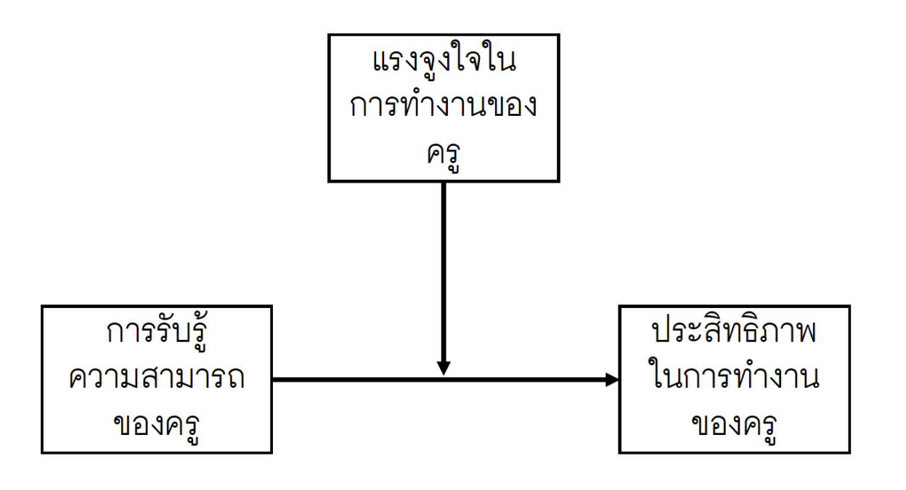

## Introduction

Regression analysis เป็นสถิติวิเคราะห์ที่มีวัตถุประสงค์หลักเพื่อวิเคราะห์ความสัมพันธ์ระหว่างตัวแปรตาม (Dependent Variable) กับตัวแปรอิสระ (Independent Variables) ซึ่งจะช่วยให้เราเข้าใจว่าตัวแปรตามมีการเปลี่ยนแปลงอย่างไรเมื่อมีการเปลี่ยนแปลงในตัวแปรอิสระ

เราอาจจะจำแนกความสัมพันธ์ออกได้เป็น 2 ประเภทหลัก

- ความสัมพันธ์เชิงคณิตศาสตร์ (mathematical relationship): ---> y = 2x 

- ความสัมพันธ์เชิงสถิติ (statistical relationship/probabilistic relationship/stochastic relationship) ---> y = f(x) + error

หลักการกว้าง ๆ ของ regression analysis คือการสร้างโมเดลทางสถิติเพื่อใช้อธิบายแนวโน้มความสัมพันธ์ระหว่างตัวแปรที่สังเกตได้จากข้อมูล

$$
y_i = f(x_i) + \epsilon_i
$$

```{r}
library(tidyverse)
data <- read_csv("/Users/choat/Documents/GitHub/datakruroo.github.io/Programming/regression/exam.csv")
data %>% 
  ggplot(aes(x = learning_performance, y = ach))+
  geom_point()+
  ggtitle("\n Visualization ของความสัมพันธ์ระหว่าง ach กับ learning_performance")+
  theme(text = element_text(family = "ChulaCharasNew"))
```

### วัตถุประสงค์ของการวิเคราะห์

การวิเคราะห์การถดถอยมีวัตถุประสงค์หลัก 2 ข้อ

1.  อธิบายความสัมพันธ์ระหว่างตัวแปรตามกับตัวแปรอิสระ

2.  ทำนายแนวโน้มของตัวแปรตามเมื่อกำหนดตัวแปรอิสระ

### ประเภทของการวิเคราะห์การถดถอย

การวิเคราะห์การถดถอยสามารถจำแนกได้หลายประเภท

-   Simple regression

-   Multiple regression

-   Polynomial regression

-   Logistic regression

-   Multinomial regression

-   Ordinal Logistic regression

-   Poisson regression

-   Regularized regression

...


## Simple Linear Regression

เป็นโมเดลพื้นฐานใช้อธิบายความสัมพันธ์ระหว่างตัวแปรตามกับตัวแปรอิสระจำนวนหนึ่งตัว

- สถิติวิเคราะห์สำหรับ .....

- โมเดลเชิงเส้นที่ใช้อธิบายความสัมพันธ์ระหว่างตัวแปรตามเชิงปริมาณกับตัวแปรอิสระเชิงปริมาณอย่างละ 1 ตัว

```{r}
data %>% 
  ggplot(aes(x = learning_performance, y = ach)) +
  geom_point() +
  geom_smooth(method = "lm", se = F) +
  ggtitle("\n Visualization ของความสัมพันธ์ระหว่าง ach กับ learning_performance") +
  theme(text = element_text(family = "ChulaCharasNew"))
```

ทางสังคมศาสตร์อาจไม่ค่อยใช้โมเดลนี้ในทางปฏิบัติเท่าไหร่ แต่มักใช้เป็นโมเดลแรกในการอธิบาย concept เกี่ยวกับ regression

อย่างที่บอกว่า regression analysis จะทำการอธิบายและทำนายตัวแปรตามด้วยตัวแปรอิสระ ผ่านโมเดลทางสถิติ สำหรับ simple regression หรือเรียกเต็ม ๆ ว่า simple linear regression จะมีโมเดลเป็นสมการเส้นตรงที่มีส่วนประกอบจำแนกเป็นสองส่วนได้แก่

-   ส่วนที่เป็นความสัมพันธ์เชิงฟังก์ชัน $f(x_i)$

-   ส่วน noise หรือ error $\epsilon_i$

$$
## general form of regression
y_i = f(x_i) + \epsilon_i
$$

simple regression เป็นกรณีเฉพาะของการวิเคราะห์การถดถอย 

$$
Y_i = \beta_0 + \beta_1X_i + \epsilon_i
$$


กระบวนการวิเคราะห์การถดถอย โดยปกติอาจจำแนกเป็น 3 ขั้นตอน

1. เตรียมข้อมูลและตรวจสอบความสัมพันธ์เบื้องต้น

2. สร้างสมการถดถอย และตรวจสอบความเหมาะสมของสมการ

3. แปลผลการวิเคราะห์ --- สามารถใช้ได้สองลักษณะหลักได้แก่ การอธิบายความสัมพันธ์ และการทำนายตัวแปรตาม

กระบวนการข้างต้นนี้สามารถประยุกต์ใช้ได้กับการวิเคราะห์การถดถอยประเภทอื่น ๆ ได้อีกด้วย อย่างไรก็ตาม detail อาจแตกต่างกันออกไปในแต่บริบทการวิเคราะห์ข้อมูล

### 1. การเตรียมข้อมูลและสำรวจความสัมพันธ์เบื้องต้นก่อนการวิเคราะห์หลัก

```{r}
### จัดชุดข้อมูล
simple_reg_data <- data %>% 
  select(ach, learning_performance) %>% 
  mutate(student_id = row_number(), .before = ach)
simple_reg_data
```

```{r fig.width = 9, fig.height = 4}
## ตรวจสอบค่าสูญหาย และการแจกแจงของตัวแปรแต่ละคร่าว ๆ ว่ามีอะไรผิดปกติรึเปล่า
simple_reg_data %>% 
  pivot_longer(col = -student_id) %>% 
  ggplot(aes(x = value))+
  geom_histogram(aes(fill = name), col = "white", bins = 20)+
  facet_wrap(~name)+
  theme_light()+
  theme(legend.position = "none")
```
```{r}
## มี missing value มั้ย?
summary(simple_reg_data)
library(naniar)
miss_var_summary(simple_reg_data)
```


ตรวจสอบความสัมพันธ์เบื้องต้นระหว่าง ach กับ learning_performance

- ตรวจสอบโดยใช้ visualization ช่วย

  - แผนภาพการกระจาย (scatter plot) เหมาะสำหรับตรวจสอบความสัมพันธ์ระหว่างตัวแปรเชิงปริมาณ 2 ตัว


```{r}
## scatter plot
data %>% 
  ggplot(aes(x = learning_performance, y = ach)) +
  geom_point() +
  geom_smooth(method = "loess", se = F) + ## ลากเส้นสมการถดถอยแบบ LOWESS Regression (nonparametric regression ประเภทหนึ่ง)+
  geom_smooth(method = "lm", se = F, col = "maroon") +
  ggtitle("\n Visualization ของความสัมพันธ์ระหว่าง ach กับ learning_performance") +
  theme(text = element_text(family = "ChulaCharasNew"))
```

- ตรวจสอบโดยใช้ค่าสถิติพื้นฐาน

  - ค่าสหสัมพันธ์ (correlation coefficient) Pearson's r --- เป็นเครื่องวัดทิศทางและระดับของความสัมพันธ์เชิงเส้นตรงระหว่างตัวแปรเชิงปริมาณสองตัว
  
มันกำลังวัดว่า ตัวแปรทั้งสอง มีรูปแบบเป็นเส้นตรงมากแค่ไหน และเป็นเส้นตรงที่มีทิศทางไปทางไหน
  
```{r}
cat("correlation matrix \n")
simple_reg_data %>% 
  select(-student_id) %>% 
  cor()

cat("\n")
cat("correlation value \n")
cor(x = simple_reg_data$ach, y = simple_reg_data$learning_performance)
```

จากผลการวิเคราะห์สหสัมพันธ์แบบเพียร์สันระหว่างตัวแปรผลสัมฤทธิ์ทางการเรียนกับประสิทธิภาพในการเรียนของนักเรียน พบว่า มีค่าสหสัมพันธ์เท่ากับ .846 แสดงว่าตัวแปรทั้งมีความสัมพันธ์เชิงเส้นทางบวกอยู่ในระดับสูง

เราสามารถแปลง correlation ของ Pearson ให้เป็นดัชนีอีกตัวที่เรียกว่า Coefficient of Determination หรือ R2 ได้โดยการ

```{r}
cor(x = simple_reg_data$ach, y = simple_reg_data$learning_performance)^2
```

R2 เป็นดัชนีที่ทำให้การแปลความหมายความสัมพันธ์ระหว่างตัวแปรมันชัดเจนขึ้น เพราะ R2 แปลความหมายได้เป็น ร้อยละของความแปรปรวนที่ตัวแปรทั้งสองมีร่วมกัน

- ach กับ learning_performance มี R2 = .715 แสดงว่า ตัวแปรทั้งสองมีความแปรปรวนร่วมกันคิดเป็นร้อยละ 71.5


### 2. fit simple regression

การประมาณค่าพารามิเตอร์ใน linear regression ทุกโมเดลจะใช้ ordinary least squares (OLS)

- เราพยายามหาสมการเส้นตรง $f(x_i)$ ที่มี error ในการทำนายต่ำที่สุด

- แล้ว error มันคืออะไร

- error นั้นก็คือผลต่างระหว่าง ค่าสังเกต y กับค่าทำนายของโมเดล $error_i = y_i - \hat{y_i}$

- error ข้างต้นเป็นของหน่วยข้อมูลเดียว แต่เราต้องการสร้างสมการสำหรับข้อมูลทั้งชุด ดังนั้นฟังก์ชันวัตถุประสงค์ (objective function) หรือเกณฑ์การพิจารณา จึงต้องเป็น error ของทั้งชุดข้อมูล เพื่อให้เกิดความยุติธรรม


วิธีการประมาณนี้จะพยายามหาค่าพารามิเตอร์ intercept และ slope ที่ทำให้ sum squared error น้อยที่สุด ---\> แปลว่าต้องการโมเดล regression ที่ทำนายได้แม่นยำมากที่สุด หรือ bias น้อยที่สุด

$$
Q = \sum_{i=1}^n (Y_i - \hat{Y}_i)^2 = \sum_{i=1}^n (Y_i - \hat{\beta}_0 - \hat{\beta}_1X_i)^2
$$ 

ตอนประมาณค่าพารามิเตอร์จะใช้การหาอนุพันธ์ของ SSE เทียบกับพารามิเตอร์ intercept และ slope

$$
\frac{\partial Q}{\partial \beta_0}
$$

การหาสมการถดถอยที่ดีที่สุดด้วย R สามารถทำได้โดยใช้ฟังก์ชัน `lm()`

~ อ่านว่า regress on

y ~ x แปลว่า เรากำหนดให้ y regress on x หรือ y เป็นตัวแปรตามที่ถูกอธิบายโดย x


```{r}
simple_reg_results <- lm(ach ~ learning_performance,  data = simple_reg_data)
```
จากผลการวิเคราะห์เบื้องต้นนี้ สมการถดถอยที่ดีที่สุดสำหรับชุดข้อมูลนี้คือ 

$$
\hat{ach} = 17.7039 + 0.5654 \times learning\_performance
$$
independent sample-test

$$
y_{ij} = \mu_j + \epsilon_{ij}
$$
j = 1,2

ข้อตกลงเบื้องต้นคือ $e_{ij} \sim N(0, \sigma^2)$ ---> $y_{ij} \sim N(\mu_j, \sigma^2)$


one-way ANOVA

$$
y_{ij} = \mu_j + \epsilon_{ij}
$$
j = 1,2,3,...,k

ข้อตกลงเบื้องต้นคือ $e_{ij} \sim N(0, \sigma^2)$ ---> $y_{ij} \sim N(\mu_j, \sigma^2)$


simple regression

$$
y_i = \beta_0 + \beta_1X_i + \epsilon_i
$$
ข้อตกลงเบื้องต้นคือ $e_{i} \sim N(0, \sigma^2)$  ---> $y_i \sim N(\beta_0 + \beta_1X_i, \sigma^2)$


```{r}
summary(simple_reg_results)
```


สัมประสิทธิ์การถดถอยของ learning_performance = 0.57 แปลผลได้ว่า นักเรียนที่มี LP เพ่ิมขึ้น 1 คะแนน มีแนวโน้มที่จะมีผสสัมฤทธิ์ทางการเรียนเพิ่มขึ้นโดยเฉลี่ยประมาณ 0.57 คะแนน

- Rsquares

$$
R^2 = \frac{SSReg}{SSTotal} = 1 - \frac{SSE}{SSTotal}
$$


```{r}
library(patchwork)
p1<-data %>% 
  ggplot(aes(x = learning_performance, y = ach))+
  geom_point()+
  geom_abline(intercept = 17.7039 , slope = 0.5654 , col = "steelblue",
              linewidth = 2)

p2<-data %>% 
  ggplot(aes(x = learning_performance, y = ach))+
  geom_point()+
  geom_smooth(method = "lm")
p1/p2

data %>% summary()
```

### 3. การแปลความหมายพารามิเตอร์ในโมเดล

```{r}
sqrt(86)
summary(simple_reg)
anova(simple_reg)
sqrt(966.9)
83212/ (33132 +83212)
```

-   Residual standard error --\> square root ของ MSE ดัชนีตัวนี้ใช้บอกว่า ค่าทำนายของ regression model ของเรามีความคลาดเคลื่อนไปจากค่าจริงโดยเฉลี่ยกี่หน่วย (คะแนน)

การแปลความหมายพารามิเตอร์หลัก ๆ ดูที่ intercept และ slope

-   slope คือ อัตราการเปลี่ยนแปลงของ y เมื่อเทียบกับ --\> delta_y/delta_x

ถ้า slope = 0.57 แปลว่า ถ้านักเรียนมี learning performance สูงขึ้น 1 หน่วย แล้ว ach ของนักเรียนมีแนวโน้มที่จะเพิ่มขึ้นโดยเฉลี่ย 0.57 คะแนน

-   intercept คือ จุดตัดแกน y --\> ค่าของ y เมื่อ x = 0

ถ้าเด็กไม่มี learning performance เลย (LP = 0) เด็กมีแนวโน้มที่จะมีคะแนน ach โดยเฉลี่ย 17.7 คะแนน


## Multiple Regression

การวิเคราะห์การถดถอยพหุคูณ เป็นสถิติวิเคราะห์ที่ใช้วิเคราะห์ความสัมพันธ์ระหว่างตัวแปรตาม 1 ตัว (เชิงปริมาณ) กับตัวแปรอิสระหลายตัว (เป็นได้ทั้งเชิงปริมาณ และจัดประเภท)

- ทั้งหมดเป็นเชิงปริมาณทุกตัวเลย ---> multiple regression

- มี X บางตัวเป็นตัวแปรจัดประเภท ---> muliple regression with dummies

$$
y_i = f(x_{1i}, x_{2i}, ..., x_{pi}) + \epsilon_i
$$

ในบริบททั่วไปของ multiple regression โมเดลจะเขียนในรูปประมาณนี้

$$
y_i = \beta_0 + \beta_1X_{1i} + \beta_2X_{2i} + ... + \beta_pX_{pi} + \epsilon_i
$$


ขั้นตอนการวิเคราะห์

1. เตรียมข้อมูล สำรวจความสัมพันธ์

2. สร้างโมเดล และตรวจสอบความเหมาะสมของโมเดล

3. แปลผลการวิเคราะห์ตามวัตถุประสงค์


### 1. เตรียมข้อมูล

```{r}
data <- read_csv("/Users/choat/Documents/GitHub/datakruroo.github.io/Programming/regression/eff.csv")
data
```

```{r}
data %>% 
  pivot_longer(col = -id) %>% 
  ggplot(aes(x = value))+
  geom_histogram(aes(fill = name), col = "white", bins = 20)+
  facet_wrap(~name, scales = "free")
```

```{r}
pairs(data %>% select(-id))
```


```{r}
data %>% select(-id) %>% cor()
```


ถ้าเราไม่เอาตัวแปรอิสระอะไรเลยมาอธิบาย เราจะเห็น eff แบบนี้

```{r}
 data %>% 
  ggplot(aes(x = eff))+
  geom_histogram()
```

```{r}
 data %>% 
  ggplot(aes(x = seef ,y = eff))+
  geom_point()+
  geom_smooth()
```

สรุป เวลาเรา fit model ทางสถิติให้กับข้อมูล กระบวนการที่เรามักจะดำเนินการประกอบด้วย

1. พิจารณาความสอดคล้องเชิงประจักษ์ (empirical fit) ของโมเดลในภาพรวมก่อน

2. พิจารณาว่าข้อมูลที่นำมาวิเคราะห์มีคุณลักษณะเป็นไปตามข้อตกลงเบื้องต้นของการวิเคราะห์มั้ย อย่างไร

3. พิจารณาความสอดคล้องเชิงประจักษ์ในระดับ local ---> ไปดูตาราง coefficients เพื่อแปลความหมายความสัมพันธ์ระหว่างตัวแปร y กับ x รายตัวแปร

### 2. การตรวจสอบความสอดคล้องเชิงประจักษ์โดยรวมของโมเดล

```{r}
fit_multi_reg <- lm(eff ~ seef + motiv, data = data) 
summary(fit_multi_reg)
```

- RMSE = sqrt(SSE/df_residual)

- R2 = 1-SSE/SSTotal

ดังนั้น ถ้าเพิ่มตัวแปรอิสระเข้าสู่โมเดล แนวโน้มค่า SSE ก็มักจะลดลงเสมอไม่มากก็น้อย ดังนั้นค่า R2 ก็มักจะเพิ่มขึ้นเสมอไม่มากก็น้อย

- AdjR2 = 1 - (SSE/df_residual) /(SSTotal/df_total)

AdjR2 = 1 - (SSE/(n-k-1))/(SSTotal/(n-1))


### 3. การพิจารณาความสอดคล้องเชิงประจักษ์ในระดับคู่ของความสัมพันธ์ (local fit) / การแปลผลความสัมพันธ์ระหว่างตัวแปรตามกับตัวแปรอิสระ

```{r}
summary(fit_multi_reg)
```

- เมื่อกำหนดให้ตัวแปรอิสระอื่น ๆ คงที่ ถ้านักเรียนมี seef เพิ่ิมขึ้น 1 คะแนน ก็มีแนวโน้มที่จะมี eff เพิ่มขึ้น 2.14 คะแนน อย่างมีนัยสำคัญทางสถิติที่ระดับ .05 (p < .001)


- เมื่อกำหนดให้ตัวแปรอิสระอื่น ๆ คงที่ ถ้านักเรียนมี motiv เพิ่มขึ้น 1 คะแนน มีแนวโน้มที่จะมี eff ลดลง 5.14 คะแนน อย่างมีนัยสำคัญทางสถิติที่ระดับ .05 (p < .001)

จากผลการวิเคราะห์เราพบว่า เครื่องหมายของ motiv มันไม่ makesense ดังนั้นยังจบงานไม่ได้ เราจะต้องลองตั้งสมมุติฐานว่าทำไมเครื่องหมายมันถึงผิด แล้วก็แก้ปัญหายังไงสักอย่างเพื่อให้เราจบงานได้

ลองสำรวจความสัมพันธ์คู่นี้

```{r}
data %>% 
  ggplot(aes(x = motiv, y = eff))+
  geom_point()+
  geom_smooth()
```

1. ลืมกลับสเกลมั้ย <--- เรื่องข้อมูลส่วน data-preprocessing

2. โมเดลการวิเคราะห์ที่ fit ไปให้ข้อมูล fit ได้เหมาะสมแล้วจริง ๆ มั้ย

  - ดู global fit
  
  - ดู ข้อตกลงเบื้องต้น
  
  - ดูทฤษฎีที่เกี่ยวข้อง
  
  - ดู local fit


```{r}
## RMSE = Root Mean Square Error ===> Badness of fit
## ถ้าเรียกค่า RMSE ขึ้นมา คิดว่าโมเดลไหนจะมีค่า RMSE ต่ำกว่ากัน
model1 <- lm(eff ~ seef, data = data)
model2 <- lm(eff ~ seef + motiv, data)
summary(model1)$sigma
summary(model2)$sigma

```

ลองพิจารณาชุดข้อมูลใหม่ต่อไปนี้

```{r}
data2 <- read_csv("exam.csv")
glimpse(data2)
```
```{r}
model1 <- lm(ach ~ learning_performance , data = data2)
model2 <- lm(ach ~ learning_performance + ontime_class, data = data2)
model3 <- lm(ach ~ learning_performance + ontime_class + engage, data = data2)
model4 <- lm(ach ~ learning_performance + ontime_class + engage + practice , data = data2)

summary(model1)$sigma
summary(model2)$sigma
summary(model3)$sigma
summary(model4)$sigma

```


$$
\hat{eff} = 48.2167 + 2.14SEEF - 5.14MOtiv
$$

```{r}
fit_multi_reg <- lm(eff ~ seef + motiv , data = data)
fit_multi_reg_interact <- lm(eff ~ seef * motiv , data = data)
summary(fit_multi_reg)
summary(fit_multi_reg_interact)
```

```{r}
AIC(fit_multi_reg, fit_multi_reg_interact)
BIC(fit_multi_reg, fit_multi_reg_interact)
```

```{r}
anova(fit_multi_reg, fit_multi_reg_interact)
lrtest(fit_multi_reg, fit_multi_reg_interact)
```
ในกรณีนี้เราเลือกโมเดลซับซ้อนที่มีปฏิสัมพันธ์ระหว่างตัวแปรอิสระทั้งสองตัว

```{r}
summary(fit_multi_reg_interact)
```
$$
\hat{eff} = 13.6969 + 7.7468SEEF + 1.653MOtiv -1.0891SEEF \times MOtiv
$$
เราเชื่อว่ามีปฏิสัมพันธ์ระหว่าง seef กับ motiv ต่อ eff ดังนั้นเราจึงไม่สามารถอ่านผล main effect ของแต่ละตัวแปรอิสระที่มีต่อ eff การดำเนินการก็ต้องใช้ simple effect analysis

สมมติว่าเราจะวิเคราะห์อิทธิพลอย่างง่ายของ seef ที่มีต่อ eff ในกรณีนี้เราจะต้องมอง motiv เป็นค่าคงที่ (given)

$$
\hat{eff} = [13.6969 + 1.653MOtiv] +  (7.7468SEEF -1.0891SEEF \times MOtiv) 
\\

\hat{eff} = [13.6969 + 1.653MOtiv] +  (7.7468 -1.0891MOtiv)  \times SEEF


$$


## Regression with Interaction

- เรากำลังพูดการ fit regression model เพื่ออธิบายอิทธิพลหรือความสัมพันธ์ในลักษณะที่เป็นแบบมีปฏิสัมพันธ์ระหว่างตัวแปรอิสระ

- อิทธิพลปฏิสัมพันธ์ (interaction effect) คืออิทธิพลรวมกันระหว่างตัวแปรอิสระอย่างน้อย 2 ตัวแปร ที่มีผลต่อตัวแปรตาม ที่เมื่อเกิดอิทธิพลของตัวแปรอิสระดังกล่าวจะมีแนวโน้มเปลี่ยนแปลงไปตามค่าของตัวแปรอิสระอื่น ๆ ที่อยู่ในกลุ่มปฏิสัมพันธ์เดียวกัน

- ถ้า X1 กับ X2 มีอิทธิพลปฏิสัมพันธ์ต่อ Y นั่นแปลว่า อิทธิพลของ X1 ที่มีต่อ Y จะไม่คงที่


```

การวิเคราะห์ multiple regression with interaction มีกระบวนการเหมือนกับการวิเคราะห์ multiple regression เลย

1. สำรวจข้อมูล โดยปกติเราจะสำรวจ 

  - การแจกแจงของตัวแปรในการวิเคราะห์
  
```{r}
teacher_salary %>% 
  count(discipline)

teacher_salary %>% 
  count(rank)
```
  
  
  - ความสัมพันธ์ระหว่างตัวแปรตามกับตัวแปรอิสระ
  
    - วิธีการเชิงสถิติ -- correlation, การเปรียบเทียบค่าเฉลี่ย (สำหรับการตรวจความสัมพันธ์ระหว่าง y ต่อเนื่อง กับ x ที่เป็นจัดประเภท)
    
    
การสำรวจส่วนนี้เป็นการสำรวจเฉพาะ main effect (ตัวใครตัวมัน)


```{r}
teacher_salary %>% 
  select(salary, discipline, rank) %>% 
  mutate(rank = factor(rank, levels = c("AsstProf", "AssocProf", "Prof")))  %>% 
  group_by(discipline) %>% 
  summarise(mean = mean(salary),
            sd = sd(salary))

teacher_salary %>% 
  select(salary, discipline, rank) %>% 
  mutate(rank = factor(rank, levels = c("AsstProf", "AssocProf", "Prof")))  %>% 
  group_by(rank) %>% 
  summarise(mean = mean(salary),
            sd = sd(salary))
```


```{r}
teacher_salary %>% 
  select(salary, discipline, rank) %>% 
  mutate(rank = factor(rank, levels = c("AsstProf", "AssocProf", "Prof"))) %>%
  pivot_longer(cols = -salary) %>% 
  ggplot(aes(x = value , y = salary, fill = value))+
  geom_boxplot()+
  facet_wrap(~name, scales = "free_x")+
  theme(legend.position = "none")
```

ถ้าเราสงสยหรือมีทฤษฎีนำมาว่า ตัวแปรทั้งสองน่าจะมีปฏิสัมพันธ์ร่วมกันต่อ ach เราสามารถสำรวจแนวโน้มการมีอยู่ของอิทธิพลปฏิสัมพันธ์ดังกล่าวได้ โดยใช้ boxplot เหมือนเดิม

```{r}
teacher_salary %>% 
  select(salary, discipline, rank) %>% 
  mutate(rank = factor(rank, levels = c("AsstProf", "AssocProf", "Prof"))) %>%
  ggplot(aes(x = rank , y = salary, fill = discipline))+
  geom_boxplot()

teacher_salary %>% 
  select(salary, discipline, rank) %>% 
  mutate(rank = factor(rank, levels = c("AsstProf", "AssocProf", "Prof"))) %>%
  ggplot(aes(x =discipline , y = salary, fill = rank))+
  geom_boxplot()
```

จากผลการวิเคราะห์ข้างต้นบ่งชี้ว่า อาจจะ!! มีปฏิสัมพันธ์ระหว่าง rank กับ discipline ต่อ salary บาง ๆ เพราะเห็นความแตกต่างของ salary ที่ไม่เท่ากันระหว่าง discipline A กับ B ในแต่ะกลุ่มตำแหน่งวิชาการ

2. เตรียมข้อมูลสำหรับการวิเคราะห์ (data preprocessing)

```{r}
teacher_job1 <- teacher_salary %>% 
  select(salary, discipline, rank)
```

3. กำหนด และสร้างโมเดล

เรามีสมมุติฐานว่า น่าจะมีปฏิสัมพันธ์ระหว่าง discipline กับ rank ต่อ salary งานของเราคือพิสูจน์ว่ามันมีจริงมั้ย ถ้ามีมัน makesense มั้ย

ดังนั้นในการวิเคราะห์นี้เราจะลอง fit 2 model

- salary ~ discipline + rank  (ไม่มีปฏิสัมพันธ์)

- salary ~ discipline + rank + discipline*rank (มีปฏิสัมพันธ์)


```{r}
fit_no_interact <- lm(salary ~ discipline + rank, data = teacher_job1)
fit_with_interact <- lm(salary ~ discipline + rank + discipline*rank, data = teacher_job1)
```

```{r}
summary(fit_no_interact)
```

```{r}
summary(fit_with_interact)
```

ผลการพิจารณาโมเดลทั้งสองพบว่า มี R2 และ RMSE ประมาณ 44% และ 23000 บาท ตามลำดับ พอ ๆ กัน

โดยปกติพอมีโมเดลหลาย ๆ ตัวแย่งกันอธิบายข้อมูลชุดเดียวกัน นักวิเคราะห์จะต้องเลือกว่าจะเอาโมเดลไหนบ้างไปใช้อธิบายข้อมูล เลยนำไปสู่กระบวนที่เรียกการเปรียบเทียบโมเดลหรือการเลือกโมเดลที่ดีที่สุด (model selection)

##### Model Selection

วิธีการคัดเลือกโมเดลที่ดีที่สุด โดยปกติจะใช้การเปรียบเทียบโมเดล เปรียบเทียบจากดัชนีที่บ่งชี้ึความสอดคล้องเชิงประจักษ์ของแต่ละโมเดล

- เปรียบเทียบ R2 หรือ AdjR2 --- ไม่ต่างกัน

- เปรียบเทียบ RMSE --- ไม่ต่างกัน

- เปรียบเทียบ AIC , BIC

ต้องคำนวณเพิ่ม

จุดสำคัญของการเปรียบเทียบโมเดลด้วย R2, RMSE, AIC, BIC คือโมเดลที่จะเปรียบเทียบกันจะต้องเป็นแบบซ้อนชั้นกัน (nested model) แปลว่า โมเดลนึงเป็น subset ของอีกโมเดลนึง หรือ เป็นการเปรียบเทียบโมเดลซับซ้อนกับโมเดลอย่างง่าย

```{r}
AIC(fit_no_interact, fit_with_interact)
```

```{r}
BIC(fit_no_interact, fit_with_interact)
```

- ทำการทดสอบสมมุติฐานเพื่อเปรียบเทียบโมเดล

ในบางกรณีเราอาจจะต้องการการยืนยันความแตกต่างของความสอดคล้องระหว่างโมเดลการวิเคราะห์หลาย ๆ โมเดล เราสามารถใช้การทดสอบที่เรียกว่า goodness of fit test ช่วยตัดสินใจได้


1. Partial F-test 

$$
H0: Model_{Full} = Model_{Reduced}
\\
H1: Model_F \neq Model_R
$$

$$
F = \frac{(SSE_{R} -SSE_{F})/(df_{R} - df_{F})}{SSE_{F}/df_{F}}
$$

```{r}
## partial F-test
anova(fit_no_interact, fit_with_interact)
```

2. Likelihood Ratio Test (LRT)


$$
H0: Model_{Full} = Model_{Reduced}
\\
H1: Model_F \neq Model_R
$$


$$
deviance = -2 \{logL(Model_{Reduced}) - logL(Model_{Full})\} \sim \chi^2_{df_{R} - df_{F}}
$$
```{r}
## likelihood ratio test
## install.packages("lmtest")
library(lmtest)
lrtest(fit_no_interact, fit_with_interact)
```

สรุปจากผลการวิเคราะห์ทั้งหมด เราจะเลือกใช้โมเดลที่ไม่มีปฏิสัมพันธ์


4. ตรวจสอบและแปลความหมายของโมเดล

```{r}
teacher_job1 <- teacher_job1 %>% 
  mutate(rank = fct_relevel(rank, "AsstProf", "AssocProf", "Prof"))

fit_no_interact <- lm(salary ~ discipline + rank, data = teacher_job1)

summary(fit_no_interact)
```

- เมื่อกำหนดให้ตัวแปรอิสระอื่นคงที่ อาจารย์ที่อยู่ในสาขา applied science มีเงินเดือนโดยเฉลี่ย สูงกว่า อาจารย์ในสาขา pure science ประมาณ 13761 บาท อย่างมีนัยสำคัญทางสถิติที่ระดับ .05 (p < .001)

- เมื่อกำหนดให้ตัวแปรออิสระอื่นคงที่ รองศาสตราจารย์มีแนวโน้มจะมีเงินเดือนโดยเฉลี่ยสูงกว่สผู้ช่วยศาสตราจารย์ 13762 บาท .....


เราจะเห็นว่า multiple regression ที่เรารันได้เป็นโมเดลที่ตัวแปรอิสระเป็นตัวแปรแบบจัดประเภททั้งหมดเลย

- discipline มี 2 ระดับ

- rank มี 3 ระดับ

การวิเคราะห์การถดถอยในกรณีนี้ โดยปกติเราจะแปลง (encode) ค่าของตัวแปรอิสระแบบจัดประเภท ให้เป็นตัวแปรเชิงปริมาณก่อน แล้วค่อยนำเข้าสู่โมเดล เพื่อประมาณค่าพารามิเตอร์ (slope และ intercept) ของโมเดล

กระบวนการแปลง (encode) ตัวแปรจัดประเภทให้เป็นตัวแปรเชิงปริมาณ โดยปกติเราจะใช้การแปลงที่เรียกว่า dummy encoding การแปลงตัวแปรจัดประเภท ให้เป็นตัวแปร dummy

การแปลง dummy มีแนวคิดดังนี้

1. กำหนดให้ตัวแปรจัดประเภทที่มี k ระดับ จะถูกแปลงเป็นตัวแปรดัมมี่จำนวน k-1 ตัว

2. การแปลงจะต้องเริ่มกำหนดกลุ่มที่เป็นกลุ่มอ้างอิง (reference group) ก่อน เมื่อกำหนดแล้ว ตัวแปร dummy ทั้งหมดที่สร้างได้ จะเป็น dummy ของกลุ่มที่เหลือ

- ตัวอย่าง discipline มี 2 ระดับ A กับ B <--- จะเอา A หรือ B เป็น reference ในกรณีนี้เราเลือก A เป็น reference

- ดังนั้นใน discipline ตัวแปร dummy ที่จะเกิดขึ้น มีเพียงตัวเดียวคือ dummy ของ applied science (B)

$$
D_B = \begin{cases}
1, & \text{ถ้า discipline = B} \\
0, & \text{ถ้า discipline = A}
\end{cases}
$$

- rank มี 3 ระดับ AsstProf, AssocProf, Prof <--- จะเอา อะไรเป็น reference ในกรณีนี้เราเลือก AsstProf เป็น reference

- ดังนั้นใน rank ตัวแปร dummy ที่จะเกิดขึ้น มี 2 ตัวคือ D_AssocProf และ D_Prof

$$
D_{AssocProf} = \begin{cases}
1, & \text{ถ้า rank = AssocProf} \\
0, & \text{ถ้า rank != AssocProf}
\end{cases}
$$

$$
D_{Prof} = \begin{cases}
1, & \text{ถ้า rank = Prof} \\
0, & \text{ถ้า rank != Prof}
\end{cases}

$$

```{r}
teacher_job1 %>% 
  select(rank) %>% 
  mutate(D_assoc = ifelse(rank == "AssocProf",1,0)) %>% 
  mutate(D_prof = ifelse(rank == "Prof",1,0)) 
```

ลองย้อนกลับมาดูโมเดลที่มีปฏิสัมพันธ์

```{r}
fit_with_interact <- lm(salary ~ discipline + rank + discipline*rank, data = teacher_job1)
summary(fit_with_interact)
```

สมมุติว่าเราจะใช้โมเดลนี้ในการแปลความหมาย


เนื่องจากโมเดลนี้มีปฏิสัมพันธ์ระหว่าง discipline กับ rank ต่อ salary นั่นหมายความว่า อิทธิพลของ discipline ต่อ salary ไม่คงที่ มีแนวโน้มเปลี่ยนแปลงไปตาม rank ที่แตกต่างกันของอาจารย์ ในทางกลับกันอิทธิพลของ rank ที่มีต่อ salary ก็ไม่คงที่เช่นเดียวกัน มีแนวโน้มเปลี่ยนแปลงไปตาม discipline ที่แตกต่างกันของอาจารย์

!!!! ดังนั้นเราไม่สามารถแปลผล main effect ของตัวแปรแต่ละตัวที่มีปฏิสัมพันธืได้โดยตรง


ในเชิงทฤษฎีโมเดลที่มีปฏิสัมพันธ์ข้างต้น สามารถเขียนเป็นสมการได้ดังนี้

$$
\hat{salary} = 73936 + 10658D_B + 9126D_{AssocProf} + 46013D_{Prof} + 7557D_B \times D_{AssocProf} + 2787D_B \times D_{Prof}
$$

กรณีที่ 1 เราจะวิเคราะห์อิทธิพลอย่างง่ายของ discipline บน AssocProf แปลว่า เราจะเปรียบเทียบ A, B เมื่อเป็น Assoc ---> กำหนดให้ $D_{AssocProf} =1$ และ $D_{Prof} = 0$


สมการข้างต้นจะถูกแทนค่าแล้วกลายเป็น

$$
\hat{salay} = 73936 + 10658D_B + 9126(1) + 0 + 7557D_B(1) + 0
\\
\hat{salay} = 83062 + (18215)D_B
$$


วิธีดำเนินการที่ถูกต้องคือ เราต้องแปลผลอิทธิพลเฉพาะกลุ่มย่อย <--- simple effect analysis

เริ่มจาการวิเคราะห์อิทธิพลอย่างง่ายของ discipline ที่มีต่อ salary จำแนกตาม rank

```{r}
teacher_job1 %>% 
  group_by(rank, discipline) %>% 
  summarise(mean_salary = mean(salary))
```


```{r}
## install.packages("emmeans")
library(emmeans)
## ใช้สำหรับตัวแปรจัดประเภท
simple_effect_discipline <- emmeans(fit_with_interact, ~ discipline | rank)
simple_effect_discipline
contrast(simple_effect_discipline, method = "pairwise")
```


```{r}
simple_effect_rank <- emmeans(fit_with_interact, ~ rank | discipline)
simple_effect_rank
contrast(simple_effect_rank, method = "pairwise")
```


#### ตัวแปรอิสระเป็นตัวแปรจัดประเภทและตัวแปรอิสระเชิงปริมาณ

ใช้ชุดข้อมูล [teachersalary.csv](TeacherSalaryData.csv)

```{r}
data <- read_csv("TeacherSalaryData.csv")
glimpse(data)
fit_interac1 <- lm(salary ~ yrs.service*discipline, data = data)
summary(fit_interac1)
```

```{r}
fit_interac2 <- data %>% 
  mutate(rank = fct_relevel(rank, "AsstProf", "AssocProf", "Prof")) %>% 
  with(lm(salary~ yrs.service + discipline + yrs.service:discipline))
summary(fit_interac2)
```

การอ่านผล

1.  เราสามารถประเมินอิทธิพลของ main effect ที่ไม่เกี่ยวข้องกับ interaction term ได้เลย

-   เมื่อควบคุมให้ตัวแปรอิสระอื่นคงที่ อาจารย์ที่เป็นรองศาสตราจารย์มีแนวโน้มจะมีเงินเดือนสูงกว่า ผศ. ประมาณ 14000 บท อย่างมีนัยสำคัญทางสถิติที่ระดับ .05 ()

-   เมื่อควบคุมให้ตัวแปรอิสระอื่นคงที่ ศาสตราจารย์ของมหาลัยมีแนวโน้มจะมีเงินเดือนสูงกว่า ผศ. ประมาณ 50000 บาท อย่างมีนัยสำคัญทางสถิติที่ระดับ .05

2.  พิจารณาส่วนปฏิสัมพันธ์

-   พิจารณา term ปฏิสัมพันธ์ก่อนว่ามีนัยสำคัญรึเปล่า (เชิงสถิติ/เชิงปฏฺิบัติ) ถ้าพบนัยสำคัญทางสถิติเราจะไม่อ่านผลที่ main effect

-   เราต้องไปประเมิน simple effect แทน

    -   ประเมินผลของ yrs.service ที่มีต่อ ach จำแนกตาม discipline A และ B \<-- การวิเคราะห์ simple slope

    -   ประเมินผลของ discipline ที่มีต่อ ach จำแนกตาม yrs.service

```{r}
data %>% 
  ggplot(aes(x=yrs.service))+
  geom_histogram()
```


##### การวิเคราะห์ simple slope ของ yrs.service จำแนกตาม discipline

วิเคราะห์อิทธิพลของ yrs.service ต่อ ach จำแนกตาม discipline

เราจะดู simple slope ของ cont. จำแนกตาม cat.

```{r}
library(emmeans)
simple_slopes <- emtrends(fit_interac2, var = "yrs.service", spec = "discipline")
## slope ของ yrs.service จำแนกตาม discipline
simple_slopes 
## ความแตกต่างของ slope ของ yrs.service ระหว่าง 2 discipline
contrast(simple_slopes, method = "pairwise")
```

ลองใช้ `simple_slopes <- emmeans(fit_interac1, pairwise ~ discipline | yrs.service)` ผลลัพธ์ที่ได้แตกต่างกันอย่างไร

##### วิเคราะห์ simple effect ของ discipline บน yrs.service

simple effect ของ discipline ที่วิเคราะห์ได้แต่ละค่าของ yrs.service

```{r}
data %>% summary()
```

ในทำนองเดียวกับ anova เราสามารถวิเคราะห์ simple effect ของ discipline แต่ในกรณีนี้จะเป็นการจำแนกตามระดับของ yrs.service ซึ่งมีจำนวนได้มากมาย

```{r}
summary(data)
emmeans(fit_interac2, pairwise ~ yrs.service | discipline)

emmeans <- emmeans(fit_interac2, pairwise ~ yrs.service | discipline, 
        at = list(yrs.service = c(7, 8,27)))
```

```{r}
emmeans$emmeans %>% data.frame() %>% 
  ggplot(aes(x=emmean, y=factor(yrs.service), col =discipline ))+
  geom_point()+
  geom_errorbar(aes(xmin = lower.CL, xmax = upper.CL), width = 0.1)
```

เราอาจ plot แผนภาพแสดงความสัมพันธ์แบบ interaction ได้ง่าย ๆ ดังนี้

```{r}
fit_interac2 %>% summary()

## partial dependence plot (pdp)

### 1. สร้าง grid ที่เป็น combination ระหว่างตัวแปรอิสระที่ interact กันก่อน
### สร้าง grid ของ yrs.service
yrs_grid <- seq(min(data$yrs.service), max(data$yrs.service), 2)
### สร้าง grid ของ discipline
dis_grid <- c("A","B")

### combination ของ grid
expand_grid(yrs.service = yrs_grid, discipline = dis_grid)

### ทำหน้าที่เป็นค่าของตัวแปรอิสระที่ต้องการนำไปหาค่าทำนาย
grid_pred <- expand_grid(yrs.service = yrs_grid,
                      discipline = unique(data$discipline))
predict(fit_interac2)
predict(fit_interac2, newdata = grid_pred)

grid_pred %>% 
  mutate(pred = predict(fit_interac2, newdata = grid_pred)) %>% 
  ggplot(aes(x = yrs.service, y = pred, color = discipline)) +
  geom_line()


```

```{r}
simple_slopes 
```

```{r}
p1<-data %>% 
  ggplot(aes(x=yrs.service, y=salary))+
  geom_point()+
  geom_smooth(method = "lm")

p2<-data %>% 
  ggplot(aes(x=yrs.service, y=salary, col = discipline))+
  geom_point()+
  geom_smooth(method = "lm")

p1/p2
```

#### ตัวแปรอิสระทั้งสองเป็นตัวแปรเชิงปริมาณ

{width="50%"}

```{r}
data <- read_csv("eff.csv")
glimpse(data)
```

$$
eff = \beta_0 + \beta_1motiv + \beta_2seef + \beta_3motiv \times seef + \epsilon
$$

$$
 eff = \beta\_0 + \beta\_1motiv + (\beta\_2seef + \beta\_3motiv \times seef) + \epsilon
$$


$$
 eff = \beta\_0 + \beta\_1motiv + (\beta\_2 + \beta\_3motiv)seef + \epsilon
$$


```{r}
data %>% summary()
```

```{r}
fit_interac3 <- data %>% 
  with(lm(eff ~ motiv + seef + motiv:seef))

summary(fit_interac3)
```


ดังนั้นเราสรุปได้ว่า

อิทธิพลของ seef ที่มีต่อ eff อธิบายได้ด้วยสมการ 7.75 - 1.09 x motiv

```{r}
motiv<-3
slope_seef <- 7.75 - 1.09*motiv
```

```{r}
motiv<-5.048
slope_seef <- 7.75 - 1.09*motiv
```

```{r}
data %>% 
  ggplot(aes(x=seef, y=eff))+
  geom_point()+
  geom_smooth(method = "lm", se = F)+
  geom_abline(intercept = 13.6969,slope = 4.48, col ="black", linetype = 2)+
  geom_abline(intercept = 13.6969,slope = 2.24768, col ="black", linetype = 2)+
  geom_abline(intercept = 13.6969,slope = 0.12, col ="black", linetype = 2)+
  ylim(0,80)


simple_slope_seef <- emtrends(fit_interac3, var="seef", spec = "motiv",
         at = list(motiv= c(4.209,5.062,5.954)))

simple_slope_seef %>% contrast(method = "pairwise")

simple_slope_seef %>% data.frame()

data %>% ggplot(aes(x=seef, y=eff))+
  geom_abline(intercept = ,slope = )
```

```{r}
#install.packages("ggeffects")
library(ggeffects)
```

```{r}
ggpredict(fit_interac3, terms = c("seef", "motiv")) |> plot()
```

```{r}
data %>% summary()
```


## Polynomial Regression

สมการถดถอยพหุนาม

ความสัมพันธ์ระหว่างตัวแปรบนโลก อาจจำแนกได้เป็น 2 ลักษณะ

-   linear relationship

-   non-linear relationship

โมเดลการวิเคราะห์ความสัมพันธ์ระหว่างตัวแปรอาจจำแนกได้เป็น 2 ลักษณะเช่นกัน

-   linear (in parameters) model

-   non-linear model

$$
y = mx + c
$$ 

$$
y = ax^2+bx+c
$$

$$
y = \frac{exp(ax+b)}{1+exp(ax+b)}
$$

```{r}
library(gapminder)
library(ggforce)

gapminder %>% 
  filter(year=="2007") %>% 
  ggplot(aes(x = gdpPercap, y=lifeExp))+
  geom_point()+
  geom_smooth(method = "lm")+
  scale_x_log10()
```

การสร้าง term polynomial อาจทำได้สองวิธีการ วิธีการแรกคือการใช้ฟังก์ชัน identity function (`I()`) และวิธีการที่สองคือการใช้ `poly()` ความแตกต่างระหว่างการสร้างเทอมพหุนามของทั้งสองวิธีการคือ

-   `I()` เป็นวิธีการสร้างพหุนามโดยตรง โดยเราจะใส่ตัวแปรที่ต้องการยกกำลังในฟังก์ชันนี้ ตัวอย่างเช่น I(x\^2) หมายถึงการสร้างเทอม x\^2 ที่ใช้ในโมเดลการถดถอย ดังนั้นการแปลความหมาย slope ของตัวแปรที่เป็นพหุนามนี้สามารถทำได้อย่างตรงไปตรงมา เพราะตัวแปรต่าง ๆ อยู่ในสเกลต้นฉบับ

-   ปัญหาหนึ่งของการใช้ `I()` คือ multicollinearity!!!

-   `poly()` จะสร้างเทอมพหุนามที่เรียกว่า orthogonal polynomial ซึ่งจะทำให้เราไม่ต้องกังวลเรื่อง multicollinearity แต่ต้องแลกมาด้วยการแปลความหมายความสัมพันธ์ที่ยาก เพราะตัวแปรที่ถูกแปลงเป็น orthogonal polynomial จะอยู่คนละสเกลกับตัวแปรเดิม การแปลงลักษณะนี้จึงเหมาะกับวัตถุประสงค์ในการทำนายมากกว่าอธิบายความสัมพันธ์ื

```{r}
cubic_fit <- gapminder %>% 
  filter(year=="2007") %>% 
  with(lm(lifeExp ~ gdpPercap + I(gdpPercap^2) + I(gdpPercap^3))) 
```

$$
lifeExp = (5.296e+01) + (2.734e-03)gdpPercap - (9.270e-08)gdpPercap^2 + (1.009e-12)gdpPercap^3
$$\

### ปัญหา Multicollinearity ใน Polynomial Regression

variance inflation factor --\> เป็นดัชนีที่ใช้วัด multicollinearity ของตัวแปรอิสระในโมเดล regression ถ้าค่า VIF มีค่ามากกว่า 10 แสดงว่ามี multicollinearity ในโมเดล

```{r}
#install.packages("car")
library(car)
vif(cubic_fit)
```

```{r}
gapminder %>% 
  filter(year=="2007") %>% 
  mutate(x = gdpPercap,
         x2 =gdpPercap^2,
         x3 = gdpPercap^3) %>% 
  select(x,x2,x3) %>% cor()

```

```{r}
## correlation matrix between centering variables
gapminder %>% 
  filter(year=="2007") %>% 
  mutate(x = gdpPercap,
         x2 =gdpPercap^2,
         x3 = gdpPercap^3) %>% 
  mutate(x_center = x-mean(x),
         x_center2 = x_center^2,
         x_center3 = x_center^3) %>%
  select(x_center, x_center2,x_center3) %>% cor()

## scatter plot
gapminder %>% 
  filter(year=="2007") %>% 
  mutate(x = gdpPercap,
         x2 =gdpPercap^2,
         x3 = gdpPercap^3) %>% 
  mutate(x_center = x-mean(x),
         x_center2 = x_center^2,
         x_center3 = x_center^3) %>%
  select(x_center, x_center2,x_center3) %>% 
  ggplot(aes(x_center,x_center3 ))+
  geom_line()
```

```{r}
cubic_fit <- gapminder %>% 
  filter(year=="2007") %>% 
  with(lm(lifeExp ~ poly(gdpPercap, 3)))
cubic_fit %>% summary()
```

## Regression Diagnostics

regression เป็นโมเดลทางสถิติแบบ parametric ที่การใช้งานจะต้องอยู่ภายใต้ข้อตกลงเบื้องต้นของโมเดลที่ค่อนข้าง strict (แต่ก็ไม่ได้แปลว่าต้อง strict มาก ๆ )

-   Independence

-   Linearity (no misspecification)

-   Normality

-   Homoscedasticity

-   No Missing Values

-   No Influential Outlier

    -   Outlier คือ ค่าสังเกตที่ทำนายไม่ได้หรือมีประสิทธิภาพการทำนายด้วย regression ต่ำ (กล่าวคือมีค่าสัมบูรณ์ของ residual ที่มากเกินไป)

```{r}
library(tidyverse)
data <- read_csv("/Users/choat/Downloads/exam.csv")
glimpse(data)
```

เรา fit multiple regression ตามกรอบแนวคิดของการวิเคราะห์ก่อน

```{r}
simple_reg <- lm(ach ~ learning_performance , data=data)

x <- seq(0,100)
y<-0.5+0.1*x+0.08*x^2+ rnorm(101,0,50)

p1<-data.frame(x,y) %>% 
  ggplot(aes(x=x, y=y))+
  geom_point()+
  geom_smooth(method = "lm", se= F)
```

```{r}
data.frame(x,y)->temp
simple_reg <- lm(y~x, data=temp)

p2<-data.frame(y_truth = y, pred = predict(simple_reg)) %>% 
  mutate(residual = y_truth-pred) %>% 
  ggplot(aes(x=pred, y=residual))+
  geom_point()+
  geom_smooth()+
  geom_hline(yintercept = 0, linetype = "dashed")+
  ggtitle("residual plot")

library(patchwork)
p2
```

```{r}
simple_reg <- lm(y~x, data=temp)
poly_reg <- lm(y~x+I(x^2), data= temp)
anova(simple_reg , poly_reg)
```

```{r}
multi_reg <- lm(ach ~ . , data=data)
summary(multi_reg)
```

### Linearity

ความสัมพันธ์ระหว่างตัวแปรตามกับตัวแปรอิสระจะต้องเป็นความสัมพันธ์เชิงเส้นตรง วิธีการหนึ่งที่มีประโยชน์มากในการตรวจสอบ linearity assumption ระหว่างตัวแปรตามกับตัวแปรอิสระหลาย ๆ ตัว คือการพิจารณา error ของโมเดล เรียกการวิเคราะห์นี้ว่า การวิเคราะห์เศษเหลือ (residual analysis)

เศษเหลือคืออะไร???

กำหนดให้ สมการถดถอยที่ประมาณได้มีสมการเป็น $\hat{y} = b0+b1x1+b2x2+...+bpxp$

$$
e_i = y_i - \hat{y}_i
$$

```{r}
## ค่าทำนายของ y จาก multiple regression ข้างต้น (y_hat)
predict(multi_reg) %>% head()

## ค่าจริงของ y
data$ach %>% head()

## เศษเหลือจากการทำนาย y ด้วย yhat
e = data$ach - predict(multi_reg)

data.frame(ach_truth = data$ach, pred = predict(multi_reg), e = e) %>% 
  mutate(std_res = e-mean(e)/sd(e)) %>% 
  ggplot(aes(x=pred, y=std_res))+
  geom_point()+
  geom_hline(yintercept = 0, linetype = "dashed")+
  ggtitle("Residual plot")
```

```{r}
## เราคำนวณ residuals ของโมเดลได้ง่าย ๆ ด้วย residuals()
residuals(multi_reg) %>% hist()
```

### Normality

ข้อตกลงเบื้องต้นระบุอยู่บน noise ของโมเดล แสดงว่าถ้าต้องการตรวจสอบว่าโมเดลมีข้อตกลงเบื้องต้นนี้จริง ๆ ก็จะตรวจสอบผ่าน residual ได้เหมือนกัน

```{r}
p1<-residuals(multi_reg) %>% 
  data.frame() %>% 
  rename(residual = 1) %>% 
  ggplot(aes(x=residual))+
  geom_histogram()

p2<-residuals(multi_reg) %>% 
  data.frame() %>% 
  rename(residual = 1) %>% 
  ggplot(aes(sample = residual)) +
  geom_qq()+
  geom_qq_line()
p1/p2
```

```{r}
residuals(multi_reg) %>% shapiro.test()
```

### homogeneity of variance

ความแปรปรวนของความคลาดเคลื่อนสุ่มมีความเป็นเอกพันธ์กันระหว่างกลุ่มของตัวแปรอิสระ

### homoscedasticity

ความแปรปรวนของความคลาดเคลื่อนสุ่มมีความเป็นเอกพันธ์ในทุกค่า x ที่เป็นไปได้ (ในทุกระดับของค่าทำนายที่เป็นไปได้)

```{r}
data.frame(ach_truth = data$ach, pred = predict(multi_reg), e = e) %>% 
  mutate(std_res = e-mean(e)/sd(e)) %>% 
  ggplot(aes(x=pred, y=std_res))+
  geom_point()+
  geom_hline(yintercept = 0, linetype = "dashed")+
  ggtitle("Residual plot")
```

$$
e_i = y_i - \hat{y}_i
$$

อยากหาความแปรปรวนของความคลาดเคลื่อนสุ่ม

$$
var(e) = \frac{\sum(e^2)}{n-1}
$$

```{r}
data.frame(ach_truth = data$ach, pred = predict(multi_reg), e = e) %>% 
  bind_cols(data) %>% 
  mutate(e2 = e^2) %>%  ## -- sufficient estimator of residual variance
  ggplot(aes(x=pred, y=e2))+
  geom_point()+
  geom_smooth()
```

Breuch-Pagan Test

```{r}
data.frame(ach_truth = data$ach, pred = predict(multi_reg), e = e) %>% 
  bind_cols(data) %>% 
  mutate(e2 = e^2)  %>% 
  with(lm(e2 ~ pred)) %>% summary()
```

White's Test

```{r}
data.frame(ach_truth = data$ach, pred = predict(multi_reg), e = e) %>% 
  bind_cols(data) %>% 
  mutate(e2 = e^2)  %>% 
  with(lm(e2 ~ pred + I(pred^2))) %>% summary()
```

### No Multicollinearity

ในการวิเคราะห์การถดถอยใช้การประมาณค่าพารามิเตอร์ด้วยระบบสมการหลายตัวแปร (simutaneous equation)

ตัวแปรอิสระในโมเดลจะต้องไม่มีความสัมพันธ์ิเชิงเส้นตรงต่อกันมากเกินไป การตรวจสอบข้อตกลงเบื้องต้นนี้สามารถทำได้หลายวิธีการ แต่ละวิธีการก็จะ based on การวิเคราะห์สหสัมพันธ์ระหว่างตัวแปรอิสระ

-   correlation matrix ระหว่างตัวแปรอิสระ โดยปกติจะคัดกรองตัวแปรอิสระที่มีแนวโน้มจะมีปัญหาจาก cut-off ของค่า correlation ที่สูงเกินไป 0.7, 0.8, 0.9

-   ใช้ดัชนีที่เรียกว่าค่า VIF (variance inflation factor)

$$
VIF_j = \frac{1}{1-R^2_j}
$$

$R^2_j$ เป็นค่า R2 ที่คำนวณจากสมการถดถอย โดยตัวแปรตามเป็นตัวแปรอิสระตัวที่ j

โดยปกติการประเมินว่าในโมเดลการวิเคราะห์มีปัญหา multicollinearity หรือไม่จาก vif ก็จะมี cut-off ที่มาประกอบ 2, 4, 10, 20, ...

```{r}
library(car)
## vif ach model
vif(multi_reg)
```

### No influential outliers

ค่าผิดปกติ

-   anomaly data ---\> anomaly detection

-   outlier ค่าสังเกตที่มีความแตกต่างไปจากค่าสังเกตโดยปกติ

    -   no influential outlier

    -   influential outlier

การตรวจสอบ outlier แบบ univaraite อาจไม่สามารถตรวจจับ outlier ในหลายมิติได้

```{r fig.height = 3}
gapminder %>% 
  filter(year=="2007") %>% 
  ggplot(aes(x = gdpPercap))+
  geom_boxplot()
```

```{r}
library(gapminder)
library(ggforce)

gapminder %>% 
  filter(year=="2007") %>% 
  rownames_to_column("id") %>% 
  ggplot(aes(x = gdpPercap, y=lifeExp))+
  geom_point()+
  geom_text(data = . %>% filter(lifeExp < 60 & gdpPercap > 8000), aes(label = id), 
            nudge_x = 1000, nudge_y = 1, size = 3)+
  geom_smooth()+
  geom_ellipse(data = gapminder %>% 
                        filter(year=="2007") %>% 
                 filter(lifeExp < 60 & gdpPercap > 8000),
               aes(x0 = mean(gdpPercap), y0 = mean(lifeExp), 
                   a = 2*sd(gdpPercap), b = 2*sd(lifeExp), angle = 0),
               color = 'maroon', linetype = "dashed", fill = NA)
```

ดัชนีที่สำคัญในการตรวจจับ outlier สำหรับการวิเคราะห์ regression และโมเดลในกลุ่มเดียวกันนี้มี 3 ตัวได้แก่ leverage value สำหรับตรวจสอบค่าผิดปกติใน x , standardized residuals สำหรับตรวจสอบค่าผิดปกติใน y และ cook's distance สำหรับตรวจสอบค่าผิดปกติที่มีอิทธิพล

-   Leverage value คือ combination ของค่าสังเกตของตัวแปรอิสระที่ผิดปกติ กล่าวคือเป็น outlier ใน feature space ค่า leverage ไม่จำเป็นต้องมีผลต่อค่าของเส้นถดถอยเสมอไป มันเพียงแค่บอกว่าจุดนั้นอยู่ห่างไกลและมีศักยภาพที่จะส่งผลกระทบต่อโมเดล

$$
h_{ii} = x_i^T (X^T X)^{-1} x_i
$$

ค่า $h_{ii}$ มีค่าอยู่ในช่วง \[0,1\] ถ้ามีค่าใกล้ 1.0 แสดงว่าค่าสังเกตของตัวแปรอิสระนั้นมีแนวโน้มอยู่ใกล้จากแนวโน้มส่วนใหญ่

-   Influential observation คือค่าสังเกตที่มีอิทธิพลต่อการประมาณค่าพารามิเตอร์ในโมเดลมากกว่าปกติ การประเมินค่าสังเกตประเภทนี้ทำได้ด้วยสถิติ Cook's distance

$$
D_i = \frac{(e_i^2)}{p \cdot MSE} \left( \frac{h_{ii}}{(1 - h_{ii})^2} \right)
$$

จากชุดข้อมูล `gapminder` ข้างต้น

```{r}
fit1 <- lm(lifeExp ~ gdpPercap, data = gapminder %>% filter(year=="2007"))
plot(fit1, 5)
```

จะเห็นว่าไม่พบว่ามีค่าผิดปกติที่มีอิทธิพลต่อประมาณค่าพารามิเตอร์ และค่าผิดปกติมากที่สุดในโมเดลเป็นค่าผิดปกติใน x แล้วก็ไม่ใช่ค่าผิดปกติที่เรามองเห็นด้วยสายตาในตอนแรกด้วย

```{r fig.height=9}
library(broom)
### all observation
p1 <- gapminder %>% 
  filter(year=="2007") %>% 
  rownames_to_column("id") %>% 
  ggplot(aes(x = gdpPercap, y=lifeExp))+
  geom_point()+
  geom_text(data = . %>% filter(id %in% c(114, 96, 72)), aes(label = id), 
            nudge_x = 1000, nudge_y = 1, size = 3)+
  geom_smooth(method = "lm")

## ตัดค่าที่ cook's distance สูงออก
p2 <- gapminder %>% 
  filter(year=="2007") %>% 
  rownames_to_column("id") %>% 
  filter(!id %in% c(114, 96, 72)) %>% 
  ggplot(aes(x = gdpPercap, y=lifeExp))+
  geom_point()+
  geom_smooth(method = "lm")

p3<- gapminder %>% 
  filter(year=="2007") %>% 
  rownames_to_column("id") %>% 
  filter(!id %in% c(14,41,46,118)) %>% 
  ggplot(aes(x = gdpPercap, y=lifeExp))+
  geom_point()+
  geom_smooth(method = "lm")


gapminder %>% 
  filter(year=="2007") %>% 
  rownames_to_column("id") %>% 
  with(lm(lifeExp ~ gdpPercap, data = .)) %>% glance()

gapminder %>% 
  filter(year=="2007") %>% 
  rownames_to_column("id") %>% 
  filter(!id %in% c(114, 96, 72)) %>% 
  with(lm(lifeExp ~ gdpPercap, data = .)) %>% glance()

gapminder %>% 
  filter(year=="2007") %>% 
  rownames_to_column("id") %>% 
  filter(!id %in% c(14,41,46,118)) %>% 
  with(lm(lifeExp ~ gdpPercap, data = .)) %>% glance()

```

ผลการวิเคราะห์จะเห็นว่าการตัดค่าผิดปกติทั้งที่พิจารณาจากค่าสถิติ และพิจารณาจากสายตาไม่ได้ทำให้ผลการวิเคราะห์การถดถอยแตกต่างออกไปจากเดิมมากนัก ซึ่งสอดคล้องกับผลการวิเคราะห์ด้วย Cook's distance ที่ไม่พบค่าผิดปกติที่มีอิทธิพลต่อการประมาณค่าพารามิเตอร์

### กิจกรรมตรวจสอบข้อตกลงเบื้องต้น

```{r}
teacher_data <- read_csv("/Users/choat/Documents/GitHub/datakruroo.github.io/Programming/regression/TeacherSalaryData.csv")
```

```{r}
teacher_reg <- teacher_data %>% 
  rename(id = 1) %>% 
  with(lm(salary ~. -id, data = .))
plot(teacher_reg)
```

#### linearity

```{r}
data.frame(
pred = predict(teacher_reg),
res = residuals(teacher_reg)) %>% 
  ggplot(aes(x=pred, y=res))+
  geom_point()+
  geom_smooth()+
  geom_hline(yintercept = 0, linetype = "dashed")

data.frame(
pred = predict(teacher_reg),
res = residuals(teacher_reg)) %>% 
  ggplot(aes(sample = res))+
  geom_qq()+
  geom_qq_line()

data.frame(
pred = predict(teacher_reg),
res = residuals(teacher_reg)) %>% 
  ggplot(aes(x = res))+
  geom_histogram()
```

```{r}
multi_reg %>% plot()
teacher_reg %>% plot()
cooks.distance(teacher_reg) %>% data.frame() %>% 
  rename(cook = 1) %>% 
  filter(cook > 0.05)

teacher_data %>% 
  rename(id = 1) %>% 
  filter(id %in% c(250,331))
```

## Regression Remedials

### Linearity

-   เพิ่ม polynomial หรือ interaction terms เพื่อเพิ่มความซับซ้อนของโมเดล

-   แปลงข้อมูลด้วยการใช้ log, square root, หรือการแปลงเชิงเส้นตรงแบบอื่น ๆ

-   ใช้ Multivariate Adaptive Regression Splines (MARs) Generalized Additive Models (GAMs) เพื่อจับความสัมพันธ์ที่ไม่เป็นเชิงเส้น

### Normality

-   โดยส่วนเกือบใหญ่ปัญหา nonnormality มักเกิดจาก heteroscedasticity

-   ปัญหา heteroscedasticity ส่วนนึงที่เกือบใหญ่ เกิดจาก model ที่เลือกไม่สอดคล้องกับธรรมชาติของข้อมูล เช่น ลืม interaction term ที่สำคัญในโมเดล

-   เพิ่มตัวแปรอิสระหรือเทอมของตัวแปรอิสระที่อาจหายไปเพื่อปรับปรุงการกระจายของ residuals

-   แปลงข้อมูล (log-transformation, square root, Box-Cox) เพื่อให้ residuals เป็นปกติมากขึ้น

-   ใช้ robust regression เพื่อทนทานต่อผลกระทบของ outliers

-   bootstraping regression

#### log-transformation

ตัวอย่างต่อไปนี้ทดลอง take-log ให้ตัวแปรตามคือ salary ในชุดข้อมูล teacher salary ลองพิจารณาเปรียบเทียบผลลัพธ์ที่ได้

```{r}
### log-transformation
teacher_reg_log <- teacher_data %>% 
  rename(id = 1) %>% 
  mutate(log_salary = log(salary)) %>% 
  with(lm(log_salary ~. -id, data = .))

teacher_reg %>% summary()
teacher_reg_log %>% summary()
```

```{r}
teacher_reg %>% plot(main = "Original Model")
teacher_reg_log %>% plot(main = "Log-Transformed Model")
```

#### Box-Cox Transformation

ฟังก์ชันนี้จะพยายามช่วยเราหา lambda (power parameter) ที่ทำให้ log-likelihood ของโมเดลมีค่าสูงสุด

```{r}
### Box-Cox transformation
library(MASS)
### คำนวณ output
boxcox_res <- boxcox(teacher_reg,  data=teacher_data %>% rename(id = 1),
       lambda = seq(-2,2,0.1)) ## box-cox power parameter
### ประเมินค่า lambda ที่ทำให้ log-likelihood มีค่าสูงสุด
data.frame(lambda = boxcox_res$x, 
           log_likelihood = boxcox_res$y) %>% 
filter(log_likelihood == max(log_likelihood))
```

เมื่อได้ค่า lambda จะนำค่า lambda นี้ไปใช้ในการ transform ตัวแปรตาม เราสามารถเขียนสูตรเองก็ได้ ดูสูตรจากในนี้ --\> <https://www.statisticshowto.com/probability-and-statistics/normal-distributions/box-cox-transformation/>

หรือใช้ฟังก์ชันสำเร็จรูปช่วยในการคำนวณจาก library-car

```{r fig.height = 6}
library(car)
par(mfrow=c(2,1))
teacher_data$salary %>% hist()
car::bcPower(teacher_data$salary, lambda = -0.8282828) %>% hist()
```

ลองไป fit multiple regression ใหม่

```{r}
teacher_reg_bc <- teacher_data %>% 
  rename(id=1) %>% 
  mutate(salary_bc = car::bcPower(teacher_data$salary, lambda = -0.8282828)) %>% 
  dplyr::select(-salary) %>% 
  with(lm(salary_bc ~. -id, data=.))
teacher_reg_bc %>% summary()
teacher_reg_bc %>% plot()
```

-   จะเห็นว่าปัญหาหายไปเกือบหมดนอกจาก nonnormality แล้วยังช่วยแก้ปัญหา heteroscedasticity อีกด้วย สะท้อนว่าปัญหาทั้งสองมีความสัมพันธ์กันจริง ๆ

-   แต่การแปลผล coefficient ของ regression ให้มีความหมายทำได้ค่อนข้างยาก

#### เพิ่ม interaction term ในโมเดล

บางครั้งปัญหา nonnormality เกิดจากการละเมิดข้อตกลงเบื้องต้นข้ออื่นโดยเฉพาะ heteroscedasticity และสาเหตุของการเกิด heteroscedasticity บางครั้งก็เกิดจาก misspecification ของโมเดล เช่น การละเลย iteraction term ที่สำคัญ ดังนั้นหากมีเหตุผลหรือข้อมูล support การเพิ่ม interaction term ที่เหมาะสมอาจช่วยให้โมเดลมีคุณสมบัติที่ดีขึ้น

รูปด้านล่างแสดงให้เห็นว่าการเพิ่ม interaction มีแนวโน้มจะลดปัญหา heteroscedasticity ได้บ้าง เพราะเรามีโมเดลที่ซับซ้อนขึ้น และมีความสามารถในการทำนาย/อธิบายหน่วยข้อมูลคืออาจารย์มหาวิทยาลัยที่มีประสบกาณ์ทำงานสูงได้ดีขึ้นบ้างแต่ก็ไม่ได้ดีมากในกรณีนี้

```{r}
teacher_data %>% 
  ggplot(aes(x=yrs.since.phd, y=salary))+
  geom_point()+
  geom_smooth(method= "lm", aes(col = discipline))
```

ทดลองใส่ interaction term ลงในโมเดล อย่างไรก็ตามการแก้ปัญหาในกรณีนี้ไม่ได้มีผลอะไรมากเท่าไหร่

ืnote: การวิเคราะห์ด้านล่างเน้นโชว์ให้ดูความแตกต่างระหว่างโมเดลที่มีกับไม่มี interaction ดังนั้นการใส่ตัวแปรแบบนี้ไม่ได้ makesense

```{r}
## witjout interaction
teacher_data %>% 
  rename(id = 1) %>% 
  with(lm(salary ~ yrs.since.phd + discipline + rank+sex -id, data = .)) %>% plot(3)

## with interaction
teacher_data %>% 
  rename(id = 1) %>% 
  with(lm(salary ~ yrs.since.phd*discipline*rank*sex -id, data = .)) %>% plot(3)
```

#### Bootstrap Regression

 [อ่านเพิ่มเติมได้ที่นี่](https://bookdown.org/jgscott/DSGI/the-bootstrap.html)

เราสามารถทำ bootstrap regression ได้ง่าย ๆ ด้วย library-car ดังนี้

เริ่มต้นจาก `teacher_reg` ที่มีปัญหา nonnormality

```{r}
library(car)
##?Boot() <--- อ่านนิดนึง
## เราต้องเขียนโมเดลใหม่เพราะ Boot() ไม่รองรับการกำหนดโมเดลที่ใช้ . ทั้งหลาย
teacher_fit_forboot <- lm(salary~rank+discipline+yrs.since.phd+yrs.service+sex, 
                          data = teacher_data)
fit_boot <- Boot(teacher_fit_forboot, 
                 R = 5000) ## กำหนดจำนวน bootstrap samples
hist(fit_boot) ## bootsrap distribution จะเห็นว่าเราสร้าง sampling distribution เองได้จากการสุ่มซ้ำแบบใส่คืน
summary(fit_boot)
confint(fit_boot) ## เราสามารถใช้ confidence interval ทดสอบสมมุติฐานหรือประมาณค่าได้
```

### Homoscedasticity

-   แปลงค่าตัวแปรตาม (เช่น log, square root) เพื่อลดความแปรปรวน

-   ควรหาสาเหตุของการละเมิด hetero ว่าเกิดจาก misspecification ส่วนไหนรึเปล่า ---\> ลืม interaction term ที่สำคัญ

-   ใช้ Weighted Least Squares (WLS), Generalized Least Squares (GLS), เพื่อปรับน้ำหนักให้กับจุดข้อมูลที่มีความแปรปรวนต่างกัน

-   ใช้ heteroscedasticity-robust standard errors เพื่อปรับ standard errors ของโมเดล

#### Robust Standard Error

ดังที่ได้กล่าวไว้ในคาบเรียนว่า ปัญหา nonnormality และ heteroscedasticity มีความสัมพันธ์กันและทั้งสองปัญหามีผลกระทบต่อการอนุมานเชิงสถิติของโมเดล ได้แก่ การทดสอบสมมุติฐาน และการประมาณช่วงความเชื่อมั่นของค่าพารามิเตอร์ต่าง ๆ

-   nonnormality อาจทำให้ sampling distribution ของสถิติทดสอบ t-test และ F-test สำหรับ regression รวมทั้ง linear model ไม่เป็นไปตามทฤษฎีควบคุม type I error ที่ต้องการไม่ได้

-   heteroscedasticity ทำให้การประมาณค่า MSE ของโมเดลคลาดเคลื่อนค่าประมาณที่ได้ไม่เป็นตัวแทนของความแปรปรวรของความคลาดเคลื่อนสุ่มของโมเดล ค่า MSE เป็นส่วนประกอบสำคัญในการประมาณค่า standard error ของค่าประมาณพารามิเตอร์ในโมเดล ปัญหาดังกล่าวจึงกระทบโดยตรงต่อการอนุมานเชิงสถิติ

การแก้ปัญหา heteroscedasticity ในเชิงที่มองว่ามันทำให้การประมาณค่า standard error คลาดเคลื่อนคือการใช้สูตรการประมาณ standard error ใหม่เราเรียกมันว่า robust standard error เมื่อประมาณ SE ได้ดีขึ้น การอนุมานภายใต้การละเมิดข้อตกลงเบื้องต้นนี้ก็จะมีความถูกต้องมากขึ้นไปด้วย

การอนุมานเชิงสถิติด้วย robust standard error ใน R สามารถทำได้ดังนี้

```{r}
##install.packages("sandwich")
##install.packages("lmtest")
library(sandwich)
library(lmtest)
?coef.coeftest ## <-- ลองเรียก help แล้วอ่านดู ตัวประมาณ robust SE มักเรียกว่า sandwich estimator เพราะมีการสอดไส้ในสูตรการประมาณ SE เหมือนทำ sandwich
?vcovHC ## <-- อ่านอันนี้ด้วย
teacher_reg %>% summary()
teacher_reg %>% coeftest(., vcov = vcovHC(., type = "HC1"))
```

ผลการวิเคราะห์ข้างต้นจะเห็นว่าเมื่อใช้ robust SE จะมีการปรับการคำนวณทำให้ SE ที่ได้แตกต่างออกไป นัยสำคัญที่วิเคราะห์ได้ก็จะแตกต่างไปจากเดิม

การแก้ปัญหาด้วยวิธีนี้เป็นการแก้ปัญหาเฉพาะเจาะจงไม่ได้แก้ปัญหาอย่างเป็นระบบหรือที่สาเหตุของปัญหาอย่างแท้จริง โดยปกติมักใช้เมื่อเราจะไม่วิเคราะห์โมเดลอื่นแล้ว และวัตถุประสงค์หลักเป็นการอนุมานเกี่ยวกับพารามิเตอร์ของโมเดลเป็นหลัก

### Multicollinearity

ปัญหานี้เกิดเมื่อตัวแปรอิสระในโมเดลมีความสัมพันธ์ซึ่งกันและกันสูงเกินไป ส่งผลต่อความเสถียรหรือความน่าเชื่อถือของค่าพารามิเตอร์ regression coefficient ในโมเดล รวมไปถึงการอนุมานเชิงสถิติด้วย ปัญหานี้ร้ายแรงหากตรวจพบควรแก้ไขให้ได้

การแก้ปัญหาสามารถทำได้หลายวิธีการ ได้แก่

#### ลบตัวแปรอิสระที่มีค่า VIF มากเกินไป และส่งผลกระทบต่อการวิเคราะห์

ตัวอย่างด้านล่างแสดงการลบตัวแปรออกจากโมเดลจะเห็นว่าค่าพารามิเตอร์ที่เกี่ยวข้องมีการเปลี่ยนแปลงอย่างมากเมื่อมีการลบตัวแปรออกไป สะท้อนปัญหา multicollinearity ที่ค่อนข้างรุนแรง

```{r}
teacher_reg_no_phd <- lm(salary ~ . -yrs.since.phd, data = teacher_data %>% 
                           dplyr::select(-1))
teacher_reg_no_ser <- lm(salary ~ . -yrs.service, data = teacher_data %>% 
                           dplyr::select(-1))
summary(teacher_reg)
summary(teacher_reg_no_phd)
summary(teacher_reg_no_ser)
vif(teacher_reg_no_ser)
```

อย่างไรก็ตาม regression coeffcient ของ yrs.service ยังมีค่าติดลบ ข้อสังเกตนี้สะท้อนว่าอาจมีปัญหาอื่นเกี่ยวกับการระบุโมเดลที่ผิดพลาดได้ เช่น อาจลืมตัวแปรอิสระที่สำคัญ หรือ interaction term เป็นต้น

#### ทำ feature extraction รวม/ผสาน ตัวแปรอิสระที่มีแนวโน้มจะเกิดปัญหา multi เข้าด้วยกันเป็นตัวแปรใหม่

วิธีการนี้คือการสร้างตัวแปรใหม่ที่รวมตัวแปรอิสระที่มีความสัมพันธ์สูง ๆ เข้าด้วยกัน เช่น การหาค่าเฉลี่ย การบวก หรือการใช้อัลกอริทึมเช่น PCA เข้ามาช่วย เรียกกระบวนการนี้รวม ๆ ว่าการสกัดตัวแปร (feature extraction)

การรวมตัวแปรด้วยตัวผู้วิเคราะห์ควรพิจารณาเหตุผลในเชิงทฤษฎี หรืออย่างน้อยก็ดูว่าเมื่อนำตัวแปรสองตัวหรือมากกว่านั้นมารวมกัน จะแปลความหมายของตัวแปรใหม่ได้อย่างไร เช่น เงินเดือนพ่อ + เงินเดือนแม่ = รายได้ต่อเดือนของครอบครัว หรือ จำนวนครู/ห้องเรียน = อัตราส่วนครูต่อห้องเรียน

ส่วนการรวมด้วยอัลกอริทึม เช่น PCA การแปลความหมายตัวแปรใหม่ (องค์ประกอบหลัก) จะพิจารณาจากค่าสถิติ การใช้ PCA ในการวิเคราะห์ regression จะเรียกโมเดลการวิเคราะห์นี้ว่า PCR หรือ Principal component regression นอกจากนี้ยังมีวิธีการอื่นในคล้ายกับ PCR เช่น PLS == partial least square regression อีกด้วย

การทำ PCR สามารถทำได้ง่าย ๆ คือ

1.  ทำ PCA กับตัวแปรอิสระทั้งหมด แล้วคัดเลือกองค์ประกอบหลักที่จำเป็น

2.  แปลความหมายองค์ประกอบหลักที่เลือกมาให้ได้

3.  ประมาณ factor score หรือ component score แล้วเอาคะแนนดังกล่าวไปเป็นตัวแปรอิสระใน regression model

### No Influential Ouliers

อย่างที่บอกในห้องเรียนว่า outlier ที่มีอิทธิพลสูงอาจบิดเบือนการประมาณค่าสัมประสิทธิ์ต่าง ๆ ในการวิเคราะห์การถดถอย การวิเคราะห์และตรวจจับค่าสังเกตที่มีอิทธิพลจะช่วยให้ผู้วิเคราะห์ทราบสถานะของค่าสังเกตในชุดข้อมูลว่า

1.  ค่าใดมีแนวโน้มจะเป็นค่าผิดปกติ (ผิดปกติใน y หรือ x)

2.  ค่าผิดปกติใดมีอิทธิพลต่อการประมาณในโมเดล

เมื่อคัดกรองค่าผิดปกติที่มีอิทธิพลได้แล้ว ผู้วิเคราะห์ควรลองวิเคราะห์เปรียบเทียบว่าการมี หรือไม่มีค่าสังเกตที่ผิดปกติดังกล่าว ทำให้การประมาณค่าพารามิเตอร์ในโมเดลหรือประสิทธิภาพการทำนายของโมเดลมีการเปลี่ยนแปลงไปมากแค่ไหน มีนัยสำคัญต่อการวิเคราะห์หรือไม่ แล้วจึงพิจารณาว่าจะแก้หรือไม่แก้ปัญหาดังกล่าว

การแก้ปัญหาค่าผิดปกติที่มีอิทธิพลนี้สามารถทำได้หลัก ๆ อาจจะ 3 วิธีการ

1.  ลบหรือปรับค่าสังเกตที่ถูกระบุว่าเป็น influential outiers อันนี้ง่าย ๆ คัดกรองค่าที่มี cook's distance สูงเกินเกณฑ์ที่กำหนด และลบออก

2.  ทำ bining กล่าวคือหาก influential outlier ที่เกิดขึ้น เกิดขึ้นในตัวแปรอิสระเราอาจแปลงค่าตัวแปรอิสระเชิงปริมาณให้เป็นตัวแปรจัดประเภท โดยการแบ่งค่าที่เป็นไปได้ออกเป็นอันครภาคชั้น วิธีการนี้ช่วยลดผลกระทบของ influential outlier ได้อย่างมีนัยสำคัญ

3.  มองค่าผิดปกติดังกล่าวเป็น missing value จากนั้น impute มันด้วย algorithm ที่เหมาะสม

4.  ใช้ Robust Regression เช่น quantile regression ที่มีความไวต่อค่าผิดปกติน้อยกว่า

... อื่น ๆ

## Model Selection

ในบริบทของการวิเคราะห์การถดถอย โดยปกติการคัดเลือกโมเดลส่วนหลัก ๆ จะเกี่ยวข้องกับการคัดเลือกตัวแปรอิสระเข้าสู่โมเดล และอีกส่วนหนึ่งคือการกำหนด functional form ของโมเดล ในบทเรียนนี้จะกล่าวถึงส่วน feature selection

การทำ feature selection คือการคัดกรองตัวแปรที่ไม่มีสาระสำคัญหรือมีความสำคัญน้อยในการพัฒนาโมเดลออกไป

```{mermaid}
flowchart TD

F1-->X1((X))
F2-->A[F2]
F3-->B[F3]
F4-->X2((X))
F5-->X3((X))
```

การคัดเลือกตัวแปรอิสระเข้าสู่โมเดลมีหลายขั้นตอน อาจจะจำแนกออกเป็นสองประเภทใหญ่ ได้แก่ theory-driven และ data-driven โดยที่ theory-driven จะใช้ความรู้ที่มีอยู่จากงานวิจัยหรือทฤษฎีที่เกี่ยวข้องเพื่อกำหนดและคัดเลือกตัวแปร ในขณะที่ data-driven จะใช้ข้อมูลที่มีอยู่เพื่อคัดเลือกตัวแปรอิสระที่มีความเหมาะสมและมีประสิทธิภาพในการทำนายเข้าสู่โมเดล

-   filter methods

-   wrapper methods

-   embedded methods

### กิจกรรมที่ 1 ทำลองวิเคราะห์การถดถอย

ลองทำ regression analysis เพื่อสร้างโมเดลทำนาย student_outcome_online แล้วพิจารณาผลลัพธ์ที่ได้

```{r}

large_data <- read_csv("/Users/choat/Downloads/onlinelearning_miss.csv")
large_data %>% glimpse()
large_data %>% dplyr::select(-1) %>% 
### ปรับชื่อตัวแปรใหม่
  rename(student_id = X,
         school_type = 2,
         school_location = 3,
         num_subject = 4,
         num_online = 5,
         num_onsite = 6,
         school_readiness = 7,
         avg_teacher_age = 15,
         avg_teacher_techcomp = 16,
         student_gender = 23,
         student_level = 24,
         student_location = 25,
         student_learningstyle = 26,
         student_internet_readiness = 30,
         student_home_climate = 31,
         student_techcomp = 32,
         student_learning_attitude = 33,
         student_stress_online = 40,
         student_stress_onsite = 41
         ) %>% 
### สร้างตัวแปรใหม่
  rowwise() %>% 
  mutate(
         student_climate_online = mean(c(climate.online1, climate.online2, climate.online3)),
         student_climate_onsite = rowMeans(across(starts_with("climate.onsite"))),
         student_interaction_online = mean(c(interaction.online1, interaction.online2, interaction.online3)),
         student_interaction_onsite = rowMeans(across(starts_with("interaction.onsite"))),
         student_outcome_online = (outcome.online1*20 + outcome.online2*20 + outcome.online3*20 +outcome.online4)/4,
         student_outcome_onsite = (outcome.onsite1*20 + outcome.onsite2*20 + outcome.onsite3*20 +outcome.onsite4)/4
         ) %>%
  dplyr::select(-starts_with("interaction"), -starts_with("outcome")) %>% 
  dplyr::select(-starts_with("climate")) %>%
  mutate(student_num_device = sum(c(smartphone,ipad,computer),na.rm = T))  %>% 
  ungroup()
```

ผลการวิเคราะห์ที่ได้มีข้อสังเกตอะไรบ้าง

### Filter Methods

Filter Methods เป็นหนึ่งในเทคนิคการคัดเลือกตัวแปร (Feature Selection) ที่ใช้ คุณสมบัติทางสถิติของตัวแปร ในการคัดกรองตัวแปรที่มีความสำคัญต่อการสร้างโมเดล โดยกระบวนการนี้จะไม่พึ่งพาโมเดลใด ๆ ในการประเมิน แต่จะใช้สถิติพื้นฐาน เช่น ความสัมพันธ์ (correlation) ระหว่างตัวแปรอิสระกับตัวแปรตาม และค่าสถิติอื่น ๆ เช่น Chi-square, ANOVA, Mutual Information เพื่อกรองตัวแปรที่มีความสำคัญสูงไว้

-   filter zero or near-zero variance

-   correlation-based filtering

จุดเด่นของวิธีการนี้คือทำได้อย่างรวดเร็ว แต่เป็นการวิเคราะห์ที่อาจจะละเลยความสัมพันธ์ที่ซับซ้อนระหว่างตัวแปรอิสระกับตัวแปรตาม นอกจากนี้ผลลัพธ์ที่ได้อาจจะไม่ได้เป็นผลลัพธ์ที่ดีที่สุดที่เป็นไปได้

```{r}
### create predictor matrix
use_data <- large_data %>% dplyr::select(-1) %>% 
### ปรับชื่อตัวแปรใหม่
  rename(student_id = X,
         school_type = 2,
         school_location = 3,
         num_subject = 4,
         num_online = 5,
         num_onsite = 6,
         school_readiness = 7,
         avg_teacher_age = 15,
         avg_teacher_techcomp = 16,
         student_gender = 23,
         student_level = 24,
         student_location = 25,
         student_learningstyle = 26,
         student_internet_readiness = 30,
         student_home_climate = 31,
         student_techcomp = 32,
         student_learning_attitude = 33,
         student_stress_online = 40,
         student_stress_onsite = 41
         ) %>% 
### สร้างตัวแปรใหม่
  rowwise() %>% 
  mutate(
         student_climate_online = mean(c(climate.online1, climate.online2, climate.online3)),
         student_climate_onsite = rowMeans(across(starts_with("climate.onsite"))),
         student_interaction_online = mean(c(interaction.online1, interaction.online2, interaction.online3)),
         student_interaction_onsite = rowMeans(across(starts_with("interaction.onsite"))),
         student_outcome_online = (outcome.online1*20 + outcome.online2*20 + outcome.online3*20 +outcome.online4)/4,
         student_outcome_onsite = (outcome.onsite1*20 + outcome.onsite2*20 + outcome.onsite3*20 +outcome.onsite4)/4
         ) %>%
  dplyr::select(-starts_with("interaction"), -starts_with("outcome")) %>% 
  dplyr::select(-starts_with("climate")) %>%
  mutate(student_num_device = sum(c(smartphone,ipad,computer),na.rm = T))  %>% 
  ungroup()
```

แบ่งชุดข้อมูล online learning

```{r}
online_data <- use_data %>% 
  dplyr::select(-contains("onsite"))
glimpse(online_data)
```

#### Near-Zero Variance

สร้างชุดข้อมูล predictor matrix ของ online learning

-   `freqCut` เปรียบเทียบความถี่ของค่าที่พบมากที่สุดกับค่าที่พบมากที่สุดเป็นอันดับสอง เพื่อดูว่าคอลัมน์นั้นมีการกระจายตัวของค่ามากน้อยเพียงใด

-   `uniqueCut` เปรียบเทียบจำนวนค่าที่ไม่ซ้ำกันกับจำนวนตัวอย่างทั้งหมดในคอลัมน์

```{r}
predictor_online <- online_data %>% dplyr::select(-student_outcome_online)
## install.packages("caret")
library(caret)
nearZeroVar(predictor_online, freqCut = 95/5, uniqueCut = 10, saveMetrics = TRUE)
```

#### Correlation-based method

### Wrapper Methods

-   สร้างโมเดลทำนายหลายชุด: ทดลองชุดของตัวแปรหลายชุด โดยเลือกเพิ่มหรือลบตัวแปรทีละตัว

-   ใช้เกณฑ์การประเมินโมเดลเช่น AIC, BIC, AUC, F1-score, RMSE, MAE, หรือค่าสถิติอื่น ๆ ในการประเมินความสามารถของโมเดล

-   เลือกชุดตัวแปรที่ดีที่สุด: ชุดตัวแปรที่ให้ประสิทธิภาพดีที่สุดจะถูกเลือกเพื่อใช้ในการสร้างโมเดลสุดท้าย

#### Best Subset Regression

-   วิธีการหนึ่งที่ใช้ค้นหาโมเดลที่ดีที่สุดคือ best subset regression ซึ่งจะทำการสร้างโมเดลทุกโมเดลที่เป็นไปได้จากตัวแปรอิสระที่มี จากนั้นเปรียบเทียบ empirical fit ระหว่างโมเดลดังกล่าว

-   อย่างไรก็ตามวิธีการดังกล่าวจะใช้ทรัพยากรค่อนข้างเยอะ เพราะจะต้องสร้างโมเดลจากทุกความเป็นไปได้ ยกตัวอย่างเช่น หากมีตัวแปรอิสระทั้งหมด p ตัว โมเดลที่มีเฉพาะ main effect ที่เป็นไปได้จะมีทั้งหมด 2\^p โมเดล เทคนิคนี้จึงเหมาะสำหรับสถานการณ์ที่มีข้อมูลที่ขนาดไม่ใหญ่มากเกินไป

```{r}
#install.packages("leaps")
library(leaps)

reg_model <- regsubsets(student_outcome_online ~ . -student_id, data=online_data , nbest =1, nvmax = 10,
                        method = "exhaustive")
sum <- summary(reg_model)
```

ข้อมูลตัวอย่างสำหรับหัวข้อนี้คือ TeacherSalaryData.csv

```{r}
data <- read_csv("TeacherSalaryData.csv")
glimpse(data)
### visualize numeric variables
p1<-data %>% 
  select_if(is.numeric) %>%
  dplyr::select(-1) %>% 
  pivot_longer(everything()) %>%
  ggplot(aes(value))+
  geom_histogram(fill = "steelblue")+
  facet_wrap(~name, scales = "free")+
  theme_light()
### visualize categorical variables
p2<-data %>% 
  select_if(is.character) %>%
  pivot_longer(everything()) %>%
  ggplot(aes(x = value))+
  geom_bar(fill = "steelblue")+
  facet_wrap(~name, scales = "free")+
  theme_light()
p1/p2
```


### ---


ลองวิเคราะห์ชุดข้อมูล exam.csv

```{r}
dat <- read_csv("exam.csv")
glimpse(dat)
```


```{r}
data %>% count(engage)
data %>% 
#  mutate(engage = factor(engage, levels=c("no engage","little engage",
 #                                         "moderate engage","much engage"))) %>% 
 mutate(engage = fct_relevel(engage, "no engage","little engage",  "moderate engage","much engage"))  %>% 
with(lm(ach ~ learning_performance + engage)) -> fit_mulreg
summary(fit_mulreg)
```

-   เมื่อควบคุมให้ตัวแปรอิสระอื่น ๆ คงที่ ถ้านักเรียนมี LP สูงขึ้น 1 คะแนน นักเรียนมีแนวโน้มที่จะมีค่าเฉลี่ย ach สูงขึ้น 0.55 คะแนน

-   เมื่อควบคุมให้ตัวแปรอิสระอื่น ๆ คงที่ นักเรียนที่มีส่วนร่วมในการเรียนน้อยมีแนวโน้มที่จะมี ach โดยเฉลี่ยต่ำกว่านักเรียนที่ไม่มีส่วนร่วมในการเรียน 2.21 คะแนน อย่างไรก็ตามความแตกต่างดังกล่าวไม่พบนัยสำคัญทางสถิติที่ระดับ .05

```{r}
fit_mulreg <- lm(ach ~ learning_performance + engage, data = data)
summary(fit_mulreg)
```
