## Outline


::: {style="font-size:60%;"}

**Part 1: บทนำสู่ปัญญาประดิษฐ์**
:::

::: {style="font-size:50%;"}
-   ปัญญาประดิษฐ์คืออะไร

-   ประเภทของ AI

-   Generative AI: What It Is and Why It Matters
:::

::: {style="font-size:60%;"}

**Part 2: เริ่มใช้ Generative AI และ Prompt101**
:::

::: {style="font-size:50%;"}
-   แนะนำ ChatGPT

-   ปัญหา Hallucination และปัจจัยที่มีผลต่อความถูกต้องของผลลัพธ์

-   Prompt Design

:::


::: {style="font-size:60%;"}

**Part 3: แนะนำ Generative AI สำหรับงานด้านการศึกษา**
:::

::: {style="font-size:50%;"}
-   ภาพรวมเครื่องมือ Gen AI สำหรับงานด้านการศึกษา

-   แนะนำเครื่องมือสำคัญและตัวอย่างการใช้งาน

-   AI Usage Framework
:::

::: {style="font-size:60%;"}

**Part 4: LLMs vs AI Workflows vs AI Agents**
:::

::: {style="font-size:50%;"}
-   LLMs & Workflows & Agents

-   ตัวอย่างกรณีศึกษา

:::


# Part 1: <br>บทนำสู่ปัญญาประดิษฐ์

> AI & Data-Driven → Accelerated Discovery

<center>

{width="50%"}

</center>

## ปัญญาประดิษฐ์คืออะไร ?

-   สาขาวิชา (Discipline) : AI เป็นสาขาวิชาหนึ่งในวิทยาการคอมพิวเตอร์ที่มุ่งเน้นศึกษาและพัฒนาวิธีการ/ทฤษฎีเพื่อสร้างโปรแกรม/เครื่องจักรที่สามารถเลียนแบบความสามารถของสมองมนุษย์

    -   การเรียนรู้ (learning)

    -   การให้เหตุผล (reasoning)

    -   การรับรู้ (perception)

    -   การแก้ปัญหา (problem solving)

    -   การปรับตัว (adaption)

## AI Ecosystem {.smaller}

<br>

{width="70%"}

## AI ไม่ได้มีแค่ ChatGPT, Gemini, Claude, Perplexity, ...

<br>

<center>

{width="50%"}

</center>

## ประเภทของ AI

<br>

<center>

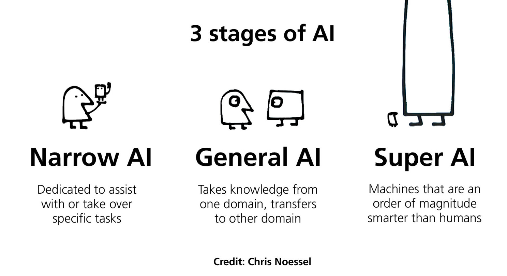{width="90%"}

</center>

## AI in the Modern World (1) {.smaller}

:::::::::: columns
:::::: {.column width="50%"}
{width="60%"}

> ::: {style="font-size: 50%;"}
> "Using **two types of neural network** - mathematical systems for identifying patterns in images or data - the Al system quickly **learnt to identify ten features of eye disease** from highly complex optical coherence tomography (OCT) scans. **The system was then able to recommend a referral decision based on the most urgent conditions detected.**" ... "Al was able to make the right referral recommendation more than **94% of the time** ..."
> :::

::: {style="font-size: 50%;"}
-   Diabetic Retinopathy

-   Age-related Macular Degeneration

-   Glaucoma

-   Retinal Detachment

-   Optic Neuropathy
:::

:::: {style="font-size: 70%;"}
::: caption2
https://www.ucl.ac.uk/ioo/news/2018/aug/artificial-intelligence-equal-experts-detecting-eye-diseases [-@ucl2018ai]
:::
::::
::::::

::::: {.column width="50%"}
Al system for breast cancer screening

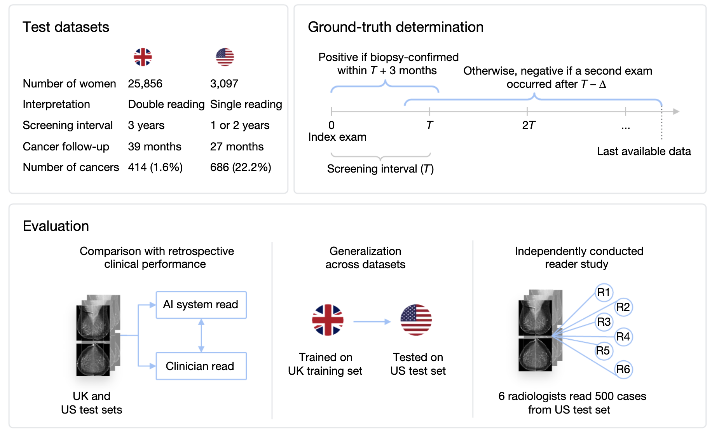{width="60%"} 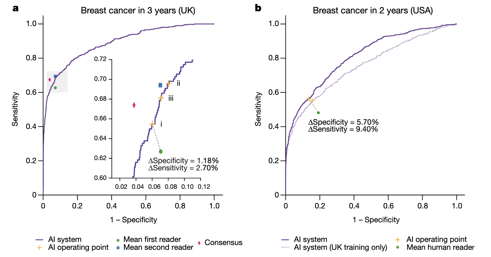{width="70%"}

:::: {style="font-size: 50%;"}
</br>

::: caption
[@mckinney2020international]
:::
::::
:::::
::::::::::

## AI in the Modern World (2) {.smaller}

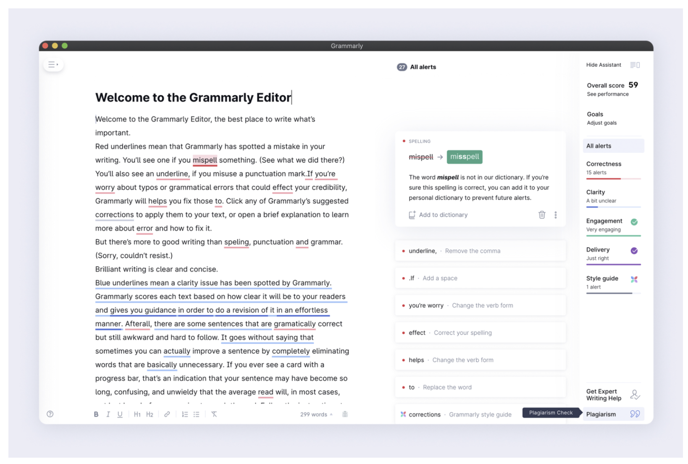


## AI in the Modern World (3) {.smaller}

- ทำนายความสำเร็จ/ความเสี่ยงในการเรียนรู้

- อธิบายปัจจัยที่เกี่ยวข้องกับความสำเร็จ

<br>

:::: {.columns}

::: {.column width="50%"}

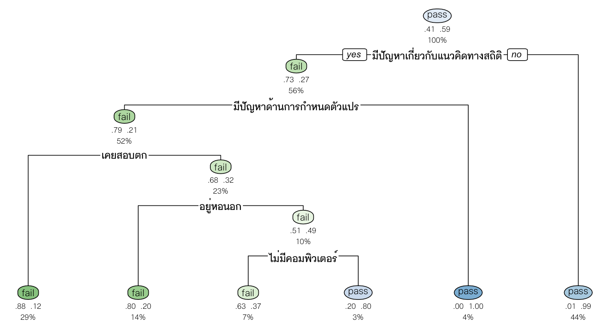

:::

::: {.column width="50%"}

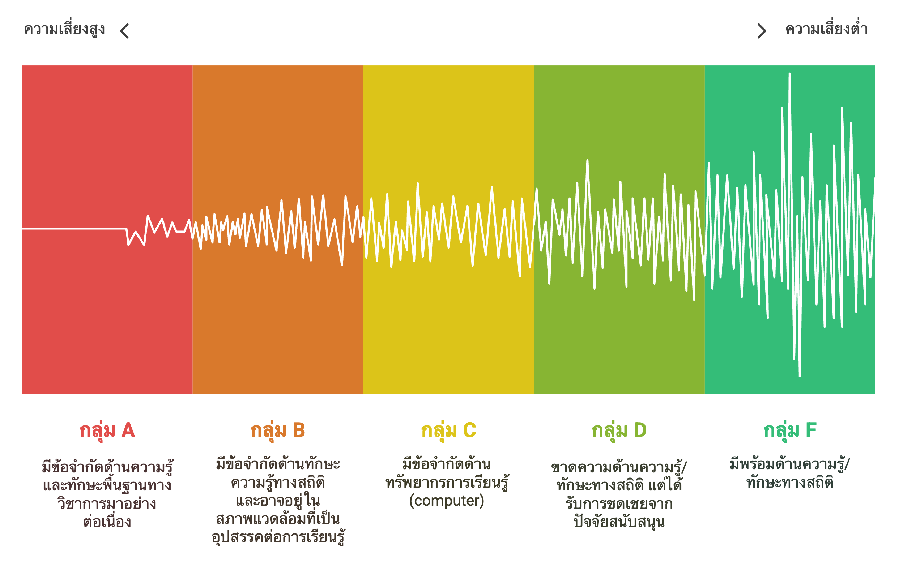

:::

::::


## AI in the Modern World (4) {.smaller}

-   วิเคราะห์ร่องรอยความรู้

-   ทำนายแนวโน้มความรู้ในอนาคตจากร่องรอยความรู้ในปัจจุบัน

::::: columns
::: {.column width="50%"}
{width="100%"}
:::

::: {.column width="50%"}
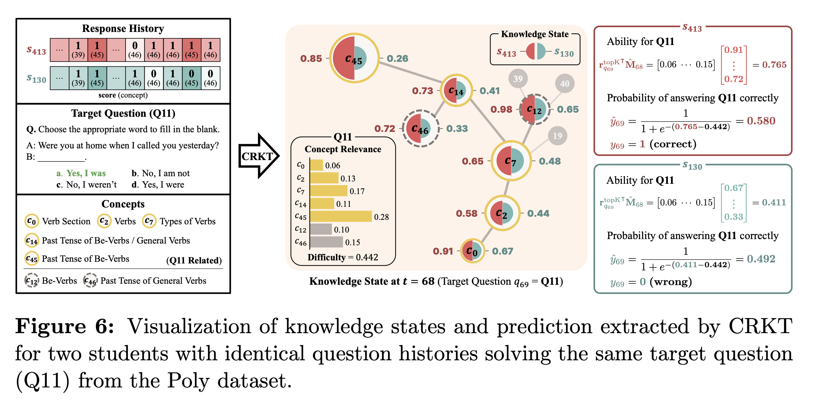{fig-align="left" width="100%"}
:::
:::::

## AI in the Modern World (5) {.smaller}

:::: {.columns}

::: {.column width="50%"}


:::

::: {.column width="50%"}

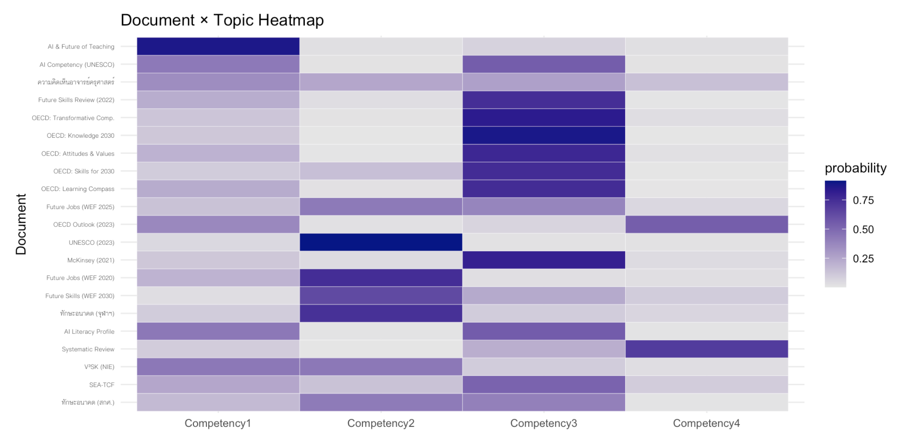
:::

::::

::: caption
สิวะโชติ และคณะ (2568)
:::


:::: {.columns}

::: {.column width="50%"}


:::

::: {.column width="50%"}

<center>
{width="60%"}
</center>

:::

::::

::: caption
@srisuttiyakorn2024technical
:::


## AI in the Modern World (6) {.smaller}

-   AI chatbot ที่ออกแบบมาเพื่อเป็น “copilot” ด้านสุขภาพจิต

-   ใช้แนวทางของ CBT (Cognitive Behavioral Therapy) หรือ “การบำบัดทางความคิดและพฤติกรรม”

-   ติดตามสุขภาพจิตอย่างต่อเนื่อง

::::::: columns
:::: {.column width="50%"}
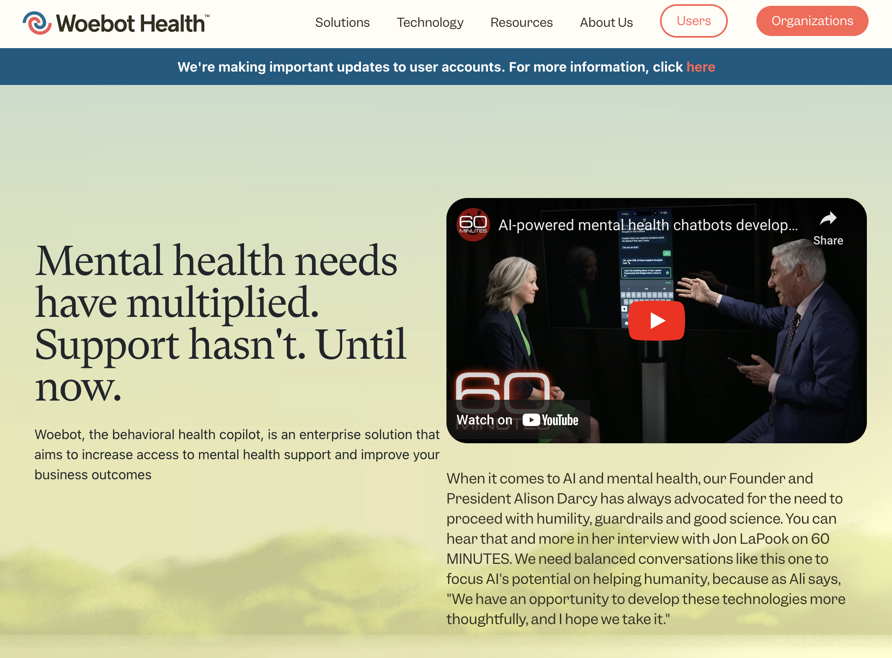{width="75%"}

::: caption2
https://woebothealth.com/[-@woebothealth2025]
:::
::::

:::: {.column width="40%"}
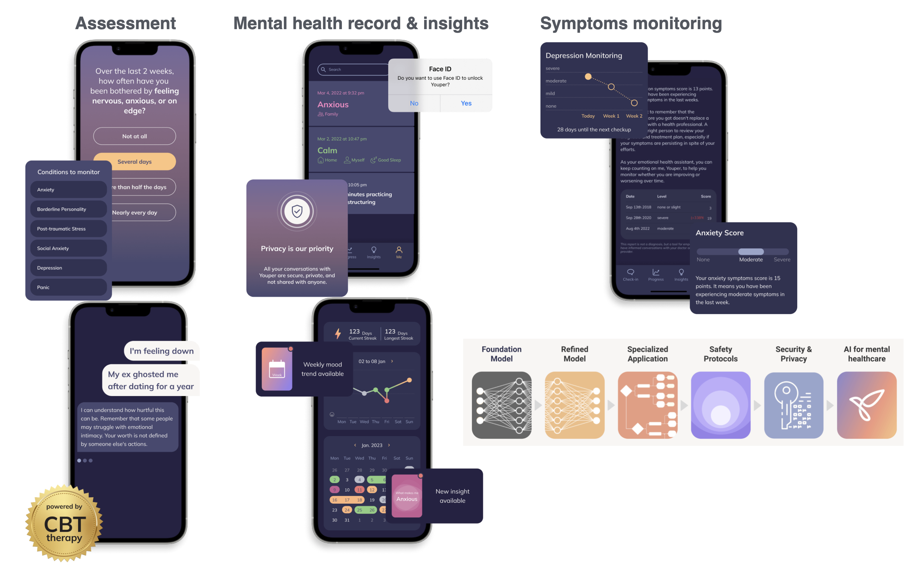{width="100%"}

::: caption3
https://www.youper.ai/how-it-works
:::
::::
:::::::

## AI in the Modern World (7) {.smaller}

<br>

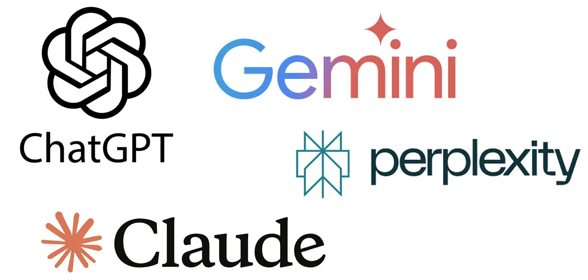{width="30%"}

## Artificial Intelligence {.smaller}

<center>

{width="50%"}

</center>

## Generative AI: What It Is and Why It Matters {.smaller}

<br>

::::::::: columns
::::::: {.column width="60%"}
::: {.fragment .fade-in style="font-size:80%;"}
**Generative AI** คือระบบปัญญาประดิษฐ์ที่สามารถสร้างข้อมูลใหม่ เช่น ข้อความ รูปภาพ เสียง โค้ด หรือวิดีโอ โดยอิงจากรูปแบบ (*patterns*) และโครงสร้าง (*structures*) ที่เรียนรู้จากข้อมูลจำนวนมาก
:::

::: {.fragment .fade-in style="font-size:80%;"}
กระบวนการสร้างไม่ได้เกิดจากการสุ่ม แต่เป็นการ **คำนวณทางสถิติ**\
เพื่อหา “ผลลัพธ์ที่มีความเป็นไปได้สูงสุด” ภายใต้บริบทที่กำหนด
:::

::: {.fragment .fade-in style="font-size:80%;"}
การสร้างเนื้อหาต้องอาศัย:

-   **Context**: บริบท เช่น ข้อความก่อนหน้า หรือข้อมูลแวดล้อม
-   **Prompt**: คำกระตุ้นที่ระบุภารกิจ รูปแบบ หรือเจตนาของผู้ใช้
:::

::: {.fragment .fade-in style="font-size:80%;"}
ผลลัพธ์ที่ได้จึงไม่ใช่ “ของใหม่โดยสมบูรณ์” (original content) แต่เป็นการจัดเรียงองค์ประกอบใหม่ตามความน่าจะเป็นของการเกิดร่วมกันของคำหรือพิกเซล ที่ คล้ายคลึงกับสิ่งที่เคยเรียนรู้มา แต่มีความยืดหยุ่นและสร้างสรรค์เพียงพอที่จะใช้งานในหลากหลายบริบท และตรงตามวัตถุประสงค์
:::
:::::::

::: {.column width="40%"}

:::
:::::::::

## Generative AI: หลักการทำงาน {.smaller}

<br>

::: {style="font-size:80%;"}

:::

## ประเภทของ LLMs {.smaller}


จำแนกตามลักษณะการใช้บริการ

- Cloud-hosted LLMs หรือ Proprietary LLM Services

- Local LLMs

จำแนกตามลักษณะข้อมูลที่รองรับ

- Text-only LLMs

- Multimodal LLMs


# Part 2: เริ่มใช้ Generative AI และ Prompt 101

## ChatGPT {.smaller}

:::::: columns
:::: {.column width="50%"}
::: {style="font-size:90%;"}
1.  เข้าไปที่เว็บไซต์ [chat.openai.com](chat.openai.com)
2.  ลงทะเบียนหรือเข้าสู่ระบบ
3.  เลือกโมเดลที่ต้องการใช้
4.  ลองพิมพ์คำถามหรือคำสั่งในช่องข้อความ
5.  ตรวจสอบคำตอบที่ได้รับ ปรับปรุง และนำผลลัพธ์ไปใช้

{width="605"}
:::
::::

::: {.column width="50%"}
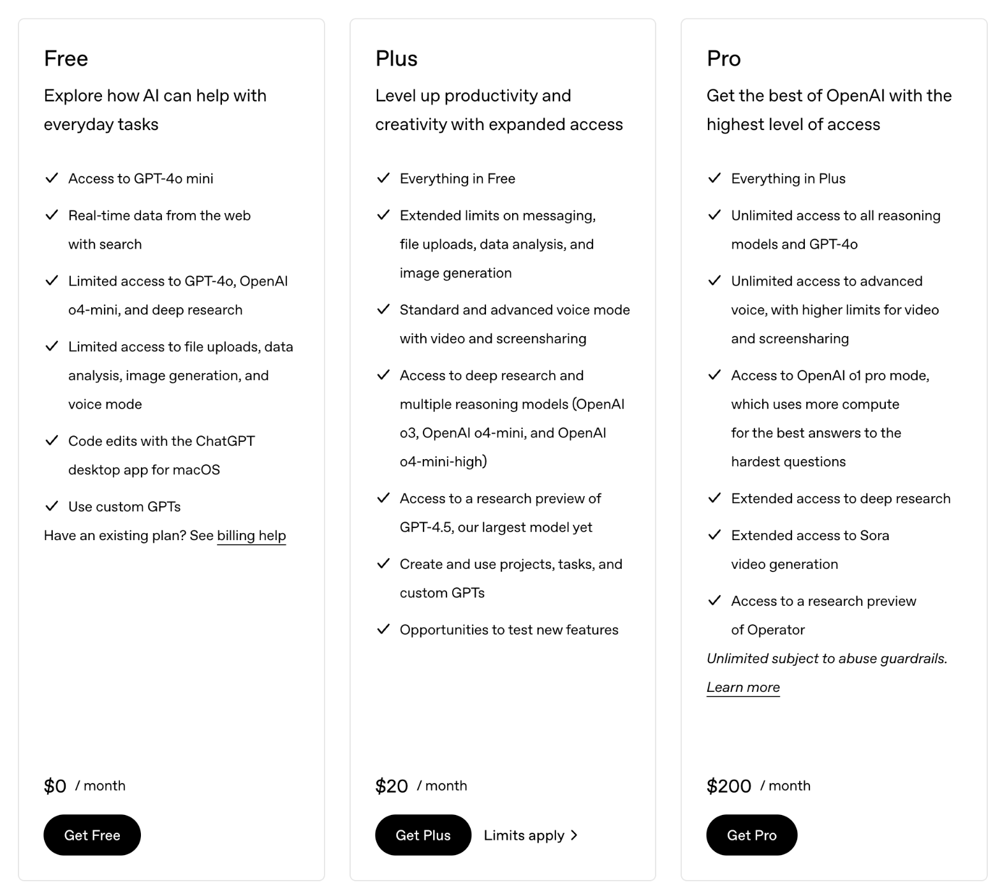
:::
::::::

## ChatGPT {.smaller}

:::::: columns
:::: {.column width="50%"}
::: {style="font-size:90%;"}
1.  เข้าไปที่เว็บไซต์ [chat.openai.com](chat.openai.com)
2.  ลงทะเบียนหรือเข้าสู่ระบบ
3.  เลือกโมเดลที่ต้องการใช้
4.  ลองพิมพ์คำถามหรือคำสั่งในช่องข้อความ
5.  ตรวจสอบคำตอบที่ได้รับ ปรับปรุง และนำผลลัพธ์ไปใช้

{width="605"}
:::
::::

::: {.column width="50%"}
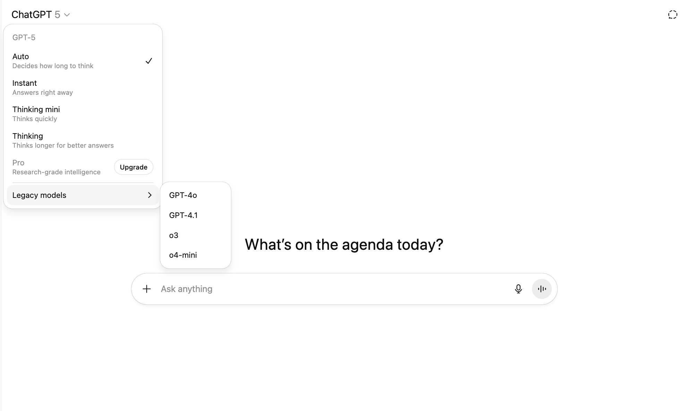
:::
::::::

## ChatGPT {.smaller}

:::::: columns
:::: {.column width="50%"}
::: {style="font-size:90%;"}
1.  เข้าไปที่เว็บไซต์ [chat.openai.com](chat.openai.com)
2.  ลงทะเบียนหรือเข้าสู่ระบบ
3.  เลือกโมเดลที่ต้องการใช้
4.  ลองพิมพ์คำถามหรือคำสั่งในช่องข้อความ
5.  ตรวจสอบคำตอบที่ได้รับ ปรับปรุง และนำผลลัพธ์ไปใช้

{width="605"}
:::
::::

::: {.column width="50%"}
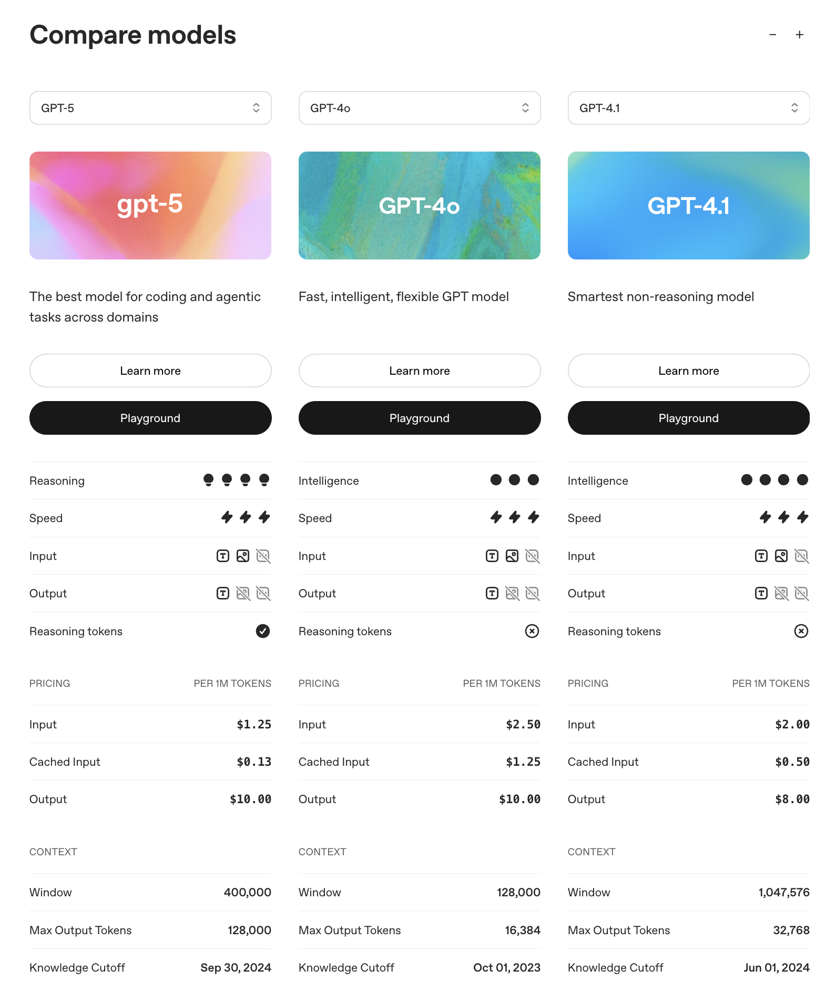{width="80%"}
:::
::::::

## กิจกรรมลองใช้ ChatGPT

> สถานการณ์ : ผู้เช่าได้ย้ายออกจากคอนโดตามสัญญาเช่าแล้ว แต่เจ้าของห้อง (ผู้ให้เช่า) แจ้งว่าจะไม่คืนเงินประกันจำนวน 15,000 บาท โดยอ้างว่าต้องนำไปซ่อมแซมห้อง

ผู้ให้เช่าทำผิดกฎหมายหรือไม่ ?

## กิจกรรมลองใช้ ChatGPT : Prompt แบบที่ 1 

::: {style="font-size:80%;"}
"ผมเป็นผู้เช่าได้ย้ายออกจากคอนโดตามสัญญาเช่าแล้ว แต่เจ้าของห้อง (ผู้ให้เช่า) แจ้งมาว่าจะไม่คืนเงินประกันจำนวน 15,000 บาท โดยอ้างว่าต้องนำไปซ่อมแซมห้อง แบบนี้ผิดกฎหมายมั้ย ไม่คืนได้หรอ??"
:::

## กิจกรรมลองใช้ ChatGPT : Prompt Design แบบที่ 2 

::: {style="font-size:80%;"}
ในฐานะที่ปรึกษากฎหมาย ช่วยวิเคราะห์สถานการณ์และให้คำแนะนำตามกฎหมายไทย

ข้อเท็จจริง:

1.  ทำสัญญาเช่าคอนโด 1 ปี สิ้นสุดวันที่ 30 มิถุนายน 2568 วางเงินประกัน 15,000 บาท

2.  ย้ายออกและส่งมอบห้องคืนในสภาพเรียบร้อยเมื่อวันที่ 30 มิถุนายน 2568

3.  วันนี้ (31 กรกฎาคม 2568) เจ้าของห้องแจ้งผ่าน LINE ว่าจะยึดเงินประกันทั้งหมด 15,000 บาท เพื่อเป็นค่าทาสีผนังใหม่ และค่าล้างแอร์ ซึ่งรายการเหล่านี้ไม่ได้ระบุว่าเป็นความเสียหายที่ผู้เช่าต้องรับผิดชอบในสัญญา

สิ่งที่ต้องการ: สิทธิของผู้เช่าตามกฎหมายในกรณีนี้มีอะไรบ้าง?

1.  การกระทำของเจ้าของห้องขัดต่อกฎหมายหรือไม่ อย่างไร?

2.  ขั้นตอนที่ควรดำเนินการต่อไปควรเป็นอย่างไรบ้าง (เรียงลำดับจากง่ายไปยาก)

3.  โปรดอ้างอิงตัวบทกฎหมายที่เกี่ยวข้อง เช่น ประกาศคณะกรรมการว่าด้วยสัญญาฯ
:::

## ปัญหา Hallucination {.smaller}

<left> {width="45%"} </left>

<br>

AI hallucination หมายถึงกรณีที่ระบบปัญญาประดิษฐ์ (AI) สร้างเนื้อหาหรือคำตอบที่ **ไม่ได้อิงจากข้อมูลจริงหรือข้อมูลที่ได้รับมา** ซึ่งอาจทำให้ AI สร้างข้อมูลที่**ไม่ถูกต้อง นำไปสู่ความเข้าใจผิด หรือแต่งขึ้นทั้งหมด** ซึ่งอาจก่อให้เกิดปัญหาในหลายบริบทของการใช้งาน

-   **สร้างข้อมูลเท็จโดยสิ้นเชิง (total fabrication)** -- สร้างแก่นของเรื่องราวที่ไม่มีอยู่จริงขึ้นมาทั้งหมด เช่น อ้างอิงหลักฐานข้อมูลผิด ให้เหตุผลผิด นำไปสู่การสร้างข้อสรุปผิด

-   **ผสมผสานระหว่างข้อมูลจริงและเท็จ (mixing true & false)** -- หลักการโดยรวมถูกต้อง แต่อาจยกตัวอย่างหรือหลักฐานข้อมูลประกอบที่ไม่มีอยู่จริง

-   **สรุปความเกินจริง (faulty inference)** -- ข้อมูลตั้งต้นถูก แต่ข้อสรุปตีความเกินขอบเขตการอ้างอิงของข้อมูล

## ปัจจัยที่มีผลต่อความถูกต้อง/เหมาะสมของผลลัพธ์ {.smaller}

::: {style="font-size:85%;"}
-   **Model**

    -   พื้นความรู้เดิม (Knowledge Base) โมเดลถูก train มาด้วยข้อมูลอะไรบ้าง สิ้นสุด ณ ตอนไหน มีความเป็นปัจจุบันมากน้อยแค่ไหน

    -   สถาปัตยกรรมของโมเดล

    -   ความรู้ความสามารถของโมเดล ขนาดและความสามารถในการให้เหตุผล โมเดลขนาดใหญ่มักมีความสามารถในการคิดเชิงเหตุผล หรือคิดในปัญหาซับซ้อนได้ดีกว่า

    -   การปรับจูนเฉพาะทาง (Fine-tuning) ช่วยให้โมเดลเข้าใจบริบทเฉพาะทางได้ดีขึ้น

-   **Prompt**

    -   กระบวนการกระตุ้นเพื่อให้ LLM แสดงผลลัพธ์ตามที่ต้องการ

    -   Prompt ชัดเจน ไม่กำกวม และบอกสิ่งที่ต้องการอย่างละเอียด จะได้ผลลัพธ์ที่ดีกว่า

    -   เทคนิคการ Prompt ที่แตกต่างกันอาจให้ผลลัพธ์แตกต่างกันไปด้วย (อาจไม่จริงเสมอไปโดยเฉพาะกับโมเดลขนาดใหญ่ที่มีประสิทธิภาพสูง เช่น gpt-o1, gpt-o3)

-   **Context**

    -   ข้อมูลแวดล้อมที่ป้อนเข้าไปพร้อมกับ Prompt เช่น เนื้อหาจากเอกสาร, บทสนทนาก่อนหน้า, หรือข้อมูลเฉพาะที่โมเดลไม่เคยรู้มาก่อน

    -   กระบวนการจัดหา Context ที่ถูกต้องก็เป็นปัจจัยที่มีผลด้วย
:::

## LLMs Adaptation Methods {.smaller}

ผู้ใช้สามารถปรับแต่งการทำงานของ LLMs ให้เหมาะสมกับงานเฉพาะทางได้

- Prompting 

- Retrieval-Augmented Generation (RAG)

- Fine-tuning

- Training from Scratch

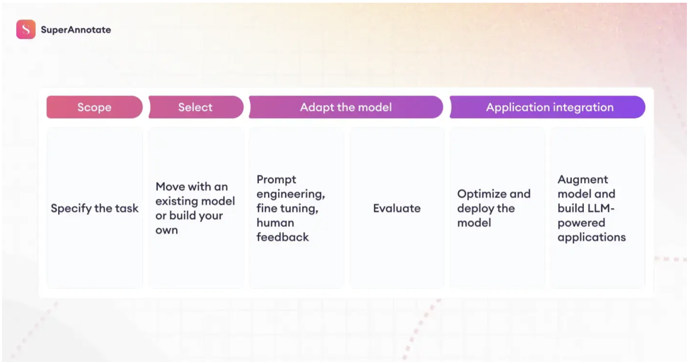

## Prompting: In-Context Learning (ICL) {.smaller}

> "คุณภาพของ prompt ส่งผลต่อคุณภาพของผลลัพธ์"


-   Zero-Shot Prompting

-   One-Shot Prompting

-   Few-Shot Prompting

-   Chain-of-Thought

-   Template Design


## Zero-shot prompting

::: {style="font-size:80%;"}
เจ้าของหอพักเข้าห้องผู้เช่าโดยไม่แจ้งล่วงหน้า และนำทรัพย์สินของผู้เช่าออกไป ขอให้สรุปประเด็นข้อกฎหมายที่ต้องวินิจฉัย
:::

## One-Shot Prompting

::: {style="font-size:80%;"}
-   ตัวอย่าง: ภาษากฎหมาย: ผู้ใดลักทรัพย์ผู้อื่น ต้องระวางโทษจำคุกไม่เกินสามปี หรือปรับไม่เกินหกหมื่นบาท หรือทั้งจำทั้งปรับ\
    ภาษาชาวบ้าน: ถ้าใครขโมยของคนอื่น อาจติดคุกไม่เกิน 3 ปี หรือโดนปรับไม่เกิน 60,000 บาท หรือทั้งติดคุกทั้งโดนปรับ

-   ภาษากฎหมาย: ผู้ให้เช่าต้องส่งมอบทรัพย์ให้ผู้เช่าตามที่ตกลงกันไว้\
    ภาษาชาวบ้าน:...

<br>

แปลงข้อความทางกฎหมายให้เป็นภาษาที่ประชาชนเข้าใจง่าย
:::

## Few-Shot Prompting

::: {style="font-size:80%;"}
-   ตัวอย่างที่ 1:\
    สถานการณ์: นาย ก. ขโมยโทรศัพท์จากกระเป๋าของนาย ข.\
    กฎหมายที่เกี่ยวข้อง: ประมวลกฎหมายอาญา มาตรา 334 (ลักทรัพย์)

-   ตัวอย่างที่ 2:\
    สถานการณ์: นางสาว ค. ปลอมลายเซ็นในเช็คเงินสดเพื่อเบิกเงิน\
    กฎหมายที่เกี่ยวข้อง: ประมวลกฎหมายอาญา มาตรา 264 (ปลอมเอกสาร)

-   สถานการณ์ใหม่:\
    นาย ง. ทำร้ายร่างกายนาย จ. จนได้รับบาดเจ็บสาหัส\
    กฎหมายที่เกี่ยวข้อง:

<br>

ระบุหมวดกฎหมายหรือมาตราที่เกี่ยวข้องในประมวลกฎหมายอาญา
:::

## Chain-of-Thought (CoT) (1) {.smaller}

Chain-of-Thought Prompting คือเทคนิคการออกแบบ prompt ที่ให้โมเดลภาษารู้จักการคิดแบบมีเหตุผลเป็นขั้นเป็นตอน หรือแสดงวิธีคิด/วิธีทำออกมาก่อนจะสรุปเป็นคำถามสุดท้าย (step-by-step reasoning)

แทนที่จะให้โมเดลตอบทันที...

> ใช้ prompt กระตุ้นให้โมเดลแจกแจงกระบวนการคิด การให้เหตุผล วิธีการคำนวณ หรือการดำเนินงานเพื่อนำไปสู่ผลลัพธ์ออกมาทีละขั้น

-   ลดปัญหา Hallucination

-   เพิ่มความโปร่งใส คุณภาพคำตอบดีขึ้น

-   สอดคล้องกับหลักการ Human in the Loop/Human Center Mindset

## Chain-of-Thought (CoT) (2) {.smaller}

::: {style="font-size:110%;"}
สถานการณ์

```         
เมื่อวันที่ 10 พฤศจิกายน 2560 นายโมทย์ นายสมคิด และพวกรวม 10 คน ได้ประชุมวางแผนให้นายโมทย์ใช้ลูกระเบิดชนิดสังหารขว้างใส่ห้องแถวไม้ 2 ชั้นของนายขุน โดยชั้นล่างเปิดเป็นร้านขายของ และชั้นบนเป็นที่พักอาศัยของนายขุนและครอบครัว แต่เกิดอุปสรรคจึงได้ยกเลิกแผนการ

ต่อมาในวันที่ 12 พฤศจิกายน 2560 นายโมทย์และพวกรวม 9 คน ได้นัดประชุมวางแผนอีกครั้ง โดยในครั้งนี้นายสมคิดไม่ได้เข้าร่วมประชุมด้วย

เมื่อประชุมเสร็จแล้ว นายโมทย์จึงเดินทางไปที่บ้านของนายขุน เมื่อถึงบ้าน นายโมทย์เห็นนายขุนและครอบครัวทุกคนขับรถออกจากบ้านไป หลังจากนั้นประมาณ 10 นาที นายโมทย์จึงใช้ลูกระเบิดชนิดสังหารขว้างใส่ห้องแถวไม้ของนายขุน เป็นเหตุให้ฝาบ้าน ประตูบ้าน และกระจกช่องลม ซึ่งเป็นส่วนหนึ่งของตัวบ้าน ได้รับความเสียหายจากแรงระเบิด

สิบตำรวจเอกดำรง และดาบตำรวจอิทธิพล ซึ่งพบเห็นการกระทำความผิดของนายโมทย์ จึงเข้าจับกุมและนำส่งพนักงานสอบสวน โดยทั้งสองนายเดินขนาบข้างและคล้องแขนนายโมทย์ไว้คนละข้าง

ระหว่างทาง นายศึกษากับพวกประมาณ 10 ถึง 15 คน ซึ่งเป็นเพื่อนของนายโมทย์ ได้เข้ามาแย่งตัวนายโมทย์ โดยนายศึกษาดึงตัวนายโมทย์ และใช้เท้าถีบสิบตำรวจเอกดำรง และดาบตำรวจอิทธิพล ขณะเดียวกัน นายโมทย์พยายามดิ้นรนเพื่อให้พ้นจากการถูกควบคุมตัว เป็นเหตุให้เท้าของนายโมทย์ไปถูกสิบตำรวจเอกดำรง และดาบตำรวจอิทธิพล
```
:::

**Zero-Shot Prompting**

::: {style="font-size:110%;"}
```         
ให้วินิจฉัยว่า นายโมทย์ นายสมคิด และนายศึกษา มีความผิดตามประมวลกฎหมายอาญาฐานใดหรือไม่?
```
:::

**Single-Turn CoT**

::: {style="font-size:110%;"}
```         
นายโมทย์ มีความผิดตามประมวลกฎหมายอาญาฐานใดหรือไม่ ช่วยอธิบายเหตุผลด้วย
```
:::

::: {style="font-size:90%;"}
ผลลัพธ์ที่ได้เป็นอย่างไร? แตกต่างกันหรือไม่?
:::

## Chain-of-Thought (CoT): Multi-Turn CoT {.smaller}

-   CoT ไม่จำเป็นต้องดำเนินการจบใน prompt เดียว ผู้ใช้สามารถออกแบบป้อน prompt หลาย ๆ รายการ อย่างเป็นลำดับ

-   ได้ร่วมคิดไปกับโมเดล เห็นกระบวนการคิดระหว่างทาง (สอดคล้องกับ concept explainable AI)

-   สามารถให้ feedback หรือให้ข้อมูลใหม่แต่โมเดลได้ระหว่างกระบวนการคิด

::: {style="font-size:120%;"}
```         
1. วิเคราะห์พฤติกรรมของ “นายโมทย์”

(1.1) พฤติกรรมที่เกิดขึ้น:
    – ขว้างลูกระเบิดใส่ห้องแถวไม้ของนายขุน
    – ทำให้ทรัพย์สินเสียหาย เช่น ฝาบ้าน ประตูบ้าน กระจก

(1.2) ข้อเท็จจริง:
    – บ้านเป็นอาคาร 2 ชั้น ซึ่งชั้นบนใช้เป็นที่อยู่อาศัยของเจ้าของบ้านและครอบครัว
    – แม้ไม่มีคนอยู่ขณะเกิดเหตุ แต่โดยสภาพถือว่าเป็นอาคารที่มีคนอยู่อาศัย

(1.3) วิเคราะห์กฎหมายที่เกี่ยวข้อง:
    - มาตรา 218(2): วางเพลิงหรือทำให้เกิดระเบิดแก่ทรัพย์ในอาคารที่คนอาศัยอยู่ → มีความผิด
    - มาตรา 358: ทำให้เสียทรัพย์
    - มาตรา 138 วรรคสอง: ต่อสู้ขัดขวางเจ้าพนักงาน โดยใช้กำลังระหว่างถูกจับกุม

(1.4) สรุปความผิดของนายโมทย์ พร้อมอธิบายเหตุผล 
```
:::

ผลลัพธ์ที่ได้เป็นอย่างไร แตกต่างกันหรือไม่?


## Template Design

<center>

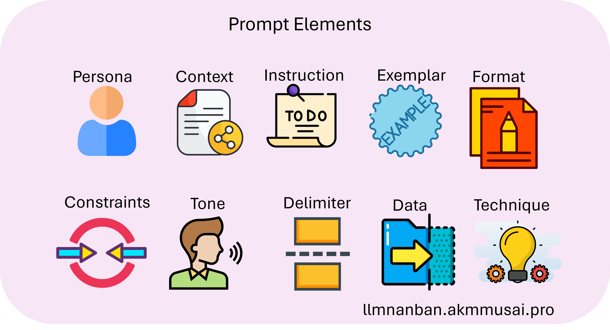{width="50%"}

</center>


# Part 3: แนะนำ Generative AI สำหรับงานด้านการศึกษา


## แนวโน้มการใช้ Gen AI ในงานด้านต่าง ๆ {.smaller}

{width="80%"}


## LLMs Performance {.smaller}

- Graduate-Level Google-Proof Q&A Benchmark (GPQA) — เป็นชุดทดสอบที่ออกแบบมาให้วัดความสามารถของโมเดลภาษาขนาดใหญ่ (LLMs) ในการตอบคำถามระดับบัณฑิตศึกษาที่ ไม่สามารถแก้แค่โดยค้นจาก Google ได้ (Google-proof)

- คำถามถูกออกแบบให้แม้ผู้ตอบจะเข้าถึงแหล่งข้อมูลออนไลน์อย่างอิสระ ก็ยังไม่สามารถตอบได้ง่ายโดยค้นคำสำคัญ (keyword) หรือคัดลอกคำตอบ — ต้องใช้ ความเข้าใจเชิงลึกและเหตุผล

- นักวิจัย/ผู้เชี่ยวชาญ PhD ในสาขาที่เกี่ยวข้อง ทำได้ประมาณ 65%-74%


:::: {.columns}

::: {.column width="60%"}

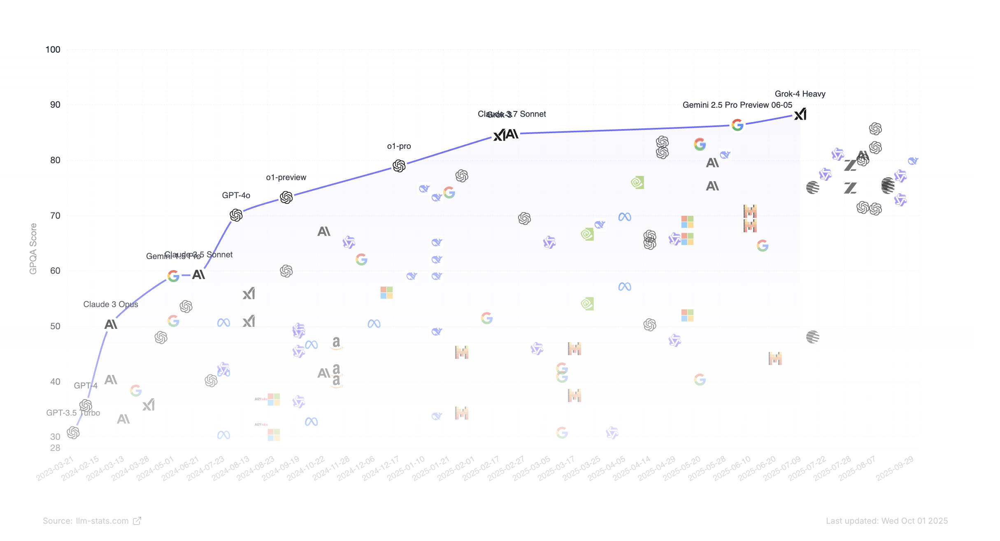

:::

::: {.column width="40%"}

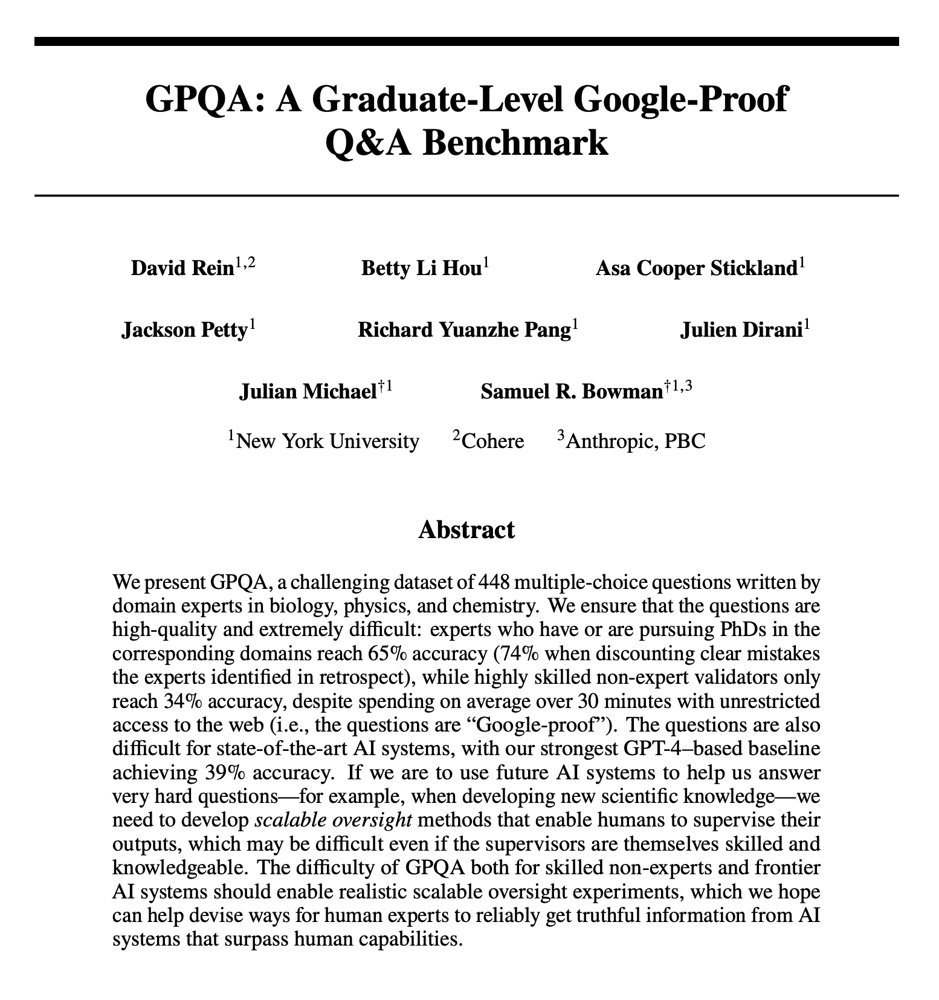{width="70%"}

:::

::::

## การดำเนินการวิจัยร่วมกับ AI {.smaller}

1. ทบทวนและสังเคราะห์วรรณกรรมที่เกี่ยวข้อง

2. กำหนดหัวข้อและคำถามวิจัย

3. ออกแบบเครื่องมือวิจัย

4. เก็บรวบรวมและเตรียมข้อมูลให้พร้อมสำหรับการวิเคราะห์

5. วิเคราะห์ข้อมูล

6. แปลผลการวิเคราะห์ ช่วยร่างรายงาน

7. จัดทำรายการอ้างอิง จัดรูปแบบ


## ภาพรวมเครื่องมือ Gen AI สำหรับงานด้านการวิจัยทางการศึกษา {.smaller}

::: {style="font-size:50%;"}
<br>
:::

::: {style="font-size:90%;"}
**กลุ่มที่ 1: โมเดลภาษาอเนกประสงค์ (General-Purpose LLMs)** เป็น AI ที่มีความสามารถทางภาษาและตรรกะสูง เหมาะกับงานที่ต้องการ "การคิด" วิเคราะห์ และสังเคราะห์ข้อมูล

-   [ChatGPT](https://chatgpt.com/)
-   [Gemini](https://gemini.google.com/)
-   [Claude](https://claude.ai/)

**กลุ่มที่ 2: AI เพื่อการสืบค้น (AI for Research)** เป็น AI ที่เน้นการค้นหาข้อมูลล่าสุดจากอินเทอร์เน็ต พร้อมแสดงแหล่งอ้างอิงเพื่อการตรวจสอบย้อนกลับ

-   [Perplexity](https://www.perplexity.ai/)

-   Chatgpt/Claude/Gemini + Web Search + Deep Research Features

-   [Consensus](https://consensus.app/)/[Elicit](https://elicit.com/)

**กลุ่มที่ 3: ผู้ช่วยจัดการความรู้ (Knowledge Assistant)** เป็น AI ที่ทำงานกับเอกสารส่วนตัวจำนวนมากที่เราป้อนเข้าไป เพื่อช่วยสกัดและเชื่อมโยงข้อมูล

-   [NotebookLM](https://notebooklm.google.com/)

- Notion + AI
:::

## ภาพรวมเครื่องมือ Gen AI สำหรับงานด้านการวิจัยทางการศึกษา {.smaller}

**กลุ่มที่ 4: เครื่องมือสนับสนุนการเขียนและการอ้างอิง (Writing & Citation Tools)**
ช่วยในการเขียนเชิงวิชาการ ตรวจสอบภาษา และจัดการบรรณานุกรม

-  Chatgpt/Claude/Gemini

-  [Grammarly](https://www.grammarly.com/)

- ...

**กลุ่มที่ 5: เครื่องมือสำหรับการวิเคราะห์ข้อมูล (AI for Data Analysis)**
AI ที่เสริมการวิเคราะห์ข้อมูลเชิงสถิติและเชิงคุณภาพ

- Chatgpt/Claude/Gemini

- Github Copilot

- [Manus](https://manus.im/app)

- ...


## AI Usage Framework

::::: columns
::: {.column width="50%"}
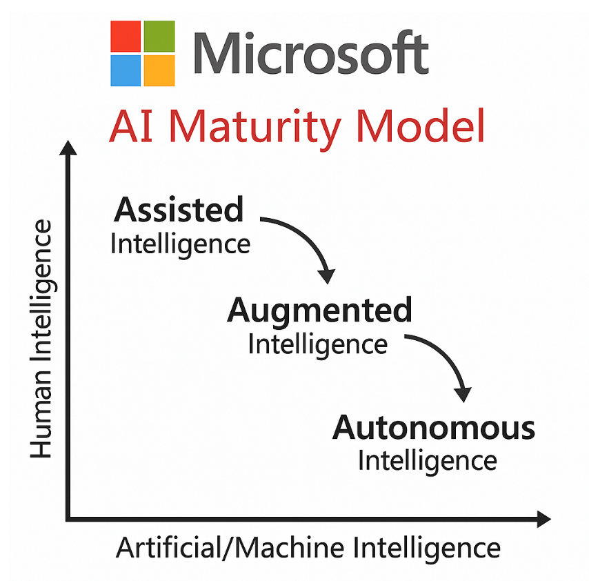
:::

::: {.column width="50%"}

:::
:::::

## Human in the Loop

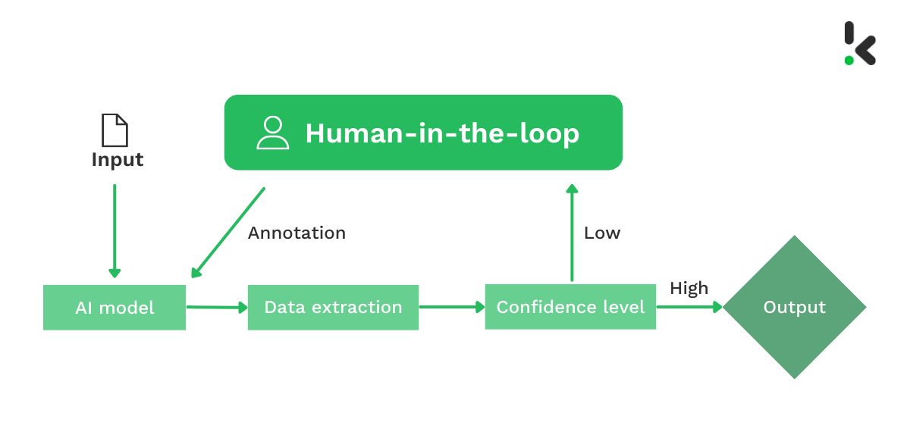

# Part 4: LLMs vs AI Workflows vs AI Agents

## LLMs {.smaller}

-   โมเดลภาษาขนาดใหญ่ที่เป็นพื้นฐานของแอปพลิเคชัน AI เช่น ChatGPT, Google Gemini และ Claude

-   เก่งมากในงานด้านภาษา : แปล สรุป แก้ไข สร้างเนื้อหาใหม่ ...

-   มีภูมิความรู้จำกัด ขึ้นอยู่กับ pre-trained data ไม่ทราบข้อมูลเฉพาะบุคคลหรือบริบทต่าง ๆ ของงาน/องค์กร

-   การทำงานเป็นแบบ passive ตอบสนองเฉพาะคำสั่งและข้อมูลที่ได้รับ ไม่สามารถตัดสินใจหรือวางแผนการดำเนินงานได้เอง

{width="605"}

## AI Workflows (1) {.smaller}

-   ต่อยอดจาก LLMs โดยกำหนดเส้นทาง/กระบวนการทำงานเอาไว้ล่วงหน้า (โดยมนุษย์) เรียกกระบวนการนี้ว่า Workflow

-   ภายใน Workflow นี้ LLM สามารถเข้าถึงและดึงข้อมูลจากเครื่องมือภายนอก เช่น ค้นหาข้อมูลใน google calendar, weather API, calculator, databases, ...

<center>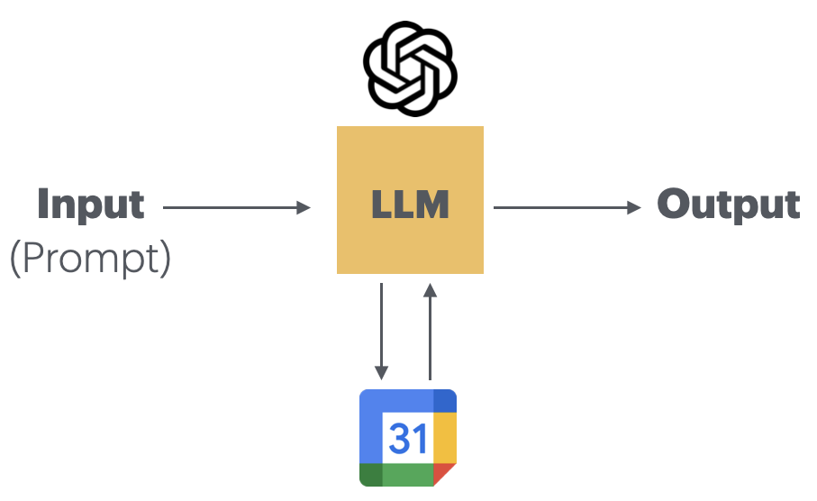{width="50%"}</center>

## AI Workflows (2)

::::: columns
::: {.column width="50%"}
<center>

{width="100%"}

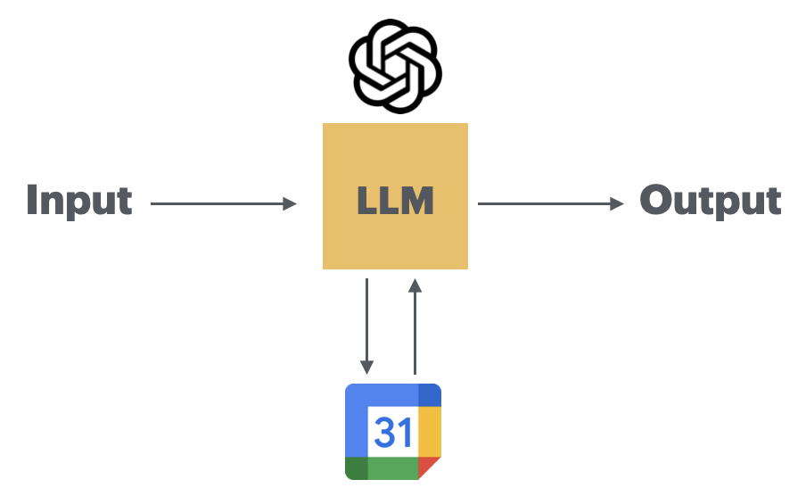

</center>
:::

::: {.column width="50%"}
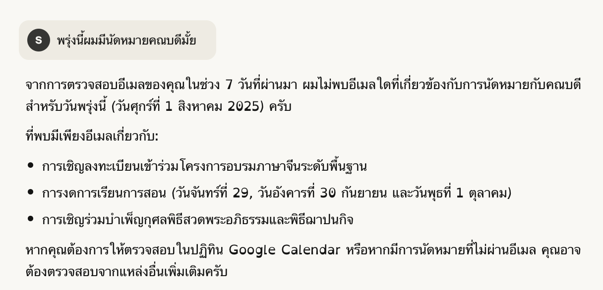

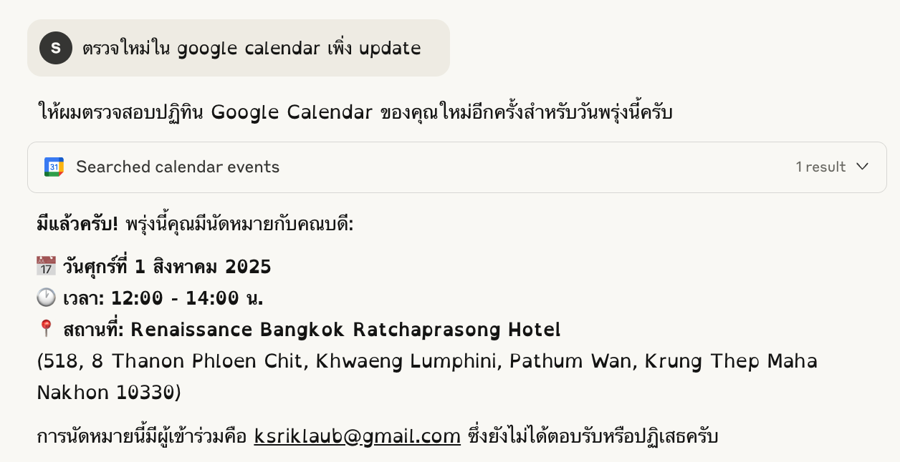
:::
:::::

## AI Workflows (3) {.smaller}

ข้อจำกัดของ Workflow คือไม่สามารถทำงานนอกเหนือจากเส้นทางที่กำหนด

::::: columns
::: {.column width="50%"}
<center></center>
:::

::: {.column width="50%"}
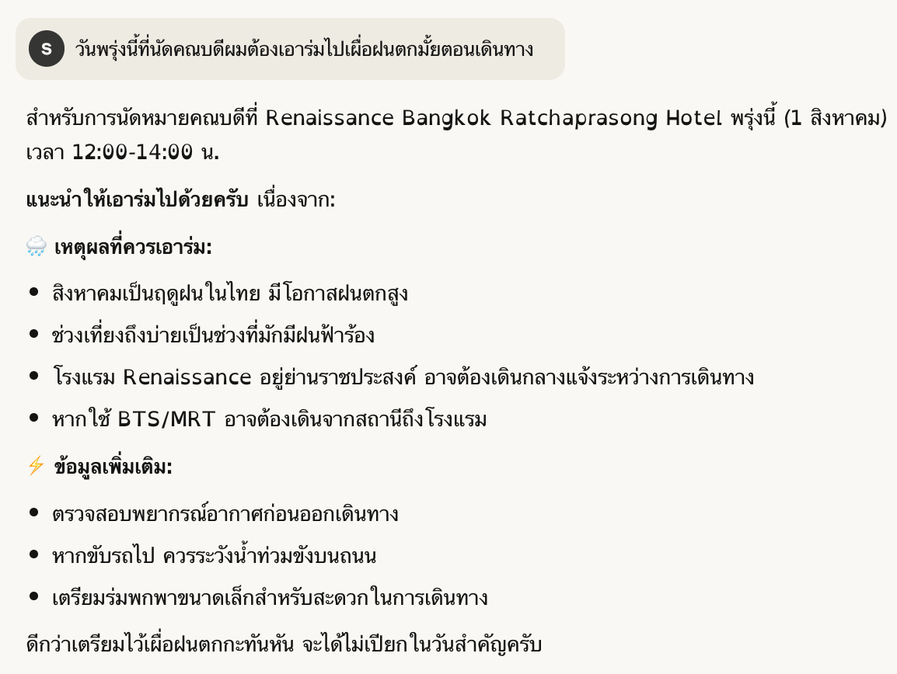
:::
:::::

## AI Workflows (4) {.smaller}

::::: columns
::: {.column width="50%"}

:::

::: {.column width="50%"}
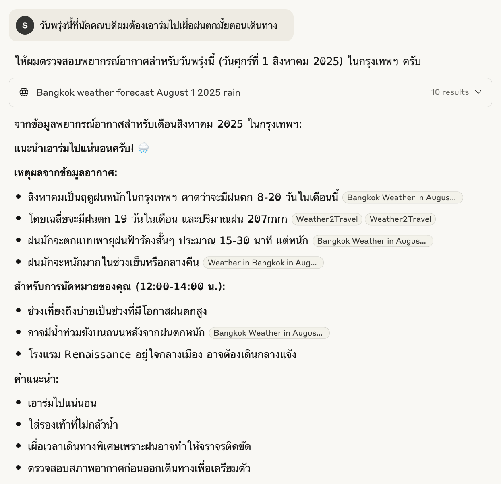
:::
:::::

## AI Workflows (5)


## AI Workflows emulate Human Decision-Making

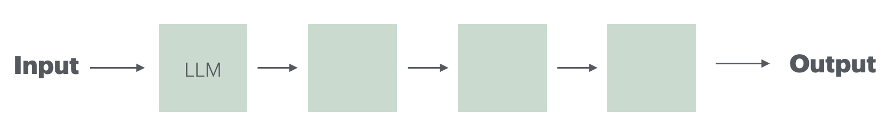

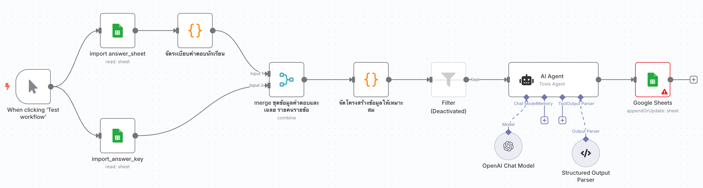

## AI Workflows: Perplexity + NotebookLM + ChatGPT {.smaller}

-   วิธีที่ง่ายที่สุดและไม่ต้องเขียนโค้ดเลย เหมาะสำหรับการทำงานเป็นครั้งคราว

-   ให้ผู้ใช้ทำหน้าที่เป็นผู้ควบคุม (orchestrator) เอง

    -   กำหนดเป้าหมาย

    -   กำหนดกระบวนการทำงาน

    -   มอบหมายงานให้ LLM แต่ละตัวทำอย่างเหมาะสมภายในกระบวนการ

    -   ส่งต่อ input/output ให้กับ LLM ตามกระบวนการที่กำหนด

    -   ประเมินผลลัพธ์

## AI Workflows: Perplexity + NotebookLM + ChatGPT {.smaller}

-   เป้าหมาย : ร่างหลักการและเหตุผล ข้อเสนอโครงการพัฒนาระบบบริหารจัดการคดีดิจิทัล

-   ข้อมูลที่ใช้ในการทำงาน

    -   ความคิดเห็นจาก stakeholder

    -   ยุทธศาสตร์ศาลยุติธรรม TRUST

    -   แผนพัฒนาดิจิทัล

    -   Literature เกี่ยวกับระบบศาลดิจิทัลหรือระบบที่เกี่ยวข้องในต่างประเทศ

-   กระบวนการทำงาน : หาและเก็บรวบรวมข้อมูล --\> วิเคราะห์/สังเคราะห์ข้อมูล --\> ร่างหลักการและเหตุผล (สภาพที่คาดหวัง + สภาพปัจจุบัน + Gap analysis ...)

🙈 [ดาวน์โหลด materials สำหรับตัวอย่าง](https://drive.google.com/drive/folders/1_HeS7ZCivc0Y2wI5N3tj6R5GV8HgULHH?usp=drive_link)

## AI Workflows: Perplexity + NotebookLM + ChatGPT {.smaller}


1. หาเอกสาร รายงาน และงานวิจัยที่เกี่ยวข้องกับระบบบริหารจัดการคดีดิจิทัลในต่างประเทศ

    - สร้างคำค้น (keyword) ด้วย generative AI เช่น ChatGPT

    - ใช้คำค้นที่ได้เพื่อหาเอกสารที่เกี่ยวข้องใน perplexity

2. สกัดข้อมูลจากเอกสารที่เกี่ยวข้องในประเด็นที่ต้องการ

    - นำแหล่งข้อมูลที่ได้จาก perplexity ไปใช้ใน NotebookLM

    - ป้อน prompt เพื่อสกัดข้อมูลในประเด็นที่ต้องการด้วย NotebookLM

3. นำข้อมูลที่สกัดได้มาวิเคราะห์/สังเคราะห์ใน ChatGPT

4. ให้ผลการวิเคราะห์/สังเคราะห์เป็นฐาน (บริบท) ในการเขียนข้อเสนอโครงการ


## AI Agents (1) {.smaller}

-   ข้อจำกัดของ Workflow คือไม่สามารถทำงานนอกเหนือจากเส้นทางที่กำหนด

-   นำ LLM เข้ามาแทนที่มนุษย์ในฐานะผู้ควบคุม/ตัดสินใจกระบวนการทำงานทั้งหมด

-   มนุษย์มีบทบาทแค่บอกเป้าหมาย/ผลลัพธ์ที่อยากได้เท่านั้น ที่เหลือ AI Agent จะทำการคิดให้เหตุผล ดำเนินการและควบคุมการดำเนินการจนบรรลุเป้าหมายเอง

-   แนวคิดหลักที่นำมาพัฒนา AI Agent เรียกว่า React Framework

-   คุณสมบัติสำคัญของ AI Agents

    -   ตั้งเป้าหมายได้เอง

    -   ตัดสินใจและวางแผน

    -   ทำงานหลายขั้นตอนอัตโนมัติ

    -   มีความต่อเนื่อง

    -   สามารถเชื่อมต่อเครื่องมือหรือแหล่งข้อมูลภายนอก

## AI Agents (2)

-   [ChatGPT Agent](https://openai.com/index/introducing-chatgpt-agent/)

-   Claude + Extended Thinking + Connectors

-   [Manus](https://manus.im/)

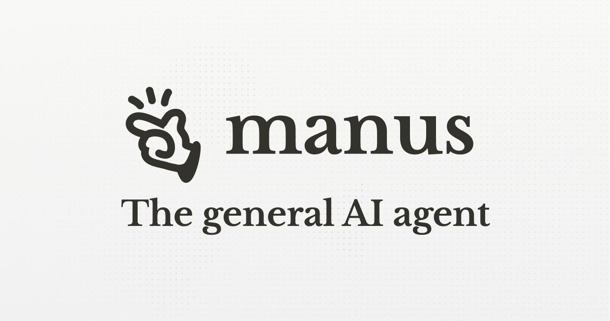{width="50%"}

## [AI Agents](https://chatgpt.com/share/688b4600-40b0-8003-975f-e2efc1732bd4)(3)

::::: columns
::: {.column width="40%"}


{width="228"}
:::

::: {.column width="60%"}
{width="90%"}
:::
:::::

## เปรียบเทียบสามระดับของ AI {.smaller}

::: {style="font-size:80%;"}
| ประเด็น | LLM | AI Workflow | AI Agent |
|------------------|------------------|------------------|-------------------|
| **การเข้าถึงข้อมูล** | ไม่มีการดึงข้อมูลภายนอก | ดึงข้อมูลจากเครื่องมือภายนอกตามเส้นทางที่กำหนด | ดึงข้อมูลจากหลายแหล่งและเลือกเครื่องมือที่เหมาะสม |
| **ผู้ตัดสินใจ** | มนุษย์ให้ prompt และเลือกใช้ผลลัพธ์ | มนุษย์กำหนดลำดับงานและปรับแก้ | โมเดลตัดสินใจเองด้วย reasoning & planning |
| **รูปแบบการทำงาน** | ตอบสนองแบบรายครั้ง | ทำตาม control logic ที่กำหนดไว้ | วางแผน → ลงมือ → สังเกตและวนซ้ำ (ReAct) |
| **ความสามารถในการปรับตัว** | ต่ำ – ไม่ปรับตามบริบท | จำกัดตามเส้นทางที่กำหนด | สูง – ปรับวิธีแก้ปัญหาได้ตามบริบท |
| **เหมาะกับ** | การสร้าง/สรุปข้อความทั่วไป | งานซ้ำ ๆ ที่ชัดเจน RAG | งานซับซ้อน ข้อมูลไม่แน่นอน ต้องการตัดสินใจหลายขั้น |
:::

## แนวโน้มความสามารถของ AI ในอนาคต

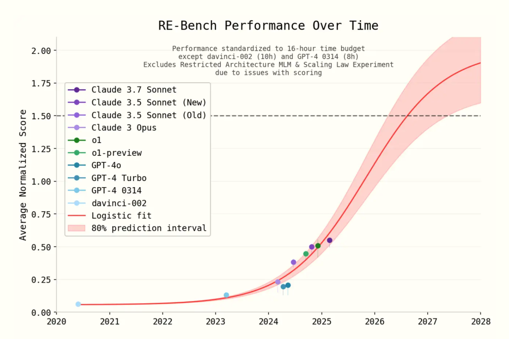{width="485"}

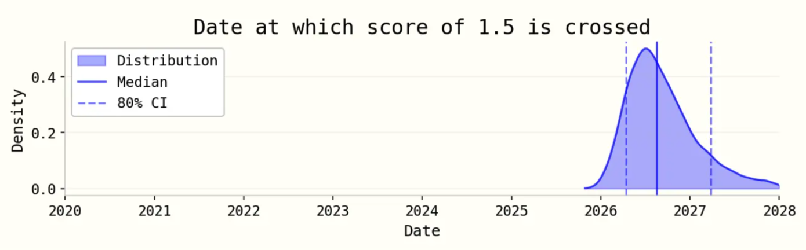{width="482"}

::: {style="font-size:40%;"}
https://ai-2027.com/research/timelines-forecast
:::

## Reference {.smaller}