# Part 1: <br>บทนำสู่ปัญญาประดิษฐ์

> AI & Data-Driven → Accelerated Discovery

<center>

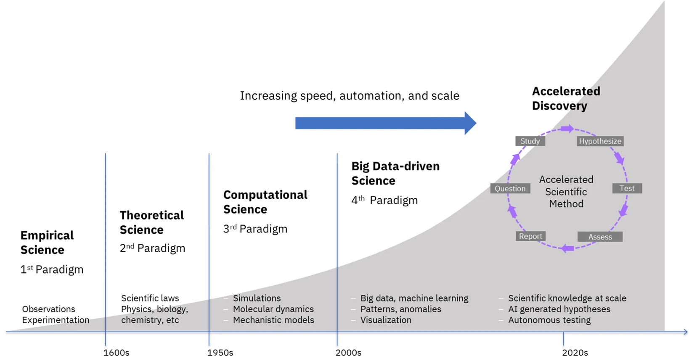{width="50%"}

</center>

## ปัญญาประดิษฐ์คืออะไร ?

-   AI เป็น**สาขาวิชา**หนึ่งในวิทยาการคอมพิวเตอร์ที่มุ่งเน้นศึกษาและพัฒนาวิธีการ/ทฤษฎี
    เพื่อสร้างโปรแกรม/เครื่องจักรที่สามารถเลียนแบบความสามารถของสมองมนุษย์

    -   การเรียนรู้ (learning)

    -   การให้เหตุผล (reasoning)

    -   การรับรู้ (perception)

    -   การแก้ปัญหา (problem solving)

    -   การปรับตัว (adaption)

## AI Ecosystem {.smaller}

<br>

{width="70%"}

## AI ไม่ได้มีแค่ ChatGPT, Gemini, Claude, ...

<br>

<center>

{width="50%"}

</center>

## ขอบเขตของ AI {.smaller}

<br>

<center>

{width="90%"}

</center>

# Part 2: AI in the Modern World


## AI in the Modern World (1) {.smaller}

> *AI ที่เรียนรู้จากข้อมูลเพื่อ “คาดการณ์” และ “จำแนก”*

:::::::::: columns
:::::: {.column width="50%"}
{width="40%"}

> ::: {style="font-size: 50%;"}
> "Using **two types of neural network** - mathematical systems for
> identifying patterns in images or data - the Al system quickly
> **learnt to identify ten features of eye disease** from highly complex
> optical coherence tomography (OCT) scans. **The system was then able
> to recommend a referral decision based on the most urgent conditions
> detected.**" ... "Al was able to make the right referral
> recommendation more than **94% of the time** ..."
> :::

::: {style="font-size: 50%;"}
-   Diabetic Retinopathy

-   Age-related Macular Degeneration

-   Glaucoma

-   Retinal Detachment

-   Optic Neuropathy
:::

:::: {style="font-size: 70%;"}
::: caption2
https://www.ucl.ac.uk/ioo/news/2018/aug/artificial-intelligence-equal-experts-detecting-eye-diseases
[-@ucl2018ai]
:::
::::
::::::

::::: {.column width="50%"}
Al system for breast cancer screening

{width="60%"} {width="70%"}

:::: {style="font-size: 50%;"}
</br>

::: caption
[@mckinney2020international]
:::
::::
:::::
::::::::::

## AI in the Modern World (2) {.smaller}

::::: columns
::: {.column width="50%"}
> *AI Classifies Students from Learning Profiles*

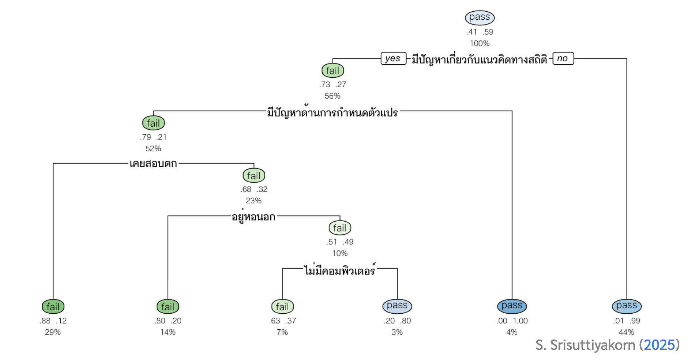

::: {style="font-size: 70%;"}

-   ใช้ ML จำแนกนักเรียนตามลักษณะการเรียนรู้ เช่น ปัญหาในการเข้าใจแนวคิดทางสถิติ
    ปัญหาในการกำหนดกรอบตัวแปรในการวิเคราะห์ ภูมิหลัง และบริบทแวดล้อมต่าง ๆ

    -   นำไปสู่การจัดกลุ่มนักเรียนที่แตกต่างกัน

    -   ทำความเข้าใจปัจจัยที่เป็นปัญหาหรือปัจจัยสนับสนุนของนักเรียนแต่ละบุคคล

:::

:::

::: {.column width="50%"}
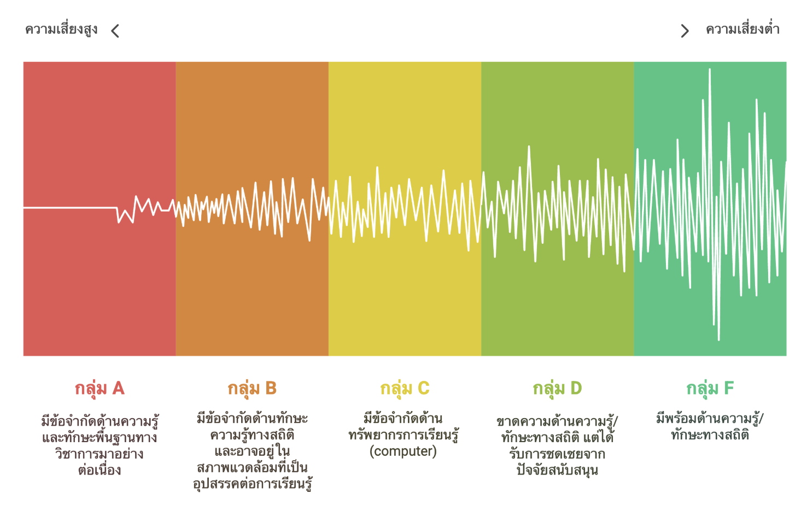{width="80%"}

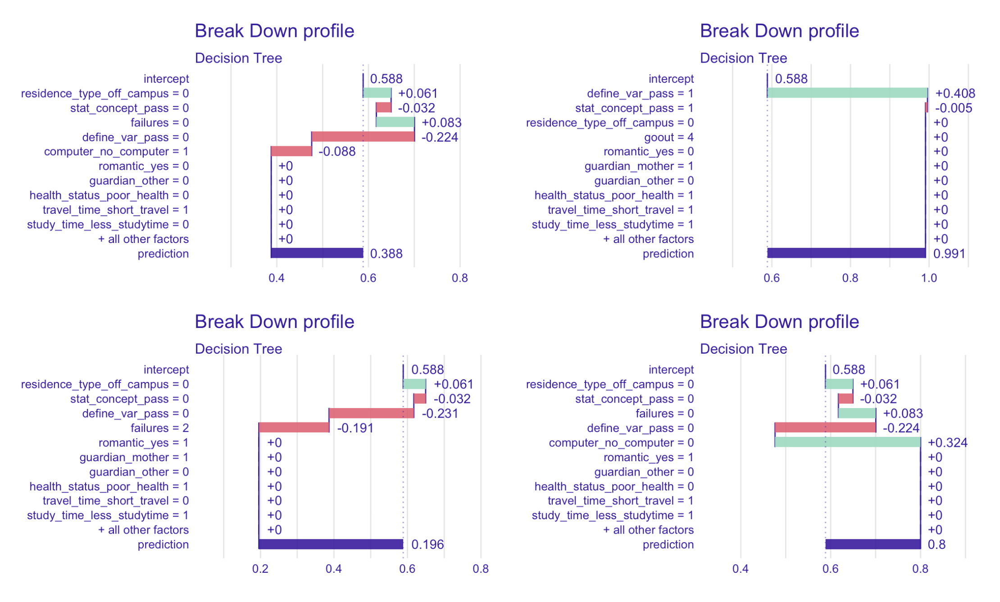{width="80%"}
:::
:::::

## AI in the Modern World (3) {.smaller}

> AI สกัดโครงสร้างแนวคิดจากเอกสารอ้างอิงเพื่อพัฒนา Programme Learning Outcomes
> (PLOs)

<p style="font-size: 60%;">

-   LLMS สกัดวลี คำที่เป็นมโนทัศน์สำคัญที่เกี่ยวข้องกับสมรรถนะของบัณฑิตครู
    จากเอกสารที่เกี่ยวข้อง

-   ML วิเคราะห์ความสัมพันธ์ระหว่างมโนทัศน์ต่าง ๆ เพื่อจัดกลุ่มและสร้างโครงสร้างแนวคิด
    (Conceptual Framework) ที่สอดคล้องกับสมรรถนะของบัณฑิตครู

</p>

<left> 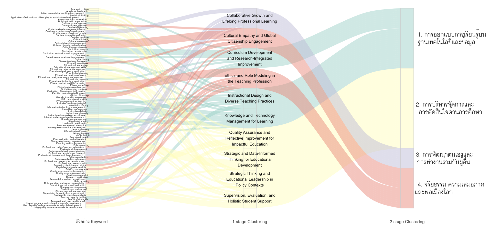{width="50%"}

::: caption1
สิวะโชติ และคณะ (2568)
:::

## AI in the Modern World (4) {.smaller}

> AI เรียนรู้ความหมายและไวยกรณ์ภาษา

::::: columns
::: {.column width="50%"}
<p style="font-size: 60%;">

-   ระบบตรวจ Grammar แบบ Rule-based + ML (ดั้งเดิม)

-   Deep Learning ช่วยให้เข้าใขจบริบทของประโยคได้ดีขึ้น ผ่านโครงข่ายประสาทเทียม

-   LLM: ช่วยเสนอคำแนะนำในการเขียน (rephrasing, tone, suggesting, ...)

-   Workflow Agent (GrammarlyGO): ใช้ LLMs
    เป็นสมองและเพิ่มความสามารถด้านความจำ การวางแผนและให้เหตุผล
    และการทำงานต่อเนื่องอัตโนมัติ

</p>
:::

::: {.column width="50%"}
<center>

{width="100%"}

</center>
:::
:::::

## AI in the Modern World (6) {.smaller}

::::::: columns
::: {.column width="50%"}
<p style="font-size: 20%;">

-   AI chatbot ที่ออกแบบมาเพื่อเป็น “copilot” ด้านสุขภาพจิต

-   **LLM-based dialogue** ทำหน้าที่เป็นสมอง
    เพื่อสร้างคำตอบที่มีความต่อเนื่องทางอารมณ์ (emotional coherence)
    และสอดคล้องกับแนวทางของ CBT (Cognitive Behavioral Therapy)

    -   สรุปใจความของการสนทนา

    -   ตั้งคำถามสะท้อนกลับ

    -   ใหัคำแนะนำตามหลักการ CBT

-   **AI Agent**

    -   มี memory system เก็บประวัติสุขภาพจิตของผู้ใช้ (อารมณ์ เหตุการณ์
        และคำแนะนำก่อนหน้า)

    -   autonomous action loop: ประเมินอารมณ์ ตอบโต้ แนะนำ ติดตามผล
        และปรับแผน

</p>
:::

::::: {.column width="50%"}
{width="65%"}

::: caption2
https://woebothealth.com/[-@woebothealth2025]
:::

{width="70%"}

::: caption3
https://www.youper.ai/how-it-works
:::
:::::
:::::::

## AI in the Modern World (7) {.smaller}

{width="40%"}

# Part 3: Basic Concepts and Terminology of Modern AI {.smaller}

-   Generative AI

-   LLMs

-   LLM Function-Calling

-   Retrieval-Augmented Generation (RAG)

-   AI Workflow

-   AI Agent

## Generative AI: What It Is and Why It Matters {.smaller}

<br>

::::::::: columns
::::::: {.column width="60%"}
::: {.fragment .fade-in style="font-size:80%;"}
**Generative AI** คือระบบปัญญาประดิษฐ์ที่สามารถสร้างข้อมูลใหม่ เช่น ข้อความ รูปภาพ
เสียง โค้ด หรือวิดีโอ โดยอิงจากรูปแบบ (*patterns*) และโครงสร้าง (*structures*)
ที่เรียนรู้จากข้อมูลจำนวนมาก
:::

::: {.fragment .fade-in style="font-size:80%;"}
กระบวนการสร้างไม่ได้เกิดจากการสุ่ม แต่เป็นการ **คำนวณทางสถิติ**\
เพื่อหา “ผลลัพธ์ที่มีความเป็นไปได้สูงสุด” ภายใต้บริบทที่กำหนด
:::

::: {.fragment .fade-in style="font-size:80%;"}
การสร้างเนื้อหาต้องอาศัย:

-   **Context**: บริบท เช่น ข้อความก่อนหน้า หรือข้อมูลแวดล้อม
-   **Prompt**: คำกระตุ้นที่ระบุภารกิจ รูปแบบ หรือเจตนาของผู้ใช้
:::

::: {.fragment .fade-in style="font-size:80%;"}
ผลลัพธ์ที่ได้จึงไม่ใช่ “ของใหม่โดยสมบูรณ์” (original content)
แต่เป็นการจัดเรียงองค์ประกอบใหม่ตามความน่าจะเป็นของการเกิดร่วมกันของคำหรือพิกเซล ที่
คล้ายคลึงกับสิ่งที่เคยเรียนรู้มา
แต่มีความยืดหยุ่นและสร้างสรรค์เพียงพอที่จะใช้งานในหลากหลายบริบท และตรงตามวัตถุประสงค์
:::
:::::::

::: {.column width="40%"}

:::
:::::::::

## Large Language Models (LLMs) {.smaller}

-   LLMs เป็นโมเดลพื้นฐาน (foundation models) ของ Generative AI

-   เรียนรู้จากข้อมูลขนาดใหญ่ เพื่อเข้าใจความหมายและความสัมพันธ์
    โครงสร้างของภาษาและข้อมูลหลายรูปแบบ

-   เป็นสมองของระบบ AI สมัยใหม่ ช่วยให้ AI เข้าใจ ให้เหตุผล
    และสร้างคำตอบใหม่ได้อย่างสอดคล้องกับบริบท

-   เป็นรากฐานของระบบ Generative AI เกือบทั้งหมดในปัจจุบัน

::: {style="font-size:80%;"}
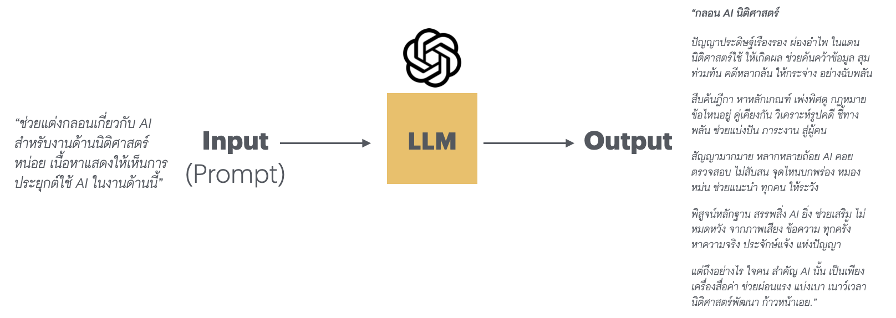
:::

## LLM Adaptation Methods {.smaller}

ผู้ใช้สามารถปรับแต่งการทำงานของ LLMs ให้เหมาะกับงานเฉพาะทางได้หลายวิธี

-   Prompt Design/Engineering

-   Function-Calling

-   AI Workflow

-   Retrieval-Augmented Generation (RAG)

-   AI Agent

-   Fine-Tuning

## Prompt Design {.smaller}

> "คุณภาพของ prompt ส่งผลต่อคุณภาพของผลลัพธ์"

::::: columns
::: {.column width="50%"}

:::

::: {.column width="50%"}
-   **1. กำหนดปัญหา** -- เข้าใจโจทย์ให้ชัดก่อนจะเริ่มเขียน prompt

    -   วิเคราะห์และระบุให้ได้ว่าต้องการให้ AI ช่วยอะไร

    -   ระบุประเภทของงาน เช่น สรุป เขียน วิเคราะห์ แปล ประเมิน ...

    -   ระบุ context ที่จำเป็น

-   **2. ออกแบบ prompt** -- สร้างคำสั่งที่อธิบายปัญหาให้ AI เข้าใจได้ดีที่สุด

-   **3. ประเมิน output และโต้ตอบกับโมเดล** -- เพื่อปรับปรุงผลลัพธ์ให้ถูกต้อง
    และตรงความต้องการ
:::
:::::

## LLM Function-Calling {.smaller}

<p style="font-size: 50%;">

-   ฟังก์ชันการเรียกใช้งาน (function-calling) ช่วยให้ LLMs สามารถโต้ตอบกับ API
    หรือบริการภายนอกได้

-   ช่วยให้ LLMs สามารถเชื่อมต่อ และสั่งการเครื่องมือภายนอกได้ระหว่างสนทนา

</p>

::::: columns
::: {.column width="50%"}
<center>

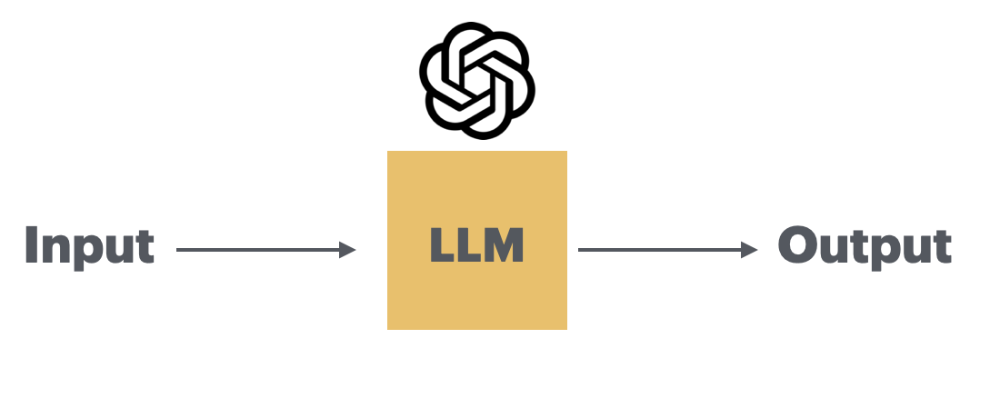{width="80%"}

{width="80%"}

</center>
:::

::: {.column width="50%"}
{width="80%"}

{width="80%"}
:::
:::::

## LLM Function-Calling {.smaller}

::::: columns
::: {.column width="50%"}
<center></center>
:::

::: {.column width="50%"}

:::
:::::

## LLM Function-Calling {.smaller}

::::: columns
::: {.column width="50%"}
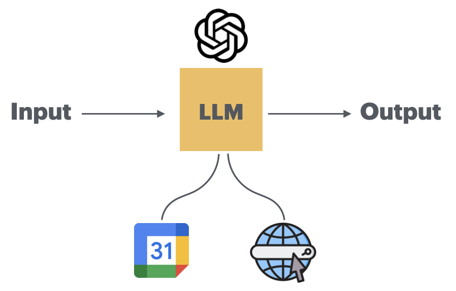
:::

::: {.column width="50%"}

:::
:::::

## Retrieval-Augmented Generation (RAG) {.smaller}

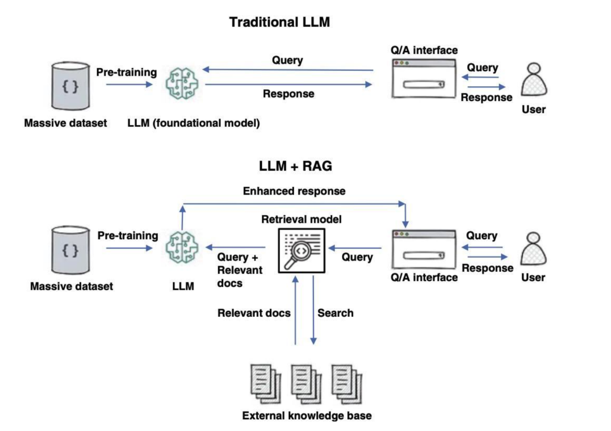

## Retrieval-Augmented Generation (RAG) {.smaller}

::::: columns
::: {.column width="50%"}
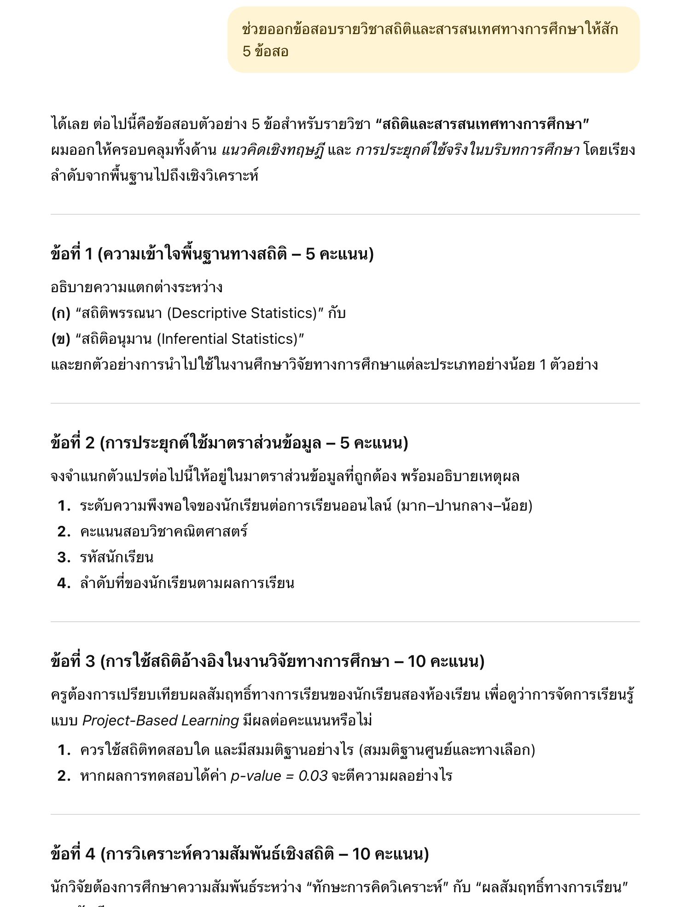{width="75%"}
:::

::: {.column width="50%"}
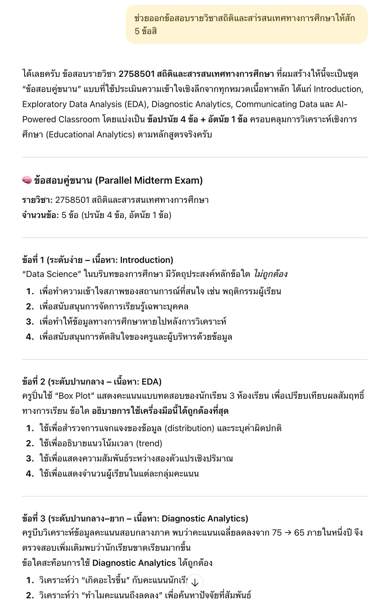{width="75%"}
:::
:::::

## AI Workflow {.smaller}

-   กระบวนการอัตโนมัติที่มนุษย์ออกแบบลำดับขั้นตอนไว้ล่วงหน้า

-   มีการใช้ AI เช่น LLMs ในบางขั้นตอนของกระบวนการ เพื่อประมวลผลตามที่มนุษย์กำหนด
    แต่ไม่ได้ให้สิทธิ์ AI ในการตัดสินใจเอง กล่าวคือ
    **ไม่สามารถทำงานนอกเหนือจากเส้นทางที่กำหนด**

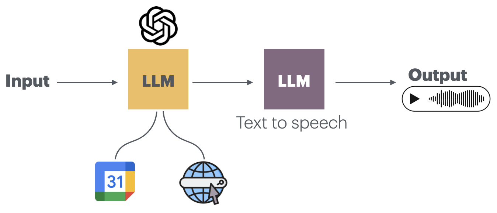

## AI Workflow {.smaller}

::::: columns
::: {.column width="60%"}
<p style="font-size: 50%;">

-   AI Workflow สามารถจำลองกระบวนการตัดสินใจของมนุษย์

    -   Cognitive Analogy -- LLM สมองของกระบวนการ

    -   Decision Flow -- กระบวนการทำงาน/ตัดสินใจต่อเนื่อง

    -   Automation -- ดำเนินงานแทนมนุษย์โดยอัตโนมัติ

</p>

{width="90%"}
:::

::: {.column width="40%"}
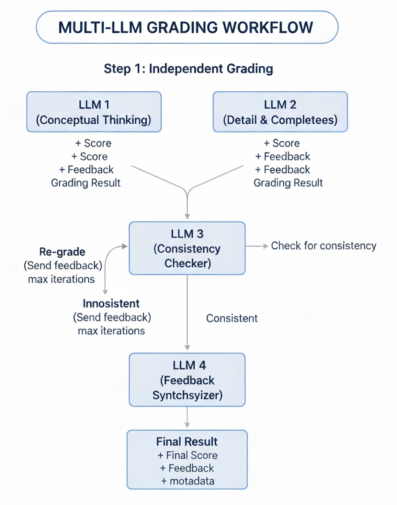
:::
:::::

## AI Workflow {.smaller}

:::::: columns
::: {.column width="30%"}
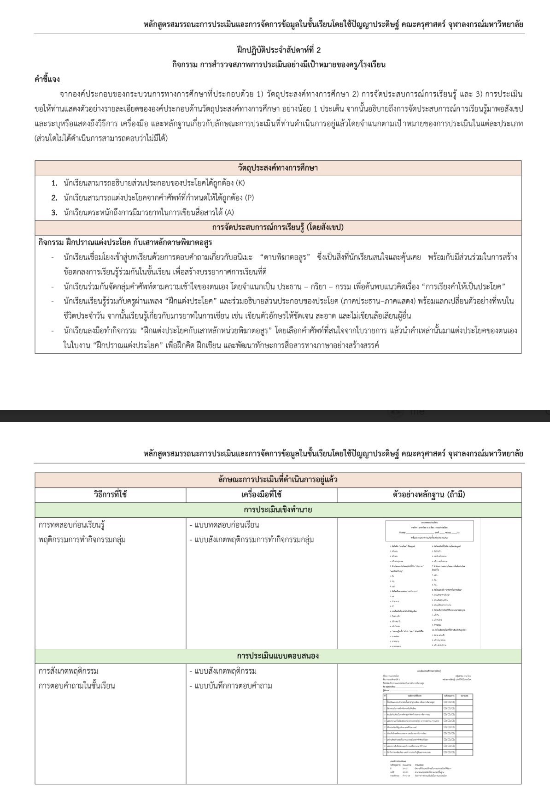
:::

::: {.column width="30%"}
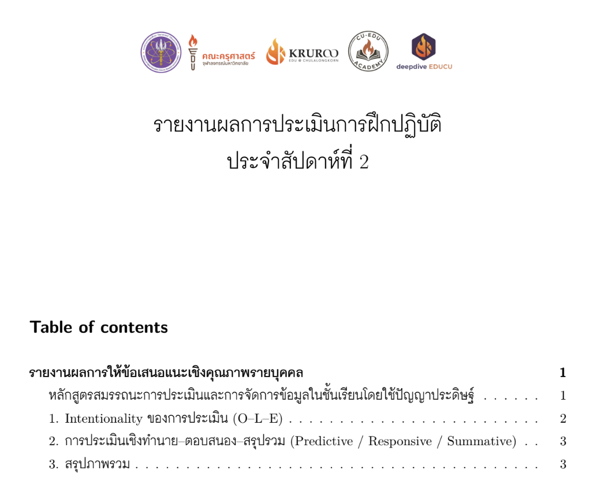

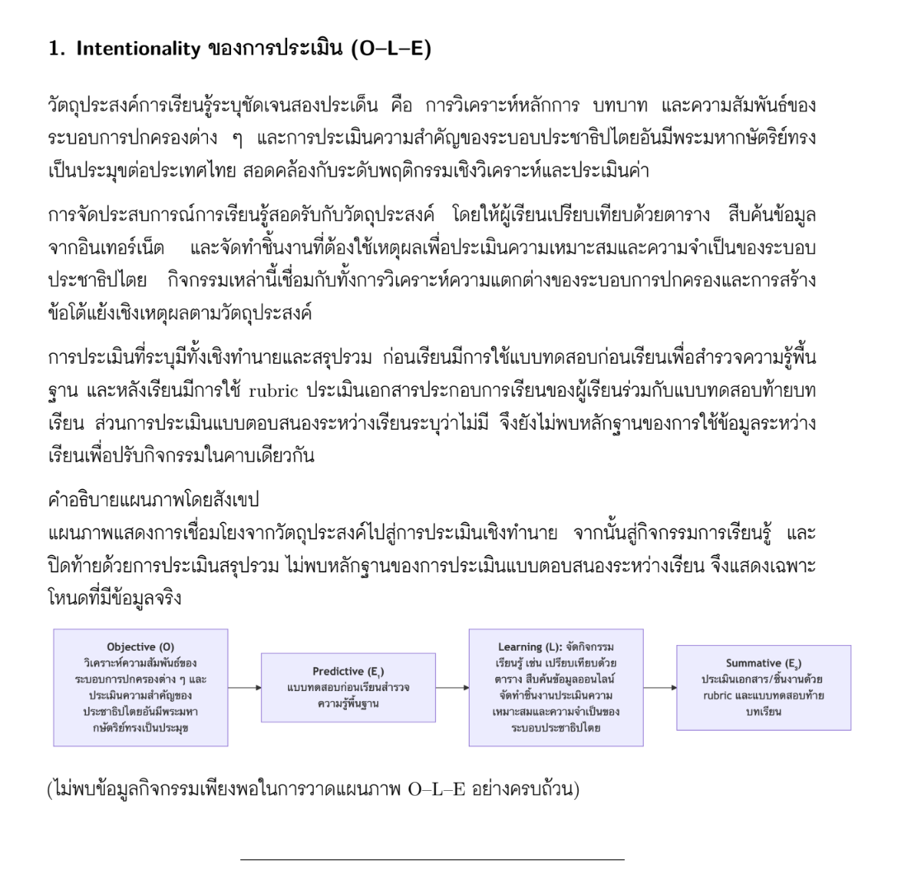
:::

::: {.column width="40%"}
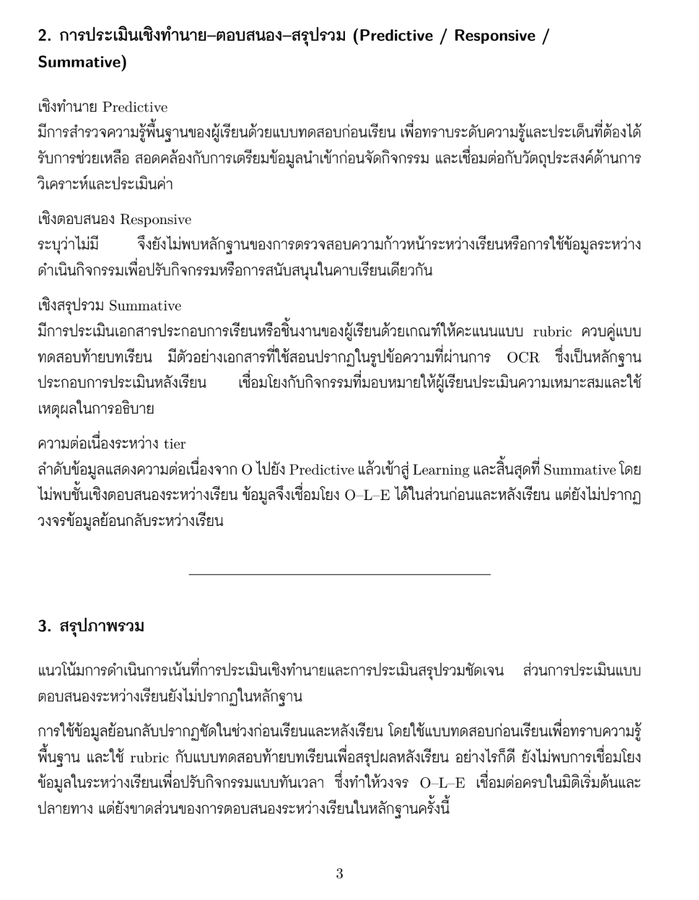
:::
::::::

## AI Agent {.smaller}

-   ระบบซอฟต์แวร์ ที่ถูกออกแบบให้ “รับรู้” สภาพแวดล้อม (environment) แล้ว “กระทำ”
    (action) เพื่อบรรลุเป้าหมาย (goal) ที่ตั้งไว้ล่วงหน้า

-   มนุษย์มีบทบาทแค่บอกเป้าหมาย/ผลลัพธ์ที่อยากได้เท่านั้น ที่เหลือ AI Agent
    จะทำการคิดให้เหตุผล ดำเนินการและควบคุมการดำเนินการจนบรรลุเป้าหมายเอง

::::: columns
::: {.column width="40%"}
{width="90%"}
:::

::: {.column width="60%"}
AI Agent มักมีองค์ประกอบได้แก่

-   เป้าหมาย (Goal)

-   การรับรู้ (Perception)

-   การวางแผนและตัดสินใจ (Planning & Decision Making)

-   การกระทำ (Action)

-   การเรียนรู้และปรับปรุง (Learning & Adaptation)
:::
:::::

## AI Agent {.smaller}

<p style="font-size: 30%;">

-   [ChatGPT Agent](https://openai.com/index/introducing-chatgpt-agent/)

-   Claude + Extended Thinking + Connectors

-   [Manus](https://manus.im/)

-   [Comet](https://www.perplexity.ai/comet)

</p>

## Manus Agent {.smaller}

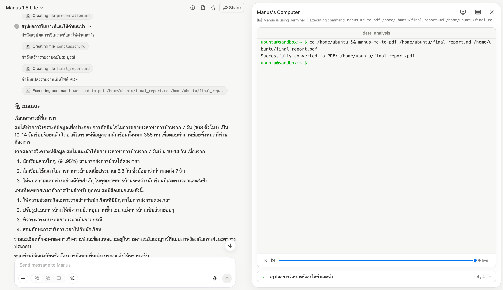

## ChatGPT Agent {.smaller}

::::: columns
::: {.column width="30%"}
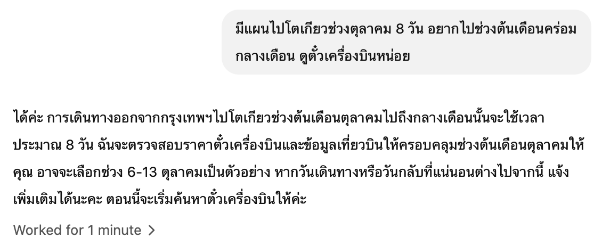{width="100%"}

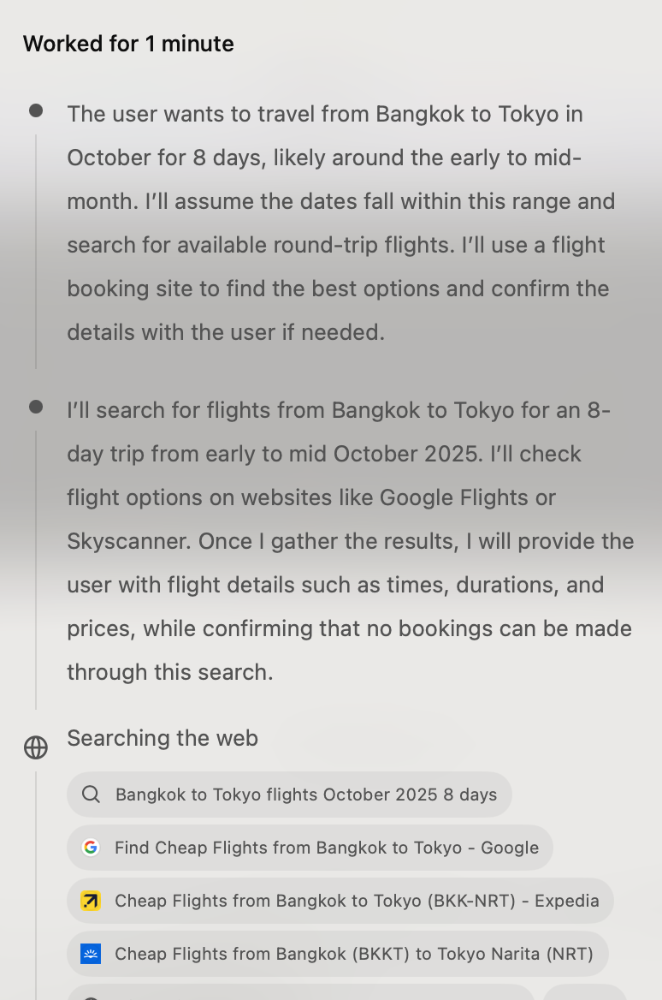{width="60%"}
:::

::: {.column width="70%"}
[{width="60%"}](https://chatgpt.com/share/688b4600-40b0-8003-975f-e2efc1732bd4)
:::
:::::

## Comet Agent

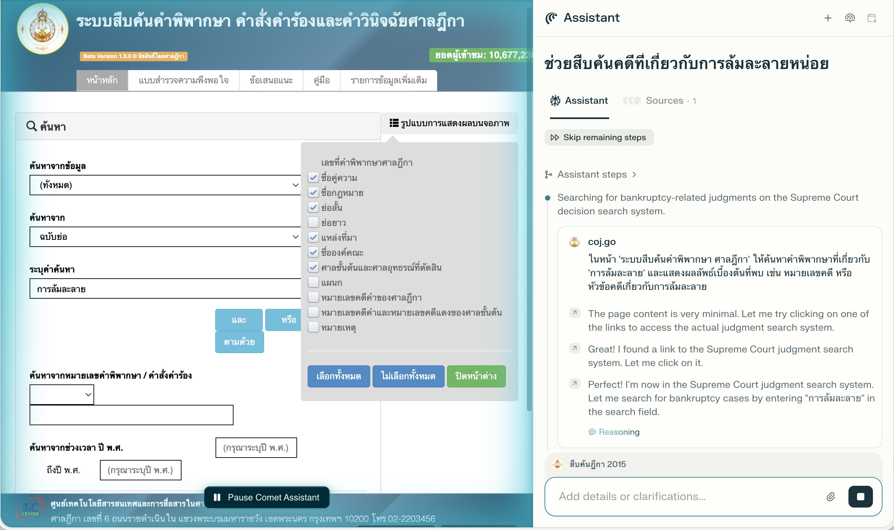

# Part 4: AI Adoption to Pedagogical Transformation {.smaller}

## ใช้ AI แล้วเปลี่ยนอะไร ??

-  ใช้ AI ≠ เปลี่ยนการสอนเสมอไป

- บางครั้ง AI ทำให้ “เร็วขึ้น/สวยขึ้น/สะดวกขึ้น” แต่ *การเรียนรู้ของเด็กไม่เปลี่ยน*

> แล้วเราจะพิจารณาได้ยังไงว่า การนำ AI มาใช้ในชั้นเรียนจะช่วยเปลี่ยนแปลงการเรียนรู้ของเด็กได้จริง ??

## กรอบ SAMR: การประเมินผลกระทบของเทคโนโลยีต่อการเรียนรู้ {.smaller}

{width="70%"}

## กรอบ SAMR: การประเมินผลกระทบของเทคโนโลยีต่อการเรียนรู้ {.smaller}

- S: Substitution (การทดแทน) -- นำเทคโนโลยีมาใช้แทนเครื่องมือเดิม โดยไม่มีการเปลี่ยนแปลงกระบวนการทำงานหรือวิธีคิด (งานเดิม)

- A: Augmentation (การเพิ่มประสิทธิภาพ) -- ใช้เทคโนโลยีเพื่อปรับปรุงกระบวนการให้ดีขึ้นมีประสิทธิภาพมากขึ้นแต่ยังคงรูปแบบเดิม (งานดีขึ้น เร็วขึ้น ง่ายขึ้น)

> S + A = Enhancement (การยกระดับเพิ่มประสิทธิภาพของงานเดิม)

- M: Modification (การปรับเปลี่ยน) -- ใช้เทคโนโลยีเพื่อเปลี่ยนแปลงกระบวนการทำให้เกิดรูปแบบใหม่ (ปรับกระบวนการ)

- R: Redefinition (การนิยามใหม่) -- ใช้เทคโนโลยีเพื่อสร้างกิจกรรมหรือกระบวนการที่ไม่สามารถทำได้ก่อนหน้านี้ (เกิดงานใหม่ กระบวนการใหม่ที่แบบเดิมทำไม่ได้)

> M + R = Transformation (การเปลี่ยนแปลงรูปแบบการทำงานหรือการเรียนรู้)


## ตัวอย่างการใช้ AI ในชั้นเรียนตามกรอบ SAMR {.smaller}

{width="50%"}


# Part 4: เริ่มใช้ Generative AI และ Prompt 101

## ChatGPT {.smaller}

:::::: columns
:::: {.column width="50%"}
::: {style="font-size:90%;"}
1.  เข้าไปที่เว็บไซต์ [chat.openai.com](chat.openai.com)
2.  ลงทะเบียนหรือเข้าสู่ระบบ
3.  เลือกโมเดลที่ต้องการใช้
4.  ลองพิมพ์คำถามหรือคำสั่งในช่องข้อความ
5.  ตรวจสอบคำตอบที่ได้รับ ปรับปรุง และนำผลลัพธ์ไปใช้

{width="605"}
:::
::::

::: {.column width="50%"}
<br>

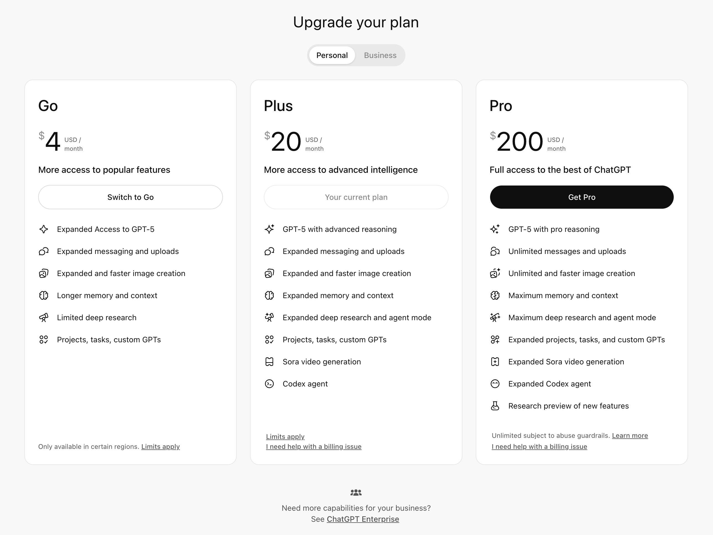
:::
::::::

## ChatGPT {.smaller}

:::::: columns
:::: {.column width="50%"}
::: {style="font-size:90%;"}
1.  เข้าไปที่เว็บไซต์ [chat.openai.com](chat.openai.com)
2.  ลงทะเบียนหรือเข้าสู่ระบบ
3.  เลือกโมเดลที่ต้องการใช้
4.  ลองพิมพ์คำถามหรือคำสั่งในช่องข้อความ
5.  ตรวจสอบคำตอบที่ได้รับ ปรับปรุง และนำผลลัพธ์ไปใช้

{width="605"}
:::
::::

::: {.column width="50%"}
<br> <br>

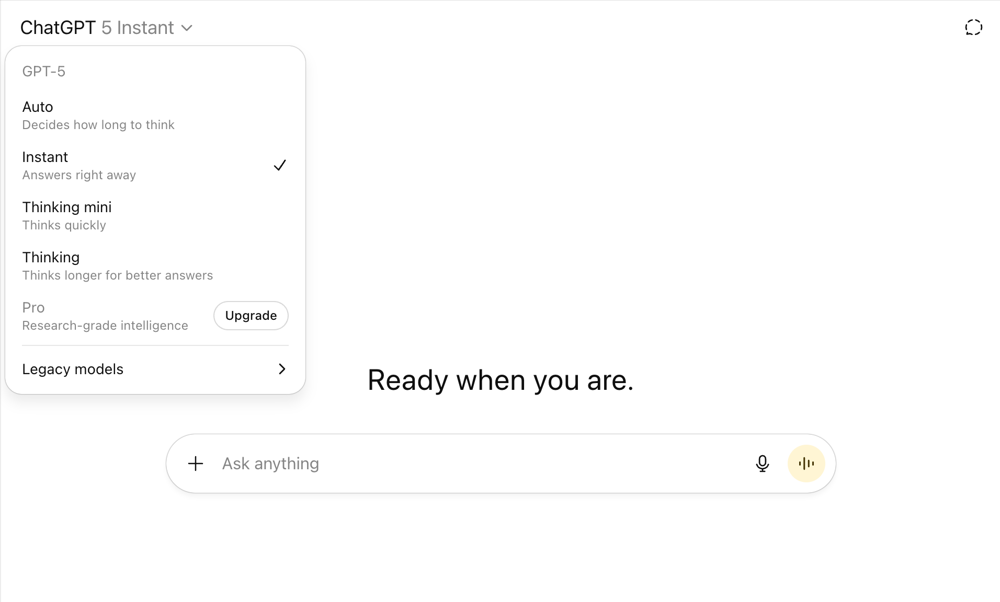
:::
::::::

## ChatGPT {.smaller}

:::::: columns
:::: {.column width="50%"}
::: {style="font-size:90%;"}
1.  เข้าไปที่เว็บไซต์ [chat.openai.com](chat.openai.com)
2.  ลงทะเบียนหรือเข้าสู่ระบบ
3.  เลือกโมเดลที่ต้องการใช้
4.  ลองพิมพ์คำถามหรือคำสั่งในช่องข้อความ
5.  ตรวจสอบคำตอบที่ได้รับ ปรับปรุง และนำผลลัพธ์ไปใช้

{width="605"}
:::
::::

::: {.column width="50%"}
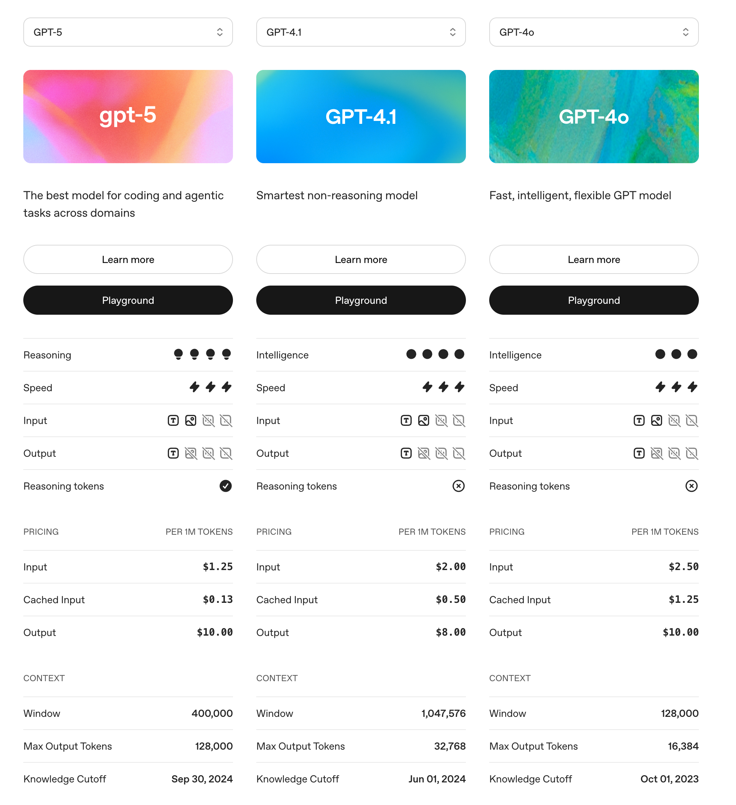
:::
::::::

## ChatGPT {.smaller}

<left>

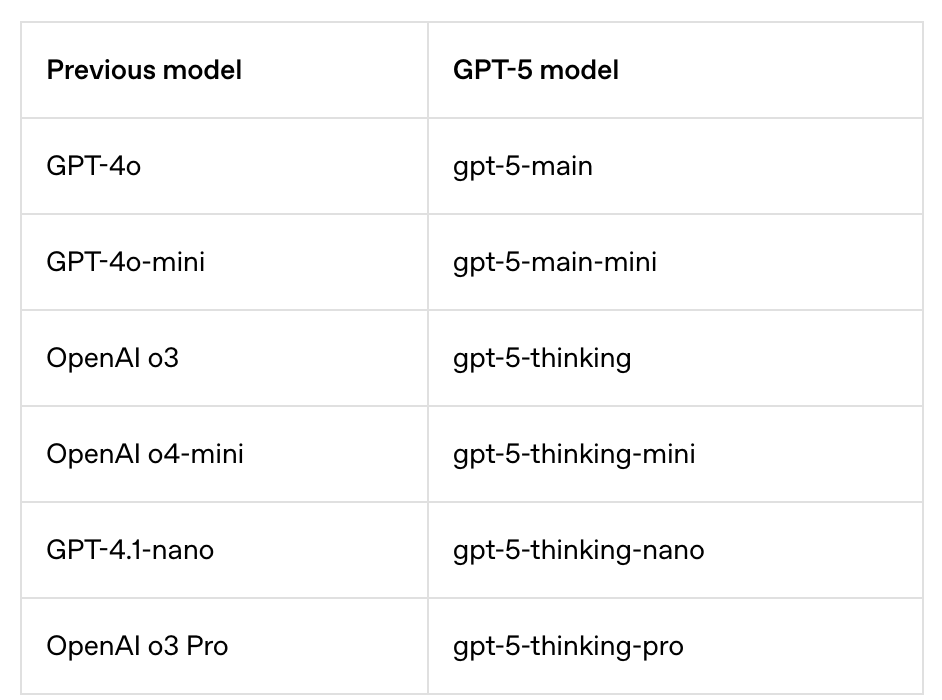{width="60%"} </left>

::: caption3
https://openai.com/index/introducing-gpt-5/
:::

## กิจกรรมลองใช้ ChatGPT

<p style="font-size: 80%;">

สถานการณ์: ครู A จัดการเรียนรู้ให้กับนักเรียนในหัวข้อ สถิติในชีวิตประจำวัน 
โดยมีวัตถุประสงค์การเรียนรู้ในหัวข้อนี้คือ

> “นักเรียนสามารถตีความข้อมูลเชิงสถิติและสื่อสารข้อสรุปได้อย่างมีเหตุผลและตรวจสอบได้”

เมื่อจบการบรรยาย ครูมอบหมายให้นักเรียนดำเนินการกำหนดประเด็นปัญหา ออกแบบการเก็บรวบรวมข้อมูล วิเคราะห์ และเขียนรายงานเพื่อนำเสนอข้อสรุปที่ได้ ทั้งนี้ครูอนุญาตให้นักเรียนใช้ ChatGPT เพื่อเป็นเพื่อนคู่คิด และตรวจทานรายงานก่อนส่งรายงานฉบับสุดท้าย

ถ้าครู A ต้องการออกแบบเกณฑ์การประเมินผลที่เหมาะสม โดยใช้ ChatGPT เป็นผู้ช่วยคิด ครู A ควรใช้ prompt อย่างไร

</p>

## กิจกรรมลองใช้ ChatGPT: Prompt แบบที่ 1

::: {style="font-size:80%;"}

ช่วยสร้างเกณฑ์การประเมินเพื่อให้คะแนนรายงานเรื่องสถิติในชีวิตประจำวันของนักเรียนให้หน่อย

:::

## กิจกรรมลองใช้ ChatGPT: Prompt Design แบบที่ 2

::: {style="font-size:80%;"}

ช่วยออกแบบเกณฑ์การประเมินรายงานในหัวข้อ สถิติในชีวิตประจำวัน โดยการทำรายงานนี้ของนักเรียน มีวัตถุประสงค์การเรียนรู้คือ "นักเรียนสามารถตีความข้อมูลเชิงสถิติและสื่อสารข้อสรุปได้อย่างมีเหตุผลและตรวจสอบได้"

ลักษณะงานประกอบด้วยการ ให้นักเรียนดำเนินการกำหนดประเด็นปัญหา ออกแบบการเก็บรวบรวมข้อมูล วิเคราะห์ และเขียนรายงานเพื่อนำเสนอข้อสรุปที่ได้ ทั้งนี้ครูอนุญาตให้นักเรียนใช้ ChatGPT เพื่อเป็นเพื่อนคู่คิด และตรวจทานรายงานก่อนส่งรายงานฉบับสุดท้าย

ขอให้กำหนดเกณฑ์ที่สะท้อนในลักษณะ analytical rubric  โดยพิจารณาใน 2 ประเด็นหลัก ได้แก่

- ประเด็นของการประเมิน

- ระดับคุณภาพของรายงานในแต่ละประเด็น

:::


## ปัญหา Hallucination {.smaller}

<left> {width="45%"} </left>

<br>

AI hallucination หมายถึงกรณีที่ระบบปัญญาประดิษฐ์ (AI) สร้างเนื้อหาหรือคำตอบที่
**ไม่ได้อิงจากข้อมูลจริงหรือข้อมูลที่ได้รับมา** ซึ่งอาจทำให้ AI สร้างข้อมูลที่**ไม่ถูกต้อง
นำไปสู่ความเข้าใจผิด หรือแต่งขึ้นทั้งหมด** ซึ่งอาจก่อให้เกิดปัญหาในหลายบริบทของการใช้งาน

-   **สร้างข้อมูลเท็จโดยสิ้นเชิง (total fabrication)** --
    สร้างแก่นของเรื่องราวที่ไม่มีอยู่จริงขึ้นมาทั้งหมด เช่น อ้างอิงหลักฐานข้อมูลผิด ให้เหตุผลผิด
    นำไปสู่การสร้างข้อสรุปผิด

-   **ผสมผสานระหว่างข้อมูลจริงและเท็จ (mixing true & false)** --
    หลักการโดยรวมถูกต้อง แต่อาจยกตัวอย่างหรือหลักฐานข้อมูลประกอบที่ไม่มีอยู่จริง

-   **สรุปความเกินจริง (faulty inference)** -- ข้อมูลตั้งต้นถูก
    แต่ข้อสรุปตีความเกินขอบเขตการอ้างอิงของข้อมูล

## ปัจจัยที่มีผลต่อความถูกต้อง/เหมาะสมของผลลัพธ์ {.smaller}

::: {style="font-size:85%;"}
-   **Model**

    -   พื้นความรู้เดิม (Knowledge Base) โมเดลถูก train มาด้วยข้อมูลอะไรบ้าง สิ้นสุด
        ณ ตอนไหน มีความเป็นปัจจุบันมากน้อยแค่ไหน

    -   สถาปัตยกรรมของโมเดล

    -   ขนาดและความสามารถในการให้เหตุผล
        โมเดลขนาดใหญ่มักมีความสามารถในการคิดเชิงเหตุผล หรือคิดในปัญหาซับซ้อนได้ดีกว่า

    -   การปรับจูนเฉพาะทาง (Fine-tuning) ช่วยให้โมเดลเข้าใจบริบทเฉพาะทางได้ดีขึ้น

-   **Prompt**

    -   กระบวนการกระตุ้นเพื่อให้ LLM แสดงผลลัพธ์ตามที่ต้องการ

    -   Prompt ชัดเจน ไม่กำกวม และบอกสิ่งที่ต้องการอย่างละเอียด จะได้ผลลัพธ์ที่ดีกว่า

    -   เทคนิคการ Prompt ที่แตกต่างกันอาจให้ผลลัพธ์แตกต่างกันไปด้วย
        (อาจไม่จริงเสมอไปโดยเฉพาะกับโมเดลขนาดใหญ่ที่มีประสิทธิภาพสูง เช่น gpt-o1,
        gpt-o3)

-   **Context**

    -   ข้อมูลแวดล้อมที่ป้อนเข้าไปพร้อมกับ Prompt เช่น เนื้อหาจากเอกสาร,
        บทสนทนาก่อนหน้า, หรือข้อมูลเฉพาะที่โมเดลไม่เคยรู้มาก่อน

    -   กระบวนการจัดหา Context ที่ถูกต้องก็เป็นปัจจัยที่มีผลด้วย
:::

# Part 5: Prompt Design

> "คุณภาพของ prompt ส่งผลต่อคุณภาพของผลลัพธ์"

## Prompt Design:  {.smaller}

:::: {columns}

::: {.column width="35%"}

```{r echo = F, eval = F}
library(DiagrammeR)
library(DiagrammeRsvg)
library(rsvg)

# สร้าง flowchart แบบแยก 2 ส่วน
create_prompt_flowchart <- function() {
  
  grViz("
  digraph prompt_workflow {
    
    # กำหนด style ทั่วไป
    graph [rankdir=TB, bgcolor=white, fontname='Arial', splines=ortho]
    node [shape=rectangle, style='rounded,filled', fillcolor=white, 
          fontcolor=black, color=black, penwidth=1.5, fontname='Arial']
    edge [color=black, penwidth=1.5, arrowhead=vee, fontname='Arial']
    
    # กำหนด subgraph สำหรับ Prompt Design
    subgraph cluster_design {
      label = 'Prompt Design'
      fontsize = 16
      fontcolor = black
      style = 'rounded'
      color = black
      penwidth = 2
      
      # Nodes for Prompt Design
      D1 [label='Define Task & Goal']
      D2 [label='Ideate & Draft Prompt']
      D3 [label='Prompt']
      D4 [label='Satisfied?\\nOutput?', shape=diamond]
      D5 [label='Final Output']
      
      # Edges for Prompt Design
      D1 -> D2
      D2 -> D3
      D3 -> D4
      D4 -> D5 [label='Yes']
      D4 -> D3 [label='No', constraint=false]
    }
    
    # กำหนด subgraph สำหรับ Prompt Engineering
    subgraph cluster_engineering {
      label = 'Prompt Engineering'
      fontsize = 16
      fontcolor = black
      style = 'rounded'
      color = black
      penwidth = 2
      
      # Nodes for Prompt Engineering
      E1 [label='Define Task, Goal & Metrics']
      E2 [label='Evaluation & Refinement Loop', 
          shape=rectangle, style='rounded,filled,dashed']
      E3 [label='Run Prompt on\\nTest Cases']
      E4 [label='Evaluate Output\\n(Metrics)', shape=diamond]
      E5 [label='Log Results &\\nIdentify Failures']
      E6 [label='Optimize Prompt?', shape=diamond]
      E7 [label='Refined Prompt']
      E8 [label='Final Prompt']
      E9 [label='Output']
      
      # การจัดลำดับ nodes
      E1 -> E2 [style=invis]
      E2 -> E3
      E3 -> E4
      E4 -> E5 [label='Pass']
      E4 -> E6 [label='Fail']
      E5 -> E6
      E6 -> E7 [label='Yes']
      E7 -> E3 [constraint=false]
      E6 -> E8 [label='No']
      E8 -> E9
    }
    
    # จัดตำแหน่งให้ 2 cluster อยู่ข้างกัน
    {rank=same; D1; E1}
  }
  ")
}

# สร้างแผนภาพ
diagram <- create_prompt_flowchart()

diagram %>% 
  export_svg() %>%
  charToRaw() %>%
  rsvg_png("prompt_design_workflow.png")

```

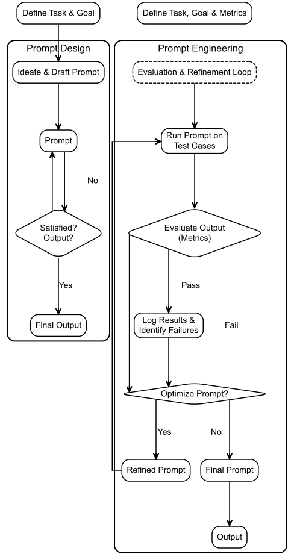{width="80%"}

:::

::: {.column width="55%"}

::: {style="font-size:90%;"}

-   **1. กำหนดปัญหา** -- เข้าใจโจทย์ให้ชัดก่อนจะเริ่มเขียน prompt

    -   วิเคราะห์และระบุให้ได้ว่าต้องการให้ AI ช่วยอะไร

    -   ระบุประเภทของงาน เช่น สรุป เขียน วิเคราะห์ แปล ประเมิน 

    -   ระบุ context ที่จำเป็น

-   **2. ออกแบบ prompt** -- สร้างโครงสร้างคำสั่งที่มีขั้นตอนการแบ่งส่วนที่ชัดเจน

    -   ข้อเท็จจริง --> สิ่งที่ต้องการ --> เงื่อนไข/หลักการอ้างอิง
    
    -   ใช้ตัวคั่น (separators) เช่น ###, --- เพื่อแยกส่วนต่าง ๆ
    
    -   ใช้ภาษาชัดเจน มีวัตถุประสงค์/เจตนาชัดเจน เช่น ช่วยวิเคราะห์ ช่วยประเมิน ช่วยจัดกลุ่ม ช่วยให้ข้อเสนอแนะ .... โดยใช้หลักการ ....

-   **3. ประเมิน output และโต้ตอบกับโมเดล**

    - ตรวจสอบ output ที่ได้รับเสมอ

    - feedback loop

:::

:::
:::::

## เทคนิคการออกแบบ Prompt : In-Context Learning Strategy

-   Template Design

-   Zero-Shot Prompting

-   One-Shot Prompting

-   Few-Shot Prompting

-   Chain-of-Thought

## Template Design {.smaller}

<center>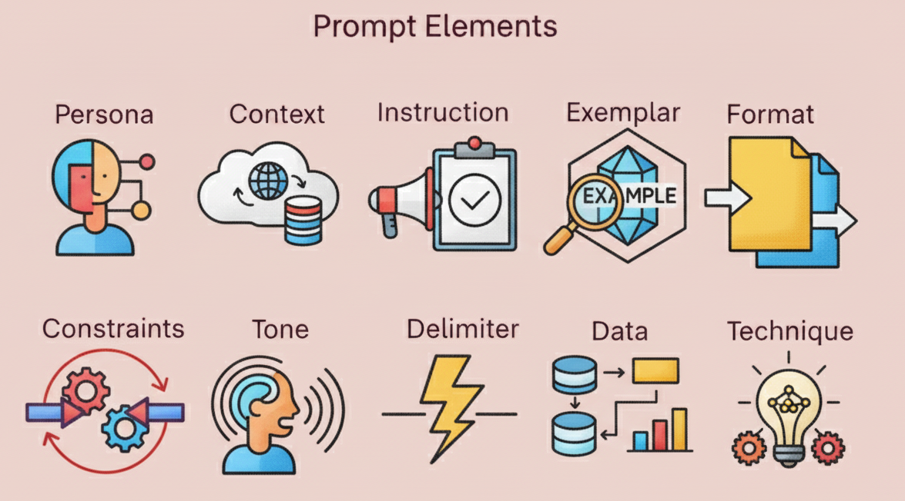{width="60%"}</center>

## Zero-shot prompting {.smaller}

-   เป็นวิธีการพื้นฐานที่สุดในการสั่งงานโมเดล

-   **หลักการ** : สั่งงานโมเดลโดยตรง โดยไม่ให้ตัวอย่างใด ๆ

-   **ข้อตกลงเบื้องต้น** :
    โมเดลได้เรียนรู้ข้อมูลในบริบทหรืองานที่ต้องการสั่งการมามากเพียงพอ
    จนสามารถเข้าใจและทำงานได้ทันที

**ตัวอย่าง (Zero-Shot Example)**

::: callout
<p style="font-size:120%;">

-   แปลคำว่า "I love you" เป็นภาษาไทย

-   "นาย ก. ขโมยโทรศัพท์จากกระเป๋าของนาย ข." เข้าลักษณะความผิดไหน

-   ขอสามคำเกี่ยวกับจุฬาลงกรณ์ มหาวิทยาลัย

</p>
:::

## One-Shot Prompting {.smaller}

:::: {.columns}

::: {.column width="50%"}

-   **หลักการ** : ให้ตัวอย่าง 1 ชุด (one shot) เพื่อเป็นแนวทางของคำตอบให้กับโมเดล

-   **ข้อตกลงเบื้องต้น** :
    โมเดลได้เรียนรู้ข้อมูลในบริบทหรืองานที่ต้องการสั่งการมามากเพียงพอ
    แต่ผู้ใช้ให้ตัวอย่างเพื่อแนะนำโมเดลว่า ต้องการผลลัพธ์ในรูปแบบใด

-   เหมาะสำหรับงานที่ต้องการรูปแบบผลลัพธ์ที่เฉพาะเจาะจง
    หรือช่วยชี้นำให้โมเดลเข้าใจงานได้ชัดเจนขึ้น

**ตัวอย่าง (One-Shot Example)**

สมมุตินักเรียนสรุปว่า “นักเรียนเก็บข้อมูลรายได้ของคนในชุมชน 10 ครอบครัว
พบว่ารายได้เฉลี่ยต่อเดือนคือ 20,000 บาท
จึงสรุปว่าคนในชุมชนมีฐานะปานกลาง”

:::

::: {.column width="50%"}

::: callout

### Evidence-based feedback


คำตอบของนักเรียน : “นักเรียนเก็บข้อมูลรายได้ของคนในชุมชน 10 ครอบครัว
พบว่ารายได้เฉลี่ยต่อเดือนคือ 20,000 บาท
จึงสรุปว่าคนในชุมชนมีฐานะปานกลาง”


ช่วยเขียน feedback จากคำตอบของนักเรียนข้างต้น โดยเน้นการให้ข้อมูลป้อนหลับที่อ้างอิงจากคำตอบของนักเรียน


ตัวอย่าง feedback : 
"นักเรียนวิเคราะห์ข้อมูลได้ดี มีการรายงานค่ากลางและการกระจายของข้อมูลอย่างถูกต้อง และมีเหตุผล หากมีการเปรียบเทียบค่าสถิติที่รายงานนี้กับข้อมูลในอดีต หรือแหล่งข้อมูลอื่นเพิ่มเติมเพื่อให้มีเกณฑ์การประเมินที่ชัดเจน จะช่วยให้ข้อสรุปน่าเชื่อถือมากยิ่งขึ้น"

:::


::: callout

### Collaborative Feedback


คำตอบของนักเรียน : “นักเรียนเก็บข้อมูลรายได้ของคนในชุมชน 10 ครอบครัว
พบว่ารายได้เฉลี่ยต่อเดือนคือ 20,000 บาท
จึงสรุปว่าคนในชุมชนมีฐานะปานกลาง”


ช่วยเขียน feedback จากคำตอบของนักเรียนข้างต้น โดยเน้นการให้ข้อมูลป้อนหลับที่อ้างอิงจากคำตอบของนักเรียน


ตัวอย่าง Feedback ที่ครูต้องการ:
"นักเรียนใช้ข้อมูลได้ดี ครูอยากให้นักเรียนลองนำเสนอผลนี้ให้เพื่อนกลุ่มอื่นฟัง 
เพื่อแลกเปลี่ยนว่าพวกเขาเห็นด้วยกับข้อสรุปนี้หรือไม่ และเพราะอะไร"

:::

:::

::::

## Few-Shot Prompting {.smaller}

-   **หลักการ** : ให้ตัวอย่างหลายชุด (few shot)

-   **ข้อตกลงเบื้องต้น** : งานที่สั่งมีลักษณะรูปแบบคำตอบที่หลากหลาย
    การให้ตัวอย่างเดียวไม่พอ (One-Shot) จึงจำเป็นต้อง ให้ตัวอย่างมากขึ้นจะช่วยให้โมเดล
    จับรูปแบบคำตอบ ที่ซับซ้อนได้ดีขึ้น ยิ่งตัวอย่างมีคุณภาพและหลากหลาย ก็ยิ่งเพิ่มความแม่นยำ

-   เหมาะสำหรับ งานที่ซับซ้อน, งานที่ต้องการความสม่ำเสมอของผลลัพธ์,
    หรือเมื่อโมเดลทำพลาดในแบบ One-Shot

**ตัวอย่าง (One-Shot Example)**

ครูต้องการให้ ChatGPT ช่วยจำแนกคุณภาพของ “การตีความข้อมูลเชิงสถิติ” ของนักเรียน
ให้อยู่ในระดับ ดี / พอใช้ / ต้องปรับปรุง
โดยพิจารณาจากความเข้าใจในข้อมูล เหตุผลสนับสนุน และความถูกต้องของข้อสรุป

คำตอบของนักเรียน : “ค่าเฉลี่ยของนักเรียนหญิงและชายใกล้เคียงกัน แต่คะแนนชายแปรปรวนมากกว่าเพราะบางคนได้ศูนย์”

## Few-Shot Prompting {.smaller}

::: callout

ตัวอย่างที่ 1

-   คำตอบนักเรียน:
“ค่าเฉลี่ยของกลุ่มนี้สูงกว่าอีกกลุ่ม แปลว่ากลุ่มนี้ฉลาดกว่า”

-   ระดับ: ต้องปรับปรุง

-   เหตุผล: อธิบายจากค่าเฉลี่ยเพียงอย่างเดียวโดยไม่มีเหตุผลสนับสนุนหรือหลักฐานอื่น

ตัวอย่างที่ 2

-   คำตอบนักเรียน: “ค่าเฉลี่ยของกลุ่มนี้สูงกว่าอีกกลุ่ม ซึ่งอาจเพราะกลุ่มนี้มีเวลาเรียนเสริมมากกว่า”

-   ระดับ: พอใช้

-   เหตุผล: มีการเสนอเหตุผลประกอบ แต่ยังไม่อธิบายด้วยข้อมูลสถิติที่ละเอียดพอ

ตัวอย่างที่ 3

-   คำตอบนักเรียน: “ค่าเฉลี่ยของกลุ่มนี้สูงกว่าอีกกลุ่ม แต่ส่วนเบี่ยงเบนมาตรฐานต่างกันมาก แสดงว่ากลุ่มนี้มีความแปรปรวนสูงกว่า”

-   ระดับ: ดี

-   เหตุผล: ใช้แนวคิดทางสถิติได้ถูกต้องและอธิบายเหตุผลเชื่อมโยงกับข้อมูลได้ชัดเจน

:::


## Chain-of-Thought (CoT) (1) {.smaller}

-   Chain-of-Thought Prompting คือเทคนิคการออกแบบ prompt
    ที่ให้โมเดลภาษารู้จักการคิดแบบมีเหตุผลเป็นขั้นเป็นตอน
    หรือแสดงวิธีคิด/วิธีทำออกมาก่อนจะสรุปเป็นคำถามสุดท้าย (step-by-step reasoning)

-   **หลักการ** : ให้ตัวอย่างที่แสดงกระบวนการคิดแบบเป็นขั้นตอน (chain of thought)
    ที่นำไปสู่คำตอบ

    -   ลดปัญหา Hallucination

    -   เพิ่มความโปร่งใส คุณภาพคำตอบดีขึ้น

    -   สอดคล้องกับหลักการ Human in the Loop/Human Center Mindset

## Chain-of-Thought (CoT) (2) {.smaller}


**สถานการณ์ :**

ครูภัทรสอนรายวิชา โครงงานบูรณาการ (Project-Based Learning)
ในช่วงท้ายหน่วยการเรียนรู้ ครูมอบหมายให้นักเรียนเขียน บันทึกสะท้อนคิด หัวข้อ

“ฉันได้เรียนรู้อะไรจากการทำโครงงานกลุ่มครั้งนี้”

เพื่อให้นักเรียนสะท้อนถึงการทำงานเป็นทีมและการเรียนรู้ด้วยตนเอง
ครูตั้งเป้าหมายของกิจกรรมนี้ว่า

“นักเรียนสามารถสะท้อนความคิดอย่างมีเหตุผล อ้างอิงจากประสบการณ์จริง และเห็นแนวทางพัฒนาตนเองได้”


**งานของครู :** 

ครูต้องการใช้ ChatGPT ช่วยให้ feedback บันทึกสะท้อนคิดของนักเรียนอย่างมีคุณภาพ โดยเป็น feedback ที่มีลักษณะเฉพาะคือ 
- สะท้อนสิ่งที่นักเรียนคิดและรู้จริง

- เชื่อมโยงกับวัตถุประสงค์การเรียนรู้

- สร้างแรงบันดาลใจให้นักเรียนเห็นแนวทางพัฒนาตนเอง

## Chain-of-Thought (CoT) (3) {.smaller}

ตัวอย่างคำตอบนักเรียน

- พิมพ์ชนก : "ตอนเริ่มทำโครงงาน ฉันรู้สึกสับสนเพราะทีมยังไม่เข้าใจเป้าหมายเดียวกัน เราใช้เวลาหลายวันในการเถียงเรื่องหัวข้อและแนวทาง พอฉันลองเสนอให้ใช้ Google Docs ในการวางแผนร่วมกัน ทุกคนเริ่มเห็นภาพเดียวกันมากขึ้น ฉันได้เรียนรู้ว่าการสื่อสารที่ดีไม่ใช่แค่พูด แต่คือการทำให้ข้อมูลโปร่งใสและเข้าถึงได้กับทุกคน หลังจากนั้นงานก็ราบรื่นขึ้นมาก ฉันอยากพัฒนาทักษะการฟัง เพราะบางครั้งฉันตอบกลับเพื่อนเร็วไปโดยยังไม่เข้าใจสิ่งที่เขาหมายถึงจริง ๆ"

- รวิภา : "งานครั้งนี้ฉันรับผิดชอบด้านออกแบบโปสเตอร์ประชาสัมพันธ์โครงงาน ฉันใช้ Canva เป็นหลัก ซึ่งตอนแรกก็ไม่มั่นใจเพราะไม่เคยใช้มาก่อน ฉันเลยดูคลิปใน YouTube แล้วลองทำไปเรื่อย ๆ แต่พอครูให้ feedback รอบแรกว่าข้อความบนโปสเตอร์อ่านยาก ฉันก็ลองปรับขนาดตัวอักษรและเลือกสีให้ตัดกันมากขึ้น ฉันรู้สึกภูมิใจที่สามารถแก้ปัญหาได้ด้วยตนเอง และเข้าใจว่า feedback ไม่ได้แปลว่าทำผิด แต่คือโอกาสให้เรียนรู้ ฉันคิดว่าครั้งหน้าจะวางแผนเวลาให้ดีกว่านี้ เพราะรอบนี้ฉันเร่งทำในวันสุดท้ายจนเครียดไปหน่อย"

- ธีรภัทร : "ฉันรู้สึกว่าโครงงานครั้งนี้เหนื่อยเกินไป ครูให้เวลาน้อยและงานเยอะมาก เราต้องหาข้อมูลเองหมด เพื่อนในกลุ่มบางคนก็ไม่ช่วยเลย ฉันพยายามจัดการให้ทุกอย่างเสร็จ แต่สุดท้ายก็ยังโดนครูบอกว่างานขาดรายละเอียด ฉันไม่เข้าใจว่าครูต้องการอะไรแน่ และเริ่มรู้สึกว่าไม่อยากทำงานกลุ่มอีก เพราะทำคนเดียวอาจง่ายกว่า"

## Single-Turn CoT {.smaller}

- คือ การออกแบบ prompt ให้โมเดลคิดอย่างมีเหตุผลเป็นลำดับขั้นในคำสั่งเดียว 

- แนวคิดหลัก คือ การสร้างโครงสร้างการให้เหตุผล (logical reasoning flow) ให้กับโมเดล โดยโมเดลจะไม่ตอบทันที แต่จะแสดงขั้นตอนการคิดก่อนสรุปในขั้นสุดท้าย

- องค์ประกอบสำคัญ

  - ใส่บริบทจำเป็นให้ครบถ้วน
  
  - ระบุวัตถุประสงค์ต้องชัดเจน
  
  - มีขั้นตอนการคิดเป็นลำดับขั้น
  
  - ให้โมเดลแสดงวิธีคิดและคำตอบในทีเดียว


## Single-Turn CoT {.smaller}

::: callout

### ตัวอย่างการวิเคราะห์และให้ feedback การสะท้อนคิดของนักเรียน

วัตถุประสงค์ : ช่วยวิเคราะห์และให้ feedback ต่อบันทึกสะท้อนคิดของนักเรียน โดยใช้การให้เหตุผลอย่างเป็นลำดับ

ขั้นตอนการคิด 

1. ระบุประเด็น/สิ่งที่นักเรียนพูดถึง เช่น ประสบการณ์ เหตุการณ์ หรืออารมณ์

2. ตีความประเด็นที่นักเรียนสะท้อนคิดแต่ละประเด็น ว่านักเรียนเรียนรู้หรือได้อะไรจากสิ่งนั้น

3. วิเคราะห์ว่าประเด็นที่นักเรียนสะท้อนคิดนี้ บ่งชี้การเรียนรู้ พัฒนาการของนักเรียน หรือช่องว่างที่ควรปรับปรุงของนักเรียนอย่างไร

4. นำ 1,2,3 มาสรุปเป็น feedback เชิงพัฒนา ใช้ภาษาที่กระชับ เป็นมิตร สอดคล้องกับบริบทของนักเรียน และสามารถนำไปใช้ได้จริงในเชิงปฏิบัติ


:::


## Multi-Turn CoT {.smaller}

- คือการออกแบบ prompt ที่มีลำดับการโต้ตอบหลายรอบ (multi-turn) ระหว่างผู้ใช้กับโมเดล โดยแต่ละรอบจะเป็นการต่อยอดเหตุผลจากรอบก่อนหน้า เพื่อให้เข้าใจประเด็นได้ลึกมากขึ้น

- แนวคิดหลัก คือ การสร้างวงจรการคิดร่วมกัน ระหว่างผู้ใช้กับ AI โดย AI จะไม่ตอบหรือแสดงผลลัพธ์ในทันที แต่จะคิดทำความเข้าใจบริบทของปัญหาไปพร้อมกับผู้ใช้ ผ่านการแลกเปลี่ยนข้อมูลหลายขั้นตอน

-  ได้ร่วมคิดไปกับโมเดล เห็นกระบวนการคิดระหว่างทาง (สอดคล้องกับ concept
    explainable AI)


ขั้นตอนสำคัญ

- เริ่มต้นด้วยคำถามหรือปัญหาหลัก (initial prompt)

- ให้โมเดลแสดงวิธีการคิดเบื้องต้น

- ผู้ใช้ feedback หรือให้ข้อมูลเพิ่มเติม

- ให้โมเดลคิดต่อยอด สลับกับการป้อน feedback 

- สร้างข้อสรุปสุดท้าย


## Reference {.smaller}
