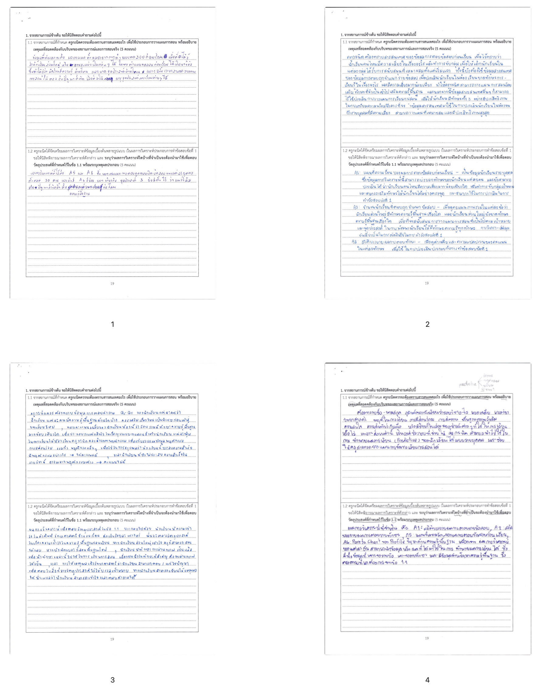
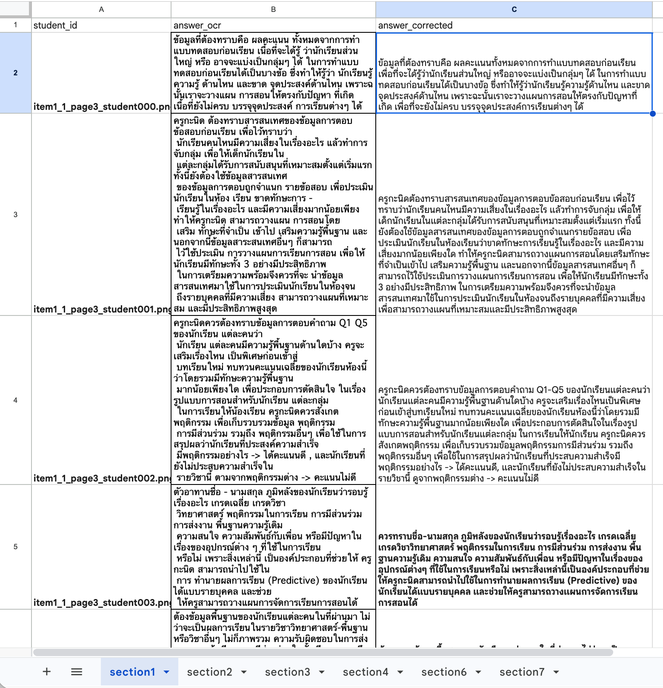
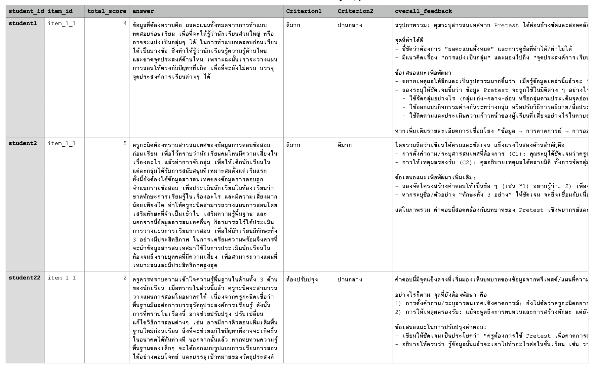
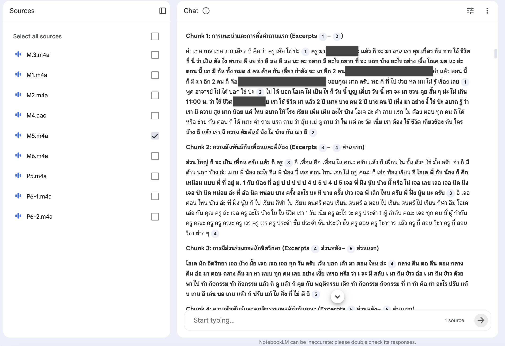
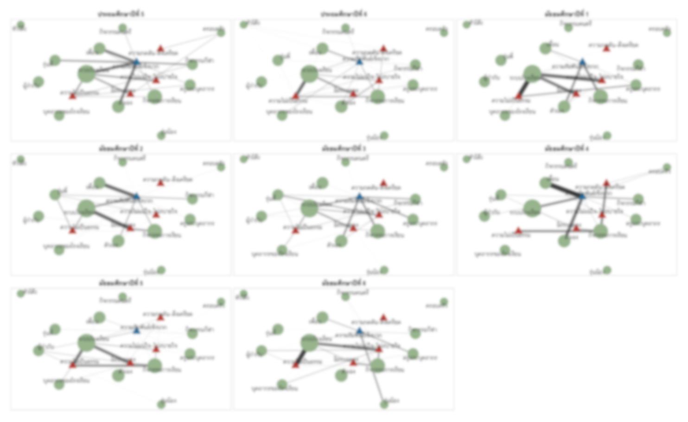
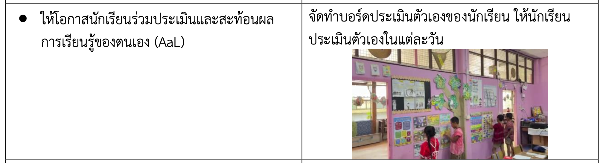
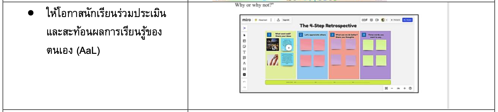
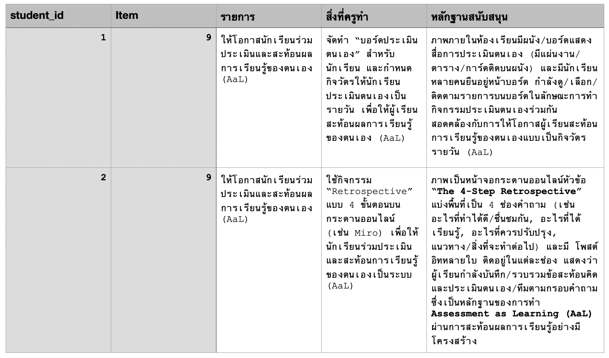
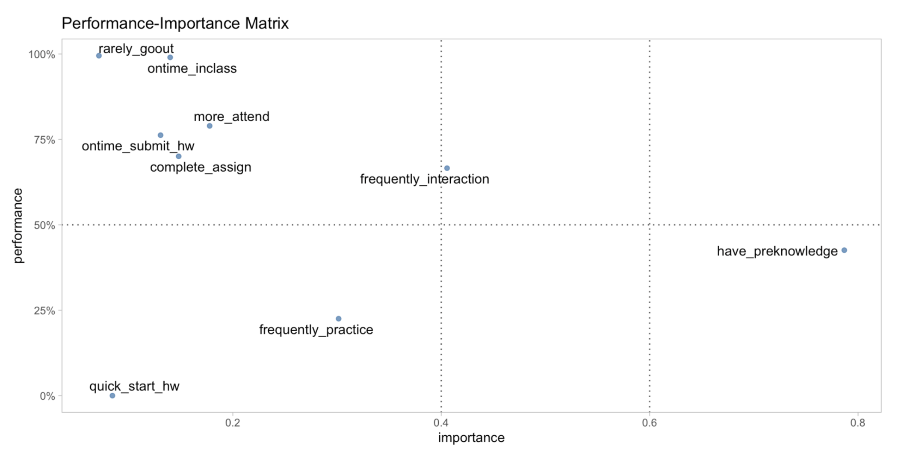

```{r}
library(tidyverse)
#data <- read_csv("/Users/choat/Documents/GitHub/predice_item_response/final_data_20DEC.csv")
data <- read_csv("/Users/choat/Documents/GitHub/datakruroo.github.io/Dashboard2/final_merged_10NOV.csv")

#data |> glimpse()

data <- data |> 
    select(student_id, Item, correct, choose_method, concepts, interpretation, submit_time, percent_submit,learning_performance, 
    cheat_index, CTT_Difficulty_Level, CTT_Discrimination_Level)

data_predictive <- data |> 
    group_by(student_id) |>
    reframe(
    choose_method = mean(choose_method),
    concepts = mean(concepts),
    interpretation = mean(interpretation),
    submit_time = mean(submit_time),
    percent_submit = mean(percent_submit),
    assignment_score = mean(learning_performance),
    cheat_index = mean(cheat_index)
    ) |> 
    ungroup() |> 
    mutate(
        student_id = paste0("student_", 1:367)
    ) 

data_predictive |> write_excel_csv("data_predictive.csv")
```


## Data-Driven Classroom Cycle

> *ครู "**ผู้ใช้ข้อมูลเพื่อขับเคลื่อนการสอน (instructional decision-maker)"***

<br>

:::::: columns
::: {.column width="48%"}

:::

::: {.column width="4%"}
:::

::: {.column width="48%"}

:::
::::::


## Data Analysis {.smaller}

การวิเคราะห์ข้อมูล คือ กระบวนการแปลงข้อมูลดิบให้กลายเป็นความเข้าใจ ความเข้าใจเชิงลึก การคาดการณ์ และการลงมือทำ ทั้งนี้เพื่อให้การดำเนินงานสามารถบรรลุเป้าหมายที่ตั้งไว้ได้อย่างมีประสิทธิภาพ


{width="80%"}

## Data Analysis {.smaller}

> การวิเคราะห์ข้อมูลที่ดี ไม่ใช่การหวังพึ่ง AI หรือเครื่องมือการวิเคราะห์แต่เพียงอย่างเดียว... องค์ประกอบสำคัญคือการมีกระบวนการคิดที่ถูกต้อง


:::: {.columns}

::: {.column width="40%"}


:::

::: {.column width="60%"}


:::

::::

## Data Analysis {.smaller}

> การวิเคราะห์ข้อมูลที่ดี ไม่ใช่การหวังพึ่ง AI หรือเครื่องมือการวิเคราะห์แต่เพียงอย่างเดียว... องค์ประกอบสำคัญคือการมีกระบวนการคิดที่ถูกต้อง

- เริ่มจากคำถาม ไม่ใช่ข้อมูล

- ข้อมูลไม่จำเป็นต้องสะอาด และ เป็นตัวเลขเสมอไป

- Insight ที่ได้ต้องเพียงพอที่จะใช้สนับสนุนการตัดสินใจ

- อย่าให้ AI ทำทุกอย่างเอง มนุษย์กับ AI ทำงานร่วมกัน ไม่ได้แทนกัน

- เน้นความโปร่งใส ตรวจสอบได้ รับผิดชอบ และใช้ได้จริง

## เริ่มจากคำถาม ไม่ใช่ข้อมูล {.smaller}

<center>
{width="90%"}
</center>

## เริ่มจากคำถาม ไม่ใช่ข้อมูล {.smaller}

- เราต้องตัดสินใจอะไร? 

- อยากรู้อะไรเพื่อเปลี่ยนการดำเนินการ


## ข้อมูลไม่จำเป็นต้องสะอาด และ เป็นตัวเลขเสมอไป {.smaller}

ข้อความ เสียง รูปภาพ ... ทั้งหมดคือข้อมูลที่วิเคราะห์ได้ ถ้ารู้วิธีแปลงข้อมูลดังกล่าวให้อยู่ในรูปแบบที่เหมาะสม และสามารถใช้ตอบคำถามได้

:::: {.columns}

::: {.column width="50%"}

{width="75%"}

:::

::: {.column width="50%"}

{width="85%"}

:::

::::
 

## ข้อมูลไม่จำเป็นต้องสะอาด และ เป็นตัวเลขเสมอไป {.smaller}


ข้อความ เสียง รูปภาพ ... ทั้งหมดคือข้อมูลที่วิเคราะห์ได้ ถ้ารู้วิธีแปลงข้อมูลดังกล่าวให้อยู่ในรูปแบบที่เหมาะสม และสามารถใช้ตอบคำถามได้


:::: {.columns}

::: {.column width="40%"}

<div style="font-size: 0.4em; line-height: 1.3;">

**เกณฑ์การประเมิน**

| Analytics Dimension | ตัวบ่งชี้พฤติกรรม | ระดับคุณภาพ | คะแนน |
|---|---|--|--|
| การตั้งคำถาม/ระบุสารสนเทศที่ครูกะนิดต้องการ | ระบุชัดว่าครูต้องใช้ pretest เพื่อ “คาดการณ์อะไร” และต้องสอดคล้องกับบริบท predictive assessment | ดีมาก (3)<br>ปานกลาง (2)<br>ต้องปรับปรุง (0–1) | 0–3 |
| การให้เหตุผลรองรับ | เหตุผลสนับสนุนว่าทำไมครูต้องรู้ข้อมูลนั้น เชื่อมโยงสถานการณ์และเนื้อหา 3 ด้าน | ดีมาก (2)<br>ปานกลาง (1)<br>ต้องปรับปรุง (0) | 0–2 |

</div>

:::

::: {.column width="2%"}

:::


::: {.column width="58%"}




:::

::::


## ข้อมูลไม่จำเป็นต้องสะอาด และ เป็นตัวเลขเสมอไป {.smaller}


ข้อความ เสียง รูปภาพ ... ทั้งหมดคือข้อมูลที่วิเคราะห์ได้ ถ้ารู้วิธีแปลงข้อมูลดังกล่าวให้อยู่ในรูปแบบที่เหมาะสม และสามารถใช้ตอบคำถามได้


:::: {.columns}

::: {.column width="50%"}



:::

::: {.column width="50%"}



:::

::::


## ข้อมูลไม่จำเป็นต้องสะอาด และ เป็นตัวเลขเสมอไป {.smaller}


ข้อความ เสียง รูปภาพ ... ทั้งหมดคือข้อมูลที่วิเคราะห์ได้ ถ้ารู้วิธีแปลงข้อมูลดังกล่าวให้อยู่ในรูปแบบที่เหมาะสม และสามารถใช้ตอบคำถามได้

:::: {.columns}

::: {.column width="50%"}





<div style="font-size: 0.6em; line-height: 1.2;">

```
มีตาราง 2 คอลัมน์:
	•	คอลัมน์ 1 = ข้อรายการการสำรวจ
	•	คอลัมน์ 2 = สิ่งที่ครูปฏิบัติ (บางแถวมีรูปประกอบ บางแถวไม่มี)

ช่วยสร้างคอลัมน์ใหม่ 2 คอลัมน์คือ
	1.	สิ่งที่ครูทำ (สรุปการกระทำของครูให้ชัด 1–2 ประโยค และต้องสอดคล้องกับเกณฑ์คอลัมน์ 1)
	2.	หลักฐานสนับสนุน

	•	ถ้ามีรูป: ถอดภาพเป็นคำบรรยายสั้น ๆ 1–2 ประโยค ว่าเห็นอะไรที่เป็นหลักฐานของเกณฑ์นั้น
	•	ถ้าไม่มีรูป: ใช้คำอธิบายในคอลัมน์ 2 เป็นหลักฐาน (สรุป/ยกถ้อยคำสำคัญ)

ตอบเป็นตาราง:

|สิ่งที่ครูทำ |	หลักฐานสนับสนุน|
|---|---|
```

</div>


:::

::: {.column width="50%"}




:::

::::


## Insight ที่ได้ต้องเพียงพอที่จะใช้สนับสนุนการตัดสินใจ {.smaller}

> การวิเคราะห์ที่ขาดการเชื่อมโยงกับคำถาม และการตัดสินใจ = ไม่มีประโยชน์

<center>
{width="80%"}
</center>


## Data Analysis {.smaller}


- Statistical Approaches -- มีความเป็นปรนัยสูง แต่ผู้วิเคราะห์อาจไม่เห็นภาพรวม/สภาพจริงของข้อมูล ในบางกรณีหากข้อมูลไม่เป็นไปตามข้อตกลงเบื้องต้น + ผู้วิเคราะห์ขาดความเข้าใจเชิงเทคนิค อาจนำไปสู่ข้อสรุปที่มีความคลาดเคลื่อนได้

- Graphical Approaches -- ผลการวิเคราะห์ในลักษณะแผนภาพ ช่วยให้ผู้วิเคราะห์เห็นภาพรวม/สภาพจริงของข้อมูลได้ดีขึ้น ทำความเข้าใจได้ง่ายกว่า แต่อาจขาดความเป็นปรนัย ขาดรายละเอียด

<center>
{width="60%"}
</center>


## Descriptive Analysis = ตอนนี้เกิดอะไรขึ้น {.smaller}

- การทำความเข้าใจข้อมูล -- วิเคราะห์เพื่อบรรยายสภาพหรือลักษณะของข้อมูล เช่น ระดับความรู้/ความสามารถในปัจจุบัน ความต้องการ ความโดดเด่น จุดที่ต้องพัฒนาของผู้เรียน

    - การสำรวจการแจกแจงของข้อมูล (distribution)

    - การเปรียบเทียบข้อมูล (comparison)

    - การสำรวจแนวโน้มของข้อมูล (trend)

- การสำรวจเพื่อสร้างความเข้าใจที่เพียงพอต่อการกำหนดคำถาม/สมมุติฐาน เพื่อนำไปสู่การวิเคราะห์เชิงลึก 

## ตัวอย่างคำถามที่เกี่ยวข้อง {.smaller}

- ผู้เรียนในชั้นเรียนมีระดับความรู้/ความสามารถเป็นอย่างไร

- ผู้เรียนมีจุดแข็ง/มีพื้นฐานน้อยในหัวข้อใด

- เมื่อดำเนินการสอนไประยะหนึ่งแล้ว ผู้เรียนตอบสนองต่อการเรียนรู้ได้ดีหรือไม่

- ผู้เรียนคนใดมักแก้ปัญหาหรือทำข้อสอบในระดับยากไม่ได้

- ผู้เรียนคนใดมีผลการเรียนหรือพฤติกรรมการเรียนรู้ที่มีความเสี่ยง อย่างไร


## สถานการณ์ตัวอย่าง 1 : Predictive Assessment {.smaller}

อาจารย์ผู้สอนรายวิชาการวิจัยเพื่อพัฒนาการเรียนรู้ กำลังเตรียมตัวสำหรับการจัดการเรียนรู้ในภาคการศึกษาหน้า ทั้งนี้อาจารย์ได้เก็บรวบรวมข้อมูลการเรียนรู้ที่ผ่านมาในรายวิชาสถิติและสารสนเทศการศึกษา ซึ่งเป็นรายวิชาที่นิสิตกลุ่มนี้ได้ลงทะเบียนเรียนไปแล้วในภาคการศึกษาก่อนหน้า

สมมุติฐาน นักเรียนที่มีพื้นฐานความรูุ้/ทักษะทางสถิติที่ดี มักมีโอกาสสูงที่จะประสบความสำเร็จในรายวิชาวิจัย ในทางกลับกันนักเรียนที่มีจุดอ่อนในบางด้าน อาจมีความเสี่ยงที่จะไม่บรรลุวัตถุประสงค์ที่คาดหวัง

- ความรู้ทางสถิติ (concepts)

- การแปลความหมาย/ตีความผลการวิเคราะห์ (interpretation)

- การออกแบบการวิเคราะห์ข้อมูล (choose_method)


## สถานการณ์ตัวอย่าง 1 : Predictive Assessment {.smaller}

**คำถามที่ต้องการคำตอบ**

1. ภาพรวมของชั้นเรียน -- ตอนนี้ระดับพื้นฐานความรู้/ทักษะทางสถิติของนักเรียนในชั้นเรียนเป็นอย่างไร

2. นักเรียนคนไหนเป็นกลุ่มที่มีพื้นฐานดี หรือมีจุดอ่อนในด้านใด


- เลือกใช้คะแนนสอบปลายภาคของนักเรียน

- รวมคะแนนสอบปลายภาคจำแนกตามจุดเน้นของคำถามแต่ละข้อที่มี 3 ด้าน ได้แก่ ความรู้ การแปล/ตีความหมายผลการวิเคราะห์ และการเลือกใช้่/ออกแบบการวิเคราะห์

```{r}
data_predictive |> glimpse(80)
```


## การวิเคราะห์ข้อมูลด้วย AI {.smaller}


> AI ช่วยเสริมประสิทธิภาพการวิเคราะห์ข้อมูล แต่ความรับผิดชอบต่อการตัดสินใจยังคงอยู่ที่มนุษย์

- ครูเป็นผู้กำหนดเป้าหมาย เกณฑ์ และการตัดสินใจ

- AI เป็นผู้ช่วยร่างแผนการวิเคราะห์ ดำเนินการวิเคราะห์ อธิบายผลการวิเคราะห์ สรุป และสื่อสารข้อมูล

คุณครูสามารถใช้ generative AI ได้หลายตัวในการวิเคราะห์ข้อมูล

:::: {.columns}

::: {.column width="50%"}

- [ChatGPT (OpenAI)](https://chatgpt.com/)

- [Atlas (OpenAI)](https://chatgpt.com/atlas/)

- [Claude (Anthropic)](https://claude.ai/)

- [Claude in Chrome](https://claude.com/chrome)

:::

::: {.column width="50%"}

- [Gemini (Google)](https://gemini.google.com/app)

- [Juluis AI](https://julius.ai/chat)

- [Quadratic AI](https://www.quadratichq.com/)

:::

::::

## การวิเคราะห์ข้อมูลด้วย AI : DIG Process {.smaller}

> DIG คือกรอบคิดที่ช่วยให้ครูใช้ข้อมูลอย่างมีวินัย เริ่มจากเข้าใจข้อมูล (Description) เติมบริบทและข้อจำกัด (Introspection) และกำหนดเป้าหมายให้การวิเคราะห์นำไปสู่การตัดสินใจในชั้นเรียน (Goal Setting)


- Description -- การบรรยายและทำความเข้าใจข้อมูล เน้นการสร้างความเข้าใจเกี่ยวกับบริบทเบื้องต้นของข้อมูล โครงสร้างข้อมูล และคุณภาพข้อมูลก่อนการวิเคราะห์ โดยไม่ตีความหมาย หรือสรุปผล

    - ข้อมูลชุดนี้มีอะไรบ้าง -- ตรวจสอบตัวแปร และสเกลของข้อมูล

    - ตรวจสอบคุณภาพข้อมูล เช่น มีค่าสูญหายหรือไม่ มีข้อมูลซ้ำซ้อนมั้ย มีการบันทึกข้อมูลในรูปแบบที่ถูกต้อง สม่ำเสมอหรือไม่

    - ภาพรวมของข้อมูลทั้งชุด (ชั้นเรียน) เป็นอย่างไร (ยังไม่ตีความหมาย)


## การวิเคราะห์ข้อมูลด้วย AI : DIG Process {.smaller}

> DIG คือกรอบคิดที่ช่วยให้ครูใช้ข้อมูลอย่างมีวินัย เริ่มจากเข้าใจข้อมูล (Description) เติมบริบทและข้อจำกัด (Introspection) และกำหนดเป้าหมายให้การวิเคราะห์นำไปสู่การตัดสินใจในชั้นเรียน (Goal Setting)


- Introspection -- เติมบริบทของการวิเคราะห์และตรวจสอบขอบเขตการใช้ข้อมูล กล่าวคือ ใช้ AI ช่วยครูคิดทบทวนว่า ข้อมูุลชุดนี้สามารถใช้วิเคราะห์เพื่อตอบวัตถุประสงค์ที่ต้องการได้หรือไม อย่างไรบ้าง

    - วัตถุประสงค์ของการใช้ข้อมูลคืออะไร (เพื่อทำความเข้าใจ คัดกรอง สนับสนุนการตัดสินใจด้านการสอน)

    - เพื่อตอบวัตถุประสงค์นี้ ควรตั้งคำถามอะไรจากข้อมูล

    - ด้วยข้อมูลที่มีครูสามารถตอบคำถามได้อย่างสมบูรณ์หรือไม่ 

    - คำถามอะไรที่ตอบได้ อะไรที่ตอบไม่ได้

    - ควรใช้การวิเคราะห์แบบใดที่เหมาะสม


## การวิเคราะห์ข้อมูลด้วย AI : DIG Process {.smaller}

> DIG คือกรอบคิดที่ช่วยให้ครูใช้ข้อมูลอย่างมีวินัย เริ่มจากเข้าใจข้อมูล (Description) เติมบริบทและข้อจำกัด (Introspection) และกำหนดเป้าหมายให้การวิเคราะห์นำไปสู่การตัดสินใจในชั้นเรียน (Goal Setting)


- Goal Setting -- แปลงความเข้าใจใน 2 ขั้นตอนแรกให้เป็นการวิเคราะห์ที่ใช้งานได้จริง และเชื่อมโยงโดยตรงกับบริบทในชั้นเรียนของครู

    - คำตอบ/สารสนเทศที่ต้องการจากการวิเคราะห์

    - รูปแบบผลลัพธ์ที่ต้องการ เช่น แผนภาพ ตาราง รายงานสรุป หรือ dashboard

    - Actionable insights ที่คาดหวังจากการวิเคราะห์ -- ผลลัพธ์ใดที่จะช่วยให้ครูสามารถตัดสินใจ ปรับการสอน หรือช่วยเหลือผู้เรียนได้จริง


## สถานการณ์ 2 : พฤติกรรมการเรียนใดที่มีแนวโน้มเป็นปัญหาในกลุ่มผู้เรียนพื้นฐานน้อย {.smaller}

- คัดกรองผู้เรียนที่คาดว่าน่าจะมีความเสี่ยงด้านขาดความรู้/ทักษะพื้นฐานทางสถิติ

- เตรียมข้อมูลที่สะท้อนปัญหาด้านพฤติกรรมการเรียน

- วิเคราะห์ว่าในกลุ่มผู้เรียนพื้นฐานน้อย มีพฤติกรรมใดที่มีแนวโน้มเป็นปัญหา

- นำเสนอผลการวิเคราะห์


```{r}
data <- read_csv("/Users/choat/Documents/GitHub/datakruroo.github.io/Dashboard2/final_merged_10NOV.csv")

#data |> glimpse()

data <- data |> 
    select(student_id, Item, correct, choose_method, concepts, interpretation, submit_time, percent_submit,learning_performance, 
    cheat_index, CTT_Difficulty_Level, CTT_Discrimination_Level)

data_predictive <- data |> 
    group_by(student_id) |>
    reframe(
    choose_method = mean(choose_method),
    concepts = mean(concepts),
    interpretation = mean(interpretation),
    submit_time = mean(submit_time),
    percent_submit = mean(percent_submit),
    assignment_score = mean(learning_performance),
    cheat_index = mean(cheat_index)
    ) |> 
    ungroup() |> 
    mutate(
        student_id = paste0("student_", 1:367)
    ) 

data_predictive |> glimpse(80)

data_predictive |> write_excel_csv("data_predictive2.csv")
```

## สถานการณ์ 3 : เมื่อดำเนินการสอนรายวิชาวิจัยไประยะหนึ่งแล้ว ผู้เรียนพื้นฐานน้อยตอบสนองต่อการเรียนรู้ได้ดีหรือไม่ อย่างไร {.smaller}


```{r}
data <- read_csv("/Users/choat/Documents/GitHub/datakruroo.github.io/Dashboard2/final_merged_10NOV.csv")

data |> filter(outcome %in% c("มโนทัศน์พื้นฐานการวิจัย","การออกแบบการวิจัย", "เครื่องมือและการเก็บข้อมูล")) |> 
    select(student_id, choose_method, concepts, interpretation, submit_time, percent_submit,learning_performance, 
    cheat_index, outcome, correct, CTT_Difficulty_Level) |> 
    rename(
           res_item_difficulty = CTT_Difficulty_Level,
           res_item_correct = correct) |> 
    group_by(student_id, choose_method, concepts, interpretation, submit_time, percent_submit,learning_performance, cheat_index, outcome, res_item_difficulty) |> 
    reframe(
        res_item_score = mean(res_item_correct)*100,
    ) |> 
    mutate(student_id = rep(paste0("student_", 1:367), each = 9)) |>
    filter(student_id %in% paste0("student_",1:100)) -> data_responsive
    

data_responsive |> glimpse(80)

data_responsive |> write_excel_csv("data_responsive.csv")

```


## ตัวอย่างการวิเคราะห์ที่ช่วยทำความเข้าใจผู้เรียน: Pareto Chart {.smaller}

```{r echo = F}
library(tidyverse)
data <- read_csv("/Users/choat/Documents/GitHub/datakruroo.github.io/Programming/dimensionality_reduction/learning_data_secondary.csv")
```


**Pareto Chart**

**"roughly 80% of consequences come from 20% of causes"**

วัตถุประสงค์ของ Pareto Chart คือการระบุปัจจัยที่สำคัญที่สุดที่คาดว่าจะสัมพันธ์กับปัญหา


{width="40%"}{width="60%"}


- เป็นแผนภูมิที่ใช้แสดงการแจกแจงของปัจจัยที่คาดว่าจะสัมพันธ์กับปัญหา

- แนวคิดเบื้องหลังมาจาก Pareto Principle 


## ตัวอย่างการวิเคราะห์ที่ช่วยทำความเข้าใจผู้เรียน: Pareto Chart {.smaller}


**ขั้นตอนการสร้าง Pareto Chart**

1. คัดกรองกลุ่มผู้เรียนที่มีปัญหาหรือกลุ่มที่สนใจ

2. จัดเตรียมข้อมูลปัจจัยที่คาดว่าน่าจะเป็นสาเหตุหรือมีความสัมพันธ์กับปัญหา

3. ลักษณะข้อมูลปัจจัยที่สามารถมาสร้าง Pareto Chart ได้ควรประกอบด้วย ปัจจัยต่าง ๆ ที่คาดว่าน่าจะเป็นสาเหตุหรือมีความสัมพันธ์กับปัญหา และความถี่หรือความรุนแรงของปัจจัยต่าง ๆ ในกลุ่มผู้เรียน

4. จัดเรียงปัจจัยตามความถี่หรือความรุนแรงที่พบในกลุ่มผู้เรียน (จากมากไปน้อย)

5. คำนวณความถี่ (ร้อยละ) สะสมของปัจจัย

6. สร้างแผนภูมิ Pareto

## ตัวอย่างการวิเคราะห์ที่ช่วยทำความเข้าใจผู้เรียน: Performance-Importance Matrix {.smaller}

<div style="font-size: 0.8em;">

เป็นเครื่องมือที่ใช้ในการวิเคราะห์และวางแผนเพื่อปรับปรุงประสิทธิภาพ โดยในบริบทของ ห้องเรียน สามารถนำมาใช้เพื่อประเมินและวางแผนการพัฒนาการเรียนการสอนของครูและการเรียนรู้ของนักเรียนได้อย่างมีประสิทธิภาพ


1.	**แกน Y: Performance (ประสิทธิภาพ)**

- แกน Y แสดงถึง ประสิทธิภาพ หรือ ผลลัพธ์ ที่เกิดขึ้นจริงในห้องเรียน ซึ่งอาจจะเป็น ผลการเรียนรู้ของนักเรียน เช่น คะแนนสอบ ความสนใจในการเรียน การมีส่วนร่วมในกิจกรรม หรือพฤติกรรมการเรียนรู้

- ตัวแปรนี้วัดได้จากการประเมินผลเชิงปฏิบัติ เช่น คะแนน การประเมินเชิงพฤติกรรม หรือการสังเกตความก้าวหน้าของนักเรียน หรือคะแนนปัจจัยที่คาดว่ามีความสัมพันธ์กับผลลัพธ์การเรียนรู้ก็ได้ แล้วแต่จะออกแบบ

2.	**แกน X: Importance (ความสำคัญ)**

- แกน X แสดงถึง ความสำคัญ ของตัวแปรที่ส่งผลต่อการเรียนรู้ในห้องเรียน เช่น ปัจจัยการสอนของครู, สภาพแวดล้อมการเรียนรู้, การสนับสนุนจากเพื่อน, การเตรียมตัวก่อนเรียน ฯลฯ

- ค่าความสำคัญนี้อาจวัดจาก Correlation ระหว่างตัวแปรที่เกี่ยวข้องกับประสิทธิภาพการเรียนรู้ เช่น คะแนนสอบกับพฤติกรรมการเตรียมตัว, หรือความสัมพันธ์ระหว่างการทำการบ้านกับการมีส่วนร่วมในชั้นเรียน

</div>

## ตัวอย่างการวิเคราะห์ที่ช่วยทำความเข้าใจผู้เรียน: Performance-Importance Matrix {.smaller}




##

