## Communicating Data Effectively {.smaller}

- ข้อมูล ไม่เท่ากับ ความเข้าใจ (ที่ถูกต้อง)

- ความเข้าใจ ไม่เท่ากับ การลงมือทำ

- หน้าที่ของครูคือการ เปลี่ยนข้อมูลให้เป็น ความเข้าใจ และ การลงมือทำ

> การสื่อสารข้อมูล ไม่ใช่การสร้างกราฟได้ ไม่ใช้การสร้างกราฟสวยงาม แต่เป็นการสร้างสื่อที่ช่วยให้ผู้รับสาร เข้าใจข้อมูล และสามารถใช้ความเข้าใจดังกล่าวไปสู่การสร้างประโยชน์ได้

<center>
{width="55%"}
</center>


## วัตถุประสงค์ของการสื่อสารข้อมูลอย่างมีประสิทธิภาพ {.smaller}
 
<center>
{width="55%"}
</center>


- Driven Action -- เปลี่ยนข้อมูลให้เป็นการกระทำ

- Reducing Cognitive Load -- ลดภาระทางปัญญา

- Memorability & Engagement -- สร้างความจดจำและมีส่วนร่วม

- Professional & Organization Success -- สร้างความสำเร็จทางวิชาชีพและองค์กร

- Accessibility -- สร้างการเข้าถึงข้อมูล


## ประเภทของการสื่อสารข้อมูล {.smaller}

1. สิ่งที่ต้องการสื่อสารเป็น มโนทัศน์/ทฤษฎี หรือ ข้อมูล/insight

2. นักวิจัยต้องการแสดง องค์ความรู้/insight หรือ สำรวจเพื่อหา insight

<center>
{width="55%"}
</center>


## ตัวอย่าง 1 : ครูควรมีวิธีคิดอย่างไรในการใช้ข้อมูลเพื่อตัดสินใจ {.smaller}

จุดตั้งต้น : ครูกะนิดสอนวิทยาศาสตร์พื้นฐาน ม.2 ห้องหนึ่ง 30 คน ในอีก 6 สัปดาห์ข้างหน้าจะเป็นการสอบกลางภาค เนื้อหาใหม่ที่จะสอน ผู้เรียนจำเป็นต้องมีความรู้/ทักษะในการ

- อ่านข้อเท็จจริงจากข้อมูลที่อยู่ในรูปแบบกราฟ

- สรุปและให้เหตุผลเชิงวิทยาศาสตร์

> ครูกะนิดกำลังตัดสินใจว่า จะดำเนินการจัดการเรียนรู้อย่างไรในช่วงเวลาที่เหลือ เพื่อให้นักเรียนสามารถบรรลุวัตถุประสงค์การเรียนรู้ที่คาดหวัง


## กระบวนการสื่อสารข้อมูล {.smaller}

> กระบวนการสื่อสารข้อมูลไม่ใช่ลำดับการวิเคราะห์ ไม่ใช่ลำดับการสร้างกราฟ แต่เป็นลำดับการคิดเพื่อสื่อสารข้อมูล


1. <mark>**Understand the Context**</mark>

2. Choose the Appropriate Visual

3. Eleminate Unnecessary Details

4. Focus Attention

5. Tell A Story


## 1. ทำความเข้าใจบริบท (Understand the Context) {.smaller}

<br>

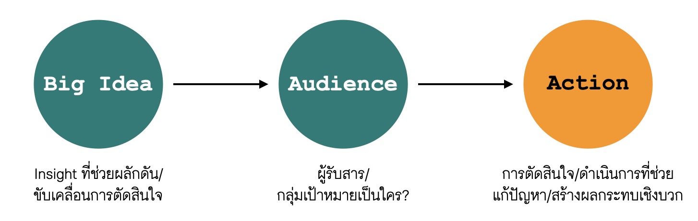


## 1. ทำความเข้าใจบริบท (Understand the Context) {.smaller}

<div style="font-size: 0.7em;">
|**Question**|**Answer**|
|---|----|
|Audient|ครูกะนิด|
|Action| ออกแบบ intervention ที่เหมาะสมในช่วง 2 สัปดาห์ต่อจากนี้|
</div>

<div style="font-size: 0.3em;">
<br>
</div>

:::: {.columns}

::: {.column width="48%"}

<div style="font-size: 0.8em;">

สิ่งที่ครูมี.. ผล Pretest ของนักเรียน (แต่ละข้อตอบถูกได้ 1 คะแนน ตอบผิดได้ 0 คะแนน)

- Vocab: Q1-Q2

- Graph Reading: Q3

- Scientific Reasoning: Q4-Q5

</div>


```{r meanplot_barchart}
library(tidyverse)
library(kableExtra)
result <- tribble(
    ~ item, ~M, ~SD,
    "Q1", 0.80, 0.40,
    "Q2", 0.87, 0.35,
    "Q3", 0.47, 0.51,
    "Q4", 0.13, 0.35,
    "Q5", 0.07, 0.25
)

result |> 
  ggplot(aes(x = item, y = M)) +
  geom_col(fill = "skyblue", col = "black", width = 0.7) +
  ylim(0,1) +
  theme_light(base_size = 28) +
  theme(text = element_text(family = "ChulaCharasNew")) +
  labs(
    title = "Mean Score of Pretest by Item",
    x = "Item",
    y = "Mean Score"
  ) 

```


:::

::: {.column width="2%"}

:::


::: {.column width="48%"}

<div style="font-size: 0.7em;">


```{r skill_table}

# 1) ตารางความรู้พื้นฐาน (3 ด้าน)
basic_skill <- tribble(
  ~domain, ~M, ~SD,
  "ความเข้าใจคำศัพท์วิทยาศาสตร์",        1.67, 0.55,
  "ทักษะการอ่านกราฟ",           0.47, 0.51,
  "การให้เหตุผลเชิงวิทยาศาสตร์", 0.20, 0.41
)

basic_skill |>
  kable(
    col.names = c("ทักษะพื้นฐาน", "M", "SD"),
    digits = 2,
    align = c("l","c","c"),
    caption = "สถิติบรรยายจำแนกตามทักษะ"
  )
```

<br>

```{r pareto_profile}
resp <- tribble(
  ~student, ~Q1, ~Q2, ~Q3, ~Q4, ~Q5,
  "S01", 1,1,1,0,0,
  "S02", 1,1,1,0,0,
  "S03", 1,0,1,0,0,
  "S04", 1,1,1,1,0,
  "S05", 1,1,0,0,0,
  "S06", 0,1,1,0,0,
  "S07", 1,1,1,0,0,
  "S08", 1,1,0,0,0,
  "S09", 0,1,0,0,0,
  "S10",1,1,0,1,0,
  "S11",1,1,1,0,0,
  "S12",1,0,1,0,0,
  "S13",1,1,1,0,0,
  "S14",1,1,0,0,1,
  "S15",0,1,1,0,0,
  "S16",1,1,0,0,0,
  "S17",1,1,1,0,0,
  "S18",0,1,1,0,0,
  "S19",1,1,0,0,0,
  "S20",1,1,1,0,1,
  "S21",1,0,0,0,0,
  "S22",0,1,0,0,0,
  "S23",1,1,1,0,0,
  "S24",1,1,1,0,0,
  "S25",1,1,0,0,0,
  "S26",0,0,0,0,0,
  "S27",1,1,1,0,0,
  "S28",1,1,1,1,0,
  "S29",1,1,0,1,0,
  "S30",1,1,0,0,0
)

profile <- resp %>%
  mutate(
    keyword_prop = (Q1 == 0 & Q2 == 0),
    graph_prob = Q3 == 0,
    sci_prob   = (Q4 == 0 & Q5 == 0),
    profile = case_when(
      !keyword_prop & !graph_prob & !sci_prob ~ "No_problem",
      keyword_prop & !graph_prob & !sci_prob ~ "Keyword_problem",
      graph_prob & sci_prob ~ "Graph + Sci",
      !keyword_prop & !graph_prob & sci_prob ~ "Sci_only",
      graph_prob & !sci_prob & !keyword_prop ~ "Graph_only",
      TRUE ~ "ALL_three"
    )
  )

pareto <- profile %>% 
  count(profile, sort = TRUE) %>%
  mutate(cum_pct = cumsum(n) / sum(n)) |> 
  ggplot(aes(x = reorder(profile, -n), y = n)) +
  geom_col(fill = "orange", col = "black", width = 0.7) +
  geom_line(aes(y = cum_pct * max(n)), group = 1, color = "black", linewidth = 1) +
  geom_point(aes(y = cum_pct * max(n)), color = "black", size
 = 2) +
  scale_y_continuous(

    name = "จำนวนนักเรียน",
    sec.axis = sec_axis(~ . / max(.) , name = "ร้อยละสะสม", labels = scales::percent)
  ) +
  theme_light(base_size = 22) +
  theme(text = element_text(family = "ChulaCharasNew"),
  panel.grid.minor = element_blank()) +
  labs(
    title = "Profile ปัญหาของนักเรียนจากผล Pretest",
    x = "\n Profile ของปัญหา"
  )

pareto
```

</div>

:::

::::

## 1. ทำความเข้าใจบริบท: Big Idea (1) {.smaller}

Big Idea คือสาระสำคัญที่ครูต้องการสื่อสารผ่านข้อมูล เพื่อให้ผู้รับสารเข้าใจ และสามารถนำไปใช้ประโยชน์ได้

> Big Idea = Insight + Context + Professional Judgment

:::: {.columns}

::: {.column width="48%"}

```{r}
result |> 
  ggplot(aes(x = item, y = M)) +
  geom_col(fill = "skyblue", col = "black", width = 0.7) +
  ylim(0,1) +
  theme_light(base_size = 28) +
  theme(text = element_text(family = "ChulaCharasNew")) +
  labs(
    title = "Mean Score of Pretest by Item",
    x = "Item",
    y = "Mean Score"
  ) 
```

:::

::: {.column width="2%"}

:::

::: {.column width="48%"}

> Big Idea ที่ขาดบริบทและการตัดสินใจเชิงวิชาชีพ ไม่สามารถนำไปสู่ Action ที่เหมาะสม

- คะแนน Q1-Q2 มีค่าเฉลี่ยสูงมาก ส่วน Q3 มีค่าเฉลี่ยปานกลาง

- คะแนน Q4-Q5 มีค่าเฉลี่ยต่ำมาก


:::

::::


## 1. ทำความเข้าใจบริบท: Big Idea (2) {.smaller}

Big Idea คือสาระสำคัญที่ครูต้องการสื่อสารผ่านข้อมูล เพื่อให้ผู้รับสารเข้าใจ และสามารถนำไปใช้ประโยชน์ได้

> Big Idea = Insight + Context + Professional Judgment

:::: {.columns}

::: {.column width="48%"}

```{r}
result |> 
  ggplot(aes(x = item, y = M)) +
  geom_col(fill = "skyblue", col = "black", width = 0.7) +
  ylim(0,1) +
  theme_light(base_size = 28) +
  theme(text = element_text(family = "ChulaCharasNew")) +
  labs(
    title = "Mean Score of Pretest by Item",
    x = "Item",
    y = "Mean Score"
  ) 
```

:::

::: {.column width="2%"}

:::

::: {.column width="48%"}

<div style="font-size: 0.8em;">

Big Idea ที่มี Insight + Context + Professional Judgement

- โดยเฉลี่ย Q1, Q2 มีคะแนนสูง แสดงว่านักเรียนส่วนใหญ่จดจำคำศัพท์ได้

- Q3 มีค่าเฉลี่ยใกล้ 0.5 สะท้อนว่าทักษะการอ่านกราฟในชั้นเรียนยังทำได้ไม่สม่ำเสมอ

- Q4, Q5 มีค่าเฉลี่ยต่ำมาก แสดงว่าการให้เหตุผลเชิงวิทยาศาสตร์เป็นจุดอ่อนหลักของชั้นเรียน

ดังนั้นภายใต้ระยะเวลา 2 สัปดาห์ต่อไปนี้ควรออกแบบ intervention ที่เน้นเสริมทักษะด้านการให้เหตุผลเชิงวิทยาศาสตร์ให้กับนักเรียนเป็นหลัก และมีการเสริมทักษะการอ่านกราฟประกอบ

</div>

:::

::::


## 1. ทำความเข้าใจบริบท: Big Idea (3) {.smaller}

Big Idea คือสาระสำคัญที่ครูต้องการสื่อสารผ่านข้อมูล เพื่อให้ผู้รับสารเข้าใจ และสามารถนำไปใช้ประโยชน์ได้

> การเลือก Insight ส่งผลโดยตรงต่อคุณภาพของ Big Idea

:::: {.columns}

::: {.column width="48%"}

```{r}
pareto
```

:::

::: {.column width="2%"}

:::

::: {.column width="48%"}

- ปัญหาหลักของห้องคือการให้เหตุผลเชิงวิทยาศาสตร์

- การอ่านกราฟเป็นปัญหาร่วมที่สำคัญ

- Intervention ที่เหมาะคือ

  - เน้นการให้เหตุผลเชิงวิทยาศาสตร์ที่ใช้ข้อมูลจากกราฟสนับสนุน

  - ถ้าจำเป็น – เสริมความรู้/ทักษะการอ่านกราฟเฉพาะกลุ่มที่มีปัญหา

:::

::::

## สรุป {.smaller}

<div style="font-size: 0.9em;">

|**Question**|**Answer**|
|--|----|
|Audient|ครูกะนิด|
|Action| ออกแบบ intervention ที่เหมาะสมในช่วง 2 สัปดาห์ต่อจากนี้|
|Big Idea|1.  ปัญหาหลักของห้องคือการให้เหตุผลเชิงวิทยาศาสตร์ <br> 2. การอ่านกราฟเป็นปัญหาร่วมที่สำคัญ <br> 3. Intervention ที่น่าจะนำมาใช้คือ <br> - เน้นการให้เหตุผลเชิงวิทยาศาสตร์ที่ใช้ข้อมูลจากกราฟสนับสนุน <br> - ถ้าจำเป็น -- เสริมความรู้/ทักษะการอ่านกราฟเฉพาะกลุ่มที่มีปัญหา <br> - ควรสื่อสารข้อมูลความพร้อมในการเรียนนี้ให้นักเรียนในชั้นเรียนทราบด้วย เพื่อสร้างความเข้าใจและความตระหนักในการพัฒนาตนเอง |

</div>

## 1. ทำความเข้าใจบริบทสำหรับกลุ่มเป้าหมายนักเรียน {.smaller}


> การสื่อสารข้อมูลการเรียนรู้ให้นักเรียนในชั้นเรียน เป็นกลยุทธ์หนึ่งใน intervention ของครูกะนิด


:::: {.columns}

::: {.column width="48%"}

```{r fig.width = 6, fig.height=4}
library(tidyverse)

resp <- tribble(
  ~student, ~Q1, ~Q2, ~Q3, ~Q4, ~Q5,
  "S01", 1,1,1,0,0,
  "S02", 1,1,1,0,0,
  "S03", 1,0,1,0,0,
  "S04", 1,1,1,1,0,
  "S05", 1,1,0,0,0,
  "S06", 0,1,1,0,0,
  "S07", 1,1,1,0,0,
  "S08", 1,1,0,0,0,
  "S09", 0,1,0,0,0,
  "S10",1,1,0,1,0,
  "S11",1,1,1,0,0,
  "S12",1,0,1,0,0,
  "S13",1,1,1,0,0,
  "S14",1,1,0,0,1,
  "S15",0,1,1,0,0,
  "S16",1,1,0,0,0,
  "S17",1,1,1,0,0,
  "S18",0,1,1,0,0,
  "S19",1,1,0,0,0,
  "S20",1,1,1,0,1,
  "S21",1,0,0,0,0,
  "S22",0,1,0,0,0,
  "S23",1,1,1,0,0,
  "S24",1,1,1,0,0,
  "S25",1,1,0,0,0,
  "S26",0,0,0,0,0,
  "S27",1,1,1,0,0,
  "S28",1,1,1,1,0,
  "S29",1,1,0,1,0,
  "S30",1,1,0,0,0
)

profile <- resp %>%
  mutate(
    keyword_prop = (Q1 == 0 & Q2 == 0),
    graph_prob = Q3 == 0,
    sci_prob   = (Q4 == 0 & Q5 == 0),
    profile = case_when(
      !keyword_prop & !graph_prob & !sci_prob ~ "No_problem",
      keyword_prop & !graph_prob & !sci_prob ~ "Keyword_problem",
      graph_prob & sci_prob ~ "Graph + Sci",
      !keyword_prop & !graph_prob & sci_prob ~ "Sci_only",
      graph_prob & !sci_prob & !keyword_prop ~ "Graph_only",
      TRUE ~ "ALL_three"
    )
  )

pareto <- profile %>% 
  count(profile, sort = TRUE) %>%
  mutate(cum_pct = cumsum(n) / sum(n)) |> 
  ggplot(aes(x = reorder(profile, -n), y = n)) +
  geom_col(fill = "orange", col = "black", width = 0.7) +
  geom_line(aes(y = cum_pct * max(n)), group = 1, color = "black", linewidth = 1) +
  geom_point(aes(y = cum_pct * max(n)), color = "black", size
 = 2) +
  scale_y_continuous(

    name = "จำนวนนักเรียน",
    sec.axis = sec_axis(~ . / max(.) , name = "ร้อยละสะสม", labels = scales::percent)
  ) +
  theme_light(base_size = 18) +
  theme(text = element_text(family = "ChulaCharasNew"),
  panel.grid.minor = element_blank()) +
  labs(
    title = "Profile ปัญหาของนักเรียนจากผล Pretest",
    x = "\n Profile ของปัญหา"
  )

pareto

```


<div style="font-size: 0.75em;">

|**Question**|**Answer**|
|--|----|
|Audient|นักเรียน ม.2 ชั้นเรียนนี้|
|Action| 1. มีเข้าใจและตระหนักในการพัฒนาการเรียนรู้ของตนเอง <br> 2. ให้ความร่วมมือในการพัฒนาตนเองตาม profile|

</div>

:::

::: {.column width="2%"}

:::


::: {.column width="48%"}

<div style="font-size: 0.8em;">

**Big Idea**

- ระดับชั้นเรียน : Pareto Chart ช่วยบอกว่าทักษะการให้เหตุผลเชิงวิทยาศาสตร์ เป็นจุดที่ชั้นเรียนของเราต้องเร่งพัฒนา นักเรียนบางส่วนต้องเสริมการอ่านกราฟควบคู่กันไปด้วย 

- ระดับนักเรียน : แจก profile ส่วนตัว หรือแจกการ์ด/ใบงาน/กิจกรรม ที่บอกนักเรียนแต่ละคนว่าอยู่ในเส้นทางการพัฒนาตนเองแบบไหน

</div>

```{r}
set.seed(1235696)
profile |> 
  filter(profile != "No_problem") |> 
  select(student, profile) |> 
  sample_n(5)
```


:::

::::

## กระบวนการสื่อสารข้อมูล {.smaller}

> กระบวนการสื่อสารข้อมูลไม่ใช่ลำดับการวิเคราะห์ ไม่ใช่ลำดับการสร้างกราฟ แต่เป็นลำดับการคิดเพื่อสื่อสารข้อมูล


1. Understand the Context

2. Choose the Appropriate Visual

3. Eleminate Unnecessary Details

4. Focus Attention

5. Tell A Story

## 2. Choose the Appropriate Visual (1) {.smaller}

> ประเด็นหนึ่งที่ควรพิจารณาคือ บริบทของการนำเสนอข้อมูล

<center>
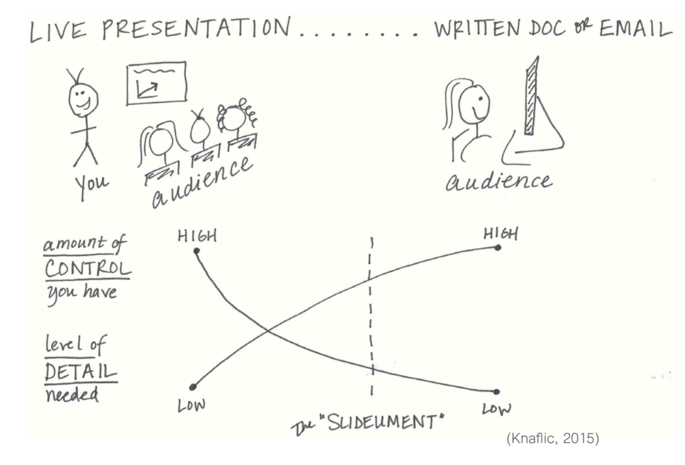{width="65%"}
</center>

## 2. Choose the Appropriate Visual (2) {.smaller}

:::: {.columns}

::: {.column width="40%"}

> รูปแบบการนำเสนอข้อมูลมีหลายประเภท ขึ้นกับบริบทและวัตถุประสงค์ของการสื่อสารข้อมูล

- บอกเล่า

- ข้อความ

- ตาราง

- แผนภาพ

:::

::: {.column width="2%"}

:::

::: {.column width="58%"}

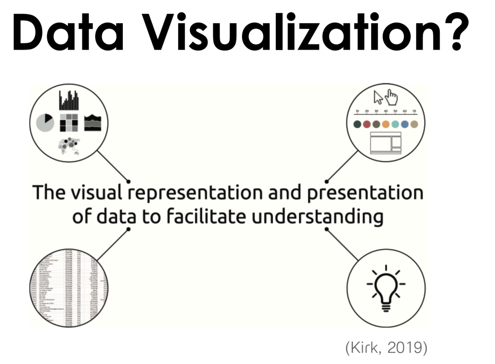

:::

::::

## 2. Choose the Appropriate Visual (3) {.smaller}

<center>
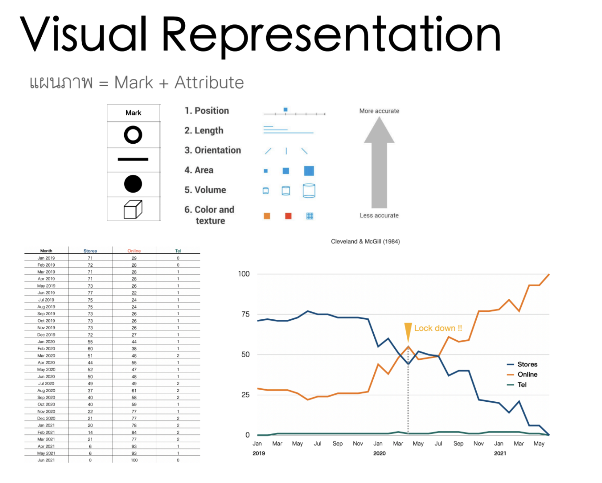{width="70%"}
</center>

## 2. Choose the Appropriate Visual (4) {.smaller}

<center>
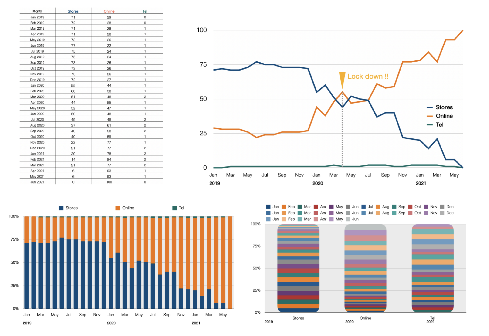{width="80%"}
</center>


## 2. Choose an Appropriate Visual: Why's Visual (1) {.smaller}

<center>
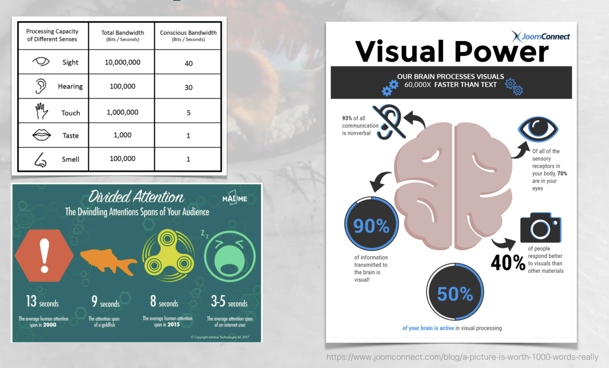{width="80%"}
</center>


## 2. Choose an Appropriate Visual: Why's Visual (2) {.smaller}

<center>
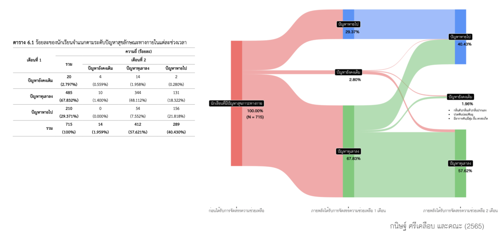{width="80%"}
</center>


## 2. Choose an Appropriate Visual: Type of Visualization (1) {.smaller}

<center>
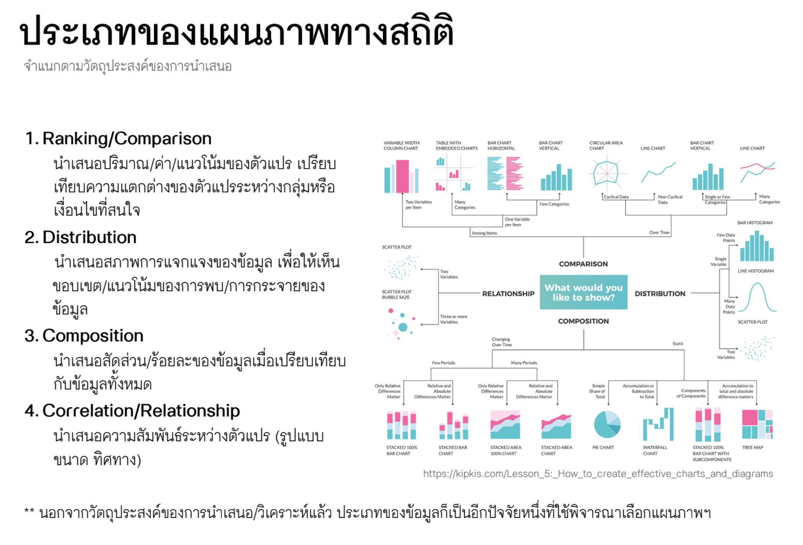{width="80%"}
</center>


## 2. Choose an Appropriate Visual: Type of Visualization (2) {.smaller}

<center>
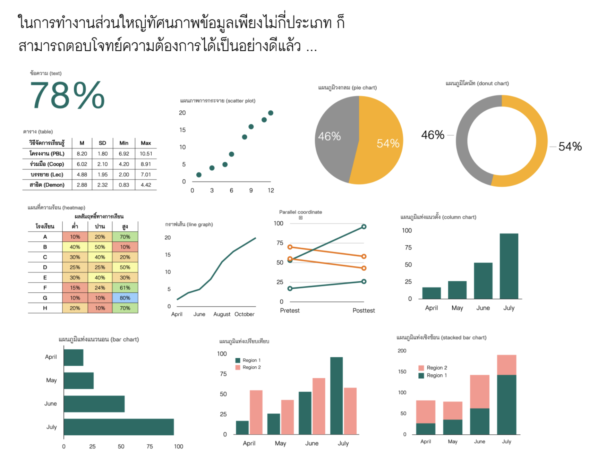{width="75%"}
</center>


## 2. Choose an Appropriate Visual {.smaller}

> เงื่อนไขสำคัญ : Big Idea ที่ชัดเจน 

|ปัจจัยที่ใช้พิจารณา|รายละเอียด|
|--|-----|
|วัตถุประสงค์ของการสื่อสาร|- เน้นตัวเลข/สาระสำคัญเพียงตัวเดียว <br> - เปรียบเทียบ/แสดงความสัมพันธ์/นำเสนอแนวโน้ม|
|บริบทการนำเสนอ|- นำเสนอสด (live presentation) <br> - นำเสนอผ่านสื่อ -- เอกสาร คลิปวีดิโอสั้น หรือสื่อลักษณะอื่น|
|ผู้ฟัง/ผู้รับสาร|ความคาดหวัง ความคุ้นเคยกับกราฟหรือสถิติแต่ละประเภท ของผู้รับสาร|
|ลักษณะข้อมูล|ข้อมูลเชิงปริมาณ vs ข้อมูลจัดประเภท |


## Simple Text {.smaller}

<center>
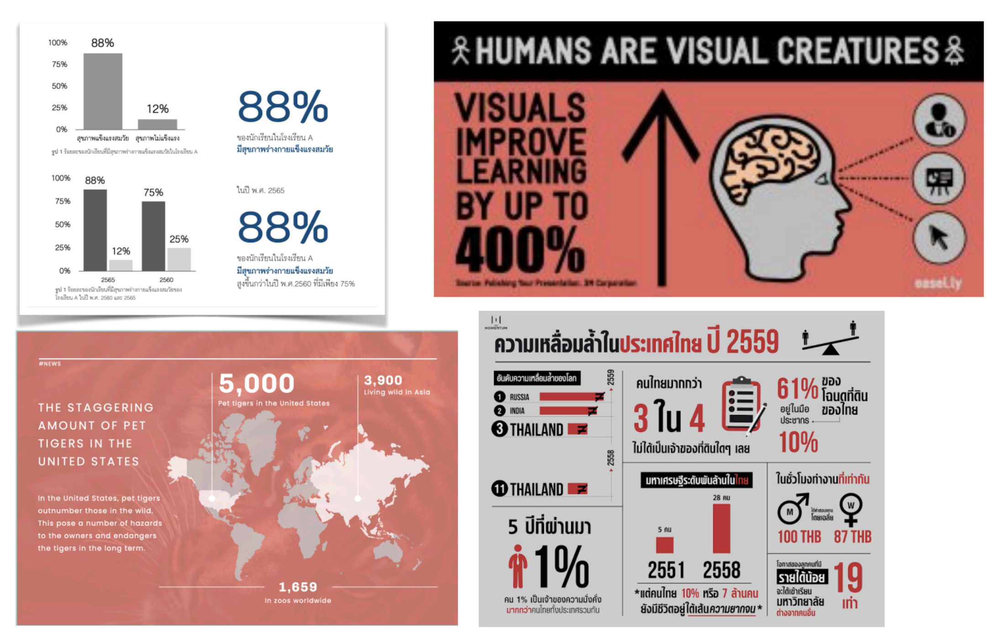{width="80%"}
</center>

## Heatmap (1) {.smaller}

<div style="font-size: 1.0em;">
```{r fig.width = 5, fig.height=6}
resp_long <- resp %>%
  pivot_longer(Q1:Q5, names_to = "item", values_to = "correct")

ggplot(resp_long,
       aes(x = item, y = fct_rev(student), fill = factor(correct))) +
  geom_tile(color = "grey90") +
  scale_fill_manual(values = c("0" = "white", "1" = "steelblue"),
                    labels = c("ผิด","ถูก"),
                    name = "ผลการตอบ") +
  labs(x = NULL, y = "นักเรียน") +
  theme_minimal() +
  theme(text = element_text(family = "ChulaCharasNew"),
        base_size = 28) +
  theme(panel.grid = element_blank())
```

</div>

## Heatmap (2) {.smaller}


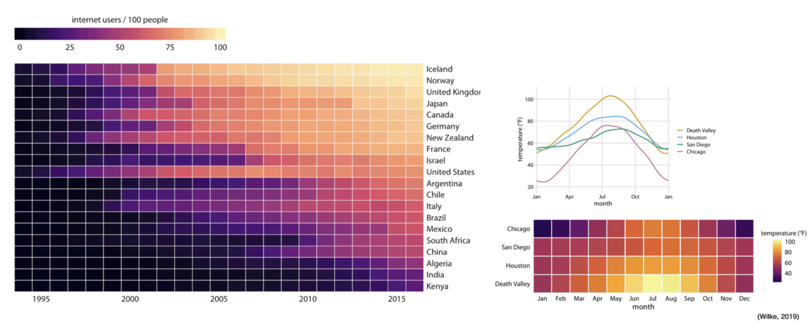


## Barchart (1) {.smaller}

<center>
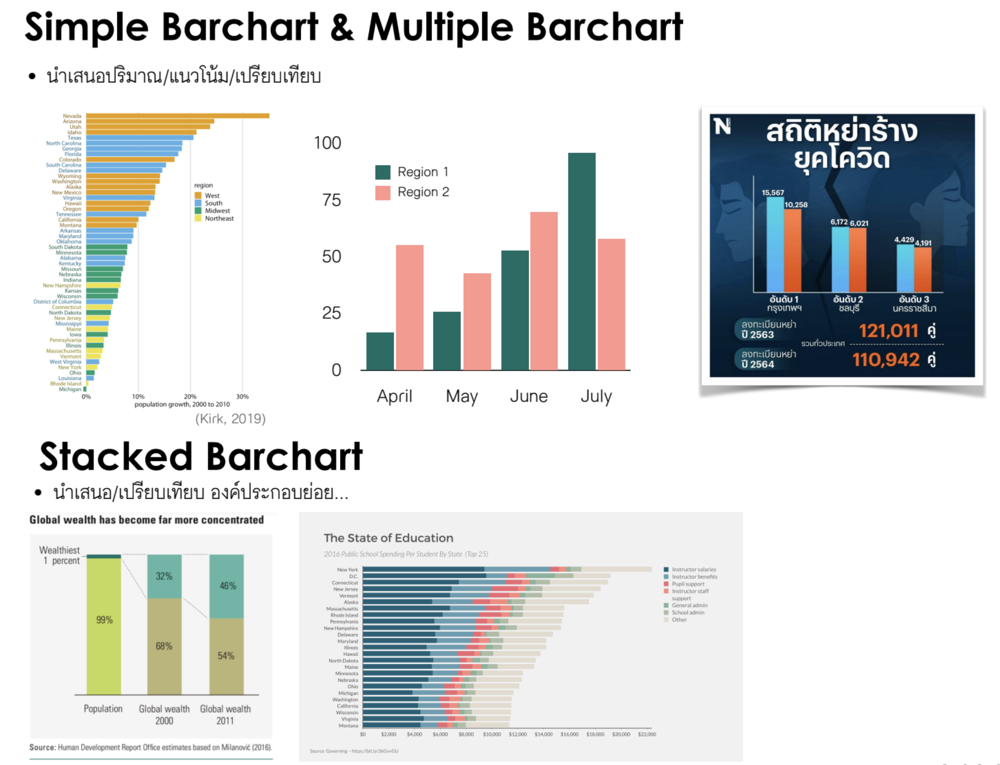{width="70%"}
</center>

## Barchart (2) {.smaller}

:::: {.columns}

::: {.column width="40%"}

<center>
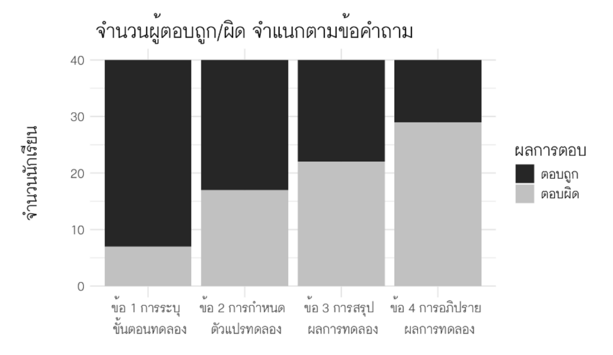{width="80%"}
</center>

```{r fig.width = 6, fig.height=4}
library(tidyverse)

resp <- tribble(
  ~student, ~Q1, ~Q2, ~Q3, ~Q4, ~Q5,
  "S01", 1,1,1,0,0,
  "S02", 1,1,1,0,0,
  "S03", 1,0,1,0,0,
  "S04", 1,1,1,1,0,
  "S05", 1,1,0,0,0,
  "S06", 0,1,1,0,0,
  "S07", 1,1,1,0,0,
  "S08", 1,1,0,0,0,
  "S09", 0,1,0,0,0,
  "S10",1,1,0,1,0,
  "S11",1,1,1,0,0,
  "S12",1,0,1,0,0,
  "S13",1,1,1,0,0,
  "S14",1,1,0,0,1,
  "S15",0,1,1,0,0,
  "S16",1,1,0,0,0,
  "S17",1,1,1,0,0,
  "S18",0,1,1,0,0,
  "S19",1,1,0,0,0,
  "S20",1,1,1,0,1,
  "S21",1,0,0,0,0,
  "S22",0,1,0,0,0,
  "S23",1,1,1,0,0,
  "S24",1,1,1,0,0,
  "S25",1,1,0,0,0,
  "S26",0,0,0,0,0,
  "S27",1,1,1,0,0,
  "S28",1,1,1,1,0,
  "S29",1,1,0,1,0,
  "S30",1,1,0,0,0
)

profile <- resp %>%
  mutate(
    keyword_prop = (Q1 == 0 & Q2 == 0),
    graph_prob = Q3 == 0,
    sci_prob   = (Q4 == 0 & Q5 == 0),
    profile = case_when(
      !keyword_prop & !graph_prob & !sci_prob ~ "No_problem",
      keyword_prop & !graph_prob & !sci_prob ~ "Keyword_problem",
      graph_prob & sci_prob ~ "Graph + Sci",
      !keyword_prop & !graph_prob & sci_prob ~ "Sci_only",
      graph_prob & !sci_prob & !keyword_prop ~ "Graph_only",
      TRUE ~ "ALL_three"
    )
  )

pareto <- profile %>% 
  count(profile, sort = TRUE) %>%
  mutate(cum_pct = cumsum(n) / sum(n)) |> 
  ggplot(aes(x = reorder(profile, -n), y = n)) +
  geom_col(fill = "orange", col = "black", width = 0.7) +
  geom_line(aes(y = cum_pct * max(n)), group = 1, color = "black", linewidth = 1) +
  geom_point(aes(y = cum_pct * max(n)), color = "black", size
 = 2) +
  scale_y_continuous(

    name = "จำนวนนักเรียน",
    sec.axis = sec_axis(~ . / max(.) , name = "ร้อยละสะสม", labels = scales::percent)
  ) +
  theme_light(base_size = 18) +
  theme(text = element_text(family = "ChulaCharasNew"),
  panel.grid.minor = element_blank()) +
  labs(
    title = "Profile ปัญหาของนักเรียนจากผล Pretest",
    x = "\n Profile ของปัญหา"
  )

pareto

```

:::

::: {.column width="2%"}

:::

::: {.column width="58%"}

<center>
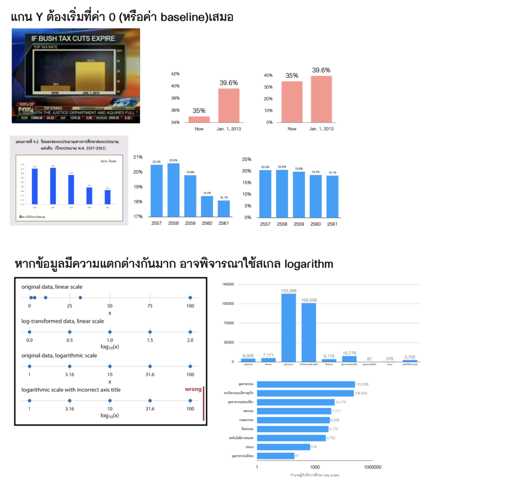{width="80%"}
</center>

:::

::::

## Barchart (3) {.smaller}

<center>
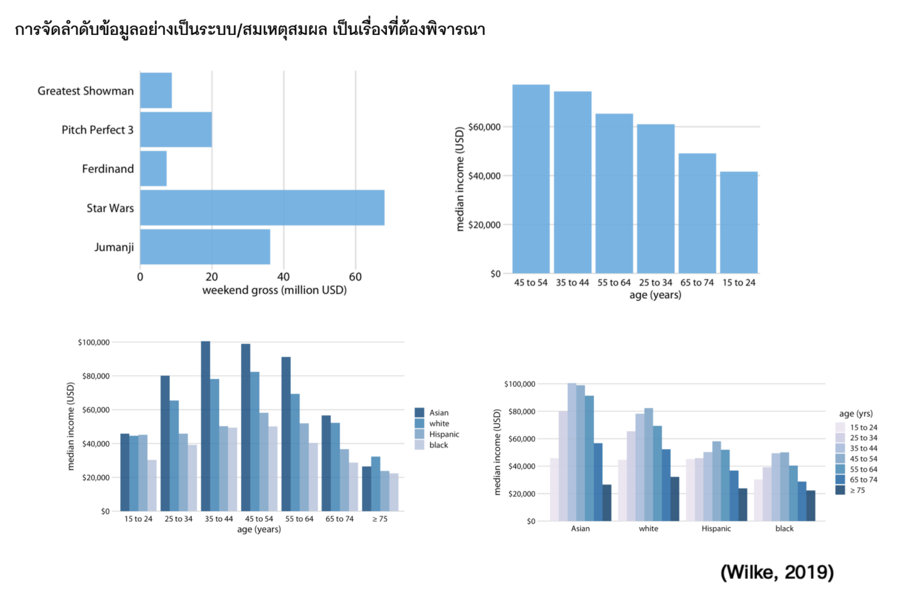{width="80%"}
</center>


## Barchart (4) {.smaller}

<center>
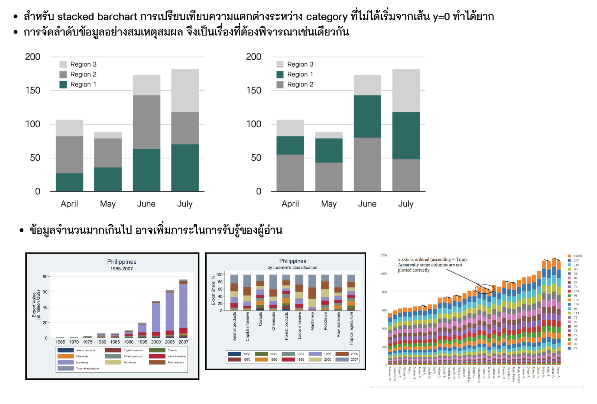{width="80%"}
</center>

## Barchart (5) {.smaller}

<center>
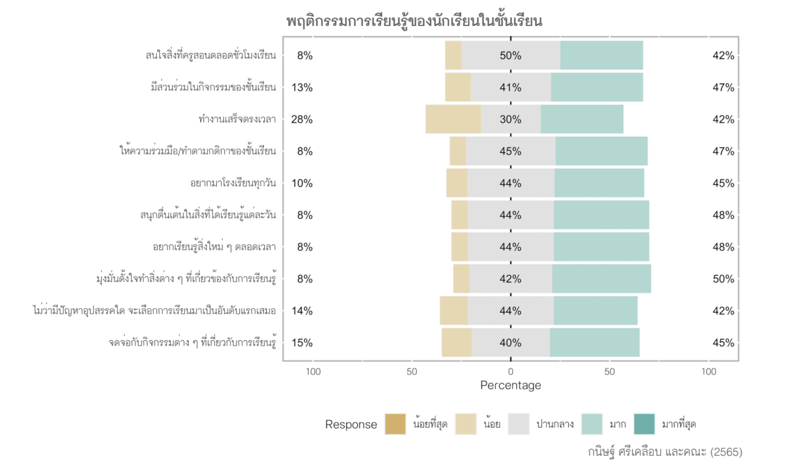{width="80%"}
</center>

## Piechart (1) {.smaller}

<center>
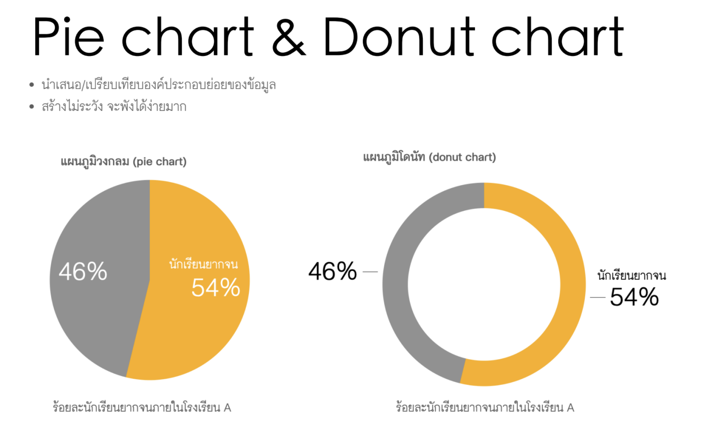{width="80%"}
</center>


## Piechart (2) {.smaller}

<center>
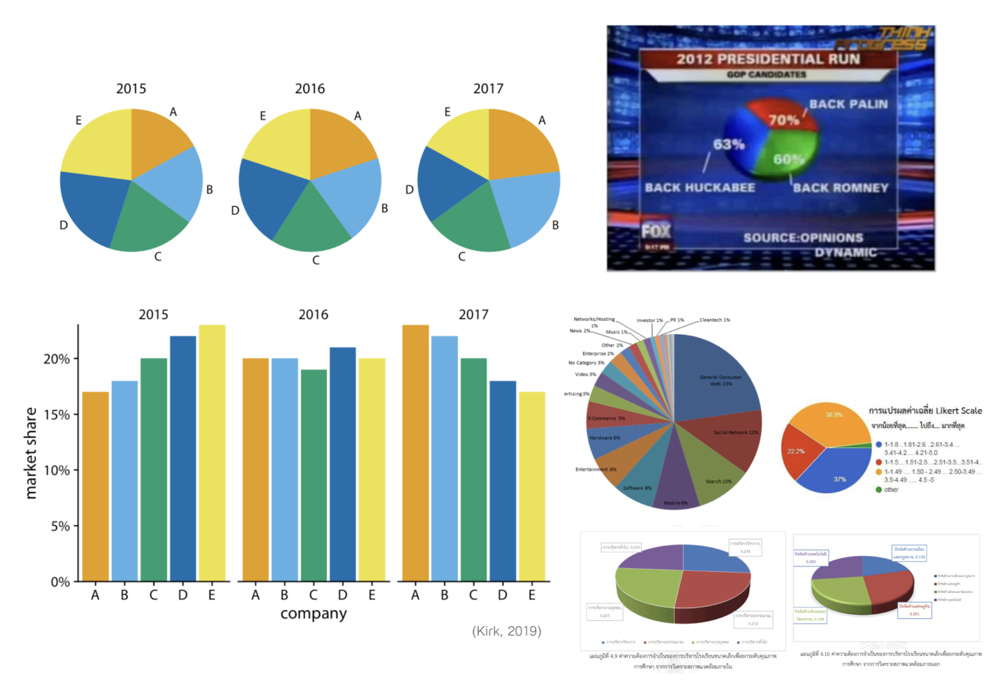{width="80%"}
</center>


## 2. Wrap up: Choose Appropriate Visual (1) {.smaller}


:::: {.columns}

::: {.column width="48%"}


```{r fig.width = 6, fig.height=4}
library(tidyverse)

resp <- tribble(
  ~student, ~Q1, ~Q2, ~Q3, ~Q4, ~Q5,
  "S01", 1,1,1,0,0,
  "S02", 1,1,1,0,0,
  "S03", 1,0,1,0,0,
  "S04", 1,1,1,1,0,
  "S05", 1,1,0,0,0,
  "S06", 0,1,1,0,0,
  "S07", 1,1,1,0,0,
  "S08", 1,1,0,0,0,
  "S09", 0,1,0,0,0,
  "S10",1,1,0,1,0,
  "S11",1,1,1,0,0,
  "S12",1,0,1,0,0,
  "S13",1,1,1,0,0,
  "S14",1,1,0,0,1,
  "S15",0,1,1,0,0,
  "S16",1,1,0,0,0,
  "S17",1,1,1,0,0,
  "S18",0,1,1,0,0,
  "S19",1,1,0,0,0,
  "S20",1,1,1,0,1,
  "S21",1,0,0,0,0,
  "S22",0,1,0,0,0,
  "S23",1,1,1,0,0,
  "S24",1,1,1,0,0,
  "S25",1,1,0,0,0,
  "S26",0,0,0,0,0,
  "S27",1,1,1,0,0,
  "S28",1,1,1,1,0,
  "S29",1,1,0,1,0,
  "S30",1,1,0,0,0
)

profile <- resp %>%
  mutate(
    keyword_prop = (Q1 == 0 & Q2 == 0),
    graph_prob = Q3 == 0,
    sci_prob   = (Q4 == 0 & Q5 == 0),
    profile = case_when(
      !keyword_prop & !graph_prob & !sci_prob ~ "No_problem",
      keyword_prop & !graph_prob & !sci_prob ~ "Keyword_problem",
      graph_prob & sci_prob ~ "Graph + Sci",
      !keyword_prop & !graph_prob & sci_prob ~ "Sci_only",
      graph_prob & !sci_prob & !keyword_prop ~ "Graph_only",
      TRUE ~ "ALL_three"
    )
  )

pareto <- profile %>% 
  count(profile, sort = TRUE) %>%
  mutate(cum_pct = cumsum(n) / sum(n)) |> 
  ggplot(aes(x = reorder(profile, -n), y = n)) +
  geom_col(fill = "orange", col = "black", width = 0.7) +
  geom_line(aes(y = cum_pct * max(n)), group = 1, color = "black", linewidth = 1) +
  geom_point(aes(y = cum_pct * max(n)), color = "black", size
 = 2) +
  scale_y_continuous(

    name = "จำนวนนักเรียน",
    sec.axis = sec_axis(~ . / max(.) , name = "ร้อยละสะสม", labels = scales::percent)
  ) +
  theme_light(base_size = 18) +
  theme(text = element_text(family = "ChulaCharasNew"),
  panel.grid.minor = element_blank()) +
  labs(
    title = "Profile ปัญหาของนักเรียนจากผล Pretest",
    x = "\n Profile ของปัญหา"
  )

pareto

```


<div style="font-size: 0.8em;">

|**Question**|**Answer**|
|--|----|
|Audient|นักเรียน ม.2 ชั้นเรียนนี้|
|Action| 1. มีความตระหนักในการพัฒนาการเรียนรู้ของตนเอง <br> 2. ให้ความร่วมมือในการพัฒนาตนเองตาม profile|

</div>

:::

::: {.column width="2%"}

:::


::: {.column width="48%"}

<div style="font-size: 0.8em;">

**Big Idea**

- <mark>ระดับชั้นเรียน : Pareto Chart ช่วยบอกว่าทักษะการให้เหตุผลเชิงวิทยาศาสตร์ เป็นจุดที่ชั้นเรียนของเราต้องเร่งพัฒนา นักเรียนบางส่วนต้องเสริมการอ่านกราฟควบคู่กันไปด้วย </mark>

- ระดับนักเรียน : แจก profile ส่วนตัว หรือแจกการ์ด/ใบงาน/กิจกรรม ที่บอกนักเรียนแต่ละคนว่าอยู่ในเส้นทางการพัฒนาตนเองแบบไหน


**Choose the Appropriate Visual**

ระดับชั้นเรียน : 

- ใช้ Pareto Chart เพื่อบอกชั้นเรียนว่าปัญหาหลัก/จุดที่ต้องพัฒนาคืออะไร

- Live Presentation

- ควรปรับ mood and tone ของแผนภาพในเชิงการให้ข้อมูลเพื่อพัฒนามากกว่าการบอกว่าใครอ่อน

</div>

:::

::::

## 2. Wrap up: Choose Appropriate Visual (2) {.smaller}

:::: {.columns}

::: {.column width="48%"}

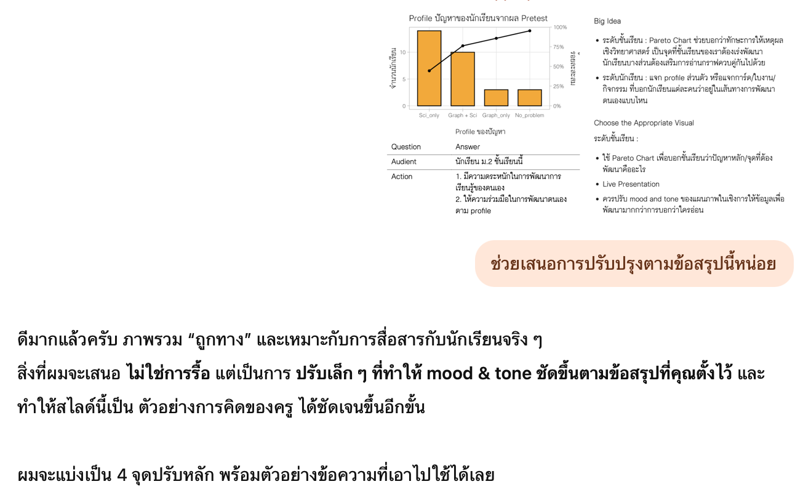

:::

::: {.column width="2%"}

:::

::: {.column width="48%"}

<div style="font-size: 0.8em;">

- ชี้แจง/เขียนสถานะของแผนภาพให้ชัดเจนว่าเป็นระดับชั้นเรียน ไม่ใช่รายบุคคล เช่น "แผนภาพนี้เป็นภาพรวมของทั้งห้อง เพื่อช่วยชี้แจงลักษณะการพัฒนาทักษะที่จำเป็นสำหรับชั้นเรียน"

- ปรับคำในแผนภาพจาก ปัญหา ---> ประเด็นการพัฒนา

  - ปรับชื่อแผนภาพ "การจำแนกประเภทความต้องการพัฒนาทักษะจำเป็นของชั้นเรียน"

  - แก้ไขแกน x ให้เป็น "ประเด็นการพัฒนา"

- ใช้สีเดียวกันทุกแท่ง เช่น (ส้มอ่อน น้ำเงินอ่อน) ไม่ highlight ไม่ทำ gradient

- ปรับ text label

  - Sci_only --> เสริมทักษะการให้เหตุผลเชิงวิทยาศาสตร์

  - Graph + Sci --> เสริมทักษะการอ่านกราฟและการให้เหตุผลเชิงวิทยาศาสตร์

  - Graph_only --> เสริมทักษะการอ่านกราฟ

  - No_problem --> พร้อมต่อยอด

</div>

:::

::::

## 2. Wrap up: Choose Appropriate Visual (3) {.smaller}

```{r}
library(tidyverse)
library(scales)

# 1) เตรียม label แบบ “ทักษะที่ควรเสริม” (ไม่ตีตรา)
profile_labels <- c(
  "Sci_only"    = "เสริมการให้เหตุผล",
  "Graph + Sci" = "เสริมอ่านกราฟ + การให้เหตุผล",
  "Graph_only"  = "เสริมการอ่านกราฟ",
  "No_problem"  = "พร้อมต่อยอด",
  "ALL_three"   = "เสริมพื้นฐานหลายด้าน",
  "Keyword_problem" = "เสริมคำศัพท์"
)

order_levels <- c(
  "เสริมการให้เหตุผล",
  "เสริมอ่านกราฟ + การให้เหตุผล",
  "เสริมการอ่านกราฟ",
  "พร้อมต่อยอด"
)

pareto_plot <- profile %>%
  count(profile, sort = TRUE) %>%
  mutate(
    cum_pct = cumsum(n) / sum(n),
    profile_show = recode(profile, !!!profile_labels),
    profile_show = factor(profile_show, levels = order_levels)
  ) %>%
  ggplot(aes(x = reorder(profile_show, -n), y = n)) +
  geom_col(fill = "steelblue", color = "grey25", width = 0.75) +
  geom_line(aes(y = cum_pct * max(n), group = 1),
            color = "grey30", linewidth = 0.9) +
  geom_point(aes(y = cum_pct * max(n)),
             color = "grey30", size = 2) +
  scale_y_continuous(
    name = "จำนวนนักเรียน",
    sec.axis = sec_axis(~ . / max(.) ,
                        name = "ร้อยละสะสม",
                        labels = percent)
  ) +
  labs(
    title = "Profile การพัฒนาทักษะจำเป็นของนักเรียนในชั้นเรียน",
    x = "\n Profile การพัฒนา",
    y = NULL
  ) +
  theme_light(base_size = 18) +
  theme(
    text = element_text(family = "ChulaCharasNew"),
   # panel.grid.minor = element_blank(),
    axis.title.x = element_text(margin = margin(t = 10)),
    plot.title = element_text(face = "bold")
  )

pareto_plot
```


## 3. Eliminate Unnecessary Details {.smaller}

> เป้าหมายหลักคือเพื่อลดภาระทางสมองให้กับผู้รับสาร

- สิ่งที่อาจพิจารณาตัดทิ้งได้ทันที

  - เส้นขอบ/กรอบของแผนภาพ

  - เส้น Grid

  - ทศนิยมที่ไม่จำเป็น

  - ข้อความแนวทแยง หรือข้อความที่ทับซ้อนกันอ่านยาก

- พิจารณาตัดส่วนประกอบที่ไม่เกี่ยวข้องที่อาจสร้างความสับสนต่อผู้รับสาร

## 3. Eliminate Unnecessary Details {.smaller}

<div style="font-size: 0.7em;">

- ตัดเส้นร้อยละสะสมออกเพื่อลดความซับซ้อน/สับสันของนักเรียนชั้น ม.2

- เอา minor gridline ออก

- ปรับ text label ให้ไม่ซ้อนทับกัน

</div>


:::: {.columns}

::: {.column width="48%"}

```{r}
pareto
```

```{r}
pareto_plot
```

:::

::: {.column width="2%"}

:::

::: {.column width="48%"}

```{r}
library(tidyverse)
library(scales)

# 1) เตรียม label แบบ “ทักษะที่ควรเสริม” (ไม่ตีตรา)
profile_labels <- c(
  "Sci_only"    = "เสริมการให้เหตุผล",
  "Graph + Sci" = "เสริมอ่านกราฟ + \n การให้เหตุผล",
  "Graph_only"  = "เสริมการอ่านกราฟ",
  "No_problem"  = "พร้อมต่อยอด",
  "ALL_three"   = "เสริมพื้นฐานหลายด้าน",
  "Keyword_problem" = "เสริมคำศัพท์"
)

order_levels <- c(
  "เสริมการให้เหตุผล",
  "เสริมอ่านกราฟ + \n การให้เหตุผล",
  "เสริมการอ่านกราฟ",
  "พร้อมต่อยอด"
)

pareto_plot <- profile %>%
  count(profile, sort = TRUE) %>%
  mutate(
    cum_pct = cumsum(n) / sum(n),
    profile_show = recode(profile, !!!profile_labels),
    profile_show = factor(profile_show, levels = order_levels)
  ) %>%
  ggplot(aes(x = reorder(profile_show, -n), y = n)) +
  geom_col(fill = "steelblue", color = "grey25", width = 0.75) +
  scale_y_continuous(
    name = "จำนวนนักเรียน"
  ) +
  labs(
    title = "Profile การพัฒนาทักษะจำเป็นของนักเรียนในชั้นเรียน",
    x = "\n Profile การพัฒนา",
    y = NULL
  ) +
  theme_light(base_size = 18) +
  theme(
    text = element_text(family = "ChulaCharasNew"),
    panel.grid.minor = element_blank(),
    axis.title.x = element_text(margin = margin(t = 10)),
    plot.title = element_text(face = "bold")
  )

pareto_plot
```

:::

::::


## 4. Focus Audience Attention (1) {.smaller}

> วัตถุประสงค์เพื่อชี้นำสายตาของผู้รับสารไปยังจุดสำคัญที่สุดของแผนภาพ โดยอาศัยหลักการทำงานของสมองที่เรียกว่า Preattentive Attributes หรือคุณลักษณะที่รับรู้ได้ก่อนการพิจารณา

:::: {.columns}

::: {.column width="25%"}

- ขนาด

- สี

- ตำแหน่ง

:::

::: {.column width="2%"}

:::

::: {.column width="73%"}

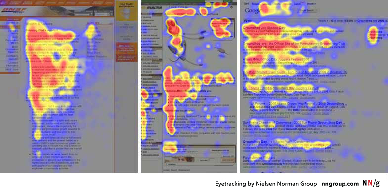

:::


::::


## 4. Focus Audience Attention: Color is Matter {.smaller}

<center>
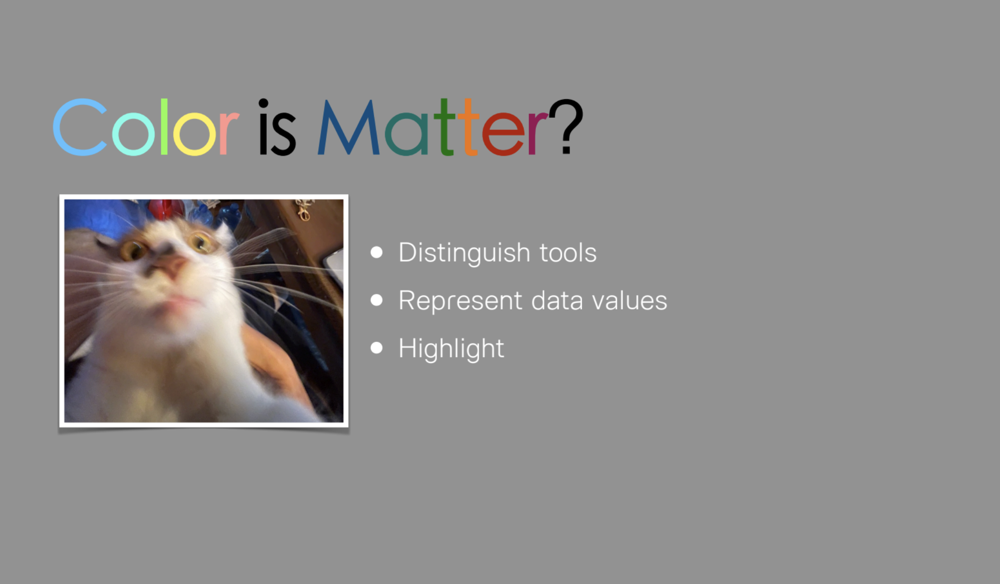{width="80%"}
</center>


## 4. Focus Audience Attention: Color is Matter {.smaller}

<center>
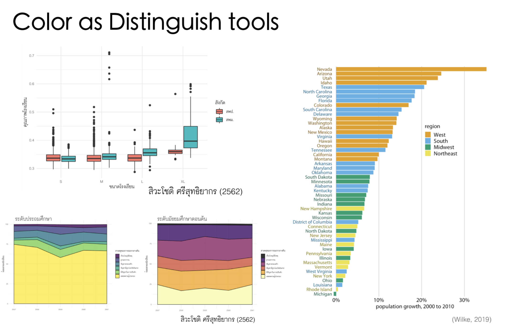{width="80%"}
</center>


## 4. Focus Audience Attention: Color is Matter {.smaller}

<center>
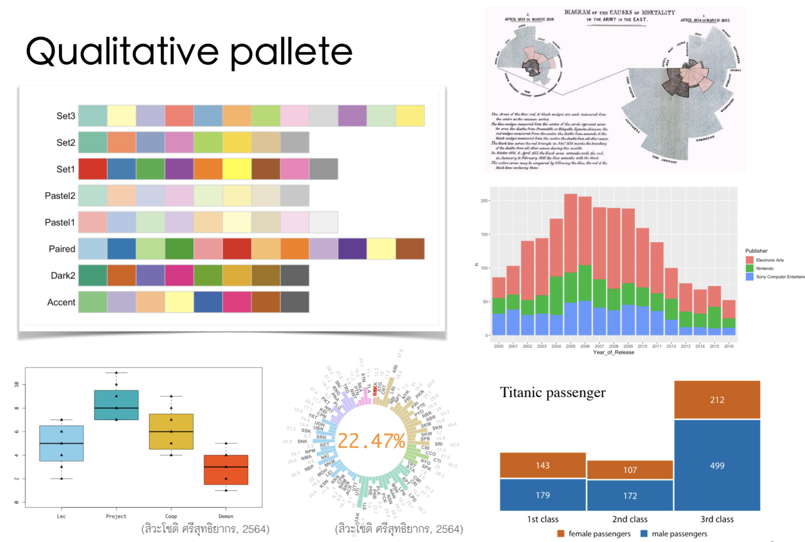{width="80%"}
</center>


## 4. Focus Audience Attention: Color is Matter {.smaller}

Qualitative color palette

```{r}
library(tidyverse)
library(scales)

# 1) เตรียม label แบบ “ทักษะที่ควรเสริม” (ไม่ตีตรา)
profile_labels <- c(
  "Sci_only"    = "เสริมการให้เหตุผล",
  "Graph + Sci" = "เสริมอ่านกราฟ + \n การให้เหตุผล",
  "Graph_only"  = "เสริมการอ่านกราฟ",
  "No_problem"  = "พร้อมต่อยอด",
  "ALL_three"   = "เสริมพื้นฐานหลายด้าน",
  "Keyword_problem" = "เสริมคำศัพท์"
)

order_levels <- c(
  "เสริมการให้เหตุผล",
  "เสริมอ่านกราฟ + \n การให้เหตุผล",
  "เสริมการอ่านกราฟ",
  "พร้อมต่อยอด"
)

pareto_plot <- profile %>%
  count(profile, sort = TRUE) %>%
  mutate(
    cum_pct = cumsum(n) / sum(n),
    profile_show = recode(profile, !!!profile_labels),
    profile_show = factor(profile_show, levels = order_levels)
  ) %>%
  ggplot(aes(x = reorder(profile_show, -n), y = n)) +
  geom_col(aes(fill = profile_show), color = "grey25", width = 0.75) +
  scale_y_continuous(
    name = "จำนวนนักเรียน"
  ) +
  labs(
    title = "การจำแนกประเภทความต้องการพัฒนาทักษะจำเป็นของชั้นเรียน",
    x = "\n ประเภทความต้องการพัฒนา",
    y = NULL
  ) +
  theme_light(base_size = 18) +
  theme(
    legend.position = "none",
    text = element_text(family = "ChulaCharasNew"),
    panel.grid.minor = element_blank(),
    axis.title.x = element_text(margin = margin(t = 10)),
    plot.title = element_text(face = "bold")
  )

pareto_plot
```


## 4. Focus Audience Attention: Color is Matter {.smaller}

<center>
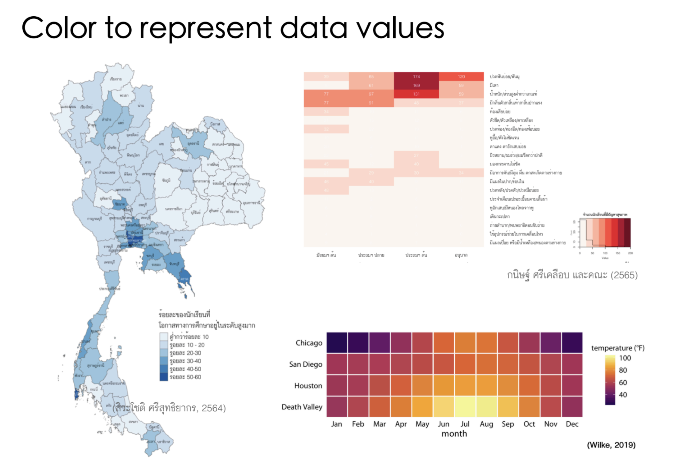{width="80%"}
</center>


## 4. Focus Audience Attention: Color is Matter {.smaller}

<center>
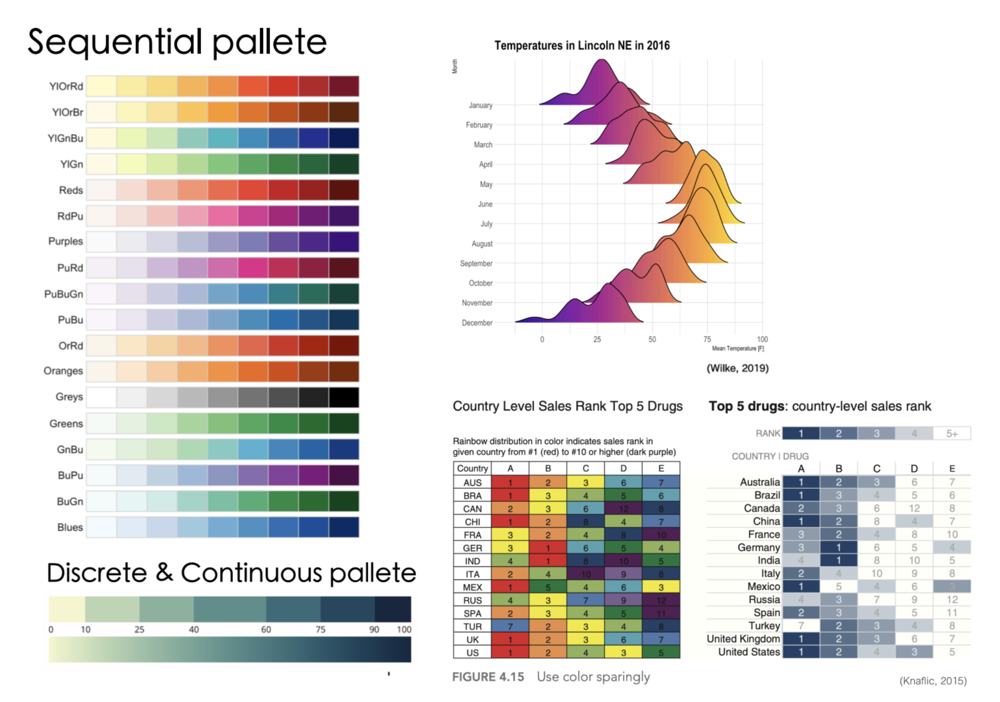{width="80%"}
</center>


## 4. Focus Audience Attention: Color is Matter {.smaller}

<center>
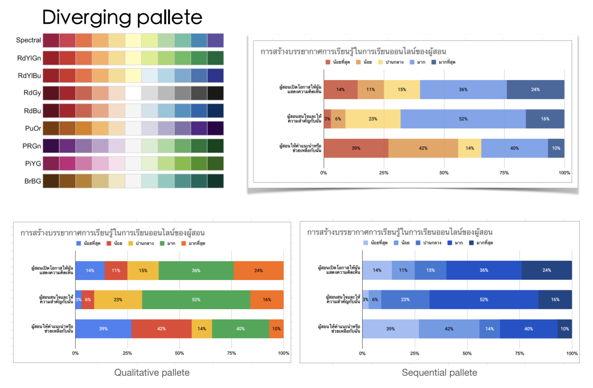{width="80%"}
</center>


## 4. Focus Audience Attention: Color is Matter {.smaller}

Sequential color palette

```{r}
library(tidyverse)
library(scales)

# 1) เตรียม label แบบ “ทักษะที่ควรเสริม” (ไม่ตีตรา)
profile_labels <- c(
  "Sci_only"    = "เสริมการให้เหตุผล",
  "Graph + Sci" = "เสริมอ่านกราฟ + \n การให้เหตุผล",
  "Graph_only"  = "เสริมการอ่านกราฟ",
  "No_problem"  = "พร้อมต่อยอด",
  "ALL_three"   = "เสริมพื้นฐานหลายด้าน",
  "Keyword_problem" = "เสริมคำศัพท์"
)

order_levels <- c(
  "เสริมการให้เหตุผล",
  "เสริมอ่านกราฟ + \n การให้เหตุผล",
  "เสริมการอ่านกราฟ",
  "พร้อมต่อยอด"
)

pareto_plot <- profile %>%
  count(profile, sort = TRUE) %>%
  mutate(
    cum_pct = cumsum(n) / sum(n),
    profile_show = recode(profile, !!!profile_labels),
    profile_show = factor(profile_show, levels = order_levels)
  ) %>%
  ggplot(aes(x = reorder(profile_show, -n), y = n)) +
  geom_col(aes(fill =n), color = "grey25", width = 0.75) +
  scale_y_continuous(
    name = "จำนวนนักเรียน"
  ) +
  labs(
    title = "การจำแนกประเภทความต้องการพัฒนาทักษะจำเป็นของชั้นเรียน",
    x = "\n ประเภทความต้องการพัฒนา",
    y = NULL
  ) +
  theme_light(base_size = 18) +
  theme(
    legend.position = "none",
    text = element_text(family = "ChulaCharasNew"),
    panel.grid.minor = element_blank(),
    axis.title.x = element_text(margin = margin(t = 10)),
    plot.title = element_text(face = "bold")
  ) 
pareto_plot
```


## 4. Focus Audience Attention: Color is Matter {.smaller}

<center>
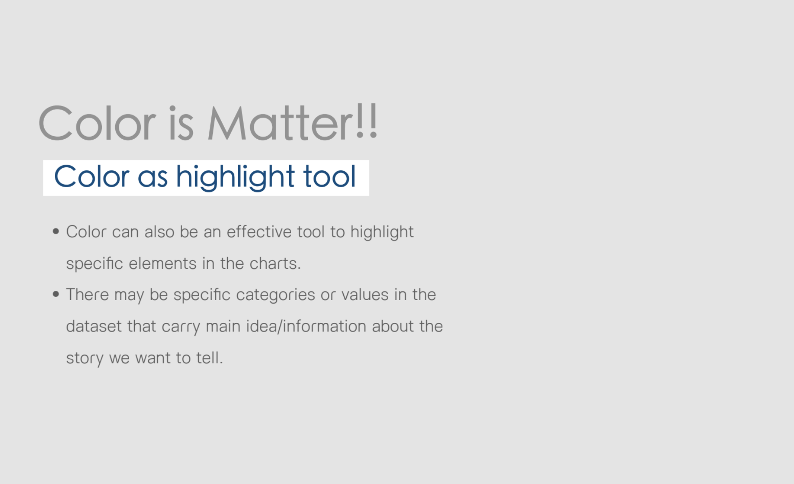{width="80%"}
</center>


## 4. Focus Audience Attention: Color is Matter {.smaller}

<center>
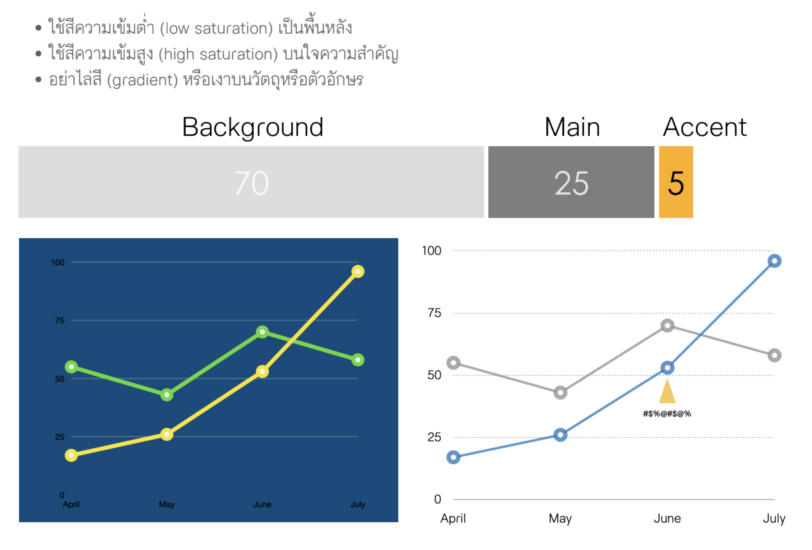{width="80%"}
</center>


## 4. Focus Audience Attention: Color is Matter {.smaller}

<center>
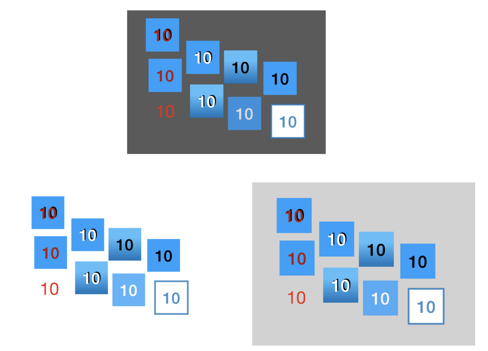{width="80%"}
</center>

## 4. Focus Audience Attention: Color is Matter {.smaller}

Color as highlighting tool

```{r}
library(tidyverse)
library(scales)

# 1) เตรียม label แบบ “ทักษะที่ควรเสริม” (ไม่ตีตรา)
profile_labels <- c(
  "Sci_only"    = "เสริมการให้เหตุผล",
  "Graph + Sci" = "เสริมอ่านกราฟ + \n การให้เหตุผล",
  "Graph_only"  = "เสริมการอ่านกราฟ",
  "No_problem"  = "พร้อมต่อยอด",
  "ALL_three"   = "เสริมพื้นฐานหลายด้าน",
  "Keyword_problem" = "เสริมคำศัพท์"
)

order_levels <- c(
  "เสริมการให้เหตุผล",
  "เสริมอ่านกราฟ + \n การให้เหตุผล",
  "เสริมการอ่านกราฟ",
  "พร้อมต่อยอด"
)

pareto_plot <- profile %>%
  count(profile, sort = TRUE) %>%
  mutate(
    cum_pct = cumsum(n) / sum(n),
    profile_show = recode(profile, !!!profile_labels),
    profile_show = factor(profile_show, levels = order_levels)
  ) %>%
  ggplot(aes(x = reorder(profile_show, -n), y = n)) +
  geom_col(aes(fill = profile_show), color = "grey25", width = 0.75) +
  scale_y_continuous(
    name = "จำนวนนักเรียน"
  ) +
  labs(
    title = "การจำแนกประเภทความต้องการพัฒนาทักษะจำเป็นของชั้นเรียน",
    x = "\n ประเภทความต้องการพัฒนา",
    y = NULL
  ) +
  theme_light(base_size = 18) +
  theme(
    legend.position = "none",
    text = element_text(family = "ChulaCharasNew"),
    panel.grid.minor = element_blank(),
    axis.title.x = element_text(margin = margin(t = 10)),
    plot.title = element_text(face = "bold")
  ) +
  scale_fill_manual(
    values = c(
    "skyblue",
    "skyblue",
    "grey",
    "grey")
  )
pareto_plot
```


## 4. Focus Audience Attention: Color is Matter {.smaller}

<center>
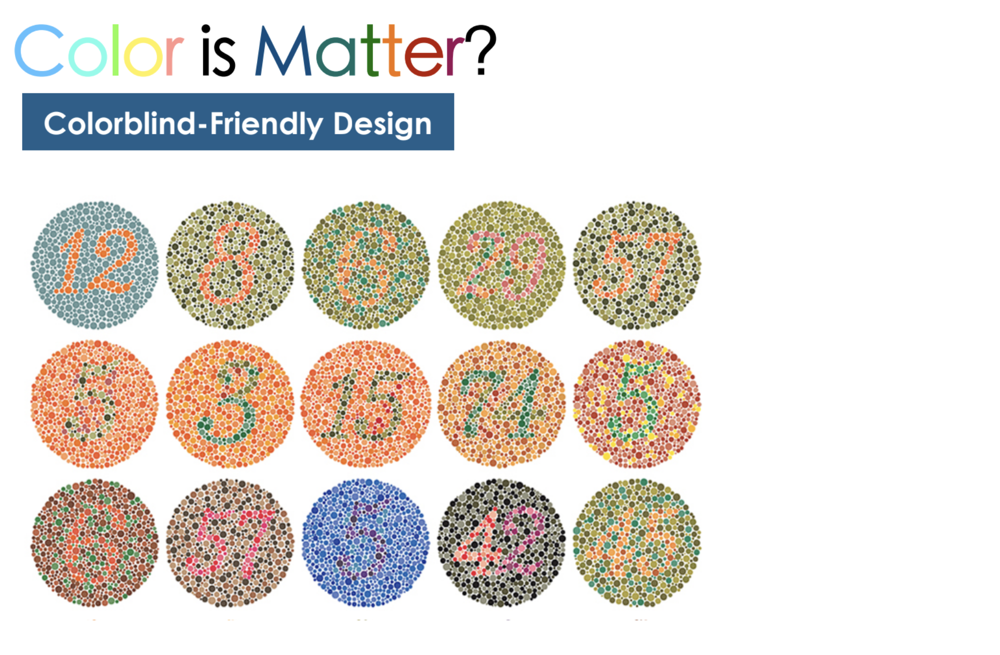{width="80%"}
</center>


## 4. Focus Audience Attention: Color is Matter {.smaller}

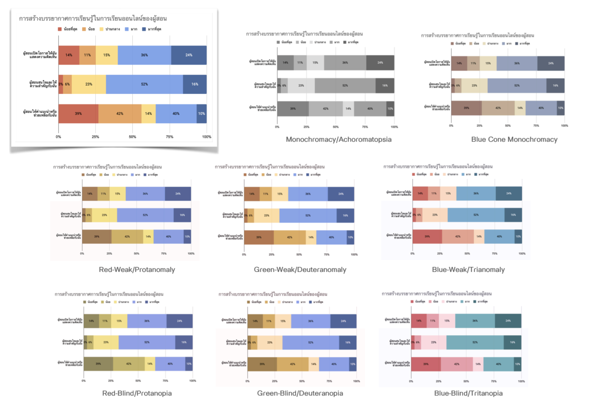


## กระบวนการสื่อสารข้อมูล {.smaller}

> กระบวนการสื่อสารข้อมูลไม่ใช่ลำดับการวิเคราะห์ ไม่ใช่ลำดับการสร้างกราฟ แต่เป็นลำดับการคิดเพื่อสื่อสารข้อมูล


1. Understand the Context

2. Choose the Appropriate Visual

3. Eleminate Unnecessary Details

4. Focus Attention

5. Tell A Story


## 5. Tell A Story {.smaller}

> คือการนำข้อมูลที่ผ่านการวิเคราะห์และคัดเลือกแล้ว (จากขั้นตอนก่อนหน้า) มาเรียบเรียงให้เป็นเรื่องราวที่น่าติดตาม เพื่อให้ผู้ฟังจดจำและโน้มน้าวให้เกิดการกระทำ

- การปูพื้นเรื่อง (Plot) -- ให้บริบทที่จำเป็น เพื่อให้ทุกคนเข้าใจสถานการณ์ตรงกัน

- แสดงช่องว่าง/ปัญหาความท้าทาย (Rising Action) -- เริ่มเผยให้เห็นปัญหาหรือความท้าทาย (Tension) ที่เกิดขึ้น

- จุดไคลแมกซ์ (Climax) -- จุดที่ความตึงเครียดสูงสุด คือปัญหาหลักที่ต้องรีบแก้ (จุดนี้จะใช้ Big Idea เข้ามาจับ)

- วิธีการ/แนวทางการคลี่คลายปัญหา (Falling Action) -- เสนอทางออก ทางเลือก หรือการวิเคราะห์เพิ่มเติมเพื่อลดความตึงเครียด

- สรุป (Ending) -- บทสรุปที่ชัดเจนและการเรียกร้องให้ตัดสินใจหรือเกิดการดำเนินการ

## NotebookLM

<center>
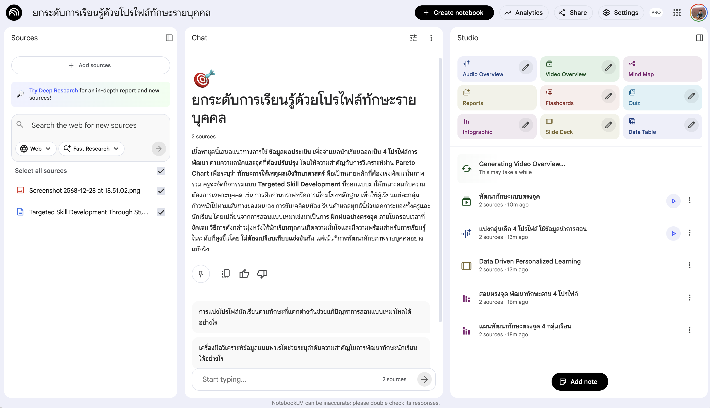{width="80%"}
</center>

## ตัวอย่าง

<center>
{width="80%"}
</center>

## ตัวอย่าง

<center>
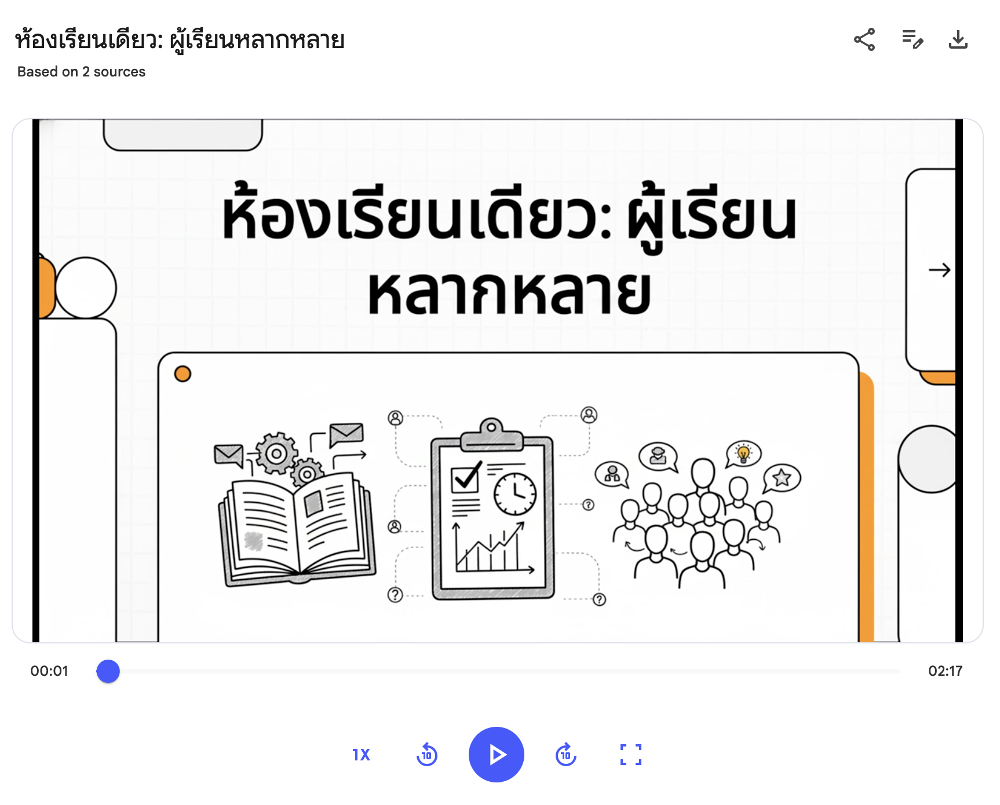{width="80%"}
</center>

