## แนะนำวิทยากร

::::::: columns
:::: {.column width="50%"}
<center>

<br>

::: {style="font-size:70%;"}
{width="44%"}
:::

</center>
::::

:::: {.column width="50%"}
<center>

<br>

::: {style="font-size:70%;"}
{width="49.7%"}
:::

</center>
::::
:::::::

## แนะนำวิทยากร

::::::: columns
:::: {.column width="50%"}
<center>

<br>

::: {style="font-size:70%;"}
{width="70%"}
:::

</center>
::::

:::: {.column width="50%"}
<center>

<br>

::: {style="font-size:70%;"}
{width="50%"}
:::

</center>
::::
:::::::

## Outline (1)

::: {style="font-size:70%;"}
*🕘 08:30–09:30 น.*

**Part 1: ปัญญาประดิษฐ์ 101**
:::

::: {style="font-size:60%;"}
-   ปัญญาประดิษฐ์คืออะไร

-   ประเภทของ AI

-   Some Basic Concepts and Terminology

:::

::: {style="font-size:70%;"}
*🕘 09:30 - 10:30 น.*

**Part 2: เริ่มใช้ Generative AI และ Prompt101**
:::

::: {style="font-size:60%;"}
-   แนะนำ ChatGPT

-   ปัญหา Hallucination และ ปัจจัยที่มีผลต่อความถูกต้องของผลลัพธ์

-   Prompt Design

<center>-- *Break 15 นาที* --</center>
:::

## Outline: (2)

::: {style="font-size:70%;"}
*🕘 10:45 - 11:30 น.*

**Part 3: แนะนำ Generative AI สำหรับการบริหารจัดการงานศาล**
:::

::: {style="font-size:60%;"}
-   ภาพรวมเครื่องมือ Gen AI สำหรับงานด้านนิติศาสตร์

-   แนะนำเครื่องมือสำคัญและตัวอย่างการใช้งาน

-   AI Usage Framework

<center>-- *พักรับประทานอาหารกลางวัน* --</center>

:::


## Outline (3)


::: {style="font-size:70%;"}
*🕘 12:30 - 13:30 น.*

**Part 4: Generative AI กับงานเอกสาร**
:::

::: {style="font-size:60%;"}

-   การแปลเอกสาร

-   การร่างหนังสือราชการ/Email/สุนทรพจน์

-   การสรุปและเปรียบเทียบเนื้อหาจากเอกสาร

-   การสรุปเนื้อหาการประชุม และการเขียนบันทึกการประชุม

:::


::: {style="font-size:70%;"}
*🕘 13:30 - 14:15 น.*

**Part 5: การวิเคราะห์ข้อมูลและการรายงานผล**
:::

::: {style="font-size:60%;"}

-   การวิเคราะห์ข้อมูลเชิงสถิติ

-   การสร้างรายงานผลการวิเคราะห์

<center>-- *Break 15 นาที* --</center>

:::


::: {style="font-size:60%;\""}
<br>

:::

## Outline (4)

::: {style="font-size:70%;"}
*🕘 14:30 - 15:00 น.*

**Part 6: การสืบค้นข้อมูล**
:::

::: {style="font-size:60%;"}

- AI Search

- Deep Research

- AI Workflow ช่วยเขียนโครงการ

:::


::: {style="font-size:70%;"}
*🕘 15:00 - 15:30 น.*

**Part 7 : การสร้างสื่อประชาสัมพันธ์**
:::

::: {style="font-size:60%;"}

-   Poster/Infographic/แผนภาพ

-   สร้างสื่อคลิปวิดิโอ

:::


# Part 1: <br>บทนำสู่ปัญญาประดิษฐ์

> AI & Data-Driven → Accelerated Discovery

<center>

{width="50%"}

</center>

## ปัญญาประดิษฐ์คืออะไร ?

-   AI เป็น**สาขาวิชา**หนึ่งในวิทยาการคอมพิวเตอร์ที่มุ่งเน้นศึกษาและพัฒนาวิธีการ/ทฤษฎี
    เพื่อสร้างโปรแกรม/เครื่องจักรที่สามารถเลียนแบบความสามารถของสมองมนุษย์

    -   การเรียนรู้ (learning)

    -   การให้เหตุผล (reasoning)

    -   การรับรู้ (perception)

    -   การแก้ปัญหา (problem solving)

    -   การปรับตัว (adaption)

## AI Ecosystem {.smaller}

<br>

{width="70%"}

## AI ไม่ได้มีแค่ ChatGPT, Gemini, Claude, ...

<br>

<center>

{width="50%"}

</center>

## ขอบเขตของ AI {.smaller}

<br>

<center>

{width="90%"}

</center>

## AI in the Modern World (1) {.smaller}

> *AI ที่เรียนรู้จากข้อมูลเพื่อ “คาดการณ์” และ “จำแนก”*

:::::::::: columns
:::::: {.column width="50%"}
{width="40%"}

> ::: {style="font-size: 50%;"}
> "Using **two types of neural network** - mathematical systems for
> identifying patterns in images or data - the Al system quickly
> **learnt to identify ten features of eye disease** from highly complex
> optical coherence tomography (OCT) scans. **The system was then able
> to recommend a referral decision based on the most urgent conditions
> detected.**" ... "Al was able to make the right referral
> recommendation more than **94% of the time** ..."
> :::

::: {style="font-size: 50%;"}
-   Diabetic Retinopathy

-   Age-related Macular Degeneration

-   Glaucoma

-   Retinal Detachment

-   Optic Neuropathy
:::

:::: {style="font-size: 70%;"}
::: caption2
https://www.ucl.ac.uk/ioo/news/2018/aug/artificial-intelligence-equal-experts-detecting-eye-diseases
[-@ucl2018ai]
:::
::::
::::::

::::: {.column width="50%"}
Al system for breast cancer screening

{width="60%"} {width="70%"}

:::: {style="font-size: 50%;"}
</br>

::: caption
[@mckinney2020international]
:::
::::
:::::
::::::::::

## AI in the Modern World (2) {.smaller}

> *AI Pattern Discovery: AI ค้นหารูปแบบและโครงสร้างที่ซ่อนอยู่ในข้อมูล*

-   บูรณาการข้อมูลภัยพิบัติด้านภูมิอากาศกับข้อมูลทางการศึกษา
    [@srisuttiyakorn2024technical]

::::: columns
::: {.column width="45%"}
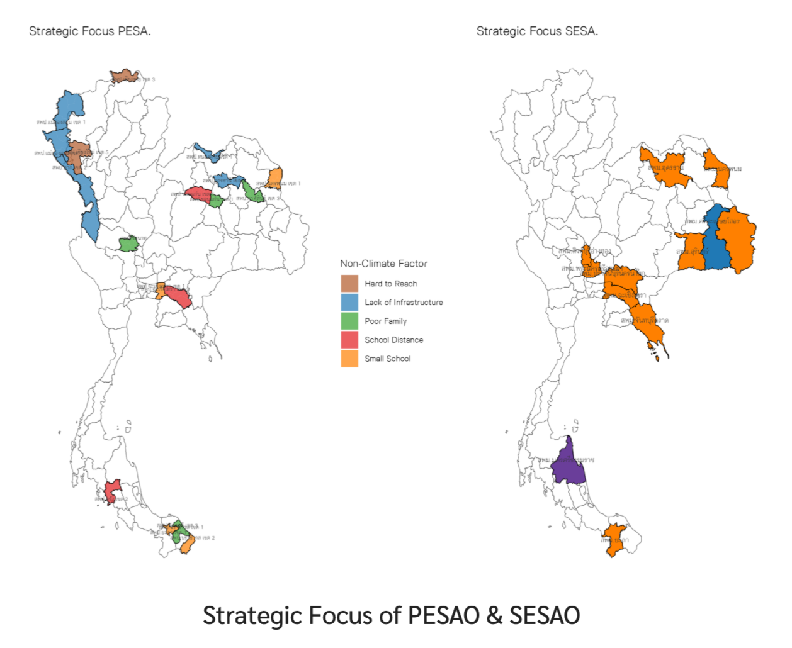{width="100%"}
:::

::: {.column width="55%"}
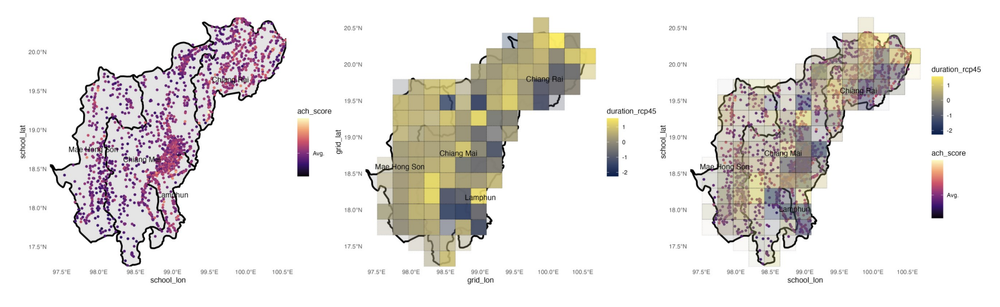{width="100%"}
:::
:::::

## AI in the Modern World (3) {.smaller}

> AI สกัดโครงสร้างแนวคิดจากเอกสารอ้างอิงเพื่อพัฒนา Programme Learning Outcomes
> (PLOs)

<p style="font-size: 60%;">

-   LLMS สกัดวลี คำที่เป็นมโนทัศน์สำคัญที่เกี่ยวข้องกับสมรรถนะของบัณฑิตครู
    จากเอกสารที่เกี่ยวข้อง

-   ML วิเคราะห์ความสัมพันธ์ระหว่างมโนทัศน์ต่าง ๆ เพื่อจัดกลุ่มและสร้างโครงสร้างแนวคิด
    (Conceptual Framework) ที่สอดคล้องกับสมรรถนะของบัณฑิตครู

</p>

<left> {width="50%"}

::: caption1
สิวะโชติ และคณะ (2568)
:::

## AI in the Modern World (4) {.smaller}

-   วิเคราะห์ร่องรอยความรู้

-   ทำนายแนวโน้มความรู้ในอนาคตจากร่องรอยความรู้ในปัจจุบัน

::::: columns
::: {.column width="50%"}
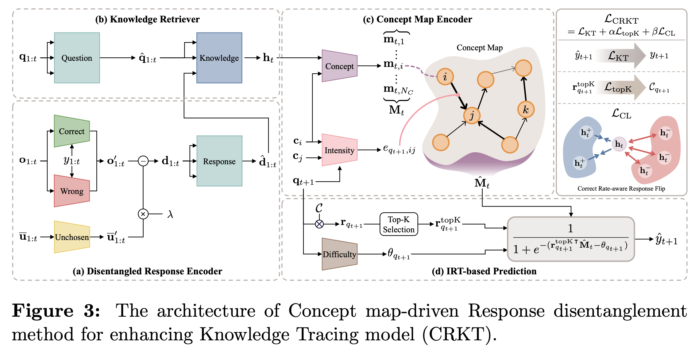{width="100%"}
:::

::: {.column width="50%"}
{fig-align="left"
width="100%"}
:::
:::::

## AI in the Modern World (5) {.smaller}

> AI เรียนรู้ความหมายและไวยกรณ์ภาษา

::::: columns
::: {.column width="50%"}
<p style="font-size: 60%;">

-   ระบบตรวจ Grammar แบบ Rule-based + ML (ดั้งเดิม)

-   Deep Learning ช่วยให้เข้าใขจบริบทของประโยคได้ดีขึ้น ผ่านโครงข่ายประสาทเทียม

-   LLM: ช่วยเสนอคำแนะนำในการเขียน (rephrasing, tone, suggesting, ...)

-   Workflow Agent (GrammarlyGO): ใช้ LLMs
    เป็นสมองและเพิ่มความสามารถด้านความจำ การวางแผนและให้เหตุผล
    และการทำงานต่อเนื่องอัตโนมัติ

</p>
:::

::: {.column width="50%"}
<center>

{width="100%"}

</center>
:::
:::::

## AI in the Modern World (6) {.smaller}

::::::: columns
::: {.column width="50%"}
<p style="font-size: 20%;">

-   AI chatbot ที่ออกแบบมาเพื่อเป็น “copilot” ด้านสุขภาพจิต

-   **LLM-based dialogue** ทำหน้าที่เป็นสมอง
    เพื่อสร้างคำตอบที่มีความต่อเนื่องทางอารมณ์ (emotional coherence)
    และสอดคล้องกับแนวทางของ CBT (Cognitive Behavioral Therapy)

    -   สรุปใจความของการสนทนา

    -   ตั้งคำถามสะท้อนกลับ

    -   ใหัคำแนะนำตามหลักการ CBT

-   **AI Agent**

    -   มี memory system เก็บประวัติสุขภาพจิตของผู้ใช้ (อารมณ์ เหตุการณ์
        และคำแนะนำก่อนหน้า)

    -   autonomous action loop: ประเมินอารมณ์ ตอบโต้ แนะนำ ติดตามผล
        และปรับแผน

</p>
:::

::::: {.column width="50%"}
{width="65%"}

::: caption2
https://woebothealth.com/[-@woebothealth2025]
:::

{width="70%"}

::: caption3
https://www.youper.ai/how-it-works
:::
:::::
:::::::

## AI in the Modern World (7) {.smaller}

{width="40%"}

# Basic Concepts and Terminology of Modern AI {.smaller}

-   Generative AI

-   LLMs

-   LLM Function-Calling

-   AI Workflow

-   AI Agent

## Generative AI: What It Is and Why It Matters {.smaller}

<br>

::::::::: columns
::::::: {.column width="60%"}
::: {.fragment .fade-in style="font-size:80%;"}
**Generative AI** คือระบบปัญญาประดิษฐ์ที่สามารถสร้างข้อมูลใหม่ เช่น ข้อความ รูปภาพ
เสียง โค้ด หรือวิดีโอ โดยอิงจากรูปแบบ (*patterns*) และโครงสร้าง (*structures*)
ที่เรียนรู้จากข้อมูลจำนวนมาก
:::

::: {.fragment .fade-in style="font-size:80%;"}
กระบวนการสร้างไม่ได้เกิดจากการสุ่ม แต่เป็นการ **คำนวณทางสถิติ**\
เพื่อหา “ผลลัพธ์ที่มีความเป็นไปได้สูงสุด” ภายใต้บริบทที่กำหนด
:::

::: {.fragment .fade-in style="font-size:80%;"}
การสร้างเนื้อหาต้องอาศัย:

-   **Context**: บริบท เช่น ข้อความก่อนหน้า หรือข้อมูลแวดล้อม
-   **Prompt**: คำกระตุ้นที่ระบุภารกิจ รูปแบบ หรือเจตนาของผู้ใช้
:::

::: {.fragment .fade-in style="font-size:80%;"}
ผลลัพธ์ที่ได้จึงไม่ใช่ “ของใหม่โดยสมบูรณ์” (original content)
แต่เป็นการจัดเรียงองค์ประกอบใหม่ตามความน่าจะเป็นของการเกิดร่วมกันของคำหรือพิกเซล ที่
คล้ายคลึงกับสิ่งที่เคยเรียนรู้มา
แต่มีความยืดหยุ่นและสร้างสรรค์เพียงพอที่จะใช้งานในหลากหลายบริบท และตรงตามวัตถุประสงค์
:::
:::::::

::: {.column width="40%"}

:::
:::::::::

## Large Language Models (LLMs) {.smaller}

-   LLMs เป็นโมเดลพื้นฐาน (foundation models) ของ Generative AI

-   เรียนรู้จากข้อมูลขนาดใหญ่ เพื่อเข้าใจความหมายและความสัมพันธ์
    โครงสร้างของภาษาและข้อมูลหลายรูปแบบ

-   เป็นสมองของระบบ AI สมัยใหม่ ช่วยให้ AI เข้าใจ ให้เหตุผล
    และสร้างคำตอบใหม่ได้อย่างสอดคล้องกับบริบท

-   เป็นรากฐานของระบบ Generativ AI เกือบทั้งหมดในปัจจุบัน

::: {style="font-size:80%;"}

:::

## LLM Function-Calling {.smaller}

<p style="font-size: 50%;">

-   ฟังก์ชันการเรียกใช้งาน (function-calling) ช่วยให้ LLMs สามารถโต้ตอบกับ API
    หรือบริการภายนอกได้

-   ช่วยให้ LLMs สามารถเชื่อมต่อ และสั่งการเครื่องมือภายนอกได้ระหว่างสนทนา

</p>

::::: columns
::: {.column width="50%"}
<center>

{width="80%"}

{width="80%"}

</center>
:::

::: {.column width="50%"}
{width="80%"}

{width="80%"}
:::
:::::

## LLM Function-Calling {.smaller}

::::: columns
::: {.column width="50%"}
<center></center>
:::

::: {.column width="50%"}

:::
:::::

## LLM Function-Calling {.smaller}

::::: columns
::: {.column width="50%"}

:::

::: {.column width="50%"}

:::
:::::

## AI Workflow {.smaller}

-   กระบวนการอัตโนมัติที่มนุษย์ออกแบบลำดับขั้นตอนไว้ล่วงหน้า

-   มีการใช้ AI เช่น LLMs ในบางขั้นตอนของกระบวนการ เพื่อประมวลผลตามที่มนุษย์กำหนด
    แต่ไม่ได้ให้สิทธิ์ AI ในการตัดสินใจเอง กล่าวคือ
    **ไม่สามารถทำงานนอกเหนือจากเส้นทางที่กำหนด**


## AI Workflow {.smaller}

::::: columns
::: {.column width="60%"}
<p style="font-size: 50%;">

-   AI Workflow สามารถจำลองกระบวนการตัดสินใจของมนุษย์

    -   Cognitive Analogy -- LLM สมองของกระบวนการ

    -   Decision Flow -- กระบวนการทำงาน/ตัดสินใจต่อเนื่อง

    -   Automation -- ดำเนินงานแทนมนุษย์โดยอัตโนมัติ

</p>

{width="90%"}
:::

::: {.column width="40%"}

:::
:::::

## AI Workflow {.smaller}

:::::: columns
::: {.column width="30%"}

:::

::: {.column width="30%"}


:::

::: {.column width="40%"}

:::
::::::

## AI Agent {.smaller}

-   ระบบซอฟต์แวร์ ที่ถูกออกแบบให้ “รับรู้” สภาพแวดล้อม (environment) แล้ว “กระทำ”
    (action) เพื่อบรรลุเป้าหมาย (goal) ที่ตั้งไว้ล่วงหน้า

-   มนุษย์มีบทบาทแค่บอกเป้าหมาย/ผลลัพธ์ที่อยากได้เท่านั้น ที่เหลือ AI Agent
    จะทำการคิดให้เหตุผล ดำเนินการและควบคุมการดำเนินการจนบรรลุเป้าหมายเอง

::::: columns
::: {.column width="40%"}
{width="90%"}
:::

::: {.column width="60%"}
AI Agent มักมีองค์ประกอบได้แก่

-   เป้าหมาย (Goal)

-   การรับรู้ (Perception)

-   การวางแผนและตัดสินใจ (Planning & Decision Making)

-   การกระทำ (Action)

-   การเรียนรู้และปรับปรุง (Learning & Adaptation)
:::
:::::


## AI Agent {.smaller}

<p style="font-size: 30%;">

-   [ChatGPT Agent](https://openai.com/index/introducing-chatgpt-agent/)

-   Claude + Extended Thinking + Connectors

-   [Manus](https://manus.im/)

-   [Comet](https://www.perplexity.ai/comet)

</p>

## Manus Agent {.smaller}


## ChatGPT Agent {.smaller}


::::: columns
::: {.column width="30%"}
{width="100%"}

{width="60%"}
:::

::: {.column width="70%"}
[{width="60%"}](https://chatgpt.com/share/688b4600-40b0-8003-975f-e2efc1732bd4)
:::
:::::

## Comet Agent


# Part 2: เริ่มใช้ Generative AI และ Prompt 101

## ChatGPT {.smaller}

:::::: columns
:::: {.column width="50%"}
::: {style="font-size:90%;"}
1.  เข้าไปที่เว็บไซต์ [chat.openai.com](chat.openai.com)
2.  ลงทะเบียนหรือเข้าสู่ระบบ
3.  เลือกโมเดลที่ต้องการใช้
4.  ลองพิมพ์คำถามหรือคำสั่งในช่องข้อความ
5.  ตรวจสอบคำตอบที่ได้รับ ปรับปรุง และนำผลลัพธ์ไปใช้

{width="605"}
:::
::::

::: {.column width="50%"}
<br>


:::
::::::

## ChatGPT {.smaller}

:::::: columns
:::: {.column width="50%"}
::: {style="font-size:90%;"}
1.  เข้าไปที่เว็บไซต์ [chat.openai.com](chat.openai.com)
2.  ลงทะเบียนหรือเข้าสู่ระบบ
3.  เลือกโมเดลที่ต้องการใช้
4.  ลองพิมพ์คำถามหรือคำสั่งในช่องข้อความ
5.  ตรวจสอบคำตอบที่ได้รับ ปรับปรุง และนำผลลัพธ์ไปใช้

{width="605"}
:::
::::

::: {.column width="50%"}
<br> <br>


:::
::::::

## ChatGPT {.smaller}

:::::: columns
:::: {.column width="50%"}
::: {style="font-size:90%;"}
1.  เข้าไปที่เว็บไซต์ [chat.openai.com](chat.openai.com)
2.  ลงทะเบียนหรือเข้าสู่ระบบ
3.  เลือกโมเดลที่ต้องการใช้
4.  ลองพิมพ์คำถามหรือคำสั่งในช่องข้อความ
5.  ตรวจสอบคำตอบที่ได้รับ ปรับปรุง และนำผลลัพธ์ไปใช้

{width="605"}
:::
::::

::: {.column width="50%"}

:::
::::::

## ChatGPT {.smaller}

<left>

{width="60%"} </left>

::: caption3
https://openai.com/index/introducing-gpt-5/
:::

## กิจกรรมลองใช้ ChatGPT 1

> สถานการณ์ : ผู้เช่าย้ายออกจากคอนโดตามสัญญาเช่าแล้ว แต่เจ้าของห้อง (ผู้ให้เช่า)
> แจ้งว่าจะไม่คืนเงินประกันจำนวน 15,000 บาท โดยอ้างว่าต้องนำไปซ่อมแซมห้อง

ผู้ให้เช่าทำผิดกฎหมายหรือไม่ ?

## กิจกรรมลองใช้ ChatGPT 1: Prompt แบบที่ 1

::: {style="font-size:80%;"}
"ผมเป็นผู้เช่าได้ย้ายออกจากคอนโดตามสัญญาเช่าแล้ว แต่เจ้าของห้อง (ผู้ให้เช่า)
แจ้งมาว่าจะไม่คืนเงินประกันจำนวน 15,000 บาท โดยอ้างว่าต้องนำไปซ่อมแซมห้อง
แบบนี้ผิดกฎหมายมั้ย ไม่คืนได้หรอ??"
:::

## กิจกรรมลองใช้ ChatGPT 1: Prompt Design แบบที่ 2

::: {style="font-size:80%;"}
ในฐานะที่ปรึกษากฎหมาย ช่วยวิเคราะห์สถานการณ์และให้คำแนะนำตามกฎหมายไทย

ข้อเท็จจริง:

1.  ทำสัญญาเช่าคอนโด 1 ปี สิ้นสุดวันที่ 30 มิถุนายน 2568 วางเงินประกัน 15,000 บาท

2.  ย้ายออกและส่งมอบห้องคืนในสภาพเรียบร้อยเมื่อวันที่ 30 มิถุนายน 2568

3.  วันนี้ (31 กรกฎาคม 2568) เจ้าของห้องแจ้งผ่าน LINE ว่าจะยึดเงินประกันทั้งหมด
    15,000 บาท เพื่อเป็นค่าทาสีผนังใหม่ และค่าล้างแอร์
    ซึ่งรายการเหล่านี้ไม่ได้ระบุว่าเป็นความเสียหายที่ผู้เช่าต้องรับผิดชอบในสัญญา

สิ่งที่ต้องการ: สิทธิของผู้เช่าตามกฎหมายในกรณีนี้มีอะไรบ้าง?

1.  การกระทำของเจ้าของห้องขัดต่อกฎหมายหรือไม่ อย่างไร?

2.  ขั้นตอนที่ควรดำเนินการต่อไปควรเป็นอย่างไรบ้าง (เรียงลำดับจากง่ายไปยาก)

3.  โปรดอ้างอิงตัวบทกฎหมายที่เกี่ยวข้อง เช่น ประกาศคณะกรรมการว่าด้วยสัญญาฯ
:::

## กิจกรรมลองใช้ ChatGPT 2 {.smaller}

::::: columns
::: {.column width="40%"}
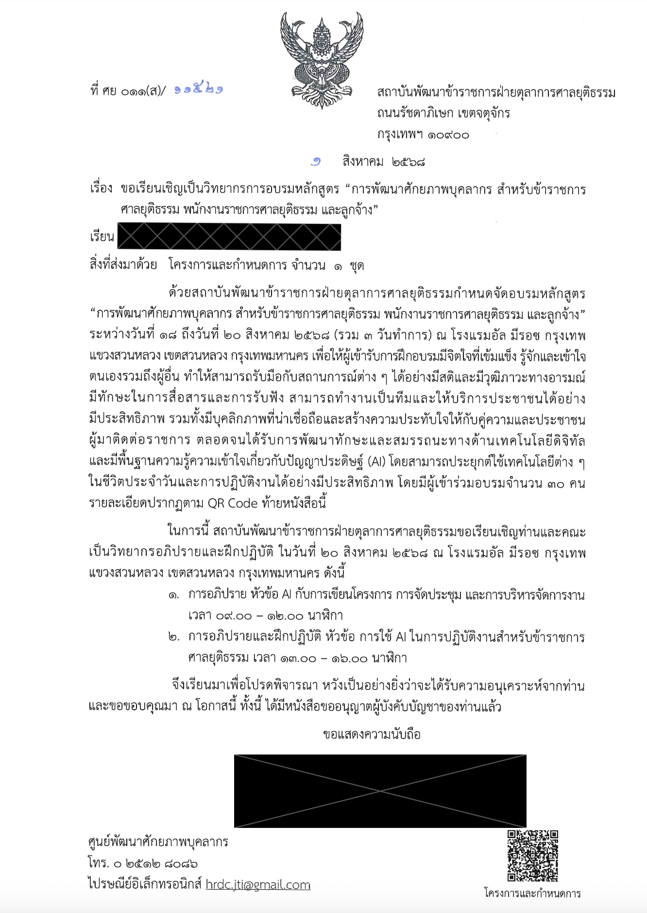{width="100%"}
:::

::: {.column width="60%"}
> ช่วยร่างหนังสือตอบรับการเป็นวิทยากรการอบรมหลักสูตร "การพัฒนาศักยภาพบุคลากร
> สำหรับข้าราชการศาลยุติธรรม พนักงานราชการศาลยุติธรรม และลูกจ้าง" ของ ผศ.ดร.A
> หน่อย

-   ผลลัพธ์ที่ได้เป็นอย่างไร?

-   เราสามารถปรับปรุงผลลัพธ์อย่างไรได้บ้าง
:::
:::::

## กิจกรรมลองใช้ ChatGPT 3 {.smaller}

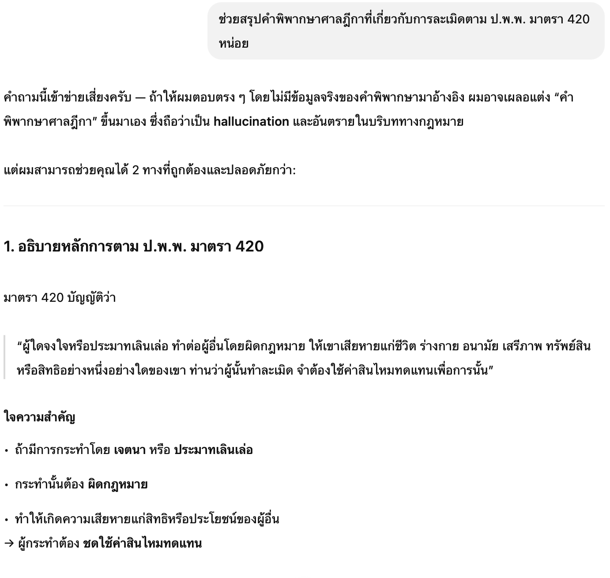{width="60%"}

## ปัญหา Hallucination {.smaller}

<left> {width="45%"} </left>

<br>

AI hallucination หมายถึงกรณีที่ระบบปัญญาประดิษฐ์ (AI) สร้างเนื้อหาหรือคำตอบที่
**ไม่ได้อิงจากข้อมูลจริงหรือข้อมูลที่ได้รับมา** ซึ่งอาจทำให้ AI สร้างข้อมูลที่**ไม่ถูกต้อง
นำไปสู่ความเข้าใจผิด หรือแต่งขึ้นทั้งหมด** ซึ่งอาจก่อให้เกิดปัญหาในหลายบริบทของการใช้งาน

-   **สร้างข้อมูลเท็จโดยสิ้นเชิง (total fabrication)** --
    สร้างแก่นของเรื่องราวที่ไม่มีอยู่จริงขึ้นมาทั้งหมด เช่น อ้างอิงหลักฐานข้อมูลผิด ให้เหตุผลผิด
    นำไปสู่การสร้างข้อสรุปผิด

-   **ผสมผสานระหว่างข้อมูลจริงและเท็จ (mixing true & false)** --
    หลักการโดยรวมถูกต้อง แต่อาจยกตัวอย่างหรือหลักฐานข้อมูลประกอบที่ไม่มีอยู่จริง

-   **สรุปความเกินจริง (faulty inference)** -- ข้อมูลตั้งต้นถูก
    แต่ข้อสรุปตีความเกินขอบเขตการอ้างอิงของข้อมูล

## ปัจจัยที่มีผลต่อความถูกต้อง/เหมาะสมของผลลัพธ์ {.smaller}

::: {style="font-size:85%;"}
-   **Model**

    -   พื้นความรู้เดิม (Knowledge Base) โมเดลถูก train มาด้วยข้อมูลอะไรบ้าง สิ้นสุด
        ณ ตอนไหน มีความเป็นปัจจุบันมากน้อยแค่ไหน

    -   สถาปัตยกรรมของโมเดล

    -   ขนาดและความสามารถในการให้เหตุผล
        โมเดลขนาดใหญ่มักมีความสามารถในการคิดเชิงเหตุผล หรือคิดในปัญหาซับซ้อนได้ดีกว่า

    -   การปรับจูนเฉพาะทาง (Fine-tuning) ช่วยให้โมเดลเข้าใจบริบทเฉพาะทางได้ดีขึ้น

-   **Prompt**

    -   กระบวนการกระตุ้นเพื่อให้ LLM แสดงผลลัพธ์ตามที่ต้องการ

    -   Prompt ชัดเจน ไม่กำกวม และบอกสิ่งที่ต้องการอย่างละเอียด จะได้ผลลัพธ์ที่ดีกว่า

    -   เทคนิคการ Prompt ที่แตกต่างกันอาจให้ผลลัพธ์แตกต่างกันไปด้วย
        (อาจไม่จริงเสมอไปโดยเฉพาะกับโมเดลขนาดใหญ่ที่มีประสิทธิภาพสูง เช่น gpt-o1,
        gpt-o3)

-   **Context**

    -   ข้อมูลแวดล้อมที่ป้อนเข้าไปพร้อมกับ Prompt เช่น เนื้อหาจากเอกสาร,
        บทสนทนาก่อนหน้า, หรือข้อมูลเฉพาะที่โมเดลไม่เคยรู้มาก่อน

    -   กระบวนการจัดหา Context ที่ถูกต้องก็เป็นปัจจัยที่มีผลด้วย
:::

## Prompt Design {.smaller}

> "คุณภาพของ prompt ส่งผลต่อคุณภาพของผลลัพธ์"

::::: columns
::: {.column width="50%"}

:::

::: {.column width="50%"}
-   **1. กำหนดปัญหา** -- เข้าใจโจทย์ให้ชัดก่อนจะเริ่มเขียน prompt

    -   วิเคราะห์และระบุให้ได้ว่าต้องการให้ AI ช่วยอะไร

    -   ระบุประเภทของงาน เช่น สรุป เขียน วิเคราะห์ แปล ประเมิน ...

    -   ระบุ context ที่จำเป็น

-   **2. ออกแบบ prompt** -- สร้างคำสั่งที่อธิบายปัญหาให้ AI เข้าใจได้ดีที่สุด

-   **3. ประเมิน output และโต้ตอบกับโมเดล** -- เพื่อปรับปรุงผลลัพธ์ให้ถูกต้อง
    และตรงความต้องการ
:::
:::::

## เทคนิคการออกแบบ Prompt : In-Context Learning Strategy

-   Zero-Shot Prompting

-   One-Shot Prompting

-   Few-Shot Prompting

-   Chain-of-Thought

-   Template Design

## Zero-shot prompting {.smaller}

-   เป็นวิธีการพื้นฐานที่สุดในการสั่งงานโมเดล

-   **หลักการ** : สั่งงานโมเดลโดยตรง โดยไม่ให้ตัวอย่างใด ๆ

-   **ข้อตกลงเบื้องต้น** :
    โมเดลได้เรียนรู้ข้อมูลในบริบทหรืองานที่ต้องการสั่งการมามากเพียงพอ
    จนสามารถเข้าใจและทำงานได้ทันที

**ตัวอย่าง (Zero-Shot Example)**

::: callout
<p style="font-size:120%;">

-   แปลคำว่า "I love you" เป็นภาษาไทย

-   "นาย ก. ขโมยโทรศัพท์จากกระเป๋าของนาย ข." เข้าลักษณะความผิดไหน

-   ขอสามคำเกี่ยวกับจุฬาลงกรณ์ มหาวิทยาลัย

</p>
:::

## One-Shot Prompting {.smaller}

-   **หลักการ** : ให้ตัวอย่าง 1 ชุด (one shot) เพื่อเป็นแนวทางของคำตอบให้กับโมเดล

-   **ข้อตกลงเบื้องต้น** :
    โมเดลได้เรียนรู้ข้อมูลในบริบทหรืองานที่ต้องการสั่งการมามากเพียงพอ
    แต่ผู้ใช้ให้ตัวอย่างเพื่อแนะนำโมเดลว่า ต้องการผลลัพธ์ในรูปแบบใด

-   เหมาะสำหรับงานที่ต้องการรูปแบบผลลัพธ์ที่เฉพาะเจาะจง
    หรือช่วยชี้นำให้โมเดลเข้าใจงานได้ชัดเจนขึ้น

**ตัวอย่าง (One-Shot Example)
การแปลงข้อความทางกฎหมายให้เป็นภาษาที่ประชาชนเข้าใจง่าย**

::: callout
-   **ภาษากฎหมาย:** ผู้ใดลักทรัพย์ผู้อื่น ต้องระวางโทษจำคุกไม่เกินสามปี
    หรือปรับไม่เกินหกหมื่นบาท หรือทั้งจำทั้งปรับ\
-   **ภาษาชาวบ้าน:** ถ้าใครขโมยของคนอื่น อาจติดคุกไม่เกิน 3 ปี หรือโดนปรับไม่เกิน
    60,000 บาท หรือทั้งติดคุกทั้งโดนปรับ

**ให้แปลงข้อความนี้**\

-   **ภาษากฎหมาย:** ผู้ให้เช่าต้องส่งมอบทรัพย์ให้ผู้เช่าตามที่ตกลงกันไว้ 
-   **ภาษาชาวบ้าน:** …
:::

## Few-Shot Prompting {.smaller}

-   **หลักการ** : ให้ตัวอย่างหลายชุด (few shot)

-   **ข้อตกลงเบื้องต้น** : งานที่สั่งมีลักษณะรูปแบบคำตอบที่หลากหลาย
    การให้ตัวอย่างเดียวไม่พอ (One-Shot) จึงจำเป็นต้อง ให้ตัวอย่างมากขึ้นจะช่วยให้โมเดล
    จับรูปแบบคำตอบ ที่ซับซ้อนได้ดีขึ้น ยิ่งตัวอย่างมีคุณภาพและหลากหลาย ก็ยิ่งเพิ่มความแม่นยำ

-   เหมาะสำหรับ งานที่ซับซ้อน, งานที่ต้องการความสม่ำเสมอของผลลัพธ์,
    หรือเมื่อโมเดลทำพลาดในแบบ One-Shot

## Few-Shot Prompting {.smaller}

::::::: columns
:::: {.column width="50%"}
::: callout
ตัวอย่างที่ 1

-   ข้อมูลเอกสาร: "คำฟ้องคดีอาญาเรื่องลักทรัพย์ คดีหมายเลข \[ยังไม่ระบุ\] วันที่ยื่น 1
    พฤษภาคม 2567"

-   สถานะคดี: คดีดำ

-   เหตุผล: ยังอยู่ในขั้นตอนการยื่นฟ้อง ยังไม่มีคำพิพากษา

ตัวอย่างที่ 2

-   ข้อมูลเอกสาร: "คำพิพากษาคดีแพ่งเรื่องผิดสัญญา คดีหมายเลขแดงที่ พ.321/2566 ลงวันที่
    15 มีนาคม 2567"

-   สถานะคดี: คดีแดง

-   เหตุผล: มีคำพิพากษาถึงที่สุดแล้ว

ตัวอย่างที่ 3

-   ข้อมูลเอกสาร: "หนังสือขอเลื่อนการพิจารณาคดีหมายเลขดำที่ อ.987/2567 ลงวันที่ 20
    เมษายน 2567 จากทนายโจทก์"

-   สถานะคดี: คดีดำ

-   เหตุผล: เป็นการขอเลื่อนพิจารณา แสดงว่าคดียังอยู่ในระหว่างการดำเนินคดี
:::
::::

:::: {.column width="50%"}
::: callout
ตัวอย่างที่ 4

-   ข้อมูลเอกสาร: "รายงานผลการบังคับคดี ในคดีหมายเลขแดงที่ อ.543/2565 เมื่อวันที่ 10
    เมษายน 2567"

-   สถานะคดี: คดีแดง

-   เหตุผล: เป็นรายงานการบังคับคดี ซึ่งจะเกิดขึ้นหลังจากคดีมีคำพิพากษาถึงที่สุดแล้ว

สถานการณ์ใหม่

-   ข้อมูลเอกสาร: "เอกสารหลักประกันการปล่อยตัวชั่วคราว คดีหมายเลข \[ยังไม่ระบุ\]
    ยื่นต่อศาลวันนี้"

-   สถานะคดี: ...

-   เหตุผล: ...
:::
::::
:::::::

## Chain-of-Thought (CoT) (1) {.smaller}

-   Chain-of-Thought Prompting คือเทคนิคการออกแบบ prompt
    ที่ให้โมเดลภาษารู้จักการคิดแบบมีเหตุผลเป็นขั้นเป็นตอน
    หรือแสดงวิธีคิด/วิธีทำออกมาก่อนจะสรุปเป็นคำถามสุดท้าย (step-by-step reasoning)

-   มักใช้ร่วมกับ one-shot หรือ few-shot

-   **หลักการ** : ให้ตัวอย่างที่แสดงกระบวนการคิดแบบเป็นขั้นตอน (chain of thought)
    ที่นำไปสู่คำตอบ

    -   ลดปัญหา Hallucination

    -   เพิ่มความโปร่งใส คุณภาพคำตอบดีขึ้น

    -   สอดคล้องกับหลักการ Human in the Loop/Human Center Mindset

## Chain-of-Thought (CoT) (2) {.smaller}

::: {style="font-size:110%;"}
สถานการณ์

```         
เมื่อวันที่ 10 พฤศจิกายน 2560 นายโมทย์ นายสมคิด และพวกรวม 10 คน ได้ประชุมวางแผนให้นายโมทย์ใช้ลูกระเบิดชนิดสังหารขว้างใส่ห้องแถวไม้ 2 ชั้นของนายขุน โดยชั้นล่างเปิดเป็นร้านขายของ และชั้นบนเป็นที่พักอาศัยของนายขุนและครอบครัว แต่เกิดอุปสรรคจึงได้ยกเลิกแผนการ

ต่อมาในวันที่ 12 พฤศจิกายน 2560 นายโมทย์และพวกรวม 9 คน ได้นัดประชุมวางแผนอีกครั้ง โดยในครั้งนี้นายสมคิดไม่ได้เข้าร่วมประชุมด้วย

เมื่อประชุมเสร็จแล้ว นายโมทย์จึงเดินทางไปที่บ้านของนายขุน เมื่อถึงบ้าน นายโมทย์เห็นนายขุนและครอบครัวทุกคนขับรถออกจากบ้านไป หลังจากนั้นประมาณ 10 นาที นายโมทย์จึงใช้ลูกระเบิดชนิดสังหารขว้างใส่ห้องแถวไม้ของนายขุน เป็นเหตุให้ฝาบ้าน ประตูบ้าน และกระจกช่องลม ซึ่งเป็นส่วนหนึ่งของตัวบ้าน ได้รับความเสียหายจากแรงระเบิด

สิบตำรวจเอกดำรง และดาบตำรวจอิทธิพล ซึ่งพบเห็นการกระทำความผิดของนายโมทย์ จึงเข้าจับกุมและนำส่งพนักงานสอบสวน โดยทั้งสองนายเดินขนาบข้างและคล้องแขนนายโมทย์ไว้คนละข้าง

ระหว่างทาง นายศึกษากับพวกประมาณ 10 ถึง 15 คน ซึ่งเป็นเพื่อนของนายโมทย์ ได้เข้ามาแย่งตัวนายโมทย์ โดยนายศึกษาดึงตัวนายโมทย์ และใช้เท้าถีบสิบตำรวจเอกดำรง และดาบตำรวจอิทธิพล ขณะเดียวกัน นายโมทย์พยายามดิ้นรนเพื่อให้พ้นจากการถูกควบคุมตัว เป็นเหตุให้เท้าของนายโมทย์ไปถูกสิบตำรวจเอกดำรง และดาบตำรวจอิทธิพล
```
:::

**Zero-Shot Prompting**

::: {style="font-size:110%;"}
```         
ให้วินิจฉัยว่า นายโมทย์ นายสมคิด และนายศึกษา มีความผิดตามประมวลกฎหมายอาญาฐานใดหรือไม่?
```
:::

**Single-Turn CoT**

::: {style="font-size:110%;"}
```         
นายโมทย์ มีความผิดตามประมวลกฎหมายอาญาฐานใดหรือไม่ ช่วยอธิบายเหตุผลด้วย
```
:::

::: {style="font-size:90%;"}
ผลลัพธ์ที่ได้เป็นอย่างไร? แตกต่างกันหรือไม่?
:::

## Chain-of-Thought (CoT): Multi-Turn CoT {.smaller}

-   CoT ไม่จำเป็นต้องดำเนินการจบใน prompt เดียว ผู้ใช้สามารถออกแบบป้อน prompt
    หลาย ๆ รายการ อย่างเป็นลำดับ

-   ได้ร่วมคิดไปกับโมเดล เห็นกระบวนการคิดระหว่างทาง (สอดคล้องกับ concept
    explainable AI)

-   สามารถให้ feedback หรือให้ข้อมูลใหม่แต่โมเดลได้ระหว่างกระบวนการคิด

::: {style="font-size:120%;"}
```         
1. วิเคราะห์พฤติกรรมของ “นายโมทย์”

(1.1) พฤติกรรมที่เกิดขึ้น:
    – ขว้างลูกระเบิดใส่ห้องแถวไม้ของนายขุน
    – ทำให้ทรัพย์สินเสียหาย เช่น ฝาบ้าน ประตูบ้าน กระจก

(1.2) ข้อเท็จจริง:
    – บ้านเป็นอาคาร 2 ชั้น ซึ่งชั้นบนใช้เป็นที่อยู่อาศัยของเจ้าของบ้านและครอบครัว
    – แม้ไม่มีคนอยู่ขณะเกิดเหตุ แต่โดยสภาพถือว่าเป็นอาคารที่มีคนอยู่อาศัย

(1.3) วิเคราะห์กฎหมายที่เกี่ยวข้อง:
    - มาตรา 218(2): วางเพลิงหรือทำให้เกิดระเบิดแก่ทรัพย์ในอาคารที่คนอาศัยอยู่ → มีความผิด
    - มาตรา 358: ทำให้เสียทรัพย์
    - มาตรา 138 วรรคสอง: ต่อสู้ขัดขวางเจ้าพนักงาน โดยใช้กำลังระหว่างถูกจับกุม

(1.4) สรุปความผิดของนายโมทย์ พร้อมอธิบายเหตุผล 
```
:::

ผลลัพธ์ที่ได้เป็นอย่างไร แตกต่างกันหรือไม่?

## Template Design {.smaller}

<center>{width="60%"}</center>

## The ABCDE Framework for Legal Professionals

[ContractPodAI](https://contractpodai.com/news/ai-prompts-for-legal-professionals/)
แนะนำกรอบแนวคิด ABCDE

::: {style="font-size:90%;"}
-   **Audience/Agent Definition:** กำหนดบทบาทของ AI
-   **Background Context:** ให้บริบทที่เกี่ยวข้อง รวมทั้งรายละเอียดคดี
    มาตรฐานทางกฎหมาย และข้อมูลเขตอำนาจศาล
-   **Clear Instructions:** ระบุสิ่งที่ต้องการและรูปแบบที่ชัดเจน
-   **Detailed Parameters:** กำหนดขอบเขต โทนเสียง ความยาว
    และข้อกำหนดการอ้างอิง
-   **Evaluation Criteria:** ระบุมาตรฐานสำหรับการประเมินคุณภาพของคำตอบ
:::

## The ABCDE Framework for Legal Professionals {.smaller}

-   Basic Prompting: "จากไฟล์ข้อมูลที่ upload ให้ ร่างคำพิพากษาให้หน่อย"

::::::: columns
:::: {.column width="50%"}
-   ABCDE Prompt:

::: {style="font-size:65%;"}
1.  โปรดทำตัวเป็น ผู้พิพากษาศาลชั้นต้นที่มีประสบการณ์ในคดีอาญา

2.  พิจารณาคดีที่จำเลยคือ นายโมทย์ ได้ขว้างระเบิดใส่อาคารไม้ 2 ชั้นของนายขุน
    และต่อสู้เจ้าหน้าที่ขณะถูกจับกุม คดีมีบุคคลอื่นที่เกี่ยวข้องคือ นายสมคิด
    ผู้ร่วมประชุมวางแผนครั้งแรก และ นายศึกษา ผู้เข้าช่วยเหลือให้หลบหนี

3.  กรุณาร่าง คำพิพากษาแบบเป็นทางการสำหรับนายโมทย์ โดยอิงจากข้อสรุปข้างต้น
    และแยกพิเคราะห์พฤติกรรมและความผิดอย่างเป็นระบบ

4.  ขอให้ใช้รูปแบบคำพิพากษาศาล ได้แก่:

    -   ข้อเท็จจริงที่รับฟังได้

    -   ปัญหาที่ต้องวินิจฉัย

    -   เหตุผลของศาลโดยอ้างกฎหมาย

    -   คำพิพากษา

5.  กรุณาใช้ ภาษากฎหมายที่เหมาะสม มีความชัดเจน ไม่ใช้ภาษาพลเรือนทั่วไป และ
    อ้างบทกฎหมายอาญาที่เกี่ยวข้อง เช่น มาตรา 218, 138, 189 คำพิพากษาควรเป็นกลาง,
    มีเหตุผลรองรับข้อวินิจฉัย และ ไม่นำเสนอความเห็นส่วนตัวเกินจำเป็น
:::

👉🏾
[ดาวน์โหลดไฟล์ผลลัพธ์](https://docs.google.com/document/d/1pwKaz-4V3P6ry7tQDazdQgKrPwtiS-Ur/edit?usp=drive_link&ouid=118010069578157348024&rtpof=true&sd=true)
::::

::: {.column width="5%"}
:::

::: {.column width="45%"}
<br>

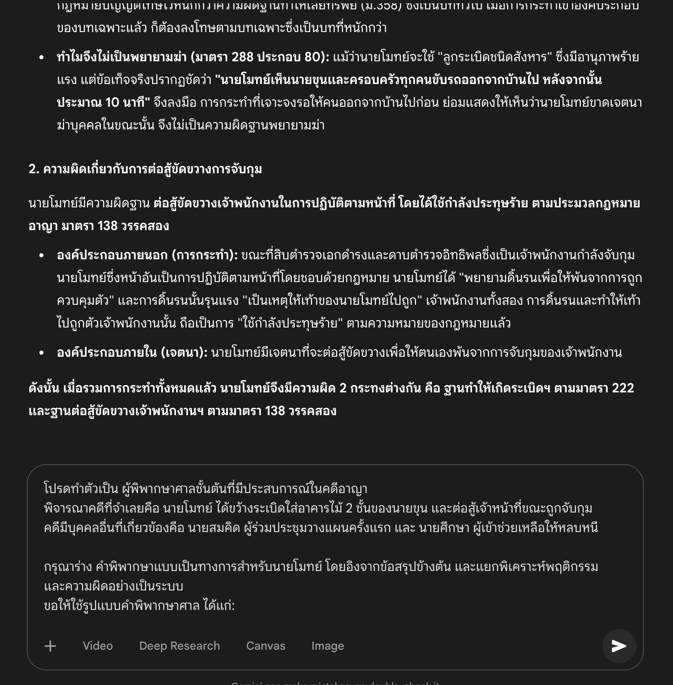{width="100%"}
:::
:::::::

# Part 3: แนะนำ Generative AI สำหรับการบริหารจัดการงานศาล {.smaller}

> ตัวอย่างทนายความ 995 จาก 1,000 คน ในสหราชอาณาจักรระบุว่าการมาของ Gen AI
> มีผลกระทบอย่างมีนัยสำคัญต่อการทำงาน

-   AI กำลังกลายเป็นผู้่ช่วยทางวิชาชีพของนักกฎหมาย เจ้าหน้าที่ธุรการ และผู้พิพากษา

-   งาน routine เช่น งานเอกสาร มีแนวโน้มถูกแทนที่ด้วย AI ส่วนงานที่ต้องใช้วิจารณญาน
    การวิเคราะห์เชิงลึก หรือการตัดสินใจเชิงจริยธรรมยังเป็นงานของมนุษย์

## แนวโน้มการใช้ Gen AI ในด้านงานนิติศาสตร์ {.smaller}

-   **เสริมประสิทธิภาพงานธุรการ** เช่น สรุป/เปรียบเทียบเอกสาร บันทึกการประชุม
    ช่วยเขียนรายงาน/โครงการ ช่วยจัดทำสื่อประชาสัมพันธ์

-   **งานเอกสารอัตโนมัติ** ช่วยร่างเอกสารราชการ จัดรูปแบบ ตรวจสอบเอกสาร
    ตรวจสอบสัญญาอัตโนมัติ จัดเก็บและสืบค้นข้อมูลย้อนหลัง

-   **บริหารจัดการและกำกับติดตาม**
    ช่วยติดตามการเปลี่ยนแปลงของกฎหมายหรือระเบียบราชการ แจ้งเตือนบุคลากรในองค์กร

-   **บริการตอบคำถามและให้คำปรึกษาเบื้องต้น** เช่น ระบบ chatbot ด้านกฎหมาย
    หรือระบบงานภายใน

<center>

{width="60%"}

</center>

## ความสามารถของ Gen AI ด้านกฎหมาย {.smaller}

-   GPT-4 มีความแม่นยำเพิ่มขึ้น 26.5% เมื่อเทียบกับ ChatGPT

-   คะแนนของ GPT-4 สูงกว่าค่าเฉลี่ยของผู้สอบที่เป็นมนุษย์มากกว่า 7%

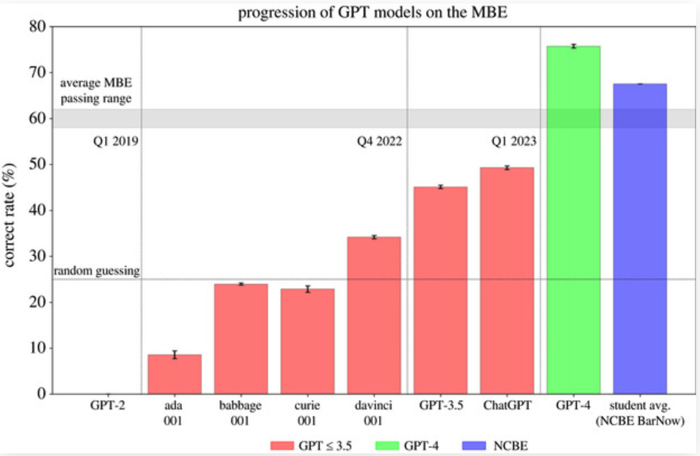{width="60%"}

## ประสิทธิภาพของ Generative AI ในงานด้านธุรการ {.smaller}

::: {style="font-size:70%;"}
-   📊 **OfficeBench (งานสำนักงานจำลอง)**
    -   GPT-4 ทำงานผ่านได้เพียง \~47%\
    -   ยังไม่ถึงระดับมนุษย์ที่ \~90%+
-   🖋️ **การร่างเอกสารราชการ**
    -   เขียนได้ใกล้เคียง แต่ format/ถ้อยคำยังต้องตรวจแก้\
    -   เสี่ยงผิดเลขที่หนังสือหรือคำราชการ
-   🧾 **การสรุปเอกสาร/บันทึกการประชุม**
    -   ทำได้ดีพอสมควร แต่ยังมีการตกหล่นหรือแต่งเติมข้อมูล
-   🤝 **แนวโน้มพัฒนา**
    -   GPT-5 ลด hallucination และ reasoning ดีขึ้น\
    -   แต่ต้องเชื่อมกับระบบจริง (RAG + Workflow automation) และมี human review

**อ้างอิง**

-   OpenAI. *Introducing GPT-5*. (2025).
    [openai.com](https://openai.com/index/introducing-gpt-5)\
-   Shi et al. (2024). *OfficeBench: Benchmarking LLMs on Office Tasks*.
    arXiv:2407.19056\
-   Bubeck et al. (2023). *Sparks of Artificial General Intelligence*.
    arXiv:2303.12712\
-   Wikipedia. *Language model benchmark* (GAIA, WebArena, OSWorld).
    [wikipedia.org](https://en.wikipedia.org/wiki/Language_model_benchmark)\
-   Legalon Tech. (2025). *GPT-5 Speed vs Smarts: Legal AI Evaluation*.
    [legalontech.com](https://www.legalontech.com/post/gpt-5-speed-vs-smarts)
:::

## ข้อจำกัดของ Generaive AI ในงานด้านธุรการ {.smaller}

-   🗂️ **งานธุรการ = workflow ต่อเนื่อง**\
    ต้องจัดการหลายขั้นตอน ไม่ใช่คำตอบเดียวแบบข้อสอบ

-   ✅ **ต้องถูกต้องเป๊ะ**\
    หนังสือราชการผิดแม้แต่นิดเดียว = ใช้ไม่ได้\
    แต่ GPT ยังมีโอกาส hallucination

-   📑 **ขึ้นกับบริบทเฉพาะองค์กร**\
    เช่น รูปแบบหนังสือราชการศาล → GPT ที่ไม่ถูกฝึกเฉพาะมักเขียนผิด format

-   🔒 **ข้อมูลจริงอยู่ในระบบปิด**\
    เอกสาร/ระเบียบราชการไม่ได้เปิดสาธารณะ → GPT จึงมัก “เดา”

## ภาพรวมเครื่องมือ Gen AI สำหรับงานด้านกฎหมาย {.smaller}

::: {style="font-size:65%;"}
**กลุ่มที่ 1: โมเดลภาษาอเนกประสงค์ (General-Purpose LLMs)** เป็น AI
ที่มีความสามารถทางภาษาและตรรกะสูง เหมาะกับงานที่ต้องการ "การคิด" วิเคราะห์
และสังเคราะห์ข้อมูล

-   [ChatGPT](https://chatgpt.com/)
-   [Gemini](https://gemini.google.com/)
-   [Claude](https://claude.ai/)

**กลุ่มที่ 2: AI เพื่อการสืบค้น (AI for Research)** เป็น AI
ที่เน้นการค้นหาข้อมูลล่าสุดจากอินเทอร์เน็ต พร้อมแสดงแหล่งอ้างอิงเพื่อการตรวจสอบย้อนกลับ

-   [ResearchRabbit](https://www.researchrabbit.ai/)

-   [SciSpace](https://scispace.com/)

-   [Perplexity](https://www.perplexity.ai/)

-   [Consensus](https://consensus.app/)/[Elicit](https://elicit.com/)

-   Chatgpt/Claude/Gemini

**กลุ่มที่ 3: ผู้ช่วยจัดการความรู้ (Knowledge Assistant)** เป็น AI
ที่ทำงานกับเอกสารส่วนตัวจำนวนมากที่เราป้อนเข้าไป เพื่อช่วยสกัดและเชื่อมโยงข้อมูล

-   [NotebookLM](https://notebooklm.google.com/)

**กลุ่มที่ 4: ผู้ช่วยสร้างสื่อประชาสัมพันธ์**

-   [Canva](https://www.canva.com/)

-   [Gamma](https://gamma.app/)

-   [Google Vids](https://workspace.google.com/intl/th/products/vids/)
:::

## เปรียบเทียบ Gen AI

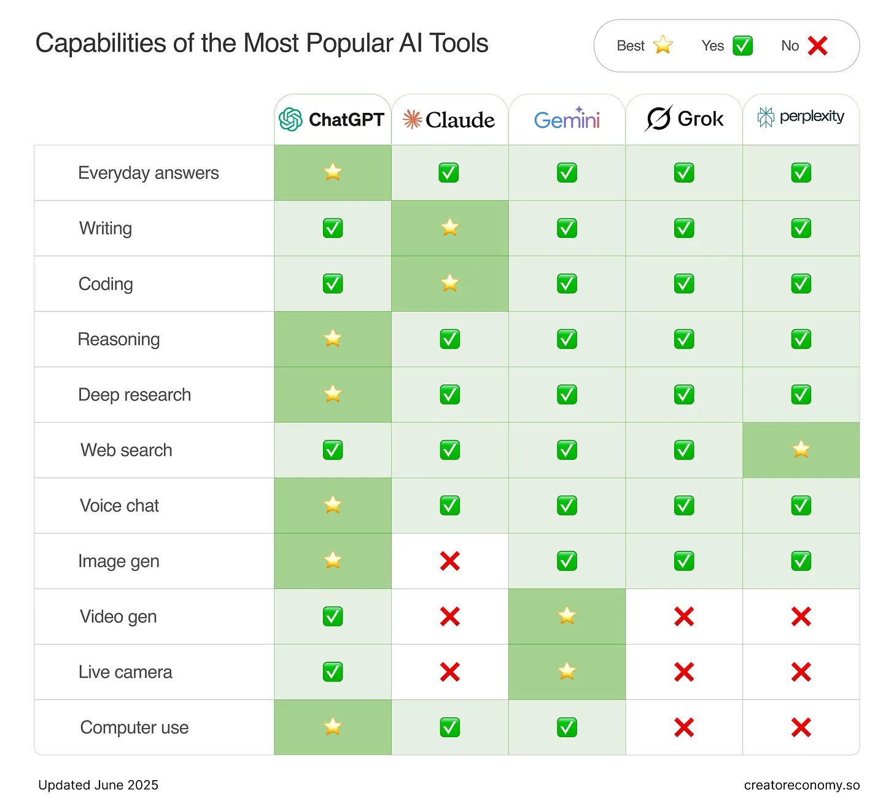{width="588"}

## AI Usage Framework

::::: columns
::: {.column width="50%"}

:::

::: {.column width="50%"}
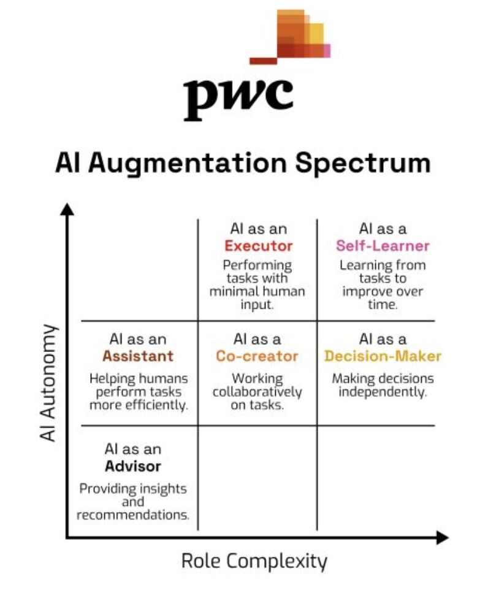
:::
:::::

## Human in the Loop

::::: columns
::: {.column width="50%"}
<p style="font-size:80%;">

มนุษย์มีส่วนร่วมและบทบาทสำคัญในการตรวจสอบ ปรับปรุงระบบ AI อย่างต่อเนื่อง เพื่อทำให้ AI
มีประสิทธิภาพ แม่นยำ และน่าเชื่อ

</p>
:::

::: {.column width="50%"}
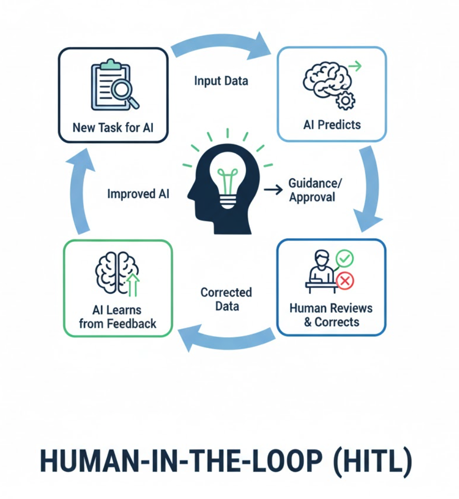
:::
:::::

# Part 4: Generative AI กับงานเอกสาร {.smaller}

-   การแปลเอกสาร

-   การร่างหนังสือราชการ/Email/สุนทรพจน์

-   การสรุปและเปรียบเทียบเนื้อหาจากเอกสาร

-   การสรุปเนื้อหาการประชุม และการเขียนบันทึกการประชุม

## การแปลภาษา {.smaller}

-   **การแปลเพื่อจับใจความ/ทำความเข้าใจ/สังเคราะห์ประเด็น**\
    เน้นความหมายรวม อ่านรู้เรื่อง เข้าใจประเด็น ไม่ยึดติดคำต่อคำ\

-   **การแปลตรงตัวสำหรับงานราชการ**\
    เน้นความถูกต้อง รูปแบบครบถ้วน คำศัพท์สม่ำเสมอ ใช้ในเอกสารทางการ 

## การแปลเพื่อจับใจความ/สังเคราะห์ประเด็น {.smaller}

::::: columns
::: {.column width="60%"}
<br>

**ลักษณะเด่น**\

-   ภาษาธรรมชาติ อ่านง่าย\
-   อาจย่อ/ตีความบางส่วนเพื่อความชัดเจน\
-   เหมาะกับการอ่านบทความ งานวิจัย ข่าวสาร
-   สามารถปรับข้อความให้เหมาะกับกลุ่มเป้าหมายได้
-   ผู้อ่านสามารถซักถาม สร้างคำอธิบายเนื้อหาเพิ่มเติมได้

**เครื่องมือที่เกี่ยวข้อง**

-   ChatGPT, Gemini, Claude

-   NotebookLM

-   Atlas, Comet

[ดาวน์โหลดเอกสารตัวอย่าง](https://drive.google.com/file/d/1cQ90SY4pVO0UoQK8b3Ui3-VzwYKrBcme/view?usp=sharing)
:::

::: {.column width="40%"}
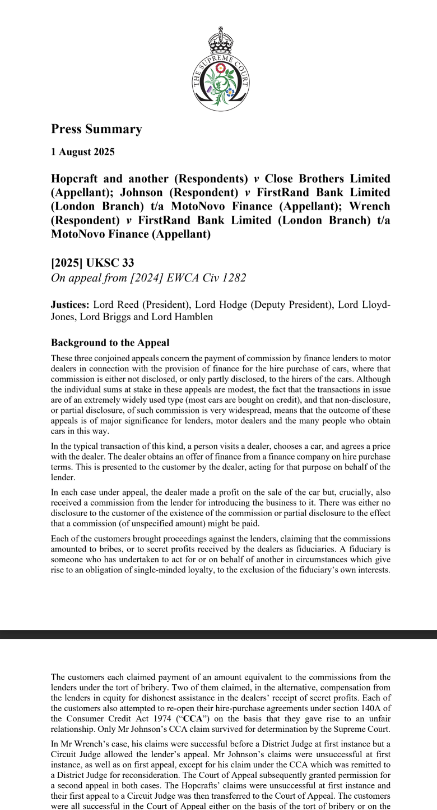{width="80%"}
:::
:::::

## ตัวอย่าง : Gemini in Google Drive

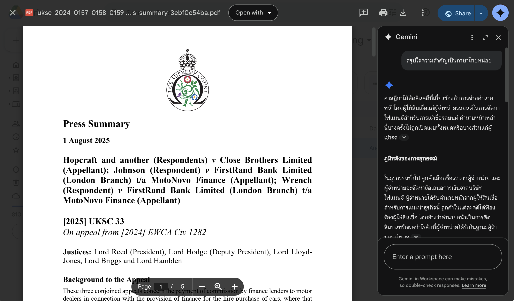

## ตัวอย่าง : ChatGPT {.smaller}

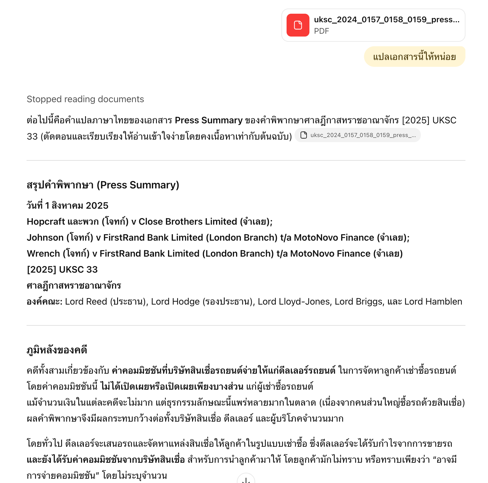{width="80%"}

<br>

[ดูตัวอย่างผลลัพธ์](https://chatgpt.com/share/690a4a87-36d0-8003-b9c4-ee286957dee4)

## การแปลตรงตัวสำหรับงานราชการ {.smaller}

::: callout
การแปลเอกสารตรงตัวด้วย LLM ผู้ใช้ต้องระมัดระวังเป็นพิเศษ เพราะ LLM
มีแนวโน้มจะสรุปความ ดัดแปลงภาษา และอาจละเลยคำที่ไม่จำเป็นในเชิงภาษา
แต่ในเอกสารราชการอาจมีความสำคัญ
:::

::::: columns
::: {.column width="50%"}
**ลักษณะเด่น**\

-   แปลตรงตามต้นฉบับ ไม่ตัดทอน\
-   คงรูปแบบหัวข้อ หมายเลขข้อ ตาราง\
-   ใช้สำนวนทางการ และควบคุมศัพท์เฉพาะ

**เครื่องมือที่เกี่ยวข้อง**

-   ChatGPT, Gemini, Claude
:::

::: {.column width="50%"}
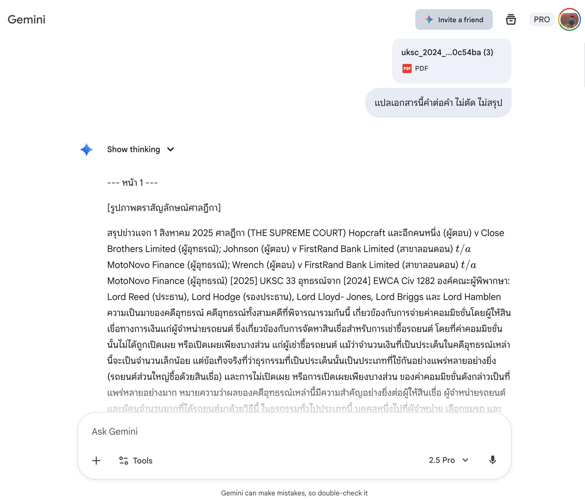
:::
:::::

## การแปลตรงตัวสำหรับงานราชการ {.smaller}

ประเด็นที่ควรระวังในการแปลเอกสาร

1.  ภาษาเป้าหมาย + โทน (ราชการ/วิชาการ/อ่านง่าย)

2.  ขอบเขต (ทั้งเอกสาร/เฉพาะบท/เฉพาะตาราง)

3.  ความตรงของเนื้อความ (ห้ามสรุป/ห้ามตัดทอน) หรือ “ปรับสำนวนให้อ่านง่าย”

4.  การรักษารูปแบบ (หัวข้อ, bullet, ตาราง, Markdown)

5.  ศัพท์เฉพาะ/Glossary (คำว่า X ให้แปลว่า … เสมอ)

6.  ข้อกำกับ QA (เช่น ตรวจคำทับศัพท์/ปี ค.ศ.–พ.ศ./หน่วย)

7.  อาจแบ่งเอกสารเป็นส่วนย่อย ๆ เพื่อแปลทีละส่วน

## AI ผู้ช่วยเขียนหนังสือราชการ {.smaller}

-   AI ทำได้ดีในระดับเนื้อความ (content level) แต่ยังไม่แม่นยำใน
    สำนวนและรูปแบบภาษาราชการ (stylistic level)

-   การใช้ควรมีความระมัดระวัง ผลลัพธ์อาจคล้ายหนังสือราชการ แต่ไม่ถูกต้อง เช่น รูปแบบผิด
    สำนวนผิดบริบท หรือลำดับโครงการไม่ถูกต้อง

**แนวทางการใช้ที่เหมาะสม**

-   ให้ AI ทำงานแบบ Template + Intent Filling เช่น มี template
    หนังสือเชิญประชุมภายในหน่วยงาน แล้วให้ AI กรอกเฉพาะช่องเนื้อหาบางช่อง
    โดยมีเจ้าหน้าที่ตรวจสอบและปรับสำนวน

    -   หัวเรื่อง

    -   ใจความหลัก

-   พัฒนาโมเดล AI เฉพาะองค์กรด้วยคลังหนังสือราชการจริง

## AI ผู้ช่วยเขียนหนังสือราชการ {.smaller}

::::::::::: columns
:::: {.column width="20%"}
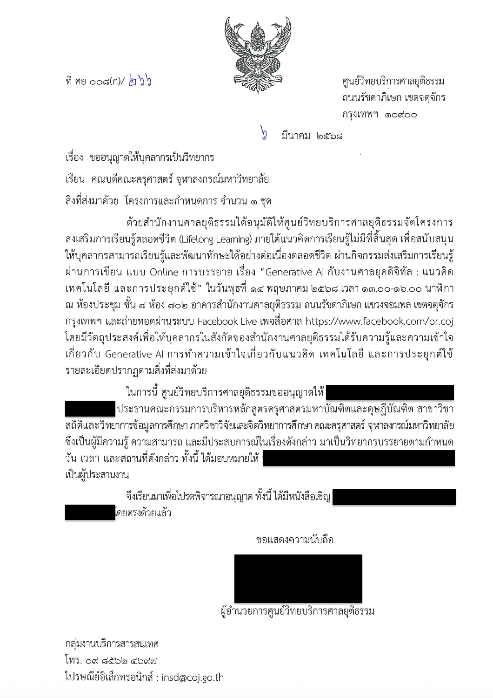

::: {style="font-size:70%;"}
-   การให้จดหมายต้นเรื่อง/ตัวอย่างเป็นบริบท

-   เน้นให้ AI เขียนส่วนเนื้อความ

-   ใช้ Canvas เป็นเครื่องมือปรับแต่ง ช่วยให้ผู้ใช้สามารถมีปฏิสัมพันธ์กับ AI ได้สะดวกขึ้น
:::
::::

::: {.column width="2%"}
:::

:::: {.column width="33%"}
::: {style="font-size:80%;"}
:::

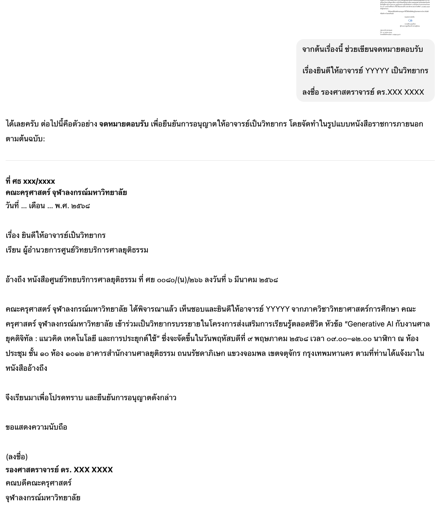{.fragment}
::::

::: {.column width="2%"}
:::

:::: {.column width="42%"}
::: {style="font-size:80%;"}
:::

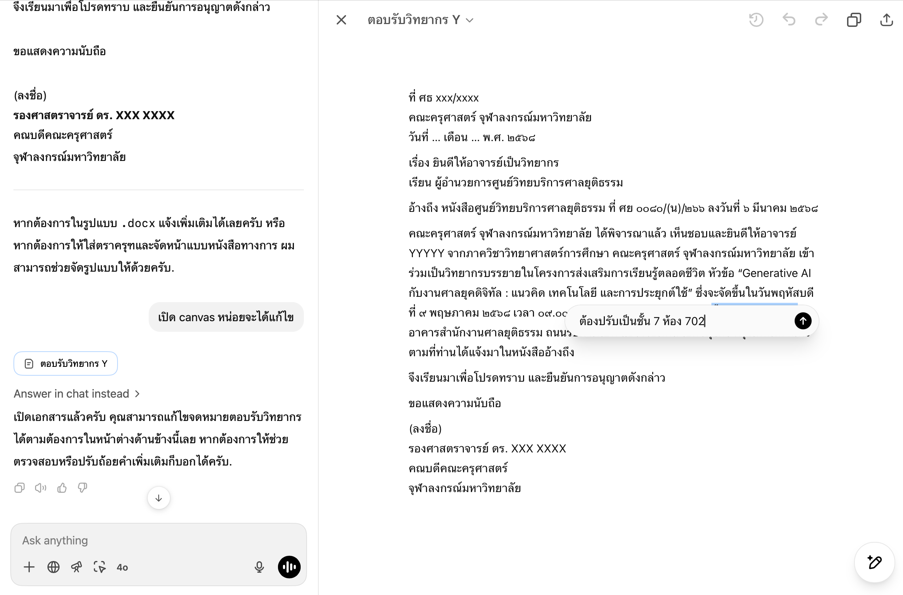{.fragment}
::::
:::::::::::

## แนะนำ Custom GPT {.smaller}

<br>

::: {style="font-size:80%;"}
-   Prompt engineering + Context injection

-   สามารถปรับแต่ง GPT ให้มีความเฉพาะและเหมาะกับการทำงานในแต่ละบริบท

-   ไม่จำเป็นต้องเขียน code
:::

<left>
{width="30%"}
</left>

## ตัวอย่างการออกแบบ Custom GPT {.smaller}

::: {style="font-size:80%;"}
-   ปรับแต่ง ChatGPT ด้วย instruction และข้อมูลตัวอย่างหนังสือราชการเฉพาะองค์กร

-   ปัจจุบันมีผู้สร้าง custom GPT -- SarabunGPT
    สามารถใช้เป็นผู้ช่วยร่างหนังสือราชการไทย และให้คำแนะนำได้

    -   ในเมนู Sidebar ของ ChatGPT คลิกเลือก `Explore GPTs`

    -   ค้นหา GPTs ชื่อ SarabunGPT
:::

::::: columns
::: {.column width="50%"}
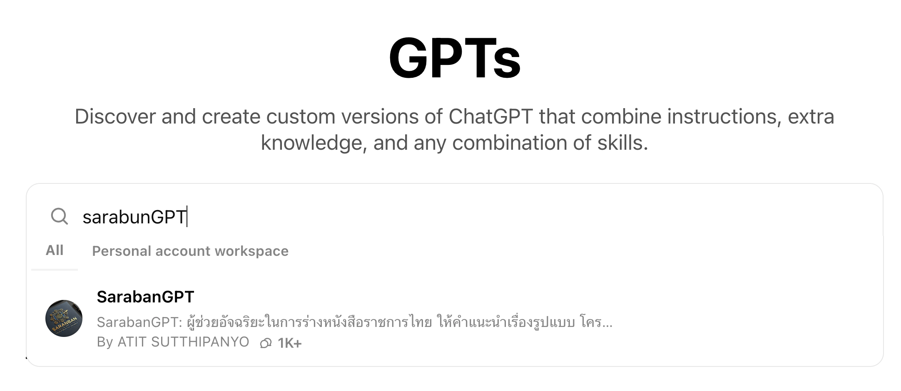
:::

::: {.column width="50%"}
<br>

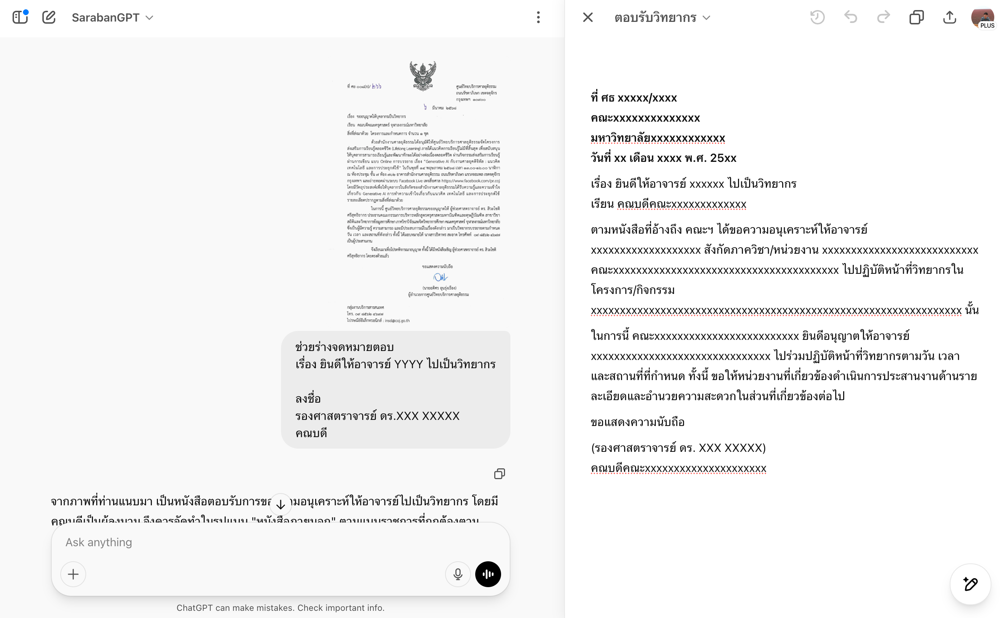
:::
:::::

## ตัวอย่างการออกแบบ Custom GPT {.smaller}

<br>

<center>

[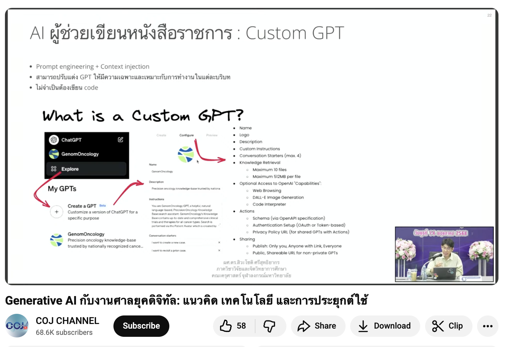{width="60%"}](https://www.youtube.com/live/4iRxtKeXtJo)

*เลื่อนคลิปไปเวลาประมาณ 02:02:29*

[ดาวน์โหลด materials ในคลิป](https://drive.google.com/drive/folders/1GFUva0jQTncXwfX9ip24BHmLCcGuJpX0?usp=drive_link)


</center>

## การสรุปเนื้อหาจากเอกสาร {.smaller}

-   เอกสารขนาดเล็ก (ChatGPT, Gemini, Claude, ...)

-   เอกสารขนาดใหญ่/หลายเอกสาร (NotebookLM)

::::: columns
::: {.column width="50%"}
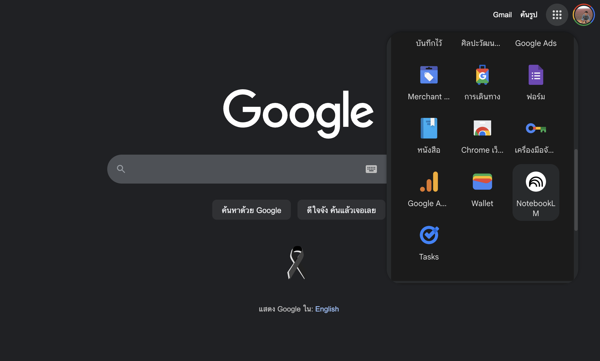
:::

::: {.column width="50%"}
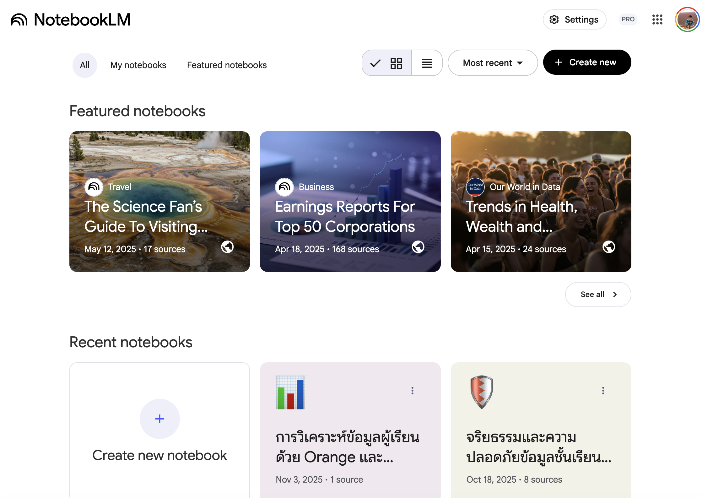
:::
:::::

## NotebookLM {.smaller}

เครื่องมือ AI จาก Google ที่ออกแบบให้ “อ่าน สรุป และวิเคราะห์เอกสาร”

-   ช่วยให้ผู้ใช้งาน อัปโหลดเอกสาร แล้วถามคำถามเกี่ยวกับเอกสารนั้นได้โดยตรง

-   เหมาะสำหรับเอกสารจำนวนมาก เช่น คำพิพากษา ตำรากฎหมาย รายงานสำนวน

🦾 จุดเด่น

-   ตอบคำถามจาก “เอกสารของเรา” เท่านั้นโดยไม่ใช้ข้อมูลจาก Pre-Trained data
    และข้อมูลภายนอก

-   ใช้งานง่าย ไม่ต้องพิมพ์ prompt ยาว

-   มีความเป็นส่วนตัว ปลอดภัยกว่าการใช้ AI ทั่วไป (ข้อมูลไม่รั่วไหล)

## NotebookLM ทำอะไรได้บ้าง {.smaller}

<br>

:::::: columns
:::: {.column width="40%"}
::: {style="font-size:80%;"}
ค้นหาข้อมูล/สกัดประเด็นสำคัญจากไฟล์ดิจิทัลหลากหลายรูปแบบ

-   สรุปข้อเท็จจริงจากคำพิพากษา/ระเบียบ ข้อบังคับ/บันทึกเสียงการประชุม

-   เปรียบเทียบแนวคำวินิจฉัย/ฎีกา/ระเบียบเก่า vs ใหม่

-   ตรวจสอบคำอธิบายกฎหมายจากเอกสารอ้างอิง

-   จัดทำบทความวิเคราะห์

-   สรุป/สังเคราะห์เนื้อหากฎหมาย บทความวิชาการ กรณีศึกษาต่าง ๆ

-   Knowledge management ภายในองค์กร
:::
::::

::: {.column width="60%"}
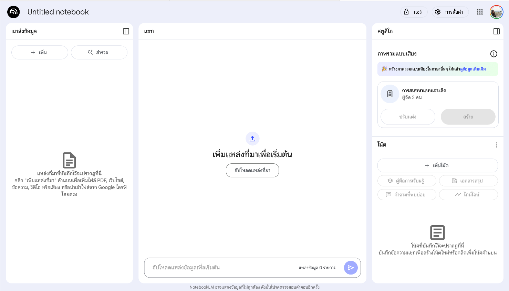{width="100%"}
:::
::::::

## สามารถ Upload เอกสารได้หลาย Format {.smaller}

ครอบคลุมเอกสารดิจิทัลที่มีในปัจจุบัน

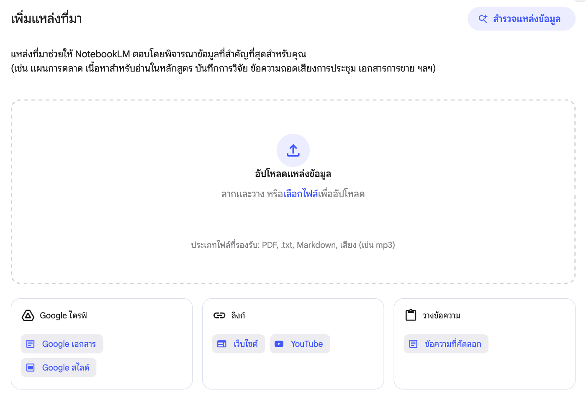

## ตัวอย่างการใช้งาน NotebookLM {.smaller}

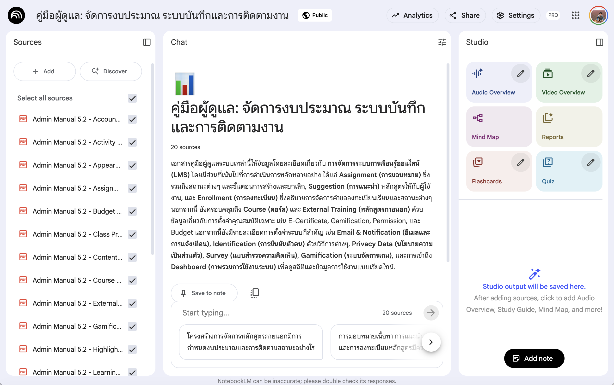{width="100%"}

## ตัวอย่างการใช้งาน NotebookLM {.smaller}

<br>

::::: columns
::: {.column width="65%"}
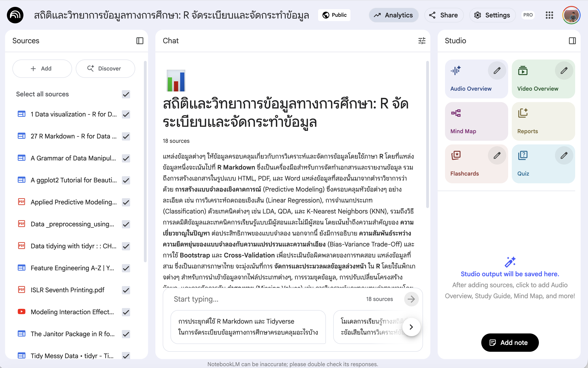
:::

::: {.column width="35%"}
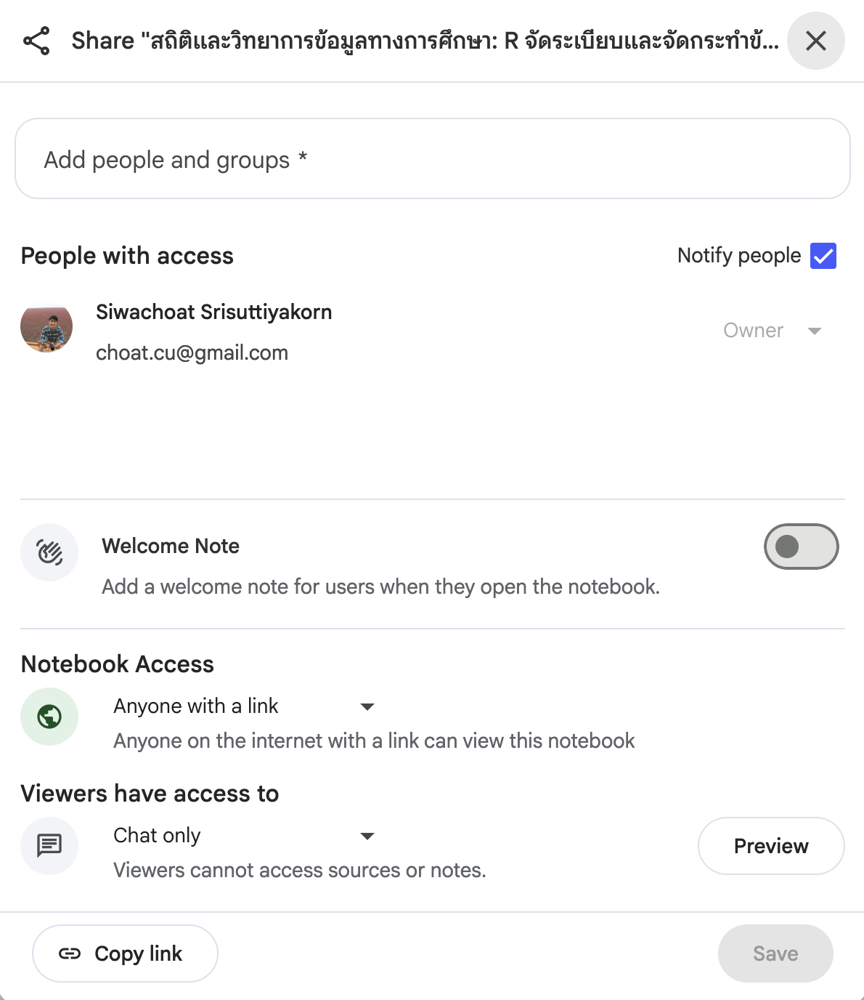
:::
:::::

## Feature ต่าง ๆ ของ NotebookLM {.smaller}

> *NotebookLM มีเครื่องมือหลายตัวที่สามารถนำไปประยุกตฺ์ใช้ได้อย่างหลากหลาย*

::::: columns
::: {.column width="30%"}
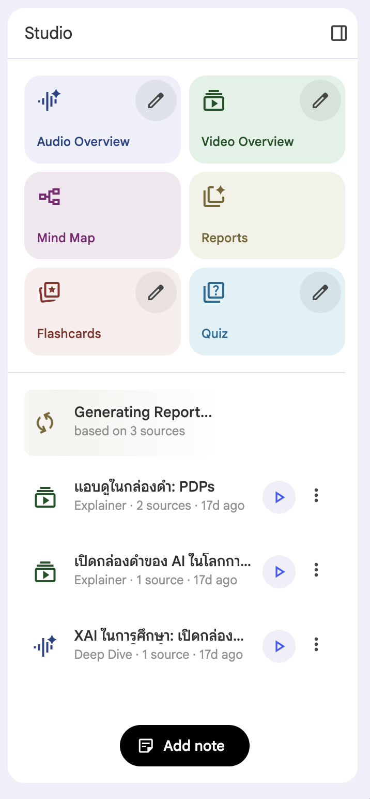{width="80%"}
:::

::: {.column width="70%"}
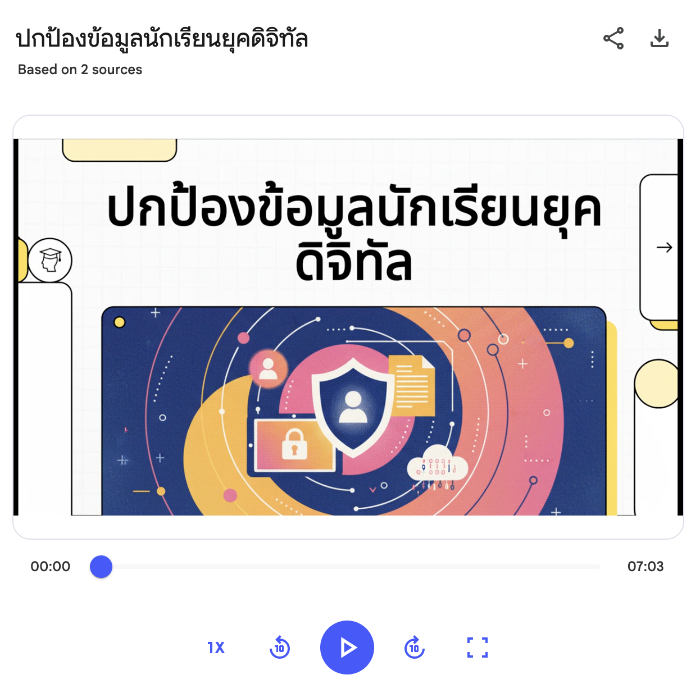{width="80%"}
:::
:::::

## Feature ต่าง ๆ ของ NotebookLM

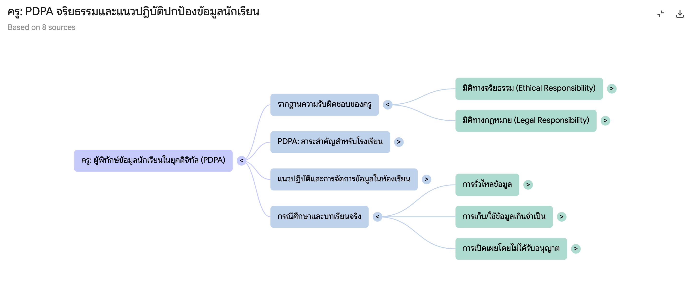

## การเปรียบเทียบเอกสาร {.smaller}

Generative AI สามารถช่วยเปรียบเทียบความเหมือนและความแตกต่างของเอกสาร เช่น

-   การเปรียบเทียบร่าง TOR หรือเอกสารสัญญาที่มีการปรับแก้ไขหลาย version

-   การเปรียบเทียบคำพิพากษาหรือคำสั่งศาล

-   การเปรียบเทียบเอกสารทางกฎหมาย เช่น กฎหมาย/ประกาศ/ระเบียบที่มีการแก้ไข
    ระหว่างฉบับเดิมและฉบับแก้ไข

## ตัวอย่างการเปรียบเทียบเกณฑ์และวิธีการคำนวณภาระงาน {.smaller}

:::::: columns
::: {.column width="35%"}
<p style="font-size:80%;">

-   [เกณฑ์และวิธีการคำนวณภาระงาน พ.ศ.
    2561](https://www.edu.chula.ac.th/sites/default/files/users/user8/%E0%B9%81%E0%B8%81%E0%B9%89%E0%B9%84%E0%B8%82.pdf)

-   [เกณฑ์และวิธีการคำนวณภาระงาน พ.ศ.
    2565](https://www.edu.chula.ac.th/sites/default/files/users/user8/02%20%E0%B8%9B%E0%B8%A3%E0%B8%B0%E0%B8%81%E0%B8%B2%E0%B8%A8%E0%B8%84%E0%B8%93%E0%B8%B0%E0%B8%84%E0%B8%A3%E0%B8%B8%E0%B8%A8%E0%B8%B2%E0%B8%AA%E0%B8%95%E0%B8%A3%E0%B9%8C%20%E0%B9%80%E0%B8%81%E0%B8%93%E0%B8%91%E0%B9%8C%E0%B8%A0%E0%B8%B2%E0%B8%A3%E0%B8%B0%E0%B8%87%E0%B8%B2%E0%B8%99%202565.pdf)

</p>

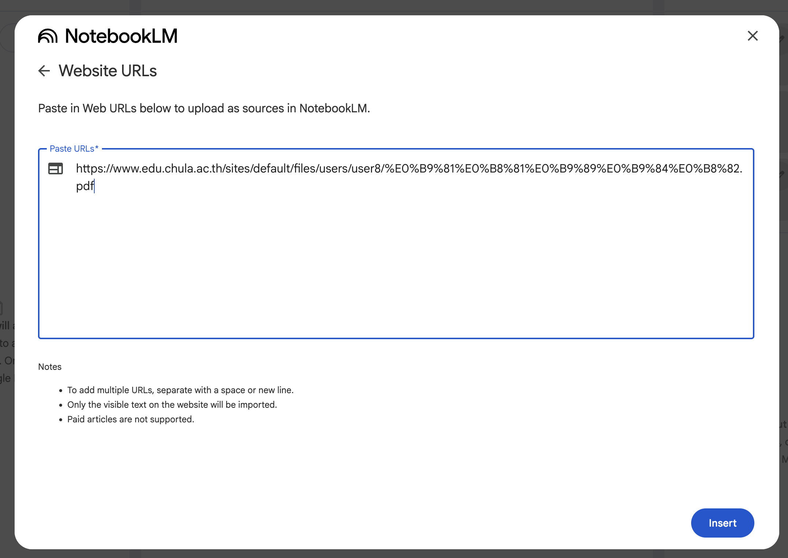{width="80%"}

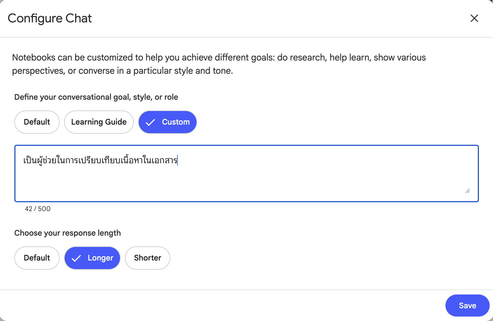{width="80%"}
:::

::: {.column width="5%"}
:::

::: {.column width="55%"}
```         
เปรียบเทียบหลักเกณฑ์และวิธีการคำนวณภาระงาน ระหว่าง พ.ศ. 2565 กับ 2561 ว่ามีประเด็นใดบ้างที่แตกต่างกัน และแตกต่างกันอย่างไร โดยทำเป็นตารางเปรียบเทียบให้ครบทุกประเด็น
```

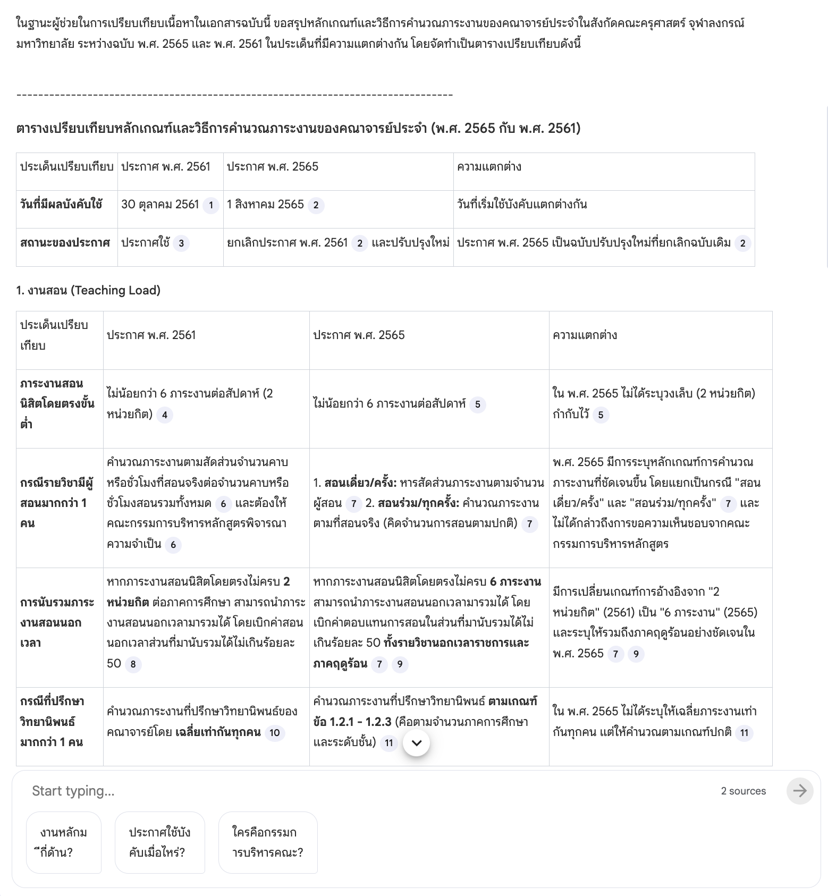{width="95%"}
:::
::::::

## ตัวอย่างการเปรียบเทียบเกณฑ์และวิธีการคำนวณภาระงาน {.smaller}

::::: columns
::: {.column width="50%"}
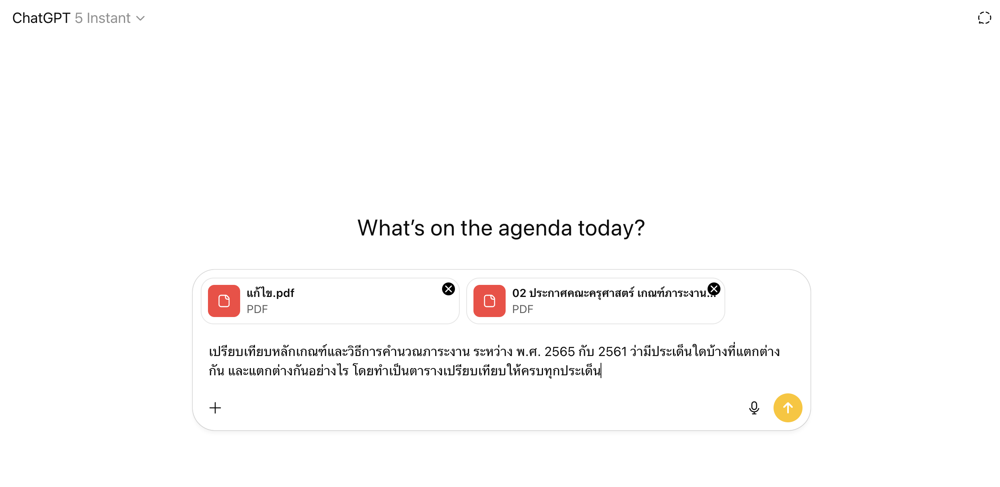

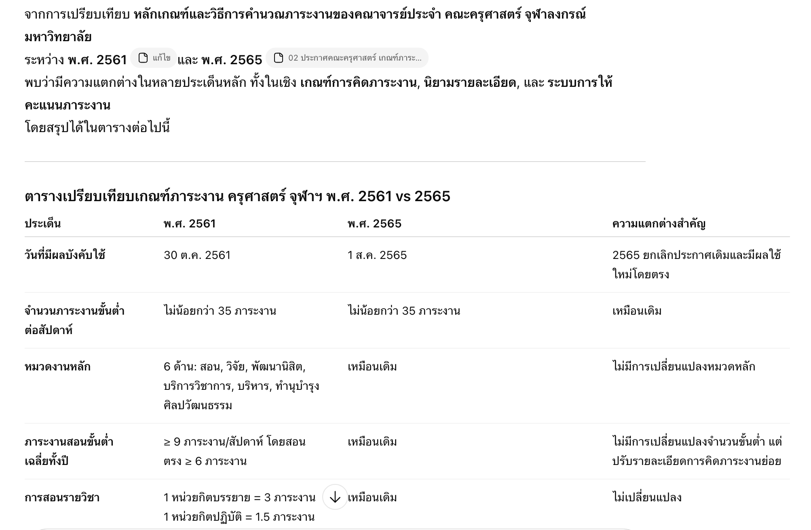
:::

::: {.column width="50%"}
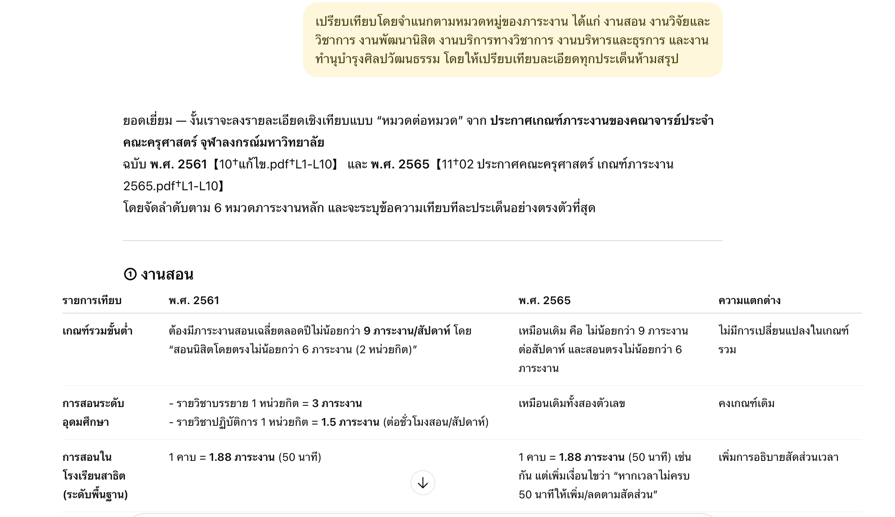

<br>
[คลิกเพื่อดูตัวอย่างทั้งหมด](https://chatgpt.com/share/690b0e69-9344-8003-abff-bc76db5b51b9)
:::
:::::

## การสรุปเนื้อหาการประชุม และการเขียนบันทึกการประชุม {.smaller}

NotebookLM/ChatGPT สามารถสรุปบันทึกการประชุมจากเอกสาร/ไฟล์เสียงที่เกี่ยวข้องได้

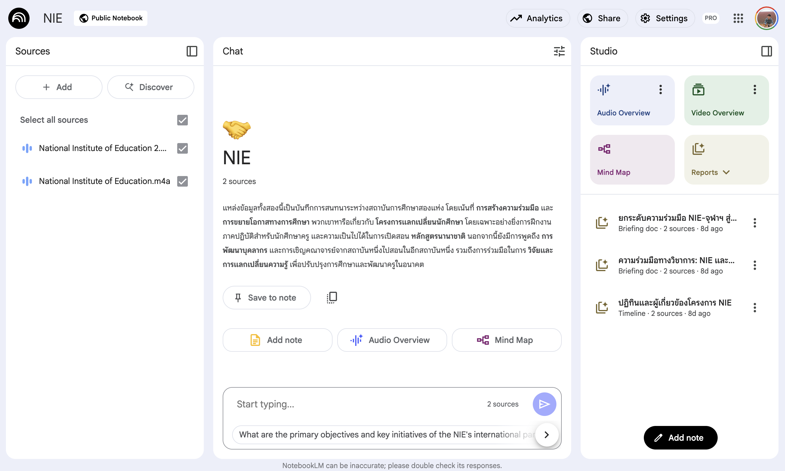

# Part 5: การวิเคราะห์และสังเคราะห์ข้อมูล {.smaller}

AI สามารถช่วยวิเคราะห์ข้อมูลและสร้างรายงานต่าง ๆ เช่น

-   รายงานจำนวนหนังสือราชการที่รับ–ส่ง

-   รายงานสถิติคดีศาลยุติธรรม

-   รายงานผลการดำเนินงานประจำปี

-   รายงานข้อมูลสถิติการให้บริการของส่วนระบบข้อมูลและสถิติ

-   รายงานผลการปฏิบัติงานและการใช้จ่ายงบประมาณ

-   รายงานการจัดซื้อจัดจ้างหรือการจัดหาพัสดุ

## ตัวอย่างการวิเคราะห์ข้อมูลในเอกสาร/รายงานทางราชการ {.smaller}

-   สรุปข้อมูลด้วยสถิติเชิงบรรยาย

-   การรายงานและตีความหมาย

-   การสร้างแผนภาพทางสถิติ

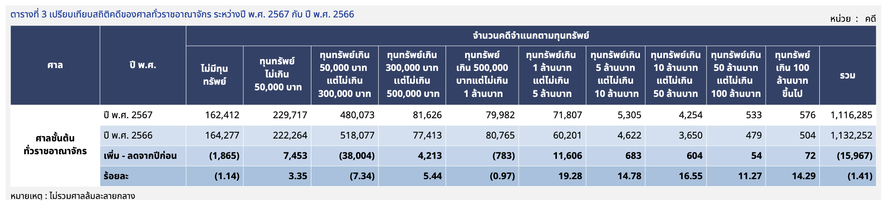

## ตัวอย่างการวิเคราะห์ข้อมูลในเอกสาร/รายงานทางราชการ {.smaller}

::::: columns
::: {.column width="40%"}
-   สรุปข้อมูลด้วยสถิติเชิงบรรยาย

-   การรายงานและตีความหมาย

-   การสร้างแผนภาพทางสถิติ

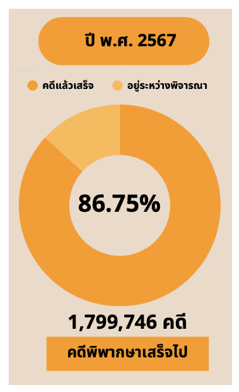{width="70%"}
:::

::: {.column width="60%"}
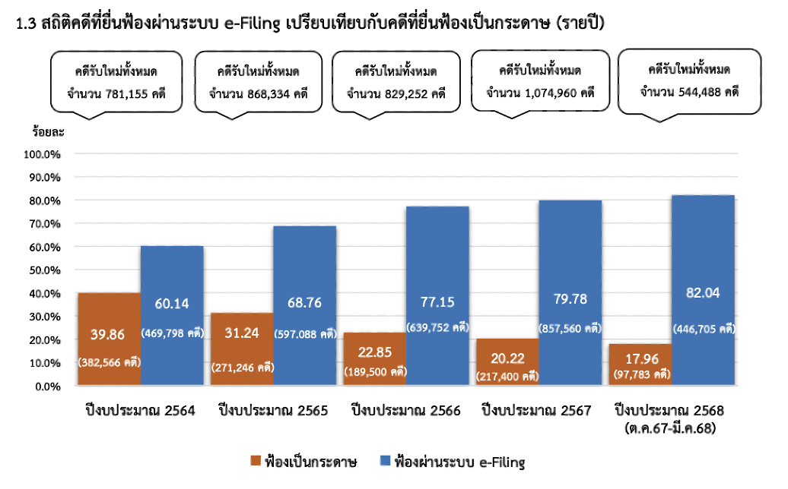{width="85%"}

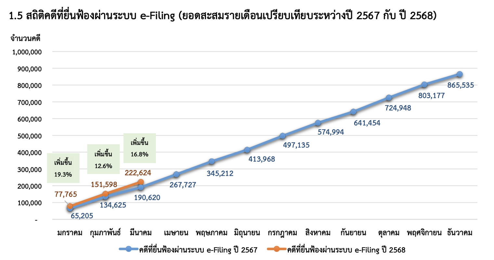{width="85%"}
:::
:::::

## GEMINI in Google Sheets : การวิเคราะห์ข้อมูลพื้นฐาน {.smaller}

{width="30%"}

::::: columns
::: {.column width="40%"}
-   วิเคราะห์และสรุปข้อมูล

-   เขียน/แก้ไขสูตรคำนวณให้อัตโนมัติ

-   สร้างกราฟ/แผนภูมิอย่างรวดเร็ว
:::

::: {.column width="60%"}
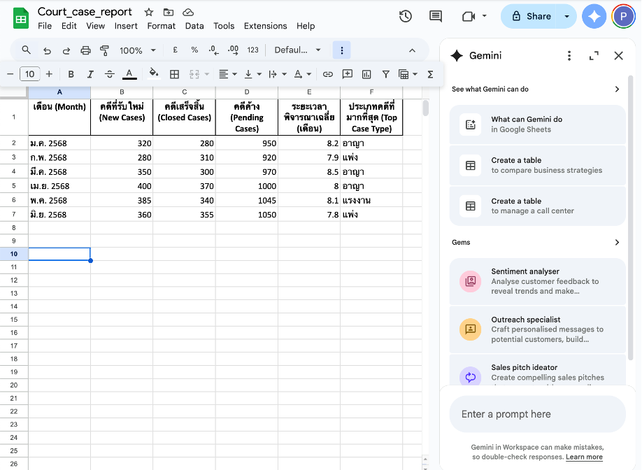
:::
:::::

## GEMINI in Google Sheets : การวิเคราะห์ข้อมูลพื้นฐาน {.smaller}

{width="30%"}

::::: columns
::: {.column width="50%"}
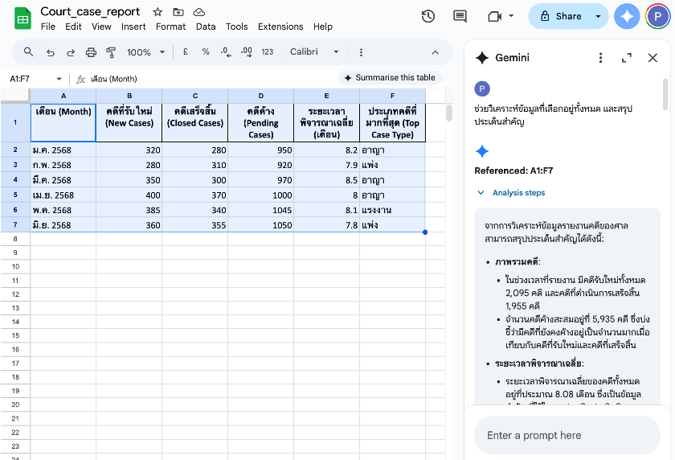
:::

::: {.column width="50%"}
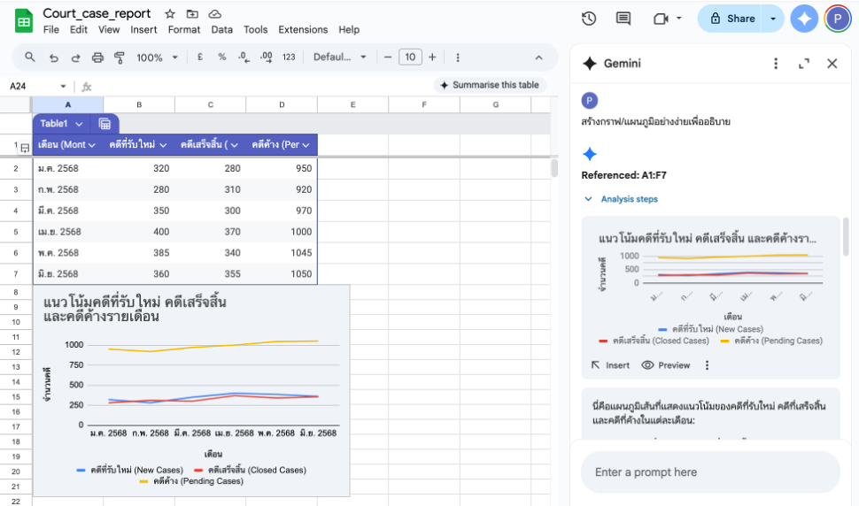
:::
:::::

## GEMINI in Google Sheets : การวิเคราะห์ข้อมูลพื้นฐาน {.smaller}

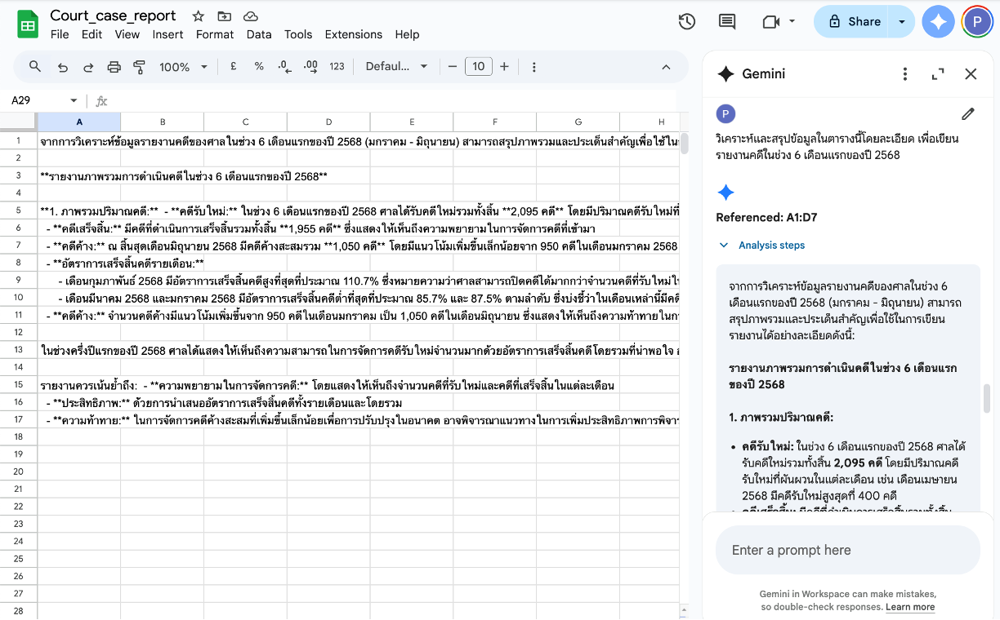

## AI สำหรับการวิเคราะห์ข้อมูล {.smaller}

มี Generative AI Application อีกหลายตัวที่มีความสามารถในการวิเคราะห์ข้อมูล
สร้างแผนภาพทางสถิติ และตีความหมายผลการวิเคราะห์

-   ChatGPT

-   Gemini

-   Claude

-   Manus

-   JuliusAI

-   ...

# Part 6: การสืบค้นข้อมูล {.smaller}

-   Google AI Search

-   NotebookLM -- Discovery Sources Feature

-   Perplexity

-   Web Search Feature in ChatGPT/Gemini/Claude

-   Deep Research in ChatGPT/Perplexity/Gemini/Claude

## Google AI Search {.smaller}

<br>

::::: columns
::: {.column width="50%"}
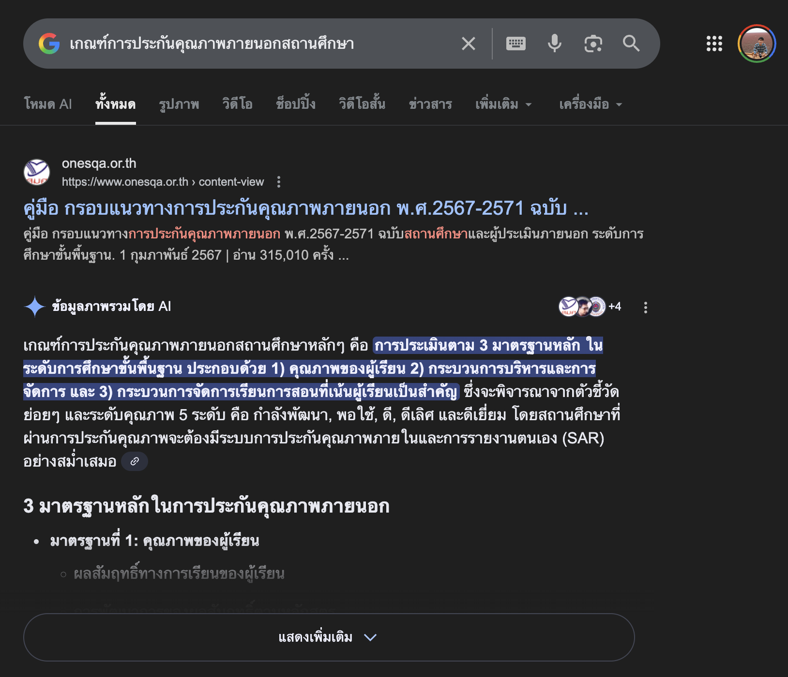
:::

::: {.column width="50%"}
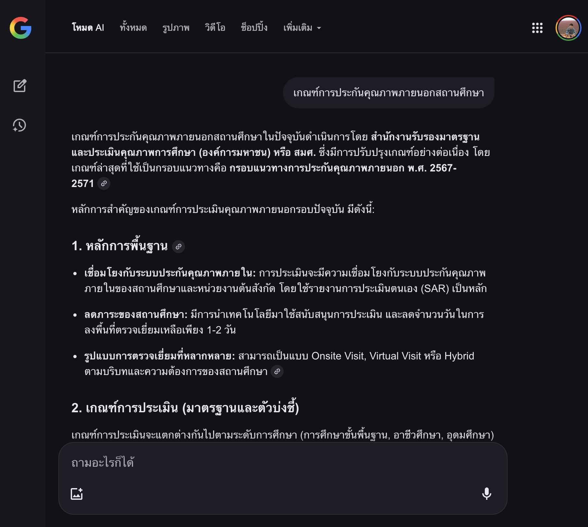{width="100%"}
:::
:::::

## NotebookLM -- Discovery Sources Feature {.smaller}

<br>

::::: columns
::: {.column width="50%"}
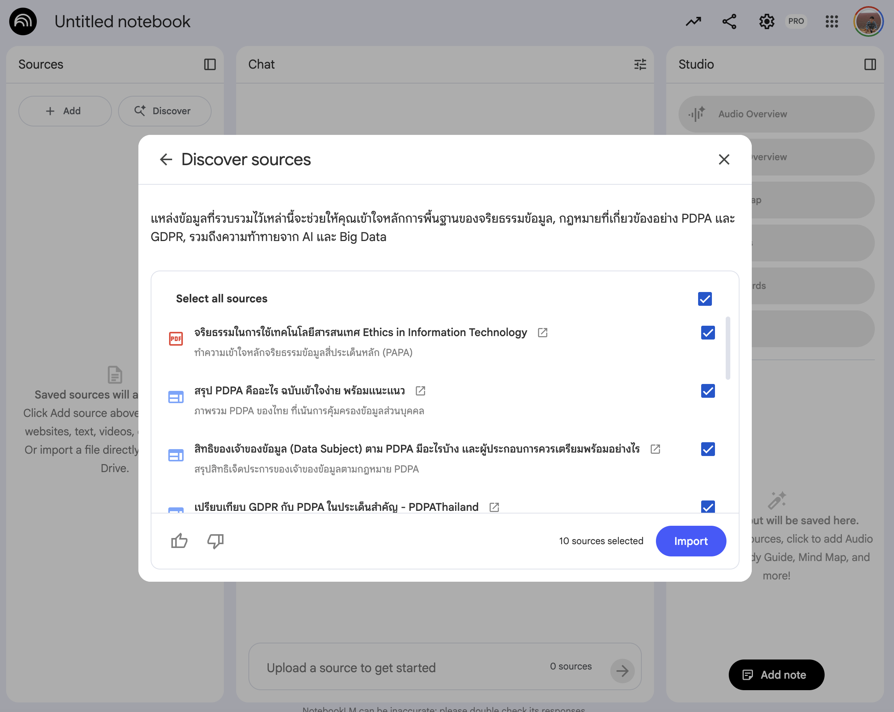
:::

::: {.column width="50%"}
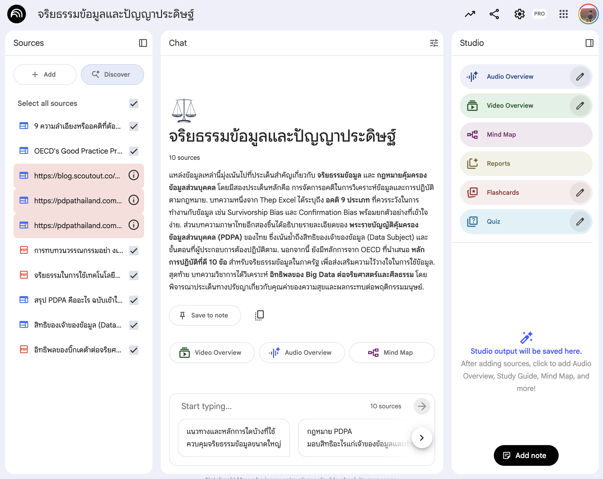
:::
:::::

## Perplexity {.smaller}

::::: columns
::: {.column width="50%"}
-   สืบค้น/สรุปข้อมูลแบบ real-time

-   ให้แหล่งอ้างอิง (citation)

-   สามารถเลือก/ระบุแหล่งข้อมูลที่ต้องการค้นหา

-   ระบบช่วยค้นหาเชิงลึกแบบต่อเนื่องด้วย \n Copilot Mode
:::

::: {.column width="50%"}
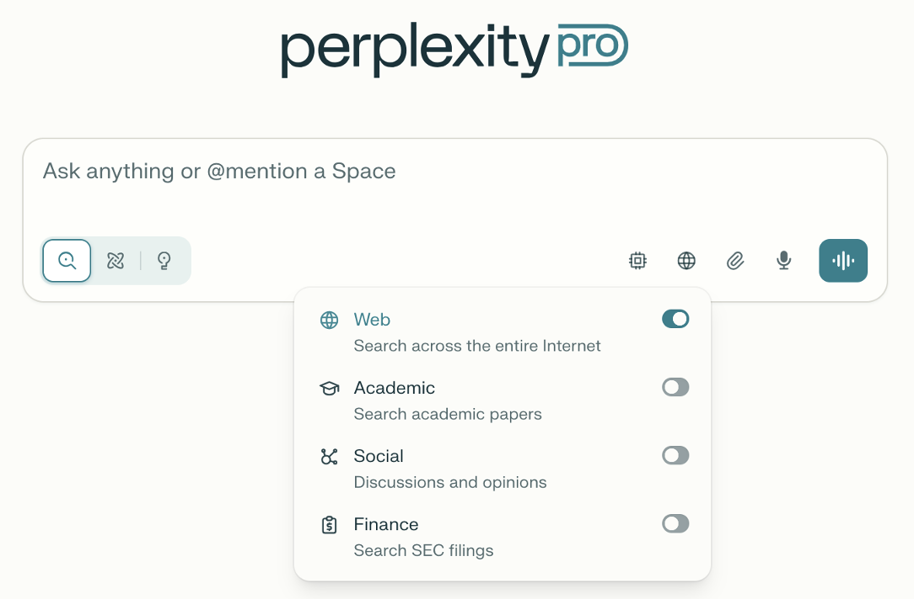
:::
:::::

## Perplexity {.smaller}

::::: columns
::: {.column width="50%"}
-   สืบค้น/สรุปข้อมูลแบบ real-time

-   ให้แหล่งอ้างอิง (citation)

-   สามารถเลือก/ระบุแหล่งข้อมูลที่ต้องการค้นหา

-   ระบบช่วยค้นหาเชิงลึกแบบต่อเนื่องด้วย \n Copilot Mode
:::

::: {.column width="50%"}
{width="30%"}


:::
:::::

## Perplexity {.smaller}

::::: columns
::: {.column width="50%"}
การใช้งานในบริบทวิชาการ ตัวอย่าง Prompt เช่น “บทความวิชาการ/งานวิจัยเกี่ยวกับ AI
ในงานนิติศาสตร์”

{width="100%"}
:::

::: {.column width="50%"}
{width="30%"}


:::
:::::

## Perplexity {.smaller}

การติดตามประเด็นที่น่าสนใจจากคำตอบ


## Perplexity {.smaller}

::::: columns
::: {.column width="50%"}
การบันทึกและแชร์ข้อมูล


:::

::: {.column width="50%"}
<br>


<center>แหล่งที่มาของข้อมูล</center>
:::
:::::

## Perplexity {.smaller}

::::: columns
::: {.column width="50%"}
**Research Mode**

-   การสืบค้นเชิงลึก (Deep Research Capability)

-   ความรวดเร็วในการสืบค้น

-   สรุปคำตอบในรูปแบบรายงานเชิงวิชาการ

    {width="467"}
:::

::: {.column width="50%"}
{width="30%"}


:::
:::::

## Perplexity {.smaller}

::::: columns
::: {.column width="50%"}
**Labs Mode**

-   การพัฒนาเว็บแอปขนาดเล็ก (Mini Apps)

-   พื้นที่จัดเก็บไฟล์อย่างเป็นระบบ (Assets Tab)

-   การสร้างภาพและกราฟ (Chart & Image Creation)

-   การค้นคว้าเชิงลึกจากแหล่งข้อมูลออนไลน์ (Deep Web Browsing)

    {width="363"}
:::

::: {.column width="50%"}
{width="30%"}


:::
:::::

## ตัวอย่างการประยุกต์ใช้ AI ช่วยเขียนโครงการ

<center>

[{width="60%"}](https://www.youtube.com/live/4iRxtKeXtJo)

*เลื่อนคลิปไปเวลาประมาณ 02:24:32*


[ดาวน์โหลด materials ในคลิป](https://drive.google.com/drive/folders/1_HeS7ZCivc0Y2wI5N3tj6R5GV8HgULHH?usp=drive_link)


</center>

## แนะนำ Workflows: Perplexity + NotebookLM + ChatGPT {.smaller}

-   วิธีที่ง่ายที่สุดและไม่ต้องเขียนโค้ดเลย เหมาะสำหรับการทำงานเป็นครั้งคราว

-   ให้ผู้ใช้ทำหน้าที่เป็นผู้ควบคุม (orchestrator) เอง

    -   กำหนดเป้าหมาย

    -   กำหนดกระบวนการทำงาน

    -   มอบหมายงานให้ LLM แต่ละตัวทำอย่างเหมาะสมภายในกระบวนการ

    -   ส่งต่อ input/output ให้กับ LLM ตามกระบวนการที่กำหนด

    -   ประเมินผลลัพธ์

## แนะนำ Workflows: Perplexity + NotebookLM + ChatGPT {.smaller}

-   เป้าหมาย : ร่างหลักการและเหตุผล ข้อเสนอโครงการพัฒนาระบบบริหารจัดการคดีดิจิทัล

-   ข้อมูลที่ใช้ในการทำงาน

    -   ความคิดเห็นจาก stakeholder

    -   ยุทธศาสตร์ศาลยุติธรรม TRUST

    -   แผนพัฒนาดิจิทัล

    -   Literature เกี่ยวกับระบบศาลดิจิทัลหรือระบบที่เกี่ยวข้องในต่างประเทศ

-   กระบวนการทำงาน : หาและเก็บรวบรวมข้อมูล --\> วิเคราะห์/สังเคราะห์ข้อมูล --\>
    ร่างหลักการและเหตุผล (สภาพที่คาดหวัง + สภาพปัจจุบัน + Gap analysis ...)

🙈 [ดาวน์โหลด materials
สำหรับตัวอย่าง](https://drive.google.com/drive/folders/1_HeS7ZCivc0Y2wI5N3tj6R5GV8HgULHH?usp=drive_link)

## แนะนำ Workflows: Perplexity + NotebookLM + ChatGPT {.smaller}


1.  หาเอกสาร รายงาน และงานวิจัยที่เกี่ยวข้องกับระบบบริหารจัดการคดีดิจิทัลในต่างประเทศ

    -   สร้างคำค้น (keyword) ด้วย generative AI เช่น ChatGPT

    -   ใช้คำค้นที่ได้เพื่อหาเอกสารที่เกี่ยวข้องใน perplexity

2.  สกัดข้อมูลจากเอกสารที่เกี่ยวข้องในประเด็นที่ต้องการ

    -   นำแหล่งข้อมูลที่ได้จาก perplexity ไปใช้ใน NotebookLM

    -   ป้อน prompt เพื่อสกัดข้อมูลในประเด็นที่ต้องการด้วย NotebookLM

3.  นำข้อมูลที่สกัดได้มาวิเคราะห์/สังเคราะห์ใน ChatGPT

4.  ให้ผลการวิเคราะห์/สังเคราะห์เป็นฐาน (บริบท) ในการเขียนข้อเสนอโครงการ

## การเตรียมตัวสอบเลื่อนระดับ {.smaller}

-   NotebookLM ช่วยสร้างเนื้อหาทบทวน/เป็น chatbot ถามตอบข้อสงสัยในเนื้อหา

-   ChatGPT/Gemini เป็นที่ปรึกษาช่วยคิดวิเคราะห์ ตรวจสอบแนวคิด เฉลยคำตอบของคำถาม

<left> {width="20%"} </left>

## การเตรียมตัวสอบเลื่อนระดับ {.smaller}

-   NotebookLM ช่วยสร้างเนื้อหาทบทวน/เป็น chatbot ถามตอบข้อสงสัยในเนื้อหา

-   ChatGPT/Gemini เป็นที่ปรึกษาช่วยคิดวิเคราะห์ ตรวจสอบแนวคิด เฉลยคำตอบของคำถาม

<left> {width="20%"} </left>

# Part 7: การสร้างสื่อประชาสัมพันธ์

## การสร้าง Poster/Infographics {.smaller}

{width="40%"}


<br>

[material ประกอบการบรรยาย](https://drive.google.com/drive/folders/1abUEhKfIwuR8EzExEqDq-Lskbz-grTTn?usp=drive_link)


## NotebookLM จัดการเนื้อหาและสังเคราะห์ข้อมูล {.smaller}


## ChatGPT ช่วยออกแบบโครงร่าง Poster ประชาสัมพันธ์


## Canva ช่วยปรับแต่ง Design ให้ตรงตามความต้องการ


## หลักการออกแบบและสื่อสารข้อมูลให้มีประสิทธิภาพ {.smaller}

::::: columns
::: {.column width="50%"}
{width="80%"}

{width="80%"}
:::

::: {.column width="50%"}
> If you’re only presenting data in text form, you’re actually doing a
> disservice to your reader.” (Column Five Media 2024)

<br>

{width="80%"}
:::
:::::

## การสร้างคลิปวิดิโอประชาสัมพันธ์

{width="40%"}


## สร้างเอกสารประกอบการบรรยาย


## การสร้าง FlowChart


## Reference {.smaller}
