## องค์ประกอบของการจัดการเรียนรู้ {.smaller}

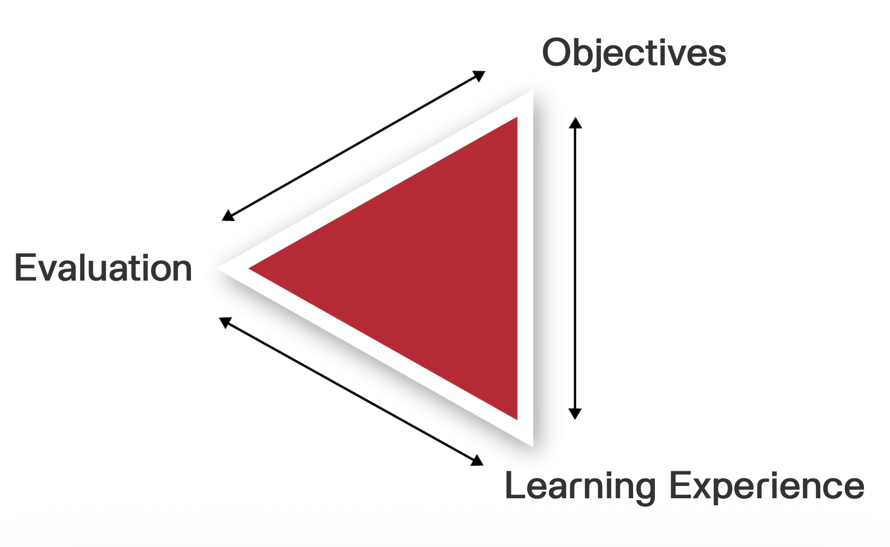

## องค์ประกอบของการจัดการเรียนรู้ {.smaller}

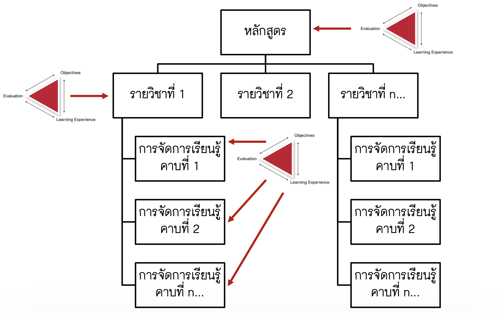

## Limitation of Conventional Teaching {.smaller}

{width="80%"}

-   ความหลากหลายของผู้เรียน/One-Size-Fits-All Approach

-   ขาดหลักฐานเชิงประจักษ์/ขาดรายละเอียดของปัญหา

-   การตัดสินใจ/ออกแบบการจัดการเรียนรู้โดยอิงการรับรู้และประสบการณ์เป็นหลัก

-   เน้นประเมินผลลัพธ์ แต่มองไม่เห็นกระบวนการเรียนรู้ของนักเรียน

-   Feedback ล่าช้าหรืออาจไม่มีเลย

-   Reactive มากกว่า Proactive


## แนวคิดการประเมินยุคใหม่ {.smaller}

> จากการ "ตัดสิน" สู่การ "เข้าใจ" เพื่อ "พัฒนา"

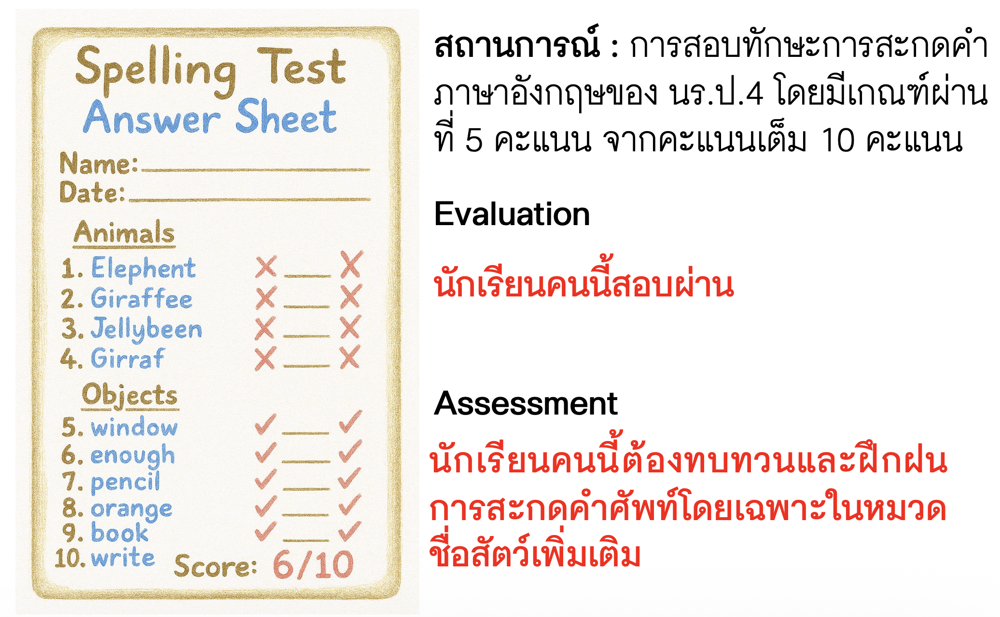

## แนวคิดการประเมินยุคใหม่ {.smaller}

> "Assessment design กำหนดคุณภาพและความลึกของข้อมูล → ส่งผลต่อ insights ที่ได้"

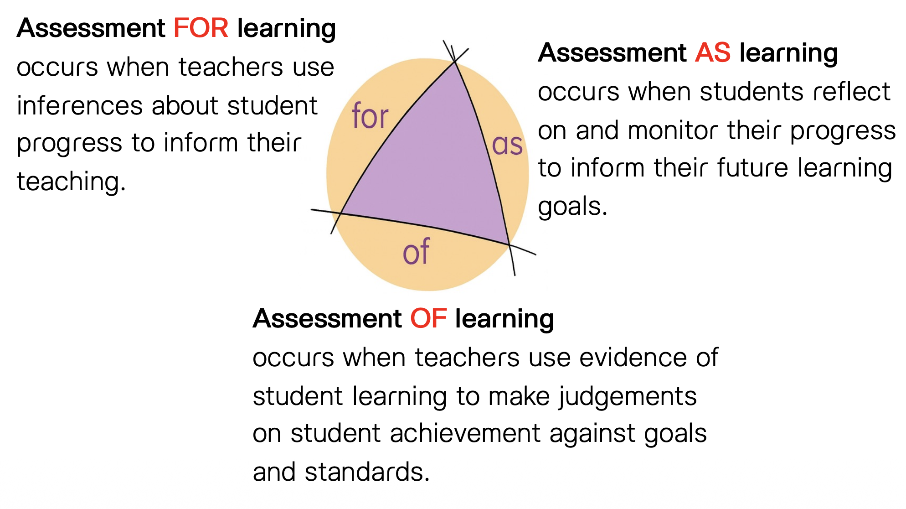


## Data-Driven Classroom {.smaller}

- ข้อมูลที่ดีเป็นสินทรัพย์เชิงกลยุทธ์ของการจัดการเรียนรู้

- ข้อมูลที่ดี ไม่เท่ากับ ความเข้าใจ (ที่ถูกต้อง)

- ความเข้าใจ ไม่เท่ากับ การลงมือทำ

- หน้าที่ของครูคือการ เปลี่ยนข้อมูลให้เป็น ความเข้าใจ และ การลงมือทำ


<center>
{width="80%"}
</center>


## Data-Driven Classroom {.smaller}

> กระบวนการ และวัฒนธรรมในการบริหารจัดการและใช้ข้อมูลผู้เรียนอย่างเป็นระบบ
> และต่อเนื่อง เพื่อประกอบการตัดสินใจในการออกแบบการจัดการเรียนรู้
> และสนับสนุน/ช่วยเหลือผู้เรียนที่ตรงจุด นำไปสู่การพัฒนาผู้เรียนได้เต็มศักยภาพและยั่งยืน

<center>
{width="80%"}
</center>


## ความสัมพันธ์ระหว่างการประเมิน การวิเคราะห์ข้อมูล และการจัดการเรียนรู้ {.smaller}


## การบูรณาการ DDE กับการจัดการเรียนรู้ {.smaller}

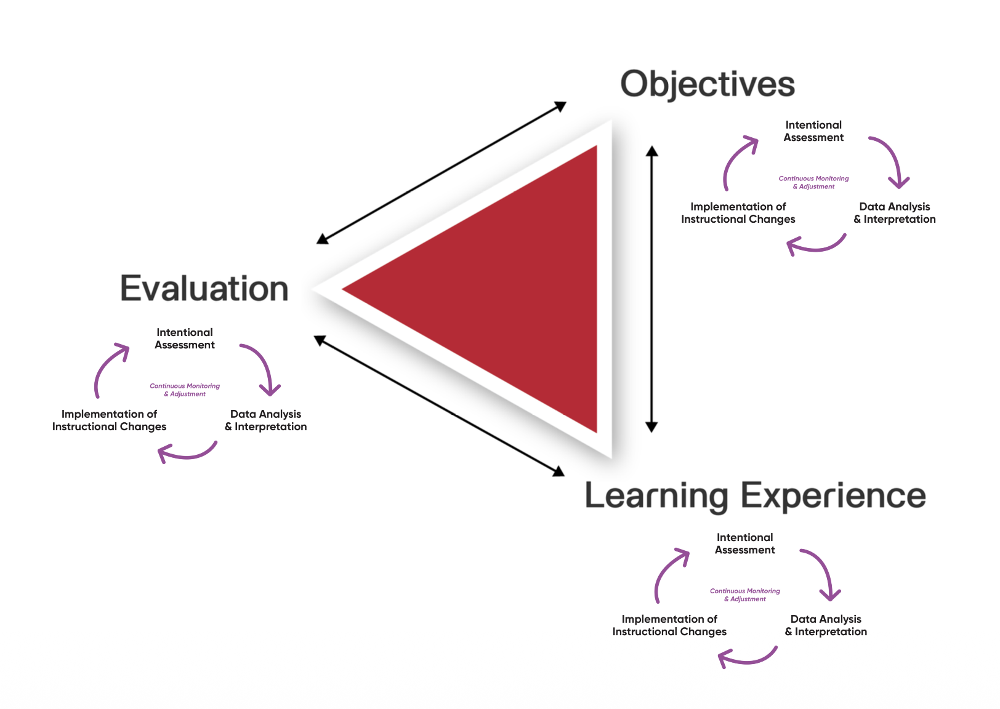


## กรอบการประเมินแบบมีเป้าหมาย 3 ระดับ {.smaller}

> การประเมินแบบมีเป้าหมาย คือ กระบวนการเก็บรวบรวมข้อมูลผู้เรียนอย่างเป็นระบบและต่อเนื่อง โดยมีการกำหนดวัตถุประสงค์ที่ชัดเจนเพื่อสร้างสารสนเทศเชิงลึก สารสนเทศดังกล่าวใช้เป็นฐานในการตัดสินใจและดำเนินการป้องกัน กำกับติดตาม พัฒนา หรือแก้ไขปัญหาการเรียนรู้ตามความต้องการที่แตกต่างกันของผู้เรียน

1. Predictive Assessment: การประเมินที่มีจุดประสงค์เพื่อระบุและคาดการณ์ผู้เรียนที่มีแนวโน้มหรือความเสี่ยงที่จะประสบปัญหาในอนาคต เพื่อให้สามารถป้องกันล่วงหน้า (prevention) ก่อนที่ปัญหาจะเกิดขึ้นจริง

2. Responsive Assessment: การประเมินที่มีจุดประสงค์เพื่อติดตามความก้าวหน้าอย่างต่อเนื่องระหว่างกระบวนการเรียนรู้ และตอบสนองทันทีเมื่อพบปัญหา เพื่อปรับการสอนหรือให้ความช่วยเหลือได้ทันท่วงที (responsive/formative)

3. Summative Assessment: การวิเคราะห์สรุปรวมข้อมูลทั้งหมดที่เก็บได้ตลอดกระบวนการเรียนรู้ เพื่อทำความเข้าใจภาพรวม ระบุ patterns/ความสัมพันธ์(ระหว่างพฤติกรรมการเรียนรู้กับผลลัพธ์การเรียนรู้ที่คาดหวัง) และนำไปใช้ปรับปรุงการออกแบบการเรียนรู้ หลักสูตร และการประเมินในครั้งต่อไป

## ภาพรวมของการจัดการเรียนรู้ที่ใช้ข้อมูลเป็นฐาน {.smaller}

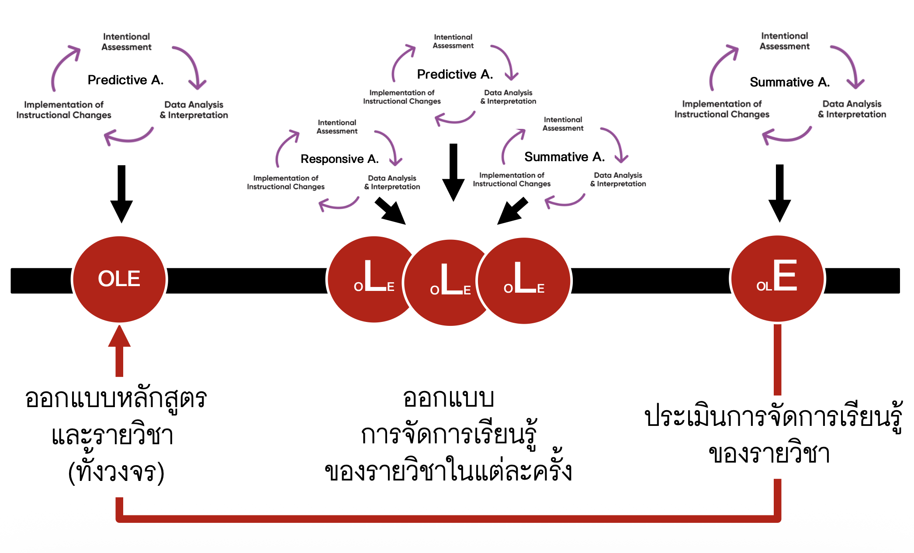


## การวิเคราะห์ข้อมูล (Data Analysis) {.smaller}

> การวิเคราะห์ข้อมูลเป็นกระบวนการที่ช่วยแปลงข้อมูลดิบจากการประเมิน ให้เป็นสารสนเทศเชิงลึก ที่ในบางกรณีไม่สามารถสังเกตได้โดยตรงจากข้อมูล

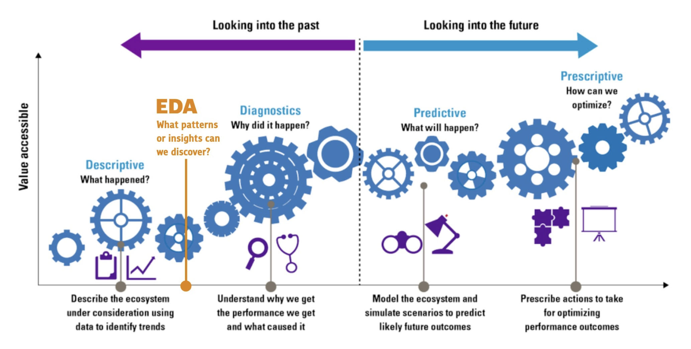

## ตัวอย่าง {.smaller}

การใช้ข้อมูลเป็นฐานเพื่อออกแบบหลักสูตร/รายวิชา


<center>

</center>

## ตัวอย่าง {.smaller}

การใช้ข้อมูลเป็นฐานเพื่อออกแบบหลักสูตร/รายวิชา


<center>
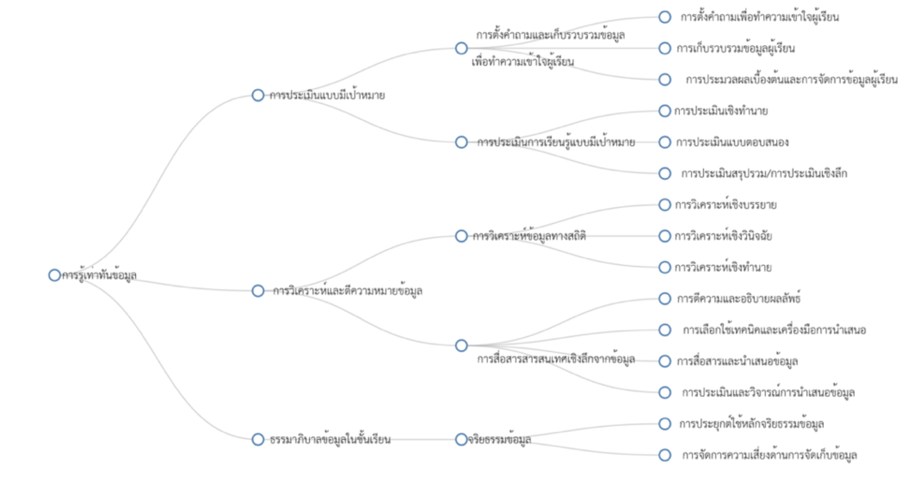{width="80%"}
</center>


## ตัวอย่าง {.smaller}

การวิเคราะห์กระบวนการให้เหตุผลทางสถิติของนักเรียน

<center>
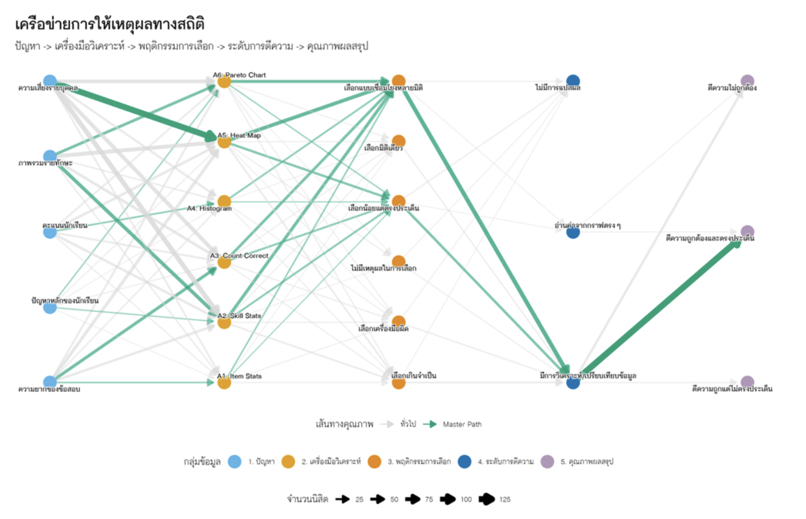{width="80%"}
</center>


## ตัวอย่าง {.smaller}

ครูกะนิดสอนวิทยาศาสตร์พื้นฐาน ม.2 ห้องหนึ่ง 30 คน ในอีก 6 สัปดาห์ข้างหน้าจะเป็นการสอบกลางภาค เนื้อหาใหม่ที่จะสอน ผู้เรียนจำเป็นต้องมีความรู้/ทักษะในการ

- อ่านข้อเท็จจริงจากข้อมูลที่อยู่ในรูปแบบกราฟ

- สรุปและให้เหตุผลเชิงวิทยาศาสตร์

> ครูกะนิดกำลังตัดสินใจว่า จะดำเนินการจัดการเรียนรู้อย่างไรในช่วงเวลาที่เหลือ เพื่อให้นักเรียนสามารถบรรลุวัตถุประสงค์การเรียนรู้ที่คาดหวัง


## ตัวอย่าง {.smaller}

ครูกะนิดสอนวิทยาศาสตร์พื้นฐาน ม.2 ห้องหนึ่ง 30 คน ในอีก 6 สัปดาห์ข้างหน้าจะเป็นการสอบกลางภาค เนื้อหาใหม่ที่จะสอน ผู้เรียนจำเป็นต้องมีความรู้/ทักษะในการ

- อ่านข้อเท็จจริงจากข้อมูลที่อยู่ในรูปแบบกราฟ

- สรุปและให้เหตุผลเชิงวิทยาศาสตร์

> ครูกะนิดกำลังตัดสินใจว่า จะดำเนินการจัดการเรียนรู้อย่างไรในช่วงเวลาที่เหลือ เพื่อให้นักเรียนสามารถบรรลุวัตถุประสงค์การเรียนรู้ที่คาดหวัง


## ตัวอย่าง {.smaller}


|**Question**|**Answer**|
|---|----|
|Audient|ครูกะนิด|
|Action| ออกแบบ intervention ที่เหมาะสมในช่วง 2 สัปดาห์ต่อจากนี้|


## ตัวอย่าง: Big Idea {.smaller}


Big Idea คือสาระสำคัญที่ครูต้องการสื่อสารผ่านข้อมูล เพื่อให้ผู้รับสารเข้าใจ และสามารถนำไปใช้ประโยชน์ได้

> Big Idea = Insight + Context + Professional Judgment


:::: {.columns}

::: {.column width="48%"}

```{r}
library(tidyverse)
library(kableExtra)
result <- tribble(
    ~ item, ~M, ~SD,
    "Q1", 0.80, 0.40,
    "Q2", 0.87, 0.35,
    "Q3", 0.47, 0.51,
    "Q4", 0.13, 0.35,
    "Q5", 0.07, 0.25
)

result |> 
  ggplot(aes(x = item, y = M)) +
  geom_col(fill = "skyblue", col = "black", width = 0.7) +
  ylim(0,1) +
  theme_light(base_size = 28) +
  theme(text = element_text(family = "ChulaCharasNew")) +
  labs(
    title = "Mean Score of Pretest by Item",
    x = "Item",
    y = "Mean Score"
  ) 
```

:::

::: {.column width="2%"}

:::

::: {.column width="48%"}

> Big Idea ที่ขาดบริบทและการตัดสินใจเชิงวิชาชีพ ไม่สามารถนำไปสู่ Action ที่เหมาะสม

- คะแนน Q1-Q2 มีค่าเฉลี่ยสูงมาก ส่วน Q3 มีค่าเฉลี่ยปานกลาง

- คะแนน Q4-Q5 มีค่าเฉลี่ยต่ำมาก


:::

::::

## ตัวอย่าง: Big Idea {.smaller}


Big Idea คือสาระสำคัญที่ครูต้องการสื่อสารผ่านข้อมูล เพื่อให้ผู้รับสารเข้าใจ และสามารถนำไปใช้ประโยชน์ได้

> Big Idea = Insight + Context + Professional Judgment

:::: {.columns}

::: {.column width="48%"}

```{r}
result |> 
  ggplot(aes(x = item, y = M)) +
  geom_col(fill = "skyblue", col = "black", width = 0.7) +
  ylim(0,1) +
  theme_light(base_size = 28) +
  theme(text = element_text(family = "ChulaCharasNew")) +
  labs(
    title = "Mean Score of Pretest by Item",
    x = "Item",
    y = "Mean Score"
  ) 
```

<div style="font-size: 0.8em;">

```{r skill_table}

# 1) ตารางความรู้พื้นฐาน (3 ด้าน)
basic_skill <- tribble(
  ~domain, ~M, ~SD,
  "ความเข้าใจคำศัพท์วิทยาศาสตร์",        1.67, 0.55,
  "ทักษะการอ่านกราฟ",           0.47, 0.51,
  "การให้เหตุผลเชิงวิทยาศาสตร์", 0.20, 0.41
)

basic_skill |>
  kable(
    col.names = c("ทักษะพื้นฐาน", "M", "SD"),
    digits = 2,
    align = c("l","c","c"),
    caption = "สถิติบรรยายจำแนกตามทักษะ"
  )
```

</div>

:::

::: {.column width="2%"}

:::

::: {.column width="48%"}

<div style="font-size: 0.8em;">

Big Idea ที่มี Insight + Context + Professional Judgement

- โดยเฉลี่ย Q1, Q2 มีคะแนนสูง แสดงว่านักเรียนส่วนใหญ่จดจำคำศัพท์ได้

- Q3 มีค่าเฉลี่ยใกล้ 0.5 สะท้อนว่าทักษะการอ่านกราฟในชั้นเรียนยังทำได้ไม่สม่ำเสมอ

- Q4, Q5 มีค่าเฉลี่ยต่ำมาก แสดงว่าการให้เหตุผลเชิงวิทยาศาสตร์เป็นจุดอ่อนหลักของชั้นเรียน

Intervention ที่เหมาะคือ ...


</div>

:::

::::


## ตัวอย่าง : Big Idea {.smaller}


Big Idea คือสาระสำคัญที่ครูต้องการสื่อสารผ่านข้อมูล เพื่อให้ผู้รับสารเข้าใจ และสามารถนำไปใช้ประโยชน์ได้

> วิธีการวิเคราะห์ส่งผลโดยตรงต่อ Insight ที่ได้ และ Insight ส่งผลโดยตรงต่อคุณภาพของ Big Idea

:::: {.columns}

::: {.column width="48%"}


```{r pareto_profile}
resp <- tribble(
  ~student, ~Q1, ~Q2, ~Q3, ~Q4, ~Q5,
  "S01", 1,1,1,0,0,
  "S02", 1,1,1,0,0,
  "S03", 1,0,1,0,0,
  "S04", 1,1,1,1,0,
  "S05", 1,1,0,0,0,
  "S06", 0,1,1,0,0,
  "S07", 1,1,1,0,0,
  "S08", 1,1,0,0,0,
  "S09", 0,1,0,0,0,
  "S10",1,1,0,1,0,
  "S11",1,1,1,0,0,
  "S12",1,0,1,0,0,
  "S13",1,1,1,0,0,
  "S14",1,1,0,0,1,
  "S15",0,1,1,0,0,
  "S16",1,1,0,0,0,
  "S17",1,1,1,0,0,
  "S18",0,1,1,0,0,
  "S19",1,1,0,0,0,
  "S20",1,1,1,0,1,
  "S21",1,0,0,0,0,
  "S22",0,1,0,0,0,
  "S23",1,1,1,0,0,
  "S24",1,1,1,0,0,
  "S25",1,1,0,0,0,
  "S26",0,0,0,0,0,
  "S27",1,1,1,0,0,
  "S28",1,1,1,1,0,
  "S29",1,1,0,1,0,
  "S30",1,1,0,0,0
)

profile <- resp %>%
  mutate(
    keyword_prop = (Q1 == 0 & Q2 == 0),
    graph_prob = Q3 == 0,
    sci_prob   = (Q4 == 0 & Q5 == 0),
    profile = case_when(
      !keyword_prop & !graph_prob & !sci_prob ~ "No_problem",
      keyword_prop & !graph_prob & !sci_prob ~ "Keyword_problem",
      graph_prob & sci_prob ~ "Graph + Sci",
      !keyword_prop & !graph_prob & sci_prob ~ "Sci_only",
      graph_prob & !sci_prob & !keyword_prop ~ "Graph_only",
      TRUE ~ "ALL_three"
    )
  )

pareto <- profile %>% 
  count(profile, sort = TRUE) %>%
  mutate(cum_pct = cumsum(n) / sum(n)) |> 
  ggplot(aes(x = reorder(profile, -n), y = n)) +
  geom_col(fill = "orange", col = "black", width = 0.7) +
  geom_line(aes(y = cum_pct * max(n)), group = 1, color = "black", linewidth = 1) +
  geom_point(aes(y = cum_pct * max(n)), color = "black", size
 = 2) +
  scale_y_continuous(

    name = "จำนวนนักเรียน",
    sec.axis = sec_axis(~ . / max(.) , name = "ร้อยละสะสม", labels = scales::percent)
  ) +
  theme_light(base_size = 22) +
  theme(text = element_text(family = "ChulaCharasNew"),
  panel.grid.minor = element_blank()) +
  labs(
    title = "Profile ปัญหาของนักเรียนจากผล Pretest",
    x = "\n Profile ของปัญหา"
  )

pareto
```

- ปัญหาหลักของห้องคือการให้เหตุผลเชิงวิทยาศาสตร์

- การอ่านกราฟเป็นปัญหาร่วมที่สำคัญ

- Intervention ที่เหมาะคือ ...

:::

::: {.column width="2%"}

:::

::: {.column width="48%"}


:::

::::

## การสื่อสารข้อมูลอย่างมีประสิทธิภาพ {.smaller}

> การสื่อสารข้อมูล ไม่ใช่การสร้างกราฟได้ ไม่ใช้การสร้างกราฟสวยงาม แต่เป็นการสร้างสื่อที่ช่วยให้ผู้รับสาร เข้าใจข้อมูล และสามารถใช้ความเข้าใจดังกล่าวไปสู่การสร้างประโยชน์ได้


<center>
{width="55%"}
</center>

<div style="font-size: 0.8em;">

- Driven Action -- เปลี่ยนข้อมูลให้เป็นการกระทำ

- Reducing Cognitive Load -- ลดภาระทางปัญญา

- Memorability & Engagement -- สร้างความจดจำและมีส่วนร่วม

- Professional & Organization Success -- สร้างความสำเร็จทางวิชาชีพและองค์กร

- Accessibility -- สร้างการเข้าถึงข้อมูล

</div>


## Data Literacy {.smaller}

> Do you speak Data?

:::: {.columns}

::: {.column width="60%"}

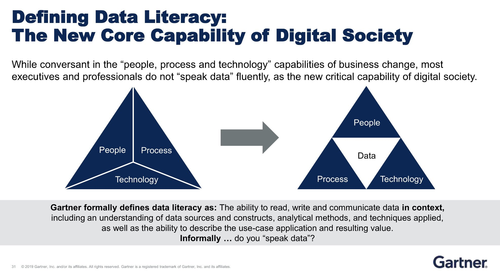

:::

::: {.column width="40%"}

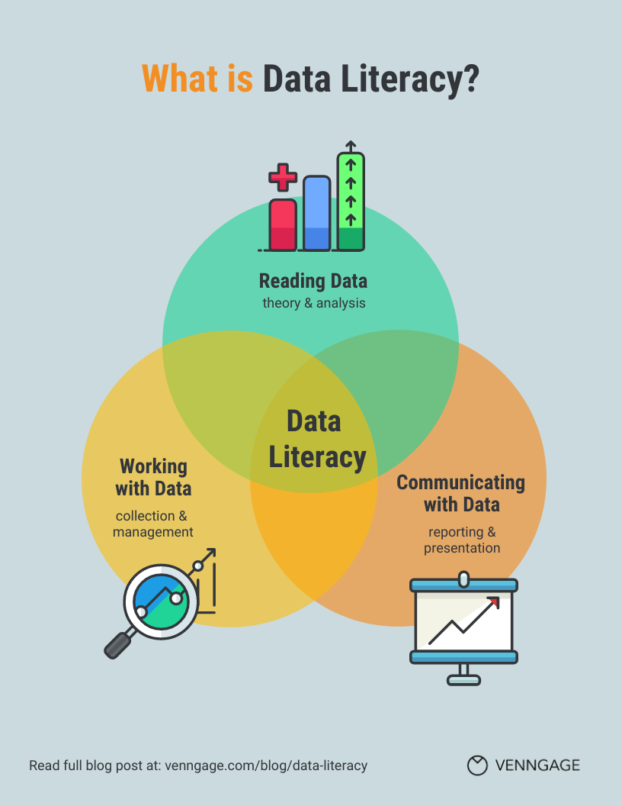{width="80%"}

:::

::::


## Data Literacy & AI Competency {.smaller}

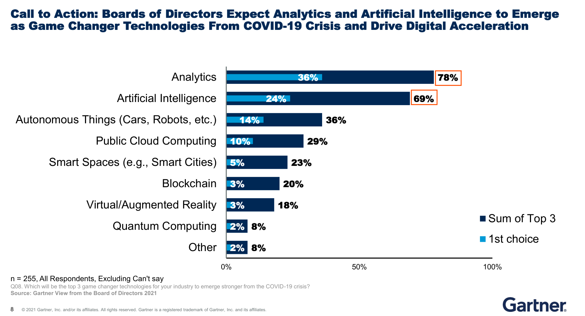

##

