## Data-Driven Classroom {.smaller}

> หัวใจสำคัญของการขับเคลื่อนการเรียนรู้ด้วยข้อมูล คือกระบวนการบริหารจัดการข้อมูลที่มีคุณภาพ

:::: {.columns}

::: {.column width="50%"}

<center>
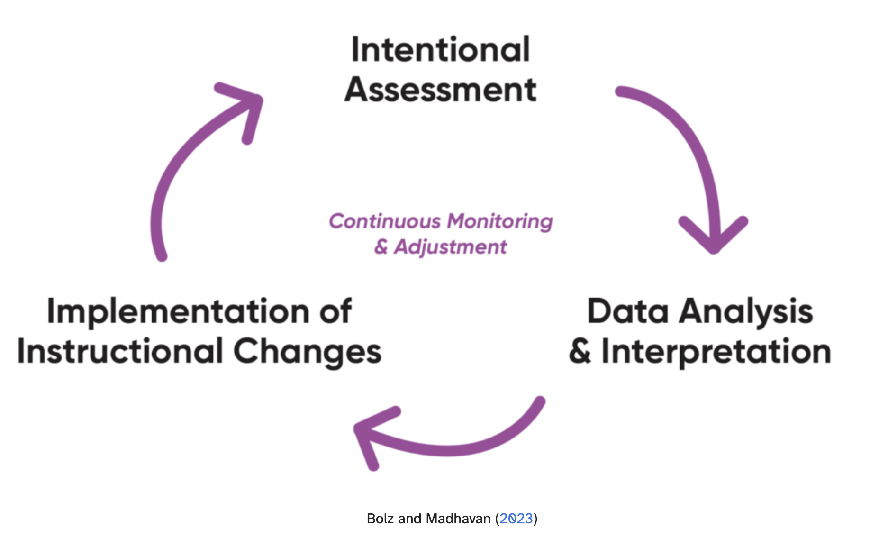{width="100%"}
</center>

:::

::: {.column width="50%"}

{width="75%"}


:::

::::


# การบริหารจัดการข้อมูลในชั้นเรียนอย่างเป็นระบบ {.smaller}

<center>

{width="50%"}

</center>

## วงจรข้อมูลในชั้นเรียน (classroom data cycle) {.smaller}

> หัวใจสำคัญของการขับเคลื่อนการเรียนรู้ด้วยข้อมูล คือกระบวนการบริหารจัดการข้อมูลที่มีคุณภาพ

-   **การกำหนดคำถาม/เป้าหมาย**

-   **การเก็บรวบรวมข้อมูล (Data Collection)**

-   **การพักและจัดเก็บข้อมูลอย่างเป็นระบบ (Data Staging & Storage)**

-   **การเตรียมและจัดรูปแบบข้อมูลให้พร้อมสำหรับการวิเคราะห์ (Data Preparation)**

-   การวิเคราะห์ข้อมูล (Data Analysis)

-   การสื่อสารผลลัพธ์ (Communicating Insights)

-   การตัดสินใจ (Data-Driven Action & Decision Making)


## ข้อมูลในชั้นเรียน {.smaller}

เราอาจจำแนกประเภทข้อมูลในชั้นเรียนตามรูปแบบการจัดเก็บ และลักษณะข้อมูล ดังนี้

1.  ข้อมูลที่อยู่ในรูปแบบ Digital Data

    -   ข้อมูลที่มีโครงสร้าง (Structured Data) ที่อยู่ในรูปแบบ ตาราง/ตัวเลข เช่น
        คำตอบของนักเรียนจากแบบทดสอบออนไลน์ ข้อมูลผลการเรียน
        หรือระเบียนประวัตินักเรียน ข้อมูลลักษณะนี้มักอยู่ในรูปแบบ spreadsheet
        หรือฐานข้อมูล (database)

    -   ข้อมูลดิจิทัลที่ไม่มีโครงสร้าง (Unstructured Data) เช่น รูปถ่ายผลงานนักเรียน
        ไฟล์สแกนกระดาษคำตอบที่เขียนด้วยลายมือของนักเรียน ไฟล์รายงาน ไฟล์บันทึกเสียง
        วิดีโอ เป็นต้น

2.  ข้อมูลที่ยังไม่ได้อยู่ในรูปแบบ Digital Data (Non-Digital Data)

    -   กระดาษคำตอบ ใบงาน สมุดการบ้าน

    -   แบบสังเกต/แบบประเมินกระดาษ

    -   ร่องรอยการทำกิจกรรม เช่น poster งานศิลปะ งานประดิษฐ์ หรือ post-it note
        ที่ติดบนผนังห้องเรียน เป็นต้น

## โครงสร้างพื้นที่จัดเก็บข้อมูลในชั้นเรียน {.smaller}

> เป้าหมาย : สร้างบ้านที่สะอาด เป็นระเบียบ ให้ข้อมูล

แบ่งตาม: ปีการศึกษา → วิชา → ห้อง → สถานะข้อมูล (raw / clean / output)

```{r eval = F, echo = T}
MyClassroom_Data/              # โฟลเดอร์หลักของครูคนนี้
  2023/
  2024/
  2025/                        # ปีการศึกษา
    Math_M2/                   # วิชาคณิต ม.2
      Class_M2_1/              # ห้อง ม.2/1
        01_raw_data/           # ข้อมูลดิบ
        02_clean_data/         # ข้อมูลเตรียมพร้อมวิเคราะห์
            routine_data      # ชุดข้อมูลที่ใช้ในงานประจำของตรู
            extra_data        # ชุดข้อมูลที่เตรียมสำหรับงานเฉพาะวัตถุประสงค์
        03_outputs/            # รายงาน/กราฟ/รายชื่อเด็กกลุ่มเสี่ยง
      Class_M2_2/              # ห้อง ม.2/2
        01_raw_data/
        02_clean_data/
        03_outputs/
    Homeroom_M2/               # ข้อมูลบทบาทครูประจำชั้น
      01_raw_data/
      02_clean_data/
      03_outputs/
```

## `01_raw_data/` เก็บต้นฉบับข้อมูลทั้งหมด {.smaller}

> ข้อมูลทุกอย่างในชั้นเรียนต้องถูกเก็บในโฟลเดอร์นี้ก่อนเสมอ ถือเป็นต้นฉบับข้อมูล
> ห้ามแก้ไขข้อมูลในโฟลเดอร์นี้โดยตรง

-   ข้อมูลแบบดิจัทัล (Digital Data) ที่ได้รับจากแหล่งต่าง ๆ

    -   คำตอบจาก Google Forms/ Quiz จาก platform ต่าง ๆ (`.csv`, `.xlsx`)

    -   ข้อมูลจากระบบโรงเรียน/ระบบลงทะเบียนนักเรียน (`.csv`, `.xlsx`)

    -   ไฟล์รายงาน/ชิ้นงานของนักเรียน (`.pdf`, `.docx`, `.jpg`, `.png`,
        \`pptx)

    -   ไฟล์เสียง/วิดีโอ (`.m4a`, `.mp4`)

-   ข้อมูลที่ไม่ใช่ดิจิทัล จำเป็นต้องถูกแปลงเป็นดิจิทัลก่อนเก็บ (digitalized)

    -   ไฟล์สแกน/รูปถ่ายกระดาษคำตอบ (`.pdf`, `.jpg`, `.png`)

    -   รูปถ่ายชิ้นงาน/ผลงานของนักเรียน (`.jpg`, `.png`)

## `01_raw_data/` การจัดการ folder และตั้งชื่อไฟล์ {.smaller}

> ชื่อไฟล์ควรสามารถสื่อสารได้ว่า ข้อมูลนั้นคืออะไร มาจากไหน และเมื่อไหร่

กำหนดหลักการตั้งชื่อไฟล์ เช่น `วันที่_วิชา_ห้อง_กิจกรรม_raw_แหล่งที่มา.นามสกุล`

```{r eval = F, echo = T}
01_raw_data/
  2025_08_04_Stat_M2_1_ExitTicket_wk1_DDC_raw_ggsheet
  2025_09_01_Stat_M2_1_Pretest_wk2_Intentional_Assessment_ggsheet  
  2025_09_01_Stat_M2_1_Quiz_wk2_Intentional_Assessment_ggsheet
  2025_10_10_Stat_M2_1_MidtermExam_Stat_HandWriting.pdf
```

## `02_clean_data/` การจัดระเบียบและทำความสะอาด {.smaller}

> เราไม่ได้เก็บข้อมูลเพื่อสะสมหรือไว้อ้างอิงเท่านั้น
> แต่ต้องการใช้ประโยชน์จากข้อมูลเพื่อการวิเคราะห์และตัดสินใจ

จาก `01_raw_data/` ...

1.  คัดลอกหรือดึงข้อมูลไปยัง `02_clean_data/` (ห้ามแก้ไขบนต้นฉบับ)

2.  จัดระเบียบ และจัดกระทำข้อมูลให้อยู่ในรูปแบบที่พร้อมสำหรับการนำไปวิเคราะห์

    -   กำหนดวัตถุประสงค์ของการวิเคราะห์

    -   ระบุหน่วยข้อมูล และตัวแปรที่เกี่ยวข้อง

    -   เลือกข้อมูลดิบ/แหล่งข้อมูลที่เกี่ยวข้อง

    -   จัดระเบียบตารางข้อมูลให้อยู่ในรูปแบบ tidy data + ปรับชื่อตัวแปร

    -   วิเคราะห์คำตอบของนักเรียนเพื่อให้คะแนนหรือสร้างป้ายกำกับคำตอบ

3.  บันทึกไฟล์ใหม่ใน `02_clean_data/`

## `02_clean_data/` การจัดระเบียบและทำความสะอาด {.smaller}

> “Tidy datasets are all alike, but every messy dataset is messy in its
> own way.” <br> — Hadley Wickham

-   แต่ละคอลัมน์ (column) ของตาราง ใช้แทนตัวแปร (variable) ซึ่งเป็นไปได้ทั้ง
    ผลการตอบสนองข้อสอบหรือแบบฝึกหัดรายข้อ คะแนนสอบ ความคิดเห็นในประเด็นที่กำหนด
    หรือข้อมูลภูมิหลัง

-   แต่ละแถว (row) ของตาราง ใช้แทนค่าสังเกต (observation) หรือ หน่วยวัด (unit
    of observation) เช่น นักเรียนแต่ละคน แต่ละกิจกรรม หรือแต่ละช่วงเวลา

-   แต่ละช่อง (cell) ของตาราง เก็บค่าข้อมูล (value)
    ที่สัมพันธ์กันระหว่างตัวแปรและค่าสังเกต โดยแต่ละช่องจะมีค่าข้อมูลได้เพียงค่าเดียวเท่านั้น

## `02_clean_data/` การจัดระเบียบและทำความสะอาด {.smaller}

<br>
<br>


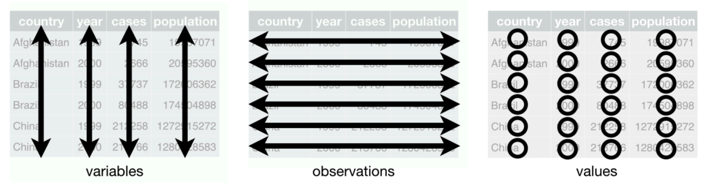{width="10%"}


## `02_clean_data/` การจัดระเบียบและทำความสะอาด {.smaller}

ไฟล์ที่อยู่ใน `02_clean_data/` อาจจำแนกเป็นสองกลุ่มใหญ่ได้แก่

-   routine_data : ข้อมูลที่ใช้ในงานประจำของครู

    -   assessment_task_level : ข้อมูลการประเมินผลการเรียนรู้ในระดับงาน/กิจกรรม

    -   assessment_item_level : ข้อมูลการประเมินผลการเรียนรู้ในระดับข้อรายการ
        (ใช้เมื่อต้องการวิเคราะห์เชิงลึก)

    -   attendance : ข้อมูลการเข้าเรียนของนักเรียน

    -   behavior : ข้อมูลพฤติกรรมการมีส่วนร่วมในชั้นเรียน

    -   student_info : ข้อมูลประวัตินักเรียน

-   extra_data : ข้อมูลที่เตรียมสำหรับงานเฉพาะวัตถุประสงค์

## ตัวอย่างการจัดการข้อมูล Exit Ticket {.smaller}

สมมุติว่าผู้สอนต้องการเตรียมข้อมูล exit ticket ในสัปดาห์ที่ 1 ของนักเรียนเพื่อ

-   นำไปวิเคราะห์เพื่อใช้ประกอบการเตรียมสอนในสัปดาห์ถัดไป

-   เก็บไว้เป็นฐานข้อมูลสำหรับการประเมินการเรียนรู้ของนักเรียน

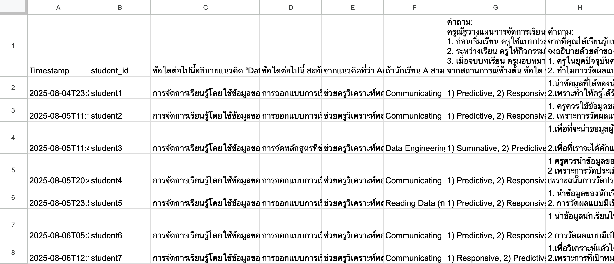

## ตัวอย่างการจัดการข้อมูล Exit Ticket {.smaller}

<br>

:::::::: columns
::: {.column width="30%"}
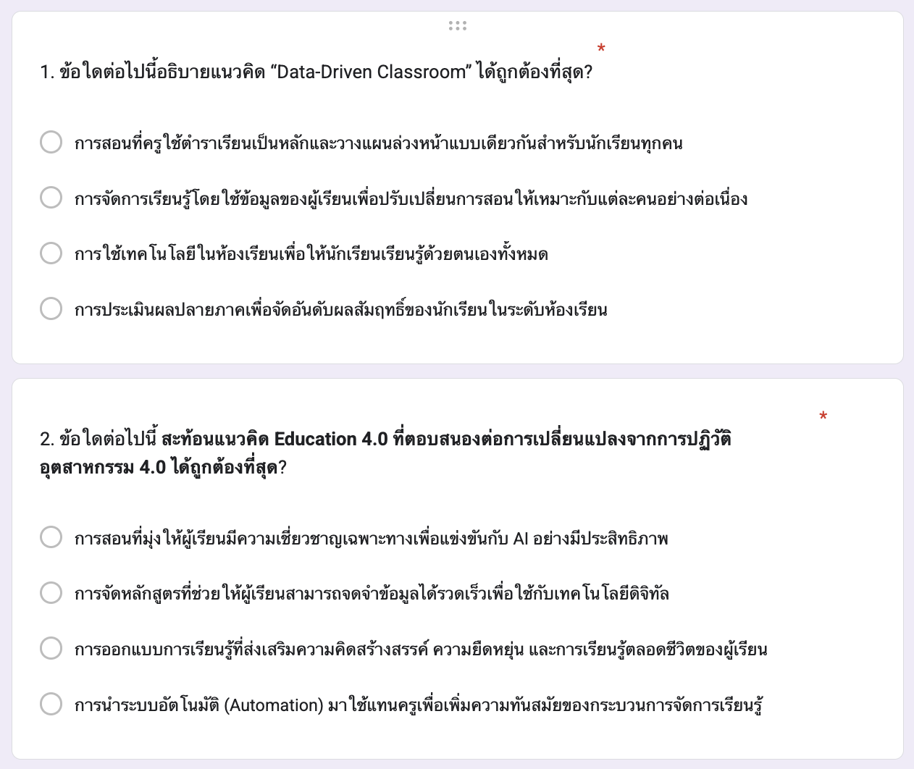
:::

::: {.column width="5%"}
:::

::: {.column width="30%"}
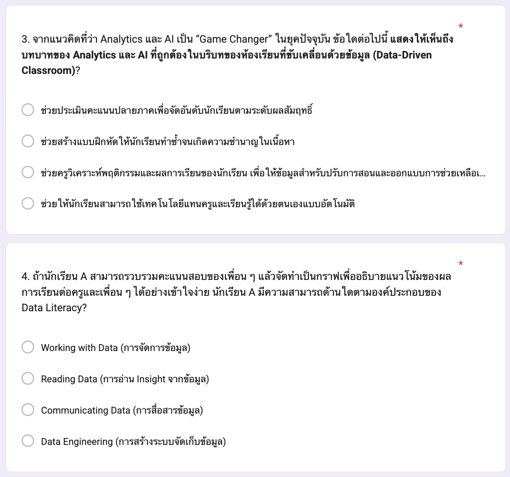
:::

::: {.column width="5%"}
:::

::: {.column width="30%"}
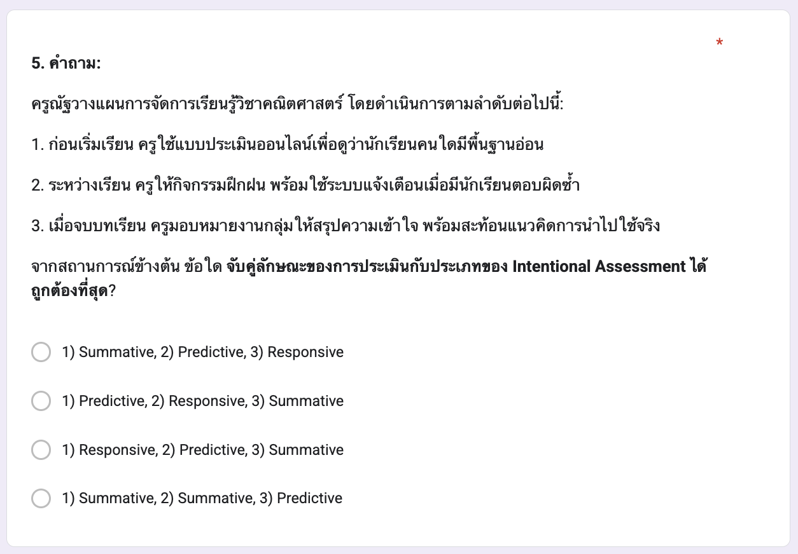

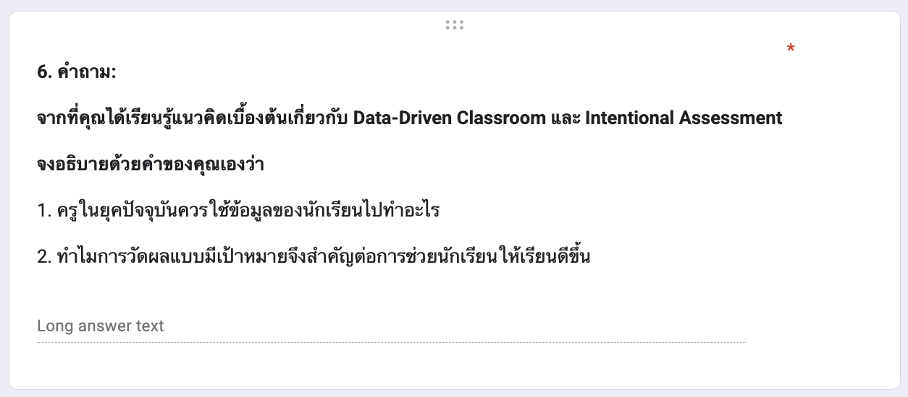
:::
::::::::

## ตัวอย่างการจัดการข้อมูล Exit Ticket {.smaller}

แนวเฉลย exit ticket ข้ออัตนัย

1.  ครูในยุคปัจจุบันควรใช้ข้อมูลของนักเรียนไปทำอะไร?

> ครูควรใช้ข้อมูลของนักเรียนเพื่อทำความเข้าใจจุดแข็งและจุดที่ต้องพัฒนา
> จากนั้นปรับการสอนและออกแบบกิจกรรมการเรียนรู้ให้เหมาะสมกับความแตกต่างของผู้เรียน
> รวมถึงใช้ข้อมูลเพื่อติดตามความก้าวหน้า ให้คำแนะนำรายบุคคล
> และช่วยให้นักเรียนสามารถเรียนรู้ได้อย่างมีประสิทธิภาพมากขึ้น

2.  ทำไมการวัดผลแบบมีเป้าหมายจึงสำคัญต่อการช่วยนักเรียนให้เรียนดีขึ้น?

> เพราะการวัดผลแบบมีเป้าหมาย (Intentional Assessment)
> ช่วยให้ครูเก็บข้อมูลที่ตรงกับวัตถุประสงค์การเรียนรู้
> ทำให้เข้าใจได้ว่านักเรียนบรรลุผลลัพธ์ที่ต้องการหรือยัง และสาเหตุของปัญหาอยู่ตรงไหน
> ผลการวัดที่ชัดเจนและมีเป้าหมายจึงนำไปสู่การให้ Feedback ที่ตรงจุด
> การปรับการสอนที่เหมาะสม และการช่วยเหลือนักเรียนได้อย่างมีประสิทธิภาพ

## ตัวอย่างการจัดการข้อมูล {.smaller}

:::::: {.columns}
::: {.column width="30%"}

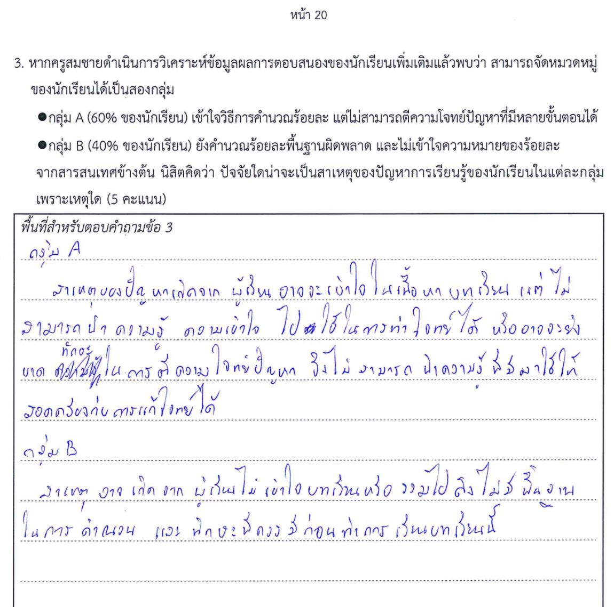{width="100%"}
:::

::: {.column width="5%"}
:::

::: {.column width="30%"}

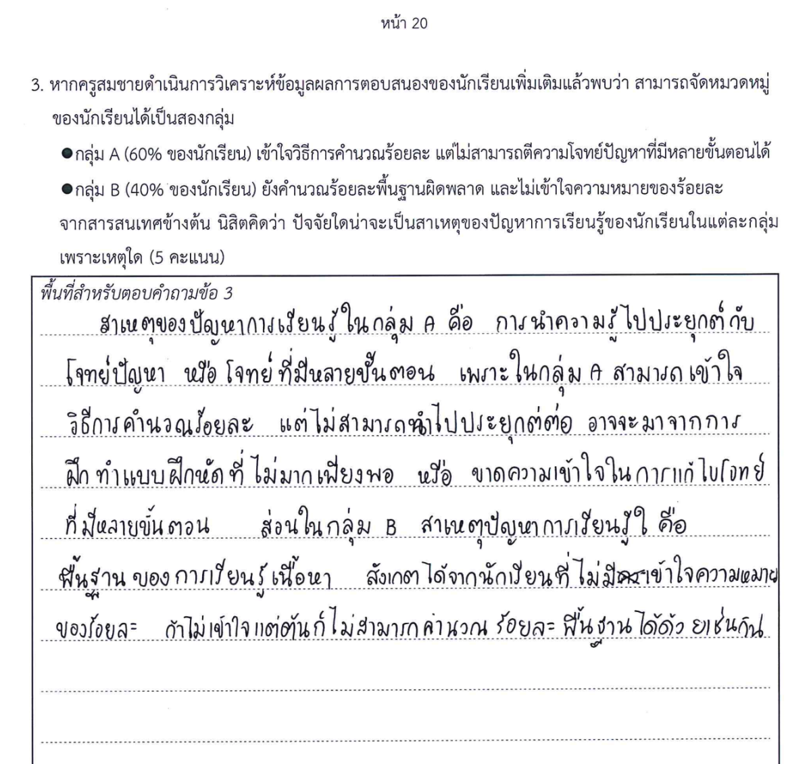{width="100%"}
:::
::::::


ข้อมูลการตอบสนองของนักเรียนที่ได้จากผลการสอบแบบกระดาษ สามารถทำให้เป็น digital data ได้โดยการใช้เทคโนโลยี OCR (Optical Character Recognition)

- [NotebookLM](https://notebooklm.google.com/)

- [TyphoonOCR](https://opentyphoon.ai/model/typhoon-ocr)

- [llamaindexOCR](https://www.llamaindex.ai/)


## ตัวอย่างการจัดการข้อมูล {.smaller}

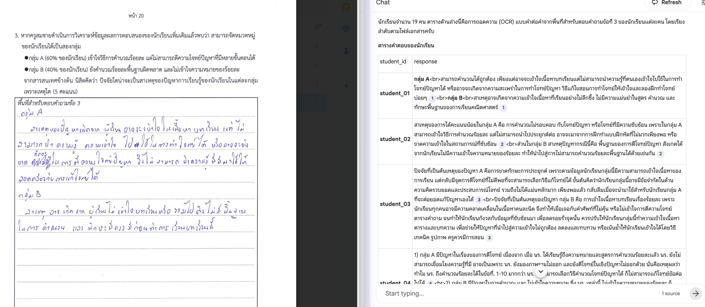


## ตัวอย่างการจัดการข้อมูล {.smaller}

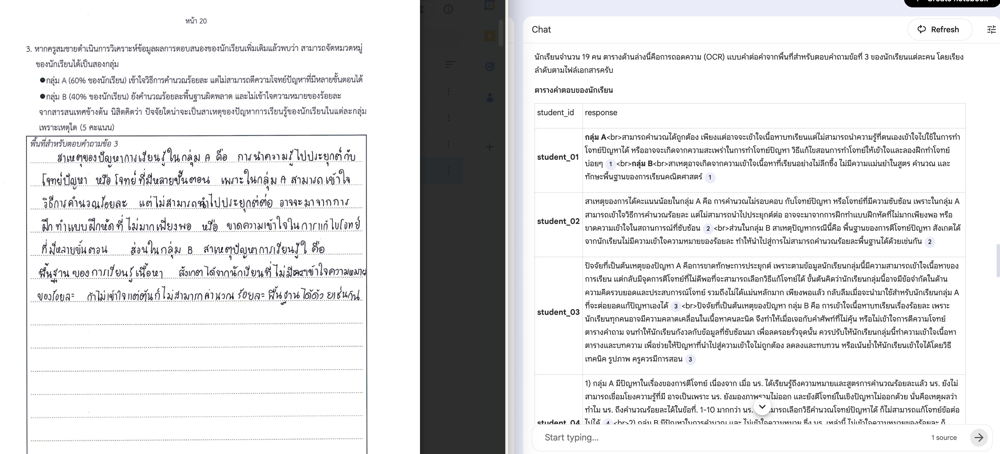


## ตัวอย่างการจัดการข้อมูล {.smaller}

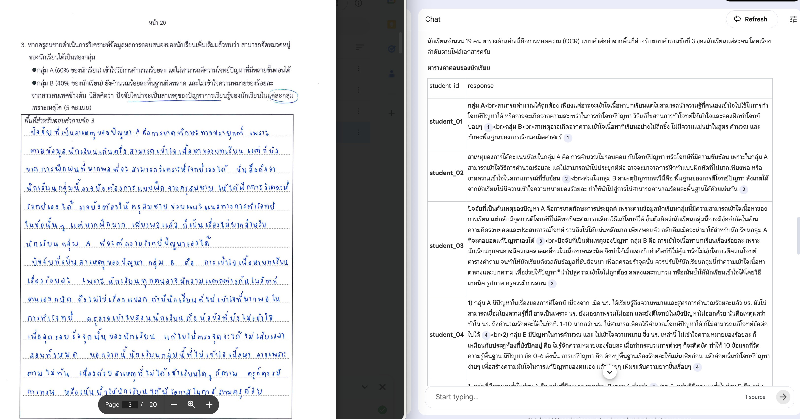

## 

