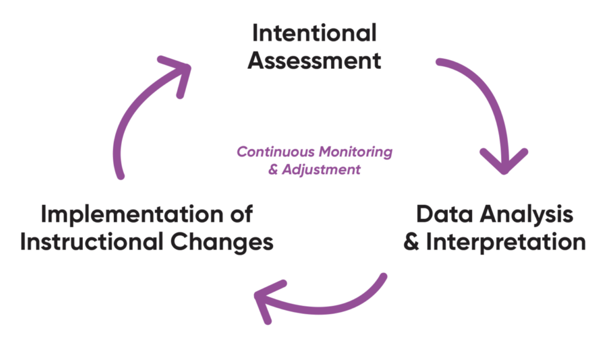
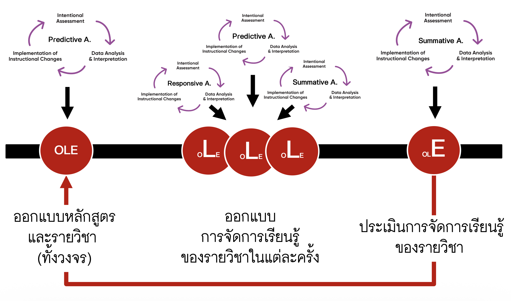
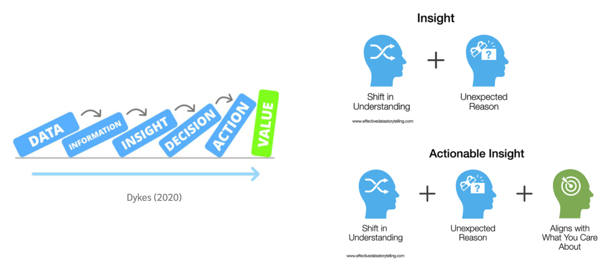
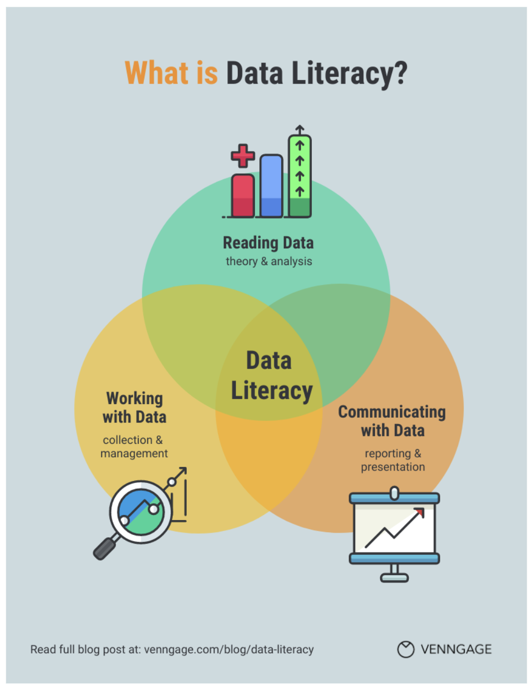
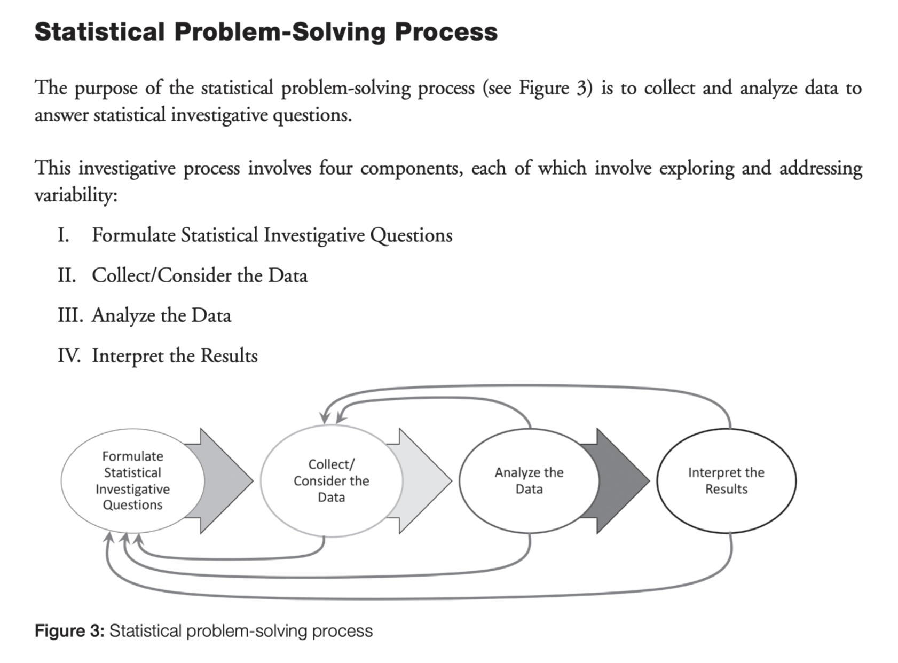
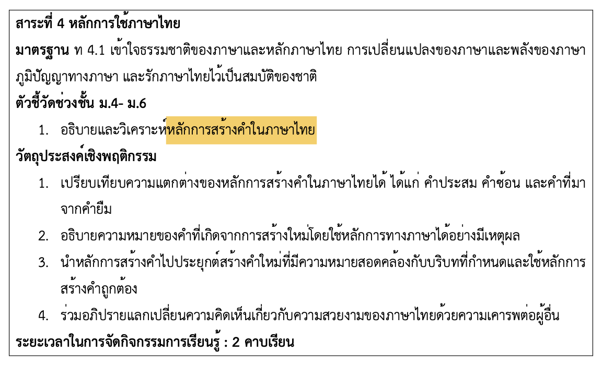
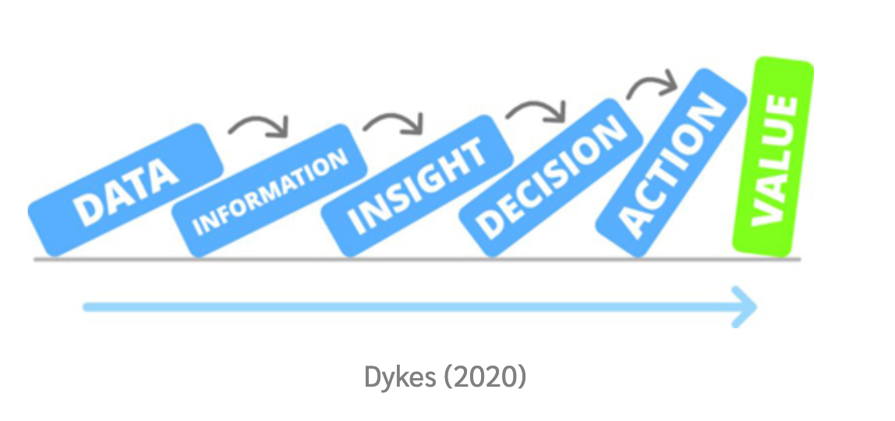
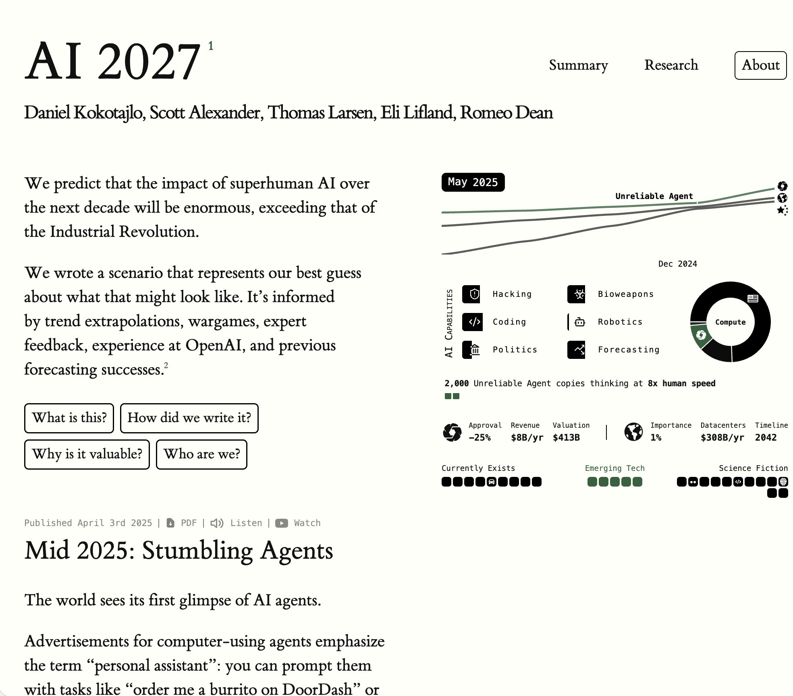

# 1. Introduction

## ภาพใหม่ของการประเมินการเรียนรู้ {.smaller}

> *ครู "**ผู้ใช้ข้อมูลเพื่อขับเคลื่อนการสอน (instructional decision-maker)"***

 

:::::: columns
::: {.column width="48%"}

:::

::: {.column width="4%"}
:::

::: {.column width="48%"}

:::
::::::

## ภาพใหม่ของการประเมินการเรียนรู้ {.smaller}

> *ครู "**ผู้ใช้ข้อมูลเพื่อขับเคลื่อนการสอน (instructional decision-maker)"***

 

:::::: columns
::: {.column width="48%"}

:::

::: {.column width="4%"}
:::

::: {.column width="48%"}

:::
::::::

## Data Literacy {.smaller}

> *Assessment tells us what evidence exists; Data Literacy tells us what
> that evidence means.*

::::::: columns
:::: {.column width="55%"}
::: {style="font-size: 0.8em;"}
-   นักเรียนพร้อมแค่ไหน? จุดเสี่ยงอยู่ตรงไหน? กลุ่มไหนควรได้รับการช่วยเหลือก่อน?

-   นักเรียนกำลังเข้าใจผิดตรงไหน? สัญญาณเตือนปรากฏตรงไหน?
    ควรปรับเปลี่ยนวิธีการสอนอย่างไร?

-   ผลที่เกิดขึ้นสะท้อนอะไรเกี่ยวกับการสอน? อะไรควรแก้ไขในรอบถัดไป?
:::

::::

::: {.column width="4%"}
:::

::: {.column width="40%"}
{width="80%"}
:::
:::::::

## Statistical Problem-Solving Process

{width="511"}

## AI กับบทบาทใหม่ของครูในการประเมิน {.smaller}

> *Intentional assessment needs timely insight.*   Data Literacy
> makes insight possible.   AI expands the capacity to produce those
> insights at scale.

::: {style="font-size: 0.8em;"}
-   ช่วยสร้าง pre-test / diagnostic test ที่สอดคล้องกับวัตถุประสงค์ได้อย่างรวดเร็ว

-   วิเคราะห์ผล pre-test หาจุดเสี่ยง / จุดอ่อน

-   คัดกรองกลุ่มที่ควรได้รับการช่วยเหลือเชิงรุก

-   วิเคราะห์งานนักเรียนโดยเฉพาะงานเขียนแบบอัตนัยอย่างรวดเร็ว ครอบคลุม และยุติธรรม

-   วิเคราะห์แนวโน้มความเข้าใจของผู้เรียน หรือมโนทัศน์ที่คลาดเคลื่อนระหว่างเรียนรู้

-   ช่วยออกแบบข้อมูลป้อนกลับ/กิจกรรมตอบสนองเฉพาะประเด็น
    ที่สอดคล้องกับความต้องการของนักเรียน

-   สรุปผลการเรียนรู้ปลายภาคของนักเรียนแต่ละบุคคล

-   วินิจฉัยผลลัพธ์การเรียนรู้ในภาพรวม
    วิเคราะห์ปัจจัยที่มีผลหรือมีความสัมพันธ์ต่อผลลัพธ์การเรียนรู้ของนักเรียน

-   สร้างรายงานผลการวิเคราะห์การเรียนรู้ของนักเรียนทั้งภาพรวมและรายบุคคล

-   ใข้ผลการประเมินช่วยออกแบบการปรับปรุงรายวิชา หรือการปรับปรุงหลักสูตรในรอบถัดไป
:::

# 2. ตัวอย่างการใช้ AI สำหรับการประเมินอย่างมีเป้าหมาย

## 2.1 ตัวอย่าง Predictive Assessment {.smaller}

วัตถุประสงค์ : ตรวจสอบความพร้อมก่อนเรียนของนักเรียน เรื่อง
"เข้าใจหลักการสร้างคําในภาษาไทย"

**1. ออกแบบการประเมินความพร้อมก่อนเรียนของนักเรียน**

-   ระบุสรุปมาตรฐาน ตัวชี้วัด และวัตถุประสงค์เชิงพฤติกรรมที่เกี่ยวข้อง

-   วิเคราะห์ความรู้/ทักษะที่นักเรียนควรมีก่อนเรียน --\> วัตถุประสงค์ของการประเมิน

-   สร้างแบบสอบเพื่อประเมินความพร้อมก่อนเรียนของนักเรียน

**2. วิเคราะห์ความพร้อมของนักเรียน**

-   วิเคราะห์ผลสอบเพื่อระบุจุดเสี่ยง/จุดอ่อน หรือประเมิน misconception ที่สำคัญ
    ของนักเรียน

-   ระบุกลุ่มนักเรียนที่มีความเสี่ยง หรือมีแนวโน้มประสบความสำเร็จ

**3. ออกแบบการจัดการเรียนรู้ที่เหมาะกับนักเรียน**

-   ออกแบบกิจกรรมเสริม / แผนพัฒนาสำหรับนักเรียนกลุ่มเสี่ยง

-   เลือกสื่อการสอน/ตัวอย่าง/โจทย์ฝึก ที่เชื่อมโยงกับจุดอ่อนที่พบจาก Pre-test

## 2.2 ตัวอย่าง Responsive Assessment {.smaller}

วัตถุประสงค์ : ตรวจสอบความเข้าใจระหว่างจัดการเรียนรู้ เพื่อให้
feedback/ปรับการจัดการเรียนรู้อย่างทันท่วงที

**1. ตรวจจับสัญญาณความเข้าใจของนักเรียนอย่างต่อเนื่อง**

-   สังเกตแนวโน้มความเข้าใจจากกิจกรรมสั้น ๆ ในชั้นเรียน

-   ตรวจ misconception เฉพาะประเด็น

-   ประเมินงานเขียน บทสนทนา ผลงานจากกิจกรรมย่อย
    ในเชิงคุณภาพที่ให้ความหมายเชิงลึกมากกว่าคะแนนสอบ

**2. ปรับปรุงวิธีการจัดการเรียนรู้ที่เหมาะสมกับนักเรียนทั้งห้อง เฉพาะกลุ่ม หรือรายบุคคล**

-   ปรับคำอธิบายหรือกิจกรรมทันทีสำหรับทั้งห้อง

-   ออกแบบกกิจกรรมเสริมสำหรับนักเรียนกลุ่มเสี่ยง

-   ให้คำอธิบาย ให้ข้อมูลป้อนกลับ หรือให้ข้อเสนอแนะรายบุคคล

## 2.3 ตัวอย่าง Summative Assessment {.smaller}

วัตถุประสงค์ : ประเมินผลสัมฤทธิ์ของนักเรียนเมื่อสิ้นสุดการเรียนรู้

**1. สรุปผลข้อมูลคะแนนและหลักฐานการเรียนรู้ในภาพรวม**

-   วิเคราะห์แนวโน้มคะแนนสอบของนักเรียน เช่น จุดแข็ง–จุดอ่อน

-   วิเคราะห์และแปลผลคุณภาพข้อสอบ

-   ประมวลผลผลงานนักเรียนที่เป็นงานสร้างสรรค์ / เขียนอธิบาย / ภาระงานปลายหน่วย

**2. ประเมินผลการเรียนรู้ของนักเรียนตามเป้าหมายของรายวิชา**

-   วิเคราะห์ผลการเรียนรู้ตามตัวชี้วัดหรือ Learning Outcomes

-   ประเมินความก้าวหน้าของนักเรียนรายบุคคลและรายชั้นเรียน

**3. ใช้ผลการประเมินเพื่อพัฒนาแผนการสอนในรอบถัดไป**

-   ระบุประเด็นที่เป็นจุดเด่น ข้อสังเกต ของการจัดการเรียนรู้ในรายวิชา

-   ออกแบบกิจกรรมเสริม / แผนพัฒนาสำหรับนักเรียนที่ยังไม่บรรลุมาตรฐาน

-   ใช้ข้อมูลเพื่อรายงานผลต่อผู้ปกครอง โรงเรียน หรือเพื่อพัฒนาหลักสูตร

## สถานการณ์จำลอง : Predictive Assessment   "หลักการสร้างคำภาษาไทย" {.smaller}

::: columns
::: {.column width = "50%"}

{width="655"}
:::

::: {.column width = "50%"}

-   วิเคราะห์ความรู้/ทักษะที่นักเรียนควรมีก่อนเรียน --\> วัตถุประสงค์ของการประเมิน

-   สร้างแบบสอบเพื่อประเมินความพร้อมก่อนเรียนของนักเรียน

-   วิเคราะห์ผลสอบเพื่อระบุจุดเสี่ยง/จุดอ่อน หรือประเมิน misconception ที่สำคัญ
    ของนักเรียน

-   ระบุกลุ่มนักเรียนที่มีความเสี่ยง หรือมีแนวโน้มประสบความสำเร็จ

-   ออกแบบกิจกรรมเสริม / แผนพัฒนาสำหรับนักเรียนกลุ่มเสี่ยง

:::

::::

## วิเคราะห์ความรู้/ทักษะที่นักเรียนควรมีก่อนเรียน {.smaller}

-   **Working with Data:** รวบรวมเอกสารหลักสูตร มาตรฐาน ตัวชี้วัด
    และข้อมูลพื้นฐานนักเรียน (ความรู้เดิม/ผลเรียนที่ผ่านมา)
    เพื่อใช้เป็นฐานสำหรับการวิเคราะห์

-   **Reading Data:** ครูใช้ข้อมูลพวกนี้ตีความว่าต้องวัดอะไร ความรู้ไหนคือ
    prerequisite

{width="436"}

## สร้างแบบสอบและวิเคราะห์ผลสอบเพื่อประเมินความพร้อมก่อนเรียนของนักเรียน {.smaller}

-   **Working with Data:**
    การสร้างเครื่องมือโดยอาศัยผลการวิเคราะห์ความรู้/ทักษะที่ควรมีของนักเรียน
    ดำเนินการเก็บรวบรวมข้อมูล และจัดเตรียมข้อมูลให้พร้อมสำหรับการวิเคราะห์

-   **Reading Data:** วิเคราะห์แนวโน้มความพร้อม จุดเด่น จุดที่เป็นข้อสังเกต/
    ระบุนักเรียนที่มีความเสี่ยง

{width="436"}

# 3. Responsible AI in Classroom Assessment {.smaller}

> ครูคือผู้รับผิดชอบต่อการประเมินผู้เรียน ไม่ใช่ AI

-   ความถูกต้อง

-   ความเป็นธรรม

-   ความโปร่งใส

-   ความปลอดภัย

## ความถูกต้อง (accuracy) {.smaller}

> AI วิเคราะห์เร็ว แต่ไม่แน่นอนว่าผลลัพธ์จะถูกต้องเสมอ — ครูต้องเป็นผู้ตรวจสอบ

AI ทำงานด้วยการคาดเดาจากรูปแบบข้อมูลที่มันเคยเห็นมาก่อน ไม่ใช่ด้วยความเข้าใจจริงแบบมนุษย์ เพราะฉะนั้นผลวิเคราะห์ที่ดู “มั่นใจ” อาจไม่ตรงกับเนื้อหาตามหลักวิชา หรือไม่สอดคล้องกับบริบทจริง

- ตรวจสอบความถูกต้องของข้อมูลที่ป้อนให้กับ AI

- ตรวจสอบความตรงเชิงเนื้อหาของข้อสรุปหรือข้อมูลที่สร้างขึ้นจาก AI

- ตรวจสอบหลักฐานที่ใช้สรุปผล

- ใช้หลักการ "Trust but Verify"

## ความเป็นธรรม (Fairness) {.smaller}

> AI อาจประมวล/วิเคราะห์คลาดเคลื่อนกับนักเรียนบางกลุ่ม — ครูต้องป้องกัน Bias

โมเดล AI ถูกฝึกด้วยข้อมูลจำนวนมหาศาลที่ไม่ได้โปร่งใสเสมอไป ทำให้แบบจำลองอาจมี “อคติ” ต่อรูปแบบภาษาหรือสไตล์การตอบบางแบบ ส่งผลให้วิเคราะห์นักเรียนบางกลุ่มผิดเพี้ยนได้ เช่น

- นักเรียนใช้ภาษาท้องถิ่น หรือภาษาที่ไม่เป็นทางการ เรียบเรียงประโยคไม่เหมาะสม มีการใช้ศัพท์แสลง หรือสะกดผิดบ่อย --> AI อาจมองว่าเป็นคำตอบที่ไม่ถูกต้อง

- นักเรียนสื่อสารสั้นมากเกินไป + ครูขาดการให้บริบทที่เพียงพอสำหรับการวิเคราะห์ --> AI อาจตีความว่านักเรียนไม่มีความรู้

## ความโปร่งใส (Transparency) {.smaller}

> ครูต้องระบุเสมอว่า AI เป็น “เครื่องมือช่วยวิเคราะห์” ไม่ใช่ “ผู้ตัดสิน”

- AI ไม่มีความรับผิดชอบทางวิชาชีพ แต่ครูมี ดังนั้นสำคัญมากที่ครูต้องสื่อสารบทบาทของ AI อย่างโปร่งใสต่อผู้เรียน ผู้ปกครอง และผู้บริหาร

- ควรระบุชัดเจนให้ผู้เกี่ยวข้องทราบว่า มีการใช้ AI ดำเนินการส่วนใดบ้าง เช่น ใช้ AI ช่วยวิเคราะห์ข้อมูลการเรียนรู้ แต่สุดท้ายผลการประเมินมาจากครู

- เปิดเผยขั้นตอนคร่าว ๆ ในการใช้ AI ของครู เช่น การป้อนข้อมูลและprompt การตรวจสอบผลลัพธ์ การยืนยันและการนำผลลัพธ์มาใช้ของครู

- ไม่ใช้ AI แบบกล่องดำ (black-box) แต่ควรบังคับให้ AI อธิบายวิธีการคิด หรือวิธีการประมวลผลที่ใช้ 

## ความปลอดภัยข้อมูล (Data Privacy) {.smaller}

> ข้อมูลนักเรียนคือข้อมูลอ่อนไหว — ครูต้องปกป้องก่อนใช้ AI ทุกครั้ง

- ข้อมูลนักเรียน เช่น คะแนน, พฤติกรรม, บันทึกสะท้อนคิด, ข้อความส่วนตัว ถือเป็น “ข้อมูลอ่อนไหว” ตาม PDPA การส่งข้อมูลเหล่านี้ไปยังแพลตฟอร์ม AI โดยไม่กำกับความเสี่ยงให้ดี อาจละเมิดกฎหมายได้

- ลบชื่อนักเรียน ห้องเรียน รหัสนักเรียน หรือข้อมูลอื่น ๆ ที่สามารถบ่งชี้ตัวตนของนักเรียนก่อนส่งเข้า AI

- ลบข้อมูลที่ชี้ตัวตนโดยอ้อม เช่น โรงเรียน ระดับชั้น หรือกิจกรรมเฉพาะที่มีแค่นักเรียนบางคนที่ทำ

- ข้อความบรรยาย/ข้อมูลส่วนตัว ที่สามารถนำไปสู่การระบุว่าเป็นนักเรียนคนใดคนหนึง แม้ไม่ได้ระบุชื่อโดยตรง

- แทนข้อมูลเช่น ชื่อนักเรียน ด้วยรหัส หรือตัวเลขแทน เช่น `student_001`

- ตรวจสอบเสมอว่าข้อมูลของนักเรียนที่จะนำเข้าสู่ระบบ AI จำเป็นต้องนำเข้าไปหรือไม่

## Human in the Loop {.smaller}

::::: columns
::: {.column width="50%"}
{width="407"}
:::

::: {.column width="50%"}
Human in the loop (HITL) คือแนวคิดหรือกระบวนการที่
มนุษย์มีส่วนร่วมในขั้นตอนสำคัญของระบบอัตโนมัติหรือ AI โดยเฉพาะในงานที่ต้องการ
“ความแม่นยำ ความน่าเชื่อถือ และการตัดสินใจที่ซับซ้อน” ซึ่ง AI
ยังไม่สามารถรับผิดชอบได้เต็มร้อย

-   มนุษย์เข้าแทรกแซง หรือมีบทบาทในการตรวจสอบ แก้ไข อนุมัติการดำเนินงานของ AI

-   ลดข้อผิดพลาดของ AI และข่วยแก้ปัญหา bias หรือความคลุมเครือ

-   สร้างความโปร่งใสและความรับผิดชอบ
:::
:::::

## References