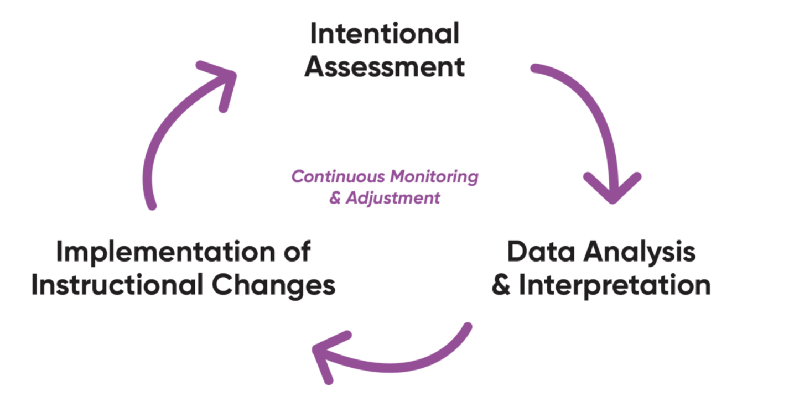
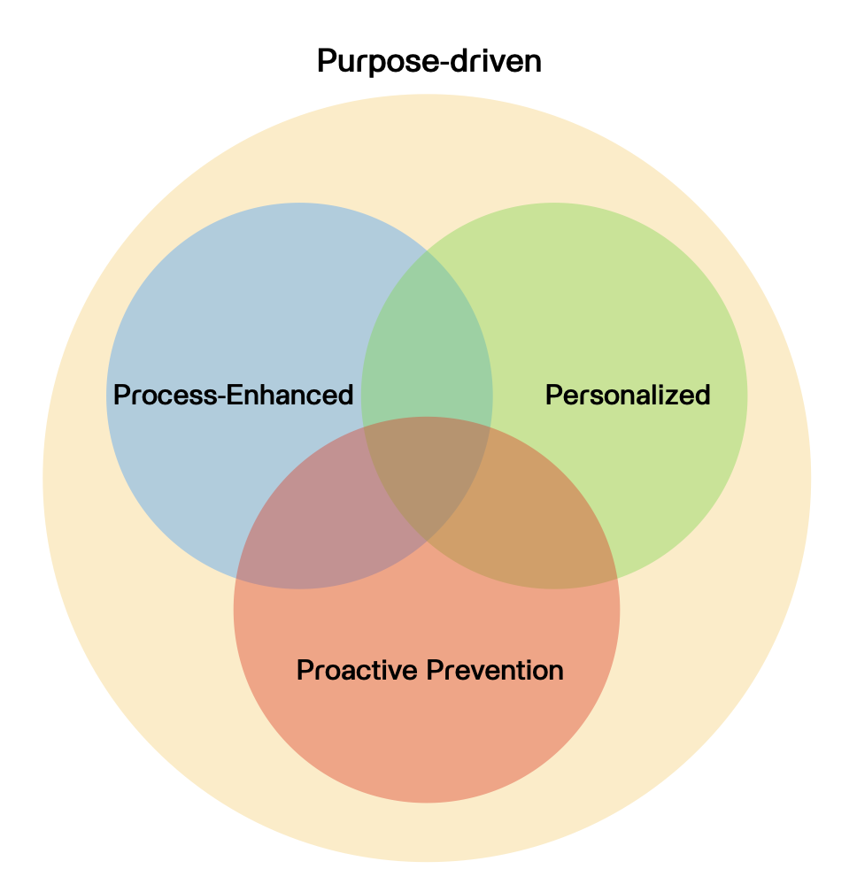

## องค์ประกอบของการจัดการเรียนรู้ {.smaller}

- **Objectives** -- จะให้ผู้เรียน "เปลี่ยนอะไร" 

- **Learning Experiences** -- จะพาผู้เรียน "เปลี่ยนอย่างไร"

- **Evaluation** -- จะรู้ได้ยังไงว่า "ผู้เรียนเปลี่ยนไปแล้วจริง ๆ "

{width="60%"}

## Data-Driven Classroom

> ปัญหาของการสอนแบบดั้งเดิมคือการที่ Evaluation มักถูกใช้แค่ตอนจบ

{width="100%"}

## Data-Driven Classroom

> Evaluation == แหล่งข้อมูล/สารสนเทศหลัก เพื่อการตัดสินใจ

|OLE|ความหมายในบริบท Data-Driven Classroom|
|--|----|
|Objectives| เป้าหมายการเรียนรู้/ผลลัพธ์การเรียนรู้ที่คาดหวัง|
|Learning Experiences| การสอน/กิจกรรม/intervention|
|Evaluation| ระบบการประเมิน/Data Engine:   Intentional Assessment $\rightarrow$ Data Analysis $\rightarrow$ Decision |

{width="40%"}

## Intentional Assessment: ความหมาย {.smaller}

> กระบวนการเก็บรวบรวมข้อมูลผู้เรียนอย่างเป็นระบบและต่อเนื่อง โดยมีการกำหนดวัตถุประสงค์ที่ชัดเจนเพื่อสร้างสารสนเทศเชิงลึก สารสนเทศดังกล่าวใช้เป็นฐานในการตัดสินใจ ดำเนินการป้องกัน กำกับติดตาม พัฒนา หรือแก้ไขปัญหาการเรียนรู้ตามความต้องการที่แตกต่างกันของผู้เรียน

- เป็นกลไกภายใต้ระบบการจัดการเรียนรู้ที่ใช้ข้อมูลเป็นฐาน ไม่ใช้ประเภทของการประเมินใหม่

- เป็นกรอบแนวคิดที่ช่วยกำหนด 3 เรื่อง

    - จะเก็บข้อมูลอะไร : หลักฐาน/ตัวชี้วัด  $\rightarrow$ เชื่อมโยงกับ Objectives

    - จะเก็บเมื่อไหร่ : ก่อนเรียน/ระหว่างเรียน/หลังเรียน

    - เพื่อนำไปสู่การตัดสินใจอะไร : วางแผนก่อนสอน ปรับกิจกรรม ให้ feedback หรือ กำกับติดตามการเรียนรู้รายบุคคล $\rightarrow$ เชื่อมโยงกับกรอบ AoL, AfL, AaL

## Intentional Assessment: ความสำคัญ {.smaller}

> กระบวนการเก็บรวบรวมข้อมูลผู้เรียนอย่างเป็นระบบและต่อเนื่อง โดยมีการกำหนดวัตถุประสงค์ที่ชัดเจนเพื่อสร้างสารสนเทศเชิงลึก สารสนเทศดังกล่าวใช้เป็นฐานในการตัดสินใจ ดำเนินการป้องกัน กำกับติดตาม พัฒนา หรือแก้ไขปัญหาการเรียนรู้ตามความต้องการที่แตกต่างกันของผู้เรียน

- ทำความเข้าใจทั้งความก้าวหน้าและอุปสรรคของผู้เรียน

- ให้ข้อเสนอแนะที่นำไปใช้ได้จริง (actionable feedback)

- นำไปสู่การช่วยเหลือเชิงรุกอย่างแม่นยำและทันท่วงที เพื่อการพัฒนาผู้เรียนอย่างต่อเนื่อง

## หลักการออกแบบ Intentional assessment {.smaller}

> Data/Evidence ที่ดี ควรถูกออกแบบให้มองเห็นอะไรได้บ้าง

กรอบแนวคิดที่กำกับการออกแบบเพื่อให้การประเมินสามารถสร้างข้อมูล/หลักฐาน ที่ใช้ตัดสินใจได้จริง และเชื่อมโยงกับการเรียนรู้ของผู้เรียนอย่างต่อเนื่อง

:::: {.columns}

::: {.column width="60%"}

1. Purpose-Driven (ยึดเป้าหมายการเรียนรู้)

2. Process-Enhanced (มุ่งทำความเข้าใจกระบวนการเรียนรู้)

3. Personalized (ตอบสนองความแตกต่างของผู้เรียน)

4. Proactive Prevention (ป้องกันเชิงรุกด้วยข้อมูล)

:::

::: {.column width="40%"}

{width="90%"}

:::

::::

## 1. Purpose-Driven :  Objectives $\iff$ Evidence $\iff$ Criteria {.smaller}

> ยึดผลลัพธ์หรือวัตถุประสงค์ของการเรียนรู้เป็นแกนหลักในการออกแบบการประเมิน

- กำหนดหลักฐาน ข้อมูล หรือตัวชี้วัด ที่สามารถสะท้อนเป้าหมายได้โดยตรง

- ออกแบบภาระงาน (task) และเครื่องมือประเมินให้เกิดหลักฐานที่สอดคล้องกับเป้าหมาย

- นิยามเป้าหมายในรูปแบบวัตถุประสงค์เชิงพฤติกรรม (วัดได้ สังเกตได้) : เงื่อนไข + พฤติกรรม + เกณฑ์
    
    - "เมื่อได้รับการจัดการเรียนรู้เรื่อง X แล้ว ผู้เรียนจะจำแนกความแตกต่างระหว่าง A กับ B ได้อย่างถูกต้องไม่น้อยกว่า 80% ของครั้งที่ทดสอบ"

    - "เมื่อทำกิจกรรม Y เสร็จ ผู้เรียนจะสามารถอธิบายขั้นตอนการทำงาน Z ได้อย่างถูกต้องครบถ้วนตามเกณฑ์ที่กำหนด"

## 2. Process-Enhanced : เก็บหลักฐานของ progress ระหว่างเรียน {.smaller}

> มุ่งเน้นการประเมินการเรียนรู้ระหว่างทาง/กระบวนการเรียนรู้/กระบวนการคิด/กระบวนการทำงาน มากกว่าผลลัพธ์สุดท้าย

- การประเมินที่ดำเนินการควบคู่ไปกับกระบวนการเรียนรู้ $\rightarrow$ ช่วยให้ครูเข้าใจกระบวนการ ความก้าวหน้า และอุปสรรคของผู้เรียน และปรับได้ทันเวลา

- ประเมินผ่านชิ้นงานที่แสดงกระบวนการคิด กระบวนการทำงาน เช่น โครงงาน แฟ้มสะสมผลงาน (portfolio) การสะท้อนคิด (reflection) หรือการสังเกตจากร่องรอยการทำงานพฤติกรรมระหว่างการทำงาน/การเรียนรู้ของผู้เรียน

## 3. Personalized : Evidence นำไปสู่การตัดสินใจที่แตกต่างกัน ภายใต้เป้าหมายเดียวกัน {.smaller}

> เป้าหมายเดียวกัน แต่เส้นทาง/จังหวะการเรียนรู้อาจต่างกัน

- ออกแบบการประเมินที่ยืดหยุ่น สอดคล้องกับความต้องการและศักยภาพของผู้เรียนที่แตกต่างกัน

    - การกำหนด Task หลายระดับ หรือหลายทางเลือก

    - การออกแบบการสนับสนุน กิจกรรม หรือ feedback ที่สัมพันธ์กับหลักฐานที่พบจริง

## 4. Proactive Prevention : Evidence ช่วยให้เห็นสัญญาณก่อนเกิดปัญหา {.smaller}

> ใช้การประเมินเพื่อตรวจจับสัญญาณเสี่ยงล่วงหน้า (early warning signs) และวางแผนช่วยเหลือเชิงรุก

- ออกแบบจุดการเก็บข้อมูลเป็นช่วง ๆ เพื่อใช้กำกับติดตามแนวโน้มการเรียนรู้ของนักเรียน

- เชื่อมโยงการประเมินกับการช่วยเหลือเชิงรุก เช่น การปรับกิจกรรม/เสริมทักษะ/ให้คำแนะนำเฉพาะบุคคล ก่อนปัญหาจะบานปลาย

## 4P $\iff$ Evidence $\iff$ Decision {.smaller}

| หลักการออกแบบ (4P) | Evidence ที่ควรเก็บ | ใช้ข้อมูลเพื่อการตัดสินใจ (Decision) |
|-|---|---|
| **Purpose-driven** (ยึดเป้าหมาย) | - หลักฐานที่สะท้อนผลลัพธ์การเรียนรู้โดยตรง - ชิ้นงาน/การแสดงพฤติกรรมที่ผูกกับ Objective และเกณฑ์ชัดเจน | **AoL**: ตัดสินผลการบรรลุเป้าหมาย **AfL**: ชี้จุดที่ยังไม่ถึงเป้าหมายเพื่อปรับการสอน |
| **Process-enhanced** (เน้นกระบวนการ) | - ร่องรอยการเรียนรู้ระหว่างทาง - ขั้นตอนการคิด การทำงาน การลองผิดลองถูก - Reflection / Portfolio / Observation | **AfL**: ปรับกิจกรรมและให้ feedback ระหว่างเรียน **AaL**: กระตุ้นผู้เรียนสะท้อนคิดและกำกับการเรียนรู้ตนเอง |
| **Personalized** (ตอบสนองรายบุคคล) | - หลักฐานรายบุคคลที่สะท้อนจุดแข็ง จุดอ่อน และความก้าวหน้าเฉพาะคน - ผลการทำ task ที่แตกต่างตามเส้นทางการเรียนรู้ |**AoL**: สรุปภาพรวม/ผลลัพธ์รายบุคคลหรือกลุ่มย่อย หรือ ประเมินผลการช่วยเหลือ  **AfL**: ให้ feedback และการสนับสนุนเฉพาะบุคคล **AaL**: ช่วยผู้เรียนตั้งเป้าและติดตามความก้าวหน้าของตนเอง |
| **Proactive prevention** (ป้องกันเชิงรุก) | - ข้อมูลแนวโน้ม (trend) ของพฤติกรรม/ผลการเรียน - สัญญาณเตือนความเสี่ยง (early warning signals) | **AfL**: ปรับการสอนและช่วยเหลือก่อนปัญหาลุกลาม **AaL**: สร้างการตระหนักรู้และการขอความช่วยเหลือของผู้เรียน |

## AoL/AfL/AaL as Decision Modes in Data-Driven Classroom {.smaller}

> ใครใช้ข้อมูล และใช้เพื่อเปลี่ยนอะไร?

| Decision Mode | ใครใช้ Evidence | ใช้ตอนไหน | ใช้เพื่ออะไร |
|-|--|--|---|
| **AoL** | ครู / โรงเรียน | หลังช่วงการเรียนรู้ | ตัดสินระดับการบรรลุเป้าหมาย สรุปผล/รายงาน/ประเมินคุณภาพ |
| **AfL** | ครู (ร่วมกับผู้เรียน) | ระหว่างการเรียนรู้ | ปรับกิจกรรมการสอน ให้ feedback ที่ตรงจุด |
| **AaL** | ผู้เรียน | ระหว่าง–หลังการเรียนรู้ | ปรับกลยุทธ์การเรียนรู้ตนเอง ตั้งเป้าและติดตามความก้าวหน้า |

## กรอบการประเมินแบบมีเป้าหมาย 3 ระดับ {.smaller}

> การใช้ข้อมูลจากการประเมินในการวิเคราะห์และตัดสินใจสามารถทำได้หลายจังหวะ

1. Predictive Assessment: การประเมินที่มีจุดประสงค์เพื่อระบุและคาดการณ์ผู้เรียนที่มีแนวโน้มหรือความเสี่ยงที่จะประสบปัญหาในอนาคต เพื่อให้สามารถป้องกันล่วงหน้า (prevention) ก่อนที่ปัญหาจะเกิดขึ้นจริง

2. Responsive Assessment: การประเมินที่มีจุดประสงค์เพื่อติดตามความก้าวหน้าอย่างต่อเนื่องระหว่างกระบวนการเรียนรู้ และตอบสนองทันทีเมื่อพบปัญหา เพื่อปรับการสอนหรือให้ความช่วยเหลือได้ทันท่วงที (responsive/formative)

3. Summative Assessment: การวิเคราะห์สรุปรวมข้อมูลทั้งหมดที่เก็บได้ตลอดกระบวนการเรียนรู้ เพื่อทำความเข้าใจภาพรวม ระบุ patterns/ความสัมพันธ์(ระหว่างพฤติกรรมการเรียนรู้กับผลลัพธ์การเรียนรู้ที่คาดหวัง) และนำไปใช้ปรับปรุงการออกแบบการเรียนรู้ หลักสูตร และการประเมินในครั้งต่อไป

## Predictive Assessment 

> ระบุและคาดการณ์ความเสี่ยงล่วงหน้า เพื่อป้องกันก่อนเกิดปัญหา

- Purpose: prevention / early intervention

- Data: แนวโน้ม พฤติกรรมสะสม ร่องรอย/สัญญาณเสี่ยงในช่วงแรก

- Analysis: Descriptive / Predictive analytics

- Use: ออกแบบการช่วยเหลือเชิงรุก

## Responsive Assessment

> กำกับติดตามความก้าวหน้า และตอบสนองทันทีระหว่างการจัดการเรียนรู้

- Purpose: formative feedback / just-in-time support

- Data: หลักฐานระหว่างทาง เช่น ร่องรอยพฤติกรรม กระบวนการคิด หรือมโนทัศน์ที่คลาดเคลื่อนระหว่างเรียน

- Analysis: Descriptive / Diagnostic analytics

- Use: ปรับกิจกรรมการสอน / ให้ feedback ระหว่างเรียน 

## Summative/Intensive Assessment

> สรุปภาพรวม หรือการประเมินถอดบทเรียนเชิงลึกจากการจัดการเรียนรู้ที่ผ่านมา และเพื่อปรับปรุงในอนาคต

- Purpose: Evaluative/Understanding/program improvement

- Data: ข้อมูลทั้งหมดที่เก็บได้ตลอดกระบวนการเรียนรู้

- Analysis: Descriptive / Diagnostic / Predictive Analytics

- Use: ประเมินผลการจัดการเรียนรู้ที่ผ่านมา / ปรับปรุงการออกแบบการเรียนรู้ในอนาคต / ปรับปรุงรายวิชาหรือหลักสูตร หรือการประเมินผล

## ภาพรวมของการจัดการเรียนรู้ที่ใช้ข้อมูลเป็นฐาน {.smaller}

## References
