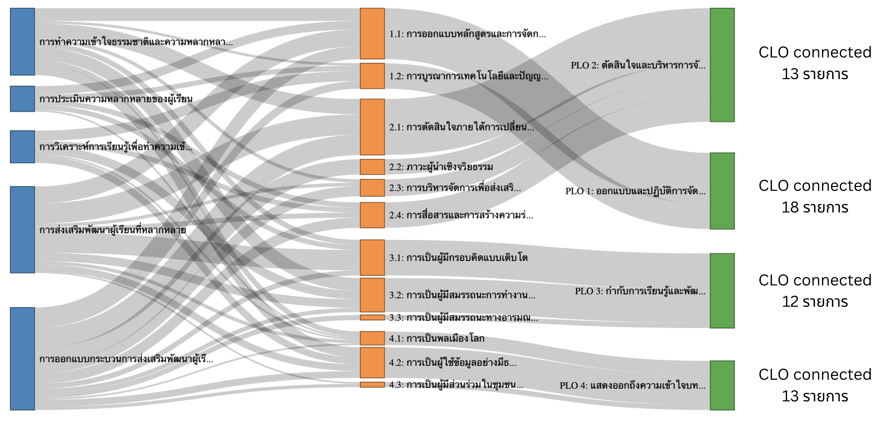

## 📊 Key Performance Indicators : Coverage {.smaller}


- รายวิชาของภาคฯ ครอบคลุม **PLO ทั้งหมด (4/4 = 100%)**  

- ครอบคลุม **Sub-PLO ทั้งหมด (12/12 = 100%)**  

- Multi-Course Support: ทุก PLOs ได้รับการสนับสนุนจากทุกรายวิชา


{width="55%"}


## Synergy ของรายวิชา {.smaller}

รายวิชาของภาคฯ เชื่อมโยงกันเป็นลำดับขั้น เกิดความต่อเนื่องในการพัฒนาสมรรถนะของผู้เรียน


```{r message = F}
library(circlize)

library(circlize)

# สร้าง adjacency matrix
courses <- c("การทำความเข้าใจ", "การประเมิน", "การวิเคราะห์", "การส่งเสริม", "การออกแบบ")
adj_matrix <- matrix(0, nrow = 5, ncol = 5, dimnames = list(courses, courses))

# Fill matrix with connection data  
adj_matrix["การทำความเข้าใจ", "การประเมิน"] <- 13
adj_matrix["การทำความเข้าใจ", "การวิเคราะห์"] <- 8
adj_matrix["การทำความเข้าใจ", "การส่งเสริม"] <- 22
adj_matrix["การทำความเข้าใจ", "การออกแบบ"] <- 8
adj_matrix["การประเมิน", "การวิเคราะห์"] <- 5
adj_matrix["การประเมิน", "การส่งเสริม"] <- 12
adj_matrix["การประเมิน", "การออกแบบ"] <- 5
adj_matrix["การวิเคราะห์", "การส่งเสริม"] <- 4
adj_matrix["การวิเคราะห์", "การออกแบบ"] <- 7
adj_matrix["การส่งเสริม", "การออกแบบ"] <- 9

# Make symmetric
adj_matrix <- adj_matrix + t(adj_matrix)


par(family = "ChulaCharasNew")
# สำหรับ presentation ที่สวยงาม
circos.clear()
circos.par(start.degree = 90, gap.degree = 6, 
          track.margin = c(0.01, 0.01))

# ปรับสีให้เด่นชัด
course_colors <- c("การทำความเข้าใจ" = "#c0392b",     # แดงเข้ม (Hub)
                  "การประเมิน" = "#2980b9",           # ฟ้าเข้ม  
                  "การวิเคราะห์" = "#8e44ad",         # ม่วง
                  "การส่งเสริม" = "#27ae60",          # เขียว
                  "การออกแบบ" = "#d35400")           # ส้ม

chordDiagram(adj_matrix, 
            grid.col = course_colors,
            transparency = 0.2,
            directional = 0,
            link.border = "white",
            annotationTrack = "grid",
            preAllocateTracks = list(track.height = 0.3))

# ปรับการแสดงชื่อ
circos.track(track.index = 1, panel.fun = function(x, y) {
  sector.name = CELL_META$sector.index
  circos.text(CELL_META$xcenter, CELL_META$ylim[1] - 0.2, sector.name, 
              facing = "clockwise", niceFacing = TRUE, 
              adj = c(0, 0.5), cex = 1, font = 2, col = "black")
}, bg.border = NA)


circos.clear()
```

<div class="caption">Chord Diagram: การเชื่อมโยงรายวิชาของภาคฯ ผ่าน Keyword และ Sub-Competency</div>


## Methodology: Metrics ที่ใช้ {.smaller}

<div style="font-size:75%;">

- **Coverage (%) –- รายวิชาของภาคฯ ครอบคลุมครบทุก PLO และ Sub-PLO หรือไม่**

<div style="text-indent: 3em;">
`coverage = %PLO ที่รายวิชาครอบคลุม`
</div>

- **Alignment --  ความเชื่อมโยงของรายวิชาของภาคฯ กับ PLO มีความแข็งแรงมากแค่ไหน**

<div style="text-indent: 3em;">
`alignment = f(connection_count,keyword_intensity, unique_sub_plo)`
</div>

- **Concentration (Entropy-based) -- ใช้ Shannon Entropy วัดระดับการกระจายของการเชื่อมโยงรายวิชาของภาคฯ ไปยัง PLO ต่าง ๆ**

<div style="text-indent: 3em;">
`concentration (H) = Σ p_i log(p_i)`

`โดยที่ p_i = #mapping_in_PLO_i/total mapping`
</div>


- **Balance -- การแจกแจงของเนื้อหาในรายวิชาเป็นไปอย่างสม่ำเสมอใน PLO ต่าง ๆ** หรือไม่ 

<div style="text-indent: 3em;">
`balance = 1 - |actual prop - expected prop (=.25)|`
</div>

- **Strategic Importance -- potential ROI** ประเมินศักยภาพของรายวิชา ว่าจะสร้างผลตอบแทนเชิงสมรรถนะได้มากแค่ไหน เมื่อถูกนำไปใช้จริง

<div style="text-indent: 3em;">
`strategic_score = f(lift_score, coverage, #high_val_keywords, hours)`
</div>

</div>ท


